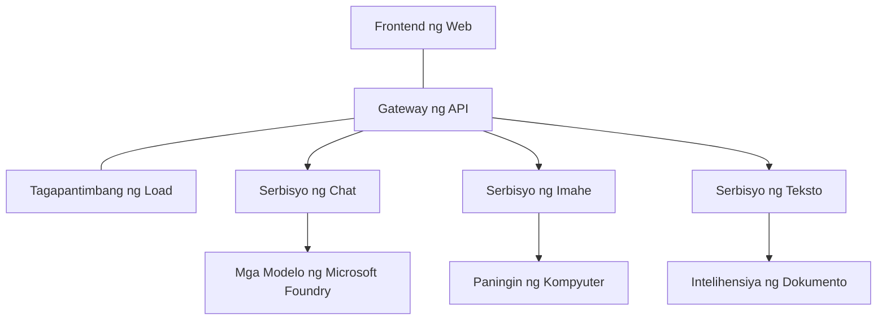

# Mga Pinakamahuhusay na Gawain para sa Production AI Workloads gamit ang AZD

**Chapter Navigation:**
- **📚 Tahanan ng Kurso**: [AZD Para sa mga Nagsisimula](../../README.md)
- **📖 Kasalukuyang Kabanata**: Kabanata 8 - Mga Pattern para sa Produksyon at Enterprise
- **⬅️ Nakaraang Kabanata**: [Kabanata 7: Pag-troubleshoot](../chapter-07-troubleshooting/debugging.md)
- **⬅️ Kaugnay din**: [AI Workshop Lab](ai-workshop-lab.md)
- **🎯 Kumpletuhin ang Kurso**: [AZD Para sa mga Nagsisimula](../../README.md)

## Pangkalahatang-ideya

Ang gabay na ito ay nagbibigay ng komprehensibong pinakamahusay na mga gawi para sa pag-deploy ng production-ready na AI workloads gamit ang Azure Developer CLI (AZD). Batay sa feedback mula sa Microsoft Foundry Discord community at mga tunay na deployment ng customer, tinutugunan ng mga gawi na ito ang mga pinaka-karaniwang hamon sa production AI systems.

## Pangunahing Mga Hamong Tinugunan

Batay sa resulta ng aming poll sa komunidad, ito ang mga nangungunang hamon na kinakaharap ng mga developer:

- **45%** nahihirapan sa pag-deploy ng multi-service na AI
- **38%** may mga isyu sa pamamahala ng credential at mga secret  
- **35%** nahihirapan sa pagiging production-ready at scaling
- **32%** nangangailangan ng mas mahusay na mga estratehiya sa pag-optimize ng gastos
- **29%** nangangailangan ng pinahusay na pagmo-monitor at pag-troubleshoot

## Mga Pattern ng Arkitektura para sa Production AI

### Pattern 1: Arkitekturang Microservices para sa AI

**Kung kailan gagamitin**: Mga komplikadong AI na aplikasyon na may maraming kakayahan


**Implementasyon sa AZD**:

```yaml
# azure.yaml
name: enterprise-ai-platform
services:
  web:
    project: ./web
    host: staticwebapp
  api-gateway:
    project: ./api-gateway
    host: containerapp
  chat-service:
    project: ./services/chat
    host: containerapp
  vision-service:
    project: ./services/vision
    host: containerapp
  text-service:
    project: ./services/text
    host: containerapp
```

### Pattern 2: Pagpoproseso ng AI na Pinapatakbo ng Kaganapan

**Kung kailan gagamitin**: Batch na pagpoproseso, pagsusuri ng dokumento, mga asynchronous na workflow

```bicep
// Event Hub for AI processing pipeline
resource eventHub 'Microsoft.EventHub/namespaces@2023-01-01-preview' = {
  name: eventHubNamespaceName
  location: location
  sku: {
    name: 'Standard'
    tier: 'Standard'
    capacity: 1
  }
}

// Service Bus for reliable message processing
resource serviceBus 'Microsoft.ServiceBus/namespaces@2022-10-01-preview' = {
  name: serviceBusNamespaceName
  location: location
  sku: {
    name: 'Premium'
    tier: 'Premium'
    capacity: 1
  }
}

// Function App for processing
resource functionApp 'Microsoft.Web/sites@2023-01-01' = {
  name: functionAppName
  location: location
  kind: 'functionapp,linux'
  properties: {
    siteConfig: {
      appSettings: [
        {
          name: 'FUNCTIONS_EXTENSION_VERSION'
          value: '~4'
        }
        {
          name: 'AZURE_OPENAI_ENDPOINT'
          value: '@Microsoft.KeyVault(VaultName=${keyVault.name};SecretName=openai-endpoint)'
        }
      ]
    }
  }
}
```

## Pag-iisip tungkol sa Kalusugan ng AI Agent

Kapag ang isang tradisyunal na web app ay nasira, pamilyar ang mga sintomas: hindi naglo-load ang pahina, nagbabalik ng error ang API, o nabigo ang deployment. Maaaring masira ang mga AI-powered na aplikasyon sa lahat ng parehong paraan—ngunit maaari rin silang kumilos nang hindi tama sa mga mas pinong paraan na hindi naglalabas ng malinaw na mga mensahe ng error.

Tinutulungan ka ng seksyong ito na bumuo ng mental model para sa pagmo-monitor ng AI workloads upang malaman mo kung saan tumingin kapag may hindi mukhang tama.

### Paano Naiiba ang Kalusugan ng Agent mula sa Kalusugan ng Tradisyunal na App

Ang tradisyunal na app ay gumagana o hindi. Maaaring mukhang gumagana ang isang AI agent ngunit magbigay ng mahinang resulta. Isipin ang kalusugan ng agent sa dalawang layer:

| Antas | Ano ang Obserbahan | Saan Titingnan |
|-------|--------------|---------------|
| **Kalusugan ng imprastruktura** | Nakatakbo ba ang serbisyo? Na-provision ba ang mga resource? Maabot ba ang mga endpoint? | `azd monitor`, Azure Portal resource health, container/app logs |
| **Kalusugan ng pag-uugali** | Tumutugon ba ang agent nang tama? Napapanahon ba ang mga tugon? Tama bang tinatawag ang modelo? | Application Insights traces, model call latency metrics, response quality logs |

Pamilyar ang kalusugan ng imprastruktura—pareho ito para sa anumang azd app. Ang kalusugan ng pag-uugali ang bagong layer na ipinakikilala ng AI workloads.

### Saan Titingnan Kapag Hindi Kumilos ang AI na mga App ayon sa Inaasahan

Kung hindi nagbibigay ang iyong AI application ng inaasahang resulta, narito ang isang konseptwal na checklist:

1. **Magsimula sa mga batayan.** Nakatakbo ba ang app? Maaabot ba nito ang mga dependencies nito? Suriin ang `azd monitor` at resource health tulad ng gagawin mo para sa anumang app.
2. **Suriin ang koneksyon sa modelo.** Tinatawag ba ng iyong aplikasyon nang matagumpay ang AI model? Ang mga nabigong o nag-timeout na tawag sa modelo ang pinaka-karaniwang sanhi ng mga isyu sa AI app at makikita sa iyong application logs.
3. **Tingnan kung ano ang natanggap ng modelo.** Nakadepende ang mga tugon ng AI sa input (ang prompt at anumang narekober na context). Kung mali ang output, kadalasan mali ang input. Suriin kung nagpapadala ba ang iyong aplikasyon ng tamang data sa modelo.
4. **Suriin ang latency ng tugon.** Mas mabagal ang mga tawag sa AI model kaysa sa karaniwang API calls. Kung mabagal ang pakiramdam ng iyong app, tingnan kung tumaas ang oras ng tugon ng modelo—ito ay maaaring magpahiwatig ng throttling, limitasyon ng kapasidad, o congestion sa antas ng rehiyon.
5. **Magbantay para sa mga signal ng gastos.** Ang hindi inaasahang pagtaas sa paggamit ng token o API calls ay maaaring magpahiwatig ng loop, maling pagkokonpigura ng prompt, o sobrang retries.

Hindi mo kailangang maging eksperto agad sa mga observability tooling. Ang pangunahing takeaway ay may dagdag na layer ng pag-uugali na dapat imonitor ang mga AI application, at ang built-in na monitoring ng azd (`azd monitor`) ay nagbibigay ng panimulang punto para imbestigahan ang parehong layer.

---

## Mga Pinakamahuhusay na Gawi sa Seguridad

### 1. Zero-Trust Security Model

**Istratehiya ng Implementasyon**:
- Walang komunikasyon sa pagitan ng serbisyo nang walang authentication
- Lahat ng API calls gumagamit ng managed identities
- Network isolation gamit ang private endpoints
- Mga access control na naka-least privilege

```bicep
// Managed Identity for each service
resource chatServiceIdentity 'Microsoft.ManagedIdentity/userAssignedIdentities@2023-01-31' = {
  name: 'chat-service-identity'
  location: location
}

// Role assignments with minimal permissions
resource openAIUserRole 'Microsoft.Authorization/roleAssignments@2022-04-01' = {
  scope: openAIAccount
  name: guid(openAIAccount.id, chatServiceIdentity.id, openAIUserRoleDefinitionId)
  properties: {
    roleDefinitionId: subscriptionResourceId('Microsoft.Authorization/roleDefinitions', '5e0bd9bd-7b93-4f28-af87-19fc36ad61bd')
    principalId: chatServiceIdentity.properties.principalId
    principalType: 'ServicePrincipal'
  }
}
```

### 2. Secure Secret Management

**Key Vault Integration Pattern**:

```bicep
// Key Vault with proper access policies
resource keyVault 'Microsoft.KeyVault/vaults@2023-02-01' = {
  name: keyVaultName
  location: location
  properties: {
    tenantId: tenant().tenantId
    sku: {
      family: 'A'
      name: 'premium'  // Use premium for production
    }
    enableRbacAuthorization: true  // Use RBAC instead of access policies
    enablePurgeProtection: true    // Prevent accidental deletion
    enableSoftDelete: true
    softDeleteRetentionInDays: 90
  }
}

// Store all AI service credentials
resource openAIKeySecret 'Microsoft.KeyVault/vaults/secrets@2023-02-01' = {
  parent: keyVault
  name: 'openai-api-key'
  properties: {
    value: openAIAccount.listKeys().key1
    attributes: {
      enabled: true
    }
  }
}
```

### 3. Network Security

**Private Endpoint Configuration**:

```bicep
// Virtual Network for AI services
resource virtualNetwork 'Microsoft.Network/virtualNetworks@2023-04-01' = {
  name: vnetName
  location: location
  properties: {
    addressSpace: {
      addressPrefixes: ['10.0.0.0/16']
    }
    subnets: [
      {
        name: 'ai-services-subnet'
        properties: {
          addressPrefix: '10.0.1.0/24'
          privateEndpointNetworkPolicies: 'Disabled'
        }
      }
      {
        name: 'app-services-subnet'
        properties: {
          addressPrefix: '10.0.2.0/24'
          delegations: [
            {
              name: 'Microsoft.Web/serverFarms'
              properties: {
                serviceName: 'Microsoft.Web/serverFarms'
              }
            }
          ]
        }
      }
    ]
  }
}

// Private endpoints for all AI services
resource openAIPrivateEndpoint 'Microsoft.Network/privateEndpoints@2023-04-01' = {
  name: '${openAIAccountName}-pe'
  location: location
  properties: {
    subnet: {
      id: virtualNetwork.properties.subnets[0].id
    }
    privateLinkServiceConnections: [
      {
        name: 'openai-connection'
        properties: {
          privateLinkServiceId: openAIAccount.id
          groupIds: ['account']
        }
      }
    ]
  }
}
```

## Pagganap at Scaling

### 1. Mga Estratehiya ng Auto-Scaling

**Container Apps Auto-scaling**:

```bicep
resource containerApp 'Microsoft.App/containerApps@2023-05-01' = {
  name: containerAppName
  location: location
  properties: {
    configuration: {
      ingress: {
        external: true
        targetPort: 8000
        transport: 'http'
      }
    }
    template: {
      scale: {
        minReplicas: 2  // Always have 2 instances minimum
        maxReplicas: 50 // Scale up to 50 for high load
        rules: [
          {
            name: 'http-scaling'
            http: {
              metadata: {
                concurrentRequests: '20'  // Scale when >20 concurrent requests
              }
            }
          }
          {
            name: 'cpu-scaling'
            custom: {
              type: 'cpu'
              metadata: {
                type: 'Utilization'
                value: '70'  // Scale when CPU >70%
              }
            }
          }
        ]
      }
    }
  }
}
```

### 2. Mga Estratehiya sa Caching

**Redis Cache para sa Mga Tugon ng AI**:

```bicep
// Redis Premium for production workloads
resource redisCache 'Microsoft.Cache/redis@2023-04-01' = {
  name: redisCacheName
  location: location
  properties: {
    sku: {
      name: 'Premium'
      family: 'P'
      capacity: 1
    }
    enableNonSslPort: false
    minimumTlsVersion: '1.2'
    redisConfiguration: {
      'maxmemory-policy': 'allkeys-lru'
    }
    // Enable clustering for high availability
    redisVersion: '6.0'
    shardCount: 2
  }
}

// Cache configuration in application
var cacheConnectionString = '${redisCache.properties.hostName}:6380,password=${redisCache.listKeys().primaryKey},ssl=True,abortConnect=False'
```

### 3. Load Balancing at Traffic Management

**Application Gateway na may WAF**:

```bicep
// Application Gateway with Web Application Firewall
resource applicationGateway 'Microsoft.Network/applicationGateways@2023-04-01' = {
  name: appGatewayName
  location: location
  properties: {
    sku: {
      name: 'WAF_v2'
      tier: 'WAF_v2'
      capacity: 2
    }
    webApplicationFirewallConfiguration: {
      enabled: true
      firewallMode: 'Prevention'
      ruleSetType: 'OWASP'
      ruleSetVersion: '3.2'
    }
    // Backend pools for AI services
    backendAddressPools: [
      {
        name: 'ai-services-pool'
        properties: {
          backendAddresses: [
            {
              fqdn: '${containerApp.properties.configuration.ingress.fqdn}'
            }
          ]
        }
      }
    ]
  }
}
```

## 💰 Optimisasyon ng Gastos

### 1. Tamang Sukat ng mga Resource

**Mga Konfigurasyon na Nakabatay sa Kapaligiran**:

```bash
# Kapaligiran ng pag-unlad
azd env new development
azd env set AZURE_OPENAI_SKU "S0"
azd env set AZURE_OPENAI_CAPACITY 10
azd env set AZURE_SEARCH_SKU "basic"
azd env set CONTAINER_CPU 0.5
azd env set CONTAINER_MEMORY 1.0

# Kapaligiran ng produksyon
azd env new production
azd env set AZURE_OPENAI_SKU "S0"
azd env set AZURE_OPENAI_CAPACITY 100
azd env set AZURE_SEARCH_SKU "standard"
azd env set CONTAINER_CPU 2.0
azd env set CONTAINER_MEMORY 4.0
```

### 2. Pagmo-monitor ng Gastos at mga Badyet

```bicep
// Cost management and budgets
resource budget 'Microsoft.Consumption/budgets@2023-05-01' = {
  name: 'ai-workload-budget'
  properties: {
    timePeriod: {
      startDate: '2024-01-01'
      endDate: '2024-12-31'
    }
    timeGrain: 'Monthly'
    amount: 2000  // $2000 monthly budget
    category: 'Cost'
    notifications: {
      warning: {
        enabled: true
        operator: 'GreaterThan'
        threshold: 80
        contactEmails: [
          'finance@company.com'
          'engineering@company.com'
        ]
        contactRoles: [
          'Owner'
          'Contributor'
        ]
      }
      critical: {
        enabled: true
        operator: 'GreaterThan'
        threshold: 95
        contactEmails: [
          'cto@company.com'
        ]
      }
    }
  }
}
```

### 3. Pag-optimize ng Paggamit ng Token

**OpenAI Cost Management**:

```typescript
// Pag-optimize ng token sa antas ng aplikasyon
class TokenOptimizer {
  private readonly maxTokens = 4000;
  private readonly reserveTokens = 500;
  
  optimizePrompt(userInput: string, context: string): string {
    const availableTokens = this.maxTokens - this.reserveTokens;
    const estimatedTokens = this.estimateTokens(userInput + context);
    
    if (estimatedTokens > availableTokens) {
      // Putulin ang konteksto, hindi ang input ng gumagamit
      context = this.truncateContext(context, availableTokens - this.estimateTokens(userInput));
    }
    
    return `${context}\n\nUser: ${userInput}`;
  }
  
  private estimateTokens(text: string): number {
    // Tinatayang magaspang: 1 token ≈ 4 na karakter
    return Math.ceil(text.length / 4);
  }
}
```

## Pagmo-monitor at Observabilidad

### 1. Komprehensibong Application Insights

```bicep
// Application Insights with advanced features
resource applicationInsights 'Microsoft.Insights/components@2020-02-02' = {
  name: applicationInsightsName
  location: location
  kind: 'web'
  properties: {
    Application_Type: 'web'
    WorkspaceResourceId: logAnalyticsWorkspace.id
    SamplingPercentage: 100  // Full sampling for AI apps
    DisableIpMasking: false  // Enable for security
  }
}

// Custom metrics for AI operations
resource aiMetricAlerts 'Microsoft.Insights/metricAlerts@2018-03-01' = {
  name: 'ai-high-error-rate'
  location: 'global'
  properties: {
    description: 'Alert when AI service error rate is high'
    severity: 2
    enabled: true
    scopes: [
      applicationInsights.id
    ]
    evaluationFrequency: 'PT1M'
    windowSize: 'PT5M'
    criteria: {
      'odata.type': 'Microsoft.Azure.Monitor.SingleResourceMultipleMetricCriteria'
      allOf: [
        {
          name: 'high-error-rate'
          metricName: 'requests/failed'
          operator: 'GreaterThan'
          threshold: 10
          timeAggregation: 'Count'
        }
      ]
    }
  }
}
```

### 2. AI-Specific Monitoring

**Custom Dashboards para sa Mga Metrika ng AI**:

```json
// Dashboard configuration for AI workloads
{
  "dashboard": {
    "name": "AI Application Monitoring",
    "tiles": [
      {
        "name": "OpenAI Request Volume",
        "query": "requests | where name contains 'openai' | summarize count() by bin(timestamp, 5m)"
      },
      {
        "name": "AI Response Latency",
        "query": "requests | where name contains 'openai' | summarize avg(duration) by bin(timestamp, 5m)"
      },
      {
        "name": "Token Usage",
        "query": "customMetrics | where name == 'openai_tokens_used' | summarize sum(value) by bin(timestamp, 1h)"
      },
      {
        "name": "Cost per Hour",
        "query": "customMetrics | where name == 'openai_cost' | summarize sum(value) by bin(timestamp, 1h)"
      }
    ]
  }
}
```

### 3. Health Checks at Uptime Monitoring

```bicep
// Application Insights availability tests
resource availabilityTest 'Microsoft.Insights/webtests@2022-06-15' = {
  name: 'ai-app-availability-test'
  location: location
  tags: {
    'hidden-link:${applicationInsights.id}': 'Resource'
  }
  properties: {
    SyntheticMonitorId: 'ai-app-availability-test'
    Name: 'AI Application Availability Test'
    Description: 'Tests AI application endpoints'
    Enabled: true
    Frequency: 300  // 5 minutes
    Timeout: 120    // 2 minutes
    Kind: 'ping'
    Locations: [
      {
        Id: 'us-east-2-azr'
      }
      {
        Id: 'us-west-2-azr'
      }
    ]
    Configuration: {
      WebTest: '''
        <WebTest Name="AI Health Check" 
                 Id="8d2de8d2-a2b0-4c2e-9a0d-8f9c9a0b8c8d" 
                 Enabled="True" 
                 CssProjectStructure="" 
                 CssIteration="" 
                 Timeout="120" 
                 WorkItemIds="" 
                 xmlns="http://microsoft.com/schemas/VisualStudio/TeamTest/2010" 
                 Description="" 
                 CredentialUserName="" 
                 CredentialPassword="" 
                 PreAuthenticate="True" 
                 Proxy="default" 
                 StopOnError="False" 
                 RecordedResultFile="" 
                 ResultsLocale="">
          <Items>
            <Request Method="GET" 
                     Guid="a5f10126-e4cd-570d-961c-cea43999a200" 
                     Version="1.1" 
                     Url="${webApp.properties.defaultHostName}/health" 
                     ThinkTime="0" 
                     Timeout="120" 
                     ParseDependentRequests="True" 
                     FollowRedirects="True" 
                     RecordResult="True" 
                     Cache="False" 
                     ResponseTimeGoal="0" 
                     Encoding="utf-8" 
                     ExpectedHttpStatusCode="200" 
                     ExpectedResponseUrl="" 
                     ReportingName="" 
                     IgnoreHttpStatusCode="False" />
          </Items>
        </WebTest>
      '''
    }
  }
}
```

## Disaster Recovery at High Availability

### 1. Multi-Region Deployment

```yaml
# azure.yaml - Multi-region configuration
name: ai-app-multiregion
services:
  api-primary:
    project: ./api
    host: containerapp
    env:
      - AZURE_REGION=eastus
  api-secondary:
    project: ./api
    host: containerapp
    env:
      - AZURE_REGION=westus2
```

```bicep
// Traffic Manager for global load balancing
resource trafficManager 'Microsoft.Network/trafficManagerProfiles@2022-04-01' = {
  name: trafficManagerProfileName
  location: 'global'
  properties: {
    profileStatus: 'Enabled'
    trafficRoutingMethod: 'Priority'
    dnsConfig: {
      relativeName: trafficManagerProfileName
      ttl: 30
    }
    monitorConfig: {
      protocol: 'HTTPS'
      port: 443
      path: '/health'
      intervalInSeconds: 30
      toleratedNumberOfFailures: 3
      timeoutInSeconds: 10
    }
    endpoints: [
      {
        name: 'primary-endpoint'
        type: 'Microsoft.Network/trafficManagerProfiles/azureEndpoints'
        properties: {
          targetResourceId: primaryAppService.id
          endpointStatus: 'Enabled'
          priority: 1
        }
      }
      {
        name: 'secondary-endpoint'
        type: 'Microsoft.Network/trafficManagerProfiles/azureEndpoints'
        properties: {
          targetResourceId: secondaryAppService.id
          endpointStatus: 'Enabled'
          priority: 2
        }
      }
    ]
  }
}
```

### 2. Data Backup at Recovery

```bicep
// Backup configuration for critical data
resource backupVault 'Microsoft.DataProtection/backupVaults@2023-05-01' = {
  name: backupVaultName
  location: location
  identity: {
    type: 'SystemAssigned'
  }
  properties: {
    storageSettings: [
      {
        datastoreType: 'VaultStore'
        type: 'LocallyRedundant'
      }
    ]
  }
}

// Backup policy for AI models and data
resource backupPolicy 'Microsoft.DataProtection/backupVaults/backupPolicies@2023-05-01' = {
  parent: backupVault
  name: 'ai-data-backup-policy'
  properties: {
    policyRules: [
      {
        backupParameters: {
          backupType: 'Full'
          objectType: 'AzureBackupParams'
        }
        trigger: {
          schedule: {
            repeatingTimeIntervals: [
              'R/2024-01-01T02:00:00+00:00/P1D'  // Daily at 2 AM
            ]
          }
          objectType: 'ScheduleBasedTriggerContext'
        }
        dataStore: {
          datastoreType: 'VaultStore'
          objectType: 'DataStoreInfoBase'
        }
        name: 'BackupDaily'
        objectType: 'AzureBackupRule'
      }
    ]
  }
}
```

## DevOps at CI/CD Integration

### 1. GitHub Actions Workflow

```yaml
# .github/workflows/deploy-ai-app.yml
name: Deploy AI Application

on:
  push:
    branches: [main]
  pull_request:
    branches: [main]

jobs:
  test:
    runs-on: ubuntu-latest
    steps:
      - uses: actions/checkout@v4
      
      - name: Setup Python
        uses: actions/setup-python@v4
        with:
          python-version: '3.11'
          
      - name: Install dependencies
        run: |
          pip install -r requirements.txt
          pip install pytest
          
      - name: Run tests
        run: pytest tests/
        
      - name: AI Safety Tests
        run: |
          python scripts/test_ai_safety.py
          python scripts/validate_prompts.py

  deploy-staging:
    needs: test
    if: github.event_name == 'pull_request'
    runs-on: ubuntu-latest
    steps:
      - uses: actions/checkout@v4
      
      - name: Setup AZD
        uses: Azure/setup-azd@v1.0.0
        
      - name: Login to Azure
        uses: azure/login@v1
        with:
          creds: ${{ secrets.AZURE_CREDENTIALS }}
          
      - name: Deploy to Staging
        run: |
          azd env select staging
          azd deploy

  deploy-production:
    needs: test
    if: github.ref == 'refs/heads/main'
    runs-on: ubuntu-latest
    steps:
      - uses: actions/checkout@v4
      
      - name: Setup AZD
        uses: Azure/setup-azd@v1.0.0
        
      - name: Login to Azure
        uses: azure/login@v1
        with:
          creds: ${{ secrets.AZURE_CREDENTIALS }}
          
      - name: Deploy to Production
        run: |
          azd env select production
          azd deploy
          
      - name: Run Production Health Checks
        run: |
          python scripts/health_check.py --env production
```

### 2. Infrastructure Validation

```bash
# scripts/validate_infrastructure.sh
#!/bin/bash

echo "Validating AI infrastructure deployment..."

# Suriin kung lahat ng kinakailangang serbisyo ay tumatakbo
services=("openai" "search" "storage" "keyvault")
for service in "${services[@]}"; do
    echo "Checking $service..."
    if ! az resource list --resource-type "Microsoft.CognitiveServices/accounts" --query "[?contains(name, '$service')]" -o tsv; then
        echo "ERROR: $service not found"
        exit 1
    fi
done

# Suriin ang mga deployment ng modelong OpenAI
echo "Validating OpenAI model deployments..."
models=$(az cognitiveservices account deployment list --name $AZURE_OPENAI_NAME --resource-group $AZURE_RESOURCE_GROUP --query "[].name" -o tsv)
if [[ ! $models == *"gpt-35-turbo"* ]]; then
    echo "ERROR: Required model gpt-35-turbo not deployed"
    exit 1
fi

# Subukan ang koneksyon ng serbisyo ng AI
echo "Testing AI service connectivity..."
python scripts/test_connectivity.py

echo "Infrastructure validation completed successfully!"
```

## Production Readiness Checklist

### Seguridad ✅
- [ ] Lahat ng serbisyo ay gumagamit ng managed identities
- [ ] Mga sekretong naka-imbak sa Key Vault
- [ ] Na-konpigura ang private endpoints
- [ ] Naipatupad ang network security groups
- [ ] RBAC na may least privilege
- [ ] WAF naka-enable sa mga public endpoint

### Pagganap ✅
- [ ] Na-konpigura ang auto-scaling
- [ ] Naipatupad ang caching
- [ ] Na-set up ang load balancing
- [ ] CDN para sa static content
- [ ] Database connection pooling
- [ ] Pag-optimize ng paggamit ng token

### Pagmo-monitor ✅
- [ ] Na-konpigura ang Application Insights
- [ ] Nadefine ang custom metrics
- [ ] Na-set up ang alerting rules
- [ ] Nalikha ang dashboard
- [ ] Naipatupad ang health checks
- [ ] Mga patakaran sa pag-retain ng logs

### Kalidad ng Serbisyo (Reliability) ✅
- [ ] Multi-region deployment
- [ ] Plano para sa backup at recovery
- [ ] Naipatupad ang circuit breakers
- [ ] Na-konpigura ang retry policies
- [ ] Graceful degradation
- [ ] Mga health check endpoint

### Pamamahala ng Gastos ✅
- [ ] Na-konpigura ang mga alert para sa badyet
- [ ] Tamang sukat ng mga resource
- [ ] Na-apply ang dev/test discounts
- [ ] Nakabili ng reserved instances
- [ ] Dashboard sa pagmo-monitor ng gastos
- [ ] Regular na pagsusuri ng gastos

### Pagsunod (Compliance) ✅
- [ ] Natugunan ang mga kinakailangan sa data residency
- [ ] Na-enable ang audit logging
- [ ] Na-apply ang mga compliance policy
- [ ] Naipatupad ang security baselines
- [ ] Regular na security assessments
- [ ] Plano para sa incident response

## Mga Benchmark ng Pagganap

### Karaniwang Mga Metrika sa Produksyon

| Metric | Target | Monitoring |
|--------|--------|------------|
| **Response Time** | < 2 seconds | Application Insights |
| **Availability** | 99.9% | Uptime monitoring |
| **Error Rate** | < 0.1% | Application logs |
| **Token Usage** | < $500/month | Cost management |
| **Concurrent Users** | 1000+ | Load testing |
| **Recovery Time** | < 1 hour | Disaster recovery tests |

### Load Testing

```bash
# Script para sa pagsubok ng load ng mga aplikasyon ng AI
python scripts/load_test.py \
  --endpoint https://your-ai-app.azurewebsites.net \
  --concurrent-users 100 \
  --duration 300 \
  --ramp-up 60
```

## 🤝 Mga Pinakamahuhusay na Gawi ng Komunidad

Batay sa feedback mula sa Microsoft Foundry Discord community:

### Nangungunang mga Rekomendasyon mula sa Komunidad:

1. **Magsimula nang Maliit, Mag-scale Nang Paunti-unti**: Magsimula sa mga pangunahing SKU at mag-scale pataas batay sa aktwal na paggamit
2. **I-monitor ang Lahat**: Mag-set up ng komprehensibong pagmo-monitor mula pa sa unang araw
3. **I-automate ang Seguridad**: Gumamit ng infrastructure as code para sa pare-parehong seguridad
4. **Subukan nang Mabuti**: Isama ang AI-specific na testing sa iyong pipeline
5. **Magplano para sa Mga Gastos**: I-monitor ang paggamit ng token at mag-set ng budget alerts nang maaga

### Karaniwang mga Pitfalls na Iwasan:

- ❌ Hardcoding ng API keys sa code
- ❌ Hindi pag-set up ng tamang pagmo-monitor
- ❌ Pagsasantabi sa pag-optimize ng gastos
- ❌ Hindi pagsusuri ng mga failure scenario
- ❌ Pag-deploy nang walang health checks

## Mga AZD AI CLI na Utos at Extensions

Kasama sa AZD ang lumalawak na hanay ng mga AI-specific na utos at extension na nagpapasimple sa production AI workflows. Binubuo ng mga tool na ito ang agwat sa pagitan ng lokal na development at production deployment para sa AI workloads.

### Mga Extension ng AZD para sa AI

Gumagamit ang AZD ng extension system upang magdagdag ng AI-specific na kakayahan. I-install at i-manage ang mga extension gamit ang:

```bash
# Ilista ang lahat ng magagamit na extension (kasama ang AI)
azd extension list

# I-install ang extension na Foundry agents
azd extension install azure.ai.agents

# I-install ang extension para sa fine-tuning
azd extension install azure.ai.finetune

# I-install ang extension para sa mga pasadyang modelo
azd extension install azure.ai.models

# I-upgrade ang lahat ng naka-install na extension
azd extension upgrade --all
```

**Available AI extensions:**

| Extension | Purpose | Status |
|-----------|---------|--------|
| `azure.ai.agents` | Foundry Agent Service management | Preview |
| `azure.ai.finetune` | Foundry model fine-tuning | Preview |
| `azure.ai.models` | Foundry custom models | Preview |
| `azure.coding-agent` | Coding agent configuration | Available |

### Pag-iinitialize ng mga Agent Project gamit ang `azd ai agent init`

Ang `azd ai agent init` na utos ay nag-scaffold ng production-ready na AI agent project na naka-integrate sa Microsoft Foundry Agent Service:

```bash
# Mag-initialize ng bagong proyekto ng agent mula sa agent manifest
azd ai agent init -m <manifest-path-or-uri>

# Mag-initialize at i-target ang isang partikular na proyekto ng Foundry
azd ai agent init -m agent-manifest.yaml --project-id <foundry-project-id>

# Mag-initialize gamit ang pasadyang direktoryo ng source
azd ai agent init -m agent-manifest.yaml --src ./agents/my-agent

# I-target ang Container Apps bilang host
azd ai agent init -m agent-manifest.yaml --host containerapp
```

**Pangunahing flags:**

| Flag | Paglalarawan |
|------|-------------|
| `-m, --manifest` | Path o URI sa agent manifest na idaragdag sa iyong proyekto |
| `-p, --project-id` | Existing Microsoft Foundry Project ID para sa iyong azd environment |
| `-s, --src` | Direktoryo para i-download ang agent definition (default sa `src/<agent-id>`) |
| `--host` | I-override ang default host (hal., `containerapp`) |
| `-e, --environment` | Ang azd environment na gagamitin |

**Tip para sa produksyon**: Gamitin ang `--project-id` upang kumonekta nang direkta sa isang umiiral na Foundry project, pinananatiling naka-link ang iyong agent code at cloud resources mula pa sa simula.

### Model Context Protocol (MCP) gamit ang `azd mcp`

Kasama sa AZD ang built-in MCP server support (Alpha), na nagpapahintulot sa mga AI agent at tool na makipag-ugnayan sa iyong Azure resources sa pamamagitan ng isang standardized na protocol:

```bash
# Simulan ang server ng MCP para sa iyong proyekto
azd mcp start

# Pamahalaan ang mga pahintulot ng tool para sa mga operasyon ng MCP
azd mcp consent
```

Inilalantad ng MCP server ang konteksto ng iyong azd project—mga environment, serbisyo, at Azure resources—sa mga tool na ginagamitan ng AI. Ito ay nagtitiyak ng:

- **AI-assisted deployment**: Hayaan ang coding agents na i-query ang estado ng iyong proyekto at mag-trigger ng deployments
- **Resource discovery**: Maaaring madiskubre ng AI tools kung anong Azure resources ang ginagamit ng iyong proyekto
- **Environment management**: Maaaring lumipat ang mga agent sa pagitan ng dev/staging/production environments

### Pagbuo ng Infrastructure gamit ang `azd infra generate`

Para sa production AI workloads, maaari mong i-generate at i-customize ang Infrastructure as Code sa halip na umasa sa awtomatikong provisioning:

```bash
# Gumawa ng mga Bicep/Terraform na file mula sa depinisyon ng iyong proyekto
azd infra generate
```

Isinusulat nito ang IaC sa disk upang maaari mong:
- Suriin at i-audit ang imprastruktura bago mag-deploy
- Magdagdag ng custom security policies (mga network rule, private endpoints)
- I-integrate sa umiiral na IaC review processes
- I-version control ang mga pagbabago sa imprastruktura nang hiwalay sa application code

### Production Lifecycle Hooks

Pinapayagan ng AZD hooks na mag-inject ng custom na lohika sa bawat yugto ng deployment lifecycle—kritikal para sa production AI workflows:

```yaml
# azure.yaml - Production hooks example
name: ai-production-app
hooks:
  preprovision:
    shell: sh
    run: scripts/validate-quotas.sh    # Check AI model quota before provisioning
  postprovision:
    shell: sh
    run: scripts/configure-networking.sh  # Set up private endpoints
  predeploy:
    shell: sh
    run: scripts/run-ai-safety-tests.sh  # Run prompt safety checks
  postdeploy:
    shell: sh
    run: scripts/smoke-test.sh           # Verify agent responses post-deploy
services:
  agent-api:
    project: ./src/agent
    host: containerapp
    hooks:
      predeploy:
        shell: sh
        run: scripts/validate-model-access.sh  # Per-service hook
```

```bash
# Ipatakbo nang manu-mano ang isang partikular na hook habang nagde-develop
azd hooks run predeploy
```

**Inirerekomendang production hooks para sa AI workloads:**

| Hook | Use Case |
|------|----------|
| `preprovision` | I-validate ang subscription quotas para sa kapasidad ng AI model |
| `postprovision` | I-configure ang private endpoints, i-deploy ang model weights |
| `predeploy` | Patakbuhin ang AI safety tests, i-validate ang mga prompt template |
| `postdeploy` | Smoke test ng mga tugon ng agent, i-verify ang konektividad ng modelo |

### Konfigurasyon ng CI/CD Pipeline

Gamitin ang `azd pipeline config` upang i-konekta ang iyong proyekto sa GitHub Actions o Azure Pipelines na may secure na Azure authentication:

```bash
# I-configure ang CI/CD pipeline (interaktibo)
azd pipeline config

# I-configure gamit ang isang partikular na provider
azd pipeline config --provider github
```

Ang utos na ito:
- Lumilikha ng service principal na may least-privilege access
- Nagko-configure ng federated credentials (walang naka-store na secrets)
- Gumagawa o nag-a-update ng pipeline definition file
- Nagse-set ng kinakailangang environment variables sa iyong CI/CD system

**Production workflow gamit ang pipeline config:**

```bash
# 1. Ihanda ang production na kapaligiran
azd env new production
azd env set AZURE_OPENAI_CAPACITY 100

# 2. I-configure ang pipeline
azd pipeline config --provider github

# 3. Ang pipeline ay nagpapatakbo ng azd deploy sa bawat push sa main
```

### Pagdaragdag ng Mga Komponent gamit ang `azd add`

Dahan-dahang magdagdag ng mga Azure service sa umiiral na proyekto:

```bash
# Magdagdag ng bagong komponent ng serbisyo nang interaktibo
azd add
```

Partikular na kapaki-pakinabang ito para sa pagpapalawak ng production AI applications—halimbawa, pagdagdag ng vector search service, bagong agent endpoint, o monitoring component sa isang umiiral na deployment.

## Karagdagang Mga Sanggunian
- **Azure Well-Architected Framework**: [Patnubay para sa mga workload ng AI](https://learn.microsoft.com/azure/well-architected/ai/)
- **Microsoft Foundry Documentation**: [Opisyal na dokumentasyon](https://learn.microsoft.com/azure/ai-studio/)
- **Community Templates**: [Azure Samples](https://github.com/Azure-Samples)
- **Discord Community**: [#Azure channel](https://discord.gg/microsoft-azure)
- **Agent Skills for Azure**: [microsoft/github-copilot-for-azure on skills.sh](https://skills.sh/microsoft/github-copilot-for-azure) - 37 bukas na agent skills para sa Azure AI, Foundry, deployment, pag-optimize ng gastos, at diagnostics. I-install sa iyong editor:
  ```bash
  npx skills add microsoft/github-copilot-for-azure
  ```

---

**Nabigasyon ng Kabanata:**
- **📚 Tahanan ng Kurso**: [AZD For Beginners](../../README.md)
- **📖 Kasalukuyang Kabanata**: Kabanata 8 - Mga Pattern para sa Produksyon at Enterprise
- **⬅️ Nakaraang Kabanata**: [Kabanata 7: Pag-troubleshoot](../chapter-07-troubleshooting/debugging.md)
- **⬅️ Kaugnay din**: [AI Workshop Lab](ai-workshop-lab.md)
- **� Kumpletong Kurso**: [AZD For Beginners](../../README.md)

**Tandaan**: Ang mga production na workload ng AI ay nangangailangan ng maingat na pagpaplano, pagsubaybay, at patuloy na pag-optimize. Magsimula sa mga pattern na ito at iangkop ang mga ito sa iyong partikular na mga kinakailangan.

---

<!-- CO-OP TRANSLATOR DISCLAIMER START -->
**Disclaimer**:
Ang dokumentong ito ay isinalin gamit ang serbisyong pagsasalin ng AI na [Co-op Translator](https://github.com/Azure/co-op-translator). Bagaman nagsusumikap kami para sa katumpakan, pakitandaan na ang mga awtomatikong pagsasalin ay maaaring maglaman ng mga pagkakamali o hindi tumpak na impormasyon. Ang orihinal na dokumento sa orihinal nitong wika ang dapat ituring na awtoritatibong sanggunian. Para sa mahahalagang impormasyon, inirerekomenda ang propesyonal na pagsasalin na ginawa ng tao. Hindi kami mananagot para sa anumang hindi pagkakaunawaan o maling interpretasyon na nagmumula sa paggamit ng pagsasaling ito.
<!-- CO-OP TRANSLATOR DISCLAIMER END -->