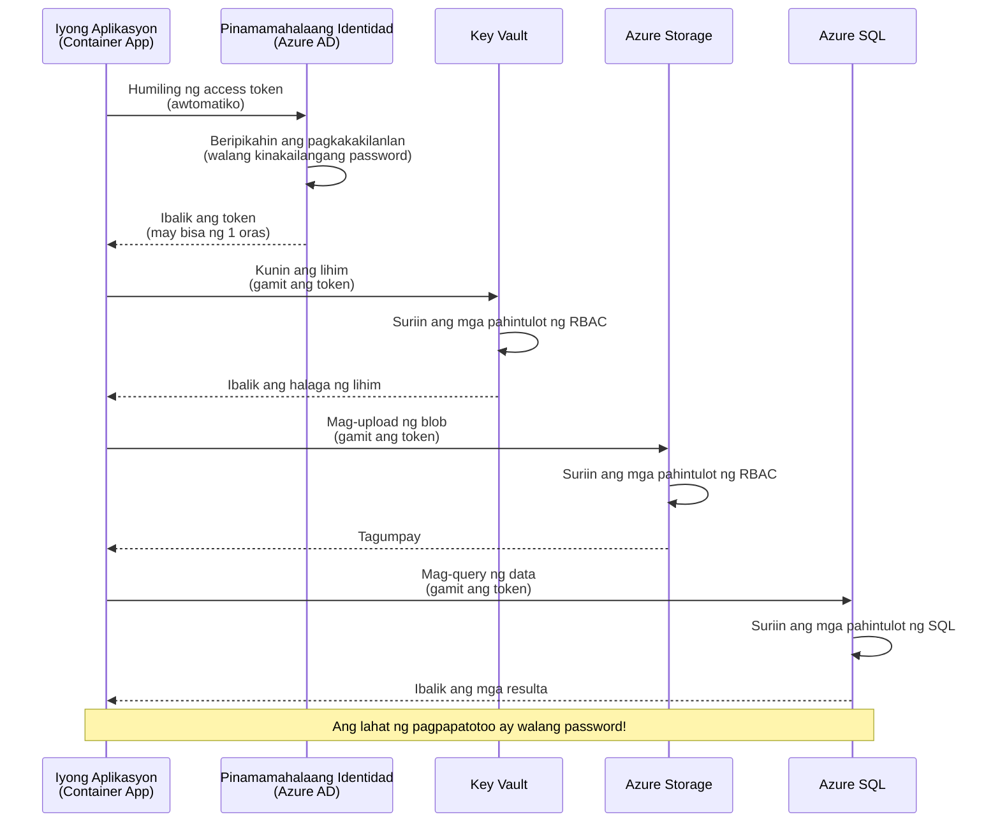
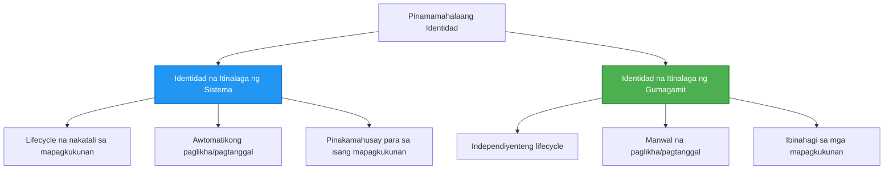

# Mga Pattern ng Authentication at Managed Identity

⏱️ **Tinatayang Oras**: 45-60 minuto | 💰 **Epekto sa Gastos**: Libre (walang karagdagang bayarin) | ⭐ **Kumplikado**: Intermediate

**📚 Landas ng Pag-aaral:**
- ← Nakaraan: [Pamamahala ng Konfigurasyon](configuration.md) - Pamamahala ng mga environment variable at mga lihim
- 🎯 **Ikaw ay Nasa Bahagi na Ito**: Authentication & Seguridad (Managed Identity, Key Vault, mga secure na pattern)
- → Susunod: [Unang Proyekto](first-project.md) - Bumuo ng iyong unang AZD application
- 🏠 [Pangunahing Kurso](../../README.md)

---

## Ano ang Iyong Matututunan

Sa pagtatapos ng araling ito, ikaw ay:
- Maiintindihan ang mga pattern ng authentication sa Azure (mga key, connection string, managed identity)
- Maipapatupad ang **Managed Identity** para sa passwordless authentication
- Masisiguro ang mga lihim gamit ang **Azure Key Vault** integration
- Makakapag-configure ng **role-based access control (RBAC)** para sa mga deployment ng AZD
- Makakapag-apply ng mga pinakamahusay na kasanayan sa seguridad sa Container Apps at mga serbisyo ng Azure
- Makakapag-migrate mula sa key-based patungo sa identity-based authentication

## Bakit Mahalaga ang Managed Identity

### Ang Problema: Tradisyunal na Authentication

**Bago ang Managed Identity:**
```javascript
// ❌ PANGANIB SA SEGURIDAD: Naka-hardcode na mga lihim sa code
const connectionString = "Server=mydb.database.windows.net;User=admin;Password=P@ssw0rd123";
const storageKey = "xK7mN9pQ2wR5tY8uI0oP3aS6dF1gH4jK...";
const cosmosKey = "C2x7B9n4M1p8Q5w3E6r0T2y5U8i1O4p7...";
```

**Mga Problema:**
- 🔴 **Mga lihim na nakalantad** sa code, config files, environment variables
- 🔴 **Pag-ikot ng kredensyal** nangangailangan ng pagbabago sa code at muling pag-deploy
- 🔴 **Audit na bangungot** - sino ang nag-access, kailan?
- 🔴 **Pagkalat** - mga lihim na nakakalat sa iba't ibang sistema
- 🔴 **Mga panganib sa pagsunod** - hindi pumapasa sa mga security audit

### Ang Solusyon: Managed Identity

**Pagkatapos ng Managed Identity:**
```javascript
// ✅ SECURE: Walang mga lihim sa code
const credential = new DefaultAzureCredential();
const client = new BlobServiceClient(
  "https://mystorageaccount.blob.core.windows.net",
  credential  // Awtomatikong hinahawakan ng Azure ang pagpapatotoo
);
```

**Mga Benepisyo:**
- ✅ **Walang lihim** sa code o configuration
- ✅ **Awtomatikong pag-ikot** - Azure ang bahala
- ✅ **Kumpletong audit trail** sa Azure AD logs
- ✅ **Sentralisadong seguridad** - pamamahala sa Azure Portal
- ✅ **Handa sa pagsunod** - nakakatugon sa mga pamantayan sa seguridad

**Analohiya**: Ang tradisyunal na authentication ay parang may dala kang maraming pisikal na susi para sa iba't ibang pintuan. Ang Managed Identity ay parang may security badge na awtomatikong nagbibigay ng access batay sa kung sino ka—walang susi na mawawala, kopyahin, o iikot.

---

## Pangkalahatang Arkitektura

### Daloy ng Authentication gamit ang Managed Identity


### Mga Uri ng Managed Identities


| Tampok | System-Assigned | User-Assigned |
|-------|-----------------|---------------|
| **Lifecycle** | Nakakabit sa resource | Independent |
| **Paglikha** | Awtomatiko kasama ng resource | Manu-manong paglikha |
| **Pagbura** | Nabubura kasama ng resource | Nanatili pagkatapos ng pagbura ng resource |
| **Pagbabahagi** | Isang resource lamang | Maramihang resources |
| **Gamit** | Simpleng mga senaryo | Kumplikadong multi-resource na mga senaryo |
| **Default ng AZD** | ✅ Inirerekomenda | Opsyonal |

---

## Mga Kinakailangan

### Mga Kinakailangang Tool

Dapat mayroon ka na ng mga ito mula sa mga nakaraang aralin:

```bash
# I-verify ang Azure Developer CLI
azd version
# ✅ Inaasahan: azd bersyon 1.0.0 o mas mataas

# I-verify ang Azure CLI
az --version
# ✅ Inaasahan: azure-cli 2.50.0 o mas mataas
```

### Mga Kinakailangan sa Azure

- Aktibong subscription sa Azure
- Mga pahintulot para sa:
  - Paglikha ng managed identities
  - Pag-assign ng mga RBAC role
  - Paglikha ng mga resource sa Key Vault
  - Pag-deploy ng Container Apps

### Mga Kinakailangang Kaalaman

Dapat natapos mo na:
- [Gabay sa Pag-install](installation.md) - AZD setup
- [Mga Pangunahing Konsepto ng AZD](azd-basics.md) - Core concepts
- [Pamamahala ng Konfigurasyon](configuration.md) - Environment variables

---

## Aralin 1: Pag-unawa sa Mga Pattern ng Authentication

### Pattern 1: Connection Strings (Legacy - Iwasan)

**Paano ito gumagana:**
```bash
# Ang string ng koneksyon ay naglalaman ng mga kredensyal
STORAGE_CONNECTION_STRING="DefaultEndpointsProtocol=https;AccountName=myaccount;AccountKey=xK7mN9pQ2wR5..."
COSMOS_CONNECTION_STRING="AccountEndpoint=https://myaccount.documents.azure.com:443/;AccountKey=C2x7..."
SQL_CONNECTION_STRING="Server=myserver.database.windows.net;User=admin;Password=P@ssw0rd..."
```

**Mga Problema:**
- ❌ Mga lihim na nakikita sa environment variables
- ❌ Naka-log sa mga deployment system
- ❌ Mahirap iikot
- ❌ Walang audit trail ng access

**Kailan gagamitin:** Para lamang sa lokal na pag-develop, hindi kailanman sa produksyon.

---

### Pattern 2: Key Vault References (Mas Mabuti)

**Paano ito gumagana:**
```bicep
// Store secret in Key Vault
resource keyVault 'Microsoft.KeyVault/vaults@2023-02-01' = {
  name: 'mykv'
  properties: {
    enableRbacAuthorization: true
  }
}

// Reference in Container App
env: [
  {
    name: 'STORAGE_KEY'
    secretRef: 'storage-key'  // References Key Vault
  }
]
```

**Mga Benepisyo:**
- ✅ Mga lihim na ligtas na nakaimbak sa Key Vault
- ✅ Sentralisadong pamamahala ng lihim
- ✅ Pag-ikot nang walang pagbabago sa code

**Mga Limitasyon:**
- ⚠️ Gumagamit pa rin ng mga key/password
- ⚠️ Kailangang pamahalaan ang access sa Key Vault

**Kailan gagamitin:** Hakbang sa paglipat mula sa connection strings patungo sa managed identity.

---

### Pattern 3: Managed Identity (Pinakamahusay na Kasanayan)

**Paano ito gumagana:**
```bicep
// Enable managed identity
resource containerApp 'Microsoft.App/containerApps@2023-05-01' = {
  name: 'myapp'
  identity: {
    type: 'SystemAssigned'  // Automatically creates identity
  }
}

// Grant permissions
resource roleAssignment 'Microsoft.Authorization/roleAssignments@2022-04-01' = {
  scope: storageAccount
  properties: {
    roleDefinitionId: storageBlobDataContributorRole
    principalId: containerApp.identity.principalId
  }
}
```

**Code ng Application:**
```javascript
// Walang lihim na kailangan!
const { DefaultAzureCredential } = require('@azure/identity');
const { BlobServiceClient } = require('@azure/storage-blob');

const credential = new DefaultAzureCredential();
const blobServiceClient = new BlobServiceClient(
  'https://mystorageaccount.blob.core.windows.net',
  credential
);
```

**Mga Benepisyo:**
- ✅ Walang lihim sa code/config
- ✅ Awtomatikong pag-ikot ng kredensyal
- ✅ Kumpletong audit trail
- ✅ RBAC-based na mga pahintulot
- ✅ Handa sa pagsunod

**Kailan gagamitin:** Palagi, para sa mga production application.

---

## Aralin 2: Pagpapatupad ng Managed Identity gamit ang AZD

### Hakbang-hakbang na Pagpapatupad

Bumuo tayo ng isang secure na Container App na gumagamit ng managed identity para ma-access ang Azure Storage at Key Vault.

### Istruktura ng Proyekto

```
secure-app/
├── azure.yaml                 # AZD configuration
├── infra/
│   ├── main.bicep            # Main infrastructure
│   ├── core/
│   │   ├── identity.bicep    # Managed identity setup
│   │   ├── keyvault.bicep    # Key Vault configuration
│   │   └── storage.bicep     # Storage with RBAC
│   └── app/
│       └── container-app.bicep
└── src/
    ├── app.js                # Application code
    ├── package.json
    └── Dockerfile
```

### 1. I-configure ang AZD (azure.yaml)

```yaml
name: secure-app
metadata:
  template: secure-app@1.0.0

services:
  api:
    project: ./src
    language: js
    host: containerapp

# Enable managed identity (AZD handles this automatically)
```

### 2. Imprastruktura: I-enable ang Managed Identity

**File: `infra/main.bicep`**

```bicep
targetScope = 'subscription'

param environmentName string
param location string = 'eastus'

var tags = { 'azd-env-name': environmentName }

// Resource group
resource rg 'Microsoft.Resources/resourceGroups@2021-04-01' = {
  name: 'rg-${environmentName}'
  location: location
  tags: tags
}

// Storage Account
module storage './core/storage.bicep' = {
  name: 'storage'
  scope: rg
  params: {
    name: 'st${uniqueString(rg.id)}'
    location: location
    tags: tags
  }
}

// Key Vault
module keyVault './core/keyvault.bicep' = {
  name: 'keyvault'
  scope: rg
  params: {
    name: 'kv-${uniqueString(rg.id)}'
    location: location
    tags: tags
  }
}

// Container App with Managed Identity
module containerApp './app/container-app.bicep' = {
  name: 'container-app'
  scope: rg
  params: {
    name: 'ca-${environmentName}'
    location: location
    tags: tags
    storageAccountName: storage.outputs.name
    keyVaultName: keyVault.outputs.name
  }
}

// Grant Container App access to Storage
module storageRoleAssignment './core/role-assignment.bicep' = {
  name: 'storage-role'
  scope: rg
  params: {
    principalId: containerApp.outputs.identityPrincipalId
    roleDefinitionId: 'ba92f5b4-2d11-453d-a403-e96b0029c9fe'  // Storage Blob Data Contributor
    targetResourceId: storage.outputs.id
  }
}

// Grant Container App access to Key Vault
module kvRoleAssignment './core/role-assignment.bicep' = {
  name: 'kv-role'
  scope: rg
  params: {
    principalId: containerApp.outputs.identityPrincipalId
    roleDefinitionId: '4633458b-17de-408a-b874-0445c86b69e6'  // Key Vault Secrets User
    targetResourceId: keyVault.outputs.id
  }
}

// Outputs
output AZURE_STORAGE_ACCOUNT_NAME string = storage.outputs.name
output AZURE_KEY_VAULT_NAME string = keyVault.outputs.name
output APP_URL string = containerApp.outputs.url
```

### 3. Container App na may System-Assigned Identity

**File: `infra/app/container-app.bicep`**

```bicep
param name string
param location string
param tags object = {}
param storageAccountName string
param keyVaultName string

resource containerApp 'Microsoft.App/containerApps@2023-05-01' = {
  name: name
  location: location
  tags: tags
  identity: {
    type: 'SystemAssigned'  // 🔑 Enable managed identity
  }
  properties: {
    configuration: {
      ingress: {
        external: true
        targetPort: 3000
      }
    }
    template: {
      containers: [
        {
          name: 'api'
          image: 'myregistry.azurecr.io/api:latest'
          resources: {
            cpu: json('0.5')
            memory: '1Gi'
          }
          env: [
            {
              name: 'AZURE_STORAGE_ACCOUNT_NAME'
              value: storageAccountName
            }
            {
              name: 'AZURE_KEY_VAULT_NAME'
              value: keyVaultName
            }
            // 🔑 No secrets - managed identity handles authentication!
          ]
        }
      ]
    }
  }
}

// Output the identity for RBAC assignments
output identityPrincipalId string = containerApp.identity.principalId
output id string = containerApp.id
output url string = 'https://${containerApp.properties.configuration.ingress.fqdn}'
```

### 4. RBAC Role Assignment Module

**File: `infra/core/role-assignment.bicep`**

```bicep
param principalId string
param roleDefinitionId string  // Azure built-in role ID
param targetResourceId string

resource roleAssignment 'Microsoft.Authorization/roleAssignments@2022-04-01' = {
  name: guid(principalId, roleDefinitionId, targetResourceId)
  scope: resourceId('Microsoft.Resources/resourceGroups', resourceGroup().name)
  properties: {
    roleDefinitionId: subscriptionResourceId('Microsoft.Authorization/roleDefinitions', roleDefinitionId)
    principalId: principalId
    principalType: 'ServicePrincipal'
  }
}

output id string = roleAssignment.id
```

### 5. Code ng Application gamit ang Managed Identity

**File: `src/app.js`**

```javascript
const express = require('express');
const { DefaultAzureCredential } = require('@azure/identity');
const { BlobServiceClient } = require('@azure/storage-blob');
const { SecretClient } = require('@azure/keyvault-secrets');

const app = express();
const PORT = process.env.PORT || 3000;

// 🔑 I-initialize ang kredensyal (awtomatikong gumagana gamit ang managed identity)
const credential = new DefaultAzureCredential();

// Setup ng Azure Storage
const storageAccountName = process.env.AZURE_STORAGE_ACCOUNT_NAME;
const blobServiceClient = new BlobServiceClient(
  `https://${storageAccountName}.blob.core.windows.net`,
  credential  // Walang kinakailangang mga susi!
);

// Setup ng Key Vault
const keyVaultName = process.env.AZURE_KEY_VAULT_NAME;
const secretClient = new SecretClient(
  `https://${keyVaultName}.vault.azure.net`,
  credential  // Walang kinakailangang mga susi!
);

// Suriin ang kalusugan
app.get('/health', (req, res) => {
  res.json({ status: 'healthy', authentication: 'managed-identity' });
});

// Mag-upload ng file sa blob storage
app.post('/upload', async (req, res) => {
  try {
    const containerClient = blobServiceClient.getContainerClient('uploads');
    await containerClient.createIfNotExists();
    
    const blobName = `file-${Date.now()}.txt`;
    const blockBlobClient = containerClient.getBlockBlobClient(blobName);
    
    await blockBlobClient.upload('Hello from managed identity!', 30);
    
    res.json({
      success: true,
      blobName: blobName,
      message: 'File uploaded using managed identity!'
    });
  } catch (error) {
    console.error('Upload error:', error);
    res.status(500).json({ error: error.message });
  }
});

// Kunin ang lihim mula sa Key Vault
app.get('/secret/:name', async (req, res) => {
  try {
    const secretName = req.params.name;
    const secret = await secretClient.getSecret(secretName);
    
    res.json({
      name: secretName,
      value: secret.value,
      message: 'Secret retrieved using managed identity!'
    });
  } catch (error) {
    console.error('Secret error:', error);
    res.status(500).json({ error: error.message });
  }
});

// Ilista ang mga blob container (ipinapakita ang read access)
app.get('/containers', async (req, res) => {
  try {
    const containers = [];
    for await (const container of blobServiceClient.listContainers()) {
      containers.push(container.name);
    }
    
    res.json({
      containers: containers,
      count: containers.length,
      message: 'Containers listed using managed identity!'
    });
  } catch (error) {
    console.error('List error:', error);
    res.status(500).json({ error: error.message });
  }
});

app.listen(PORT, () => {
  console.log(`Secure API listening on port ${PORT}`);
  console.log('Authentication: Managed Identity (passwordless)');
});
```

**File: `src/package.json`**

```json
{
  "name": "secure-app",
  "version": "1.0.0",
  "dependencies": {
    "express": "^4.18.2",
    "@azure/identity": "^4.0.0",
    "@azure/storage-blob": "^12.17.0",
    "@azure/keyvault-secrets": "^4.7.0"
  },
  "scripts": {
    "start": "node app.js"
  }
}
```

### 6. I-deploy at Subukan

```bash
# I-initialize ang AZD na kapaligiran
azd init

# I-deploy ang imprastraktura at aplikasyon
azd up

# Kunin ang URL ng app
APP_URL=$(azd env get-values | grep APP_URL | cut -d '=' -f2 | tr -d '"')

# Subukan ang health check
curl $APP_URL/health
```

**✅ Inaasahang output:**
```json
{
  "status": "healthy",
  "authentication": "managed-identity"
}
```

**Subukan ang pag-upload ng blob:**
```bash
curl -X POST $APP_URL/upload
```

**✅ Inaasahang output:**
```json
{
  "success": true,
  "blobName": "file-1700404800000.txt",
  "message": "File uploaded using managed identity!"
}
```

**Subukan ang pag-lista ng container:**
```bash
curl $APP_URL/containers
```

**✅ Inaasahang output:**
```json
{
  "containers": ["uploads"],
  "count": 1,
  "message": "Containers listed using managed identity!"
}
```

---

## Karaniwang Azure RBAC Roles

### Mga Built-in Role ID para sa Managed Identity

| Serbisyo | Pangalan ng Role | Role ID | Mga Pahintulot |
|---------|------------------|---------|----------------|
| **Storage** | Storage Blob Data Reader | `2a2b9908-6b94-4a3d-8e5a-a7d8f8cc8a12` | Magbasa ng blobs at containers |
| **Storage** | Storage Blob Data Contributor | `ba92f5b4-2d11-453d-a403-e96b0029c9fe` | Magbasa, magsulat, magbura ng blobs |
| **Storage** | Storage Queue Data Contributor | `974c5e8b-45b9-4653-ba55-5f855dd0fb88` | Magbasa, magsulat, magbura ng queue messages |
| **Key Vault** | Key Vault Secrets User | `4633458b-17de-408a-b874-0445c86b69e6` | Magbasa ng mga lihim |
| **Key Vault** | Key Vault Secrets Officer | `b86a8fe4-44ce-4948-aee5-eccb2c155cd7` | Magbasa, magsulat, magbura ng mga lihim |
| **Cosmos DB** | Cosmos DB Built-in Data Reader | `00000000-0000-0000-0000-000000000001` | Magbasa ng data sa Cosmos DB |
| **Cosmos DB** | Cosmos DB Built-in Data Contributor | `00000000-0000-0000-0000-000000000002` | Magbasa, magsulat ng data sa Cosmos DB |
| **SQL Database** | SQL DB Contributor | `9b7fa17d-e63e-47b0-bb0a-15c516ac86ec` | Pamahalaan ang mga SQL database |
| **Service Bus** | Azure Service Bus Data Owner | `090c5cfd-751d-490a-894a-3ce6f1109419` | Magpadala, tumanggap, pamahalaan ang mga mensahe |

### Paano Hanapin ang Role IDs

```bash
# Ilista ang lahat ng built-in na mga tungkulin
az role definition list --query "[].{Name:roleName, ID:name}" --output table

# Maghanap ng partikular na tungkulin
az role definition list --query "[?contains(roleName, 'Storage Blob')].{Name:roleName, ID:name}" --output table

# Kunin ang mga detalye ng tungkulin
az role definition list --name "Storage Blob Data Contributor"
```

---

## Mga Praktikal na Ehersisyo

### Ehersisyo 1: I-enable ang Managed Identity para sa Umiiral na App ⭐⭐ (Katamtaman)

**Layunin**: Magdagdag ng managed identity sa umiiral na deployment ng Container App

**Senaryo**: Mayroon kang Container App na gumagamit ng connection strings. I-convert ito sa managed identity.

**Simula**: Container App na may ganitong configuration:

```bicep
// ❌ Current: Using connection string
env: [
  {
    name: 'STORAGE_CONNECTION_STRING'
    secretRef: 'storage-connection'
  }
]
```

**Mga Hakbang**:

1. **I-enable ang managed identity sa Bicep:**

```bicep
resource containerApp 'Microsoft.App/containerApps@2023-05-01' = {
  name: 'myapp'
  identity: {
    type: 'SystemAssigned'  // Add this
  }
  // ... rest of configuration
}
```

2. **Bigyan ng access sa Storage:**

```bicep
// Get storage account reference
resource storageAccount 'Microsoft.Storage/storageAccounts@2023-01-01' existing = {
  name: storageAccountName
}

// Assign role
resource roleAssignment 'Microsoft.Authorization/roleAssignments@2022-04-01' = {
  name: guid(containerApp.id, 'ba92f5b4-2d11-453d-a403-e96b0029c9fe', storageAccount.id)
  scope: storageAccount
  properties: {
    roleDefinitionId: subscriptionResourceId('Microsoft.Authorization/roleDefinitions', 'ba92f5b4-2d11-453d-a403-e96b0029c9fe')
    principalId: containerApp.identity.principalId
    principalType: 'ServicePrincipal'
  }
}
```

3. **I-update ang code ng application:**

**Bago (connection string):**
```javascript
const { BlobServiceClient } = require('@azure/storage-blob');

const blobServiceClient = BlobServiceClient.fromConnectionString(
  process.env.STORAGE_CONNECTION_STRING
);
```

**Pagkatapos (managed identity):**
```javascript
const { DefaultAzureCredential } = require('@azure/identity');
const { BlobServiceClient } = require('@azure/storage-blob');

const credential = new DefaultAzureCredential();
const blobServiceClient = new BlobServiceClient(
  `https://${process.env.STORAGE_ACCOUNT_NAME}.blob.core.windows.net`,
  credential
);
```

4. **I-update ang environment variables:**

```bicep
env: [
  {
    name: 'STORAGE_ACCOUNT_NAME'
    value: storageAccountName  // Just the name, no secrets!
  }
  // Remove STORAGE_CONNECTION_STRING
]
```

5. **I-deploy at subukan:**

```bash
# I-deploy muli
azd up

# Subukan kung gumagana pa rin
curl https://myapp.azurecontainerapps.io/upload
```

**✅ Pamantayan ng Tagumpay:**
- ✅ Ang application ay na-deploy nang walang error
- ✅ Gumagana ang mga operasyon sa Storage (upload, list, download)
- ✅ Walang connection strings sa environment variables
- ✅ Nakikita ang identity sa Azure Portal sa ilalim ng "Identity" blade

**Pag-verify:**

```bash
# Suriin kung naka-enable ang managed identity
az containerapp show \
  --name myapp \
  --resource-group rg-myapp \
  --query "identity.type"
# ✅ Inaasahan: "SystemAssigned"

# Suriin ang role assignment
az role assignment list \
  --assignee $(az containerapp show --name myapp --resource-group rg-myapp --query "identity.principalId" -o tsv) \
  --scope /subscriptions/{sub-id}/resourceGroups/rg-myapp/providers/Microsoft.Storage/storageAccounts/mystorageaccount
# ✅ Inaasahan: Ipinapakita ang role na "Storage Blob Data Contributor"
```

**Oras**: 20-30 minuto

---

### Ehersisyo 2: Multi-Service Access gamit ang User-Assigned Identity ⭐⭐⭐ (Advanced)

**Layunin**: Gumawa ng user-assigned identity na ibinabahagi sa maraming Container Apps

**Senaryo**: Mayroon kang 3 microservices na lahat ay nangangailangan ng access sa parehong Storage account at Key Vault.

**Mga Hakbang**:

1. **Gumawa ng user-assigned identity:**

**File: `infra/core/identity.bicep`**

```bicep
param name string
param location string
param tags object = {}

resource userAssignedIdentity 'Microsoft.ManagedIdentity/userAssignedIdentities@2023-01-31' = {
  name: name
  location: location
  tags: tags
}

output id string = userAssignedIdentity.id
output principalId string = userAssignedIdentity.properties.principalId
output clientId string = userAssignedIdentity.properties.clientId
```

2. **Mag-assign ng mga role sa user-assigned identity:**

```bicep
// In main.bicep
module userIdentity './core/identity.bicep' = {
  name: 'user-identity'
  scope: rg
  params: {
    name: 'id-${environmentName}'
    location: location
    tags: tags
  }
}

// Grant Storage access
resource storageRoleAssignment 'Microsoft.Authorization/roleAssignments@2022-04-01' = {
  name: guid(userIdentity.outputs.principalId, 'storage-contributor')
  scope: storageAccount
  properties: {
    roleDefinitionId: subscriptionResourceId('Microsoft.Authorization/roleDefinitions', 'ba92f5b4-2d11-453d-a403-e96b0029c9fe')
    principalId: userIdentity.outputs.principalId
    principalType: 'ServicePrincipal'
  }
}

// Grant Key Vault access
resource kvRoleAssignment 'Microsoft.Authorization/roleAssignments@2022-04-01' = {
  name: guid(userIdentity.outputs.principalId, 'kv-secrets-user')
  scope: keyVault
  properties: {
    roleDefinitionId: subscriptionResourceId('Microsoft.Authorization/roleDefinitions', '4633458b-17de-408a-b874-0445c86b69e6')
    principalId: userIdentity.outputs.principalId
    principalType: 'ServicePrincipal'
  }
}
```

3. **Mag-assign ng identity sa maraming Container Apps:**

```bicep
resource apiGateway 'Microsoft.App/containerApps@2023-05-01' = {
  name: 'api-gateway'
  identity: {
    type: 'UserAssigned'
    userAssignedIdentities: {
      '${userIdentity.outputs.id}': {}
    }
  }
  // ... rest of config
}

resource productService 'Microsoft.App/containerApps@2023-05-01' = {
  name: 'product-service'
  identity: {
    type: 'UserAssigned'
    userAssignedIdentities: {
      '${userIdentity.outputs.id}': {}
    }
  }
  // ... rest of config
}

resource orderService 'Microsoft.App/containerApps@2023-05-01' = {
  name: 'order-service'
  identity: {
    type: 'UserAssigned'
    userAssignedIdentities: {
      '${userIdentity.outputs.id}': {}
    }
  }
  // ... rest of config
}
```

4. **Code ng application (lahat ng serbisyo ay gumagamit ng parehong pattern):**

```javascript
const { DefaultAzureCredential, ManagedIdentityCredential } = require('@azure/identity');

// Para sa user-assigned identity, tukuyin ang client ID
const credential = new ManagedIdentityCredential(
  process.env.AZURE_CLIENT_ID  // User-assigned identity client ID
);

// O gumamit ng DefaultAzureCredential (awtomatikong natutukoy)
const credential = new DefaultAzureCredential();

const blobServiceClient = new BlobServiceClient(
  `https://${process.env.STORAGE_ACCOUNT_NAME}.blob.core.windows.net`,
  credential
);
```

5. **I-deploy at i-verify:**

```bash
azd up

# Subukan ang lahat ng serbisyo kung makaka-access sa imbakan
curl https://api-gateway.azurecontainerapps.io/upload
curl https://product-service.azurecontainerapps.io/upload
curl https://order-service.azurecontainerapps.io/upload
```

**✅ Pamantayan ng Tagumpay:**
- ✅ Isang identity na ibinabahagi sa 3 serbisyo
- ✅ Lahat ng serbisyo ay makaka-access sa Storage at Key Vault
- ✅ Ang identity ay nananatili kahit burahin ang isang serbisyo
- ✅ Sentralisadong pamamahala ng pahintulot

**Mga Benepisyo ng User-Assigned Identity:**
- Isang identity na pamamahalaan
- Konsistent na mga pahintulot sa mga serbisyo
- Nanatili kahit burahin ang serbisyo
- Mas mabuti para sa mga kumplikadong arkitektura

**Oras**: 30-40 minuto

---

### Ehersisyo 3: Ipatupad ang Key Vault Secret Rotation ⭐⭐⭐ (Advanced)

**Layunin**: Mag-imbak ng mga third-party API key sa Key Vault at i-access ang mga ito gamit ang managed identity

**Senaryo**: Ang iyong app ay kailangang tumawag sa isang external API (OpenAI, Stripe, SendGrid) na nangangailangan ng API keys.

**Mga Hakbang**:

1. **Gumawa ng Key Vault na may RBAC:**

**File: `infra/core/keyvault.bicep`**

```bicep
param name string
param location string
param tags object = {}

resource keyVault 'Microsoft.KeyVault/vaults@2023-02-01' = {
  name: name
  location: location
  tags: tags
  properties: {
    enableRbacAuthorization: true  // Use RBAC instead of access policies
    sku: {
      family: 'A'
      name: 'standard'
    }
    tenantId: subscription().tenantId
    enableSoftDelete: true
    softDeleteRetentionInDays: 90
  }
}

// Allow Container App to read secrets
output id string = keyVault.id
output name string = keyVault.name
output uri string = keyVault.properties.vaultUri
```

2. **Mag-imbak ng mga lihim sa Key Vault:**

```bash
# Kunin ang pangalan ng Key Vault
KV_NAME=$(azd env get-values | grep AZURE_KEY_VAULT_NAME | cut -d '=' -f2 | tr -d '"')

# Iimbak ang mga API key ng third-party
az keyvault secret set \
  --vault-name $KV_NAME \
  --name "OpenAI-ApiKey" \
  --value "sk-proj-xxxxxxxxxxxxx"

az keyvault secret set \
  --vault-name $KV_NAME \
  --name "Stripe-ApiKey" \
  --value "sk_live_xxxxxxxxxxxxx"

az keyvault secret set \
  --vault-name $KV_NAME \
  --name "SendGrid-ApiKey" \
  --value "SG.xxxxxxxxxxxxx"
```

3. **Code ng application para kunin ang mga lihim:**

**File: `src/config.js`**

```javascript
const { DefaultAzureCredential } = require('@azure/identity');
const { SecretClient } = require('@azure/keyvault-secrets');

class Config {
  constructor() {
    this.credential = new DefaultAzureCredential();
    this.secretClient = new SecretClient(
      `https://${process.env.AZURE_KEY_VAULT_NAME}.vault.azure.net`,
      this.credential
    );
    this.cache = {};
  }

  async getSecret(secretName) {
    // Suriin muna ang cache
    if (this.cache[secretName]) {
      return this.cache[secretName];
    }

    try {
      const secret = await this.secretClient.getSecret(secretName);
      this.cache[secretName] = secret.value;
      console.log(`✅ Retrieved secret: ${secretName}`);
      return secret.value;
    } catch (error) {
      console.error(`❌ Failed to get secret ${secretName}:`, error.message);
      throw error;
    }
  }

  async getOpenAIKey() {
    return this.getSecret('OpenAI-ApiKey');
  }

  async getStripeKey() {
    return this.getSecret('Stripe-ApiKey');
  }

  async getSendGridKey() {
    return this.getSecret('SendGrid-ApiKey');
  }
}

module.exports = new Config();
```

4. **Gamitin ang mga lihim sa application:**

**File: `src/app.js`**

```javascript
const express = require('express');
const config = require('./config');
const { OpenAI } = require('openai');

const app = express();

// I-initialize ang OpenAI gamit ang key mula sa Key Vault
let openaiClient;

async function initializeServices() {
  const openaiKey = await config.getOpenAIKey();
  openaiClient = new OpenAI({ apiKey: openaiKey });
  console.log('✅ Services initialized with secrets from Key Vault');
}

// Tawagin sa pagsisimula
initializeServices().catch(console.error);

app.post('/chat', async (req, res) => {
  try {
    const completion = await openaiClient.chat.completions.create({
      model: 'gpt-4',
      messages: [{ role: 'user', content: 'Hello!' }]
    });
    
    res.json({
      response: completion.choices[0].message.content,
      authentication: 'Key from Key Vault via Managed Identity'
    });
  } catch (error) {
    res.status(500).json({ error: error.message });
  }
});

app.listen(3000, () => {
  console.log('Secure API with Key Vault integration running');
});
```

5. **I-deploy at subukan:**

```bash
azd up

# Subukan kung gumagana ang mga API key
curl -X POST https://myapp.azurecontainerapps.io/chat \
  -H "Content-Type: application/json" \
  -d '{"message":"Hello AI"}'
```

**✅ Pamantayan ng Tagumpay:**
- ✅ Walang API keys sa code o environment variables
- ✅ Nakukuha ng application ang mga key mula sa Key Vault
- ✅ Gumagana nang tama ang mga third-party API
- ✅ Maaaring iikot ang mga key nang walang pagbabago sa code

**Iikot ang isang lihim:**

```bash
# I-update ang lihim sa Key Vault
az keyvault secret set \
  --vault-name $KV_NAME \
  --name "OpenAI-ApiKey" \
  --value "sk-proj-NEW_KEY_HERE"

# I-restart ang app upang makuha ang bagong susi
az containerapp revision restart \
  --name myapp \
  --resource-group rg-myapp
```

**Oras**: 25-35 minuto

---

## Checkpoint ng Kaalaman

### 1. Mga Pattern ng Authentication ✓

Subukan ang iyong kaalaman:

- [ ] **Q1**: Ano ang tatlong pangunahing pattern ng authentication? 
  - **A**: Connection strings (legacy), Key Vault references (transition), Managed Identity (best)

- [ ] **Q2**: Bakit mas mahusay ang managed identity kaysa sa connection strings?
  - **A**: Walang lihim sa code, awtomatikong pag-ikot, kumpletong audit trail, RBAC permissions

- [ ] **Q3**: Kailan gagamitin ang user-assigned identity sa halip na system-assigned?
  - **A**: Kapag ibinabahagi ang identity sa maraming resources o kapag ang lifecycle ng identity ay independent sa lifecycle ng resource

**Pag-verify sa Hands-On:**
```bash
# Suriin kung anong uri ng pagkakakilanlan ang ginagamit ng iyong app
az containerapp show \
  --name myapp \
  --resource-group rg-myapp \
  --query "identity.type"

# Ilista ang lahat ng mga itinalagang tungkulin para sa pagkakakilanlan
az role assignment list \
  --assignee $(az containerapp show --name myapp --resource-group rg-myapp --query "identity.principalId" -o tsv)
```

---

### 2. RBAC at Mga Pahintulot ✓

Subukan ang iyong kaalaman:

- [ ] **Q1**: Ano ang role ID para sa "Storage Blob Data Contributor"?
  - **A**: `ba92f5b4-2d11-453d-a403-e96b0029c9fe`

- [ ] **Q2**: Anong mga pahintulot ang ibinibigay ng "Key Vault Secrets User"?
  - **A**: Read-only access sa mga lihim (hindi maaaring gumawa, mag-update, o magbura)

- [ ] **Q3**: Paano mo bibigyan ng access ang Container App sa Azure SQL?
  - **A**: Mag-assign ng "SQL DB Contributor" role o i-configure ang Azure AD authentication para sa SQL

**Pag-verify sa Hands-On:**
```bash
# Hanapin ang tiyak na papel
az role definition list --name "Storage Blob Data Contributor"

# Suriin kung anong mga papel ang nakatalaga sa iyong pagkakakilanlan
PRINCIPAL_ID=$(az containerapp show --name myapp --resource-group rg-myapp --query "identity.principalId" -o tsv)
az role assignment list --assignee $PRINCIPAL_ID --output table
```

---

### 3. Integrasyon ng Key Vault ✓

Subukan ang iyong kaalaman:
- [ ] **Q1**: Paano mo i-enable ang RBAC para sa Key Vault sa halip na access policies?
  - **A**: Itakda ang `enableRbacAuthorization: true` sa Bicep

- [ ] **Q2**: Anong Azure SDK library ang humahawak sa managed identity authentication?
  - **A**: `@azure/identity` gamit ang `DefaultAzureCredential` class

- [ ] **Q3**: Gaano katagal nananatili sa cache ang Key Vault secrets?
  - **A**: Depende sa application; mag-implement ng sarili mong caching strategy

**Praktikal na Pag-verify:**
```bash
# Subukan ang pag-access sa Key Vault
az keyvault secret show \
  --vault-name $KV_NAME \
  --name "OpenAI-ApiKey" \
  --query "value"

# Suriin kung naka-enable ang RBAC
az keyvault show \
  --name $KV_NAME \
  --query "properties.enableRbacAuthorization"
# ✅ Inaasahan: totoo
```

---

## Mga Pinakamahusay na Kasanayan sa Seguridad

### ✅ GAWIN:

1. **Laging gumamit ng managed identity sa production**
   ```bicep
   identity: {
     type: 'SystemAssigned'
   }
   ```

2. **Gumamit ng least-privilege RBAC roles**
   - Gumamit ng "Reader" roles kung maaari
   - Iwasan ang "Owner" o "Contributor" maliban kung kinakailangan

3. **Ilagay ang mga third-party keys sa Key Vault**
   ```javascript
   const apiKey = await secretClient.getSecret('ThirdPartyApiKey');
   ```

4. **I-enable ang audit logging**
   ```bicep
   diagnosticSettings: {
     logs: [{ category: 'AuditEvent', enabled: true }]
   }
   ```

5. **Gumamit ng magkakaibang identities para sa dev/staging/prod**
   ```bash
   azd env new dev
   azd env new staging
   azd env new prod
   ```

6. **Regular na i-rotate ang mga secrets**
   - Magtakda ng expiration dates sa Key Vault secrets
   - I-automate ang rotation gamit ang Azure Functions

### ❌ HUWAG:

1. **Huwag kailanman i-hardcode ang mga secrets**
   ```javascript
   // ❌ MASAMA
   const apiKey = "sk-proj-xxxxxxxxxxxxx";
   ```

2. **Huwag gumamit ng connection strings sa production**
   ```javascript
   // ❌ MASAMA
   BlobServiceClient.fromConnectionString(process.env.STORAGE_CONNECTION_STRING)
   ```

3. **Huwag magbigay ng labis na permissions**
   ```bicep
   // ❌ BAD - too much access
   roleDefinitionId: 'Owner'
   
   // ✅ GOOD - least privilege
   roleDefinitionId: 'Storage Blob Data Reader'
   ```

4. **Huwag i-log ang mga secrets**
   ```javascript
   // ❌ MASAMA
   console.log('API Key:', apiKey);
   
   // ✅ MABUTI
   console.log('API Key retrieved successfully');
   ```

5. **Huwag magbahagi ng production identities sa iba't ibang environments**
   ```bicep
   // ❌ BAD - same identity for dev and prod
   // ✅ GOOD - separate identities per environment
   ```

---

## Gabay sa Pag-troubleshoot

### Problema: "Unauthorized" kapag ina-access ang Azure Storage

**Mga Sintomas:**
```
Error: Unauthorized (403)
AuthorizationPermissionMismatch: This request is not authorized to perform this operation
```

**Diagnosis:**

```bash
# Suriin kung naka-enable ang managed identity
az containerapp show \
  --name myapp \
  --resource-group rg-myapp \
  --query "identity.type"
# ✅ Inaasahan: "SystemAssigned" o "UserAssigned"

# Suriin ang mga role assignment
PRINCIPAL_ID=$(az containerapp show --name myapp --resource-group rg-myapp --query "identity.principalId" -o tsv)
az role assignment list --assignee $PRINCIPAL_ID

# Inaasahan: Dapat makita ang "Storage Blob Data Contributor" o katulad na role
```

**Mga Solusyon:**

1. **Magbigay ng tamang RBAC role:**
```bash
STORAGE_ID=$(az storage account show --name mystorageaccount --resource-group rg-myapp --query "id" -o tsv)
az role assignment create \
  --assignee $PRINCIPAL_ID \
  --role "Storage Blob Data Contributor" \
  --scope $STORAGE_ID
```

2. **Maghintay para sa propagation (maaaring tumagal ng 5-10 minuto):**
```bash
# Suriin ang status ng pag-assign ng papel
az role assignment list --assignee $PRINCIPAL_ID --scope $STORAGE_ID
```

3. **Siguraduhing tama ang credential na ginagamit ng application code:**
```javascript
// Siguraduhing ginagamit mo ang DefaultAzureCredential
const credential = new DefaultAzureCredential();
```

---

### Problema: Hindi ma-access ang Key Vault

**Mga Sintomas:**
```
Error: Forbidden (403)
The user, group or application does not have secrets get permission
```

**Diagnosis:**

```bash
# Suriin kung naka-enable ang Key Vault RBAC
az keyvault show \
  --name $KV_NAME \
  --query "properties.enableRbacAuthorization"
# ✅ Inaasahan: totoo

# Suriin ang mga itinalagang papel
az role assignment list \
  --assignee $PRINCIPAL_ID \
  --scope /subscriptions/{sub-id}/resourceGroups/rg-myapp/providers/Microsoft.KeyVault/vaults/$KV_NAME
```

**Mga Solusyon:**

1. **I-enable ang RBAC sa Key Vault:**
```bash
az keyvault update \
  --name $KV_NAME \
  --enable-rbac-authorization true
```

2. **Magbigay ng Key Vault Secrets User role:**
```bash
KV_ID=$(az keyvault show --name $KV_NAME --query "id" -o tsv)
az role assignment create \
  --assignee $PRINCIPAL_ID \
  --role "Key Vault Secrets User" \
  --scope $KV_ID
```

---

### Problema: Nabigo ang DefaultAzureCredential sa lokal

**Mga Sintomas:**
```
Error: DefaultAzureCredential failed to retrieve a token
CredentialUnavailableError: No credential available
```

**Diagnosis:**

```bash
# Suriin kung naka-log in ka
az account show

# Suriin ang Azure CLI authentication
az ad signed-in-user show
```

**Mga Solusyon:**

1. **Mag-login sa Azure CLI:**
```bash
az login
```

2. **Itakda ang Azure subscription:**
```bash
az account set --subscription "Your Subscription Name"
```

3. **Para sa lokal na development, gumamit ng environment variables:**
```bash
export AZURE_TENANT_ID="your-tenant-id"
export AZURE_CLIENT_ID="your-client-id"
export AZURE_CLIENT_SECRET="your-client-secret"
```

4. **O gumamit ng ibang credential sa lokal:**
```javascript
const { DefaultAzureCredential, AzureCliCredential } = require('@azure/identity');

// Gamitin ang AzureCliCredential para sa lokal na pag-develop
const credential = process.env.NODE_ENV === 'production' 
  ? new DefaultAzureCredential()
  : new AzureCliCredential();
```

---

### Problema: Matagal ang propagation ng role assignment

**Mga Sintomas:**
- Matagumpay na na-assign ang role
- Patuloy na nakakakuha ng 403 errors
- Hindi palaging gumagana (minsan gumagana, minsan hindi)

**Paliwanag:**
Ang mga pagbabago sa Azure RBAC ay maaaring tumagal ng 5-10 minuto upang maipakalat sa buong mundo.

**Solusyon:**

```bash
# Maghintay at subukang muli
echo "Waiting for RBAC propagation..."
sleep 300  # Maghintay ng 5 minuto

# Subukan ang access
curl https://myapp.azurecontainerapps.io/upload

# Kung patuloy na nabibigo, i-restart ang app
az containerapp revision restart \
  --name myapp \
  --resource-group rg-myapp
```

---

## Mga Pagsasaalang-alang sa Gastos

### Mga Gastos sa Managed Identity

| Resource | Gastos |
|----------|--------|
| **Managed Identity** | 🆓 **LIBRE** - Walang bayad |
| **RBAC Role Assignments** | 🆓 **LIBRE** - Walang bayad |
| **Azure AD Token Requests** | 🆓 **LIBRE** - Kasama na |
| **Key Vault Operations** | $0.03 kada 10,000 operations |
| **Key Vault Storage** | $0.024 kada secret bawat buwan |

**Nakakatipid ang managed identity sa pamamagitan ng:**
- ✅ Pag-aalis ng Key Vault operations para sa service-to-service auth
- ✅ Pagbawas ng mga insidente sa seguridad (walang na-leak na credentials)
- ✅ Pagbawas ng operational overhead (walang manual rotation)

**Halimbawa ng Paghahambing ng Gastos (buwanang):**

| Scenario | Connection Strings | Managed Identity | Matitipid |
|----------|-------------------|-----------------|-----------|
| Maliit na app (1M requests) | ~$50 (Key Vault + ops) | ~$0 | $50/buwan |
| Katamtamang app (10M requests) | ~$200 | ~$0 | $200/buwan |
| Malaking app (100M requests) | ~$1,500 | ~$0 | $1,500/buwan |

---

## Dagdag na Impormasyon

### Opisyal na Dokumentasyon
- [Azure Managed Identity](https://learn.microsoft.com/entra/identity/managed-identities-azure-resources/overview)
- [Azure RBAC](https://learn.microsoft.com/azure/role-based-access-control/overview)
- [Azure Key Vault](https://learn.microsoft.com/azure/key-vault/general/overview)
- [DefaultAzureCredential](https://learn.microsoft.com/dotnet/api/azure.identity.defaultazurecredential)

### Dokumentasyon ng SDK
- [@azure/identity (Node.js)](https://www.npmjs.com/package/@azure/identity)
- [Azure.Identity (C#)](https://www.nuget.org/packages/Azure.Identity/)
- [azure-identity (Python)](https://pypi.org/project/azure-identity/)

### Mga Susunod na Hakbang sa Kursong Ito
- ← Nakaraan: [Configuration Management](configuration.md)
- → Susunod: [First Project](first-project.md)
- 🏠 [Home ng Kurso](../../README.md)

### Mga Kaugnay na Halimbawa
- [Halimbawa ng Azure OpenAI Chat](../../../../examples/azure-openai-chat) - Gumagamit ng managed identity para sa Azure OpenAI
- [Halimbawa ng Microservices](../../../../examples/microservices) - Mga pattern ng multi-service authentication

---

## Buod

**Natutuhan mo:**
- ✅ Tatlong authentication patterns (connection strings, Key Vault, managed identity)
- ✅ Paano i-enable at i-configure ang managed identity sa AZD
- ✅ RBAC role assignments para sa mga Azure services
- ✅ Key Vault integration para sa third-party secrets
- ✅ User-assigned vs system-assigned identities
- ✅ Mga pinakamahusay na kasanayan sa seguridad at troubleshooting

**Mga Mahalagang Puntos:**
1. **Laging gumamit ng managed identity sa production** - Walang secrets, awtomatikong rotation
2. **Gumamit ng least-privilege RBAC roles** - Magbigay lamang ng kinakailangang permissions
3. **Ilagay ang mga third-party keys sa Key Vault** - Sentralisadong pamamahala ng secrets
4. **Magkaroon ng magkakaibang identities bawat environment** - Paghiwalay ng dev, staging, prod
5. **I-enable ang audit logging** - Subaybayan kung sino ang nag-access ng ano

**Mga Susunod na Hakbang:**
1. Kumpletuhin ang mga praktikal na ehersisyo sa itaas
2. I-migrate ang isang umiiral na app mula sa connection strings patungo sa managed identity
3. Bumuo ng iyong unang AZD project na may seguridad mula sa simula: [First Project](first-project.md)

---

<!-- CO-OP TRANSLATOR DISCLAIMER START -->
**Paunawa**:  
Ang dokumentong ito ay isinalin gamit ang AI translation service na [Co-op Translator](https://github.com/Azure/co-op-translator). Bagamat sinisikap naming maging tumpak, pakitandaan na ang mga awtomatikong pagsasalin ay maaaring maglaman ng mga pagkakamali o hindi pagkakatugma. Ang orihinal na dokumento sa orihinal nitong wika ang dapat ituring na opisyal na sanggunian. Para sa mahalagang impormasyon, inirerekomenda ang propesyonal na pagsasalin ng tao. Hindi kami mananagot sa anumang hindi pagkakaunawaan o maling interpretasyon na dulot ng paggamit ng pagsasaling ito.
<!-- CO-OP TRANSLATOR DISCLAIMER END -->