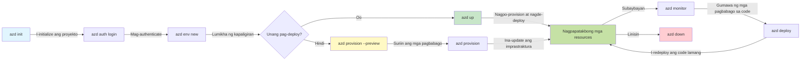
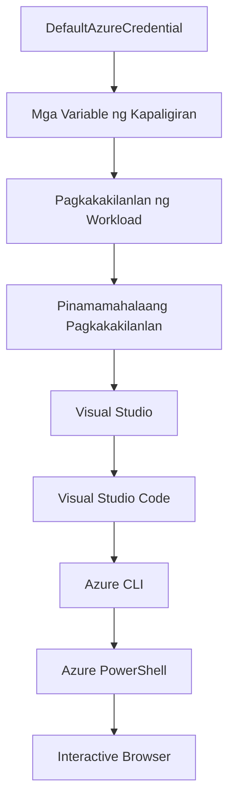

<!--
CO_OP_TRANSLATOR_METADATA:
{
  "original_hash": "e855e899d2705754fe85b04190edd0f0",
  "translation_date": "2025-11-22T10:21:08+00:00",
  "source_file": "docs/getting-started/azd-basics.md",
  "language_code": "tl"
}
-->
# AZD Pangunahing Kaalaman - Pag-unawa sa Azure Developer CLI

# AZD Pangunahing Kaalaman - Mga Pangunahing Konsepto at Batayan

**Pag-navigate sa Kabanata:**
- **📚 Bahay ng Kurso**: [AZD Para sa Mga Baguhan](../../README.md)
- **📖 Kasalukuyang Kabanata**: Kabanata 1 - Pundasyon at Mabilisang Pagsisimula
- **⬅️ Nakaraan**: [Pangkalahatang-ideya ng Kurso](../../README.md#-chapter-1-foundation--quick-start)
- **➡️ Susunod**: [Pag-install at Pag-set up](installation.md)
- **🚀 Susunod na Kabanata**: [Kabanata 2: AI-First Development](../microsoft-foundry/microsoft-foundry-integration.md)

## Panimula

Ang araling ito ay magpapakilala sa iyo sa Azure Developer CLI (azd), isang makapangyarihang tool sa command-line na nagpapabilis ng iyong paglalakbay mula sa lokal na pag-develop patungo sa Azure deployment. Matututuhan mo ang mga pangunahing konsepto, pangunahing tampok, at kung paano pinapasimple ng azd ang pag-deploy ng cloud-native na aplikasyon.

## Mga Layunin sa Pagkatuto

Sa pagtatapos ng araling ito, ikaw ay:
- Maiintindihan kung ano ang Azure Developer CLI at ang pangunahing layunin nito
- Matututo ng mga pangunahing konsepto ng templates, environments, at services
- Matutuklasan ang mga pangunahing tampok kabilang ang template-driven development at Infrastructure as Code
- Maiintindihan ang istruktura at workflow ng azd project
- Handa nang mag-install at mag-configure ng azd para sa iyong development environment

## Mga Resulta ng Pagkatuto

Pagkatapos makumpleto ang araling ito, magagawa mong:
- Ipaliwanag ang papel ng azd sa modernong cloud development workflows
- Tukuyin ang mga bahagi ng isang azd project structure
- Ilarawan kung paano nagtutulungan ang templates, environments, at services
- Maunawaan ang mga benepisyo ng Infrastructure as Code gamit ang azd
- Makilala ang iba't ibang azd commands at ang kanilang mga layunin

## Ano ang Azure Developer CLI (azd)?

Ang Azure Developer CLI (azd) ay isang command-line tool na idinisenyo upang pabilisin ang iyong paglalakbay mula sa lokal na pag-develop patungo sa Azure deployment. Pinapasimple nito ang proseso ng pagbuo, pag-deploy, at pamamahala ng cloud-native na mga aplikasyon sa Azure.

### 🎯 Bakit Gamitin ang AZD? Isang Real-World na Paghahambing

Ihambing natin ang pag-deploy ng isang simpleng web app na may database:

#### ❌ WALANG AZD: Manual na Azure Deployment (30+ minuto)

```bash
# Hakbang 1: Lumikha ng resource group
az group create --name myapp-rg --location eastus

# Hakbang 2: Lumikha ng App Service Plan
az appservice plan create --name myapp-plan \
  --resource-group myapp-rg \
  --sku B1 --is-linux

# Hakbang 3: Lumikha ng Web App
az webapp create --name myapp-web-unique123 \
  --resource-group myapp-rg \
  --plan myapp-plan \
  --runtime "NODE:18-lts"

# Hakbang 4: Lumikha ng Cosmos DB account (10-15 minuto)
az cosmosdb create --name myapp-cosmos-unique123 \
  --resource-group myapp-rg \
  --kind MongoDB

# Hakbang 5: Lumikha ng database
az cosmosdb mongodb database create \
  --account-name myapp-cosmos-unique123 \
  --resource-group myapp-rg \
  --name tododb

# Hakbang 6: Lumikha ng koleksyon
az cosmosdb mongodb collection create \
  --account-name myapp-cosmos-unique123 \
  --resource-group myapp-rg \
  --database-name tododb \
  --name todos

# Hakbang 7: Kunin ang connection string
CONN_STR=$(az cosmosdb keys list \
  --name myapp-cosmos-unique123 \
  --resource-group myapp-rg \
  --type connection-strings \
  --query "connectionStrings[0].connectionString" -o tsv)

# Hakbang 8: I-configure ang app settings
az webapp config appsettings set \
  --name myapp-web-unique123 \
  --resource-group myapp-rg \
  --settings MONGODB_URI="$CONN_STR"

# Hakbang 9: I-enable ang logging
az webapp log config --name myapp-web-unique123 \
  --resource-group myapp-rg \
  --application-logging filesystem \
  --detailed-error-messages true

# Hakbang 10: I-set up ang Application Insights
az monitor app-insights component create \
  --app myapp-insights \
  --location eastus \
  --resource-group myapp-rg

# Hakbang 11: I-link ang App Insights sa Web App
INSTRUMENTATION_KEY=$(az monitor app-insights component show \
  --app myapp-insights \
  --resource-group myapp-rg \
  --query "instrumentationKey" -o tsv)

az webapp config appsettings set \
  --name myapp-web-unique123 \
  --resource-group myapp-rg \
  --settings APPINSIGHTS_INSTRUMENTATIONKEY="$INSTRUMENTATION_KEY"

# Hakbang 12: I-build ang application nang lokal
npm install
npm run build

# Hakbang 13: Lumikha ng deployment package
zip -r app.zip . -x "*.git*" "node_modules/*"

# Hakbang 14: I-deploy ang application
az webapp deployment source config-zip \
  --resource-group myapp-rg \
  --name myapp-web-unique123 \
  --src app.zip

# Hakbang 15: Maghintay at magdasal na gumana ito 🙏
# (Walang automated validation, kinakailangan ng manual testing)
```

**Mga Problema:**
- ❌ 15+ na commands na kailangang tandaan at isagawa nang sunod-sunod
- ❌ 30-45 minutong manual na trabaho
- ❌ Madaling magkamali (typos, maling parameters)
- ❌ Ang mga connection string ay nakikita sa terminal history
- ❌ Walang automated rollback kung may magkamali
- ❌ Mahirap ulitin para sa mga miyembro ng team
- ❌ Iba-iba bawat oras (hindi reproducible)

#### ✅ MAY AZD: Automated Deployment (5 commands, 10-15 minuto)

```bash
# Hakbang 1: Magsimula mula sa template
azd init --template todo-nodejs-mongo

# Hakbang 2: Magpatunay
azd auth login

# Hakbang 3: Lumikha ng kapaligiran
azd env new dev

# Hakbang 4: I-preview ang mga pagbabago (opsyonal ngunit inirerekomenda)
azd provision --preview

# Hakbang 5: I-deploy ang lahat
azd up

# ✨ Tapos na! Lahat ay na-deploy, na-configure, at na-monitor
```

**Mga Benepisyo:**
- ✅ **5 commands** kumpara sa 15+ manual na hakbang
- ✅ **10-15 minuto** kabuuang oras (karamihan ay paghihintay sa Azure)
- ✅ **Walang error** - automated at nasubukan
- ✅ **Ligtas na pamamahala ng mga secrets** gamit ang Key Vault
- ✅ **Automatic rollback** kapag may pagkabigo
- ✅ **Ganap na reproducible** - parehong resulta bawat oras
- ✅ **Handa para sa team** - kahit sino ay maaaring mag-deploy gamit ang parehong commands
- ✅ **Infrastructure as Code** - version-controlled na Bicep templates
- ✅ **Built-in monitoring** - Application Insights na awtomatikong naka-configure

### 📊 Pagbawas ng Oras at Error

| Sukatan | Manual Deployment | AZD Deployment | Pagpapabuti |
|:-------|:------------------|:---------------|:------------|
| **Commands** | 15+ | 5 | 67% mas kaunti |
| **Oras** | 30-45 min | 10-15 min | 60% mas mabilis |
| **Error Rate** | ~40% | <5% | 88% pagbawas |
| **Konsistensya** | Mababa (manual) | 100% (automated) | Perpekto |
| **Onboarding ng Team** | 2-4 oras | 30 minuto | 75% mas mabilis |
| **Rollback Time** | 30+ min (manual) | 2 min (automated) | 93% mas mabilis |

## Mga Pangunahing Konsepto

### Templates
Ang templates ang pundasyon ng azd. Naglalaman ang mga ito ng:
- **Application code** - Ang iyong source code at mga dependencies
- **Infrastructure definitions** - Mga Azure resources na tinukoy sa Bicep o Terraform
- **Configuration files** - Mga setting at environment variables
- **Deployment scripts** - Mga automated deployment workflows

### Environments
Ang environments ay kumakatawan sa iba't ibang deployment targets:
- **Development** - Para sa testing at development
- **Staging** - Pre-production environment
- **Production** - Live production environment

Ang bawat environment ay may sariling:
- Azure resource group
- Mga configuration settings
- Deployment state

### Services
Ang services ay ang mga bahagi ng iyong aplikasyon:
- **Frontend** - Mga web application, SPAs
- **Backend** - Mga API, microservices
- **Database** - Mga solusyon sa data storage
- **Storage** - File at blob storage

## Mga Pangunahing Tampok

### 1. Template-Driven Development
```bash
# Mag-browse ng mga available na template
azd template list

# I-initialize mula sa isang template
azd init --template <template-name>
```

### 2. Infrastructure as Code
- **Bicep** - Wika ng Azure na partikular sa domain
- **Terraform** - Multi-cloud infrastructure tool
- **ARM Templates** - Azure Resource Manager templates

### 3. Integrated Workflows
```bash
# Kumpletuhin ang workflow ng pag-deploy
azd up            # Maglaan + Mag-deploy ito ay walang kamay para sa unang setup

# 🧪 BAGO: I-preview ang mga pagbabago sa imprastraktura bago ang pag-deploy (LIGTAS)
azd provision --preview    # I-simulate ang pag-deploy ng imprastraktura nang hindi gumagawa ng mga pagbabago

azd provision     # Lumikha ng mga Azure na mapagkukunan kung ia-update mo ang imprastraktura gamitin ito
azd deploy        # I-deploy ang code ng aplikasyon o muling i-deploy ang code ng aplikasyon kapag na-update
azd down          # Linisin ang mga mapagkukunan
```

#### 🛡️ Ligtas na Pagpaplano ng Infrastructure gamit ang Preview
Ang `azd provision --preview` command ay isang game-changer para sa ligtas na deployments:
- **Dry-run analysis** - Ipinapakita kung ano ang malilikha, mababago, o mabubura
- **Zero risk** - Walang aktwal na pagbabago sa iyong Azure environment
- **Team collaboration** - Maaaring ibahagi ang resulta ng preview bago ang deployment
- **Cost estimation** - Maunawaan ang gastos ng resources bago mag-commit

```bash
# Halimbawa ng preview na daloy ng trabaho
azd provision --preview           # Tingnan kung ano ang magbabago
# Suriin ang output, talakayin sa koponan
azd provision                     # Ilapat ang mga pagbabago nang may kumpiyansa
```

### 📊 Visual: AZD Development Workflow


**Paliwanag ng Workflow:**
1. **Init** - Magsimula gamit ang template o bagong proyekto
2. **Auth** - Mag-authenticate sa Azure
3. **Environment** - Gumawa ng hiwalay na deployment environment
4. **Preview** - 🆕 Laging i-preview ang mga pagbabago sa infrastructure muna (ligtas na kasanayan)
5. **Provision** - Lumikha/mag-update ng mga Azure resources
6. **Deploy** - I-push ang iyong application code
7. **Monitor** - Obserbahan ang performance ng aplikasyon
8. **Iterate** - Gumawa ng mga pagbabago at muling i-deploy ang code
9. **Cleanup** - Alisin ang mga resources kapag tapos na

### 4. Pamamahala ng Environment
```bash
# Lumikha at pamahalaan ang mga kapaligiran
azd env new <environment-name>
azd env select <environment-name>
azd env list
```

## 📁 Istruktura ng Proyekto

Isang tipikal na istruktura ng azd project:
```
my-app/
├── .azd/                    # azd configuration
│   └── config.json
├── .azure/                  # Azure deployment artifacts
├── .devcontainer/          # Development container config
├── .github/workflows/      # GitHub Actions
├── .vscode/               # VS Code settings
├── infra/                 # Infrastructure code
│   ├── main.bicep        # Main infrastructure template
│   ├── main.parameters.json
│   └── modules/          # Reusable modules
├── src/                  # Application source code
│   ├── api/             # Backend services
│   └── web/             # Frontend application
├── azure.yaml           # azd project configuration
└── README.md
```

## 🔧 Mga Configuration File

### azure.yaml
Ang pangunahing configuration file ng proyekto:
```yaml
name: my-awesome-app
metadata:
  template: my-template@1.0.0

services:
  web:
    project: ./src/web
    language: js
    host: appservice
  api:
    project: ./src/api
    language: js
    host: appservice

hooks:
  preprovision:
    shell: pwsh
    run: echo "Preparing to provision..."
```

### .azure/config.json
Environment-specific na configuration:
```json
{
  "version": 1,
  "defaultEnvironment": "dev",
  "environments": {
    "dev": {
      "subscriptionId": "your-subscription-id",
      "location": "eastus"
    }
  }
}
```

## 🎪 Karaniwang Workflows na may Mga Praktikal na Ehersisyo

> **💡 Tip sa Pagkatuto:** Sundin ang mga ehersisyong ito nang sunod-sunod upang unti-unting mahasa ang iyong mga kasanayan sa AZD.

### 🎯 Ehersisyo 1: I-initialize ang Iyong Unang Proyekto

**Layunin:** Gumawa ng isang AZD project at tuklasin ang istruktura nito

**Mga Hakbang:**
```bash
# Gumamit ng subok na template
azd init --template todo-nodejs-mongo

# Suriin ang mga nalikhang file
ls -la  # Tingnan ang lahat ng file kabilang ang mga nakatago

# Mga pangunahing file na nalikha:
# - azure.yaml (pangunahing config)
# - infra/ (code ng imprastruktura)
# - src/ (code ng aplikasyon)
```

**✅ Tagumpay:** Mayroon kang azure.yaml, infra/, at src/ directories

---

### 🎯 Ehersisyo 2: Mag-deploy sa Azure

**Layunin:** Kumpletuhin ang end-to-end deployment

**Mga Hakbang:**
```bash
# 1. Mag-authenticate
az login && azd auth login

# 2. Gumawa ng kapaligiran
azd env new dev
azd env set AZURE_LOCATION eastus

# 3. I-preview ang mga pagbabago (INIREREKOMENDA)
azd provision --preview

# 4. I-deploy ang lahat
azd up

# 5. I-verify ang deployment
azd show    # Tingnan ang URL ng iyong app
```

**Inaasahang Oras:** 10-15 minuto  
**✅ Tagumpay:** Bubukas ang URL ng aplikasyon sa browser

---

### 🎯 Ehersisyo 3: Maramihang Environments

**Layunin:** Mag-deploy sa dev at staging

**Mga Hakbang:**
```bash
# Mayroon nang dev, lumikha ng staging
azd env new staging
azd env set AZURE_LOCATION westus2
azd up

# Lumipat sa pagitan nila
azd env list
azd env select dev
```

**✅ Tagumpay:** Dalawang hiwalay na resource groups sa Azure Portal

---

### 🛡️ Malinis na Simula: `azd down --force --purge`

Kapag kailangan mong ganap na i-reset:

```bash
azd down --force --purge
```

**Ano ang ginagawa nito:**
- `--force`: Walang confirmation prompts
- `--purge`: Binubura ang lahat ng lokal na estado at Azure resources

**Gamitin kapag:**
- Nabigo ang deployment sa kalagitnaan
- Nagpapalit ng mga proyekto
- Kailangan ng bagong simula

---

## 🎪 Orihinal na Sanggunian sa Workflow

### Pagsisimula ng Bagong Proyekto
```bash
# Paraan 1: Gamitin ang umiiral na template
azd init --template todo-nodejs-mongo

# Paraan 2: Magsimula mula sa simula
azd init

# Paraan 3: Gamitin ang kasalukuyang direktoryo
azd init .
```

### Siklo ng Pag-develop
```bash
# I-set up ang development environment
azd auth login
azd env new dev
azd env select dev

# I-deploy ang lahat
azd up

# Gumawa ng mga pagbabago at muling i-deploy
azd deploy

# Linisin kapag tapos na
azd down --force --purge # Ang command sa Azure Developer CLI ay isang **hard reset** para sa iyong environment—lalo na kapaki-pakinabang kapag nagto-troubleshoot ng mga nabigong deployment, naglilinis ng mga orphaned na resources, o naghahanda para sa isang bagong redeploy.
```

## Pag-unawa sa `azd down --force --purge`
Ang `azd down --force --purge` command ay isang makapangyarihang paraan upang ganap na alisin ang iyong azd environment at lahat ng kaugnay na resources. Narito ang breakdown ng ginagawa ng bawat flag:
```
--force
```
- Nilalaktawan ang mga confirmation prompts.
- Kapaki-pakinabang para sa automation o scripting kung saan hindi posible ang manual input.
- Tinitiyak na magpapatuloy ang teardown nang walang abala, kahit na may mga hindi pagkakatugma ang CLI.

```
--purge
```
Binubura ang **lahat ng kaugnay na metadata**, kabilang ang:
Environment state
Lokal na `.azure` folder
Cached deployment info
Pinipigilan ang azd mula sa "pag-alala" ng mga nakaraang deployment, na maaaring magdulot ng mga isyu tulad ng hindi tugmang resource groups o stale registry references.

### Bakit gamitin ang pareho?
Kapag nahirapan ka sa `azd up` dahil sa natitirang estado o bahagyang deployments, tinitiyak ng kombinasyong ito ang isang **malinis na simula**.

Lalo itong kapaki-pakinabang pagkatapos ng manual na pagtanggal ng resources sa Azure portal o kapag nagpapalit ng templates, environments, o resource group naming conventions.

### Pamamahala ng Maramihang Environments
```bash
# Lumikha ng staging na kapaligiran
azd env new staging
azd env select staging
azd up

# Bumalik sa dev
azd env select dev

# Ihambing ang mga kapaligiran
azd env list
```

## 🔐 Authentication at Mga Kredensyal

Ang pag-unawa sa authentication ay mahalaga para sa matagumpay na azd deployments. Gumagamit ang Azure ng iba't ibang paraan ng authentication, at ginagamit ng azd ang parehong credential chain na ginagamit ng iba pang Azure tools.

### Azure CLI Authentication (`az login`)

Bago gamitin ang azd, kailangan mong mag-authenticate sa Azure. Ang pinakakaraniwang paraan ay ang paggamit ng Azure CLI:

```bash
# Interaktibong pag-login (nagbubukas ng browser)
az login

# Mag-login gamit ang partikular na tenant
az login --tenant <tenant-id>

# Mag-login gamit ang service principal
az login --service-principal -u <app-id> -p <password> --tenant <tenant-id>

# Suriin ang kasalukuyang status ng pag-login
az account show

# Ilista ang mga magagamit na subscription
az account list --output table

# Itakda ang default na subscription
az account set --subscription <subscription-id>
```

### Daloy ng Authentication
1. **Interactive Login**: Binubuksan ang iyong default na browser para sa authentication
2. **Device Code Flow**: Para sa mga environment na walang access sa browser
3. **Service Principal**: Para sa automation at CI/CD scenarios
4. **Managed Identity**: Para sa mga aplikasyon na naka-host sa Azure

### DefaultAzureCredential Chain

Ang `DefaultAzureCredential` ay isang uri ng kredensyal na nagbibigay ng pinasimpleng karanasan sa authentication sa pamamagitan ng awtomatikong pagsubok sa iba't ibang pinagmulan ng kredensyal sa isang partikular na pagkakasunod-sunod:

#### Pagkakasunod-sunod ng Credential Chain

#### 1. Environment Variables
```bash
# Itakda ang mga variable ng kapaligiran para sa service principal
export AZURE_CLIENT_ID="<app-id>"
export AZURE_CLIENT_SECRET="<password>"
export AZURE_TENANT_ID="<tenant-id>"
```

#### 2. Workload Identity (Kubernetes/GitHub Actions)
Awtomatikong ginagamit sa:
- Azure Kubernetes Service (AKS) gamit ang Workload Identity
- GitHub Actions gamit ang OIDC federation
- Iba pang federated identity scenarios

#### 3. Managed Identity
Para sa mga Azure resources tulad ng:
- Virtual Machines
- App Service
- Azure Functions
- Container Instances

```bash
# Suriin kung tumatakbo sa Azure resource na may managed identity
az account show --query "user.type" --output tsv
# Nagbabalik: "servicePrincipal" kung gumagamit ng managed identity
```

#### 4. Integration ng Developer Tools
- **Visual Studio**: Awtomatikong ginagamit ang naka-sign in na account
- **VS Code**: Ginagamit ang Azure Account extension credentials
- **Azure CLI**: Ginagamit ang `az login` credentials (pinakakaraniwan para sa lokal na pag-develop)

### AZD Authentication Setup

```bash
# Paraan 1: Gamitin ang Azure CLI (Inirerekomenda para sa pag-develop)
az login
azd auth login  # Gumagamit ng umiiral na mga kredensyal ng Azure CLI

# Paraan 2: Direktang azd na pagpapatotoo
azd auth login --use-device-code  # Para sa mga headless na kapaligiran

# Paraan 3: Suriin ang status ng pagpapatotoo
azd auth login --check-status

# Paraan 4: Mag-logout at muling magpatotoo
azd auth logout
azd auth login
```

### Mga Pinakamahusay na Kasanayan sa Authentication

#### Para sa Lokal na Pag-develop
```bash
# 1. Mag-login gamit ang Azure CLI
az login

# 2. Tiyakin ang tamang subscription
az account show
az account set --subscription "Your Subscription Name"

# 3. Gamitin ang azd gamit ang umiiral na mga kredensyal
azd auth login
```

#### Para sa CI/CD Pipelines
```yaml
# GitHub Actions example
- name: Azure Login
  uses: azure/login@v1
  with:
    creds: ${{ secrets.AZURE_CREDENTIALS }}

- name: Deploy with azd
  run: |
    azd auth login --client-id ${{ secrets.AZURE_CLIENT_ID }} \
                    --client-secret ${{ secrets.AZURE_CLIENT_SECRET }} \
                    --tenant-id ${{ secrets.AZURE_TENANT_ID }}
    azd up --no-prompt
```

#### Para sa Production Environments
- Gamitin ang **Managed Identity** kapag tumatakbo sa Azure resources
- Gamitin ang **Service Principal** para sa automation scenarios
- Iwasang mag-imbak ng mga kredensyal sa code o configuration files
- Gamitin ang **Azure Key Vault** para sa sensitibong configuration

### Mga Karaniwang Isyu sa Authentication at Solusyon

#### Isyu: "Walang subscription na natagpuan"
```bash
# Solusyon: Itakda ang default na subscription
az account list --output table
az account set --subscription "<subscription-id>"
azd env set AZURE_SUBSCRIPTION_ID "<subscription-id>"
```

#### Isyu: "Kulang sa mga pahintulot"
```bash
# Solusyon: Suriin at italaga ang mga kinakailangang tungkulin
az role assignment list --assignee $(az account show --query user.name --output tsv)

# Karaniwang kinakailangang tungkulin:
# - Contributor (para sa pamamahala ng mga mapagkukunan)
# - User Access Administrator (para sa mga pagtatalaga ng tungkulin)
```

#### Isyu: "Nag-expire ang token"
```bash
# Solusyon: Muling magpatotoo
az logout
az login
azd auth logout
azd auth login
```

### Authentication sa Iba't Ibang Scenarios

#### Lokal na Pag-develop
```bash
# Personal na account ng pag-unlad
az login
azd auth login
```

#### Team Development
```bash
# Gumamit ng partikular na tenant para sa organisasyon
az login --tenant contoso.onmicrosoft.com
azd auth login
```

#### Multi-tenant Scenarios
```bash
# Lumipat sa pagitan ng mga nangungupahan
az login --tenant tenant1.onmicrosoft.com
# I-deploy sa nangungupahan 1
azd up

az login --tenant tenant2.onmicrosoft.com  
# I-deploy sa nangungupahan 2
azd up
```

### Mga Pagsasaalang-alang sa Seguridad

1. **Pag-iimbak ng Kredensyal**: Huwag kailanman mag-imbak ng mga kredensyal sa source code
2. **Limitasyon ng Saklaw**: Gamitin ang prinsipyo ng least-privilege para sa service principals
3. **Pag-ikot ng Token**: Regular na i-rotate ang mga service principal secrets
4. **Audit Trail**: Subaybayan ang mga aktibidad sa authentication at deployment
5. **Seguridad ng Network**: Gumamit ng mga private endpoint kung maaari

### Pag-troubleshoot ng Authentication

```bash
# I-debug ang mga isyu sa pagpapatotoo
azd auth login --check-status
az account show
az account get-access-token

# Karaniwang mga utos para sa diagnostic
whoami                          # Kasalukuyang konteksto ng gumagamit
az ad signed-in-user show      # Mga detalye ng gumagamit ng Azure AD
az group list                  # Subukan ang pag-access sa mapagkukunan
```

## Pag-unawa sa `azd down --force --purge`

### Pagtuklas
```bash
azd template list              # Mag-browse ng mga template
azd template show <template>   # Mga detalye ng template
azd init --help               # Mga opsyon sa inisyal na pagsisimula
```

### Pamamahala ng Proyekto
```bash
azd show                     # Pangkalahatang-ideya ng proyekto
azd env show                 # Kasalukuyang kapaligiran
azd config list             # Mga setting ng configuration
```

### Pagsubaybay
```bash
azd monitor                  # Buksan ang Azure portal
azd pipeline config          # I-set up ang CI/CD
azd logs                     # Tingnan ang mga log ng aplikasyon
```

## Mga Pinakamahusay na Kasanayan

### 1. Gumamit ng Makahulugang Pangalan
```bash
# Mabuti
azd env new production-east
azd init --template web-app-secure

# Iwasan
azd env new env1
azd init --template template1
```

### 2. Gamitin ang Templates
- Magsimula sa mga umiiral na templates
- I-customize ayon sa iyong pangangailangan
- Gumawa ng reusable templates para sa iyong organisasyon

### 3. Paghiwalay ng Environment
- Gumamit ng hiwalay na environments para sa dev/staging/prod
- Huwag mag-deploy nang direkta sa production mula sa lokal na makina
- Gumamit ng CI/CD pipelines para sa production deployments

### 4. Pamamahala ng Configuration
- Gumamit ng environment variables para sa sensitibong data
- Panatilihin ang configuration sa version control
- I-dokumento ang mga environment-specific na setting

## Pag-unlad sa Pagkatuto

### Baguhan (Linggo 1-2)
1. I-install ang azd at mag-authenticate
2. Mag-deploy ng simpleng template
3. Maunawaan ang istruktura ng proyekto
4. Matutunan ang mga pangunahing commands (up, down, deploy)

### Intermediate (Linggo 3-4)
1. I-customize ang templates
2. Pamahalaan ang maramihang environments
3. Maunawaan ang infrastructure code
4. Mag-set up ng CI/CD pipelines

### Advanced (Linggo 5+)
1. Gumawa ng custom templates
2. Advanced na mga pattern ng infrastructure
3. Multi-region deployments
4. Enterprise-grade configurations

## Mga Susunod na Hakbang

**📖 Ipagpatuloy ang Pag-aaral sa Kabanata 1:**
- [Pag-install at Setup](installation.md) - I-install at i-configure ang azd
- [Ang Iyong Unang Proyekto](first-project.md) - Kumpletong hands-on na tutorial
- [Gabay sa Konfigurasyon](configuration.md) - Mga advanced na opsyon sa konfigurasyon

**🎯 Handa na para sa Susunod na Kabanata?**
- [Kabanata 2: AI-First Development](../microsoft-foundry/microsoft-foundry-integration.md) - Simulan ang paggawa ng AI applications

## Karagdagang Mga Mapagkukunan

- [Pangkalahatang-ideya ng Azure Developer CLI](https://learn.microsoft.com/en-us/azure/developer/azure-developer-cli/)
- [Gallery ng Template](https://azure.github.io/awesome-azd/)
- [Mga Halimbawa ng Komunidad](https://github.com/Azure-Samples)

---

## 🙋 Mga Madalas Itanong

### Mga Pangkalahatang Tanong

**T: Ano ang pagkakaiba ng AZD at Azure CLI?**

S: Ang Azure CLI (`az`) ay para sa pamamahala ng mga indibidwal na Azure resources. Ang AZD (`azd`) ay para sa pamamahala ng buong aplikasyon:

```bash
# Azure CLI - Pamamahala ng mababang antas na mapagkukunan
az webapp create --name myapp --resource-group rg
az sql server create --name myserver --resource-group rg
# ...marami pang mga utos ang kinakailangan

# AZD - Pamamahala sa antas ng aplikasyon
azd up  # Ini-deploy ang buong app kasama ang lahat ng mapagkukunan
```

**Ganito ang pag-isipan:**
- `az` = Pag-operate sa mga indibidwal na piraso ng Lego
- `azd` = Paggawa gamit ang buong set ng Lego

---

**T: Kailangan ko bang malaman ang Bicep o Terraform para magamit ang AZD?**

S: Hindi! Magsimula sa mga template:
```bash
# Gumamit ng umiiral na template - hindi kailangan ng kaalaman sa IaC
azd init --template todo-nodejs-mongo
azd up
```

Pwede mong pag-aralan ang Bicep sa kalaunan para i-customize ang infrastructure. Ang mga template ay nagbibigay ng mga gumaganang halimbawa para matutunan.

---

**T: Magkano ang gastos sa pagpapatakbo ng AZD templates?**

S: Nagkakaiba ang gastos depende sa template. Karamihan sa mga development templates ay nagkakahalaga ng $50-150/buwan:

```bash
# I-preview ang mga gastos bago mag-deploy
azd provision --preview

# Laging maglinis kapag hindi ginagamit
azd down --force --purge  # Tinatanggal ang lahat ng mga resources
```

**Pro tip:** Gamitin ang mga libreng tier kung saan posible:
- App Service: F1 (Free) tier
- Azure OpenAI: 50,000 tokens/buwan libre
- Cosmos DB: 1000 RU/s libreng tier

---

**T: Pwede ko bang gamitin ang AZD sa mga umiiral na Azure resources?**

S: Oo, pero mas madali kung magsisimula ka sa bago. Ang AZD ay pinakamahusay kapag ito ang namamahala sa buong lifecycle. Para sa mga umiiral na resources:

```bash
# Opsyon 1: I-import ang umiiral na mga resources (advanced)
azd init
# Pagkatapos ay baguhin ang infra/ upang i-refer ang umiiral na mga resources

# Opsyon 2: Magsimula ng bago (inirerekomenda)
azd init --template matching-your-stack
azd up  # Lumilikha ng bagong kapaligiran
```

---

**T: Paano ko maibabahagi ang aking proyekto sa mga kasamahan?**

S: I-commit ang AZD project sa Git (pero HUWAG isama ang .azure folder):

```bash
# Nasa .gitignore na bilang default
.azure/        # Naglalaman ng mga lihim at data ng kapaligiran
*.env          # Mga variable ng kapaligiran

# Mga miyembro ng koponan noon:
git clone <your-repo>
azd auth login
azd env new <their-name>-dev
azd up
```

Makakakuha ang lahat ng parehong infrastructure mula sa parehong mga template.

---

### Mga Tanong sa Pag-troubleshoot

**T: Nabigo ang "azd up" sa kalagitnaan. Ano ang gagawin ko?**

S: Tingnan ang error, ayusin ito, at subukang muli:

```bash
# Tingnan ang detalyadong mga log
azd show

# Karaniwang mga pag-aayos:

# 1. Kung lumampas sa quota:
azd env set AZURE_LOCATION "westus2"  # Subukan ang ibang rehiyon

# 2. Kung may salungatan sa pangalan ng resource:
azd down --force --purge  # Linisin ang lahat
azd up  # Subukang muli

# 3. Kung nag-expire ang awtorisasyon:
az login
azd auth login
azd up
```

**Pinakakaraniwang isyu:** Maling Azure subscription ang napili
```bash
az account list --output table
az account set --subscription "<correct-subscription>"
```

---

**T: Paano ko ide-deploy ang mga pagbabago sa code nang hindi nire-reprovision?**

S: Gamitin ang `azd deploy` sa halip na `azd up`:

```bash
azd up          # Unang beses: probisyon + pag-deploy (mabagal)

# Gumawa ng mga pagbabago sa code...

azd deploy      # Mga susunod na beses: pag-deploy lamang (mabilis)
```

Paghahambing ng bilis:
- `azd up`: 10-15 minuto (nagpo-provision ng infrastructure)
- `azd deploy`: 2-5 minuto (code lang)

---

**T: Pwede ko bang i-customize ang mga infrastructure templates?**

S: Oo! I-edit ang mga Bicep files sa `infra/`:

```bash
# Pagkatapos ng azd init
cd infra/
code main.bicep  # I-edit sa VS Code

# I-preview ang mga pagbabago
azd provision --preview

# I-apply ang mga pagbabago
azd provision
```

**Tip:** Magsimula sa maliit - baguhin muna ang mga SKUs:
```bicep
// infra/main.bicep
sku: {
  name: 'B1'  // Change to 'P1V2' for production
}
```

---

**T: Paano ko ide-delete ang lahat ng ginawa ng AZD?**

S: Isang command lang ang magtatanggal ng lahat ng resources:

```bash
azd down --force --purge

# Tinatanggal nito:
# - Lahat ng Azure resources
# - Resource group
# - Lokal na estado ng kapaligiran
# - Naka-cache na deployment data
```

**Laging gawin ito kapag:**
- Tapos na sa pag-test ng template
- Lumilipat sa ibang proyekto
- Gusto magsimula muli

**Pagtipid sa gastos:** Ang pagtanggal ng hindi nagagamit na resources = $0 na singil

---

**T: Paano kung aksidenteng na-delete ko ang mga resources sa Azure Portal?**

S: Maaaring mawala sa sync ang AZD state. Gamitin ang malinis na slate na paraan:

```bash
# 1. Alisin ang lokal na estado
azd down --force --purge

# 2. Magsimula muli
azd up

# Alternatibo: Hayaan ang AZD na tukuyin at ayusin
azd provision  # Lilikha ng mga nawawalang resources
```

---

### Mga Advanced na Tanong

**T: Pwede ko bang gamitin ang AZD sa CI/CD pipelines?**

S: Oo! Halimbawa ng GitHub Actions:

```yaml
# .github/workflows/deploy.yml
name: Deploy with AZD

on:
  push:
    branches: [main]

jobs:
  deploy:
    runs-on: ubuntu-latest
    steps:
      - uses: actions/checkout@v2
      
      - name: Install azd
        run: curl -fsSL https://aka.ms/install-azd.sh | bash
      
      - name: Azure Login
        run: |
          azd auth login \
            --client-id ${{ secrets.AZURE_CLIENT_ID }} \
            --client-secret ${{ secrets.AZURE_CLIENT_SECRET }} \
            --tenant-id ${{ secrets.AZURE_TENANT_ID }}
      
      - name: Deploy
        run: azd up --no-prompt
```

---

**T: Paano ko hahawakan ang mga secrets at sensitibong data?**

S: Ang AZD ay awtomatikong nag-iintegrate sa Azure Key Vault:

```bash
# Ang mga lihim ay nakaimbak sa Key Vault, hindi sa code
azd env set DATABASE_PASSWORD "$(openssl rand -base64 32)"

# Awtomatikong ginagawa ng AZD:
# 1. Lumilikha ng Key Vault
# 2. Nagtatago ng lihim
# 3. Nagbibigay ng access sa app sa pamamagitan ng Managed Identity
# 4. Ini-inject sa runtime
```

**Huwag kailanman i-commit:**
- `.azure/` folder (naglalaman ng environment data)
- `.env` files (lokal na secrets)
- Connection strings

---

**T: Pwede ba akong mag-deploy sa maraming rehiyon?**

S: Oo, gumawa ng environment para sa bawat rehiyon:

```bash
# Silangang US na kapaligiran
azd env new prod-eastus
azd env set AZURE_LOCATION eastus
azd up

# Kanlurang Europa na kapaligiran
azd env new prod-westeurope
azd env set AZURE_LOCATION westeurope
azd up

# Ang bawat kapaligiran ay independyente
azd env list
```

Para sa tunay na multi-region apps, i-customize ang Bicep templates para mag-deploy sa maraming rehiyon nang sabay-sabay.

---

**T: Saan ako makakakuha ng tulong kung ako'y natigil?**

1. **AZD Documentation:** https://learn.microsoft.com/azure/developer/azure-developer-cli/
2. **GitHub Issues:** https://github.com/Azure/azure-dev/issues
3. **Discord:** [Azure Discord](https://discord.gg/microsoft-azure) - #azure-developer-cli channel
4. **Stack Overflow:** Tag `azure-developer-cli`
5. **Ang Kursong Ito:** [Gabay sa Pag-troubleshoot](../troubleshooting/common-issues.md)

**Pro tip:** Bago magtanong, patakbuhin:
```bash
azd show       # Ipinapakita ang kasalukuyang estado
azd version    # Ipinapakita ang iyong bersyon
```
Isama ang impormasyong ito sa iyong tanong para sa mas mabilis na tulong.

---

## 🎓 Ano ang Susunod?

Ngayon ay nauunawaan mo na ang mga pangunahing kaalaman ng AZD. Pumili ng iyong landas:

### 🎯 Para sa mga Baguhan:
1. **Susunod:** [Pag-install at Setup](installation.md) - I-install ang AZD sa iyong makina
2. **Pagkatapos:** [Ang Iyong Unang Proyekto](first-project.md) - I-deploy ang iyong unang app
3. **Magsanay:** Kumpletuhin ang lahat ng 3 ehersisyo sa araling ito

### 🚀 Para sa mga AI Developers:
1. **Laktawan sa:** [Kabanata 2: AI-First Development](../microsoft-foundry/microsoft-foundry-integration.md)
2. **I-deploy:** Magsimula sa `azd init --template get-started-with-ai-chat`
3. **Matuto:** Gumawa habang nagde-deploy

### 🏗️ Para sa mga May Karanasan:
1. **Suriin:** [Gabay sa Konfigurasyon](configuration.md) - Mga advanced na setting
2. **Galugarin:** [Infrastructure as Code](../deployment/provisioning.md) - Malalimang pag-aaral sa Bicep
3. **Gumawa:** Lumikha ng custom na mga template para sa iyong stack

---

**Pag-navigate sa Kabanata:**
- **📚 Home ng Kurso**: [AZD Para sa mga Baguhan](../../README.md)
- **📖 Kasalukuyang Kabanata**: Kabanata 1 - Foundation & Quick Start  
- **⬅️ Nakaraan**: [Pangkalahatang-ideya ng Kurso](../../README.md#-chapter-1-foundation--quick-start)
- **➡️ Susunod**: [Pag-install at Setup](installation.md)
- **🚀 Susunod na Kabanata**: [Kabanata 2: AI-First Development](../microsoft-foundry/microsoft-foundry-integration.md)

---

<!-- CO-OP TRANSLATOR DISCLAIMER START -->
**Paunawa**:  
Ang dokumentong ito ay isinalin gamit ang AI translation service na [Co-op Translator](https://github.com/Azure/co-op-translator). Bagama't sinisikap naming maging tumpak, pakitandaan na ang mga awtomatikong pagsasalin ay maaaring maglaman ng mga pagkakamali o hindi pagkakatugma. Ang orihinal na dokumento sa orihinal nitong wika ang dapat ituring na opisyal na sanggunian. Para sa mahalagang impormasyon, inirerekomenda ang propesyonal na pagsasalin ng tao. Hindi kami mananagot sa anumang hindi pagkakaunawaan o maling interpretasyon na dulot ng paggamit ng pagsasaling ito.
<!-- CO-OP TRANSLATOR DISCLAIMER END -->