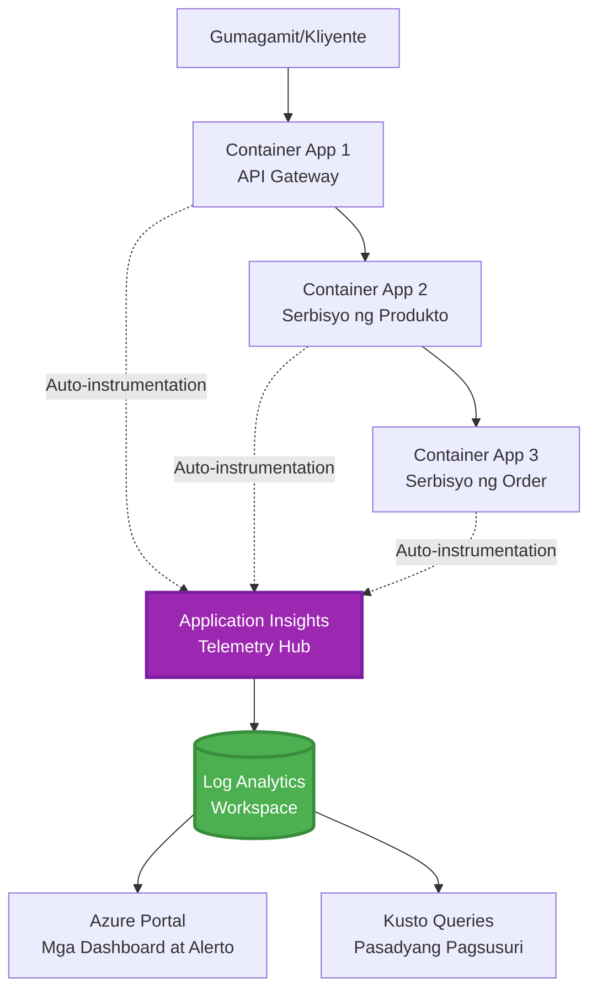
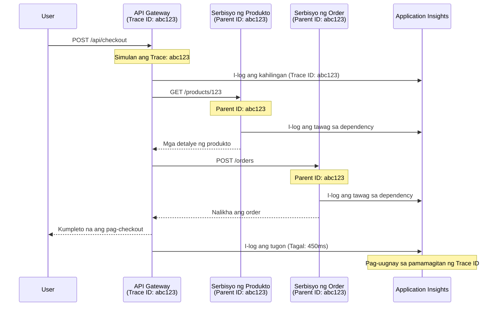

# Pagsasama ng Application Insights sa AZD

⏱️ **Tinatayang Oras**: 40-50 minuto | 💰 **Halaga**: ~$5-15/buwan | ⭐ **Kahirapan**: Katamtaman

**📚 Landas ng Pag-aaral:**
- ← Nakaraan: [Mga Preflight Check](preflight-checks.md) - Pag-validate bago mag-deploy
- 🎯 **Narito Ka**: Pagsasama ng Application Insights (Pagsubaybay, telemetry, pag-debug)
- → Susunod: [Gabay sa Pag-deploy](../deployment/deployment-guide.md) - Pag-deploy sa Azure
- 🏠 [Pangunahing Kurso](../../README.md)

---

## Ano ang Iyong Matututuhan

Sa pagtatapos ng araling ito, matututuhan mo:
- Isama ang **Application Insights** sa mga proyekto ng AZD nang awtomatiko
- I-configure ang **distributed tracing** para sa mga microservice
- Magpatupad ng **custom telemetry** (mga metric, event, dependency)
- Mag-set up ng **live metrics** para sa real-time na pagsubaybay
- Gumawa ng **mga alerto at dashboard** mula sa mga deployment ng AZD
- Mag-debug ng mga isyu sa produksyon gamit ang **telemetry queries**
- I-optimize ang **mga gastos at sampling** na estratehiya
- Subaybayan ang **AI/LLM application** (mga token, latency, gastos)

## Bakit Mahalaga ang Application Insights sa AZD

### Ang Hamon: Pagsubaybay sa Produksyon

**Kung Walang Application Insights:**
```
❌ No visibility into production behavior
❌ Manual log aggregation across services
❌ Reactive debugging (wait for customer complaints)
❌ No performance metrics
❌ Cannot trace requests across services
❌ Unknown failure rates and bottlenecks
```

**Kung May Application Insights + AZD:**
```
✅ Automatic telemetry collection
✅ Centralized logs from all services
✅ Proactive issue detection
✅ End-to-end request tracing
✅ Performance metrics and insights
✅ Real-time dashboards
✅ AZD provisions everything automatically
```

**Analohiya**: Ang Application Insights ay parang "black box" flight recorder + cockpit dashboard para sa iyong aplikasyon. Makikita mo ang lahat ng nangyayari sa real-time at maaring ulitin ang anumang insidente.

---

## Pangkalahatang-ideya ng Arkitektura

### Application Insights sa Arkitektura ng AZD


### Ano ang Awtomatikong Nasusubaybayan

| Uri ng Telemetry | Ano ang Kinukuha | Gamit |
|------------------|------------------|-------|
| **Mga Request** | HTTP request, status code, tagal | Pagsubaybay sa performance ng API |
| **Mga Dependency** | Panlabas na tawag (DB, API, storage) | Tukuyin ang mga bottleneck |
| **Mga Exception** | Hindi inaasahang error na may stack trace | Pag-debug ng mga pagkabigo |
| **Custom Event** | Mga event ng negosyo (signup, pagbili) | Analytics at funnel |
| **Mga Metric** | Performance counter, custom metric | Pagpaplano ng kapasidad |
| **Mga Trace** | Mga log message na may severity | Pag-debug at pag-audit |
| **Availability** | Mga pagsubok sa uptime at response time | Pagsubaybay sa SLA |

---

## Mga Kinakailangan

### Mga Kinakailangang Tool

```bash
# I-verify ang Azure Developer CLI
azd version
# ✅ Inaasahan: azd bersyon 1.0.0 o mas mataas

# I-verify ang Azure CLI
az --version
# ✅ Inaasahan: azure-cli 2.50.0 o mas mataas
```

### Mga Kinakailangan sa Azure

- Aktibong subscription sa Azure
- Mga pahintulot upang lumikha ng:
  - Mga resource ng Application Insights
  - Log Analytics workspace
  - Container Apps
  - Resource group

### Kinakailangang Kaalaman

Dapat mo nang natapos ang:
- [Mga Pangunahing Kaalaman sa AZD](../getting-started/azd-basics.md) - Mga pangunahing konsepto ng AZD
- [Configuration](../getting-started/configuration.md) - Pagsasaayos ng kapaligiran
- [Unang Proyekto](../getting-started/first-project.md) - Pangunahing deployment

---

## Aralin 1: Awtomatikong Application Insights gamit ang AZD

### Paano Nagpo-provision ng Application Insights ang AZD

Awtomatikong nililikha at kino-configure ng AZD ang Application Insights kapag nag-deploy ka. Tingnan natin kung paano ito gumagana.

### Istruktura ng Proyekto

```
monitored-app/
├── azure.yaml                     # AZD configuration
├── infra/
│   ├── main.bicep                # Main infrastructure
│   ├── core/
│   │   └── monitoring.bicep      # Application Insights + Log Analytics
│   └── app/
│       └── api.bicep             # Container App with monitoring
└── src/
    ├── app.py                    # Application with telemetry
    ├── requirements.txt
    └── Dockerfile
```

---

### Hakbang 1: I-configure ang AZD (azure.yaml)

**File: `azure.yaml`**

```yaml
name: monitored-app
metadata:
  template: monitored-app@1.0.0

services:
  api:
    project: ./src
    language: python
    host: containerapp

# AZD automatically provisions monitoring!
```

**Iyon na!** Awtomatikong gagawa ang AZD ng Application Insights. Walang karagdagang configuration na kailangan para sa pangunahing pagsubaybay.

---

### Hakbang 2: Monitoring Infrastructure (Bicep)

**File: `infra/core/monitoring.bicep`**

```bicep
param logAnalyticsName string
param applicationInsightsName string
param location string = resourceGroup().location
param tags object = {}

// Log Analytics Workspace (required for Application Insights)
resource logAnalytics 'Microsoft.OperationalInsights/workspaces@2022-10-01' = {
  name: logAnalyticsName
  location: location
  tags: tags
  properties: {
    sku: {
      name: 'PerGB2018'  // Pay-as-you-go pricing
    }
    retentionInDays: 30  // Keep logs for 30 days
    features: {
      enableLogAccessUsingOnlyResourcePermissions: true
    }
  }
}

// Application Insights
resource applicationInsights 'Microsoft.Insights/components@2020-02-02' = {
  name: applicationInsightsName
  location: location
  tags: tags
  kind: 'web'
  properties: {
    Application_Type: 'web'
    WorkspaceResourceId: logAnalytics.id
    IngestionMode: 'LogAnalytics'
    publicNetworkAccessForIngestion: 'Enabled'
    publicNetworkAccessForQuery: 'Enabled'
  }
}

// Outputs for Container Apps
output logAnalyticsWorkspaceId string = logAnalytics.id
output logAnalyticsWorkspaceName string = logAnalytics.name
output applicationInsightsConnectionString string = applicationInsights.properties.ConnectionString
output applicationInsightsInstrumentationKey string = applicationInsights.properties.InstrumentationKey
output applicationInsightsName string = applicationInsights.name
```

---

### Hakbang 3: Ikonekta ang Container App sa Application Insights

**File: `infra/app/api.bicep`**

```bicep
param name string
param location string
param tags object = {}
param containerAppsEnvironmentName string
param applicationInsightsConnectionString string

resource containerApp 'Microsoft.App/containerApps@2023-05-01' = {
  name: name
  location: location
  tags: tags
  properties: {
    configuration: {
      ingress: {
        external: true
        targetPort: 8000
      }
      secrets: [
        {
          name: 'appinsights-connection-string'
          value: applicationInsightsConnectionString
        }
      ]
    }
    template: {
      containers: [
        {
          name: 'api'
          image: 'myregistry.azurecr.io/api:latest'
          resources: {
            cpu: json('0.5')
            memory: '1Gi'
          }
          env: [
            {
              name: 'APPLICATIONINSIGHTS_CONNECTION_STRING'
              secretRef: 'appinsights-connection-string'
            }
            {
              name: 'APPLICATIONINSIGHTS_ENABLED'
              value: 'true'
            }
          ]
        }
      ]
    }
  }
}

output uri string = 'https://${containerApp.properties.configuration.ingress.fqdn}'
```

---

### Hakbang 4: Application Code na may Telemetry

**File: `src/app.py`**

```python
from flask import Flask, request, jsonify
from opencensus.ext.azure.log_exporter import AzureLogHandler
from opencensus.ext.azure.trace_exporter import AzureExporter
from opencensus.ext.flask.flask_middleware import FlaskMiddleware
from opencensus.trace.samplers import ProbabilitySampler
import logging
import os

app = Flask(__name__)

# Kunin ang koneksyon string ng Application Insights
connection_string = os.environ.get('APPLICATIONINSIGHTS_CONNECTION_STRING')

if connection_string:
    # I-configure ang distributed tracing
    middleware = FlaskMiddleware(
        app,
        exporter=AzureExporter(connection_string=connection_string),
        sampler=ProbabilitySampler(rate=1.0)  # 100% sampling para sa dev
    )
    
    # I-configure ang pag-log
    logger = logging.getLogger(__name__)
    logger.addHandler(AzureLogHandler(connection_string=connection_string))
    logger.setLevel(logging.INFO)
    
    print("✅ Application Insights enabled")
else:
    logger = logging.getLogger(__name__)
    logger.setLevel(logging.INFO)
    print("⚠️ Application Insights not configured")

@app.route('/health')
def health():
    logger.info('Health check endpoint called')
    return jsonify({'status': 'healthy', 'monitoring': 'enabled'})

@app.route('/api/products')
def get_products():
    logger.info('Fetching products')
    
    # I-simulate ang tawag sa database (awtomatikong sinusubaybayan bilang dependency)
    products = [
        {'id': 1, 'name': 'Laptop', 'price': 999.99},
        {'id': 2, 'name': 'Mouse', 'price': 29.99},
        {'id': 3, 'name': 'Keyboard', 'price': 79.99}
    ]
    
    logger.info(f'Returned {len(products)} products')
    return jsonify(products)

@app.route('/api/error-test')
def error_test():
    """Test error tracking"""
    logger.error('Testing error tracking')
    try:
        raise ValueError('This is a test exception')
    except Exception as e:
        logger.exception('Exception occurred in error-test endpoint')
        return jsonify({'error': str(e)}), 500

@app.route('/api/slow')
def slow_endpoint():
    """Test performance tracking"""
    import time
    logger.info('Slow endpoint called')
    time.sleep(3)  # I-simulate ang mabagal na operasyon
    logger.warning('Endpoint took 3 seconds to respond')
    return jsonify({'message': 'Slow operation completed'})

if __name__ == '__main__':
    app.run(host='0.0.0.0', port=8000)
```

**File: `src/requirements.txt`**

```txt
Flask==3.0.0
opencensus-ext-azure==1.1.13
opencensus-ext-flask==0.8.1
gunicorn==21.2.0
```

---

### Hakbang 5: I-deploy at I-verify

```bash
# I-initialize ang AZD
azd init

# I-deploy (awtomatikong nagbibigay ng Application Insights)
azd up

# Kunin ang URL ng app
APP_URL=$(azd env get-values | grep API_URL | cut -d '=' -f2 | tr -d '"')

# Bumuo ng telemetry
curl $APP_URL/health
curl $APP_URL/api/products
curl $APP_URL/api/error-test
curl $APP_URL/api/slow
```

**✅ Inaasahang output:**
```json
{
  "status": "healthy",
  "monitoring": "enabled"
}
```

---

### Hakbang 6: Tingnan ang Telemetry sa Azure Portal

```bash
# Kunin ang mga detalye ng Application Insights
azd env get-values | grep APPLICATIONINSIGHTS

# Buksan sa Azure Portal
az monitor app-insights component show \
  --app $(azd env get-values | grep APPLICATIONINSIGHTS_NAME | cut -d '=' -f2 | tr -d '"') \
  --resource-group $(azd env get-values | grep AZURE_RESOURCE_GROUP | cut -d '=' -f2 | tr -d '"') \
  --query "appId" -o tsv
```

**Pumunta sa Azure Portal → Application Insights → Transaction Search**

Makikita mo:
- ✅ HTTP request na may status code
- ✅ Tagal ng request (3+ segundo para sa `/api/slow`)
- ✅ Detalye ng exception mula sa `/api/error-test`
- ✅ Mga custom log message

---

## Aralin 2: Custom Telemetry at Event

### Subaybayan ang Mga Event ng Negosyo

Magdagdag tayo ng custom telemetry para sa mga kritikal na event ng negosyo.

**File: `src/telemetry.py`**

```python
from opencensus.ext.azure import metrics_exporter
from opencensus.stats import aggregation as aggregation_module
from opencensus.stats import measure as measure_module
from opencensus.stats import stats as stats_module
from opencensus.stats import view as view_module
from opencensus.tags import tag_map as tag_map_module
from opencensus.ext.azure.log_exporter import AzureLogHandler
from opencensus.ext.azure.trace_exporter import AzureExporter
from opencensus.trace import tracer as tracer_module
import logging
import os

class TelemetryClient:
    """Custom telemetry client for Application Insights"""
    
    def __init__(self, connection_string=None):
        self.connection_string = connection_string or os.environ.get('APPLICATIONINSIGHTS_CONNECTION_STRING')
        
        if not self.connection_string:
            print("⚠️ Application Insights connection string not found")
            return
        
        # I-setup ang logger
        self.logger = logging.getLogger(__name__)
        self.logger.addHandler(AzureLogHandler(connection_string=self.connection_string))
        self.logger.setLevel(logging.INFO)
        
        # I-setup ang metrics exporter
        self.stats = stats_module.stats
        self.view_manager = self.stats.view_manager
        self.stats_recorder = self.stats.stats_recorder
        
        exporter = metrics_exporter.new_metrics_exporter(
            connection_string=self.connection_string
        )
        self.view_manager.register_exporter(exporter)
        
        # I-setup ang tracer
        self.tracer = tracer_module.Tracer(
            exporter=AzureExporter(connection_string=self.connection_string)
        )
        
        print("✅ Custom telemetry client initialized")
    
    def track_event(self, event_name: str, properties: dict = None):
        """Track custom business event"""
        properties = properties or {}
        self.logger.info(
            f"CustomEvent: {event_name}",
            extra={
                'custom_dimensions': {
                    'event_name': event_name,
                    **properties
                }
            }
        )
    
    def track_metric(self, metric_name: str, value: float, properties: dict = None):
        """Track custom metric"""
        properties = properties or {}
        self.logger.info(
            f"CustomMetric: {metric_name} = {value}",
            extra={
                'custom_dimensions': {
                    'metric_name': metric_name,
                    'value': value,
                    **properties
                }
            }
        )
    
    def track_dependency(self, name: str, dependency_type: str, duration: float, success: bool):
        """Track external dependency call"""
        with self.tracer.span(name=name) as span:
            span.add_attribute('dependency.type', dependency_type)
            span.add_attribute('duration', duration)
            span.add_attribute('success', success)

# Global na telemetry client
telemetry = TelemetryClient()
```

### I-update ang Application gamit ang Custom Event

**File: `src/app.py` (pinahusay)**

```python
from flask import Flask, request, jsonify
from telemetry import telemetry
import time
import random

app = Flask(__name__)

@app.route('/api/purchase', methods=['POST'])
def purchase():
    """Track purchase event with custom telemetry"""
    data = request.json
    product_id = data.get('product_id')
    quantity = data.get('quantity', 1)
    price = data.get('price', 0)
    
    # Subaybayan ang kaganapan ng negosyo
    telemetry.track_event('Purchase', {
        'product_id': product_id,
        'quantity': quantity,
        'total_amount': price * quantity,
        'user_id': request.headers.get('X-User-Id', 'anonymous')
    })
    
    # Subaybayan ang sukatan ng kita
    telemetry.track_metric('Revenue', price * quantity, {
        'product_id': product_id,
        'currency': 'USD'
    })
    
    return jsonify({
        'order_id': f'ORD-{random.randint(1000, 9999)}',
        'status': 'confirmed',
        'total': price * quantity
    })

@app.route('/api/search')
def search():
    """Track search queries"""
    query = request.args.get('q', '')
    
    start_time = time.time()
    
    # I-simulate ang paghahanap (magiging totoong query sa database)
    results = [{'id': 1, 'name': f'Result for {query}'}]
    
    duration = (time.time() - start_time) * 1000  # I-convert sa ms
    
    # Subaybayan ang kaganapan ng paghahanap
    telemetry.track_event('Search', {
        'query': query,
        'results_count': len(results),
        'duration_ms': duration
    })
    
    # Subaybayan ang sukatan ng pagganap ng paghahanap
    telemetry.track_metric('SearchDuration', duration, {
        'query_length': len(query)
    })
    
    return jsonify({'results': results, 'count': len(results)})

@app.route('/api/external-call')
def external_call():
    """Track external API dependency"""
    import requests
    
    start_time = time.time()
    success = True
    
    try:
        # I-simulate ang panlabas na tawag sa API
        response = requests.get('https://api.example.com/data', timeout=5)
        result = response.json()
    except Exception as e:
        success = False
        result = {'error': str(e)}
    
    duration = (time.time() - start_time) * 1000
    
    # Subaybayan ang dependency
    telemetry.track_dependency(
        name='ExternalAPI',
        dependency_type='HTTP',
        duration=duration,
        success=success
    )
    
    return jsonify(result)

if __name__ == '__main__':
    app.run(host='0.0.0.0', port=8000)
```

### Subukan ang Custom Telemetry

```bash
# Subaybayan ang kaganapan ng pagbili
curl -X POST $APP_URL/api/purchase \
  -H "Content-Type: application/json" \
  -H "X-User-Id: user123" \
  -d '{"product_id": 1, "quantity": 2, "price": 29.99}'

# Subaybayan ang kaganapan ng paghahanap
curl "$APP_URL/api/search?q=laptop"

# Subaybayan ang panlabas na dependency
curl $APP_URL/api/external-call
```

**Tingnan sa Azure Portal:**

Pumunta sa Application Insights → Logs, pagkatapos ay patakbuhin:

```kusto
// View purchase events
traces
| where customDimensions.event_name == "Purchase"
| project 
    timestamp,
    product_id = tostring(customDimensions.product_id),
    total_amount = todouble(customDimensions.total_amount),
    user_id = tostring(customDimensions.user_id)
| order by timestamp desc

// View revenue metrics
traces
| where customDimensions.metric_name == "Revenue"
| summarize TotalRevenue = sum(todouble(customDimensions.value)) by bin(timestamp, 1h)
| render timechart

// View search performance
traces
| where customDimensions.event_name == "Search"
| summarize 
    AvgDuration = avg(todouble(customDimensions.duration_ms)),
    SearchCount = count()
  by bin(timestamp, 5m)
| render timechart
```

---

## Aralin 3: Distributed Tracing para sa Microservices

### Paganahin ang Cross-Service Tracing

Para sa mga microservice, awtomatikong kino-correlate ng Application Insights ang mga request sa pagitan ng mga serbisyo.

**File: `infra/main.bicep`**

```bicep
targetScope = 'subscription'

param environmentName string
param location string = 'eastus'

var tags = { 'azd-env-name': environmentName }

resource rg 'Microsoft.Resources/resourceGroups@2021-04-01' = {
  name: 'rg-${environmentName}'
  location: location
  tags: tags
}

// Monitoring (shared by all services)
module monitoring './core/monitoring.bicep' = {
  name: 'monitoring'
  scope: rg
  params: {
    logAnalyticsName: 'log-${environmentName}'
    applicationInsightsName: 'appi-${environmentName}'
    location: location
    tags: tags
  }
}

// API Gateway
module apiGateway './app/api-gateway.bicep' = {
  name: 'api-gateway'
  scope: rg
  params: {
    name: 'ca-gateway-${environmentName}'
    location: location
    tags: union(tags, { 'azd-service-name': 'gateway' })
    applicationInsightsConnectionString: monitoring.outputs.applicationInsightsConnectionString
  }
}

// Product Service
module productService './app/product-service.bicep' = {
  name: 'product-service'
  scope: rg
  params: {
    name: 'ca-products-${environmentName}'
    location: location
    tags: union(tags, { 'azd-service-name': 'products' })
    applicationInsightsConnectionString: monitoring.outputs.applicationInsightsConnectionString
  }
}

// Order Service
module orderService './app/order-service.bicep' = {
  name: 'order-service'
  scope: rg
  params: {
    name: 'ca-orders-${environmentName}'
    location: location
    tags: union(tags, { 'azd-service-name': 'orders' })
    applicationInsightsConnectionString: monitoring.outputs.applicationInsightsConnectionString
  }
}

output APPLICATIONINSIGHTS_CONNECTION_STRING string = monitoring.outputs.applicationInsightsConnectionString
output GATEWAY_URL string = apiGateway.outputs.uri
```

### Tingnan ang End-to-End Transaction


**Query para sa end-to-end trace:**

```kusto
// Find complete request flow
let traceId = "abc123...";  // Get from response header
dependencies
| union requests
| where operation_Id == traceId
| project 
    timestamp,
    type = itemType,
    name,
    duration,
    success,
    cloud_RoleName
| order by timestamp asc
```

---

## Aralin 4: Live Metrics at Real-Time Monitoring

### Paganahin ang Live Metrics Stream

Nagbibigay ang Live Metrics ng real-time telemetry na may <1 segundo na latency.

**Puntahan ang Live Metrics:**

```bash
# Kunin ang Application Insights na mapagkukunan
APPI_NAME=$(azd env get-values | grep APPLICATIONINSIGHTS_NAME | cut -d '=' -f2 | tr -d '"')

# Kunin ang pangkat ng mapagkukunan
RG_NAME=$(azd env get-values | grep AZURE_RESOURCE_GROUP | cut -d '=' -f2 | tr -d '"')

echo "Navigate to: Azure Portal → Resource Groups → $RG_NAME → $APPI_NAME → Live Metrics"
```

**Makikita mo sa real-time:**
- ✅ Bilang ng papasok na request (request/sec)
- ✅ Papalabas na dependency call
- ✅ Bilang ng exception
- ✅ Paggamit ng CPU at memory
- ✅ Bilang ng aktibong server
- ✅ Sample telemetry

### Bumuo ng Load para sa Pagsubok

```bash
# Bumuo ng load upang makita ang live na mga sukatan
for i in {1..100}; do
  curl $APP_URL/api/products &
  curl $APP_URL/api/search?q=test$i &
done

# Panoorin ang live na mga sukatan sa Azure Portal
# Dapat mong makita ang pagtaas ng rate ng kahilingan
```

---

## Mga Praktikal na Ehersisyo

### Ehersisyo 1: Mag-set Up ng Alerto ⭐⭐ (Katamtaman)

**Layunin**: Gumawa ng mga alerto para sa mataas na error rate at mabagal na tugon.

**Mga Hakbang:**

1. **Gumawa ng alerto para sa error rate:**

```bash
# Kunin ang Application Insights resource ID
APPI_ID=$(az monitor app-insights component show \
  --app $APPI_NAME \
  --resource-group $RG_NAME \
  --query "id" -o tsv)

# Gumawa ng metric alert para sa mga nabigong kahilingan
az monitor metrics alert create \
  --name "High-Error-Rate" \
  --resource-group $RG_NAME \
  --scopes $APPI_ID \
  --condition "count requests/failed > 10" \
  --window-size 5m \
  --evaluation-frequency 1m \
  --description "Alert when error rate exceeds 10 per 5 minutes"
```

2. **Gumawa ng alerto para sa mabagal na tugon:**

```bash
az monitor metrics alert create \
  --name "Slow-Responses" \
  --resource-group $RG_NAME \
  --scopes $APPI_ID \
  --condition "avg requests/duration > 3000" \
  --window-size 5m \
  --evaluation-frequency 1m \
  --description "Alert when average response time exceeds 3 seconds"
```

3. **Gumawa ng alerto gamit ang Bicep (inirerekomenda para sa AZD):**

**File: `infra/core/alerts.bicep`**

```bicep
param applicationInsightsId string
param actionGroupId string = ''
param location string = resourceGroup().location

// High error rate alert
resource errorRateAlert 'Microsoft.Insights/metricAlerts@2018-03-01' = {
  name: 'high-error-rate'
  location: 'global'
  properties: {
    description: 'Alert when error rate exceeds threshold'
    severity: 2
    enabled: true
    scopes: [
      applicationInsightsId
    ]
    evaluationFrequency: 'PT1M'
    windowSize: 'PT5M'
    criteria: {
      'odata.type': 'Microsoft.Azure.Monitor.SingleResourceMultipleMetricCriteria'
      allOf: [
        {
          name: 'Error rate'
          metricName: 'requests/failed'
          operator: 'GreaterThan'
          threshold: 10
          timeAggregation: 'Count'
        }
      ]
    }
    actions: actionGroupId != '' ? [
      {
        actionGroupId: actionGroupId
      }
    ] : []
  }
}

// Slow response alert
resource slowResponseAlert 'Microsoft.Insights/metricAlerts@2018-03-01' = {
  name: 'slow-responses'
  location: 'global'
  properties: {
    description: 'Alert when response time is too high'
    severity: 3
    enabled: true
    scopes: [
      applicationInsightsId
    ]
    evaluationFrequency: 'PT1M'
    windowSize: 'PT5M'
    criteria: {
      'odata.type': 'Microsoft.Azure.Monitor.SingleResourceMultipleMetricCriteria'
      allOf: [
        {
          name: 'Response duration'
          metricName: 'requests/duration'
          operator: 'GreaterThan'
          threshold: 3000
          timeAggregation: 'Average'
        }
      ]
    }
  }
}

output errorAlertId string = errorRateAlert.id
output slowResponseAlertId string = slowResponseAlert.id
```

4. **Subukan ang mga alerto:**

```bash
# Bumuo ng mga error
for i in {1..20}; do
  curl $APP_URL/api/error-test
done

# Bumuo ng mabagal na mga tugon
for i in {1..10}; do
  curl $APP_URL/api/slow
done

# Suriin ang status ng alerto (maghintay ng 5-10 minuto)
az monitor metrics alert list \
  --resource-group $RG_NAME \
  --query "[].{Name:name, Enabled:enabled, State:properties.enabled}" \
  --output table
```

**✅ Pamantayan ng Tagumpay:**
- ✅ Matagumpay na nagawa ang mga alerto
- ✅ Nag-trigger ang mga alerto kapag lumampas sa threshold
- ✅ Maaaring tingnan ang kasaysayan ng alerto sa Azure Portal
- ✅ Isinama sa deployment ng AZD

**Oras**: 20-25 minuto

---

### Ehersisyo 2: Gumawa ng Custom Dashboard ⭐⭐ (Katamtaman)

**Layunin**: Gumawa ng dashboard na nagpapakita ng mga pangunahing metric ng aplikasyon.

**Mga Hakbang:**

1. **Gumawa ng dashboard sa Azure Portal:**

Pumunta sa: Azure Portal → Dashboards → New Dashboard

2. **Magdagdag ng mga tile para sa mga pangunahing metric:**

- Bilang ng request (nakaraang 24 oras)
- Average na response time
- Error rate
- Top 5 pinakamabagal na operasyon
- Geographic na distribusyon ng mga user

3. **Gumawa ng dashboard gamit ang Bicep:**

**File: `infra/core/dashboard.bicep`**

```bicep
param dashboardName string
param applicationInsightsId string
param location string = resourceGroup().location

resource dashboard 'Microsoft.Portal/dashboards@2020-09-01-preview' = {
  name: dashboardName
  location: location
  properties: {
    lenses: [
      {
        order: 0
        parts: [
          // Request count
          {
            position: { x: 0, y: 0, rowSpan: 4, colSpan: 6 }
            metadata: {
              type: 'Extension/Microsoft_OperationsManagementSuite_Workspace/PartType/LogsDashboardPart'
              inputs: [
                {
                  name: 'resourceId'
                  value: applicationInsightsId
                }
                {
                  name: 'query'
                  value: '''
                    requests
                    | summarize RequestCount = count() by bin(timestamp, 1h)
                    | render timechart
                  '''
                }
              ]
            }
          }
          // Error rate
          {
            position: { x: 6, y: 0, rowSpan: 4, colSpan: 6 }
            metadata: {
              type: 'Extension/Microsoft_OperationsManagementSuite_Workspace/PartType/LogsDashboardPart'
              inputs: [
                {
                  name: 'resourceId'
                  value: applicationInsightsId
                }
                {
                  name: 'query'
                  value: '''
                    requests
                    | summarize 
                        Total = count(),
                        Failed = countif(success == false)
                    | extend ErrorRate = (Failed * 100.0) / Total
                    | project ErrorRate
                  '''
                }
              ]
            }
          }
        ]
      }
    ]
  }
}

output dashboardId string = dashboard.id
```

4. **I-deploy ang dashboard:**

```bash
# Idagdag sa main.bicep
module dashboard './core/dashboard.bicep' = {
  name: 'dashboard'
  scope: rg
  params: {
    dashboardName: 'dashboard-${environmentName}'
    applicationInsightsId: monitoring.outputs.applicationInsightsId
    location: location
  }
}

# I-deploy
azd up
```

**✅ Pamantayan ng Tagumpay:**
- ✅ Ipinapakita ng dashboard ang mga pangunahing metric
- ✅ Maaaring i-pin sa home ng Azure Portal
- ✅ Nag-a-update sa real-time
- ✅ Maaaring i-deploy gamit ang AZD

**Oras**: 25-30 minuto

---

### Ehersisyo 3: Subaybayan ang AI/LLM Application ⭐⭐⭐ (Advanced)

**Layunin**: Subaybayan ang paggamit ng Azure OpenAI (mga token, gastos, latency).

**Mga Hakbang:**

1. **Gumawa ng AI monitoring wrapper:**

**File: `src/ai_telemetry.py`**

```python
from telemetry import telemetry
from openai import AzureOpenAI
import time

class MonitoredAzureOpenAI:
    """Azure OpenAI client with automatic telemetry"""
    
    def __init__(self, api_key, endpoint, api_version="2024-02-01"):
        self.client = AzureOpenAI(
            api_key=api_key,
            api_version=api_version,
            azure_endpoint=endpoint
        )
    
    def chat_completion(self, model: str, messages: list, **kwargs):
        """Track chat completion with telemetry"""
        start_time = time.time()
        
        try:
            # Tawagan ang Azure OpenAI
            response = self.client.chat.completions.create(
                model=model,
                messages=messages,
                **kwargs
            )
            
            duration = (time.time() - start_time) * 1000  # ms
            
            # Kunin ang paggamit
            usage = response.usage
            prompt_tokens = usage.prompt_tokens
            completion_tokens = usage.completion_tokens
            total_tokens = usage.total_tokens
            
            # Kalkulahin ang gastos (presyo ng GPT-4)
            prompt_cost = (prompt_tokens / 1000) * 0.03  # $0.03 bawat 1K na token
            completion_cost = (completion_tokens / 1000) * 0.06  # $0.06 bawat 1K na token
            total_cost = prompt_cost + completion_cost
            
            # Subaybayan ang pasadyang kaganapan
            telemetry.track_event('OpenAI_Request', {
                'model': model,
                'prompt_tokens': prompt_tokens,
                'completion_tokens': completion_tokens,
                'total_tokens': total_tokens,
                'duration_ms': duration,
                'cost_usd': total_cost,
                'success': True
            })
            
            # Subaybayan ang mga sukatan
            telemetry.track_metric('OpenAI_Tokens', total_tokens, {
                'model': model,
                'type': 'total'
            })
            
            telemetry.track_metric('OpenAI_Cost', total_cost, {
                'model': model,
                'currency': 'USD'
            })
            
            telemetry.track_metric('OpenAI_Duration', duration, {
                'model': model
            })
            
            return response
            
        except Exception as e:
            duration = (time.time() - start_time) * 1000
            
            telemetry.track_event('OpenAI_Request', {
                'model': model,
                'duration_ms': duration,
                'success': False,
                'error': str(e)
            })
            
            raise
```

2. **Gamitin ang monitored client:**

```python
from flask import Flask, request, jsonify
from ai_telemetry import MonitoredAzureOpenAI
import os

app = Flask(__name__)

# I-initialize ang minomonitor na OpenAI client
openai_client = MonitoredAzureOpenAI(
    api_key=os.environ['AZURE_OPENAI_API_KEY'],
    endpoint=os.environ['AZURE_OPENAI_ENDPOINT']
)

@app.route('/api/chat', methods=['POST'])
def chat():
    data = request.json
    user_message = data.get('message')
    
    # Tumawag gamit ang awtomatikong pagmamanman
    response = openai_client.chat_completion(
        model='gpt-4',
        messages=[
            {'role': 'user', 'content': user_message}
        ]
    )
    
    return jsonify({
        'response': response.choices[0].message.content,
        'tokens': response.usage.total_tokens
    })
```

3. **Query para sa AI metrics:**

```kusto
// Total AI spend over time
traces
| where customDimensions.event_name == "OpenAI_Request"
| where customDimensions.success == "True"
| summarize TotalCost = sum(todouble(customDimensions.cost_usd)) by bin(timestamp, 1h)
| render timechart

// Token usage by model
traces
| where customDimensions.event_name == "OpenAI_Request"
| summarize 
    TotalTokens = sum(toint(customDimensions.total_tokens)),
    RequestCount = count()
  by Model = tostring(customDimensions.model)

// Average latency
traces
| where customDimensions.event_name == "OpenAI_Request"
| summarize AvgDuration = avg(todouble(customDimensions.duration_ms))
| project AvgDurationSeconds = AvgDuration / 1000

// Cost per request
traces
| where customDimensions.event_name == "OpenAI_Request"
| extend Cost = todouble(customDimensions.cost_usd)
| summarize 
    TotalCost = sum(Cost),
    RequestCount = count(),
    AvgCostPerRequest = avg(Cost)
```

**✅ Pamantayan ng Tagumpay:**
- ✅ Awtomatikong nasusubaybayan ang bawat tawag sa OpenAI
- ✅ Nakikita ang paggamit ng token at gastos
- ✅ Nasusubaybayan ang latency
- ✅ Maaaring mag-set ng budget alerto

**Oras**: 35-45 minuto

---

## Pag-optimize ng Gastos

### Mga Estratehiya sa Sampling

Kontrolin ang gastos sa pamamagitan ng sampling ng telemetry:

```python
from opencensus.trace.samplers import ProbabilitySampler

# Pag-unlad: 100% sampling
sampler = ProbabilitySampler(rate=1.0)

# Produksyon: 10% sampling (bawasan ang gastos ng 90%)
sampler = ProbabilitySampler(rate=0.1)

# Adaptive sampling (awtomatikong inaayos)
from opencensus.trace.samplers import AdaptiveSampler
sampler = AdaptiveSampler()
```

**Sa Bicep:**

```bicep
resource applicationInsights 'Microsoft.Insights/components@2020-02-02' = {
  name: applicationInsightsName
  properties: {
    SamplingPercentage: 10  // 10% sampling
  }
}
```

### Retensyon ng Data

```bicep
resource logAnalytics 'Microsoft.OperationalInsights/workspaces@2022-10-01' = {
  name: logAnalyticsName
  properties: {
    retentionInDays: 30  // Minimum (cheapest)
    // Options: 30, 31, 60, 90, 120, 180, 270, 365, 550, 730
  }
}
```

### Tinatayang Buwanang Gastos

| Dami ng Data | Retensyon | Buwanang Gastos |
|--------------|-----------|-----------------|
| 1 GB/buwan | 30 araw | ~$2-5 |
| 5 GB/buwan | 30 araw | ~$10-15 |
| 10 GB/buwan | 90 araw | ~$25-40 |
| 50 GB/buwan | 90 araw | ~$100-150 |

**Libreng tier**: 5 GB/buwan kasama

---

## Pagsusuri ng Kaalaman

### 1. Pangunahing Pagsasama ✓

Subukan ang iyong kaalaman:

- [ ] **Q1**: Paano nagpo-provision ng Application Insights ang AZD?
  - **A**: Awtomatikong gamit ang Bicep template sa `infra/core/monitoring.bicep`

- [ ] **Q2**: Anong environment variable ang nagpapagana sa Application Insights?
  - **A**: `APPLICATIONINSIGHTS_CONNECTION_STRING`

- [ ] **Q3**: Ano ang tatlong pangunahing uri ng telemetry?
  - **A**: Mga Request (HTTP call), Mga Dependency (panlabas na tawag), Mga Exception (error)

**Pag-verify sa Praktika:**
```bash
# Suriin kung naka-configure ang Application Insights
azd env get-values | grep APPLICATIONINSIGHTS

# Tiyakin na dumadaloy ang telemetry
az monitor app-insights metrics show \
  --app $APPI_NAME \
  --resource-group $RG_NAME \
  --metric "requests/count"
```

---

### 2. Custom Telemetry ✓

Subukan ang iyong kaalaman:

- [ ] **Q1**: Paano mo sinusubaybayan ang mga custom na event ng negosyo?
  - **A**: Gamitin ang logger na may `custom_dimensions` o `TelemetryClient.track_event()`

- [ ] **Q2**: Ano ang pagkakaiba ng event at metric?
  - **A**: Ang mga event ay discrete na pangyayari, ang mga metric ay numerikal na sukat

- [ ] **Q3**: Paano mo kino-correlate ang telemetry sa pagitan ng mga serbisyo?
  - **A**: Awtomatikong ginagamit ng Application Insights ang `operation_Id` para sa correlation

**Pag-verify sa Praktika:**
```kusto
// Verify custom events
traces
| where customDimensions.event_name != ""
| summarize count() by tostring(customDimensions.event_name)
```

---

### 3. Pagsubaybay sa Produksyon ✓

Subukan ang iyong kaalaman:

- [ ] **Q1**: Ano ang sampling at bakit ito ginagamit?
  - **A**: Ang sampling ay nagbabawas ng dami ng data (at gastos) sa pamamagitan ng pagkuha lamang ng porsyento ng telemetry

- [ ] **Q2**: Paano ka magse-set up ng mga alerto?
  - **A**: Gumamit ng metric alert sa Bicep o Azure Portal batay sa mga metric ng Application Insights

- [ ] **Q3**: Ano ang pagkakaiba ng Log Analytics at Application Insights?
  - **A**: Iniimbak ng Application Insights ang data sa Log Analytics workspace; nagbibigay ang App Insights ng mga view na partikular sa aplikasyon

**Pag-verify sa Praktika:**
```bash
# Suriin ang pagsasaayos ng sampling
az monitor app-insights component show \
  --app $APPI_NAME \
  --resource-group $RG_NAME \
  --query "properties.SamplingPercentage"
```

---

## Mga Pinakamahusay na Kasanayan

### ✅ GAWIN:

1. **Gumamit ng correlation ID**
   ```python
   logger.info('Processing order', extra={
       'custom_dimensions': {
           'order_id': order_id,
           'user_id': user_id
       }
   })
   ```

2. **Mag-set up ng mga alerto para sa kritikal na metric**
   ```bicep
   // Error rate, slow responses, availability
   ```

3. **Gumamit ng structured logging**
   ```python
   # ✅ MABUTI: Nakaayos
   logger.info('User signup', extra={'custom_dimensions': {'user_id': 123}})
   
   # ❌ MASAMA: Hindi nakaayos
   logger.info(f'User 123 signed up')
   ```

4. **Subaybayan ang mga dependency**
   ```python
   # Awtomatikong subaybayan ang mga tawag sa database, mga kahilingan sa HTTP, atbp.
   ```

5. **Gamitin ang Live Metrics sa panahon ng deployment**

### ❌ HUWAG:

1. **Huwag mag-log ng sensitibong data**
   ```python
   # ❌ MASAMA
   logger.info(f'Login: {username}:{password}')
   
   # ✅ MABUTI
   logger.info('Login attempt', extra={'custom_dimensions': {'username': username}})
   ```

2. **Huwag gumamit ng 100% sampling sa produksyon**
   ```python
   # ❌ Magastos
   sampler = ProbabilitySampler(rate=1.0)
   
   # ✅ Makatipid sa gastos
   sampler = ProbabilitySampler(rate=0.1)
   ```

3. **Huwag balewalain ang dead letter queue**

4. **Huwag kalimutang mag-set ng limitasyon sa retensyon ng data**

---

## Pag-troubleshoot

### Problema: Walang lumalabas na telemetry

**Diagnosis:**
```bash
# Suriin kung nakatakda ang connection string
azd env get-values | grep APPLICATIONINSIGHTS

# Suriin ang mga log ng aplikasyon
azd logs api --tail 50
```

**Solusyon:**
```bash
# Suriin ang string ng koneksyon sa Container App
az containerapp show \
  --name $APP_NAME \
  --resource-group $RG_NAME \
  --query "properties.template.containers[0].env" \
  | grep -i applicationinsights
```

---

### Problema: Mataas na gastos

**Diagnosis:**
```bash
# Suriin ang pagpasok ng data
az monitor app-insights metrics show \
  --app $APPI_NAME \
  --resource-group $RG_NAME \
  --metric "availabilityResults/count"
```

**Solusyon:**
- Bawasan ang sampling rate
- Paikliin ang panahon ng retensyon
- Alisin ang verbose logging

---

## Dagdag na Kaalaman

### Opisyal na Dokumentasyon
- [Pangkalahatang-ideya ng Application Insights](https://learn.microsoft.com/azure/azure-monitor/app/app-insights-overview)
- [Application Insights para sa Python](https://learn.microsoft.com/azure/azure-monitor/app/opencensus-python)
- [Kusto Query Language](https://learn.microsoft.com/azure/data-explorer/kusto/query/)
- [AZD Monitoring](https://learn.microsoft.com/azure/developer/azure-developer-cli/monitor-your-app)

### Mga Susunod na Hakbang sa Kursong Ito
- ← Nakaraan: [Mga Preflight Check](preflight-checks.md)
- → Susunod: [Gabay sa Pag-deploy](../deployment/deployment-guide.md)
- 🏠 [Pangunahing Kurso](../../README.md)

### Kaugnay na Halimbawa
- [Halimbawa ng Azure OpenAI](../../../../examples/azure-openai-chat) - AI telemetry
- [Halimbawa ng Microservices](../../../../examples/microservices) - Distributed tracing

---

## Buod

**Natutuhan mo:**
- ✅ Awtomatikong pagpo-provision ng Application Insights gamit ang AZD
- ✅ Custom telemetry (event, metric, dependency)
- ✅ Distributed tracing sa mga microservice
- ✅ Live metrics at real-time na pagsubaybay
- ✅ Mga alerto at dashboard
- ✅ Pagmomonitor ng aplikasyon ng AI/LLM
- ✅ Mga estratehiya sa pag-optimize ng gastos

**Mahahalagang Punto:**
1. **Ang AZD ay awtomatikong nagpo-provision ng monitoring** - Walang kailangang manual na setup
2. **Gumamit ng structured logging** - Mas madali ang pag-query
3. **Subaybayan ang mga kaganapan sa negosyo** - Hindi lang mga teknikal na sukatan
4. **I-monitor ang gastos ng AI** - Subaybayan ang mga token at paggastos
5. **Mag-set up ng mga alerto** - Maging maagap, hindi reaktibo
6. **I-optimize ang gastos** - Gumamit ng sampling at mga limitasyon sa retention

**Susunod na Hakbang:**
1. Kumpletuhin ang mga praktikal na ehersisyo
2. Idagdag ang Application Insights sa iyong mga proyekto sa AZD
3. Gumawa ng mga custom na dashboard para sa iyong team
4. Alamin ang [Deployment Guide](../deployment/deployment-guide.md)

---

<!-- CO-OP TRANSLATOR DISCLAIMER START -->
**Paunawa**:  
Ang dokumentong ito ay isinalin gamit ang AI translation service na [Co-op Translator](https://github.com/Azure/co-op-translator). Bagama't sinisikap naming maging tumpak, pakitandaan na ang mga awtomatikong pagsasalin ay maaaring maglaman ng mga pagkakamali o hindi pagkakatugma. Ang orihinal na dokumento sa orihinal nitong wika ang dapat ituring na opisyal na sanggunian. Para sa mahalagang impormasyon, inirerekomenda ang propesyonal na pagsasalin ng tao. Hindi kami mananagot sa anumang hindi pagkakaunawaan o maling interpretasyon na dulot ng paggamit ng pagsasaling ito.
<!-- CO-OP TRANSLATOR DISCLAIMER END -->