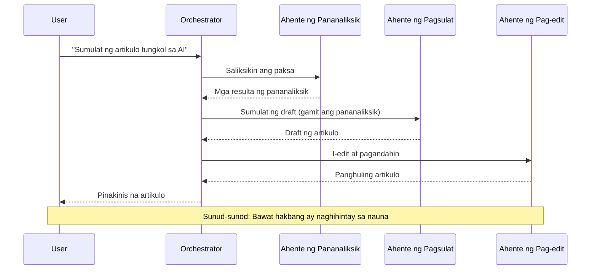
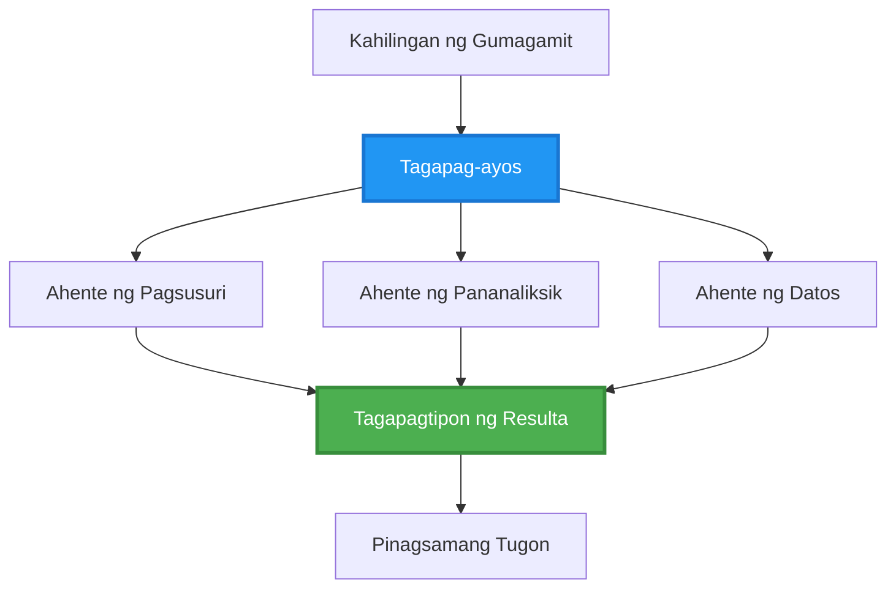
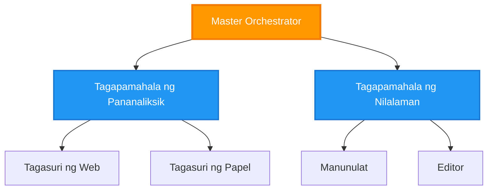
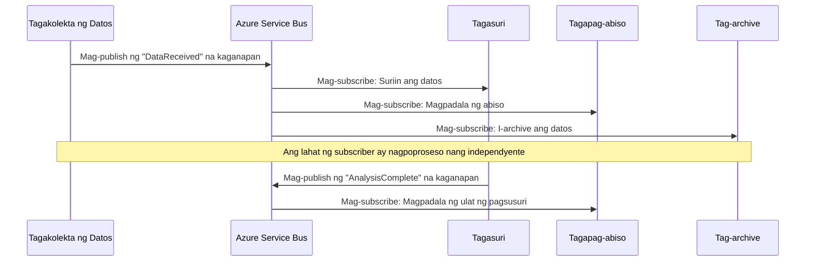
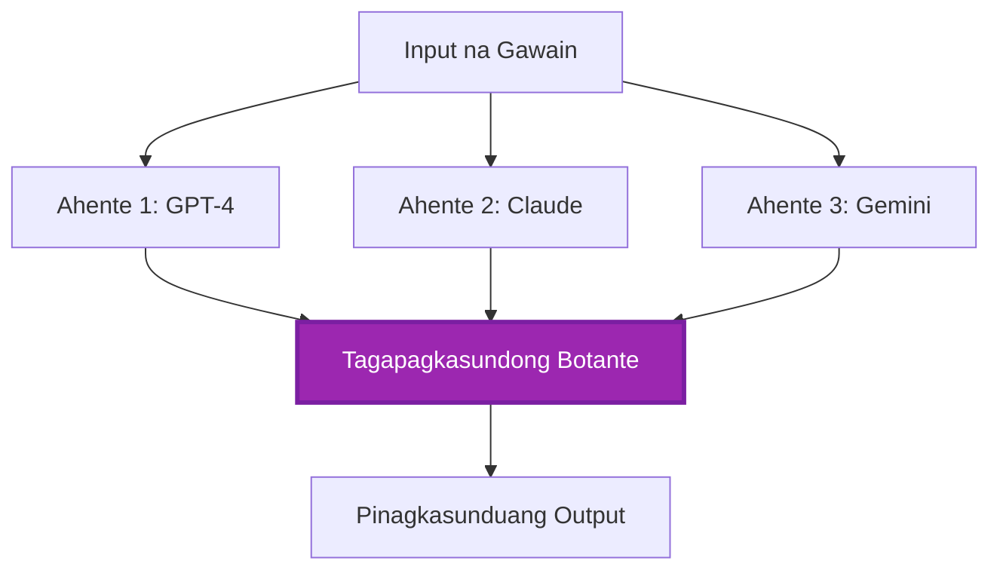
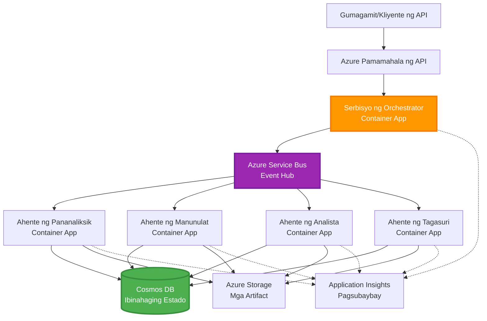

<!--
CO_OP_TRANSLATOR_METADATA:
{
  "original_hash": "bcefbd5d0107691ef3e6e33ba694d6f4",
  "translation_date": "2025-11-22T11:21:43+00:00",
  "source_file": "docs/pre-deployment/coordination-patterns.md",
  "language_code": "tl"
}
-->
# Mga Pattern ng Koordinasyon ng Multi-Agent

⏱️ **Tinatayang Oras**: 60-75 minuto | 💰 **Tinatayang Gastos**: ~$100-300/buwan | ⭐ **Kumplikado**: Advanced

**📚 Landas ng Pag-aaral:**
- ← Nakaraan: [Capacity Planning](capacity-planning.md) - Mga estratehiya sa pag-aayos at pag-scale ng mga resources
- 🎯 **Nasa Bahagi Ka Na**: Mga Pattern ng Koordinasyon ng Multi-Agent (Orkestrasyon, komunikasyon, pamamahala ng estado)
- → Susunod: [SKU Selection](sku-selection.md) - Pagpili ng tamang serbisyo ng Azure
- 🏠 [Pangunahing Kurso](../../README.md)

---

## Ano ang Iyong Matututunan

Sa pagtatapos ng araling ito, ikaw ay:
- Maiintindihan ang mga pattern ng **multi-agent architecture** at kailan ito gagamitin
- Makakapagpatupad ng mga **orkestrasyon na pattern** (sentralisado, desentralisado, hierarchical)
- Makakadesenyo ng mga estratehiya sa **komunikasyon ng agent** (synchronous, asynchronous, event-driven)
- Makakapamahala ng **shared state** sa mga distributed na agent
- Makakapag-deploy ng **multi-agent systems** sa Azure gamit ang AZD
- Makakapag-apply ng **coordination patterns** para sa mga aktwal na senaryo ng AI
- Makakapag-monitor at makakapag-debug ng mga distributed na sistema ng agent

## Bakit Mahalaga ang Koordinasyon ng Multi-Agent

### Ang Ebolusyon: Mula sa Single Agent patungo sa Multi-Agent

**Single Agent (Simple):**
```
User → Agent → Response
```
- ✅ Madaling maintindihan at ipatupad
- ✅ Mabilis para sa simpleng mga gawain
- ❌ Limitado sa kakayahan ng isang modelo
- ❌ Hindi kayang mag-parallelize ng mga komplikadong gawain
- ❌ Walang espesyalisasyon

**Multi-Agent System (Advanced):**
```
           ┌─────────────┐
           │ Orchestrator│
           └──────┬──────┘
        ┌─────────┼─────────┐
        │         │         │
    ┌───▼──┐  ┌──▼───┐  ┌──▼────┐
    │Agent1│  │Agent2│  │Agent3 │
    │(Plan)│  │(Code)│  │(Review)│
    └──────┘  └──────┘  └───────┘
```
- ✅ Espesyalisadong mga agent para sa partikular na gawain
- ✅ Parallel na pagganap para sa bilis
- ✅ Modular at madaling mapanatili
- ✅ Mas mahusay sa mga komplikadong workflow
- ⚠️ Nangangailangan ng lohika sa koordinasyon

**Analogy**: Ang single agent ay parang isang tao na gumagawa ng lahat ng gawain. Ang multi-agent ay parang isang koponan kung saan ang bawat miyembro ay may espesyalisadong kasanayan (mananaliksik, programmer, tagasuri, manunulat) na nagtutulungan.

---

## Mga Pangunahing Pattern ng Koordinasyon

### Pattern 1: Sequential Coordination (Chain of Responsibility)

**Kailan gagamitin**: Kailangang matapos ang mga gawain sa partikular na pagkakasunod-sunod, bawat agent ay bumubuo sa output ng nauna.


**Mga Benepisyo:**
- ✅ Malinaw na daloy ng data
- ✅ Madaling i-debug
- ✅ Predictable na pagkakasunod-sunod ng pagganap

**Mga Limitasyon:**
- ❌ Mas mabagal (walang parallelism)
- ❌ Ang isang pagkabigo ay humaharang sa buong chain
- ❌ Hindi kayang hawakan ang mga interdependent na gawain

**Mga Halimbawa ng Paggamit:**
- Pipeline ng paggawa ng nilalaman (pananaliksik → pagsusulat → pag-edit → pag-publish)
- Pagbuo ng code (plano → ipatupad → subukan → i-deploy)
- Pagbuo ng ulat (koleksyon ng data → pagsusuri → visualisasyon → buod)

---

### Pattern 2: Parallel Coordination (Fan-Out/Fan-In)

**Kailan gagamitin**: Ang mga independiyenteng gawain ay maaaring tumakbo nang sabay-sabay, ang mga resulta ay pinagsama sa dulo.


**Mga Benepisyo:**
- ✅ Mabilis (parallel na pagganap)
- ✅ Fault-tolerant (katanggap-tanggap ang partial na resulta)
- ✅ Nag-scale nang pahalang

**Mga Limitasyon:**
- ⚠️ Ang mga resulta ay maaaring dumating nang hindi sunod-sunod
- ⚠️ Nangangailangan ng lohika sa pagsasama-sama
- ⚠️ Kumplikadong pamamahala ng estado

**Mga Halimbawa ng Paggamit:**
- Pagkolekta ng data mula sa maraming pinagmulan (APIs + databases + web scraping)
- Pagsusuri ng kompetisyon (maraming modelo ang bumubuo ng solusyon, ang pinakamahusay ang pinipili)
- Mga serbisyo sa pagsasalin (isalin sa maraming wika nang sabay-sabay)

---

### Pattern 3: Hierarchical Coordination (Manager-Worker)

**Kailan gagamitin**: Mga komplikadong workflow na may sub-tasks, kailangan ng delegasyon.


**Mga Benepisyo:**
- ✅ Kayang hawakan ang mga komplikadong workflow
- ✅ Modular at madaling mapanatili
- ✅ Malinaw na mga hangganan ng responsibilidad

**Mga Limitasyon:**
- ⚠️ Mas kumplikadong arkitektura
- ⚠️ Mas mataas na latency (maraming layer ng koordinasyon)
- ⚠️ Nangangailangan ng sopistikadong orkestrasyon

**Mga Halimbawa ng Paggamit:**
- Pagproseso ng dokumento sa enterprise (i-classify → i-route → i-process → i-archive)
- Multi-stage na data pipelines (ingest → linisin → i-transform → i-analyze → i-report)
- Komplikadong automation workflows (pagpaplano → alokasyon ng resources → pagganap → monitoring)

---

### Pattern 4: Event-Driven Coordination (Publish-Subscribe)

**Kailan gagamitin**: Kailangang tumugon ang mga agent sa mga kaganapan, nais ang loose coupling.


**Mga Benepisyo:**
- ✅ Loose coupling sa pagitan ng mga agent
- ✅ Madaling magdagdag ng bagong agent (mag-subscribe lang)
- ✅ Asynchronous na pagproseso
- ✅ Resilient (message persistence)

**Mga Limitasyon:**
- ⚠️ Eventual consistency
- ⚠️ Kumplikadong debugging
- ⚠️ Mga hamon sa pag-order ng mensahe

**Mga Halimbawa ng Paggamit:**
- Mga sistema ng real-time monitoring (alerts, dashboards, logs)
- Multi-channel na mga notification (email, SMS, push, Slack)
- Mga pipeline ng pagproseso ng data (maraming consumer ng parehong data)

---

### Pattern 5: Consensus-Based Coordination (Voting/Quorum)

**Kailan gagamitin**: Kailangang may kasunduan mula sa maraming agent bago magpatuloy.


**Mga Benepisyo:**
- ✅ Mas mataas na katumpakan (maraming opinyon)
- ✅ Fault-tolerant (katanggap-tanggap ang minor na pagkabigo)
- ✅ May built-in na quality assurance

**Mga Limitasyon:**
- ❌ Magastos (maraming tawag sa modelo)
- ❌ Mas mabagal (naghihintay sa lahat ng agent)
- ⚠️ Kailangan ng resolusyon sa conflict

**Mga Halimbawa ng Paggamit:**
- Moderasyon ng nilalaman (maraming modelo ang nagre-review ng nilalaman)
- Pagsusuri ng code (maraming linters/analyzers)
- Medikal na diagnosis (maraming AI models, validation ng eksperto)

---

## Pangkalahatang-ideya ng Arkitektura

### Kumpletong Sistema ng Multi-Agent sa Azure


**Pangunahing Komponent:**

| Komponent | Layunin | Serbisyo ng Azure |
|-----------|---------|-------------------|
| **API Gateway** | Entry point, rate limiting, auth | API Management |
| **Orchestrator** | Nagkokoordina ng mga workflow ng agent | Container Apps |
| **Message Queue** | Asynchronous na komunikasyon | Service Bus / Event Hubs |
| **Agents** | Espesyalisadong AI workers | Container Apps / Functions |
| **State Store** | Shared state, task tracking | Cosmos DB |
| **Artifact Storage** | Mga dokumento, resulta, logs | Blob Storage |
| **Monitoring** | Distributed tracing, logs | Application Insights |

---

## Mga Kinakailangan

### Mga Kinakailangang Tool

```bash
# I-verify ang Azure Developer CLI
azd version
# ✅ Inaasahan: azd bersyon 1.0.0 o mas mataas

# I-verify ang Azure CLI
az --version
# ✅ Inaasahan: azure-cli 2.50.0 o mas mataas

# I-verify ang Docker (para sa lokal na pagsubok)
docker --version
# ✅ Inaasahan: Docker bersyon 20.10 o mas mataas
```

### Mga Kinakailangan sa Azure

- Aktibong subscription sa Azure
- Mga pahintulot para makagawa ng:
  - Container Apps
  - Service Bus namespaces
  - Cosmos DB accounts
  - Storage accounts
  - Application Insights

### Mga Kinakailangang Kaalaman

Dapat ay natapos mo na ang:
- [Configuration Management](../getting-started/configuration.md)
- [Authentication & Security](../getting-started/authsecurity.md)
- [Microservices Example](../../../../examples/microservices)

---

## Gabay sa Pagpapatupad

### Istruktura ng Proyekto

```
multi-agent-system/
├── azure.yaml                    # AZD configuration
├── infra/
│   ├── main.bicep               # Main infrastructure
│   ├── core/
│   │   ├── servicebus.bicep     # Message queue
│   │   ├── cosmos.bicep         # State store
│   │   ├── storage.bicep        # Artifact storage
│   │   └── monitoring.bicep     # Application Insights
│   └── app/
│       ├── orchestrator.bicep   # Orchestrator service
│       └── agent.bicep          # Agent template
└── src/
    ├── orchestrator/            # Orchestration logic
    │   ├── app.py
    │   ├── workflows.py
    │   └── Dockerfile
    ├── agents/
    │   ├── research/            # Research agent
    │   ├── writer/              # Writer agent
    │   ├── analyst/             # Analyst agent
    │   └── reviewer/            # Reviewer agent
    └── shared/
        ├── state_manager.py     # Shared state logic
        └── message_handler.py   # Message handling
```

---

## Aralin 1: Sequential Coordination Pattern

### Pagpapatupad: Pipeline ng Paggawa ng Nilalaman

Gumawa tayo ng isang sequential pipeline: Pananaliksik → Pagsusulat → Pag-edit → Pag-publish

### 1. Konfigurasyon ng AZD

**File: `azure.yaml`**

```yaml
name: content-pipeline
metadata:
  template: multi-agent-sequential@1.0.0

services:
  orchestrator:
    project: ./src/orchestrator
    language: python
    host: containerapp
  
  research-agent:
    project: ./src/agents/research
    language: python
    host: containerapp
  
  writer-agent:
    project: ./src/agents/writer
    language: python
    host: containerapp
  
  editor-agent:
    project: ./src/agents/editor
    language: python
    host: containerapp
```

### 2. Imprastruktura: Service Bus para sa Koordinasyon

**File: `infra/core/servicebus.bicep`**

```bicep
param name string
param location string
param tags object = {}

resource serviceBusNamespace 'Microsoft.ServiceBus/namespaces@2022-10-01-preview' = {
  name: name
  location: location
  tags: tags
  sku: {
    name: 'Standard'
    tier: 'Standard'
  }
  properties: {
    minimumTlsVersion: '1.2'
  }
}

// Queue for orchestrator → research agent
resource researchQueue 'Microsoft.ServiceBus/namespaces/queues@2022-10-01-preview' = {
  parent: serviceBusNamespace
  name: 'research-tasks'
  properties: {
    maxDeliveryCount: 3
    lockDuration: 'PT5M'
    deadLetteringOnMessageExpiration: true
  }
}

// Queue for research agent → writer agent
resource writerQueue 'Microsoft.ServiceBus/namespaces/queues@2022-10-01-preview' = {
  parent: serviceBusNamespace
  name: 'writer-tasks'
  properties: {
    maxDeliveryCount: 3
    lockDuration: 'PT5M'
  }
}

// Queue for writer agent → editor agent
resource editorQueue 'Microsoft.ServiceBus/namespaces/queues@2022-10-01-preview' = {
  parent: serviceBusNamespace
  name: 'editor-tasks'
  properties: {
    maxDeliveryCount: 3
    lockDuration: 'PT5M'
  }
}

output namespace string = serviceBusNamespace.name
output connectionString string = listKeys('${serviceBusNamespace.id}/AuthorizationRules/RootManageSharedAccessKey', serviceBusNamespace.apiVersion).primaryConnectionString
```

### 3. Shared State Manager

**File: `src/shared/state_manager.py`**

```python
from azure.cosmos import CosmosClient, PartitionKey
from datetime import datetime
import os

class StateManager:
    """Manages shared state across agents using Cosmos DB"""
    
    def __init__(self):
        endpoint = os.environ['COSMOS_ENDPOINT']
        key = os.environ['COSMOS_KEY']
        
        self.client = CosmosClient(endpoint, key)
        self.database = self.client.get_database_client('agent-state')
        self.container = self.database.get_container_client('tasks')
    
    def create_task(self, task_id: str, task_type: str, input_data: dict):
        """Create a new task"""
        task = {
            'id': task_id,
            'type': task_type,
            'status': 'pending',
            'input': input_data,
            'created_at': datetime.utcnow().isoformat(),
            'steps': []
        }
        self.container.create_item(task)
        return task
    
    def update_task_step(self, task_id: str, step_name: str, result: dict):
        """Update task with completed step"""
        task = self.container.read_item(task_id, partition_key=task_id)
        
        task['steps'].append({
            'name': step_name,
            'completed_at': datetime.utcnow().isoformat(),
            'result': result
        })
        
        self.container.replace_item(task_id, task)
        return task
    
    def complete_task(self, task_id: str, final_result: dict):
        """Mark task as complete"""
        task = self.container.read_item(task_id, partition_key=task_id)
        task['status'] = 'completed'
        task['result'] = final_result
        task['completed_at'] = datetime.utcnow().isoformat()
        self.container.replace_item(task_id, task)
        return task
    
    def get_task(self, task_id: str):
        """Retrieve task state"""
        return self.container.read_item(task_id, partition_key=task_id)
```

### 4. Orchestrator Service

**File: `src/orchestrator/app.py`**

```python
from flask import Flask, request, jsonify
from azure.servicebus import ServiceBusClient, ServiceBusMessage
import json
import uuid
import os
from shared.state_manager import StateManager

app = Flask(__name__)
state_manager = StateManager()

# Koneksyon sa Service Bus
servicebus_connection_str = os.environ['SERVICEBUS_CONNECTION_STRING']
servicebus_client = ServiceBusClient.from_connection_string(servicebus_connection_str)

@app.route('/health', methods=['GET'])
def health():
    return jsonify({'status': 'healthy', 'service': 'orchestrator'})

@app.route('/create-content', methods=['POST'])
def create_content():
    """
    Sequential workflow: Research → Write → Edit → Publish
    """
    data = request.json
    topic = data.get('topic')
    
    if not topic:
        return jsonify({'error': 'Topic required'}), 400
    
    # Gumawa ng gawain sa state store
    task_id = str(uuid.uuid4())
    task = state_manager.create_task(
        task_id=task_id,
        task_type='content_creation',
        input_data={'topic': topic}
    )
    
    # Magpadala ng mensahe sa research agent (unang hakbang)
    sender = servicebus_client.get_queue_sender('research-tasks')
    message = ServiceBusMessage(
        body=json.dumps({
            'task_id': task_id,
            'topic': topic,
            'next_queue': 'writer-tasks'  # Kung saan ipapadala ang mga resulta
        }),
        content_type='application/json'
    )
    
    with sender:
        sender.send_messages(message)
    
    return jsonify({
        'task_id': task_id,
        'status': 'started',
        'workflow': 'sequential',
        'steps': ['research', 'write', 'edit', 'publish'],
        'message': 'Content creation pipeline initiated'
    }), 202

@app.route('/task/<task_id>', methods=['GET'])
def get_task_status(task_id):
    """Check task status"""
    try:
        task = state_manager.get_task(task_id)
        return jsonify(task)
    except Exception as e:
        return jsonify({'error': str(e)}), 404

if __name__ == '__main__':
    app.run(host='0.0.0.0', port=8080)
```

### 5. Research Agent

**File: `src/agents/research/app.py`**

```python
from azure.servicebus import ServiceBusClient, ServiceBusMessage
from openai import AzureOpenAI
import json
import os
import time
from shared.state_manager import StateManager

# I-initialize ang mga kliyente
state_manager = StateManager()
servicebus_client = ServiceBusClient.from_connection_string(
    os.environ['SERVICEBUS_CONNECTION_STRING']
)

openai_client = AzureOpenAI(
    api_key=os.environ['AZURE_OPENAI_API_KEY'],
    api_version="2024-02-01",
    azure_endpoint=os.environ['AZURE_OPENAI_ENDPOINT']
)

def process_research_task(message_data):
    """Process research request and pass to writer"""
    task_id = message_data['task_id']
    topic = message_data['topic']
    next_queue = message_data['next_queue']
    
    print(f"🔬 Researching: {topic}")
    
    # Tawagan ang Azure OpenAI para sa pananaliksik
    response = openai_client.chat.completions.create(
        model="gpt-4",
        messages=[
            {"role": "system", "content": "You are a research assistant. Provide comprehensive research on the given topic."},
            {"role": "user", "content": f"Research this topic thoroughly: {topic}"}
        ],
        max_tokens=1500
    )
    
    research_results = response.choices[0].message.content
    
    # I-update ang estado
    state_manager.update_task_step(
        task_id=task_id,
        step_name='research',
        result={'research': research_results}
    )
    
    # Ipadala sa susunod na ahente (manunulat)
    sender = servicebus_client.get_queue_sender(next_queue)
    message = ServiceBusMessage(
        body=json.dumps({
            'task_id': task_id,
            'topic': topic,
            'research': research_results,
            'next_queue': 'editor-tasks'
        }),
        content_type='application/json'
    )
    
    with sender:
        sender.send_messages(message)
    
    print(f"✅ Research complete for task {task_id}")

def main():
    """Listen to research queue"""
    receiver = servicebus_client.get_queue_receiver('research-tasks')
    
    print("🔬 Research Agent started, listening for tasks...")
    
    with receiver:
        while True:
            messages = receiver.receive_messages(max_wait_time=5)
            for message in messages:
                try:
                    message_data = json.loads(str(message))
                    process_research_task(message_data)
                    receiver.complete_message(message)
                except Exception as e:
                    print(f"❌ Error processing message: {e}")
                    receiver.abandon_message(message)

if __name__ == '__main__':
    main()
```

### 6. Writer Agent

**File: `src/agents/writer/app.py`**

```python
from azure.servicebus import ServiceBusClient, ServiceBusMessage
from openai import AzureOpenAI
import json
import os
from shared.state_manager import StateManager

state_manager = StateManager()
servicebus_client = ServiceBusClient.from_connection_string(
    os.environ['SERVICEBUS_CONNECTION_STRING']
)

openai_client = AzureOpenAI(
    api_key=os.environ['AZURE_OPENAI_API_KEY'],
    api_version="2024-02-01",
    azure_endpoint=os.environ['AZURE_OPENAI_ENDPOINT']
)

def process_writing_task(message_data):
    """Write article based on research"""
    task_id = message_data['task_id']
    topic = message_data['topic']
    research = message_data['research']
    next_queue = message_data['next_queue']
    
    print(f"✍️ Writing article: {topic}")
    
    # Tawagan ang Azure OpenAI upang magsulat ng artikulo
    response = openai_client.chat.completions.create(
        model="gpt-4",
        messages=[
            {"role": "system", "content": "You are a professional writer. Write engaging, well-structured articles."},
            {"role": "user", "content": f"Based on this research:\n\n{research}\n\nWrite a comprehensive article about: {topic}"}
        ],
        max_tokens=2000
    )
    
    article_draft = response.choices[0].message.content
    
    # I-update ang estado
    state_manager.update_task_step(
        task_id=task_id,
        step_name='writing',
        result={'draft': article_draft}
    )
    
    # Ipadala sa editor
    sender = servicebus_client.get_queue_sender(next_queue)
    message = ServiceBusMessage(
        body=json.dumps({
            'task_id': task_id,
            'topic': topic,
            'draft': article_draft
        }),
        content_type='application/json'
    )
    
    with sender:
        sender.send_messages(message)
    
    print(f"✅ Article draft complete for task {task_id}")

def main():
    """Listen to writer queue"""
    receiver = servicebus_client.get_queue_receiver('writer-tasks')
    
    print("✍️ Writer Agent started, listening for tasks...")
    
    with receiver:
        while True:
            messages = receiver.receive_messages(max_wait_time=5)
            for message in messages:
                try:
                    message_data = json.loads(str(message))
                    process_writing_task(message_data)
                    receiver.complete_message(message)
                except Exception as e:
                    print(f"❌ Error: {e}")
                    receiver.abandon_message(message)

if __name__ == '__main__':
    main()
```

### 7. Editor Agent

**File: `src/agents/editor/app.py`**

```python
from azure.servicebus import ServiceBusClient
from openai import AzureOpenAI
import json
import os
from shared.state_manager import StateManager

state_manager = StateManager()
servicebus_client = ServiceBusClient.from_connection_string(
    os.environ['SERVICEBUS_CONNECTION_STRING']
)

openai_client = AzureOpenAI(
    api_key=os.environ['AZURE_OPENAI_API_KEY'],
    api_version="2024-02-01",
    azure_endpoint=os.environ['AZURE_OPENAI_ENDPOINT']
)

def process_editing_task(message_data):
    """Edit and finalize article"""
    task_id = message_data['task_id']
    topic = message_data['topic']
    draft = message_data['draft']
    
    print(f"📝 Editing article: {topic}")
    
    # Tawagan ang Azure OpenAI para mag-edit
    response = openai_client.chat.completions.create(
        model="gpt-4",
        messages=[
            {"role": "system", "content": "You are an expert editor. Improve grammar, clarity, and structure."},
            {"role": "user", "content": f"Edit and improve this article:\n\n{draft}"}
        ],
        max_tokens=2000
    )
    
    final_article = response.choices[0].message.content
    
    # Markahan ang gawain bilang tapos
    state_manager.complete_task(
        task_id=task_id,
        final_result={
            'topic': topic,
            'final_article': final_article,
            'word_count': len(final_article.split())
        }
    )
    
    print(f"✅ Article finalized for task {task_id}")

def main():
    """Listen to editor queue"""
    receiver = servicebus_client.get_queue_receiver('editor-tasks')
    
    print("📝 Editor Agent started, listening for tasks...")
    
    with receiver:
        while True:
            messages = receiver.receive_messages(max_wait_time=5)
            for message in messages:
                try:
                    message_data = json.loads(str(message))
                    process_editing_task(message_data)
                    receiver.complete_message(message)
                except Exception as e:
                    print(f"❌ Error: {e}")
                    receiver.abandon_message(message)

if __name__ == '__main__':
    main()
```

### 8. I-deploy at Subukan

```bash
# I-initialize at i-deploy
azd init
azd up

# Kunin ang URL ng orchestrator
ORCHESTRATOR_URL=$(azd env get-values | grep ORCHESTRATOR_URL | cut -d '=' -f2 | tr -d '"')

# Gumawa ng nilalaman
curl -X POST $ORCHESTRATOR_URL/create-content \
  -H "Content-Type: application/json" \
  -d '{"topic": "The Future of AI in Healthcare"}'
```

**✅ Inaasahang output:**
```json
{
  "task_id": "a1b2c3d4-e5f6-7890-abcd-ef1234567890",
  "status": "started",
  "workflow": "sequential",
  "steps": ["research", "write", "edit", "publish"],
  "message": "Content creation pipeline initiated"
}
```

**Suriin ang progreso ng gawain:**
```bash
TASK_ID="a1b2c3d4-e5f6-7890-abcd-ef1234567890"
curl $ORCHESTRATOR_URL/task/$TASK_ID
```

**✅ Inaasahang output (natapos):**
```json
{
  "id": "a1b2c3d4-e5f6-7890-abcd-ef1234567890",
  "type": "content_creation",
  "status": "completed",
  "steps": [
    {
      "name": "research",
      "completed_at": "2025-11-19T10:30:00Z",
      "result": {"research": "..."}
    },
    {
      "name": "writing",
      "completed_at": "2025-11-19T10:32:00Z",
      "result": {"draft": "..."}
    }
  ],
  "result": {
    "topic": "The Future of AI in Healthcare",
    "final_article": "...",
    "word_count": 1500
  }
}
```

---

## Aralin 2: Parallel Coordination Pattern

### Pagpapatupad: Multi-Source Research Aggregator

Gumawa tayo ng parallel na sistema na nangongolekta ng impormasyon mula sa maraming pinagmulan nang sabay-sabay.

### Parallel Orchestrator

**File: `src/orchestrator/parallel_workflow.py`**

```python
from flask import Flask, request, jsonify
from azure.servicebus import ServiceBusClient, ServiceBusMessage
import json
import uuid
import os
from shared.state_manager import StateManager

app = Flask(__name__)
state_manager = StateManager()

servicebus_client = ServiceBusClient.from_connection_string(
    os.environ['SERVICEBUS_CONNECTION_STRING']
)

@app.route('/research-parallel', methods=['POST'])
def research_parallel():
    """
    Parallel workflow: Multiple agents work simultaneously
    """
    data = request.json
    query = data.get('query')
    
    task_id = str(uuid.uuid4())
    task = state_manager.create_task(
        task_id=task_id,
        task_type='parallel_research',
        input_data={
            'query': query,
            'agents': ['web', 'academic', 'news', 'social']
        }
    )
    
    # Fan-out: Ipadala sa lahat ng ahente nang sabay-sabay
    agents = [
        ('web-research-queue', 'web'),
        ('academic-research-queue', 'academic'),
        ('news-research-queue', 'news'),
        ('social-research-queue', 'social')
    ]
    
    for queue_name, agent_type in agents:
        sender = servicebus_client.get_queue_sender(queue_name)
        message = ServiceBusMessage(
            body=json.dumps({
                'task_id': task_id,
                'query': query,
                'agent_type': agent_type,
                'result_queue': 'aggregation-queue'
            }),
            content_type='application/json'
        )
        
        with sender:
            sender.send_messages(message)
    
    return jsonify({
        'task_id': task_id,
        'status': 'started',
        'workflow': 'parallel',
        'agents_dispatched': 4,
        'message': 'Parallel research initiated'
    }), 202

if __name__ == '__main__':
    app.run(host='0.0.0.0', port=8080)
```

### Lohika ng Pagsasama-sama

**File: `src/agents/aggregator/app.py`**

```python
from azure.servicebus import ServiceBusClient
import json
import os
from collections import defaultdict
from shared.state_manager import StateManager

state_manager = StateManager()
servicebus_client = ServiceBusClient.from_connection_string(
    os.environ['SERVICEBUS_CONNECTION_STRING']
)

# Subaybayan ang mga resulta bawat gawain
task_results = defaultdict(list)
expected_agents = 4  # web, akademiko, balita, sosyal

def process_result(message_data):
    """Aggregate results from parallel agents"""
    task_id = message_data['task_id']
    agent_type = message_data['agent_type']
    result = message_data['result']
    
    # Itabi ang resulta
    task_results[task_id].append({
        'agent': agent_type,
        'data': result
    })
    
    print(f"📊 Received result from {agent_type} agent ({len(task_results[task_id])}/{expected_agents})")
    
    # Suriin kung natapos ng lahat ng ahente (fan-in)
    if len(task_results[task_id]) == expected_agents:
        print(f"✅ All agents completed for task {task_id}. Aggregating...")
        
        # Pagsamahin ang mga resulta
        aggregated = {
            'query': message_data['query'],
            'sources': task_results[task_id],
            'summary': generate_summary(task_results[task_id])
        }
        
        # Markahan bilang tapos
        state_manager.complete_task(task_id, aggregated)
        
        # Linisin
        del task_results[task_id]
        
        print(f"✅ Aggregation complete for task {task_id}")

def generate_summary(results):
    """Generate summary from all sources"""
    summaries = [r['data'].get('summary', '') for r in results]
    return '\n\n'.join(summaries)

def main():
    """Listen to aggregation queue"""
    receiver = servicebus_client.get_queue_receiver('aggregation-queue')
    
    print("📊 Aggregator started, listening for results...")
    
    with receiver:
        while True:
            messages = receiver.receive_messages(max_wait_time=5)
            for message in messages:
                try:
                    message_data = json.loads(str(message))
                    process_result(message_data)
                    receiver.complete_message(message)
                except Exception as e:
                    print(f"❌ Error: {e}")
                    receiver.abandon_message(message)

if __name__ == '__main__':
    main()
```

**Mga Benepisyo ng Parallel Pattern:**
- ⚡ **4x mas mabilis** (sabay-sabay ang pagtakbo ng mga agent)
- 🔄 **Fault-tolerant** (katanggap-tanggap ang partial na resulta)
- 📈 **Scalable** (madaling magdagdag ng mga agent)

---

## Mga Praktikal na Ehersisyo

### Ehersisyo 1: Magdagdag ng Timeout Handling ⭐⭐ (Katamtaman)

**Layunin**: Magpatupad ng timeout logic para hindi maghintay nang walang hanggan ang aggregator sa mabagal na mga agent.

**Mga Hakbang**:

1. **Magdagdag ng timeout tracking sa aggregator:**

```python
from datetime import datetime, timedelta

task_timeouts = {}  # task_id -> oras ng pag-expire

def process_result(message_data):
    task_id = message_data['task_id']
    
    # Itakda ang timeout sa unang resulta
    if task_id not in task_timeouts:
        task_timeouts[task_id] = datetime.utcnow() + timedelta(seconds=30)
    
    task_results[task_id].append({
        'agent': message_data['agent_type'],
        'data': message_data['result']
    })
    
    # Suriin kung tapos NA o nag-timeout
    if len(task_results[task_id]) == expected_agents or \
       datetime.utcnow() > task_timeouts[task_id]:
        
        print(f"📊 Aggregating with {len(task_results[task_id])}/{expected_agents} results")
        
        aggregated = {
            'query': message_data['query'],
            'sources': task_results[task_id],
            'completed_agents': len(task_results[task_id]),
            'timed_out': len(task_results[task_id]) < expected_agents
        }
        
        state_manager.complete_task(task_id, aggregated)
        
        # Linisin
        del task_results[task_id]
        del task_timeouts[task_id]
```

2. **Subukan gamit ang artificial delays:**

```python
# Sa isang ahente, magdagdag ng pagkaantala upang gayahin ang mabagal na pagproseso
import time
time.sleep(35)  # Lumampas sa 30-segundong timeout
```

3. **I-deploy at i-verify:**

```bash
azd deploy aggregator

# Isumite ang gawain
curl -X POST $ORCHESTRATOR_URL/research-parallel \
  -H "Content-Type: application/json" \
  -d '{"query": "AI safety research"}'

# Suriin ang mga resulta pagkatapos ng 30 segundo
curl $ORCHESTRATOR_URL/task/$TASK_ID
```

**✅ Pamantayan ng Tagumpay:**
- ✅ Natatapos ang gawain pagkatapos ng 30 segundo kahit hindi kumpleto ang mga agent
- ✅ Ang tugon ay nagpapahiwatig ng partial na resulta (`"timed_out": true`)
- ✅ Ang mga available na resulta ay naibabalik (3 sa 4 na agent)

**Oras**: 20-25 minuto

---

### Ehersisyo 2: Magpatupad ng Retry Logic ⭐⭐⭐ (Advanced)

**Layunin**: Awtomatikong i-retry ang mga nabigong gawain ng agent bago sumuko.

**Mga Hakbang**:

1. **Magdagdag ng retry tracking sa orchestrator:**

```python
from dataclasses import dataclass
from typing import Dict

@dataclass
class RetryConfig:
    max_retries: int = 3
    backoff_seconds: int = 5

retry_counts: Dict[str, int] = {}  # message_id -> bilang_ng_subok

def send_with_retry(queue_name: str, message_data: dict, retry_config: RetryConfig):
    """Send message with retry metadata"""
    message_id = message_data.get('message_id', str(uuid.uuid4()))
    message_data['message_id'] = message_id
    message_data['retry_count'] = retry_counts.get(message_id, 0)
    message_data['max_retries'] = retry_config.max_retries
    
    sender = servicebus_client.get_queue_sender(queue_name)
    message = ServiceBusMessage(
        body=json.dumps(message_data),
        content_type='application/json',
        message_id=message_id
    )
    
    with sender:
        sender.send_messages(message)
```

2. **Magdagdag ng retry handler sa mga agent:**

```python
def process_with_retry(message, receiver, process_func):
    """Process message with automatic retry on failure"""
    try:
        message_data = json.loads(str(message))
        
        # Iproseso ang mensahe
        process_func(message_data)
        
        # Tagumpay - tapos na
        receiver.complete_message(message)
        
    except Exception as e:
        message_id = message.message_id
        retry_count = message_data.get('retry_count', 0)
        max_retries = message_data.get('max_retries', 3)
        
        if retry_count < max_retries:
            # Subukang muli: i-abandona at i-re-queue na may nadagdagang bilang
            print(f"⚠️ Retry {retry_count + 1}/{max_retries} for message {message_id}")
            
            message_data['retry_count'] = retry_count + 1
            
            # Ibalik sa parehong pila na may pagkaantala
            time.sleep(5 * (retry_count + 1))  # Eksponensyal na pag-urong
            send_with_retry(queue_name, message_data, RetryConfig())
            
            receiver.complete_message(message)  # Alisin ang orihinal
        else:
            # Lumampas sa maximum na pagsubok - ilipat sa dead letter queue
            print(f"❌ Max retries exceeded for message {message_id}")
            receiver.dead_letter_message(
                message,
                reason="MaxRetriesExceeded",
                error_description=str(e)
            )
```

3. **I-monitor ang dead letter queue:**

```python
def monitor_dead_letters():
    """Check dead letter queue for failed messages"""
    receiver = servicebus_client.get_queue_receiver(
        'research-queue',
        sub_queue='deadletter'
    )
    
    with receiver:
        messages = receiver.receive_messages(max_wait_time=5)
        for message in messages:
            print(f"☠️ Dead letter: {message.message_id}")
            print(f"Reason: {message.dead_letter_reason}")
            print(f"Description: {message.dead_letter_error_description}")
```

**✅ Pamantayan ng Tagumpay:**
- ✅ Awtomatikong nagre-retry ang mga nabigong gawain (hanggang 3 beses)
- ✅ Exponential backoff sa pagitan ng retries (5s, 10s, 15s)
- ✅ Pagkatapos ng max retries, ang mga mensahe ay napupunta sa dead letter queue
- ✅ Ang dead letter queue ay maaaring i-monitor at i-replay

**Oras**: 30-40 minuto

---

### Ehersisyo 3: Magpatupad ng Circuit Breaker ⭐⭐⭐ (Advanced)

**Layunin**: Pigilan ang cascading failures sa pamamagitan ng pagtigil ng mga request sa mga nabigong agent.

**Mga Hakbang**:

1. **Gumawa ng circuit breaker class:**

```python
from enum import Enum
from datetime import datetime, timedelta

class CircuitState(Enum):
    CLOSED = "closed"      # Normal na operasyon
    OPEN = "open"          # Nabigo, tanggihan ang mga kahilingan
    HALF_OPEN = "half_open"  # Sinusubukan kung nakabawi na

class CircuitBreaker:
    def __init__(self, failure_threshold=5, timeout_seconds=60):
        self.failure_threshold = failure_threshold
        self.timeout_seconds = timeout_seconds
        self.failure_count = 0
        self.last_failure_time = None
        self.state = CircuitState.CLOSED
    
    def call(self, func):
        """Execute function with circuit breaker protection"""
        if self.state == CircuitState.OPEN:
            # Suriin kung nag-expire na ang timeout
            if datetime.utcnow() - self.last_failure_time > timedelta(seconds=self.timeout_seconds):
                self.state = CircuitState.HALF_OPEN
                print("🔄 Circuit breaker: HALF_OPEN (testing)")
            else:
                raise Exception(f"Circuit breaker OPEN for agent. Try again in {self.timeout_seconds}s")
        
        try:
            result = func()
            
            # Tagumpay
            if self.state == CircuitState.HALF_OPEN:
                self.state = CircuitState.CLOSED
                self.failure_count = 0
                print("✅ Circuit breaker: CLOSED (recovered)")
            
            return result
            
        except Exception as e:
            self.failure_count += 1
            self.last_failure_time = datetime.utcnow()
            
            if self.failure_count >= self.failure_threshold:
                self.state = CircuitState.OPEN
                print(f"🔴 Circuit breaker: OPEN (too many failures)")
            
            raise e
```

2. **I-apply sa mga tawag ng agent:**

```python
# Sa tagapag-ayos
agent_circuits = {
    'web': CircuitBreaker(failure_threshold=5, timeout_seconds=60),
    'academic': CircuitBreaker(failure_threshold=5, timeout_seconds=60),
    'news': CircuitBreaker(failure_threshold=5, timeout_seconds=60),
    'social': CircuitBreaker(failure_threshold=5, timeout_seconds=60)
}

def send_to_agent(agent_type, message_data):
    """Send with circuit breaker protection"""
    circuit = agent_circuits[agent_type]
    
    try:
        circuit.call(lambda: send_message(agent_type, message_data))
    except Exception as e:
        print(f"⚠️ Skipping {agent_type} agent: {e}")
        # Magpatuloy sa ibang mga ahente
```

3. **Subukan ang circuit breaker:**

```bash
# I-simulate ang paulit-ulit na pagkabigo (itigil ang isang ahente)
az containerapp stop --name web-research-agent --resource-group rg-agents

# Magpadala ng maraming kahilingan
for i in {1..10}; do
  curl -X POST $ORCHESTRATOR_URL/research-parallel \
    -H "Content-Type: application/json" \
    -d '{"query": "test query '$i'"}'
  sleep 2
done

# Suriin ang mga log - dapat makita ang circuit na bukas pagkatapos ng 5 pagkabigo
azd logs orchestrator --tail 50
```

**✅ Pamantayan ng Tagumpay:**
- ✅ Pagkatapos ng 5 pagkabigo, nagbubukas ang circuit (tinatanggihan ang mga request)
- ✅ Pagkatapos ng 60 segundo, nagiging half-open ang circuit (sinusubukan ang recovery)
- ✅ Ang ibang mga agent ay patuloy na gumagana nang normal
- ✅ Awtomatikong nagsasara ang circuit kapag gumaling ang agent

**Oras**: 40-50 minuto

---

## Monitoring at Debugging

### Distributed Tracing gamit ang Application Insights

**File: `src/shared/tracing.py`**

```python
from opencensus.ext.azure.log_exporter import AzureLogHandler
from opencensus.ext.azure.trace_exporter import AzureExporter
from opencensus.trace import config_integration
from opencensus.trace.tracer import Tracer
from opencensus.trace.samplers import AlwaysOnSampler
import logging
import os

# I-configure ang pagsubaybay
config_integration.trace_integrations(['requests', 'logging'])

connection_string = os.environ.get('APPLICATIONINSIGHTS_CONNECTION_STRING')

# Lumikha ng tracer
tracer = Tracer(
    exporter=AzureExporter(connection_string=connection_string),
    sampler=AlwaysOnSampler()
)

# I-configure ang pag-log
logger = logging.getLogger(__name__)
logger.addHandler(AzureLogHandler(connection_string=connection_string))
logger.setLevel(logging.INFO)

def trace_agent_call(agent_name, task_id, operation):
    """Trace agent operations"""
    with tracer.span(name=f'{agent_name}.{operation}') as span:
        span.add_attribute('agent', agent_name)
        span.add_attribute('task_id', task_id)
        span.add_attribute('operation', operation)
        
        try:
            result = operation()
            span.add_attribute('status', 'success')
            return result
        except Exception as e:
            span.add_attribute('status', 'error')
            span.add_attribute('error', str(e))
            raise
```

### Mga Query sa Application Insights

**Subaybayan ang mga workflow ng multi-agent:**

```kusto
// Trace complete workflow for a task
traces
| where customDimensions.task_id == "a1b2c3d4-..."
| project timestamp, message, customDimensions.agent, customDimensions.operation
| order by timestamp asc
```

**Paghahambing ng pagganap ng agent:**

```kusto
// Compare agent execution times
dependencies
| where name contains "agent"
| summarize 
    avg_duration = avg(duration),
    p95_duration = percentile(duration, 95),
    count = count()
  by agent = tostring(customDimensions.agent)
| order by avg_duration desc
```

**Pagsusuri ng pagkabigo:**

```kusto
// Find which agents fail most
exceptions
| where customDimensions.agent != ""
| summarize 
    failure_count = count(),
    unique_errors = dcount(outerMessage)
  by agent = tostring(customDimensions.agent)
| order by failure_count desc
```

---

## Pagsusuri ng Gastos

### Mga Gastos ng Multi-Agent System (Tinatayang Buwanang Gastos)

| Komponent | Konfigurasyon | Gastos |
|-----------|--------------|-------|
| **Orchestrator** | 1 Container App (1 vCPU, 2GB) | $30-50 |
| **4 Agents** | 4 Container Apps (0.5 vCPU, 1GB bawat isa) | $60-120 |
| **Service Bus** | Standard tier, 10M messages | $10-20 |
| **Cosmos DB** | Serverless, 5GB storage, 1M RUs | $25-50 |
| **Blob Storage** | 10GB storage, 100K operations | $5-10 |
| **Application Insights** | 5GB ingestion | $10-15 |
| **Azure OpenAI** | GPT-4, 10M tokens | $100-300 |
| **Kabuuan** | | **$240-565/buwan** |

### Mga Estratehiya sa Pag-optimize ng Gastos

1. **Gumamit ng serverless kung maaari:**
   ```bicep
   // Cosmos DB serverless (no minimum cost)
   properties: {
     databaseAccountOfferType: 'Standard'
     capabilities: [{ name: 'EnableServerless' }]
   }
   ```

2. **I-scale ang mga agent sa zero kapag idle:**
   ```bicep
   scale: {
     minReplicas: 0  // Scale to zero when no messages
     maxReplicas: 10
   }
   ```

3. **Gumamit ng batching para sa Service Bus:**
   ```python
   # Magpadala ng mga mensahe nang maramihan (mas mura)
   sender.send_messages([message1, message2, message3])
   ```

4. **I-cache ang madalas na ginagamit na mga resulta:**
   ```python
   # Gamitin ang Azure Cache para sa Redis
   if cache.exists(query_hash):
       return cache.get(query_hash)
   ```

---

## Mga Pinakamahusay na Kasanayan

### ✅ GAWIN:

1. **Gumamit ng idempotent na mga operasyon**
   ```python
   # Maaaring ligtas na iproseso ng ahente ang parehong mensahe nang maraming beses
   def process_task(task_id):
       if state_manager.task_exists(task_id):
           print(f"Task {task_id} already processed, skipping")
           return
       # Pinoproseso ang gawain...
   ```

2. **Magpatupad ng komprehensibong logging**
   ```python
   logger.info(f"Agent: {agent_name}, Task: {task_id}, Action: {action}")
   ```

3. **Gumamit ng correlation IDs**
   ```python
   # Ipasok ang task_id sa buong workflow
   message_data = {
       'task_id': task_id,  # Correlation ID
       'timestamp': datetime.utcnow().isoformat()
   }
   ```

4. **Mag-set ng message TTL (time-to-live)**
   ```bicep
   properties: {
     defaultMessageTimeToLive: 'PT1H'  // 1 hour max
   }
   ```

5. **I-monitor ang dead letter queues**
   ```python
   # Regular na pagsubaybay sa mga nabigong mensahe
   monitor_dead_letters()
   ```

### ❌ HUWAG:

1. **Huwag gumawa ng circular dependencies**
   ```python
   # ❌ MALI: Ahente A → Ahente B → Ahente A (walang katapusang loop)
   # ✅ MABUTI: Tukuyin ang malinaw na directed acyclic graph (DAG)
   ```

2. **Huwag i-block ang mga thread ng agent**
   ```python
   # ❌ MASAMA: Synchronous na paghihintay
   while not task_complete:
       time.sleep(1)
   
   # ✅ MABUTI: Gumamit ng mga callback ng message queue
   ```

3. **Huwag balewalain ang partial failures**
   ```python
   # ❌ MASAMA: Bumagsak ang buong workflow kung may isang agent na nabigo
   # ✅ MABUTI: Ibalik ang bahagyang resulta na may mga tagapagpahiwatig ng error
   ```

4. **Huwag gumamit ng infinite retries**
   ```python
   # ❌ MASAMA: subukang muli magpakailanman
   # ✅ MABUTI: max_retries = 3, pagkatapos ay dead letter
   ```

---
## Gabay sa Pag-aayos ng Problema

### Problema: Mga mensaheng naipit sa pila

**Mga Sintomas:**
- Mga mensaheng naiipon sa pila
- Hindi nagpoproseso ang mga ahente
- Ang status ng gawain ay nananatiling "pending"

**Pagsusuri:**
```bash
# Suriin ang lalim ng pila
az servicebus queue show \
  --namespace-name mybus \
  --name research-tasks \
  --query "countDetails"

# Suriin ang kalagayan ng ahente
azd logs research-agent --tail 50
```

**Mga Solusyon:**

1. **Dagdagan ang mga replika ng ahente:**
   ```bash
   az containerapp update \
     --name research-agent \
     --min-replicas 3 \
     --max-replicas 10
   ```

2. **Suriin ang dead letter queue:**
   ```bash
   az servicebus queue show \
     --namespace-name mybus \
     --name research-tasks \
     --query "countDetails.deadLetterMessageCount"
   ```

---

### Problema: Timeout sa gawain/hindi natatapos

**Mga Sintomas:**
- Ang status ng gawain ay nananatiling "in_progress"
- Ang ilang ahente ay natatapos, ang iba ay hindi
- Walang mga mensahe ng error

**Pagsusuri:**
```bash
# Suriin ang estado ng gawain
curl $ORCHESTRATOR_URL/task/$TASK_ID

# Suriin ang Application Insights
# Patakbuhin ang query: traces | where customDimensions.task_id == "..."
```

**Mga Solusyon:**

1. **Magpatupad ng timeout sa aggregator (Exercise 1)**

2. **Suriin ang mga pagkabigo ng ahente:**
   ```bash
   azd logs --follow | grep "ERROR\|FAIL"
   ```

3. **Siguraduhing tumatakbo ang lahat ng ahente:**
   ```bash
   az containerapp list \
     --resource-group rg-agents \
     --query "[].{name:name, status:properties.runningStatus}"
   ```

---

## Matuto Pa

### Opisyal na Dokumentasyon
- [Azure Service Bus](https://learn.microsoft.com/azure/service-bus-messaging/service-bus-messaging-overview)
- [Cosmos DB](https://learn.microsoft.com/azure/cosmos-db/introduction)
- [Container Apps DAPR](https://learn.microsoft.com/azure/container-apps/dapr-overview)
- [Multi-Agent Design Patterns](https://learn.microsoft.com/azure/architecture/guide/ai/multi-agent-systems)

### Mga Susunod na Hakbang sa Kursong Ito
- ← Nakaraan: [Capacity Planning](capacity-planning.md)
- → Susunod: [SKU Selection](sku-selection.md)
- 🏠 [Pangunahing Pahina ng Kurso](../../README.md)

### Mga Kaugnay na Halimbawa
- [Halimbawa ng Microservices](../../../../examples/microservices) - Mga pattern ng komunikasyon ng serbisyo
- [Halimbawa ng Azure OpenAI](../../../../examples/azure-openai-chat) - Pagsasama ng AI

---

## Buod

**Natutuhan Mo:**
- ✅ Limang pattern ng koordinasyon (sequential, parallel, hierarchical, event-driven, consensus)
- ✅ Multi-agent na arkitektura sa Azure (Service Bus, Cosmos DB, Container Apps)
- ✅ Pamamahala ng estado sa mga distributed na ahente
- ✅ Paghawak ng timeout, retries, at circuit breakers
- ✅ Pagsubaybay at pag-debug ng mga distributed na sistema
- ✅ Mga estratehiya sa pag-optimize ng gastos

**Mahahalagang Puntos:**
1. **Piliin ang tamang pattern** - Sequential para sa mga ordered na workflow, parallel para sa bilis, event-driven para sa flexibility
2. **Maingat na pamahalaan ang estado** - Gumamit ng Cosmos DB o katulad para sa shared na estado
3. **Mahusay na hawakan ang mga pagkabigo** - Timeouts, retries, circuit breakers, dead letter queues
4. **Subaybayan ang lahat** - Ang distributed tracing ay mahalaga para sa pag-debug
5. **I-optimize ang gastos** - Scale to zero, gumamit ng serverless, magpatupad ng caching

**Mga Susunod na Hakbang:**
1. Kumpletuhin ang mga praktikal na ehersisyo
2. Bumuo ng multi-agent na sistema para sa iyong use case
3. Pag-aralan ang [SKU Selection](sku-selection.md) upang i-optimize ang performance at gastos

---

<!-- CO-OP TRANSLATOR DISCLAIMER START -->
**Paunawa**:  
Ang dokumentong ito ay isinalin gamit ang AI translation service na [Co-op Translator](https://github.com/Azure/co-op-translator). Bagama't sinisikap naming maging tumpak, pakitandaan na ang mga awtomatikong pagsasalin ay maaaring maglaman ng mga pagkakamali o hindi pagkakatugma. Ang orihinal na dokumento sa orihinal nitong wika ang dapat ituring na opisyal na sanggunian. Para sa mahalagang impormasyon, inirerekomenda ang propesyonal na pagsasalin ng tao. Hindi kami mananagot sa anumang hindi pagkakaunawaan o maling interpretasyon na dulot ng paggamit ng pagsasaling ito.
<!-- CO-OP TRANSLATOR DISCLAIMER END -->