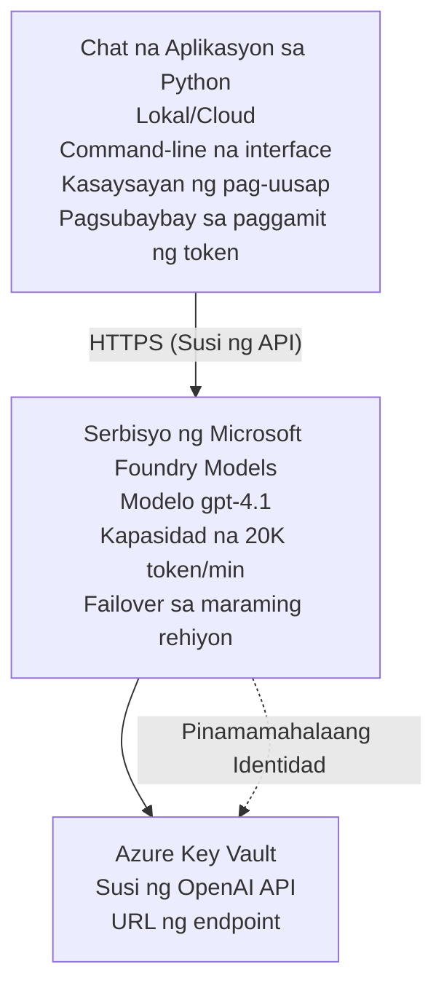

# Aplikasyon ng Chat ng Microsoft Foundry Models

**Landas ng Pagkatuto:** Gitnang Antas ⭐⭐ | **Oras:** 35-45 minuto | **Gastos:** $50-200/buwan

Isang kumpletong aplikasyon ng chat ng Microsoft Foundry Models na ide-deploy gamit ang Azure Developer CLI (azd). Ipinapakita ng halimbawang ito ang pag-deploy ng gpt-4.1, secure na pag-access sa API, at isang simpleng chat interface.

## 🎯 Ano ang Matututuhan Mo

- I-deploy ang Microsoft Foundry Models Service na may modelong gpt-4.1
- I-secure ang mga API key ng OpenAI gamit ang Key Vault
- Gumawa ng simpleng chat interface gamit ang Python
- Subaybayan ang paggamit ng token at mga gastos
- Magpatupad ng rate limiting at error handling

## 📦 Ano ang Kasama

✅ **Microsoft Foundry Models Service** - deployment ng modelong gpt-4.1  
✅ **Python Chat App** - Simpleng command-line na chat interface  
✅ **Key Vault Integration** - Secure na pag-iimbak ng API key  
✅ **ARM Templates** - Kumpletong infrastructure as code  
✅ **Cost Monitoring** - Pagsubaybay sa paggamit ng token  
✅ **Rate Limiting** - Pigilan ang pagkaubos ng quota  

## Arkitektura


## Mga Kinakailangan

### Kinakailangan

- **Azure Developer CLI (azd)** - [Gabay sa pag-install](https://learn.microsoft.com/azure/developer/azure-developer-cli/install-azd)
- **Azure subscription** na may access sa OpenAI - [Humiling ng access](https://aka.ms/oai/access)
- **Python 3.9+** - [I-install ang Python](https://www.python.org/downloads/)

### I-verify ang Mga Kinakailangan

```bash
# Suriin ang bersyon ng azd (kailangan 1.5.0 o mas mataas)
azd version

# Suriin ang pag-login sa Azure
azd auth login

# Suriin ang bersyon ng Python
python --version  # o python3 --version

# Suriin ang pag-access sa OpenAI (tingnan sa Azure Portal)
az cognitiveservices account list-skus \
  --kind OpenAI \
  --location eastus
```

> **⚠️ Mahalagang Paalala:** Ang Microsoft Foundry Models ay nangangailangan ng pag-apruba ng aplikasyon. Kung hindi ka pa nag-aapply, bisitahin ang [aka.ms/oai/access](https://aka.ms/oai/access). Karaniwan tumatagal ang pag-apruba nang 1-2 araw ng trabaho.

## ⏱️ Timeline ng Deployment

| Yugto | Tagal | Ano ang Nangyayari |
|-------|----------|--------------|
| Pagsusuri ng paunang kinakailangan | 2-3 minuto | Suriin ang availability ng OpenAI quota |
| Mag-deploy ng infrastructure | 8-12 minuto | Lumikha ng OpenAI, Key Vault, at pag-deploy ng modelo |
| I-configure ang aplikasyon | 2-3 minuto | I-set up ang environment at dependencies |
| **Kabuuan** | **12-18 minuto** | Handa nang makipag-chat gamit ang gpt-4.1 |

**Tandaan:** Maaaring mas tumagal ang unang pag-deploy ng OpenAI dahil sa provisioning ng modelo.

## Mabilis na Pagsisimula

```bash
# Pumunta sa halimbawa
cd examples/azure-openai-chat

# Ihanda ang kapaligiran
azd env new myopenai

# I-deploy ang lahat (imprastruktura at konfigurasyon)
azd up
# Hihilingin sa iyo na:
# 1. Piliin ang Azure na subskripsyon
# 2. Pumili ng lokasyon kung saan available ang OpenAI (hal., eastus, eastus2, westus)
# 3. Maghintay ng 12-18 minuto para sa pag-deploy

# I-install ang mga dependency ng Python
pip install -r requirements.txt

# Magsimulang mag-chat!
python chat.py
```

**Ina-asahang Output:**
```
🤖 Microsoft Foundry Models Chat Application
Connected to: gpt-4.1 (eastus)
Type your message (or 'quit' to exit)

You: Hello! Tell me about Microsoft Foundry Models.
Assistant: Microsoft Foundry Models Service provides REST API access to OpenAI's powerful language models including gpt-4.1, GPT-3.5-Turbo, and Embeddings...

[Tokens used: 145 | Estimated cost: $0.0044]
```

## ✅ Patunayan ang Pag-deploy

### Hakbang 1: Suriin ang mga Azure Resources

```bash
# Tingnan ang mga na-deploy na resource
azd show

# Ipinapakita ng inaasahang output:
# - OpenAI Service: (pangalan ng resource)
# - Key Vault: (pangalan ng resource)
# - Pag-deploy: gpt-4.1
# - Lokasyon: eastus (o ang napili mong rehiyon)
```

### Hakbang 2: Subukan ang OpenAI API

```bash
# Kunin ang OpenAI endpoint at susi
OPENAI_ENDPOINT=$(azd env get-value AZURE_OPENAI_ENDPOINT)
OPENAI_KEY=$(azd env get-value AZURE_OPENAI_API_KEY)

# Subukan ang tawag sa API
curl "$OPENAI_ENDPOINT/openai/deployments/gpt-4.1/chat/completions?api-version=2024-08-01-preview" \
  -H "Content-Type: application/json" \
  -H "api-key: $OPENAI_KEY" \
  -d '{
    "messages": [{"role": "user", "content": "Say hello!"}],
    "max_tokens": 50
  }'
```

**Ina-asahang Tugon:**
```json
{
  "choices": [
    {
      "message": {
        "role": "assistant",
        "content": "Hello! How can I assist you today?"
      }
    }
  ],
  "usage": {
    "prompt_tokens": 8,
    "completion_tokens": 9,
    "total_tokens": 17
  }
}
```

### Hakbang 3: Patunayan ang Access sa Key Vault

```bash
# Ilista ang mga lihim sa Key Vault
KV_NAME=$(azd env get-value AZURE_KEY_VAULT_NAME)

az keyvault secret list \
  --vault-name $KV_NAME \
  --query "[].name" \
  --output table
```

**Ina-asahang Mga Sekreto:**
- `openai-api-key`
- `openai-endpoint`

**Kriteriya ng Tagumpay:**
- ✅ Na-deploy ang OpenAI service na may gpt-4.1
- ✅ Nagbabalik ng wastong completion ang API call
- ✅ Mga sekreto na naka-imbak sa Key Vault
- ✅ Gumagana ang pagsubaybay ng paggamit ng token

## Estruktura ng Proyekto

```
azure-openai-chat/
├── README.md                   ✅ This guide
├── azure.yaml                  ✅ AZD configuration
├── infra/                      ✅ Infrastructure as Code
│   ├── main.bicep             ✅ Main Bicep template
│   ├── main.parameters.json   ✅ Parameters
│   └── openai.bicep           ✅ OpenAI resource definition
├── src/                        ✅ Application code
│   ├── chat.py                ✅ Chat interface
│   ├── config.py              ✅ Configuration loader
│   └── requirements.txt       ✅ Python dependencies
└── .gitignore                  ✅ Git ignore rules
```

## Mga Tampok ng Aplikasyon

### Interface ng Chat (`chat.py`)

Kasama sa chat application ang:

- **Conversation History** - Pinapanatili ang konteksto sa mga mensahe
- **Token Counting** - Sinusubaybayan ang paggamit at tinatantya ang mga gastos
- **Error Handling** - Maayos na pag-handle ng rate limits at mga error ng API
- **Cost Estimation** - Sa totoong oras na pagkalkula ng gastos bawat mensahe
- **Streaming Support** - Opsyonal na streaming ng mga tugon

### Mga Utos

Habang nakikipag-chat, maaaring gamitin ang mga sumusunod:
- `quit` o `exit` - Tapusin ang sesyon
- `clear` - I-clear ang kasaysayan ng pag-uusap
- `tokens` - Ipakita ang kabuuang paggamit ng token
- `cost` - Ipakita ang tinatayang kabuuang gastos

### Konfigurasyon (`config.py`)

Naglo-load ng konfigurasyon mula sa environment variables:
```python
AZURE_OPENAI_ENDPOINT  # Mula sa Key Vault
AZURE_OPENAI_API_KEY   # Mula sa Key Vault
AZURE_OPENAI_MODEL     # Paunang-tatakda: gpt-4.1
AZURE_OPENAI_MAX_TOKENS # Paunang-tatakda: 800
```

## Mga Halimbawa ng Paggamit

### Pangunahing Chat

```bash
python chat.py
```

### Chat gamit ang Custom na Modelo

```bash
export AZURE_OPENAI_MODEL=gpt-35-turbo
python chat.py
```

### Chat na may Streaming

```bash
python chat.py --stream
```

### Halimbawang Pag-uusap

```
You: Explain Microsoft Foundry Models Service in 3 sentences.
Assistant: Microsoft Foundry Models Service is Microsoft Azure's cloud platform offering 
that provides access to OpenAI's powerful language models. It enables developers 
to integrate capabilities like gpt-4.1 into their applications with enterprise-grade 
security and compliance. The service includes features for content filtering, 
abuse monitoring, and responsible AI practices.

[Tokens used: 89 | Estimated cost: $0.0027]

You: What models are available?
Assistant: Microsoft Foundry Models Service offers several model families including gpt-4.1 
(most capable), GPT-3.5-Turbo (faster and cost-effective), and Embeddings models 
for vector search. Each model has different capabilities, pricing, and token limits.

[Tokens used: 67 | Estimated cost: $0.0020]

Total session: 156 tokens | $0.0047
```

## Pamamahala ng Gastos

### Pagpepresyo ng Token (gpt-4.1)

| Modelo | Input (bawat 1K tokens) | Output (bawat 1K tokens) |
|-------|----------------------|------------------------|
| gpt-4.1 | $0.03 | $0.06 |
| GPT-3.5-Turbo | $0.0015 | $0.002 |

### Tinatayang Buwanang Gastos

Batay sa mga pattern ng paggamit:

| Antas ng Paggamit | Mensahe/Araw | Token/Araw | Buwanang Gastos |
|-------------|--------------|------------|--------------|
| **Magaan** | 20 mensahe | 3,000 tokens | $3-5 |
| **Katamtaman** | 100 mensahe | 15,000 tokens | $15-25 |
| **Mabigat** | 500 mensahe | 75,000 tokens | $75-125 |

**Pangunahing Gastos ng Infrastrukturang:** $1-2/buwan (Key Vault + minimal compute)

### Mga Tip sa Pag-optimize ng Gastos

```bash
# 1. Gumamit ng GPT-3.5-Turbo para sa mas simpleng mga gawain (20 beses na mas mura)
export AZURE_OPENAI_MODEL=gpt-35-turbo

# 2. Bawasan ang maximum na token para sa mas maikling mga sagot
export AZURE_OPENAI_MAX_TOKENS=400

# 3. Subaybayan ang paggamit ng mga token
python chat.py --show-tokens

# 4. Magtakda ng mga abiso sa badyet
az consumption budget create \
  --budget-name "openai-budget" \
  --amount 50 \
  --time-grain Monthly
```

## Pagmo-monitor

### Tingnan ang Paggamit ng Token

```bash
# Sa Azure Portal:
# Resource ng OpenAI → Mga Sukatan → Piliin ang "Token Transaction"

# O sa pamamagitan ng Azure CLI:
az monitor metrics list \
  --resource $(azd env get-value AZURE_OPENAI_RESOURCE_ID) \
  --metric "TokenTransaction" \
  --start-time $(date -u -d '1 hour ago' '+%Y-%m-%dT%H:%M:%S') \
  --interval PT1M
```

### Tingnan ang Mga Log ng API

```bash
# I-stream ang mga diagnostic na log
az monitor diagnostic-settings create \
  --resource $(azd env get-value AZURE_OPENAI_RESOURCE_ID) \
  --name openai-logs \
  --logs '[{"category": "Audit", "enabled": true}]' \
  --workspace $(azd env get-value LOG_ANALYTICS_WORKSPACE_ID)

# Mga log ng query
az monitor log-analytics query \
  --workspace $(azd env get-value LOG_ANALYTICS_WORKSPACE_ID) \
  --analytics-query "AzureDiagnostics | where Category == 'Audit' | top 10 by TimeGenerated"
```

## Pag-troubleshoot

### Isyu: Error na "Access Denied"

**Mga Sintomas:** 403 Forbidden kapag tumatawag sa API

**Mga Solusyon:**
```bash
# 1. Suriin na aprubado ang pag-access sa OpenAI
az cognitiveservices account show \
  --name $(azd env get-value AZURE_OPENAI_NAME) \
  --resource-group $(azd env get-value AZURE_RESOURCE_GROUP)

# 2. Suriin na tama ang API key
azd env get-value AZURE_OPENAI_API_KEY

# 3. Suriin ang format ng endpoint URL
azd env get-value AZURE_OPENAI_ENDPOINT
# Dapat ay: https://[name].openai.azure.com/
```

### Isyu: "Rate Limit Exceeded"

**Mga Sintomas:** 429 Too Many Requests

**Mga Solusyon:**
```bash
# 1. Suriin ang kasalukuyang quota
az cognitiveservices account deployment show \
  --name $(azd env get-value AZURE_OPENAI_NAME) \
  --resource-group $(azd env get-value AZURE_RESOURCE_GROUP) \
  --deployment-name gpt-4.1

# 2. Humiling ng pagtaas ng quota (kung kinakailangan)
# Pumunta sa Azure Portal → OpenAI Resource → Quotas → Request Increase

# 3. Ipatupad ang retry logic (nasa chat.py na)
# Awtomatikong sinusubukan muli ng aplikasyon gamit ang exponential backoff
```

### Isyu: "Model Not Found"

**Mga Sintomas:** 404 error para sa deployment

**Mga Solusyon:**
```bash
# 1. Ilista ang mga magagamit na deployment
az cognitiveservices account deployment list \
  --name $(azd env get-value AZURE_OPENAI_NAME) \
  --resource-group $(azd env get-value AZURE_RESOURCE_GROUP)

# 2. Suriin ang pangalan ng modelo sa kapaligiran
echo $AZURE_OPENAI_MODEL

# 3. I-update sa tamang pangalan ng deployment
export AZURE_OPENAI_MODEL=gpt-4.1  # o gpt-35-turbo
```

### Isyu: Mataas na Latency

**Mga Sintomas:** Mabagal na oras ng tugon (>5 segundo)

**Mga Solusyon:**
```bash
# 1. Suriin ang latency ng rehiyon
# I-deploy sa rehiyon na pinakamalapit sa mga gumagamit

# 2. Bawasan ang max_tokens para sa mas mabilis na mga tugon
export AZURE_OPENAI_MAX_TOKENS=400

# 3. Gumamit ng streaming para sa mas mahusay na karanasan ng gumagamit
python chat.py --stream
```

## Pinakamahusay na Praktika sa Seguridad

### 1. Protektahan ang API Keys

```bash
# Huwag kailanman i-commit ang mga susi sa source control
# Gamitin ang Key Vault (naka-configure na)

# I-rotate ang mga susi nang regular
az cognitiveservices account keys regenerate \
  --name $(azd env get-value AZURE_OPENAI_NAME) \
  --resource-group $(azd env get-value AZURE_RESOURCE_GROUP) \
  --key-name key1
```

### 2. Ipatupad ang Content Filtering

```python
# Kasama sa Microsoft Foundry Models ang built-in na pag-filter ng nilalaman
# I-configure sa Azure Portal:
# OpenAI Resource → Mga Filter ng Nilalaman → Lumikha ng Pasadyang Filter

# Mga Kategorya: Poot, Sekswal, Karahasan, Pagsasaktan sa sarili
# Mga Antas: Mababang pag-filter, Katamtamang pag-filter, Mataas na pag-filter
```

### 3. Gumamit ng Managed Identity (Production)

```bash
# Para sa mga deployment sa production, gumamit ng managed identity
# sa halip na mga API key (kinakailangan na naka-host ang app sa Azure)

# I-update ang infra/openai.bicep upang isama:
# identity: { type: 'SystemAssigned' }
```

## Pag-develop

### Patakbuhin nang Lokal

```bash
# I-install ang mga dependensya
pip install -r src/requirements.txt

# Itakda ang mga variable ng kapaligiran
export AZURE_OPENAI_ENDPOINT="https://[name].openai.azure.com/"
export AZURE_OPENAI_API_KEY="your-api-key"
export AZURE_OPENAI_MODEL="gpt-4.1"

# Patakbuhin ang aplikasyon
python src/chat.py
```

### Patakbuhin ang Mga Test

```bash
# I-install ang mga dependency para sa pagsubok
pip install pytest pytest-cov

# Patakbuhin ang mga pagsubok
pytest tests/ -v

# Kasama ang coverage
pytest tests/ --cov=src --cov-report=html
```

### I-update ang Pag-deploy ng Modelo

```bash
# I-deploy ang ibang bersyon ng modelo
az cognitiveservices account deployment create \
  --name $(azd env get-value AZURE_OPENAI_NAME) \
  --resource-group $(azd env get-value AZURE_RESOURCE_GROUP) \
  --deployment-name gpt-35-turbo \
  --model-name gpt-35-turbo \
  --model-version "0613" \
  --model-format OpenAI \
  --sku-capacity 20 \
  --sku-name "Standard"
```

## Linisin

```bash
# Tanggalin ang lahat ng mga mapagkukunan ng Azure
azd down --force --purge

# Tinatanggal nito:
# - Serbisyo ng OpenAI
# - Key Vault (na may 90-araw na soft delete)
# - Grupo ng mga resource
# - Lahat ng mga deployment at konfigurasyon
```

## Susunod na Mga Hakbang

### Palawakin ang Halimbawang Ito

1. **Magdagdag ng Web Interface** - Bumuo ng React/Vue frontend
   ```bash
   # Idagdag ang frontend na serbisyo sa azure.yaml
   # I-deploy sa Azure Static Web Apps
   ```

2. **Ipatupad ang RAG** - Magdagdag ng paghahanap ng dokumento gamit ang Azure AI Search
   ```python
   # Isama ang Azure Cognitive Search
   # Mag-upload ng mga dokumento at lumikha ng index ng vector
   ```

3. **Magdagdag ng Function Calling** - Paganahin ang paggamit ng tool
   ```python
   # Magdeklara ng mga function sa chat.py
   # Pahintulutan ang gpt-4.1 na tumawag sa mga panlabas na API
   ```

4. **Suporta sa Maramihang Modelo** - Mag-deploy ng maraming modelo
   ```bash
   # Magdagdag ng gpt-35-turbo at mga modelo ng embeddings
   # Ipatupad ang lohika ng pag-ruta ng mga modelo
   ```

### Mga Kaugnay na Halimbawa

- **[Retail Multi-Agent](../retail-scenario.md)** - Mas advanced na arkitekturang multi-agent
- **[Database App](../../../../examples/database-app)** - Magdagdag ng persistent storage
- **[Container Apps](../../../../examples/container-app)** - I-deploy bilang service na naka-container

### Mga Mapagkukunan sa Pagkatuto

- 📚 [AZD For Beginners Course](../../README.md) - Pangunahing pahina ng kurso
- 📚 [Microsoft Foundry Models Documentation](https://learn.microsoft.com/azure/ai-services/openai/) - Opisyal na dokumentasyon
- 📚 [OpenAI API Reference](https://platform.openai.com/docs/api-reference) - Mga detalye ng API
- 📚 [Responsible AI](https://www.microsoft.com/ai/responsible-ai) - Mga pinakamahusay na kasanayan

## Karagdagang Mga Mapagkukunan

### Dokumentasyon
- **[Microsoft Foundry Models Service](https://learn.microsoft.com/azure/ai-services/openai/)** - Kumpletong gabay
- **[gpt-4.1 Models](https://learn.microsoft.com/azure/ai-services/openai/concepts/models)** - Mga kakayahan ng modelo
- **[Content Filtering](https://learn.microsoft.com/azure/ai-services/openai/concepts/content-filter)** - Mga tampok para sa kaligtasan
- **[Azure Developer CLI](https://learn.microsoft.com/azure/developer/azure-developer-cli/)** - sanggunian para sa azd

### Mga Tutorial
- **[OpenAI Quickstart](https://learn.microsoft.com/azure/ai-services/openai/quickstart)** - Unang pag-deploy
- **[Chat Completions](https://learn.microsoft.com/azure/ai-services/openai/how-to/chatgpt)** - Paggawa ng mga chat app
- **[Function Calling](https://learn.microsoft.com/azure/ai-services/openai/how-to/function-calling)** - Mga advanced na tampok

### Mga Kasangkapan
- **[Microsoft Foundry Models Studio](https://oai.azure.com/)** - Playground na web-based
- **[Prompt Engineering Guide](https://platform.openai.com/docs/guides/prompt-engineering)** - Pagsusulat ng mas mahusay na mga prompt
- **[Token Calculator](https://platform.openai.com/tokenizer)** - Tantiya ng paggamit ng token

### Komunidad
- **[Azure AI Discord](https://discord.gg/azure)** - Humingi ng tulong sa komunidad
- **[GitHub Discussions](https://github.com/Azure-Samples/openai/discussions)** - Forum ng Q&A
- **[Azure Blog](https://azure.microsoft.com/blog/tag/azure-openai-service/)** - Pinakabagong mga update

---

**🎉 Tagumpay!** Nadeploy mo na ang Microsoft Foundry Models at nakabuo ng gumaganang chat application. Simulan mong tuklasin ang mga kakayahan ng gpt-4.1 at subukan ang iba't ibang mga prompt at mga use case.

**May mga tanong?** [Magbukas ng isyu](https://github.com/microsoft/AZD-for-beginners/issues) o tingnan ang [FAQ](../../resources/faq.md)

**Babala sa Gastos:** Tandaan na patakbuhin ang `azd down` kapag tapos na sa pag-test upang maiwasan ang patuloy na singilan (~$50-100/buwan para sa aktibong paggamit).

---

<!-- CO-OP TRANSLATOR DISCLAIMER START -->
**Paunawa**:
Ang dokumentong ito ay isinalin gamit ang serbisyo ng pagsasaling AI na [Co-op Translator](https://github.com/Azure/co-op-translator). Bagaman sinisikap naming maging tumpak, pakitandaan na ang mga awtomatikong pagsasalin ay maaaring maglaman ng mga pagkakamali o di-katumpakan. Ang orihinal na dokumento sa katutubong wika nito ang dapat ituring na opisyal na sanggunian. Para sa mahahalagang impormasyon, inirerekomenda ang propesyonal na pagsasaling-tao. Hindi kami mananagot para sa anumang hindi pagkakaunawaan o maling interpretasyon na magmumula sa paggamit ng pagsasaling ito.
<!-- CO-OP TRANSLATOR DISCLAIMER END -->