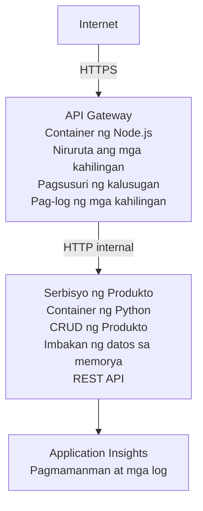

# Arkitektura ng Microservices - Halimbawa ng Container App

⏱️ **Tinatayang Oras**: 25-35 minuto | 💰 **Tinatayang Gastos**: ~$50-100/buwan | ⭐ **Kompleksidad**: Mataas

Isang **pinasimple ngunit gumaganang** arkitektura ng microservices na dineploy sa Azure Container Apps gamit ang AZD CLI. Ipinapakita ng halimbawang ito ang komunikasyon mula serbisyo papuntang serbisyo, pamamahala ng mga container, at pagmomonitor gamit ang praktikal na setup na may 2 serbisyo.

> **📚 Paraan ng Pagkatuto**: Nagsisimula ang halimbawang ito sa isang minimal na 2-serbisyo na arkitektura (API Gateway + Backend Service) na maaari mong i-deploy at pag-aralan. Pagkatapos ma-master ang pundasyong ito, nagbibigay kami ng gabay para palawakin ito sa isang buong microservices ecosystem.

## Ano ang Matututuhan Mo

Sa pagkompleto ng halimbawang ito, matututunan mo:
- Mag-deploy ng maraming container sa Azure Container Apps
- Magpatupad ng komunikasyon mula serbisyo papuntang serbisyo gamit ang internal networking
- I-configure ang scaling batay sa kapaligiran at mga health check
- I-monitor ang mga distributed na aplikasyon gamit ang Application Insights
- Maunawaan ang mga pattern ng pag-deploy ng microservices at mga best practice
- Matutunan ang progresibong pagpapalawak mula simple hanggang kumplikadong arkitektura

## Arkitektura

### Yugto 1: Ano ang Binuo Natin (Kasama sa Halimbawang Ito)


**Bakit Magsimula sa Simple?**
- ✅ Mag-deploy at maintindihan nang mabilis (25-35 minuto)
- ✅ Matutunan ang mga pangunahing pattern ng microservices nang walang komplikasyon
- ✅ Gumaganang code na maaari mong baguhin at subukan
- ✅ Mas mababang gastos para sa pag-aaral (~$50-100/buwan kumpara sa $300-1400/buwan)
- ✅ Bumuo ng kumpiyansa bago magdagdag ng mga database at message queue

**Analogy**: Isipin ito na parang pag-aaral magmaneho. Nagsisimula ka sa isang bakanteng paradahan (2 serbisyo), pinag-aaralan ang mga batayan, pagkatapos ay unti-unting pumapasok sa trapik ng lungsod (5+ serbisyo na may mga database).

### Yugto 2: Pagpapalawig sa Hinaharap (Referensyang Arkitektura)

Kapag na-master mo ang 2-serbisyo na arkitektura, maaari mo itong palawakin sa:

```
Full Architecture (Not Included - For Reference)
├── API Gateway (✅ Included)
├── Product Service (✅ Included)
├── Order Service (🔜 Add next)
├── User Service (🔜 Add next)
├── Notification Service (🔜 Add last)
├── Azure Service Bus (🔜 For async communication)
├── Cosmos DB (🔜 For product persistence)
├── Azure SQL (🔜 For order management)
└── Azure Storage (🔜 For file storage)
```

Tingnan ang seksyong "Expansion Guide" sa dulo para sa hakbang-hakbang na mga tagubilin.

## Mga Tampok na Kasama

✅ **Service Discovery**: Awtomatikong DNS-based discovery sa pagitan ng mga container  
✅ **Load Balancing**: Built-in na load balancing sa pagitan ng mga replica  
✅ **Auto-scaling**: Independent na scaling bawat serbisyo batay sa HTTP requests  
✅ **Health Monitoring**: Liveness at readiness probes para sa parehong serbisyo  
✅ **Distributed Logging**: Sentralisadong logging gamit ang Application Insights  
✅ **Internal Networking**: Secure na komunikasyon mula serbisyo papuntang serbisyo  
✅ **Container Orchestration**: Awtomatikong pag-deploy at scaling  
✅ **Zero-Downtime Updates**: Rolling updates na may revision management  

## Mga Kinakailangan

### Kinakailangang Mga Kasangkapan

Bago magsimula, tiyakin na naka-install mo ang mga sumusunod na kasangkapan:

1. **[Azure Developer CLI (azd)](https://learn.microsoft.com/azure/developer/azure-developer-cli/install-azd)** (version 1.0.0 or higher)
   ```bash
   azd version
   # Inaasahang output: azd bersyon 1.0.0 o mas mataas
   ```

2. **[Azure CLI](https://learn.microsoft.com/cli/azure/install-azure-cli)** (version 2.50.0 or higher)
   ```bash
   az --version
   # Inaasahang output: azure-cli 2.50.0 o mas mataas
   ```

3. **[Docker](https://www.docker.com/get-started)** (para sa local development/testing - opsyonal)
   ```bash
   docker --version
   # Inaasahang output: Bersyon ng Docker 20.10 o mas mataas
   ```

### Mga Kinakailangan sa Azure

- Isang aktibong **Azure subscription** ([create a free account](https://azure.microsoft.com/free/))
- Mga permiso upang lumikha ng mga resource sa iyong subscription
- **Contributor** role sa subscription o resource group

### Kinakailangang Kaalaman

Ito ay isang **advanced-level** na halimbawa. Dapat mayroon ka ng:
- Nakumpleto ang [Simple Flask API example](../../../../../examples/container-app/simple-flask-api) 
- Pangunahing pagkaunawa sa arkitektura ng microservices
- Pamilyaridad sa REST APIs at HTTP
- Pagkaunawa sa mga konsepto ng container

**Bago sa Container Apps?** Magsimula muna sa [Simple Flask API example](../../../../../examples/container-app/simple-flask-api) upang matutunan ang mga batayan.

## Mabilis na Simula (Hakbang-hakbang)

### Hakbang 1: I-clone at Mag-navigate

```bash
git clone https://github.com/microsoft/AZD-for-beginners.git
cd AZD-for-beginners/examples/container-app/microservices
```

**✓ Success Check**: Tiyaking nakikita mo ang `azure.yaml`:
```bash
ls
# Inaasahan: README.md, azure.yaml, infra/, src/
```

### Hakbang 2: Mag-authenticate sa Azure

```bash
azd auth login
```

Bubuksan nito ang iyong browser para sa Azure authentication. Mag-sign in gamit ang iyong Azure credentials.

**✓ Success Check**: Dapat mong makita:
```
Logged in to Azure.
```

### Hakbang 3: I-initialize ang Environment

```bash
azd init
```

**Mga prompt na makikita mo**:
- **Environment name**: Mag-enter ng maikling pangalan (hal., `microservices-dev`)
- **Azure subscription**: Piliin ang iyong subscription
- **Azure location**: Pumili ng rehiyon (hal., `eastus`, `westeurope`)

**✓ Success Check**: Dapat mong makita:
```
SUCCESS: New project initialized!
```

### Hakbang 4: I-deploy ang Infrastructure at mga Serbisyo

```bash
azd up
```

**Ano ang nangyayari** (tumitagal ng 8-12 minuto):
1. Lumilikha ng Container Apps environment
2. Lumilikha ng Application Insights para sa pagmomonitor
3. Binubuo ang API Gateway container (Node.js)
4. Binubuo ang Product Service container (Python)
5. I-de-deploy ang parehong container sa Azure
6. I-ko-configure ang networking at mga health check
7. Ina-set up ang monitoring at logging

**✓ Success Check**: Dapat mong makita:
```
SUCCESS: Your application was deployed to Azure in X minutes Y seconds.
Endpoint: https://api-gateway-<unique-id>.azurecontainerapps.io
```

**⏱️ Oras**: 8-12 minuto

### Hakbang 5: Subukan ang Deployment

```bash
# Kunin ang endpoint ng gateway
GATEWAY_URL=$(azd env get-values | grep API_GATEWAY_URL | cut -d '=' -f2 | tr -d '"')

# Subukan ang kalusugan ng API Gateway
curl $GATEWAY_URL/health

# Inaasahang output:
# {"status":"malusog","service":"api-gateway","timestamp":"2025-11-19T10:30:00Z"}
```

**Subukan ang product service sa pamamagitan ng gateway**:
```bash
# Ilista ang mga produkto
curl $GATEWAY_URL/api/products

# Inaasahang output:
# [
#   {"id":1,"name":"Laptop","price":999.99,"stock":50},
#   {"id":2,"name":"Mouse","price":29.99,"stock":200},
#   {"id":3,"name":"Keyboard","price":79.99,"stock":150}
# ]
```

**✓ Success Check**: Ang parehong endpoints ay nagbabalik ng JSON data nang walang errors.

---

**🎉 Congratulations!** Na-deploy mo na ang isang arkitektura ng microservices sa Azure!

## Estruktura ng Proyekto

Kasama ang lahat ng implementation files—ito ay isang kumpleto at gumaganang halimbawa:

```
microservices/
│
├── README.md                         # This file
├── azure.yaml                        # AZD configuration
├── .gitignore                        # Git ignore patterns
│
├── infra/                           # Infrastructure as Code (Bicep)
│   ├── main.bicep                   # Main orchestration
│   ├── abbreviations.json           # Naming conventions
│   ├── core/                        # Shared infrastructure
│   │   ├── container-apps-environment.bicep  # Container environment + registry
│   │   └── monitor.bicep            # Application Insights + Log Analytics
│   └── app/                         # Service definitions
│       ├── api-gateway.bicep        # API Gateway container app
│       └── product-service.bicep    # Product Service container app
│
└── src/                             # Application source code
    ├── api-gateway/                 # Node.js API Gateway
    │   ├── app.js                   # Express server with routing
    │   ├── package.json             # Node dependencies
    │   └── Dockerfile               # Container definition
    └── product-service/             # Python Product Service
        ├── main.py                  # Flask API with product data
        ├── requirements.txt         # Python dependencies
        └── Dockerfile               # Container definition
```

**Ano ang Ginagawa ng Bawat Komponent:**

**Infrastructure (infra/)**:
- `main.bicep`: Inaayos at pinamamahalaan ang lahat ng Azure resources at ang kanilang mga dependencies
- `core/container-apps-environment.bicep`: Lumilikha ng Container Apps environment at Azure Container Registry
- `core/monitor.bicep`: Nagse-set up ng Application Insights para sa distributed logging
- `app/*.bicep`: Mga indibidwal na definition ng container app na may scaling at health checks

**API Gateway (src/api-gateway/)**:
- Pampublikong serbisyo na nagro-route ng mga request sa backend services
- Nagpapatupad ng logging, error handling, at request forwarding
- Nagpapakita ng komunikasyon mula serbisyo papuntang serbisyo gamit ang HTTP

**Product Service (src/product-service/)**:
- Panloob na serbisyo na may product catalog (nasa memorya para sa pagiging simple)
- REST API na may health checks
- Halimbawa ng backend microservice pattern

## Buod ng mga Serbisyo

### API Gateway (Node.js/Express)

**Port**: 8080  
**Access**: Pampubliko (external ingress)  
**Layunin**: Nagro-route ng papasok na mga request sa tamang backend services  

**Endpoints**:
- `GET /` - Impormasyon tungkol sa serbisyo
- `GET /health` - Health check endpoint
- `GET /api/products` - Ipinapasa sa product service (listahan ng lahat)
- `GET /api/products/:id` - Ipinapasa sa product service (kuhain ayon sa ID)

**Pangunahing Tampok**:
- Request routing gamit ang axios
- Sentralisadong logging
- Error handling at timeout management
- Service discovery sa pamamagitan ng environment variables
- Integrasyon sa Application Insights

**Code Highlight** (`src/api-gateway/app.js`):
```javascript
// Panloob na komunikasyon ng serbisyo
app.get('/api/products', async (req, res) => {
  const response = await axios.get(`${PRODUCT_SERVICE_URL}/products`);
  res.json(response.data);
});
```

### Product Service (Python/Flask)

**Port**: 8000  
**Access**: Panloob lamang (walang external ingress)  
**Layunin**: Pinamamahalaan ang product catalog na nasa memorya (in-memory)  

**Endpoints**:
- `GET /` - Impormasyon tungkol sa serbisyo
- `GET /health` - Health check endpoint
- `GET /products` - Ilista lahat ng produkto
- `GET /products/<id>` - Kunin ang produkto ayon sa ID

**Pangunahing Tampok**:
- RESTful API gamit ang Flask
- Product store na nasa memorya (simple, walang kinakailangang database)
- Health monitoring gamit ang probes
- Istrakturadong logging
- Integrasyon sa Application Insights

**Data Model**:
```python
{
  "id": 1,
  "name": "Laptop",
  "description": "High-performance laptop",
  "price": 999.99,
  "stock": 50
}
```

**Bakit Panloob Lamang?**
Ang product service ay hindi nakalantad sa publiko. Lahat ng request ay dapat dumaan sa API Gateway, na nagbibigay ng:
- Seguridad: Kontroladong access point
- Kalayaan: Maaaring baguhin ang backend nang hindi naaapektuhan ang mga kliyente
- Pagmomonitor: Sentralisadong request logging

## Pag-unawa sa Komunikasyon ng Serbisyo

### Paano Nagkakaroon ng Komunikasyon ang mga Serbisyo

Sa halimbawang ito, nakikipag-ugnayan ang API Gateway sa Product Service gamit ang **internal HTTP calls**:

```javascript
// Gateway ng API (src/api-gateway/app.js)
const PRODUCT_SERVICE_URL = process.env.PRODUCT_SERVICE_URL;

// Gumawa ng panloob na kahilingan sa HTTP
const response = await axios.get(`${PRODUCT_SERVICE_URL}/products`);
```

**Mahahalagang Punto**:

1. **DNS-Based Discovery**: Awtomatikong nagbibigay ng DNS ang Container Apps para sa mga internal na serbisyo
   - Product Service FQDN: `product-service.internal.<environment>.azurecontainerapps.io`
   - Pininasimple bilang: `http://product-service` (iresolba ito ng Container Apps)

2. **Walang Pampublikong Pagkakalantad**: Ang Product Service ay may `external: false` sa Bicep
   - Maa-access lamang sa loob ng Container Apps environment
   - Hindi maaabot mula sa internet

3. **Environment Variables**: Ang mga URL ng serbisyo ay ini-inject sa oras ng deployment
   - Ipinapasa ng Bicep ang internal FQDN sa gateway
   - Walang hardcoded na URL sa application code

**Analogy**: Isipin ito na parang mga kwarto sa opisina. Ang API Gateway ay reception desk (nakaharap sa publiko), at ang Product Service ay isang silid-opisina (panloob lamang). Kailangang dumaan muna sa reception para makarating sa anumang opisina.

## Mga Opsyon sa Pag-deploy

### Buong Pag-deploy (Inirerekomenda)

```bash
# I-deploy ang imprastruktura at ang parehong mga serbisyo
azd up
```

Ito ay nagde-deploy ng:
1. Container Apps environment
2. Application Insights
3. Container Registry
4. API Gateway container
5. Product Service container

**Oras**: 8-12 minuto

### Mag-deploy ng Indibidwal na Serbisyo

```bash
# I-deploy lamang ang isang serbisyo (pagkatapos ng paunang azd up)
azd deploy api-gateway

# O i-deploy ang serbisyo ng produkto
azd deploy product-service
```

**Use Case**: Kapag na-update mo ang code sa isang serbisyo at nais mo lang i-redeploy ang serbisyong iyon.

### I-update ang Konfigurasyon

```bash
# Baguhin ang mga parameter ng pag-scale
azd env set GATEWAY_MAX_REPLICAS 30

# Muling i-deploy gamit ang bagong konfigurasyon
azd up
```

## Konfigurasyon

### Scaling Configuration

Parehong naka-configure ang mga serbisyo na may HTTP-based autoscaling sa kanilang mga Bicep file:

**API Gateway**:
- Min replicas: 2 (palaging kahit hindi bababa sa 2 para sa availability)
- Max replicas: 20
- Scale trigger: 50 concurrent requests kada replica

**Product Service**:
- Min replicas: 1 (maaaaring mag-scale to zero kung kinakailangan)
- Max replicas: 10
- Scale trigger: 100 concurrent requests kada replica

**I-customize ang Scaling** (sa `infra/app/*.bicep`):
```bicep
scale: {
  minReplicas: 1
  maxReplicas: 10
  rules: [
    {
      name: 'http-scale-rule'
      http: {
        metadata: {
          concurrentRequests: '100'  // Adjust this
        }
      }
    }
  ]
}
```

### Alokasyon ng Resource

**API Gateway**:
- CPU: 1.0 vCPU
- Memory: 2 GiB
- Dahilan: Humahawak ng lahat ng external traffic

**Product Service**:
- CPU: 0.5 vCPU
- Memory: 1 GiB
- Dahilan: Magaan na mga operasyon na nasa memorya

### Health Checks

Parehong may liveness at readiness probes ang mga serbisyo:

```bicep
probes: [
  {
    type: 'Liveness'
    httpGet: {
      path: '/health'
      port: 8080
    }
    initialDelaySeconds: 10
    periodSeconds: 30
  }
  {
    type: 'Readiness'
    httpGet: {
      path: '/health'
      port: 8080
    }
    initialDelaySeconds: 5
    periodSeconds: 10
  }
]
```

**Ano ang Kahulugan Nito**:
- **Liveness**: Kung pumalya ang health check, nire-restart ng Container Apps ang container
- **Readiness**: Kung hindi handa, ititigil ng Container Apps ang pagma-route ng traffic sa replica na iyon


## Monitoring & Observability

### Tingnan ang Logs ng Serbisyo

```bash
# Tingnan ang mga log gamit ang azd monitor
azd monitor --logs

# O gumamit ng Azure CLI para sa mga partikular na Container Apps:
# I-stream ang mga log mula sa API Gateway
az containerapp logs show --name api-gateway --resource-group $RG_NAME --follow

# Tingnan ang mga kamakailang log ng serbisyo ng produkto
az containerapp logs show --name product-service --resource-group $RG_NAME --tail 100
```

**Inaasahang Output**:
```
[api-gateway] API Gateway listening on port 8080
[api-gateway] Product Service URL: http://product-service
[api-gateway] GET /api/products 200 - 45ms
[product-service] Retrieved 5 products
```

### Mga Query para sa Application Insights

Pumunta sa Application Insights sa Azure Portal, pagkatapos patakbuhin ang mga query na ito:

**Hanapin ang Mabagal na Mga Request**:
```kusto
requests
| where timestamp > ago(1h)
| where duration > 1000  // Requests taking >1 second
| summarize count() by name, cloud_RoleName
| order by count_ desc
```

**Subaybayan ang Mga Tawag sa Serbisyo**:
```kusto
dependencies
| where timestamp > ago(1h)
| where type == "Http"
| project timestamp, name, target, duration, success
| order by timestamp desc
```

**Rate ng Error ayon sa Serbisyo**:
```kusto
exceptions
| where timestamp > ago(24h)
| summarize errorCount = count() by cloud_RoleName, type
| order by errorCount desc
```

**Dami ng Request sa Paglipas ng Panahon**:
```kusto
requests
| where timestamp > ago(1h)
| summarize requestCount = count() by bin(timestamp, 5m), cloud_RoleName
| render timechart
```

### I-access ang Monitoring Dashboard

```bash
# Kunin ang mga detalye ng Application Insights
azd env get-values | grep APPLICATIONINSIGHTS

# Buksan ang pagsubaybay sa Azure Portal
az monitor app-insights component show \
  --app $(azd env get-values | grep APPLICATIONINSIGHTS_CONNECTION_STRING | cut -d '=' -f2) \
  --resource-group $(azd env get-values | grep AZURE_RESOURCE_GROUP | cut -d '=' -f2) \
  --query "appId" -o tsv
```

### Live Metrics

1. Mag-navigate sa Application Insights sa Azure Portal
2. I-click ang "Live Metrics"
3. Makita ang real-time na requests, failures, at performance
4. Subukan gamit ang: `curl $(azd env get-values | grep API_GATEWAY_URL | cut -d '=' -f2 | tr -d '"')/api/products`

## Praktikal na Pagsasanay

[Tandaan: Tingnan ang buong mga exercise sa itaas sa seksyong "Practical Exercises" para sa detalyadong hakbang-hakbang na mga gawain kasama ang pag-verify ng deployment, pagbabago ng data, mga pagsubok sa autoscaling, paghawak ng error, at pagdagdag ng pangatlong serbisyo.]

## Pagsusuri ng Gastos

### Tinatayang Buwanang Gastos (Para sa Halimbawang 2-Serbisyo na Ito)

| Resource | Configuration | Estimated Cost |
|----------|--------------|----------------|
| API Gateway | 2-20 replicas, 1 vCPU, 2GB RAM | $30-150 |
| Product Service | 1-10 replicas, 0.5 vCPU, 1GB RAM | $15-75 |
| Container Registry | Basic tier | $5 |
| Application Insights | 1-2 GB/month | $5-10 |
| Log Analytics | 1 GB/month | $3 |
| **Kabuuan** | | **$58-243/month** |

**Paghiwalay ng Gastos ayon sa Paggamit**:
- **Mababang traffic** (pagsusuri/pag-aaral): ~$60/buwan
- **Katamtamang traffic** (maliit na production): ~$120/buwan
- **Mataas na traffic** (abalang panahon): ~$240/buwan

### Mga Tip para I-optimize ang Gastos

1. **Scale to Zero para sa Development**:
   ```bicep
   scale: {
     minReplicas: 0  // Save $30-40/month when not in use
     maxReplicas: 10
   }
   ```

2. **Gumamit ng Consumption Plan para sa Cosmos DB** (kapag idinagdag mo ito):
   - Magbayad lamang para sa gamit mo
   - Walang minimum na singil

3. **Itakda ang Application Insights Sampling**:
   ```javascript
   appInsights.defaultClient.config.samplingPercentage = 50; // Kunin ang 50% ng mga kahilingan bilang sample
   ```

4. **Linisin Kapag Hindi Kinakailangan**:
   ```bash
   azd down
   ```

### Mga Opsyon sa Free Tier

Para sa pag-aaral/pagsusuri, isaalang-alang:
- Gumamit ng libreng kredito ng Azure (unang 30 araw)
- Panatilihin sa pinakamababang bilang ng replicas
- I-delete pagkatapos ng pagsubok (walang patuloy na singil)

---

## Paglilinis

Upang maiwasan ang patuloy na singil, i-delete ang lahat ng resources:

```bash
azd down --force --purge
```

**Prompt ng Kumpirmasyon**:
```
? Total resources to delete: 6, are you sure you want to continue? (y/N)
```

I-type ang `y` upang kumpirmahin.

**Ano ang Mabubura**:
- Container Apps Environment
- Parehong Container Apps (gateway & product service)
- Container Registry
- Application Insights
- Log Analytics Workspace
- Resource Group

**✓ Beripikahin ang Paglilinis**:
```bash
az group list --query "[?starts_with(name,'rg-microservices')]" --output table
```

Dapat magbalik ng walang laman.

---

## Gabay sa Pagpapalawak: Mula 2 hanggang 5+ Serbisyo

Kapag na-master mo na ang 2-service na arkitekturang ito, narito kung paano magpalawak:

### Yugto 1: Magdagdag ng Persistenteng Database (Susunod na Hakbang)

**Magdagdag ng Cosmos DB para sa Product Service**:

1. Gumawa ng `infra/core/cosmos.bicep`:
   ```bicep
   resource cosmosAccount 'Microsoft.DocumentDB/databaseAccounts@2023-04-15' = {
     name: name
     location: location
     kind: 'GlobalDocumentDB'
     properties: {
       databaseAccountOfferType: 'Standard'
       locations: [{ locationName: location, failoverPriority: 0 }]
     }
   }
   ```

2. I-update ang product service upang gumamit ng Cosmos DB sa halip na in-memory na data

3. Tinatayang karagdagang gastos: ~$25/buwan (serverless)

### Yugto 2: Magdagdag ng Ikatlong Serbisyo (Order Management)

**Gumawa ng Order Service**:

1. Bagong folder: `src/order-service/` (Python/Node.js/C#)
2. Bagong Bicep: `infra/app/order-service.bicep`
3. I-update ang API Gateway upang i-route ang `/api/orders`
4. Magdagdag ng Azure SQL Database para sa persistence ng order

**Ang Arkitektura ay magiging**:
```
API Gateway → Product Service (Cosmos DB)
           → Order Service (Azure SQL)
```

### Yugto 3: Magdagdag ng Async Communication (Service Bus)

**Ipatupad ang Event-Driven Architecture**:

1. Magdagdag ng Azure Service Bus: `infra/core/servicebus.bicep`
2. Nagla-publish ang Product Service ng "ProductCreated" events
3. Naga-subscribe ang Order Service sa mga product events
4. Magdagdag ng Notification Service upang mag-process ng events

**Pattern**: Kahilingan/Tugon (HTTP) + Event-Driven (Service Bus)

### Yugto 4: Magdagdag ng Pagpapatunay ng Gumagamit

**Ipatupad ang User Service**:

1. Gumawa ng `src/user-service/` (Go/Node.js)
2. Magdagdag ng Azure AD B2C o custom JWT authentication
3. I-validate ng API Gateway ang mga token
4. Tinitingnan ng mga serbisyo ang mga permiso ng user

### Yugto 5: Kahandaan para sa Produksyon

**Magdagdag ng mga Bahaging Ito**:
- Azure Front Door (global load balancing)
- Azure Key Vault (secret management)
- Azure Monitor Workbooks (custom dashboards)
- CI/CD Pipeline (GitHub Actions)
- Blue-Green Deployments
- Managed Identity para sa lahat ng serbisyo

**Kabuuang Gastos ng Produksyon na Arkitektura**: ~$300-1,400/buwan

---

## Matuto Pa

### Kaugnay na Dokumentasyon
- [Dokumentasyon ng Azure Container Apps](https://learn.microsoft.com/azure/container-apps/)
- [Gabay sa Arkitekturang Microservices](https://learn.microsoft.com/azure/architecture/guide/architecture-styles/microservices)
- [Application Insights para sa Distributed Tracing](https://learn.microsoft.com/azure/azure-monitor/app/distributed-tracing)
- [Dokumentasyon ng Azure Developer CLI](https://learn.microsoft.com/azure/developer/azure-developer-cli/)

### Susunod na Mga Hakbang sa Kursong Ito
- ← Nakaraan: [Simple Flask API](../../../../../examples/container-app/simple-flask-api) - Halimbawa para sa nagsisimula: single-container
- → Susunod: [AI Integration Guide](../../../../../examples/docs/ai-foundry) - Magdagdag ng kakayahang AI
- 🏠 [Tahanan ng Kurso](../../README.md)

### Paghahambing: Kailan Gagamitin Ano

**Single Container App** (Halimbawa ng Simple Flask API):
- ✅ Simple na mga aplikasyon
- ✅ Monolithic na arkitektura
- ✅ Mabilis i-deploy
- ❌ Limitado ang scalability
- **Gastos**: ~$15-50/buwan

**Microservices** (Halimbawang ito):
- ✅ Kumplikadong mga aplikasyon
- ✅ Independent na scaling bawat serbisyo
- ✅ Autonomiya ng team (iba’t ibang serbisyo, iba’t ibang team)
- ❌ Mas kumplikado pamahalaan
- **Gastos**: ~$60-250/buwan

**Kubernetes (AKS)**:
- ✅ Pinakamataas na kontrol at flexibility
- ✅ Multi-cloud portability
- ✅ Advanced na networking
- ❌ Nangangailangan ng Kubernetes expertise
- **Gastos**: ~$150-500/buwan minimum

**Rekomendasyon**: Magsimula sa Container Apps (ang halimbawang ito), lumipat sa AKS lamang kung kailangan mo ng mga tampok na partikular sa Kubernetes.

---

## Madalas na Itanong

**Q: Bakit 2 lang na serbisyo sa halip na 5+?**  
A: Pang-edukasyon na pag-unlad. I-master muna ang mga pundasyon (komunikasyon ng serbisyo, monitoring, scaling) gamit ang simpleng halimbawa bago magdagdag ng komplikasyon. Ang mga pattern na matututunan mo dito ay naaangkop sa 100-service na arkitektura.

**Q: Maaari ba akong magdagdag pa ng mga serbisyo mag-isa?**  
A: Oo naman! Sundin ang gabay sa pagpapalawak sa itaas. Ang bawat bagong serbisyo ay sumusunod sa parehong pattern: gumawa ng src folder, gumawa ng Bicep file, i-update ang azure.yaml, i-deploy.

**Q: Handang-gamitin ba ito para sa produksyon?**  
A: Ito ay isang matibay na pundasyon. Para sa produksyon, magdagdag ng: managed identity, Key Vault, persistent databases, CI/CD pipeline, monitoring alerts, at backup strategy.

**Q: Bakit hindi gumamit ng Dapr o ibang service mesh?**  
A: Panatilihin itong simple para sa pagkatuto. Kapag naintindihan mo na ang native na networking ng Container Apps, maaari mong idagdag ang Dapr para sa mga advanced na scenario.

**Q: Paano ako mag-debug nang lokal?**  
A: Patakbuhin ang mga serbisyo nang lokal gamit ang Docker:
```bash
cd src/api-gateway
docker build -t local-gateway .
docker run -p 8080:8080 -e PRODUCT_SERVICE_URL=http://localhost:8000 local-gateway
```

**Q: Maaari ba akong gumamit ng iba't ibang programming languages?**  
A: Oo! Ipinapakita ng halimbawang ito ang Node.js (gateway) + Python (product service). Maaari mong paghaluin ang anumang mga wika na tumatakbo sa mga container.

**Q: Paano kung wala akong Azure credits?**  
A: Gumamit ng Azure free tier (unang 30 araw para sa bagong mga account) o mag-deploy para sa maiikling panahon ng pagsubok at i-delete agad.

---

> **🎓 Buod ng Learning Path**: Natutunan mong i-deploy ang isang multi-service na arkitektura na may automatic scaling, internal networking, sentralisadong monitoring, at mga pattern na handa para sa produksyon. Inihahanda ka ng pundasyong ito para sa mga kumplikadong distributed systems at enterprise microservices architectures.

**📚 Pag-navigate sa Kurso:**
- ← Nakaraan: [Simple Flask API](../../../../../examples/container-app/simple-flask-api)
- → Susunod: [Database Integration Example](../../../../../examples/database-app)
- 🏠 [Tahanan ng Kurso](../../../README.md)
- 📖 [Pinakamahusay na Kasanayan para sa Container Apps](../../../docs/chapter-04-infrastructure/deployment-guide.md)

---

<!-- CO-OP TRANSLATOR DISCLAIMER START -->
**Disclaimer**:
Ang dokumentong ito ay isinalin gamit ang serbisyong AI na [Co-op Translator](https://github.com/Azure/co-op-translator). Bagaman nagsusumikap kami para sa katumpakan, pakitandaan na ang mga awtomatikong pagsasalin ay maaaring maglaman ng mga pagkakamali o di-tumpak na impormasyon. Ang orihinal na dokumento sa katutubong wika nito ang dapat ituring na opisyal na sanggunian. Para sa mga kritikal na impormasyon, inirerekomenda ang propesyonal na pagsasaling-tao. Hindi kami mananagot para sa anumang hindi pagkakaintindihan o maling interpretasyon na nagmumula sa paggamit ng pagsasaling ito.
<!-- CO-OP TRANSLATOR DISCLAIMER END -->