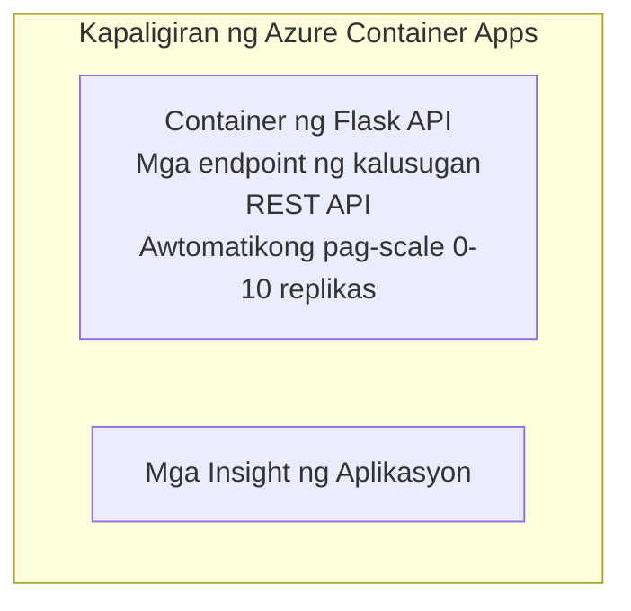

# Simple Flask API - Halimbawa ng Container App

**Landas ng Pagkatuto:** Baguhan ⭐ | **Oras:** 25-35 minuto | **Gastos:** $0-15/buwan

Isang kumpleto at gumaganang Python Flask REST API na na-deploy sa Azure Container Apps gamit ang Azure Developer CLI (azd). Ipinapakita ng halimbawang ito ang pag-deploy ng container, auto-scaling, at mga batayang pagmo-monitor.

## 🎯 Ano ang Matututuhan Mo

- Mag-deploy ng naka-container na Python application sa Azure
- I-configure ang auto-scaling gamit ang scale-to-zero
- Magpatupad ng health probes at readiness checks
- I-monitor ang mga logs at metrics ng application
- Gamitin ang Azure Developer CLI para sa mabilis na deployment

## 📦 Ano ang Kasama

✅ **Flask Application** - Kumpletong REST API na may CRUD operations (`src/app.py`)  
✅ **Dockerfile** - Container configuration na handa sa production  
✅ **Bicep Infrastructure** - Container Apps environment at pag-deploy ng API  
✅ **AZD Configuration** - Setup para sa deployment sa isang utos  
✅ **Health Probes** - Nakakonpigure ang liveness at readiness checks  
✅ **Auto-scaling** - 0-10 replicas batay sa HTTP load  

## Arkitektura



## Mga Kinakailangan

### Kinakailangan
- **Azure Developer CLI (azd)** - [Gabay sa pag-install](https://learn.microsoft.com/azure/developer/azure-developer-cli/install-azd)
- **Azure subscription** - [Libreng account](https://azure.microsoft.com/free/)
- **Docker Desktop** - [I-install ang Docker](https://www.docker.com/products/docker-desktop/) (para sa lokal na testing)

### I-verify ang Mga Kinakailangan

```bash
# Suriin ang bersyon ng azd (kailangan 1.5.0 o mas mataas)
azd version

# I-verify ang pag-login sa Azure
azd auth login

# Suriin ang Docker (opsyonal, para sa lokal na pagsubok)
docker --version
```

## ⏱️ Timeline ng Deployment

| Yugto | Tagal | Ano ang Nangyayari |
|-------|----------|--------------||
| Pag-setup ng environment | 30 segundo | Lumikha ng azd environment |
| I-build ang container | 2-3 minuto | I-build ang Flask app gamit ang Docker |
| Mag-provision ng imprastruktura | 3-5 minuto | Lumikha ng Container Apps, registry, monitoring |
| I-deploy ang application | 2-3 minuto | I-push ang image at i-deploy sa Container Apps |
| **Kabuuan** | **8-12 minuto** | Kumpletong deployment na handa |

## Mabilis na Simula

```bash
# Pumunta sa halimbawa
cd examples/container-app/simple-flask-api

# Ihanda ang kapaligiran (pumili ng natatanging pangalan)
azd env new myflaskapi

# I-deploy ang lahat (imprastruktura + aplikasyon)
azd up
# Hihilingin sa iyo na:
# 1. Piliin ang Azure subscription
# 2. Piliin ang lokasyon (hal., eastus2)
# 3. Maghintay ng 8-12 minuto para sa deployment

# Kunin ang iyong API endpoint
azd env get-values

# Subukan ang API
curl $(azd env get-value API_ENDPOINT)/health
```

**Inaasahang Output:**
```json
{
  "status": "healthy",
  "timestamp": "2025-11-19T10:30:00Z",
  "service": "simple-flask-api",
  "version": "1.0.0"
}
```

## ✅ I-verify ang Deployment

### Hakbang 1: Suriin ang Status ng Deployment

```bash
# Tingnan ang mga na-deploy na serbisyo
azd show

# Ipinapakita ng inaasahang output:
# - Serbisyo: api
# - Endpoint: https://ca-api-[env].xxx.azurecontainerapps.io
# - Katayuan: Tumatakbo
```

### Hakbang 2: Subukan ang mga Endpoint ng API

```bash
# Kunin ang endpoint ng API
API_URL=$(azd env get-value API_ENDPOINT)

# Subukan ang kalusugan
curl $API_URL/health

# Subukan ang pangunahing endpoint
curl $API_URL/

# Lumikha ng isang item
curl -X POST $API_URL/api/items \
  -H "Content-Type: application/json" \
  -d '{"name": "Test Item", "description": "My first item"}'

# Kunin ang lahat ng item
curl $API_URL/api/items
```

**Pamantayan ng Tagumpay:**
- ✅ Ang health endpoint ay nagbabalik ng HTTP 200
- ✅ Ipinapakita ng root endpoint ang impormasyon ng API
- ✅ Ang POST ay lumilikha ng item at nagbabalik ng HTTP 201
- ✅ Ang GET ay nagbabalik ng mga nilikhang item

### Hakbang 3: Tingnan ang Mga Logs

```bash
# I-stream ang mga live na log gamit ang azd monitor
azd monitor --logs

# O gamitin ang Azure CLI:
az containerapp logs show --name api --resource-group $RG_NAME --follow

# Makikita mo:
# - Mga mensahe ng pagsisimula ng Gunicorn
# - Mga log ng HTTP request
# - Mga log ng impormasyon ng aplikasyon
```

## Estruktura ng Proyekto

```
simple-flask-api/
├── azure.yaml              # AZD configuration
├── infra/
│   ├── main.bicep         # Main infrastructure
│   ├── main.parameters.json
│   └── app/
│       ├── container-env.bicep
│       └── api.bicep
└── src/
    ├── app.py             # Flask application
    ├── requirements.txt
    └── Dockerfile
```

## Mga Endpoint ng API

| Endpoint | Metodo | Deskripsyon |
|----------|--------|-------------|
| `/health` | GET | Pagsusuri ng kalusugan |
| `/api/items` | GET | Ilista ang lahat ng mga item |
| `/api/items` | POST | Lumikha ng bagong item |
| `/api/items/{id}` | GET | Kunin ang partikular na item |
| `/api/items/{id}` | PUT | I-update ang item |
| `/api/items/{id}` | DELETE | Burahin ang item |

## Konfigurasyon

### Mga Environment Variables

```bash
# Itakda ang pasadyang konfigurasyon
azd env set PORT 8000
azd env set LOG_LEVEL info
azd env set MAX_REPLICAS 20
```

### Konfigurasyon ng Scaling

Awtomatikong nag-scale ang API batay sa HTTP traffic:
- **Min Replicas**: 0 (nag-scale sa zero kapag walang aktibidad)
- **Max Replicas**: 10
- **Concurrent Requests per Replica**: 50

## Pag-develop

### Patakbuhin Lokal

```bash
# I-install ang mga dependency
cd src
pip install -r requirements.txt

# Patakbuhin ang app
python app.py

# Subukan nang lokal
curl http://localhost:8000/health
```

### Buuin at Subukan ang Container

```bash
# Gumawa ng imahe ng Docker
docker build -t flask-api:local ./src

# Patakbuhin ang konteyner nang lokal
docker run -p 8000:8000 flask-api:local

# Subukan ang konteyner
curl http://localhost:8000/health
```

## Pag-deploy

### Kumpletong Pag-deploy

```bash
# I-deploy ang imprastruktura at ang aplikasyon
azd up
```

### Pag-deploy ng Code Lamang

```bash
# I-deploy lamang ang code ng aplikasyon (hindi binago ang imprastraktura)
azd deploy api
```

### I-update ang Konfigurasyon

```bash
# I-update ang mga environment variable
azd env set API_KEY "new-api-key"

# I-deploy muli gamit ang bagong konfigurasyon
azd deploy api
```

## Pagmo-monitor

### Tingnan ang Logs

```bash
# I-stream ang mga live na log gamit ang azd monitor
azd monitor --logs

# O gamitin ang Azure CLI para sa Container Apps:
az containerapp logs show --name api --resource-group $RG_NAME --follow

# Tingnan ang huling 100 na linya
az containerapp logs show --name api --resource-group $RG_NAME --tail 100
```

### I-monitor ang Metrics

```bash
# Buksan ang dashboard ng Azure Monitor
azd monitor --overview

# Tingnan ang mga partikular na sukatan
az monitor metrics list \
  --resource $(azd show --output json | jq -r '.services.api.resourceId') \
  --metric "Requests,ResponseTime"
```

## Pagsusuri

### Pagsusuri ng Kalusugan

```bash
curl $(azd show --output json | jq -r '.services.api.endpoint')/health
```

Inaashang tugon:
```json
{
  "status": "healthy",
  "timestamp": "2025-11-19T10:30:00Z"
}
```

### Gumawa ng Item

```bash
curl -X POST $(azd show --output json | jq -r '.services.api.endpoint')/api/items \
  -H "Content-Type: application/json" \
  -d '{"name": "Test Item", "description": "A test item"}'
```

### Kunin ang Lahat ng Mga Item

```bash
curl $(azd show --output json | jq -r '.services.api.endpoint')/api/items
```

## Pag-optimize ng Gastos

Gumagamit ang deployment na ito ng scale-to-zero, kaya babayaran mo lamang kapag ang API ay nagpo-proseso ng mga kahilingan:

- **Gastos kapag idle**: ~$0/buwan (naka-scale sa zero)
- **Gastos kapag aktibo**: ~$0.000024/segundo bawat replica
- **Inaasahang buwanang gastos** (mababang paggamit): $5-15

### Bawasan pa ang Gastos

```bash
# Bawasan ang pinakamataas na bilang ng mga replika para sa dev
azd env set MAX_REPLICAS 3

# Gumamit ng mas maikling idle timeout
azd env set SCALE_TO_ZERO_TIMEOUT 300  # 5 minuto
```

## Pag-troubleshoot

### Hindi Magsisimula ang Container

```bash
# Suriin ang mga log ng container gamit ang Azure CLI
az containerapp logs show --name api --resource-group $RG_NAME --tail 100

# Patunayan na ang Docker image ay nabubuo nang lokal
docker build -t test ./src
```

### Hindi Ma-access ang API

```bash
# Tiyakin na ang ingress ay panlabas
az containerapp show --name api --resource-group rg-simple-flask-api \
  --query properties.configuration.ingress.external
```

### Mataas na Oras ng Tugon

```bash
# Suriin ang paggamit ng CPU/memory
az monitor metrics list \
  --resource $(azd show --output json | jq -r '.services.api.resourceId') \
  --metric "CPUPercentage,MemoryPercentage"

# Palakihin ang mga resource kung kinakailangan
az containerapp update --name api --resource-group rg-simple-flask-api \
  --cpu 1.0 --memory 2Gi
```

## Linisin

```bash
# Tanggalin ang lahat ng mga mapagkukunan
azd down --force --purge
```

## Susunod na Mga Hakbang

### Palawakin ang Halimbawang Ito

1. **Magdagdag ng Database** - I-integrate ang Azure Cosmos DB o SQL Database
   ```bash
   # Idagdag ang module ng Cosmos DB sa infra/main.bicep
   # I-update ang app.py upang isama ang koneksyon sa database
   ```

2. **Magdagdag ng Authentication** - Ipatupad ang Microsoft Entra ID o API keys
   ```python
   # Magdagdag ng middleware para sa pagpapatunay sa app.py
   from functools import wraps
   ```

3. **I-set up ang CI/CD** - Workflow ng GitHub Actions
   ```yaml
   # Create .github/workflows/deploy.yml
   name: Deploy to Azure
   on: [push]
   ```

4. **Magdagdag ng Managed Identity** - Siguraduhing secure ang access sa mga serbisyo ng Azure
   ```bicep
   # Update infra/app/api.bicep
   identity: { type: 'SystemAssigned' }
   ```

### Mga Kaugnay na Halimbawa

- **[Database App](../../../../../examples/database-app)** - Kumpletong halimbawa na may SQL Database
- **[Microservices](../../../../../examples/container-app/microservices)** - Arkitekturang multi-serbisyo
- **[Container Apps Master Guide](../README.md)** - Lahat ng mga pattern ng container

### Mga Mapagkukunan sa Pagkatuto

- 📚 [AZD For Beginners Course](../../../README.md) - Pangunahing pahina ng kurso
- 📚 [Container Apps Patterns](../README.md) - Higit pang mga pattern ng deployment
- 📚 [AZD Templates Gallery](https://azure.github.io/awesome-azd/) - Mga template ng komunidad

## Karagdagang Mapagkukunan

### Dokumentasyon
- **[Flask Documentation](https://flask.palletsprojects.com/)** - Gabay sa Flask framework
- **[Azure Container Apps](https://learn.microsoft.com/azure/container-apps/)** - Opisyal na dokumentasyon ng Azure
- **[Azure Developer CLI](https://learn.microsoft.com/azure/developer/azure-developer-cli/)** - Sanggunian ng mga utos ng azd

### Mga Tutorial
- **[Container Apps Quickstart](https://learn.microsoft.com/azure/container-apps/quickstart-portal)** - I-deploy ang iyong unang app
- **[Python on Azure](https://learn.microsoft.com/azure/developer/python/)** - Gabay sa pag-develop ng Python
- **[Bicep Language](https://learn.microsoft.com/azure/azure-resource-manager/bicep/)** - Infrastructure as code

### Mga Tool
- **[Azure Portal](https://portal.azure.com)** - Pamahalaan ang mga resource nang biswal
- **[VS Code Azure Extension](https://marketplace.visualstudio.com/items?itemName=ms-azuretools.vscode-azurecontainerapps)** - Integrasyon sa IDE

---

**🎉 Binabati kita!** Na-deploy mo ang isang production-ready Flask API sa Azure Container Apps na may auto-scaling at pagmo-monitor.

**May mga tanong?** [Magbukas ng isyu](https://github.com/microsoft/AZD-for-beginners/issues) o tingnan ang [FAQ](../../../resources/faq.md)

---

<!-- CO-OP TRANSLATOR DISCLAIMER START -->
**Pagtatanggi**:
Ang dokumentong ito ay isinalin gamit ang serbisyo ng AI translation na [Co-op Translator](https://github.com/Azure/co-op-translator). Bagama't nagsusumikap kami para sa katumpakan, pakatandaan na ang awtomatikong pagsasalin ay maaaring maglaman ng mga pagkakamali o hindi pagkakatugma. Ang orihinal na dokumento sa orihinal nitong wika ang dapat ituring na pangunahing sanggunian. Para sa mahahalagang impormasyon, inirerekomenda ang propesyonal na pagsasalin ng tao. Hindi kami mananagot sa anumang maling pagkakaintindi o maling interpretasyon na nagmula sa paggamit ng pagsasaling ito.
<!-- CO-OP TRANSLATOR DISCLAIMER END -->