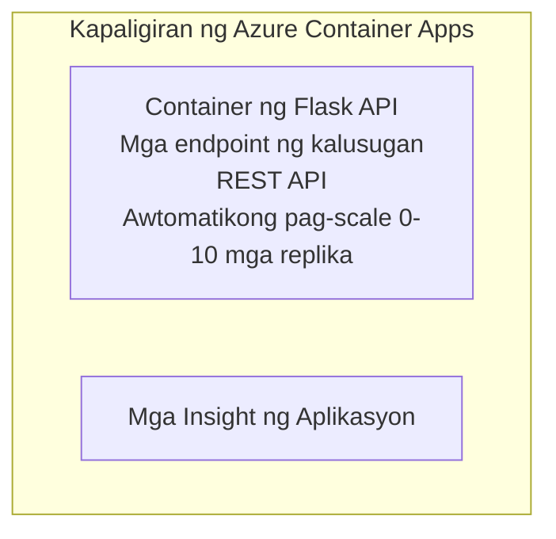

# Simple Flask API - Container App Example

**Learning Path:** Baguhan ⭐ | **Time:** 25-35 minutes | **Cost:** $0-15/month

Isang kumpleto, gumagana na Python Flask REST API na naka-deploy sa Azure Container Apps gamit ang Azure Developer CLI (azd). Ipinapakita ng halimbawang ito ang pag-deploy ng container, auto-scaling, at mga pangunahing kaalaman sa pagmomonitor.

## 🎯 What You'll Learn

- I-deploy ang isang containerized na Python application sa Azure
- I-configure ang auto-scaling kasama ang scale-to-zero
- Mag-implement ng health probes at readiness checks
- Subaybayan ang mga log at metric ng application
- Gumamit ng Azure Developer CLI para sa mabilis na deployment

## 📦 What's Included

✅ **Flask Application** - Kumpletong REST API na may CRUD operations (`src/app.py`)  
✅ **Dockerfile** - Production-ready na konfigurasyon ng container  
✅ **Bicep Infrastructure** - Container Apps environment at pag-deploy ng API  
✅ **AZD Configuration** - One-command deployment setup  
✅ **Health Probes** - Nakakonfig na liveness at readiness checks  
✅ **Auto-scaling** - 0-10 replicas batay sa HTTP load  

## Architecture


## Prerequisites

### Required
- **Azure Developer CLI (azd)** - [Gabay sa pag-install](https://learn.microsoft.com/azure/developer/azure-developer-cli/install-azd)
- **Azure subscription** - [Free account](https://azure.microsoft.com/free/)
- **Docker Desktop** - [Install Docker](https://www.docker.com/products/docker-desktop/) (para sa lokal na pag-test)

### Verify Prerequisites

```bash
# Suriin ang bersyon ng azd (kailangang 1.5.0 o mas mataas)
azd version

# Kumpirmahin ang pag-login sa Azure
azd auth login

# Suriin ang Docker (opsyonal, para sa lokal na pagsubok)
docker --version
```

## ⏱️ Deployment Timeline

| Phase | Duration | What Happens |
|-------|----------|--------------||
| Environment setup | 30 seconds | Create azd environment |
| Build container | 2-3 minutes | Docker build Flask app |
| Provision infrastructure | 3-5 minutes | Create Container Apps, registry, monitoring |
| Deploy application | 2-3 minutes | Push image and deploy to Container Apps |
| **Total** | **8-12 minutes** | Complete deployment ready |

## Quick Start

```bash
# Pumunta sa halimbawa
cd examples/container-app/simple-flask-api

# I-initialize ang kapaligiran (pumili ng natatanging pangalan)
azd env new myflaskapi

# I-deploy ang lahat (imprastruktura + aplikasyon)
azd up
# Hihilingin sa iyo na:
# 1. Piliin ang Azure subscription
# 2. Piliin ang lokasyon (hal. eastus2)
# 3. Maghintay ng 8-12 minuto para sa pag-deploy

# Kunin ang iyong API endpoint
azd env get-values

# Subukan ang API
curl $(azd env get-value API_ENDPOINT)/health
```

**Inaasahang Output:**
```json
{
  "status": "healthy",
  "timestamp": "2025-11-19T10:30:00Z",
  "service": "simple-flask-api",
  "version": "1.0.0"
}
```

## ✅ Verify Deployment

### Hakbang 1: Suriin ang Katayuan ng Pag-deploy

```bash
# Tingnan ang mga naka-deploy na serbisyo
azd show

# Ipinapakita ng inaasahang output:
# - Serbisyo: api
# - Endpoint: https://ca-api-[env].xxx.azurecontainerapps.io
# - Katayuan: Tumatakbo
```

### Hakbang 2: Subukan ang mga API Endpoint

```bash
# Kunin ang endpoint ng API
API_URL=$(azd env get-value API_ENDPOINT)

# Subukan ang kalusugan
curl $API_URL/health

# Subukan ang pangunahing endpoint
curl $API_URL/

# Lumikha ng isang item
curl -X POST $API_URL/api/items \
  -H "Content-Type: application/json" \
  -d '{"name": "Test Item", "description": "My first item"}'

# Kunin ang lahat ng mga item
curl $API_URL/api/items
```

**Pamantayan ng Tagumpay:**
- ✅ Health endpoint ay nagbabalik ng HTTP 200
- ✅ Root endpoint ay nagpapakita ng impormasyon ng API
- ✅ POST ay lumilikha ng item at nagbabalik ng HTTP 201
- ✅ GET ay nagbabalik ng mga nilikhang item

### Hakbang 3: Tingnan ang mga Log

```bash
# I-stream ang live na mga log gamit ang azd monitor
azd monitor --logs

# O gamitin ang Azure CLI:
az containerapp logs show --name api --resource-group $RG_NAME --follow

# Dapat mong makita:
# - Mga mensahe ng pagsisimula ng Gunicorn
# - Mga log ng HTTP request
# - Mga log ng impormasyon ng aplikasyon
```

## Project Structure

```
simple-flask-api/
├── azure.yaml              # AZD configuration
├── infra/
│   ├── main.bicep         # Main infrastructure
│   ├── main.parameters.json
│   └── app/
│       ├── container-env.bicep
│       └── api.bicep
└── src/
    ├── app.py             # Flask application
    ├── requirements.txt
    └── Dockerfile
```

## API Endpoints

| Endpoint | Method | Description |
|----------|--------|-------------|
| `/health` | GET | Pagsusuri ng kalusugan |
| `/api/items` | GET | Ilista ang lahat ng mga item |
| `/api/items` | POST | Lumikha ng bagong item |
| `/api/items/{id}` | GET | Kunin ang partikular na item |
| `/api/items/{id}` | PUT | I-update ang item |
| `/api/items/{id}` | DELETE | Tanggalin ang item |

## Configuration

### Environment Variables

```bash
# Itakda ang pasadyang konfigurasyon
azd env set PORT 8000
azd env set LOG_LEVEL info
azd env set MAX_REPLICAS 20
```

### Scaling Configuration

Awtomatikong nag-i-scale ang API base sa HTTP traffic:
- **Pinakamababang Replica**: 0 (nag-scale sa zero kapag walang aktibidad)
- **Pinakamataas na Replica**: 10
- **Sabaysabay na Kahilingan kada Replica**: 50

## Development

### Patakbuhin nang Lokal

```bash
# I-install ang mga dependency
cd src
pip install -r requirements.txt

# Patakbuhin ang app
python app.py

# Subukan nang lokal
curl http://localhost:8000/health
```

### Buoin at Subukan ang Container

```bash
# Buuin ang Docker image
docker build -t flask-api:local ./src

# Patakbuhin ang container nang lokal
docker run -p 8000:8000 flask-api:local

# Subukan ang container
curl http://localhost:8000/health
```

## Deployment

### Buong Pag-deploy

```bash
# I-deploy ang imprastraktura at aplikasyon
azd up
```

### Pag-deploy ng Code Lamang

```bash
# I-deploy lamang ang code ng aplikasyon (hindi binabago ang imprastruktura)
azd deploy api
```

### I-update ang Konfigurasyon

```bash
# I-update ang mga variable ng kapaligiran
azd env set API_KEY "new-api-key"

# I-deploy muli gamit ang bagong konfigurasyon
azd deploy api
```

## Pagsubaybay

### Tingnan ang Mga Log

```bash
# I-stream ang mga live na log gamit ang azd monitor
azd monitor --logs

# O gumamit ng Azure CLI para sa Container Apps:
az containerapp logs show --name api --resource-group $RG_NAME --follow

# Tingnan ang huling 100 na linya
az containerapp logs show --name api --resource-group $RG_NAME --tail 100
```

### Subaybayan ang Mga Metric

```bash
# Buksan ang dashboard ng Azure Monitor
azd monitor --overview

# Tingnan ang mga tiyak na sukatan
az monitor metrics list \
  --resource $(azd show --output json | jq -r '.services.api.resourceId') \
  --metric "Requests,ResponseTime"
```

## Pagsubok

### Pagsusuri ng Kalusugan

```bash
curl $(azd show --output json | jq -r '.services.api.endpoint')/health
```

Inaasahang tugon:
```json
{
  "status": "healthy",
  "timestamp": "2025-11-19T10:30:00Z"
}
```

### Gumawa ng Item

```bash
curl -X POST $(azd show --output json | jq -r '.services.api.endpoint')/api/items \
  -H "Content-Type: application/json" \
  -d '{"name": "Test Item", "description": "A test item"}'
```

### Kunin ang Lahat ng Mga Item

```bash
curl $(azd show --output json | jq -r '.services.api.endpoint')/api/items
```

## Pag-optimize ng Gastos

Gumagamit ang deployment na ito ng scale-to-zero, kaya nagbabayad ka lamang kapag ang API ay nagpo-proseso ng mga kahilingan:

- **Idle cost**: ~$0/month (nag-scale sa zero)
- **Active cost**: ~$0.000024/second per replica
- **Inaasahang buwanang gastos** (mababang paggamit): $5-15

### Karagdagang Pagbawas ng Gastos

```bash
# Bawasan ang maximum na mga replika para sa dev
azd env set MAX_REPLICAS 3

# Gumamit ng mas maikling idle timeout
azd env set SCALE_TO_ZERO_TIMEOUT 300  # 5 minuto
```

## Pag-troubleshoot

### Hindi Magsimula ang Container

```bash
# Suriin ang mga log ng container gamit ang Azure CLI
az containerapp logs show --name api --resource-group $RG_NAME --tail 100

# Tiyakin na nabubuo ang Docker image nang lokal
docker build -t test ./src
```

### Hindi Ma-access ang API

```bash
# Tiyakin na ang ingress ay panlabas
az containerapp show --name api --resource-group rg-simple-flask-api \
  --query properties.configuration.ingress.external
```

### Mataas na Oras ng Tugon

```bash
# Suriin ang paggamit ng CPU at memorya
az monitor metrics list \
  --resource $(azd show --output json | jq -r '.services.api.resourceId') \
  --metric "CPUPercentage,MemoryPercentage"

# Palakihin ang mga mapagkukunan kung kinakailangan
az containerapp update --name api --resource-group rg-simple-flask-api \
  --cpu 1.0 --memory 2Gi
```

## Linisin

```bash
# Tanggalin ang lahat ng mga mapagkukunan
azd down --force --purge
```

## Susunod na Mga Hakbang

### Palawakin ang Halimbawang Ito

1. **Magdagdag ng Database** - Integrate Azure Cosmos DB or SQL Database
   ```bash
   # Idagdag ang module ng Cosmos DB sa infra/main.bicep
   # I-update ang app.py gamit ang koneksyon sa database
   ```

2. **Magdagdag ng Pagpapatotoo** - Ipatupad ang Azure AD o mga API key
   ```python
   # Magdagdag ng middleware para sa awtentikasyon sa app.py
   from functools import wraps
   ```

3. **I-set Up ang CI/CD** - GitHub Actions workflow
   ```yaml
   # Create .github/workflows/deploy.yml
   name: Deploy to Azure
   on: [push]
   ```

4. **Magdagdag ng Managed Identity** - I-secure ang access sa mga serbisyo ng Azure
   ```bicep
   # Update infra/app/api.bicep
   identity: { type: 'SystemAssigned' }
   ```

### Kaugnay na Mga Halimbawa

- **[App ng Database](../../../../../examples/database-app)** - Kumpletong halimbawa na may SQL Database
- **[Microservices](../../../../../examples/container-app/microservices)** - Multi-service architecture
- **[Pangunahing Gabay sa Container Apps](../README.md)** - Lahat ng mga pattern ng container

### Mga Mapagkukunan sa Pag-aaral

- 📚 [AZD For Beginners Course](../../../README.md) - Pangunahing pahina ng kurso
- 📚 [Mga Pattern ng Container Apps](../README.md) - Higit pang mga pattern ng deployment
- 📚 [AZD Templates Gallery](https://azure.github.io/awesome-azd/) - Mga template mula sa komunidad

## Karagdagang Mapagkukunan

### Dokumentasyon
- **[Dokumentasyon ng Flask](https://flask.palletsprojects.com/)** - Gabay sa Flask framework
- **[Azure Container Apps](https://learn.microsoft.com/azure/container-apps/)** - Opisyal na dokumentasyon ng Azure
- **[Azure Developer CLI](https://learn.microsoft.com/azure/developer/azure-developer-cli/)** - talaan ng utos ng azd

### Mga Tutorial
- **[Container Apps Quickstart](https://learn.microsoft.com/azure/container-apps/quickstart-portal)** - I-deploy ang iyong unang app
- **[Python on Azure](https://learn.microsoft.com/azure/developer/python/)** - Gabay sa pag-develop gamit ang Python
- **[Bicep Language](https://learn.microsoft.com/azure/azure-resource-manager/bicep/)** - Infrastructure as code

### Mga Kasangkapan
- **[Azure Portal](https://portal.azure.com)** - Pamahalaan ang mga resource nang biswal
- **[VS Code Azure Extension](https://marketplace.visualstudio.com/items?itemName=ms-azuretools.vscode-azurecontainerapps)** - Integrasyon sa IDE

---

**🎉 Congratulations!** Na-deploy mo ang isang production-ready na Flask API sa Azure Container Apps na may auto-scaling at pagmomonitor.

**May mga katanungan?** [Magbukas ng isyu](https://github.com/microsoft/AZD-for-beginners/issues) o tingnan ang [FAQ](../../../resources/faq.md)

---

<!-- CO-OP TRANSLATOR DISCLAIMER START -->
**Disclaimer**:
Ang dokumentong ito ay isinalin gamit ang serbisyong AI na pagsasalin [Co-op Translator](https://github.com/Azure/co-op-translator). Bagaman nagsusumikap kami para sa kawastuhan, pakitandaan na ang awtomatikong mga pagsasalin ay maaaring maglaman ng mga error o kamalian. Ang orihinal na dokumento sa katutubong wika nito ang dapat ituring na pinagmumulan ng awtoridad. Para sa mahahalagang impormasyon, inirerekomenda ang propesyonal na pagsasalin ng tao. Hindi kami mananagot sa anumang hindi pagkakaunawaan o maling interpretasyon na nagmumula sa paggamit ng pagsasaling ito.
<!-- CO-OP TRANSLATOR DISCLAIMER END -->