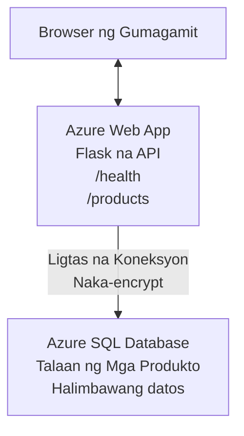

# Pag-deploy ng Microsoft SQL Database at Web App gamit ang AZD

⏱️ **Tinatayang Oras**: 20-30 minuto | 💰 **Tinatayang Gastos**: ~$15-25/buwan | ⭐ **Kompleksidad**: Katamtaman

Ang **kumpleto, gumaganang halimbawa** na ito ay nagpapakita kung paano gamitin ang [Azure Developer CLI (azd)](https://learn.microsoft.com/azure/developer/azure-developer-cli/) para mag-deploy ng Python Flask web application na may Microsoft SQL Database sa Azure. Kasama at nasubukan ang lahat ng code—walang kinakailangang external na dependency.

## Ano ang Matututuhan Mo

Sa pagtatapos ng halimbawang ito, matututuhan mo:
- Mag-deploy ng multi-tier na aplikasyon (web app + database) gamit ang infrastructure-as-code
- I-configure ang ligtas na koneksyon sa database nang hindi nagha-hardcode ng mga secret
- I-monitor ang kalusugan ng aplikasyon gamit ang Application Insights
- Pamahalaan ang mga Azure resource nang mahusay gamit ang AZD CLI
- Sundin ang pinakamahusay na kasanayan ng Azure para sa seguridad, pag-optimize ng gastos, at observability

## Pangkalahatang-ideya ng Senaryo
- **Web App**: Python Flask REST API na may koneksyon sa database
- **Database**: Azure SQL Database na may sample na data
- **Infrastructure**: Naka-provision gamit ang Bicep (modular, reusable na mga template)
- **Deployment**: Ganap na automated gamit ang `azd` commands
- **Monitoring**: Application Insights para sa logs at telemetry

## Mga Kinakailangan

### Mga Kinakailangang Tool

Bago magsimula, tiyaking naka-install mo ang mga sumusunod na tool:

1. **[Azure CLI](https://learn.microsoft.com/cli/azure/install-azure-cli)** (bersyon 2.50.0 o mas mataas)
   ```sh
   az --version
   # Inaasahang output: azure-cli 2.50.0 o mas mataas
   ```

2. **[Azure Developer CLI (azd)](https://learn.microsoft.com/azure/developer/azure-developer-cli/install-azd)** (bersyon 1.0.0 o mas mataas)
   ```sh
   azd version
   # Inaasahang output: azd version 1.0.0 o mas mataas
   ```

3. **[Python 3.8+](https://www.python.org/downloads/)** (para sa lokal na pag-develop)
   ```sh
   python --version
   # Inaasahang output: Python 3.8 o mas mataas
   ```

4. **[Docker](https://www.docker.com/get-started)** (opsyonal, para sa lokal na pag-develop gamit ang container)
   ```sh
   docker --version
   # Inaasahang output: Docker bersyon 20.10 o mas mataas
   ```

### Mga Kinakailangan sa Azure

- Isang aktibong **Azure subscription** ([create a free account](https://azure.microsoft.com/free/))
- Mga permiso para gumawa ng mga resource sa iyong subscription
- **Owner** o **Contributor** role sa subscription o resource group

### Mga Kaalamang Kinakailangan

Ito ay halimbawa sa **katamtamang antas**. Dapat pamilyar ka sa:
- Pangunahing operasyon sa command-line
- Mga pundamental na konsepto ng cloud (mga resource, resource groups)
- Pangunahing pagkaunawa sa web applications at databases

**Bago sa AZD?** Magsimula muna sa [Getting Started guide](../../docs/chapter-01-foundation/azd-basics.md).

## Arkitektura

Ang halimbawang ito ay nagde-deploy ng two-tier na arkitektura na may web application at SQL database:


**Pag-deploy ng Mga Resource:**
- **Resource Group**: Lalagyan para sa lahat ng mga resource
- **App Service Plan**: Linux-based hosting (B1 tier para sa cost efficiency)
- **Web App**: Python 3.11 runtime na may Flask application
- **SQL Server**: Managed database server na may minimum na TLS 1.2
- **SQL Database**: Basic tier (2GB, angkop para sa development/testing)
- **Application Insights**: Monitoring at logging
- **Log Analytics Workspace**: Sentralisadong imbakan ng logs

**Analogy**: Isipin ito tulad ng isang restawran (web app) na may walk-in freezer (database). Umiorder ang mga customer mula sa menu (API endpoints), at kinukuha ng kusina (Flask app) ang mga sangkap (data) mula sa freezer. Binabantayan ng manager ng restawran (Application Insights) ang lahat ng nangyayari.

## Istruktura ng Folder

Kasama ang lahat ng file sa halimbawang ito—walang kinakailangang external na dependency:

```
examples/database-app/
│
├── README.md                    # This file
├── azure.yaml                   # AZD configuration file
├── .env.sample                  # Sample environment variables
├── .gitignore                   # Git ignore patterns
│
├── infra/                       # Infrastructure as Code (Bicep)
│   ├── main.bicep              # Main orchestration template
│   ├── abbreviations.json      # Azure naming conventions
│   └── resources/              # Modular resource templates
│       ├── sql-server.bicep    # SQL Server configuration
│       ├── sql-database.bicep  # Database configuration
│       ├── app-service-plan.bicep  # Hosting plan
│       ├── app-insights.bicep  # Monitoring setup
│       └── web-app.bicep       # Web application
│
└── src/
    └── web/                    # Application source code
        ├── app.py              # Flask REST API
        ├── requirements.txt    # Python dependencies
        └── Dockerfile          # Container definition
```

**Ano ang Ginagawa ng Bawat File:**
- **azure.yaml**: Sinasabi sa AZD kung ano ang ide-deploy at saan
- **infra/main.bicep**: Nag-orchestrate ng lahat ng Azure resources
- **infra/resources/*.bicep**: Indibidwal na mga definisyon ng resource (modular para magamit muli)
- **src/web/app.py**: Flask application na may lohika ng database
- **requirements.txt**: Mga dependency ng Python package
- **Dockerfile**: Mga tagubilin para sa containerization ng deployment

## Mabilis na Simula (Hakbang-hakbang)

### Hakbang 1: I-clone at Mag-navigate

```sh
git clone https://github.com/microsoft/AZD-for-beginners.git
cd AZD-for-beginners/examples/database-app
```

**✓ Tagumpay na Pag-check**: Tiyaking nakikita mo ang `azure.yaml` at folder na `infra/`:
```sh
ls
# Inaasahan: README.md, azure.yaml, infra/, src/
```

### Hakbang 2: Mag-authenticate sa Azure

```sh
azd auth login
```

Bubuksan nito ang iyong browser para sa Azure authentication. Mag-sign in gamit ang iyong Azure credentials.

**✓ Tagumpay na Pag-check**: Makikita mo:
```
Logged in to Azure.
```

### Hakbang 3: I-initialize ang Kapaligiran

```sh
azd init
```

**Ano ang nangyayari**: Lumilikha ang AZD ng lokal na configuration para sa iyong deployment.

**Mga prompt na makikita mo**:
- **Environment name**: Maglagay ng maikling pangalan (hal., `dev`, `myapp`)
- **Azure subscription**: Piliin ang iyong subscription mula sa listahan
- **Azure location**: Piliin ang region (hal., `eastus`, `westeurope`)

**✓ Tagumpay na Pag-check**: Makikita mo:
```
SUCCESS: New project initialized!
```

### Hakbang 4: Mag-provision ng Mga Azure Resource

```sh
azd provision
```

**Ano ang nangyayari**: Ina-deploy ng AZD ang lahat ng infrastructure (tumagal ng 5-8 minuto):
1. Lumilikha ng resource group
2. Lumilikha ng SQL Server at Database
3. Lumilikha ng App Service Plan
4. Lumilikha ng Web App
5. Lumilikha ng Application Insights
6. Kino-configure ang networking at seguridad

**Tatanungin ka para sa**:
- **SQL admin username**: Maglagay ng username (hal., `sqladmin`)
- **SQL admin password**: Maglagay ng malakas na password (i-save ito!)

**✓ Tagumpay na Pag-check**: Makikita mo:
```
SUCCESS: Your application was provisioned in Azure in X minutes Y seconds.
You can view the resources created under the resource group rg-<env-name> in Azure Portal:
https://portal.azure.com/#@/resource/subscriptions/.../resourceGroups/rg-<env-name>
```

**⏱️ Oras**: 5-8 minuto

### Hakbang 5: I-deploy ang Aplikasyon

```sh
azd deploy
```

**Ano ang nangyayari**: Binubuo at dine-deploy ng AZD ang iyong Flask application:
1. Pini-package ang Python application
2. Binubuo ang Docker container
3. Ipinopush sa Azure Web App
4. Ini-initialize ang database na may sample na data
5. Sinisimulan ang application

**✓ Tagumpay na Pag-check**: Makikita mo:
```
SUCCESS: Your application was deployed to Azure in X minutes Y seconds.
You can view the resources created under the resource group rg-<env-name> in Azure Portal:
https://portal.azure.com/#@/resource/subscriptions/.../resourceGroups/rg-<env-name>
```

**⏱️ Oras**: 3-5 minuto

### Hakbang 6: Buksan ang Aplikasyon

```sh
azd browse
```

Bubuksan nito ang na-deploy mong web app sa browser sa `https://app-<unique-id>.azurewebsites.net`

**✓ Tagumpay na Pag-check**: Makikita mo ang JSON output:
```json
{
  "message": "Welcome to the Database App API",
  "endpoints": {
    "/": "This help message",
    "/health": "Health check endpoint",
    "/products": "List all products",
    "/products/<id>": "Get product by ID"
  }
}
```

### Hakbang 7: Subukan ang mga Endpoint ng API

**Health Check** (suriin ang koneksyon sa database):
```sh
curl https://app-<your-id>.azurewebsites.net/health
```

**Inaasahang Tugon**:
```json
{
  "status": "healthy",
  "database": "connected"
}
```

**List Products** (sample na data):
```sh
curl https://app-<your-id>.azurewebsites.net/products
```

**Inaasahang Tugon**:
```json
[
  {
    "id": 1,
    "name": "Laptop",
    "description": "High-performance laptop",
    "price": 1299.99,
    "created_at": "2025-11-19T10:30:00"
  },
  ...
]
```

**Get Single Product**:
```sh
curl https://app-<your-id>.azurewebsites.net/products/1
```

**✓ Tagumpay na Pag-check**: Lahat ng endpoint ay nagbabalik ng JSON data nang walang error.

---

**🎉 Binabati kita!** Matagumpay mong na-deploy ang isang web application na may database sa Azure gamit ang AZD.

## Masusing Pag-aaral ng Konfigurasyon

### Mga Environment Variable

Ang mga secret ay pinamamahalaan nang ligtas sa pamamagitan ng Azure App Service configuration—**huwag kailanman i-hardcode sa source code**.

**Awtomatikong Kinokonfigura ng AZD**:
- `SQL_CONNECTION_STRING`: Koneksyon sa database na may naka-encrypt na kredensyal
- `APPLICATIONINSIGHTS_CONNECTION_STRING`: Endpoint para sa telemetry ng monitoring
- `SCM_DO_BUILD_DURING_DEPLOYMENT`: Nagpapagana ng awtomatikong pag-install ng dependency

**Saan Iniimbak ang Mga Sekreto**:
1. Sa `azd provision`, ibibigay mo ang SQL credentials sa pamamagitan ng secure prompts
2. Iniimbak ng AZD ang mga ito sa iyong lokal na `.azure/<env-name>/.env` file (ginagawang git-ignored)
3. Ini-inject ng AZD ang mga ito sa Azure App Service configuration (encrypted at rest)
4. Binabasa ng application ang mga ito via `os.getenv()` sa runtime

### Lokal na Pag-develop

Para sa lokal na testing, gumawa ng `.env` file mula sa sample:

```sh
cp .env.sample .env
# I-edit ang .env gamit ang lokal mong koneksyon sa database
```

**Local Development Workflow**:
```sh
# I-install ang mga kinakailangan
cd src/web
pip install -r requirements.txt

# Itakda ang mga variable ng kapaligiran
export SQL_CONNECTION_STRING="your-local-connection-string"

# Patakbuhin ang aplikasyon
python app.py
```

**Subukan nang lokal**:
```sh
curl http://localhost:8000/health
# Inaasahan: {"status": "malusog", "database": "konektado"}
```

### Imprastruktura bilang Code

Lahat ng Azure resources ay dinedefine sa **Bicep templates** (`infra/` folder):

- **Modular na Disenyo**: Bawat uri ng resource ay may sariling file para magamit muli
- **Parameterized**: I-customize ang SKUs, region, at naming conventions
- **Pinakamahusay na Kasanayan**: Sumusunod sa Azure naming standards at security defaults
- **Pinamamahalaan sa Bersyon**: Ang mga pagbabago sa imprastruktura ay nakatala sa Git

**Halimbawa ng Pag-customize**:
Para baguhin ang tier ng database, i-edit ang `infra/resources/sql-database.bicep`:
```bicep
sku: {
  name: 'Standard'  // Changed from 'Basic'
  tier: 'Standard'
  capacity: 10
}
```

## Mga Pinakamahusay na Kasanayan sa Seguridad

Ang halimbawang ito ay sumusunod sa pinakamahusay na kasanayan sa seguridad ng Azure:

### 1. **Walang Sekreto sa Source Code**
- ✅ Mga kredensyal na naka-store sa Azure App Service configuration (encrypted)
- ✅ `.env` files ay hindi kasama sa Git via `.gitignore`
- ✅ Mga secret ay ipinapasa via secure parameters sa provisioning

### 2. **Naka-encrypt na Mga Koneksyon**
- ✅ TLS 1.2 minimum para sa SQL Server
- ✅ HTTPS-only na ipinapatupad para sa Web App
- ✅ Ang mga koneksyon ng database ay gumagamit ng naka-encrypt na channel

### 3. **Seguridad sa Network**
- ✅ SQL Server firewall na naka-configure para payagan lamang ang Azure services
- ✅ Public network access ay nililimitahan (maaaring higpitan pa gamit ang Private Endpoints)
- ✅ FTPS naka-disable sa Web App

### 4. **Pagpapatotoo at Awtorisasyon**
- ⚠️ **Kasalukuyan**: SQL authentication (username/password)
- ✅ **Rekomendasyon para sa Production**: Gumamit ng Azure Managed Identity para sa passwordless authentication

**Para Mag-upgrade sa Managed Identity** (para sa production):
1. I-enable ang managed identity sa Web App
2. Bigyan ng SQL permissions ang identity
3. I-update ang connection string para gumamit ng managed identity
4. Alisin ang password-based authentication

### 5. **Auditing at Pagsunod**
- ✅ Application Insights nag-log ng lahat ng request at error
- ✅ SQL Database auditing naka-enable (maaaring i-configure para sa compliance)
- ✅ Lahat ng resource ay may tag para sa governance

**Checklist sa Seguridad Bago sa Production**:
- [ ] I-enable ang Azure Defender para sa SQL
- [ ] I-configure ang Private Endpoints para sa SQL Database
- [ ] I-enable ang Web Application Firewall (WAF)
- [ ] Ipatupad ang Azure Key Vault para sa rotation ng secret
- [ ] I-configure ang Azure AD authentication
- [ ] I-enable ang diagnostic logging para sa lahat ng resource

## Pag-optimize ng Gastos

**Tinatayang Buwanang Gastos** (hanggang Nobyembre 2025):

| Resource | SKU/Tier | Tinatayang Gastos |
|----------|----------|-------------------|
| App Service Plan | B1 (Basic) | ~$13/month |
| SQL Database | Basic (2GB) | ~$5/month |
| Application Insights | Pay-as-you-go | ~$2/month (mababang traffic) |
| **Total** | | **~$20/month** |

**💡 Mga Tip para Makatipid**:

1. **Gamitin ang Free Tier para sa Pag-aaral**:
   - App Service: F1 tier (libre, may limitadong oras)
   - SQL Database: Gumamit ng Azure SQL Database serverless
   - Application Insights: 5GB/buwan na libreng ingestion

2. **Itigil ang Mga Resource Kapag Hindi Ginagamit**:
   ```sh
   # Itigil ang web app (sinisingil pa rin ang database)
   az webapp stop --name <app-name> --resource-group <rg-name>
   
   # I-restart kapag kailangan
   az webapp start --name <app-name> --resource-group <rg-name>
   ```

3. **I-delete Lahat Pagkatapos ng Testing**:
   ```sh
   azd down
   ```
   Tinatanggal nito ang LAHAT ng mga resource at ititigil ang mga singil.

4. **Development vs. Production SKUs**:
   - **Development**: Basic tier (ginamit sa halimbawang ito)
   - **Production**: Standard/Premium tier na may redundancy

**Pagmo-monitor ng Gastos**:
- Tingnan ang gastos sa [Azure Cost Management](https://portal.azure.com/#view/Microsoft_Azure_CostManagement)
- Mag-set up ng cost alerts para maiwasan ang hindi inaasahang singil
- I-tag ang lahat ng resource gamit ang `azd-env-name` para sa tracking

**Alternatibong Free Tier**:
Para sa layuning pag-aaral, maaari mong i-modify ang `infra/resources/app-service-plan.bicep`:
```bicep
sku: {
  name: 'F1'  // Free tier
  tier: 'Free'
}
```
**Tandaan**: Ang free tier ay may mga limitasyon (60 min/day CPU, walang always-on).

## Pagmamanman at Observability

### Integrasyon ng Application Insights

Kasama sa halimbawang ito ang **Application Insights** para sa komprehensibong pagmamanman:

**Ano ang Mina-monitor**:
- ✅ HTTP requests (latency, status codes, endpoints)
- ✅ Mga error at exceptions ng application
- ✅ Custom logging mula sa Flask app
- ✅ Kalusugan ng koneksyon sa database
- ✅ Performance metrics (CPU, memory)

**Paano Maa-access ang Application Insights**:
1. Buksan ang [Azure Portal](https://portal.azure.com)
2. Pumunta sa iyong resource group (`rg-<env-name>`)
3. I-click ang Application Insights resource (`appi-<unique-id>`)

**Mga Kapaki-pakinabang na Query** (Application Insights → Logs):

**View All Requests**:
```kusto
requests
| where timestamp > ago(1h)
| order by timestamp desc
| project timestamp, name, url, resultCode, duration
```

**Find Errors**:
```kusto
exceptions
| where timestamp > ago(24h)
| order by timestamp desc
| project timestamp, type, outerMessage, operation_Name
```

**Check Health Endpoint**:
```kusto
requests
| where name contains "health"
| summarize count() by resultCode, bin(timestamp, 1h)
```

### Pag-audit ng SQL Database

**Ang SQL Database auditing ay naka-enable** para subaybayan ang:
- Mga pattern ng pag-access sa database
- Mga nabigong pagtatangka sa pag-login
- Mga pagbabago sa schema
- Pag-access sa data (para sa compliance)

**Paano Maa-access ang Audit Logs**:
1. Azure Portal → SQL Database → Auditing
2. Tingnan ang logs sa Log Analytics workspace

### Real-Time na Pagmamanman

**Tingnan ang Live Metrics**:
1. Application Insights → Live Metrics
2. Makita ang mga request, failures, at performance nang real-time

**Mag-set Up ng Alerts**:
Gumawa ng alerts para sa kritikal na mga pangyayari:
- HTTP 500 errors > 5 sa loob ng 5 minuto
- Mga pagkabigo sa koneksyon ng database
- Mataas na response times (>2 seconds)

**Halimbawa ng Paglikha ng Alert**:
```sh
az monitor metrics alert create \
  --name "High-Response-Time" \
  --resource-group <rg-name> \
  --scopes <app-insights-resource-id> \
  --condition "avg requests/duration > 2000" \
  --description "Alert when response time exceeds 2 seconds"
```

## Pag-troubleshoot
### Common Issues and Solutions

#### 1. `azd provision` fails with "Location not available"

**Symptom**:
```
Error: The subscription is not registered for the resource type 'components' in the location 'centralus'.
```

**Solution**:
Pumili ng ibang Azure region o i-register ang resource provider:
```sh
az provider register --namespace Microsoft.Insights
```

#### 2. SQL Connection Fails During Deployment

**Symptom**:
```
pyodbc.OperationalError: ('08001', '[08001] [Microsoft][ODBC Driver 18 for SQL Server]TCP Provider...')
```

**Solution**:
- Tiyaking pinapayagan ng SQL Server firewall ang Azure services (na-konfigure nang awtomatiko)
- Suriin na naipasok nang tama ang SQL admin password noong `azd provision`
- Siguraduhing ganap nang na-provision ang SQL Server (maaaring tumagal ng 2-3 minuto)

**Verify Connection**:
```sh
# Mula sa Azure Portal, pumunta sa SQL Database → Editor ng Query
# Subukang kumonekta gamit ang iyong mga kredensyal
```

#### 3. Web App Shows "Application Error"

**Symptom**:
Nagpapakita ang browser ng generic error page.

**Solution**:
Suriin ang application logs:
```sh
# Tingnan ang mga kamakailang log
az webapp log tail --name <app-name> --resource-group <rg-name>
```

**Common causes**:
- Nawawalang environment variables (suriin App Service → Configuration)
- Nabigong i-install ang Python package (suriin ang deployment logs)
- Error sa database initialization (suriin ang SQL connectivity)

#### 4. `azd deploy` Fails with "Build Error"

**Symptom**:
```
Error: Failed to build project
```

**Solution**:
- Siguraduhing walang syntax errors ang `requirements.txt`
- Suriin na naka-specify ang Python 3.11 sa `infra/resources/web-app.bicep`
- I-verify na tama ang base image sa Dockerfile

**Debug locally**:
```sh
cd src/web
docker build -t test-app .
docker run -p 8000:8000 test-app
```

#### 5. "Unauthorized" When Running AZD Commands

**Symptom**:
```
ERROR: (Unauthorized) The client '<id>' with object id '<id>' does not have authorization
```

**Solution**:
Mag-re-authenticate sa Azure:
```sh
azd auth login
az login
```

Suriin na mayroon kang tamang permissions (Contributor role) sa subscription.

#### 6. High Database Costs

**Symptom**:
Di-inaasahang singil sa Azure.

**Solution**:
- Suriin kung nakalimutan mong patakbuhin ang `azd down` pagkatapos ng testing
- Tiyaking ang SQL Database ay gumagamit ng Basic tier (hindi Premium)
- Review-in ang mga gastos sa Azure Cost Management
- Mag-set up ng cost alerts

### Getting Help

**View All AZD Environment Variables**:
```sh
azd env get-values
```

**Check Deployment Status**:
```sh
az webapp show --name <app-name> --resource-group <rg-name> --query state
```

**Access Application Logs**:
```sh
az webapp log download --name <app-name> --resource-group <rg-name> --log-file app-logs.zip
```

**Need More Help?**
- [AZD Troubleshooting Guide](../../docs/chapter-07-troubleshooting/common-issues.md)
- [Azure App Service Troubleshooting](https://learn.microsoft.com/azure/app-service/troubleshoot-diagnostic-logs)
- [Azure SQL Troubleshooting](https://learn.microsoft.com/azure/azure-sql/database/troubleshoot-common-errors-issues)

## Practical Exercises

### Exercise 1: Verify Your Deployment (Beginner)

**Goal**: Kumpirmahin na lahat ng resources ay na-deploy at gumagana ang application.

**Steps**:
1. I-lista lahat ng resources sa iyong resource group:
   ```sh
   az resource list --resource-group rg-<env-name> --output table
   ```
   **Expected**: 6-7 resources (Web App, SQL Server, SQL Database, App Service Plan, Application Insights, Log Analytics)

2. I-test lahat ng API endpoints:
   ```sh
   curl https://app-<your-id>.azurewebsites.net/
   curl https://app-<your-id>.azurewebsites.net/health
   curl https://app-<your-id>.azurewebsites.net/products
   curl https://app-<your-id>.azurewebsites.net/products/1
   ```
   **Expected**: Lahat ay nagbabalik ng valid JSON nang walang errors

3. Suriin ang Application Insights:
   - Pumunta sa Application Insights sa Azure Portal
   - Pumunta sa "Live Metrics"
   - I-refresh ang browser mo sa web app
   **Expected**: Makita ang mga requests na lumalabas sa real-time

**Success Criteria**: Lahat ng 6-7 resources ay umiiral, lahat ng endpoints ay nagbabalik ng data, nagpapakita ang Live Metrics ng activity.

---

### Exercise 2: Add a New API Endpoint (Intermediate)

**Goal**: Palawakin ang Flask application gamit ang bagong endpoint.

**Starter Code**: Mga kasalukuyang endpoint sa `src/web/app.py`

**Steps**:
1. I-edit ang `src/web/app.py` at magdagdag ng bagong endpoint pagkatapos ng `get_product()` function:
   ```python
   @app.route('/products/search/<keyword>')
   def search_products(keyword):
       """Search products by name or description."""
       try:
           conn = get_db_connection()
           cursor = conn.cursor()
           cursor.execute(
               "SELECT id, name, description, price, created_at FROM products WHERE name LIKE ? OR description LIKE ?",
               (f'%{keyword}%', f'%{keyword}%')
           )
           
           products = []
           for row in cursor.fetchall():
               products.append({
                   'id': row[0],
                   'name': row[1],
                   'description': row[2],
                   'price': float(row[3]) if row[3] else None,
                   'created_at': row[4].isoformat() if row[4] else None
               })
           
           cursor.close()
           conn.close()
           
           logger.info(f"Search for '{keyword}' returned {len(products)} results")
           return jsonify(products), 200
           
       except Exception as e:
           logger.error(f"Error searching products: {str(e)}")
           return jsonify({'error': str(e)}), 500
   ```

2. I-deploy ang updated na application:
   ```sh
   azd deploy
   ```

3. I-test ang bagong endpoint:
   ```sh
   curl https://app-<your-id>.azurewebsites.net/products/search/laptop
   ```
   **Expected**: Nagbabalik ng products na tumutugma sa "laptop"

**Success Criteria**: Gumagana ang bagong endpoint, nagbabalik ng filtered results, lumalabas sa Application Insights logs.

---

### Exercise 3: Add Monitoring and Alerts (Advanced)

**Goal**: Mag-set up ng proactive monitoring gamit ang alerts.

**Steps**:
1. Gumawa ng alert para sa HTTP 500 errors:
   ```sh
   # Kunin ang resource ID ng Application Insights
   AI_ID=$(az monitor app-insights component show \
     --app appi-<your-id> \
     --resource-group rg-<env-name> \
     --query id -o tsv)
   
   # Lumikha ng alerto
   az monitor metrics alert create \
     --name "High-Error-Rate" \
     --resource-group rg-<env-name> \
     --scopes $AI_ID \
     --condition "count requests/failed > 5" \
     --window-size 5m \
     --evaluation-frequency 1m \
     --description "Alert when >5 failed requests in 5 minutes"
   ```

2. I-trigger ang alert sa pamamagitan ng pagdulot ng errors:
   ```sh
   # Humiling ng isang hindi umiiral na produkto
   for i in {1..10}; do curl https://app-<your-id>.azurewebsites.net/products/999; done
   ```

3. Suriin kung nag-fire ang alert:
   - Azure Portal → Alerts → Alert Rules
   - Suriin ang iyong email (kung na-configure)

**Success Criteria**: Na-create ang alert rule, nagti-trigger sa errors, natatanggap ang notifications.

---

### Exercise 4: Database Schema Changes (Advanced)

**Goal**: Magdagdag ng bagong table at i-modify ang application para gamitin ito.

**Steps**:
1. Kumonekta sa SQL Database via Azure Portal Query Editor

2. Gumawa ng bagong `categories` table:
   ```sql
   CREATE TABLE categories (
       id INT PRIMARY KEY IDENTITY(1,1),
       name NVARCHAR(50) NOT NULL,
       description NVARCHAR(200)
   );
   
   INSERT INTO categories (name, description) VALUES
   ('Electronics', 'Electronic devices and accessories'),
   ('Office Supplies', 'Office equipment and supplies');
   
   -- Add category to products table
   ALTER TABLE products ADD category_id INT;
   UPDATE products SET category_id = 1; -- Set all to Electronics
   ```

3. I-update ang `src/web/app.py` para isama ang category information sa responses

4. I-deploy at i-test

**Success Criteria**: Umiiral ang bagong table, nagpapakita ang products ng category information, gumagana pa rin ang application.

---

### Exercise 5: Implement Caching (Expert)

**Goal**: Magdagdag ng Azure Redis Cache para mapabuti ang performance.

**Steps**:
1. Idagdag ang Redis Cache sa `infra/main.bicep`
2. I-update ang `src/web/app.py` para i-cache ang product queries
3. Sukatin ang performance improvement gamit ang Application Insights
4. Ihambing ang response times bago/after ng caching

**Success Criteria**: Na-deploy ang Redis, gumagana ang caching, bumuti ang response times ng >50%.

**Hint**: Magsimula sa [Azure Cache for Redis documentation](https://learn.microsoft.com/azure/azure-cache-for-redis/).

---

## Cleanup

Upang maiwasan ang patuloy na singil, i-delete lahat ng resources kapag tapos na:

```sh
azd down
```

**Confirmation prompt**:
```
? Total resources to delete: 7, are you sure you want to continue? (y/N)
```

Type `y` to confirm.

**✓ Success Check**: 
- Lahat ng resources ay na-delete mula sa Azure Portal
- Walang patuloy na singil
- Maaaring i-delete ang lokal na `.azure/<env-name>` folder

**Alternative** (panatilihin ang infrastructure, i-delete ang data):
```sh
# Tanggalin lamang ang grupo ng mga resource (panatilihin ang AZD kumpigurasyon)
az group delete --name rg-<env-name> --yes
```
## Learn More

### Related Documentation
- [Azure Developer CLI Documentation](https://learn.microsoft.com/azure/developer/azure-developer-cli/)
- [Azure SQL Database Documentation](https://learn.microsoft.com/azure/azure-sql/database/)
- [Azure App Service Documentation](https://learn.microsoft.com/azure/app-service/)
- [Application Insights Documentation](https://learn.microsoft.com/azure/azure-monitor/app/app-insights-overview)
- [Bicep Language Reference](https://learn.microsoft.com/azure/azure-resource-manager/bicep/)

### Next Steps in This Course
- **[Container Apps Example](../../../../examples/container-app)**: I-deploy ang microservices gamit ang Azure Container Apps
- **[AI Integration Guide](../../../../docs/ai-foundry)**: Magdagdag ng AI capabilities sa iyong app
- **[Deployment Best Practices](../../docs/chapter-04-infrastructure/deployment-guide.md)**: Mga pattern para sa production deployment

### Advanced Topics
- **Managed Identity**: Alisin ang mga password at gumamit ng Azure AD authentication
- **Private Endpoints**: I-secure ang database connections sa loob ng virtual network
- **CI/CD Integration**: I-automate ang deployments gamit ang GitHub Actions o Azure DevOps
- **Multi-Environment**: I-set up ang dev, staging, at production environments
- **Database Migrations**: Gumamit ng Alembic o Entity Framework para sa schema versioning

### Comparison to Other Approaches

**AZD vs. ARM Templates**:
- ✅ AZD: Mas mataas na abstraction, mas simple ang mga command
- ⚠️ ARM: Mas mahaba, mas granular na kontrol

**AZD vs. Terraform**:
- ✅ AZD: Azure-native, integrated sa Azure services
- ⚠️ Terraform: Suporta para sa multi-cloud, mas malaking ecosystem

**AZD vs. Azure Portal**:
- ✅ AZD: Repeatable, version-controlled, automatable
- ⚠️ Portal: Manu-manong pag-click, mahirap i-reproduce

**Think of AZD as**: Docker Compose para sa Azure—pinadaling configuration para sa mga kumplikadong deployments.

---

## Frequently Asked Questions

**Q: Can I use a different programming language?**  
A: Oo! Palitan ang `src/web/` ng Node.js, C#, Go, o anumang wika. I-update ang `azure.yaml` at Bicep nang naaayon.

**Q: How do I add more databases?**  
A: Magdagdag ng isa pang SQL Database module sa `infra/main.bicep` o gumamit ng PostgreSQL/MySQL mula sa Azure Database services.

**Q: Can I use this for production?**  
A: Ito ay panimulang punto. Para sa production, magdagdag ng: managed identity, private endpoints, redundancy, backup strategy, WAF, at pinalawak na monitoring.

**Q: What if I want to use containers instead of code deployment?**  
A: Tingnan ang [Container Apps Example](../../../../examples/container-app) na gumagamit ng Docker containers sa buong proseso.

**Q: How do I connect to the database from my local machine?**  
A: Idagdag ang iyong IP sa SQL Server firewall:
```sh
az sql server firewall-rule create \
  --resource-group rg-<env-name> \
  --server sql-<unique-id> \
  --name AllowMyIP \
  --start-ip-address <your-ip> \
  --end-ip-address <your-ip>
```

**Q: Can I use an existing database instead of creating a new one?**  
A: Oo, i-modify ang `infra/main.bicep` para i-reference ang existing SQL Server at i-update ang connection string parameters.

---

> **Tandaan:** Ang halimbawa na ito ay nagpapakita ng best practices para sa pag-deploy ng web app na may database gamit ang AZD. Kasama dito ang gumaganang code, komprehensibong dokumentasyon, at praktikal na exercises para palakasin ang pagkatuto. Para sa production deployments, suriin ang security, scaling, compliance, at mga requirement sa cost na partikular sa iyong organisasyon.

**📚 Course Navigation:**
- ← Nakaraan: [Container Apps Example](../../../../examples/container-app)
- → Susunod: [AI Integration Guide](../../../../docs/ai-foundry)
- 🏠 [Course Home](../../README.md)

---

<!-- CO-OP TRANSLATOR DISCLAIMER START -->
**Paunawa**:
Ang dokumentong ito ay isinalin gamit ang serbisyong pagsasalin ng AI na [Co-op Translator](https://github.com/Azure/co-op-translator). Bagaman nagsusumikap kami para sa katumpakan, mangyaring tandaan na ang mga awtomatikong pagsasalin ay maaaring maglaman ng mga pagkakamali o hindi tumpak na impormasyon. Ang orihinal na dokumento sa orihinal nitong wika ang dapat ituring bilang pinagmumulan ng awtoridad. Para sa mahahalagang impormasyon, inirerekomenda ang propesyonal na pagsasaling-tao. Hindi kami mananagot sa anumang hindi pagkakaunawaan o maling interpretasyon na nagmula sa paggamit ng pagsasaling ito.
<!-- CO-OP TRANSLATOR DISCLAIMER END -->