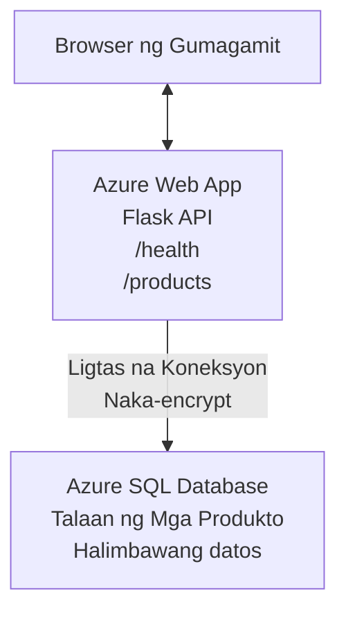

# Deploying a Microsoft SQL Database and Web App with AZD

⏱️ **Tinatayang Oras**: 20-30 minuto | 💰 **Tinatayang Gastos**: ~$15-25/buwan | ⭐ **Kumplikado**: Intermediate

Ang **kumpletong, gumaganang halimbawa** na ito ay nagpapakita kung paano gamitin ang [Azure Developer CLI (azd)](https://learn.microsoft.com/azure/developer/azure-developer-cli/) para i-deploy ang isang Python Flask web application kasama ang isang Microsoft SQL Database sa Azure. Kasama at nasubok ang lahat ng code—walang kailangang panlabas na dependencies.

## Ano ang Matututunan Mo

Sa pagkumpleto ng halimbawang ito, ikaw ay:
- Magde-deploy ng multi-tier na aplikasyon (web app + database) gamit ang infrastructure-as-code
- Magkokonfigura ng ligtas na koneksyon sa database nang hindi ini-hardcode ang mga secret
- Mamomonitor ng kalusugan ng aplikasyon gamit ang Application Insights
- Magmamanage ng mga Azure resources nang mahusay gamit ang AZD CLI
- Susundan ang mga Azure best practices para sa seguridad, pag-optimize ng gastos, at observability

## Pangkalahatang Tanawin ng Senaryo
- **Web App**: Python Flask REST API na may konektividad sa database
- **Database**: Azure SQL Database na may sample na data
- **Infrastructure**: Pinoprovision gamit ang Bicep (modular, reusable templates)
- **Deployment**: Ganap na automated gamit ang `azd` commands
- **Monitoring**: Application Insights para sa logs at telemetry

## Mga Kailangan

### Kinakailangang Mga Tool

Bago magsimula, tiyaking naka-install ang mga tool na ito:

1. **[Azure CLI](https://learn.microsoft.com/cli/azure/install-azure-cli)** (version 2.50.0 o mas mataas)
   ```sh
   az --version
   # Inaasahang output: azure-cli 2.50.0 o mas mataas
   ```

2. **[Azure Developer CLI (azd)](https://learn.microsoft.com/azure/developer/azure-developer-cli/install-azd)** (version 1.0.0 o mas mataas)
   ```sh
   azd version
   # Inaasahang resulta: azd bersyon 1.0.0 o mas mataas
   ```

3. **[Python 3.8+](https://www.python.org/downloads/)** (para sa lokal na development)
   ```sh
   python --version
   # Inaasahang output: Python 3.8 o mas mataas
   ```

4. **[Docker](https://www.docker.com/get-started)** (opsyonal, para sa lokal na containerized development)
   ```sh
   docker --version
   # Inaasahang resulta: Docker bersyon 20.10 o mas mataas
   ```

### Mga Kinakailangan sa Azure

- Isang aktibong **Azure subscription** ([gumawa ng libreng account](https://azure.microsoft.com/free/))
- Mga pahintulot para gumawa ng resources sa iyong subscription
- **Owner** o **Contributor** na role sa subscription o resource group

### Mga Kaalamang Kinakailangan

Ito ay isang **intermediate-level** na halimbawa. Dapat alam mo ang:
- Pangunahing operasyon sa command-line
- Mga pangunahing konsepto sa cloud (resources, resource groups)
- Pangunahing pagkaunawa sa web applications at databases

**Bago sa AZD?** Magsimula muna sa [Getting Started guide](../../docs/chapter-01-foundation/azd-basics.md).

## Arkitektura

Ang halimbawang ito ay nagde-deploy ng two-tier na arkitektura na may web application at SQL database:


**Resource Deployment:**
- **Resource Group**: Lalagyan para sa lahat ng resources
- **App Service Plan**: Linux-based hosting (B1 tier para sa cost efficiency)
- **Web App**: Python 3.11 runtime na may Flask application
- **SQL Server**: Managed database server na may TLS 1.2 minimum
- **SQL Database**: Basic tier (2GB, angkop para sa development/testing)
- **Application Insights**: Monitoring at logging
- **Log Analytics Workspace**: Sentralisadong imbakan ng log

**Analogy**: Isipin ito na parang isang restaurant (web app) na may walk-in freezer (database). Ang mga customer ay umuorder mula sa menu (API endpoints), at ang kusina (Flask app) ay kumukuha ng sangkap (data) mula sa freezer. Ang manager ng restaurant (Application Insights) ay nagta-track ng lahat ng nangyayari.

## Istraktura ng Folder

Kasama ang lahat ng files sa halimbawang ito—walang panlabas na dependencies:

```
examples/database-app/
│
├── README.md                    # This file
├── azure.yaml                   # AZD configuration file
├── .env.sample                  # Sample environment variables
├── .gitignore                   # Git ignore patterns
│
├── infra/                       # Infrastructure as Code (Bicep)
│   ├── main.bicep              # Main orchestration template
│   ├── abbreviations.json      # Azure naming conventions
│   └── resources/              # Modular resource templates
│       ├── sql-server.bicep    # SQL Server configuration
│       ├── sql-database.bicep  # Database configuration
│       ├── app-service-plan.bicep  # Hosting plan
│       ├── app-insights.bicep  # Monitoring setup
│       └── web-app.bicep       # Web application
│
└── src/
    └── web/                    # Application source code
        ├── app.py              # Flask REST API
        ├── requirements.txt    # Python dependencies
        └── Dockerfile          # Container definition
```

**Ano ang Ginagawa ng Bawat File:**
- **azure.yaml**: Sinasabi ng AZD kung ano ang ide-deploy at saan
- **infra/main.bicep**: Nagsasaayos ng lahat ng Azure resources
- **infra/resources/*.bicep**: Indibidwal na mga definition ng resource (modular para magamit muli)
- **src/web/app.py**: Flask application na may database logic
- **requirements.txt**: Mga dependency ng Python package
- **Dockerfile**: Mga tagubilin sa containerization para sa deployment

## Quickstart (Hakbang-hakbang)

### Hakbang 1: I-clone at Pumunta sa Folder

```sh
git clone https://github.com/microsoft/AZD-for-beginners.git
cd AZD-for-beginners/examples/database-app
```

**✓ Success Check**: Tiyaking nakikita mo ang `azure.yaml` at ang folder na `infra/`:
```sh
ls
# Inaasahan: README.md, azure.yaml, infra/, src/
```

### Hakbang 2: Mag-authenticate sa Azure

```sh
azd auth login
```

Magbubukas ito ng iyong browser para sa Azure authentication. Mag-sign in gamit ang iyong Azure credentials.

**✓ Success Check**: Dapat mong makita:
```
Logged in to Azure.
```

### Hakbang 3: I-initialize ang Environment

```sh
azd init
```

**Ano ang nangyayari**: Gumagawa ang AZD ng lokal na configuration para sa iyong deployment.

**Mga prompt na makikita mo**:
- **Environment name**: Mag-enter ng maikling pangalan (hal., `dev`, `myapp`)
- **Azure subscription**: Piliin ang iyong subscription mula sa listahan
- **Azure location**: Pumili ng region (hal., `eastus`, `westeurope`)

**✓ Success Check**: Dapat mong makita:
```
SUCCESS: New project initialized!
```

### Hakbang 4: I-provision ang Azure Resources

```sh
azd provision
```

**Ano ang nangyayari**: Ina-deploy ng AZD ang lahat ng infrastructure (tumitagal ng 5-8 minuto):
1. Gumagawa ng resource group
2. Gumagawa ng SQL Server at Database
3. Gumagawa ng App Service Plan
4. Gumagawa ng Web App
5. Gumagawa ng Application Insights
6. Kinokonpigura ang networking at seguridad

**Tatanungin ka para sa**:
- **SQL admin username**: Mag-enter ng username (hal., `sqladmin`)
- **SQL admin password**: Mag-enter ng malakas na password (i-save ito!)

**✓ Success Check**: Dapat mong makita:
```
SUCCESS: Your application was provisioned in Azure in X minutes Y seconds.
You can view the resources created under the resource group rg-<env-name> in Azure Portal:
https://portal.azure.com/#@/resource/subscriptions/.../resourceGroups/rg-<env-name>
```

**⏱️ Oras**: 5-8 minuto

### Hakbang 5: I-deploy ang Aplikasyon

```sh
azd deploy
```

**Ano ang nangyayari**: Binabuild at dini-deploy ng AZD ang iyong Flask application:
1. Pinapackage ang Python application
2. Binubuo ang Docker container
3. Pinupush sa Azure Web App
4. Ini-initialize ang database na may sample data
5. Sinisimulan ang application

**✓ Success Check**: Dapat mong makita:
```
SUCCESS: Your application was deployed to Azure in X minutes Y seconds.
You can view the resources created under the resource group rg-<env-name> in Azure Portal:
https://portal.azure.com/#@/resource/subscriptions/.../resourceGroups/rg-<env-name>
```

**⏱️ Oras**: 3-5 minuto

### Hakbang 6: I-browse ang Aplikasyon

```sh
azd browse
```

Magbubukas ito ng iyong na-deploy na web app sa browser sa `https://app-<unique-id>.azurewebsites.net`

**✓ Success Check**: Dapat mong makita ang JSON na output:
```json
{
  "message": "Welcome to the Database App API",
  "endpoints": {
    "/": "This help message",
    "/health": "Health check endpoint",
    "/products": "List all products",
    "/products/<id>": "Get product by ID"
  }
}
```

### Hakbang 7: Subukan ang API Endpoints

**Health Check** (suriin ang koneksyon sa database):
```sh
curl https://app-<your-id>.azurewebsites.net/health
```

**Ina-asahang Tugon**:
```json
{
  "status": "healthy",
  "database": "connected"
}
```

**List Products** (sample data):
```sh
curl https://app-<your-id>.azurewebsites.net/products
```

**Ina-asahang Tugon**:
```json
[
  {
    "id": 1,
    "name": "Laptop",
    "description": "High-performance laptop",
    "price": 1299.99,
    "created_at": "2025-11-19T10:30:00"
  },
  ...
]
```

**Get Single Product**:
```sh
curl https://app-<your-id>.azurewebsites.net/products/1
```

**✓ Success Check**: Lahat ng endpoints ay nagbabalik ng JSON na data nang walang error.

---

**🎉 Congrats!** Matagumpay mong na-deploy ang isang web application na may database sa Azure gamit ang AZD.

## Malalimang Pag-configure

### Environment Variables

Ang mga secret ay pinamamahalaan nang ligtas sa pamamagitan ng Azure App Service configuration—**huwag kailanman i-hardcode sa source code**.

**Awtomatikong Kinokonpigura ng AZD**:
- `SQL_CONNECTION_STRING`: Koneksyon sa database na may encrypted credentials
- `APPLICATIONINSIGHTS_CONNECTION_STRING`: Monitoring telemetry endpoint
- `SCM_DO_BUILD_DURING_DEPLOYMENT`: Nagpapagana ng automatic dependency installation

**Saan Iniimbak ang Mga Secret**:
1. Sa `azd provision`, ibibigay mo ang SQL credentials sa pamamagitan ng secure prompts
2. Ini-store ng AZD ang mga ito sa iyong lokal na `.azure/<env-name>/.env` file (git-ignored)
3. Ini-inject ng AZD ang mga ito sa Azure App Service configuration (encrypted at rest)
4. Binabasa ng application ang mga ito via `os.getenv()` sa runtime

### Lokal na Development

Para sa lokal na testing, gumawa ng `.env` file mula sa sample:

```sh
cp .env.sample .env
# I-edit ang .env gamit ang iyong lokal na koneksyon sa database
```

**Lokal na Development Workflow**:
```sh
# I-install ang mga dependency
cd src/web
pip install -r requirements.txt

# Itakda ang mga variable ng kapaligiran
export SQL_CONNECTION_STRING="your-local-connection-string"

# Patakbuhin ang aplikasyon
python app.py
```

**Test lokal**:
```sh
curl http://localhost:8000/health
# Inaasahan: {"status": "healthy", "database": "connected"}
```

### Infrastructure bilang Code

Lahat ng Azure resources ay naka-define sa **Bicep templates** (`infra/` folder):

- **Modular na Disenyo**: Bawat uri ng resource ay may sariling file para magamit muli
- **May mga Parameter**: I-customize ang SKUs, regions, naming conventions
- **Best Practices**: Sumusunod sa Azure naming standards at security defaults
- **Version Controlled**: Ang mga pagbabago sa infrastructure ay nasusubaybayan sa Git

**Halimbawa ng Pag-customize**:
Para palitan ang tier ng database, i-edit ang `infra/resources/sql-database.bicep`:
```bicep
sku: {
  name: 'Standard'  // Changed from 'Basic'
  tier: 'Standard'
  capacity: 10
}
```

## Pinakamahuhusay na Praktis sa Seguridad

Ang halimbawang ito ay sumusunod sa mga Azure security best practices:

### 1. **Walang Secrets sa Source Code**
- ✅ Mga kredensyal na naka-store sa Azure App Service configuration (encrypted)
- ✅ `.env` files ay hindi kasama sa Git via `.gitignore`
- ✅ Mga secret ay ipinapasa via secure parameters sa provisioning

### 2. **Encrypted na mga Koneksyon**
- ✅ TLS 1.2 minimum para sa SQL Server
- ✅ HTTPS-only na ipinapatupad para sa Web App
- ✅ Ang mga koneksyon sa database ay gumagamit ng encrypted channels

### 3. **Seguridad sa Network**
- ✅ SQL Server firewall na naka-configure para payagan ang Azure services lamang
- ✅ Limitado ang public network access (maaari pang higpitan gamit ang Private Endpoints)
- ✅ FTPS ay naka-disable sa Web App

### 4. **Authentication & Authorization**
- ⚠️ **Kasalukuyan**: SQL authentication (username/password)
- ✅ **Rekomendasyon para sa Production**: Gumamit ng Azure Managed Identity para sa passwordless authentication

**Para Mag-upgrade sa Managed Identity** (para sa production):
1. I-enable ang managed identity sa Web App
2. Bigyan ng SQL permissions ang identity
3. I-update ang connection string para gumamit ng managed identity
4. Alisin ang password-based authentication

### 5. **Auditing & Compliance**
- ✅ Application Insights nagla-log ng lahat ng requests at errors
- ✅ SQL Database auditing ay naka-enable (maaaaring i-configure para sa compliance)
- ✅ Lahat ng resources ay may tags para sa governance

**Checklist sa Seguridad Bago Production**:
- [ ] I-enable ang Azure Defender para sa SQL
- [ ] I-configure ang Private Endpoints para sa SQL Database
- [ ] I-enable ang Web Application Firewall (WAF)
- [ ] Ipatupad ang Azure Key Vault para sa rotation ng secrets
- [ ] I-configure ang Azure AD authentication
- [ ] I-enable ang diagnostic logging para sa lahat ng resources

## Pag-optimize ng Gastos

**Tinatayang Buwanang Gastos** (hanggang Nobyembre 2025):

| Resource | SKU/Tier | Estimated Cost |
|----------|----------|----------------|
| App Service Plan | B1 (Basic) | ~$13/month |
| SQL Database | Basic (2GB) | ~$5/month |
| Application Insights | Pay-as-you-go | ~$2/month (low traffic) |
| **Total** | | **~$20/month** |

**💡 Mga Tip para Makabawas sa Gastos**:

1. **Gamitin ang Free Tier para sa Pag-aaral**:
   - App Service: F1 tier (libreng tier, limitadong oras)
   - SQL Database: Gamitin ang Azure SQL Database serverless
   - Application Insights: 5GB/buwan libreng ingestion

2. **I-shutdown ang Mga Resources Kapag Hindi Ginagamit**:
   ```sh
   # Itigil ang web app (patuloy pa ring sisingilin ang database)
   az webapp stop --name <app-name> --resource-group <rg-name>
   
   # I-restart kapag kinakailangan
   az webapp start --name <app-name> --resource-group <rg-name>
   ```

3. **I-delete Lahat Pagkatapos ng Testing**:
   ```sh
   azd down
   ```
   Pinapawi nito ang LAHAT ng resources at humihinto ang mga singil.

4. **Development vs. Production SKUs**:
   - **Development**: Basic tier (ginamit sa halimbawang ito)
   - **Production**: Standard/Premium tier na may redundancy

**Pagmo-monitor ng Gastos**:
- Tingnan ang gastos sa [Azure Cost Management](https://portal.azure.com/#view/Microsoft_Azure_CostManagement)
- Mag-set up ng cost alerts para maiwasan ang sorpresa
- I-tag ang lahat ng resources gamit ang `azd-env-name` para sa pagsubaybay

**Libreng Tier na Alternatibo**:
Para sa layunin ng pagkatuto, maaari mong i-modify ang `infra/resources/app-service-plan.bicep`:
```bicep
sku: {
  name: 'F1'  // Free tier
  tier: 'Free'
}
```
**Tandaan**: Ang free tier ay may mga limitasyon (60 min/day CPU, walang always-on).

## Monitoring at Observability

### Integrasyon ng Application Insights

Kasama sa halimbawang ito ang **Application Insights** para sa komprehensibong monitoring:

**Ano ang Minomonitor**:
- ✅ HTTP requests (latency, status codes, endpoints)
- ✅ Mga error at exceptions ng application
- ✅ Custom logging mula sa Flask app
- ✅ Kalusugan ng koneksyon sa database
- ✅ Performance metrics (CPU, memory)

**Paano I-access ang Application Insights**:
1. Buksan ang [Azure Portal](https://portal.azure.com)
2. Pumunta sa iyong resource group (`rg-<env-name>`)
3. I-click ang Application Insights resource (`appi-<unique-id>`)

**Mga Kapaki-pakinabang na Query** (Application Insights → Logs):

**Tingnan Lahat ng Requests**:
```kusto
requests
| where timestamp > ago(1h)
| order by timestamp desc
| project timestamp, name, url, resultCode, duration
```

**Hanapin ang Mga Error**:
```kusto
exceptions
| where timestamp > ago(24h)
| order by timestamp desc
| project timestamp, type, outerMessage, operation_Name
```

**Suriin ang Health Endpoint**:
```kusto
requests
| where name contains "health"
| summarize count() by resultCode, bin(timestamp, 1h)
```

### Auditing ng SQL Database

**Ang SQL Database auditing ay naka-enable** para subaybayan ang:
- Mga pattern ng access sa database
- Mga nabigong login attempts
- Mga pagbabago sa schema
- Pag-access sa data (para sa compliance)

**Paano I-access ang Audit Logs**:
1. Azure Portal → SQL Database → Auditing
2. Tingnan ang mga log sa Log Analytics workspace

### Real-Time na Monitoring

**Tingnan ang Live Metrics**:
1. Application Insights → Live Metrics
2. Makita ang requests, failures, at performance nang real-time

**Mag-set Up ng Alerts**:
Gumawa ng alerts para sa mga kritikal na kaganapan:
- HTTP 500 errors > 5 sa loob ng 5 minuto
- Mga failure sa koneksyon sa database
- Mataas na response times (>2 segundo)

**Halimbawa ng Paglikha ng Alert**:
```sh
az monitor metrics alert create \
  --name "High-Response-Time" \
  --resource-group <rg-name> \
  --scopes <app-insights-resource-id> \
  --condition "avg requests/duration > 2000" \
  --description "Alert when response time exceeds 2 seconds"
```

## Pag-troubleshoot
### Karaniwang Mga Isyu at Mga Solusyon

#### 1. `azd provision` nabibigo na may "Location not available"

**Sintomas**:
```
Error: The subscription is not registered for the resource type 'components' in the location 'centralus'.
```

**Solusyon**:
Pumili ng ibang Azure rehiyon o irehistro ang resource provider:
```sh
az provider register --namespace Microsoft.Insights
```

#### 2. Nabibigo ang Koneksyon sa SQL Habang Nagde-deploy

**Sintomas**:
```
pyodbc.OperationalError: ('08001', '[08001] [Microsoft][ODBC Driver 18 for SQL Server]TCP Provider...')
```

**Solusyon**:
- Tiyaking pinapayagan ng firewall ng SQL Server ang mga serbisyo ng Azure (ikonpigyur nang awtomatiko)
- Suriin na naipasok nang tama ang SQL admin password habang nagpapatakbo ng `azd provision`
- Tiyaking ganap na na-provision ang SQL Server (maaaring tumagal ng 2-3 minuto)

**Suriin ang Koneksyon**:
```sh
# Mula sa Azure Portal, pumunta sa SQL Database → Query editor
# Subukang kumonekta gamit ang iyong mga kredensyal
```

#### 3. Ipinapakita ng Web App ang "Application Error"

**Sintomas**:
Ipinapakita ng browser ang pangkalahatang pahina ng error.

**Solusyon**:
Suriin ang mga log ng application:
```sh
# Tingnan ang mga kamakailang log
az webapp log tail --name <app-name> --resource-group <rg-name>
```

**Mga karaniwang sanhi**:
- Nawawalang environment variables (suriin App Service → Configuration)
- Nabigo ang pag-install ng Python package (suriin ang deployment logs)
- Error sa pagsisimula ng database (suriin ang koneksyon sa SQL)

#### 4. `azd deploy` nabibigo na may "Build Error"

**Sintomas**:
```
Error: Failed to build project
```

**Solusyon**:
- Tiyaking walang mga error sa syntax ang `requirements.txt`
- Suriin na nakasaad ang Python 3.11 sa `infra/resources/web-app.bicep`
- Tiyaking tama ang base image sa Dockerfile

**Mag-debug nang lokal**:
```sh
cd src/web
docker build -t test-app .
docker run -p 8000:8000 test-app
```

#### 5. "Unauthorized" Kapag Nagpapatakbo ng Mga AZD Command

**Sintomas**:
```
ERROR: (Unauthorized) The client '<id>' with object id '<id>' does not have authorization
```

**Solusyon**:
Muling mag-authenticate sa Azure:
```sh
# Kinakailangan para sa mga AZD workflow
azd auth login

# Opsyonal kung direktang gumagamit ka rin ng mga command ng Azure CLI
az login
```

Suriin na mayroon kang tamang mga permiso (Contributor role) sa subscription.

#### 6. Mataas na Gastos sa Database

**Sintomas**:
Hindi inaasahang singil sa Azure.

**Solusyon**:
- Suriin kung nakalimutan mong patakbuhin ang `azd down` pagkatapos ng testing
- Tiyaking gumagamit ang SQL Database ng Basic tier (hindi Premium)
- Suriin ang mga gastos sa Azure Cost Management
- Mag-set up ng mga alerto para sa gastos

### Pagkuha ng Tulong

**Tingnan ang Lahat ng AZD Environment Variables**:
```sh
azd env get-values
```

**Suriin ang Status ng Deployment**:
```sh
az webapp show --name <app-name> --resource-group <rg-name> --query state
```

**I-access ang Mga Log ng Application**:
```sh
az webapp log download --name <app-name> --resource-group <rg-name> --log-file app-logs.zip
```

**Kailangan ng Karagdagang Tulong?**
- [Gabay sa Pag-troubleshoot ng AZD](../../docs/chapter-07-troubleshooting/common-issues.md)
- [Pag-troubleshoot ng Azure App Service](https://learn.microsoft.com/azure/app-service/troubleshoot-diagnostic-logs)
- [Pag-troubleshoot ng Azure SQL](https://learn.microsoft.com/azure/azure-sql/database/troubleshoot-common-errors-issues)

## Praktikal na Mga Ehersisyo

### Ehersisyo 1: Suriin ang Iyong Deployment (Pang-baguhan)

**Layunin**: Kumpirmahin na lahat ng resources ay na-deploy at gumagana ang application.

**Mga Hakbang**:
1. Ilista ang lahat ng resources sa iyong resource group:
   ```sh
   az resource list --resource-group rg-<env-name> --output table
   ```
   **Inaasahan**: 6-7 resources (Web App, SQL Server, SQL Database, App Service Plan, Application Insights, Log Analytics)

2. Subukan ang lahat ng API endpoints:
   ```sh
   curl https://app-<your-id>.azurewebsites.net/
   curl https://app-<your-id>.azurewebsites.net/health
   curl https://app-<your-id>.azurewebsites.net/products
   curl https://app-<your-id>.azurewebsites.net/products/1
   ```
   **Inaasahan**: Lahat ay nagbabalik ng valid na JSON nang walang error

3. Suriin ang Application Insights:
   - Pumunta sa Application Insights sa Azure Portal
   - Pumunta sa "Live Metrics"
   - I-refresh ang iyong browser sa web app
   **Inaasahan**: Makita ang mga request na lumalabas nang real-time

**Kriterya ng Tagumpay**: Lahat ng 6-7 resources ay umiiral, lahat ng endpoints ay nagbabalik ng data, nagpapakita ng aktibidad ang Live Metrics.

---

### Ehersisyo 2: Magdagdag ng Bagong API Endpoint (Gitnang Antas)

**Layunin**: Palawakin ang Flask application gamit ang isang bagong endpoint.

**Panimulang Code**: Kasalukuyang mga endpoint sa `src/web/app.py`

**Mga Hakbang**:
1. I-edit ang `src/web/app.py` at magdagdag ng bagong endpoint pagkatapos ng `get_product()` function:
   ```python
   @app.route('/products/search/<keyword>')
   def search_products(keyword):
       """Search products by name or description."""
       try:
           conn = get_db_connection()
           cursor = conn.cursor()
           cursor.execute(
               "SELECT id, name, description, price, created_at FROM products WHERE name LIKE ? OR description LIKE ?",
               (f'%{keyword}%', f'%{keyword}%')
           )
           
           products = []
           for row in cursor.fetchall():
               products.append({
                   'id': row[0],
                   'name': row[1],
                   'description': row[2],
                   'price': float(row[3]) if row[3] else None,
                   'created_at': row[4].isoformat() if row[4] else None
               })
           
           cursor.close()
           conn.close()
           
           logger.info(f"Search for '{keyword}' returned {len(products)} results")
           return jsonify(products), 200
           
       except Exception as e:
           logger.error(f"Error searching products: {str(e)}")
           return jsonify({'error': str(e)}), 500
   ```

2. I-deploy ang na-update na application:
   ```sh
   azd deploy
   ```

3. Subukan ang bagong endpoint:
   ```sh
   curl https://app-<your-id>.azurewebsites.net/products/search/laptop
   ```
   **Inaasahan**: Nagbabalik ng mga produkto na tumutugma sa "laptop"

**Kriterya ng Tagumpay**: Gumagana ang bagong endpoint, nagbabalik ng na-filter na resulta, lumilitaw sa mga log ng Application Insights.

---

### Ehersisyo 3: Magdagdag ng Monitoring at mga Alerto (Mataas na Antas)

**Layunin**: Mag-set up ng proaktibong monitoring na may mga alerto.

**Mga Hakbang**:
1. Gumawa ng alerto para sa HTTP 500 errors:
   ```sh
   # Kunin ang resource ID ng Application Insights
   AI_ID=$(az monitor app-insights component show \
     --app appi-<your-id> \
     --resource-group rg-<env-name> \
     --query id -o tsv)
   
   # Lumikha ng alerto
   az monitor metrics alert create \
     --name "High-Error-Rate" \
     --resource-group rg-<env-name> \
     --scopes $AI_ID \
     --condition "count requests/failed > 5" \
     --window-size 5m \
     --evaluation-frequency 1m \
     --description "Alert when >5 failed requests in 5 minutes"
   ```

2. I-trigger ang alerto sa pamamagitan ng paglikha ng mga error:
   ```sh
   # Humiling ng hindi umiiral na produkto
   for i in {1..10}; do curl https://app-<your-id>.azurewebsites.net/products/999; done
   ```

3. Suriin kung nag-fire ang alerto:
   - Azure Portal → Alerts → Alert Rules
   - Suriin ang iyong email (kung naka-configure)

**Kriterya ng Tagumpay**: Nai-create ang alert rule, nagti-trigger sa mga error, natatanggap ang mga notification.

---

### Ehersisyo 4: Mga Pagbabago sa Schema ng Database (Mataas na Antas)

**Layunin**: Magdagdag ng bagong talahanayan at i-modify ang application upang gamitin ito.

**Mga Hakbang**:
1. Kumonekta sa SQL Database gamit ang Azure Portal Query Editor

2. Gumawa ng bagong `categories` table:
   ```sql
   CREATE TABLE categories (
       id INT PRIMARY KEY IDENTITY(1,1),
       name NVARCHAR(50) NOT NULL,
       description NVARCHAR(200)
   );
   
   INSERT INTO categories (name, description) VALUES
   ('Electronics', 'Electronic devices and accessories'),
   ('Office Supplies', 'Office equipment and supplies');
   
   -- Add category to products table
   ALTER TABLE products ADD category_id INT;
   UPDATE products SET category_id = 1; -- Set all to Electronics
   ```

3. I-update ang `src/web/app.py` upang isama ang impormasyon ng category sa mga response

4. I-deploy at subukan

**Kriterya ng Tagumpay**: Umiiral ang bagong table, ipinapakita ng mga produkto ang impormasyon ng category, gumagana pa rin ang application.

---

### Ehersisyo 5: Mag-implement ng Caching (Eksperto)

**Layunin**: Magdagdag ng Azure Redis Cache upang pagandahin ang pagganap.

**Mga Hakbang**:
1. Idagdag ang Redis Cache sa `infra/main.bicep`
2. I-update ang `src/web/app.py` upang i-cache ang mga product query
3. Sukatin ang pagbuti ng pagganap gamit ang Application Insights
4. Ihambing ang oras ng tugon bago/at pagkatapos ng caching

**Kriterya ng Tagumpay**: Na-deploy ang Redis, gumagana ang caching, bumuti ang oras ng tugon ng >50%.

**Tip**: Magsimula sa [Azure Cache for Redis documentation](https://learn.microsoft.com/azure/azure-cache-for-redis/).

---

## Paglilinis

Upang maiwasan ang patuloy na singil, i-delete ang lahat ng resources kapag tapos na:

```sh
azd down
```

**Prompt ng Kumpirmasyon**:
```
? Total resources to delete: 7, are you sure you want to continue? (y/N)
```

I-type ang `y` para kumpirmahin.

**✓ Pag-check ng Tagumpay**: 
- Lahat ng resources ay na-delete mula sa Azure Portal
- Walang patuloy na singil
- Maaaring i-delete ang lokal na `.azure/<env-name>` folder

**Alternatibo** (panatilihin ang infrastructure, i-delete ang data):
```sh
# Tanggalin lamang ang resource group (panatilihin ang AZD config)
az group delete --name rg-<env-name> --yes
```
## Alamin Pa

### Kaugnay na Dokumentasyon
- [Dokumentasyon ng Azure Developer CLI](https://learn.microsoft.com/azure/developer/azure-developer-cli/)
- [Dokumentasyon ng Azure SQL Database](https://learn.microsoft.com/azure/azure-sql/database/)
- [Dokumentasyon ng Azure App Service](https://learn.microsoft.com/azure/app-service/)
- [Dokumentasyon ng Application Insights](https://learn.microsoft.com/azure/azure-monitor/app/app-insights-overview)
- [Sanggunian sa Wika ng Bicep](https://learn.microsoft.com/azure/azure-resource-manager/bicep/)

### Mga Susunod na Hakbang sa Kursong Ito
- **[Halimbawa ng Container Apps](../../../../examples/container-app)**: I-deploy ang microservices gamit ang Azure Container Apps
- **[Gabay sa Integrasyon ng AI](../../../../docs/ai-foundry)**: Magdagdag ng mga kakayahan ng AI sa iyong app
- **[Pinakamahusay na Praktis sa Deployment](../../docs/chapter-04-infrastructure/deployment-guide.md)**: Mga pattern para sa production deployment

### Mga Advanced na Paksa
- **Managed Identity**: Alisin ang mga password at gumamit ng Azure AD awtentikasyon
- **Private Endpoints**: Siguraduhin ang mga koneksyon ng database sa loob ng virtual network
- **CI/CD Integration**: I-automate ang mga deployment gamit ang GitHub Actions o Azure DevOps
- **Multi-Environment**: Mag-set up ng dev, staging, at production environments
- **Database Migrations**: Gumamit ng Alembic o Entity Framework para sa versioning ng schema

### Paghahambing sa Ibang Mga Paraan

**AZD vs. ARM Templates**:
- ✅ AZD: Mas mataas na antas ng abstraksiyon, mas simpleng mga utos
- ⚠️ ARM: Mas detalyado, mas granular na kontrol

**AZD vs. Terraform**:
- ✅ AZD: Azure-native, integrated sa mga serbisyo ng Azure
- ⚠️ Terraform: Suporta para sa multi-cloud, mas malaking ecosystem

**AZD vs. Azure Portal**:
- ✅ AZD: Paulit-ulit, nasa version control, maaaring i-automate
- ⚠️ Portal: Manu-manong pag-click, mahirap i-reproduce

**Isipin ang AZD bilang**: Docker Compose para sa Azure—pinasimpleng configuration para sa kumplikadong deployments.

---

## Madalas na Itanong

**Q: Maaari ba akong gumamit ng ibang programming language?**  
A: Oo! Palitan ang `src/web/` ng Node.js, C#, Go, o anumang wika. I-update ang `azure.yaml` at Bicep nang naaayon.

**Q: Paano ako magdaragdag ng higit pang mga database?**  
A: Magdagdag ng isa pang SQL Database module sa `infra/main.bicep` o gumamit ng PostgreSQL/MySQL mula sa Azure Database services.

**Q: Maaari ko bang gamitin ito para sa production?**  
A: Ito ay panimulang punto. Para sa production, magdagdag ng: managed identity, private endpoints, redundancy, backup strategy, WAF, at pinahusay na monitoring.

**Q: Paano kung gusto kong gumamit ng containers sa halip na code deployment?**  
A: Tingnan ang [Halimbawa ng Container Apps](../../../../examples/container-app) na gumagamit ng Docker containers sa kabuuan.

**Q: Paano ako kumokonekta sa database mula sa aking lokal na makina?**  
A: Idagdag ang iyong IP sa firewall ng SQL Server:
```sh
az sql server firewall-rule create \
  --resource-group rg-<env-name> \
  --server sql-<unique-id> \
  --name AllowMyIP \
  --start-ip-address <your-ip> \
  --end-ip-address <your-ip>
```

**Q: Maaari ba akong gumamit ng umiiral na database sa halip na gumawa ng bago?**  
A: Oo, i-modify ang `infra/main.bicep` upang i-reference ang umiiral na SQL Server at i-update ang mga parameter ng connection string.

---

> **Tandaan:** Ipinapakita ng halimbawa na ito ang mga pinakamahusay na kasanayan para sa pag-deploy ng isang web app na may database gamit ang AZD. Kasama nito ang gumaganang code, kumpletong dokumentasyon, at mga praktikal na ehersisyo upang palalimin ang pagkatuto. Para sa production deployments, suriin ang seguridad, scaling, pagsunod, at mga kinakailangan sa gastos na partikular sa iyong organisasyon.

**📚 Pag-navigate ng Kurso:**
- ← Nakaraan: [Halimbawa ng Container Apps](../../../../examples/container-app)
- → Susunod: [Gabay sa Integrasyon ng AI](../../../../docs/ai-foundry)
- 🏠 [Tahanan ng Kurso](../../README.md)

---

<!-- CO-OP TRANSLATOR DISCLAIMER START -->
**Paunawa**:
Ang dokumentong ito ay isinalin gamit ang serbisyong pagsasalin ng AI na [Co-op Translator](https://github.com/Azure/co-op-translator). Bagaman nagsusumikap kami para sa katumpakan, mangyaring tandaan na ang mga awtomatikong pagsasalin ay maaaring maglaman ng mga pagkakamali o iba pang mga di-tumpak na impormasyon. Ang orihinal na dokumento sa katutubong wika nito ang dapat ituring na pinaka-awtoritatibong sanggunian. Para sa mahahalagang impormasyon, inirerekomenda ang propesyonal na pagsasaling-tao. Hindi kami mananagot para sa anumang hindi pagkakaunawaan o maling interpretasyon na nagmumula sa paggamit ng pagsasaling ito.
<!-- CO-OP TRANSLATOR DISCLAIMER END -->