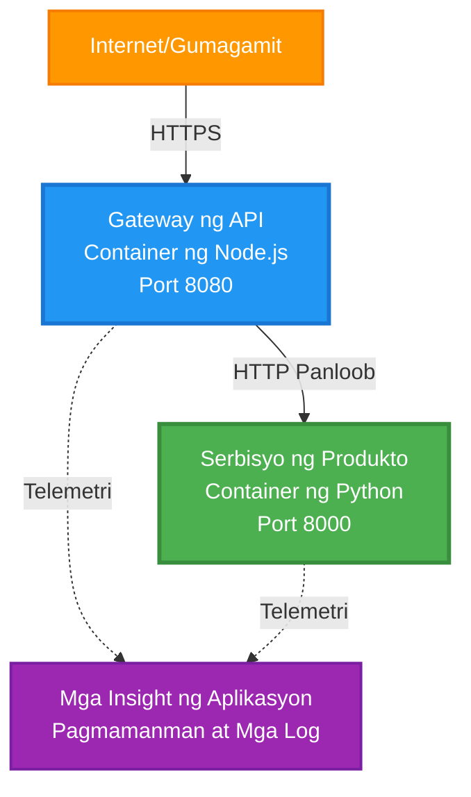
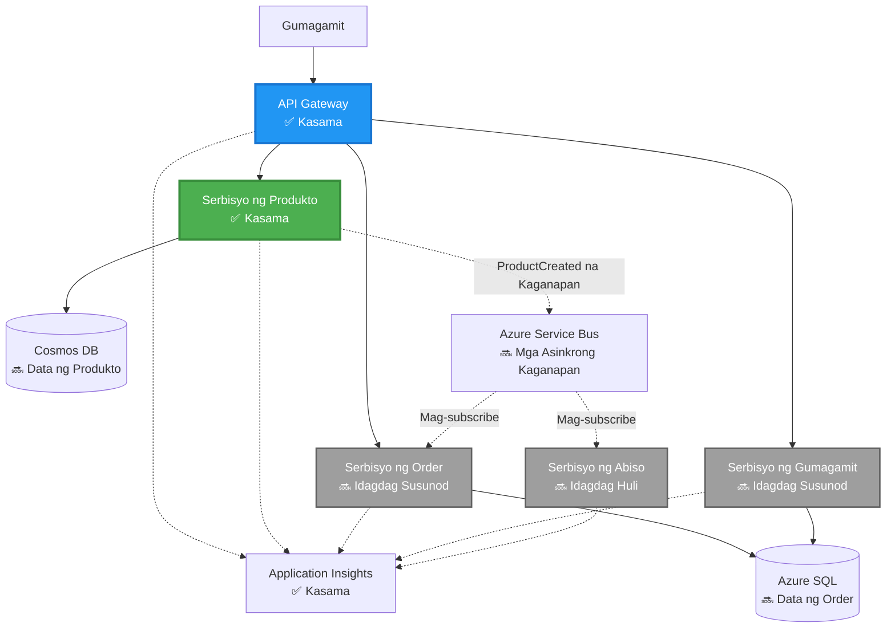
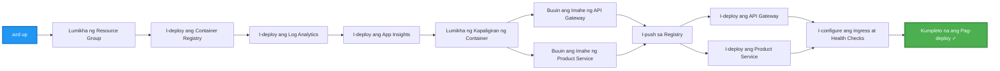
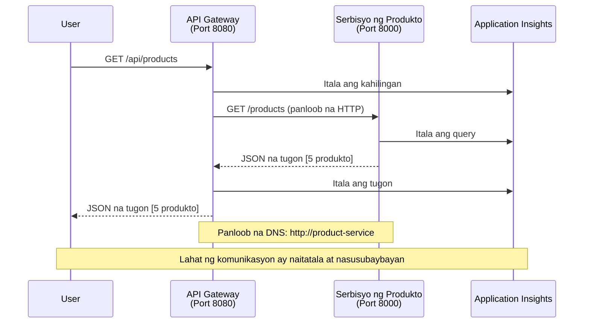

# Arkitektura ng Microservices - Halimbawa ng Container App

⏱️ **Tinatayang Oras**: 25-35 minuto | 💰 **Tinatayang Gastos**: ~$50-100/buwan | ⭐ **Kompleksidad**: Advanced

**📚 Landas ng Pagkatuto:**
- ← Nakaraan: [Simple Flask API](../../../../examples/container-app/simple-flask-api) - Mga batayan ng single container
- 🎯 **Nandito Ka**: Arkitektura ng Microservices (2-service na pundasyon)
- → Sunod: [AI Integration](../../../../docs/ai-foundry) - Magdagdag ng intelihensya sa iyong mga serbisyo
- 🏠 [Course Home](../../README.md)

---

Isang **pinasimple ngunit gumagana** na arkitektura ng microservices na naka-deploy sa Azure Container Apps gamit ang AZD CLI. Ipinapakita ng halimbawang ito ang komunikasyon mula serbisyo-sa-serbisyo, pag-orchestrate ng mga container, at pagmo-monitor gamit ang praktikal na 2-service na setup.

> **📚 Paraan ng Pagkatuto**: Nagsisimula ang halimbawang ito sa minimal na 2-service na arkitektura (API Gateway + Backend Service) na maaari mong i-deploy at pag-aralan. Pagkatapos ma-master ang pundasyong ito, nagbibigay kami ng gabay para palawakin ito sa isang buong microservices ecosystem.

## Ano ang Matututuhan Mo

Sa pagkumpleto ng halimbawang ito, magagawa mong:
- Mag-deploy ng maraming container sa Azure Container Apps
- Magpatupad ng komunikasyon mula serbisyo-sa-serbisyo gamit ang internal networking
- I-configure ang scaling batay sa environment at health checks
- I-monitor ang mga distributed na aplikasyon gamit ang Application Insights
- Maunawaan ang mga pattern sa pag-deploy ng microservices at best practices
- Matutunan ang progresibong pagpapalawak mula simple hanggang kumplikadong arkitektura

## Arkitektura

### Phase 1: Ano ang Binuo Natin (Kasama sa Halimbawang Ito)


```mermaid
graph TB
    Internet[Internet/Gumagamit]
    Gateway[Gateway ng API<br/>Container ng Node.js<br/>Port 8080]
    Product[Serbisyo ng Produkto<br/>Container ng Python<br/>Port 8000]
    AppInsights[Mga Insight ng Aplikasyon<br/>Pagmamanman at Mga Log]
    
    Internet -->|HTTPS| Gateway
    Gateway -->|HTTP Panloob| Product
    Gateway -.->|Telemetri| AppInsights
    Product -.->|Telemetri| AppInsights
    
    style Gateway fill:#2196F3,stroke:#1976D2,stroke-width:3px,color:#fff
    style Product fill:#4CAF50,stroke:#388E3C,stroke-width:3px,color:#fff
    style Internet fill:#FF9800,stroke:#F57C00,stroke-width:2px,color:#fff
    style AppInsights fill:#9C27B0,stroke:#7B1FA2,stroke-width:2px,color:#fff
```
**Detalye ng Komponent:**

| Component | Purpose | Access | Resources |
|-----------|---------|--------|-----------|
| **API Gateway** | Nagro-route ng mga external na request sa mga backend na serbisyo | Public (HTTPS) | 1 vCPU, 2GB RAM, 2-20 replicas |
| **Product Service** | Namamahala ng katalogo ng produkto gamit ang in-memory na data | Internal only | 0.5 vCPU, 1GB RAM, 1-10 replicas |
| **Application Insights** | Sentralisadong pag-log at distributed tracing | Azure Portal | 1-2 GB/month data ingestion |

**Bakit Magsimula sa Simple?**
- ✅ Mabilis na ma-deploy at mauunawaan (25-35 minuto)
- ✅ Matutunan ang mga pangunahing pattern ng microservices nang walang komplikasyon
- ✅ Gumaganang code na maaari mong baguhin at subukan
- ✅ Mas mababang gastos para sa pagkatuto (~$50-100/buwan vs $300-1400/buwan)
- ✅ Maging kumpiyansa bago magdagdag ng mga database at message queues

**Paghahambing**: Isipin ito na parang pagkatuto magmaneho. Nagsisimula ka sa isang walang lamang paradahan (2 serbisyo), pinagyayaman ang mga batayan, saka saka lumilipat sa trapiko sa lungsod (5+ serbisyo na may mga database).

### Phase 2: Hinaharap na Pagpapalawak (Reference Architecture)

Kapag na-master mo ang 2-service na arkitektura, maaari mong palawakin sa:


```mermaid
graph TB
    User[Gumagamit]
    Gateway[API Gateway<br/>✅ Kasama]
    Product[Serbisyo ng Produkto<br/>✅ Kasama]
    Order[Serbisyo ng Order<br/>🔜 Idagdag Susunod]
    UserSvc[Serbisyo ng Gumagamit<br/>🔜 Idagdag Susunod]
    Notify[Serbisyo ng Abiso<br/>🔜 Idagdag Huli]
    
    CosmosDB[(Cosmos DB<br/>🔜 Data ng Produkto)]
    AzureSQL[(Azure SQL<br/>🔜 Data ng Order)]
    ServiceBus[Azure Service Bus<br/>🔜 Mga Asinkrong Kaganapan]
    AppInsights[Application Insights<br/>✅ Kasama]
    
    User --> Gateway
    Gateway --> Product
    Gateway --> Order
    Gateway --> UserSvc
    
    Product --> CosmosDB
    Order --> AzureSQL
    UserSvc --> AzureSQL
    
    Product -.->|ProductCreated na Kaganapan| ServiceBus
    ServiceBus -.->|Mag-subscribe| Notify
    ServiceBus -.->|Mag-subscribe| Order
    
    Gateway -.-> AppInsights
    Product -.-> AppInsights
    Order -.-> AppInsights
    UserSvc -.-> AppInsights
    Notify -.-> AppInsights
    
    style Product fill:#4CAF50,stroke:#388E3C,stroke-width:3px,color:#fff
    style Gateway fill:#2196F3,stroke:#1976D2,stroke-width:3px,color:#fff
    style Order fill:#9E9E9E,stroke:#616161,stroke-width:2px,color:#fff
    style UserSvc fill:#9E9E9E,stroke:#616161,stroke-width:2px,color:#fff
    style Notify fill:#9E9E9E,stroke:#616161,stroke-width:2px,color:#fff
```
Tingnan ang seksyong "Expansion Guide" sa dulo para sa sunud-sunod na mga tagubilin.

## Mga Tampok na Kasama

✅ **Service Discovery**: Awtomatikong DNS-based na pagtuklas sa pagitan ng mga container  
✅ **Load Balancing**: Built-in na load balancing sa mga replica  
✅ **Auto-scaling**: Independent scaling para sa bawat serbisyo batay sa HTTP requests  
✅ **Health Monitoring**: Liveness at readiness probes para sa parehong serbisyo  
✅ **Distributed Logging**: Sentralisadong pag-log gamit ang Application Insights  
✅ **Internal Networking**: Secure na komunikasyon mula serbisyo-sa-serbisyo  
✅ **Container Orchestration**: Awtomatikong pag-deploy at scaling  
✅ **Zero-Downtime Updates**: Rolling updates na may revision management  

## Mga Kinakailangan

### Mga Kailangang Tool

Bago magsimula, siguraduhing naka-install ang mga tool na ito:

1. **[Azure Developer CLI (azd)](https://learn.microsoft.com/azure/developer/azure-developer-cli/install-azd)** (version 1.0.0 o mas mataas)
   ```bash
   azd version
   # Inaasahang output: azd bersyon 1.0.0 o mas mataas
   ```

2. **[Azure CLI](https://learn.microsoft.com/cli/azure/install-azure-cli)** (version 2.50.0 o mas mataas)
   ```bash
   az --version
   # Inaasahang output: azure-cli 2.50.0 o mas mataas
   ```

3. **[Docker](https://www.docker.com/get-started)** (para sa lokal na development/testing - opsyonal)
   ```bash
   docker --version
   # Inaasahang output: Docker bersyon 20.10 o mas bago
   ```

### I-verify ang Iyong Setup

Patakbuhin ang mga utos na ito para kumpirmahin na handa ka na:

```bash
# Suriin ang Azure Developer CLI
azd version
# ✅ Inaasahan: azd bersyon 1.0.0 o mas mataas

# Suriin ang Azure CLI
az --version
# ✅ Inaasahan: azure-cli 2.50.0 o mas mataas

# Suriin ang Docker (opsyonal)
docker --version
# ✅ Inaasahan: Docker bersyon 20.10 o mas mataas
```

**Kriteriya ng Tagumpay**: Lahat ng utos ay magbabalik ng mga version number na katumbas o mas mataas kaysa sa minimum.

### Mga Kinakailangan sa Azure

- Isang aktibong **Azure subscription** ([create a free account](https://azure.microsoft.com/free/))
- Mga permiso para gumawa ng mga resource sa iyong subscription
- **Contributor** role sa subscription o resource group

### Mga Kaalamang Kinakailangan

Ito ay isang **advanced-level** na halimbawa. Dapat mayroon ka ng:
- Nakumpleto ang [Simple Flask API example](../../../../examples/container-app/simple-flask-api) 
- Pangunahing pag-unawa sa arkitektura ng microservices
- Pamilyar sa REST APIs at HTTP
- Pag-unawa sa mga konsepto ng container

**Bago sa Container Apps?** Magsimula muna sa [Simple Flask API example](../../../../examples/container-app/simple-flask-api) upang matutunan ang mga batayan.

## Mabilisang Simula (Sunud-sunod)

### Hakbang 1: I-clone at Mag-navigate

```bash
git clone https://github.com/microsoft/AZD-for-beginners.git
cd AZD-for-beginners/examples/microservices
```

**✓ Pag-check ng Tagumpay**: Kumpirmahing nakikita mo ang `azure.yaml`:
```bash
ls
# Inaasahan: README.md, azure.yaml, infra/, src/
```

### Hakbang 2: Mag-authenticate sa Azure

```bash
azd auth login
```

Magbubukas ito ng iyong browser para sa Azure authentication. Mag-sign in gamit ang iyong Azure credentials.

**✓ Pag-check ng Tagumpay**: Dapat mong makita:
```
Logged in to Azure.
```

### Hakbang 3: I-initialize ang Environment

```bash
azd init
```

**Mga prompt na makikita mo**:
- **Environment name**: Maglagay ng maikling pangalan (hal., `microservices-dev`)
- **Azure subscription**: Piliin ang iyong subscription
- **Azure location**: Piliin ang rehiyon (hal., `eastus`, `westeurope`)

**✓ Pag-check ng Tagumpay**: Dapat mong makita:
```
SUCCESS: New project initialized!
```

### Hakbang 4: I-deploy ang Infrastructure at Mga Serbisyo

```bash
azd up
```

**Ano ang nangyayari** (tumagal ng 8-12 minuto):


```mermaid
graph LR
    A[azd up] --> B[Lumikha ng Resource Group]
    B --> C[I-deploy ang Container Registry]
    C --> D[I-deploy ang Log Analytics]
    D --> E[I-deploy ang App Insights]
    E --> F[Lumikha ng Kapaligiran ng Container]
    F --> G[Buuin ang Imahe ng API Gateway]
    F --> H[Buuin ang Imahe ng Product Service]
    G --> I[I-push sa Registry]
    H --> I
    I --> J[I-deploy ang API Gateway]
    I --> K[I-deploy ang Product Service]
    J --> L[I-configure ang Ingress at Health Checks]
    K --> L
    L --> M[Kumpleto na ang Pag-deploy ✓]
    
    style A fill:#2196F3,stroke:#1976D2,stroke-width:3px,color:#fff
    style M fill:#4CAF50,stroke:#388E3C,stroke-width:3px,color:#fff
```
**✓ Pag-check ng Tagumpay**: Dapat mong makita:
```
SUCCESS: Your application was deployed to Azure in X minutes Y seconds.
Endpoint: https://api-gateway-<unique-id>.azurecontainerapps.io
```

**⏱️ Oras**: 8-12 minuto

### Hakbang 5: Subukan ang Deployment

```bash
# Kunin ang endpoint ng gateway
GATEWAY_URL=$(azd env get-values | grep API_GATEWAY_URL | cut -d '=' -f2 | tr -d '"')

# Subukan ang kalusugan ng API Gateway
curl $GATEWAY_URL/health
```

**✅ Inaasahang output:**
```json
{
  "status": "healthy",
  "service": "api-gateway",
  "timestamp": "2025-11-19T10:30:00Z"
}
```

**Subukin ang product service sa pamamagitan ng gateway**:
```bash
# Ilista ang mga produkto
curl $GATEWAY_URL/api/products
```

**✅ Inaasahang output:**
```json
[
  {"id":1,"name":"Laptop","price":999.99,"stock":50},
  {"id":2,"name":"Mouse","price":29.99,"stock":200},
  {"id":3,"name":"Keyboard","price":79.99,"stock":150}
]
```

**✓ Pag-check ng Tagumpay**: Ang parehong endpoints ay magbabalik ng JSON na data nang walang mga error.

---

**🎉 Binabati kita!** Na-deploy mo na ang isang arkitektura ng microservices sa Azure!

## Estruktura ng Proyekto

Kasama ang lahat ng mga implementation file—kompletong gumaganang halimbawa ito:

```
microservices/
│
├── README.md                         # This file
├── azure.yaml                        # AZD configuration
├── .gitignore                        # Git ignore patterns
│
├── infra/                           # Infrastructure as Code (Bicep)
│   ├── main.bicep                   # Main orchestration
│   ├── abbreviations.json           # Naming conventions
│   ├── core/                        # Shared infrastructure
│   │   ├── container-apps-environment.bicep  # Container environment + registry
│   │   └── monitor.bicep            # Application Insights + Log Analytics
│   └── app/                         # Service definitions
│       ├── api-gateway.bicep        # API Gateway container app
│       └── product-service.bicep    # Product Service container app
│
└── src/                             # Application source code
    ├── api-gateway/                 # Node.js API Gateway
    │   ├── app.js                   # Express server with routing
    │   ├── package.json             # Node dependencies
    │   └── Dockerfile               # Container definition
    └── product-service/             # Python Product Service
        ├── main.py                  # Flask API with product data
        ├── requirements.txt         # Python dependencies
        └── Dockerfile               # Container definition
```

**Ano ang Ginagawa ng Bawat Komponent:**

**Infrastructure (infra/)**:
- `main.bicep`: Ina-orchestrate ang lahat ng Azure resources at ang kanilang mga dependency
- `core/container-apps-environment.bicep`: Lumilikha ng Container Apps environment at Azure Container Registry
- `core/monitor.bicep`: Nagse-set up ng Application Insights para sa distributed logging
- `app/*.bicep`: Indibidwal na mga definition ng container app na may scaling at health checks

**API Gateway (src/api-gateway/)**:
- Serbisyong nakaharap sa publiko na nagro-route ng mga request sa mga backend na serbisyo
- Nagpapatupad ng pag-log, error handling, at pag-forward ng request
- Ipinapakita ang HTTP na komunikasyon mula serbisyo-sa-serbisyo

**Product Service (src/product-service/)**:
- Internal na serbisyo na may katalogo ng produkto (in-memory para sa pagiging simple)
- REST API na may health checks
- Halimbawa ng backend microservice pattern

## Pangkalahatang-ideya ng Mga Serbisyo

### API Gateway (Node.js/Express)

**Port**: 8080  
**Access**: Public (external ingress)  
**Layunin**: Ina-route ang papasok na mga request sa angkop na backend na mga serbisyo  

**Endpoints**:
- `GET /` - Service information
- `GET /health` - Health check endpoint
- `GET /api/products` - Forward to product service (list all)
- `GET /api/products/:id` - Forward to product service (get by ID)

**Pangunahing Mga Tampok**:
- Request routing gamit ang axios
- Sentralisadong pag-log
- Error handling at timeout management
- Service discovery sa pamamagitan ng environment variables
- Integrasyon ng Application Insights

**Pinakatampok na Code** (`src/api-gateway/app.js`):
```javascript
// Panloob na komunikasyon ng serbisyo
app.get('/api/products', async (req, res) => {
  const response = await axios.get(`${PRODUCT_SERVICE_URL}/products`, {
    timeout: 5000
  });
  res.json(response.data);
});
```

### Product Service (Python/Flask)

**Port**: 8000  
**Access**: Internal only (no external ingress)  
**Layunin**: Namamahala ng katalogo ng produkto gamit ang in-memory na data  

**Endpoints**:
- `GET /` - Service information
- `GET /health` - Health check endpoint
- `GET /products` - List all products
- `GET /products/<id>` - Get product by ID

**Pangunahing Mga Tampok**:
- RESTful API gamit ang Flask
- In-memory product store (simple, walang kailangan na database)
- Health monitoring gamit ang probes
- Structured logging
- Integrasyon ng Application Insights

**Data Model**:
```python
{
  "id": 1,
  "name": "Laptop",
  "description": "High-performance laptop",
  "price": 999.99,
  "stock": 50
}
```

**Bakit Internal Lamang?**
Ang product service ay hindi nakalantad sa publiko. Lahat ng request ay dapat dumaan sa API Gateway, na nagbibigay ng:
- Seguridad: Kontroladong entry point
- Kakayahang umangkop: Maaaring baguhin ang backend nang hindi naaapektuhan ang mga client
- Pagmo-monitor: Sentralisadong pag-log ng mga request

## Pag-unawa sa Komunikasyon ng Serbisyo

### Paano Nag-uusap ang Mga Serbisyo


```mermaid
sequenceDiagram
    participant User
    participant Gateway as API Gateway<br/>(Port 8080)
    participant Product as Serbisyo ng Produkto<br/>(Port 8000)
    participant AI as Application Insights
    
    User->>Gateway: GET /api/products
    Gateway->>AI: Itala ang kahilingan
    Gateway->>Product: GET /products (panloob na HTTP)
    Product->>AI: Itala ang query
    Product-->>Gateway: JSON na tugon [5 produkto]
    Gateway->>AI: Itala ang tugon
    Gateway-->>User: JSON na tugon [5 produkto]
    
    Note over Gateway,Product: Panloob na DNS: http://product-service
    Note over User,AI: Lahat ng komunikasyon ay naitatala at nasusubaybayan
```
Sa halimbawang ito, nakikipagkomunika ang API Gateway sa Product Service gamit ang **internal HTTP calls**:

```javascript
// Gateway ng API (src/api-gateway/app.js)
const PRODUCT_SERVICE_URL = process.env.PRODUCT_SERVICE_URL;

// Gumawa ng panloob na HTTP na kahilingan
const response = await axios.get(`${PRODUCT_SERVICE_URL}/products`);
```

**Pangunahing Punto**:

1. **DNS-Based Discovery**: Awtomatikong nagbibigay ang Container Apps ng DNS para sa mga internal na serbisyo
   - Product Service FQDN: `product-service.internal.<environment>.azurecontainerapps.io`
   - Pinapasimple bilang: `http://product-service` (ni-reresolve ito ng Container Apps)

2. **Walang Pampublikong Paglalantad**: Ang Product Service ay may `external: false` sa Bicep
   - Maa-access lamang sa loob ng Container Apps environment
   - Hindi maaabot mula sa internet

3. **Environment Variables**: Ang mga URL ng serbisyo ay ini-inject sa oras ng deployment
   - Ipinapasa ng Bicep ang internal FQDN sa gateway
   - Walang hardcoded na mga URL sa application code

**Paghahambing**: Isipin ito na parang mga silid opisina. Ang API Gateway ang receptionist desk (nakaharap sa publiko), at ang Product Service ay isang silid opisina (internal lang). Ang mga bisita ay kailangang dumaan sa reception para marating ang anumang opisina.

## Mga Opsyon sa Deployment

### Buong Deployment (Inirerekomenda)

```bash
# I-deploy ang imprastruktura at ang parehong mga serbisyo
azd up
```

I-de-deploy nito:
1. Container Apps environment
2. Application Insights
3. Container Registry
4. API Gateway container
5. Product Service container

**Oras**: 8-12 minuto

### I-deploy ang Indibidwal na Serbisyo

```bash
# I-deploy lamang ang isang serbisyo (pagkatapos ng paunang azd up)
azd deploy api-gateway

# O i-deploy ang serbisyo ng produkto
azd deploy product-service
```

**Gamit**: Kapag na-update mo ang code sa isang serbisyo at nais mong i-redeploy lamang ang serbisyong iyon.

### I-update ang Konfigurasyon

```bash
# Baguhin ang mga parameter ng pag-scale
azd env set GATEWAY_MAX_REPLICAS 30

# I-deploy muli gamit ang bagong konfigurasyon
azd up
```

## Konfigurasyon

### Scaling Configuration

Ang parehong serbisyo ay naka-configure gamit ang HTTP-based autoscaling sa kanilang mga Bicep file:

**API Gateway**:
- Min replicas: 2 (laging hindi bababa sa 2 para sa availability)
- Max replicas: 20
- Scale trigger: 50 concurrent requests bawat replica

**Product Service**:
- Min replicas: 1 (maaaaring mag-scale to zero kung kinakailangan)
- Max replicas: 10
- Scale trigger: 100 concurrent requests bawat replica

**I-customize ang Scaling** (sa `infra/app/*.bicep`):
```bicep
scale: {
  minReplicas: 1
  maxReplicas: 10
  rules: [
    {
      name: 'http-scale-rule'
      http: {
        metadata: {
          concurrentRequests: '100'  // Adjust this
        }
      }
    }
  ]
}
```

### Alokasyon ng Resource

**API Gateway**:
- CPU: 1.0 vCPU
- Memory: 2 GiB
- Dahilan: Humahawak ng lahat ng external na trapiko

**Product Service**:
- CPU: 0.5 vCPU
- Memory: 1 GiB
- Dahilan: Magaan na in-memory na operasyon

### Health Checks

Ang parehong serbisyo ay may liveness at readiness probes:

```bicep
probes: [
  {
    type: 'Liveness'
    httpGet: {
      path: '/health'
      port: 8080
    }
    initialDelaySeconds: 10
    periodSeconds: 30
  }
  {
    type: 'Readiness'
    httpGet: {
      path: '/health'
      port: 8080
    }
    initialDelaySeconds: 5
    periodSeconds: 10
  }
]
```

**Ano ang Kahulugan Nito**:
- **Liveness**: Kung mabigo ang health check, nire-restart ng Container Apps ang container
- **Readiness**: Kung hindi pa ready, ititigil ng Container Apps ang pag-route ng trapiko sa replica na iyon

## Monitoring & Observability

### Tingnan ang Mga Log ng Serbisyo

```bash
# Tingnan ang mga log gamit ang azd monitor
azd monitor --logs

# O gamitin ang Azure CLI para sa tiyak na Container Apps:
# I-stream ang mga log mula sa API Gateway
az containerapp logs show --name api-gateway --resource-group $RG_NAME --follow

# Tingnan ang mga kamakailang log ng serbisyo ng produkto
az containerapp logs show --name product-service --resource-group $RG_NAME --tail 100
```

**Inaasahang Output**:
```
[api-gateway] API Gateway listening on port 8080
[api-gateway] Product Service URL: http://product-service
[api-gateway] GET /api/products 200 - 45ms
[product-service] Retrieved 5 products
```

### Mga Query sa Application Insights

Buksan ang Application Insights sa Azure Portal, pagkatapos patakbuhin ang mga query na ito:

**Hanapin ang Mabagal na Requests**:
```kusto
requests
| where timestamp > ago(1h)
| where duration > 1000  // Requests taking >1 second
| summarize count() by name, cloud_RoleName
| order by count_ desc
```

**Subaybayan ang Mga Tawag mula Serbisyo-sa-Serbisyo**:
```kusto
dependencies
| where timestamp > ago(1h)
| where type == "Http"
| project timestamp, name, target, duration, success
| order by timestamp desc
```

**Rate ng Error ayon sa Serbisyo**:
```kusto
exceptions
| where timestamp > ago(24h)
| summarize errorCount = count() by cloud_RoleName, type
| order by errorCount desc
```

**Dami ng Request sa Paglipas ng Oras**:
```kusto
requests
| where timestamp > ago(1h)
| summarize requestCount = count() by bin(timestamp, 5m), cloud_RoleName
| render timechart
```

### I-access ang Monitoring Dashboard

```bash
# Kunin ang mga detalye ng Application Insights
azd env get-values | grep APPLICATIONINSIGHTS

# Buksan ang monitoring sa Azure Portal
az monitor app-insights component show \
  --app $(azd env get-values | grep APPLICATIONINSIGHTS_CONNECTION_STRING | cut -d '=' -f2) \
  --resource-group $(azd env get-values | grep AZURE_RESOURCE_GROUP | cut -d '=' -f2) \
  --query "appId" -o tsv
```

### Live Metrics

1. Pumunta sa Application Insights sa Azure Portal
2. I-click ang "Live Metrics"
3. Makita ang real-time na mga request, pagkabigo, at performance
4. Subukan sa pamamagitan ng pagpapatakbo: `curl $(azd env get-values | grep API_GATEWAY_URL | cut -d '=' -f2 | tr -d '"')/api/products`

## Praktikal na Ehersisyo

### Ehersisyo 1: Magdagdag ng Bagong Product Endpoint ⭐ (Madali)

**Layunin**: Magdagdag ng POST endpoint para lumikha ng mga bagong produkto

**Panimulang Punto**: `src/product-service/main.py`

**Mga Hakbang**:

1. Idagdag ang endpoint na ito pagkatapos ng `get_product` function sa `main.py`:

```python
@app.route('/products', methods=['POST'])
def create_product():
    """Create a new product"""
    data = request.get_json()
    
    # Suriin ang mga kinakailangang patlang
    if not data or 'name' not in data or 'price' not in data:
        return jsonify({'error': 'Missing required fields: name, price'}), 400
    
    new_id = max(p['id'] for p in products) + 1
    new_product = {
        'id': new_id,
        'name': data['name'],
        'description': data.get('description', ''),
        'price': float(data['price']),
        'stock': int(data.get('stock', 0))
    }
    products.append(new_product)
    logger.info(f"Created product {new_id}")
    return jsonify(new_product), 201
```

2. Idagdag ang POST route sa API Gateway (`src/api-gateway/app.js`):

```javascript
// Idagdag ito pagkatapos ng ruta na GET /api/products
app.post('/api/products', async (req, res) => {
  try {
    console.log(`Forwarding POST request to ${PRODUCT_SERVICE_URL}/products`);
    const response = await axios.post(`${PRODUCT_SERVICE_URL}/products`, req.body, {
      timeout: 5000
    });
    res.status(201).json(response.data);
  } catch (error) {
    console.error('Error calling product service:', error.message);
    res.status(503).json({
      error: 'Product service unavailable',
      message: error.message
    });
  }
});
```

3. I-redeploy ang parehong serbisyo:

```bash
azd deploy product-service
azd deploy api-gateway
```

4. Subukan ang bagong endpoint:

```bash
GATEWAY_URL=$(azd env get-values | grep API_GATEWAY_URL | cut -d '=' -f2 | tr -d '"')

# Lumikha ng bagong produkto
curl -X POST $GATEWAY_URL/api/products \
  -H "Content-Type: application/json" \
  -d '{"name":"USB Cable","price":9.99,"stock":500}'
```

**✅ Inaasahang output:**
```json
{"id":6,"name":"USB Cable","description":"","price":9.99,"stock":500}
```

5. Suriin na lumilitaw ito sa listahan:

```bash
curl $GATEWAY_URL/api/products
# Dapat ngayon ay magpapakita ng 6 na produkto, kabilang ang bagong USB cable
```

**Kriteria ng Tagumpay**:
- ✅ Ang POST na request ay bumabalik ng HTTP 201
- ✅ Lumilitaw ang bagong produkto sa GET /api/products na listahan
- ✅ Ang produkto ay may auto-incremented na ID

**Oras**: 10-15 minuto

---

### Ehersisyo 2: Baguhin ang Mga Patakaran ng Autoscaling ⭐⭐ (Katamtaman)

**Layunin**: Baguhin ang Product Service upang mag-scale nang mas agresibo

**Panimulang Punto**: `infra/app/product-service.bicep`

**Mga Hakbang**:

1. Buksan ang `infra/app/product-service.bicep` at hanapin ang `scale` block (mga nasa linya 95)

2. Palitan mula sa:
```bicep
scale: {
  minReplicas: 1
  maxReplicas: 10
  rules: [
    {
      name: 'http-scale-rule'
      http: {
        metadata: {
          concurrentRequests: '100'  // OLD
        }
      }
    }
  ]
}
```

Sa:
```bicep
scale: {
  minReplicas: 2  // Always have 2 running
  maxReplicas: 20  // Allow more scaling
  rules: [
    {
      name: 'http-scale-rule'
      http: {
        metadata: {
          concurrentRequests: '20'  // Scale at lower threshold
        }
      }
    }
  ]
}
```

3. I-redeploy ang imprastraktura:

```bash
azd up
```

4. Patunayan ang bagong scaling configuration:

```bash
az containerapp show \
  --name $(azd env get-values | grep PRODUCT_SERVICE | head -1 | cut -d '/' -f5) \
  --resource-group $(azd env get-values | grep AZURE_RESOURCE_GROUP | cut -d '=' -f2 | tr -d '"') \
  --query "properties.template.scale" -o json
```

**✅ Inaasahang output:**
```json
{
  "minReplicas": 2,
  "maxReplicas": 20,
  "rules": [...]
}
```

5. Subukan ang autoscaling gamit ang load:

```bash
# Gumawa ng sabayang mga kahilingan
for i in {1..500}; do curl $GATEWAY_URL/api/products & done

# Panoorin ang pag-scale gamit ang Azure CLI
az containerapp logs show --name product-service --resource-group $RG_NAME --follow
# Hanapin: mga kaganapan sa pag-scale ng Container Apps
```

**Kriteria ng Tagumpay**:
- ✅ Laging tumatakbo ang Product Service ng hindi bababa sa 2 replicas
- ✅ Sa ilalim ng load, nag-scale nang higit sa 2 replicas
- ✅ Ipinapakita ng Azure Portal ang bagong scaling rules

**Oras**: 15-20 minuto

---

### Ehersisyo 3: Magdagdag ng Pasadyang Monitoring Query ⭐⭐ (Katamtaman)

**Layunin**: Gumawa ng pasadyang Application Insights query para subaybayan ang performance ng Product API

**Mga Hakbang**:

1. Pumunta sa Application Insights sa Azure Portal:
   - Pumunta sa Azure Portal
   - Hanapin ang iyong resource group (rg-microservices-*)
   - I-click ang Application Insights resource

2. I-click ang "Logs" sa kaliwang menu

3. Gumawa ng query na ito:

```kusto
requests
| where timestamp > ago(1h)
| where name contains "products"
| summarize 
    RequestCount = count(),
    AvgDuration = avg(duration),
    P95Duration = percentile(duration, 95),
    SuccessRate = 100.0 * countif(success == true) / count()
  by bin(timestamp, 5m)
| render timechart
```

4. I-click ang "Run" upang patakbuhin ang query

5. I-save ang query:
   - I-click ang "Save"
   - Pangalan: "Product API Performance"
   - Kategorya: "Performance"

6. Gumawa ng test traffic:

```bash
for i in {1..100}; do curl $GATEWAY_URL/api/products; sleep 1; done
```

7. I-refresh ang query upang makita ang data

**✅ Inaasahang output:**
- Tsart na nagpapakita ng bilang ng mga request sa paglipas ng panahon
- Karaniwang tagal < 500ms
- Rate ng tagumpay = 100%
- Mga time bin na 5 minuto

**Kriteria ng Tagumpay**:
- ✅ Ipinapakita ng query ang 100+ na request
- ✅ Ang rate ng tagumpay ay 100%
- ✅ Karaniwang tagal < 500ms
- ✅ Ipinapakita ng tsart ang 5-minutong time bins

**Kinalabasan ng Pagkatuto**: Maunawaan kung paano subaybayan ang performance ng serbisyo gamit ang pasadyang mga query

**Oras**: 10-15 minuto

---

### Ehersisyo 4: Ipatupad ang Retry Logic ⭐⭐⭐ (Mataas na Antas)

**Layunin**: Idagdag ang retry logic sa API Gateway kapag pansamantala na hindi available ang Product Service

**Panimulang Punto**: `src/api-gateway/app.js`

**Mga Hakbang**:

1. I-install ang retry library:

```bash
cd src/api-gateway
npm install axios-retry --save
cd ../..
```

2. I-update ang `src/api-gateway/app.js` (idagdag pagkatapos ng axios import):

```javascript
const axiosRetry = require('axios-retry');

// I-configure ang lohika ng pag-uulit
axiosRetry(axios, {
  retries: 3,
  retryDelay: (retryCount) => {
    return retryCount * 1000; // 1s, 2s, 3s
  },
  retryCondition: (error) => {
    // Muling subukan kapag may mga error sa network o mga 5xx na tugon
    return axiosRetry.isNetworkOrIdempotentRequestError(error) ||
           (error.response && error.response.status >= 500);
  }
});

console.log('Retry logic configured: 3 retries with exponential backoff');
```

3. I-redeploy ang API Gateway:

```bash
azd deploy api-gateway
```

4. Subukan ang retry behavior sa pamamagitan ng pagsasagawa ng simulated service failure:

```bash
# I-scale ang product service sa 0 (gayahin ang pagkabigo)
az containerapp update \
  --name $(azd env get-values | grep PRODUCT_SERVICE | head -1 | cut -d '/' -f5) \
  --resource-group $(azd env get-values | grep AZURE_RESOURCE_GROUP | cut -d '=' -f2 | tr -d '"') \
  --min-replicas 0 \
  --max-replicas 0

# Subukang i-access ang mga produkto (magtatangkang muli ng 3 beses)
time curl -v $GATEWAY_URL/api/products
# Obserbahan: Tumatagal ang tugon ng humigit-kumulang 6 segundo (1s + 2s + 3s na mga pagtatangka)

# Ibalik ang product service
az containerapp update \
  --name $(azd env get-values | grep PRODUCT_SERVICE | head -1 | cut -d '/' -f5) \
  --resource-group $(azd env get-values | grep AZURE_RESOURCE_GROUP | cut -d '=' -f2 | tr -d '"') \
  --min-replicas 1 \
  --max-replicas 10
```

5. Tingnan ang retry logs:

```bash
az containerapp logs show --name api-gateway --resource-group $RG_NAME --tail 50
# Hanapin: Mga mensahe ng muling pagtatangka
```

**✅ Inaasahang pag-uugali:**
- Ang mga request ay nirere-try nang 3 beses bago mag-fail
- Bawat retry ay naghihintay nang mas mahaba (1s, 2s, 3s)
- Nagiging matagumpay ang mga request pagkatapos mag-restart ang serbisyo
- Ipinapakita ng mga log ang mga pagtatangka ng retry

**Kriteria ng Tagumpay**:
- ✅ Ang mga request ay nirere-try nang 3 beses bago mag-fail
- ✅ Bawat retry ay naghihintay nang mas mahaba (exponential backoff)
- ✅ Nagiging matagumpay ang mga request pagkatapos mag-restart ang serbisyo
- ✅ Ipinapakita ng mga log ang mga pagtatangka ng retry

**Kinalabasan ng Pagkatuto**: Maunawaan ang mga pattern ng resilience sa microservices (circuit breakers, retries, timeouts)

**Oras**: 20-25 minuto

---

## Pagsusuri ng Kaalaman

Pagkatapos makumpleto ang halimbawang ito, patunayan ang iyong pagkaunawa:

### 1. Komunikasyon ng Serbisyo ✓

Subukan ang iyong kaalaman:
- [ ] Masasabi mo ba kung paano natutuklasan ng API Gateway ang Product Service? (DNS-based service discovery)
- [ ] Ano ang nangyayari kung naka-down ang Product Service? (Gateway returns 503 error)
- [ ] Paano ka magdadagdag ng pangatlong serbisyo? (Gumawa ng bagong Bicep file, idagdag sa main.bicep, gumawa ng src folder)

**Praktikal na Pagpapatunay:**
```bash
# I-simulate ang pagkabigo ng serbisyo
az containerapp update --name <product-service-name> --min-replicas 0 --max-replicas 0
curl $GATEWAY_URL/api/products
# ✅ Inaasahan: 503 Serbisyo Hindi Magagamit

# Ibalik ang serbisyo
az containerapp update --name <product-service-name> --min-replicas 1 --max-replicas 10
```

### 2. Monitoring at Observability ✓

Subukan ang iyong kaalaman:
- [ ] Saan mo nakikita ang distributed logs? (Application Insights in Azure Portal)
- [ ] Paano mo sinusubaybayan ang mabagal na mga request? (Kusto query: `requests | where duration > 1000`)
- [ ] Maasahan mo bang tukuyin kung aling serbisyo ang nagdulot ng error? (Suriin ang `cloud_RoleName` field sa logs)

**Praktikal na Pagpapatunay:**
```bash
# Gumawa ng simulasyon ng mabagal na kahilingan
curl "$GATEWAY_URL/api/products?delay=2000"

# I-query ang Application Insights para sa mga mabagal na kahilingan
# Pumunta sa Azure Portal → Application Insights → Logs
# Patakbuhin: requests | where duration > 1000 | project timestamp, name, duration, cloud_RoleName
```

### 3. Scaling at Performance ✓

Subukan ang iyong kaalaman:
- [ ] Ano ang nagti-trigger ng autoscaling? (HTTP concurrent request rules: 50 para sa gateway, 100 para sa product)
- [ ] Ilang replicas ang tumatakbo ngayon? (Suriin gamit ang `az containerapp revision list`)
- [ ] Paano mo isi-scale ang Product Service sa 5 replicas? (I-update ang minReplicas sa Bicep)

**Praktikal na Pagpapatunay:**
```bash
# Lumikha ng load para subukan ang autoscaling
for i in {1..1000}; do curl $GATEWAY_URL/api/products & done

# Panoorin ang pagdami ng mga replika gamit ang Azure CLI
az containerapp logs show --name api-gateway --resource-group $RG_NAME --follow
# ✅ Inaasahan: Makita ang mga kaganapan ng pag-scale sa mga log
```

**Kriteria ng Tagumpay**: Masasagot mo ang lahat ng mga tanong at mapapatunayan gamit ang mga hands-on na utos.

---

## Pagsusuri ng Gastos

### Tinatayang Buwanang Gastos (Para sa Halimbawang 2-Serbisyo na Ito)

| Resource | Konfigurasyon | Tinatayang Gastos |
|----------|--------------|-------------------|
| API Gateway | 2-20 replicas, 1 vCPU, 2GB RAM | $30-150 |
| Product Service | 1-10 replicas, 0.5 vCPU, 1GB RAM | $15-75 |
| Container Registry | Basic tier | $5 |
| Application Insights | 1-2 GB/month | $5-10 |
| Log Analytics | 1 GB/month | $3 |
| **Kabuuan** | | **$58-243/buwan** |

### Paghahati ng Gastos ayon sa Paggamit

**Magaan na trapiko** (testing/pag-aaral): ~$60/buwan
- API Gateway: 2 replicas × 24/7 = $30
- Product Service: 1 replica × 24/7 = $15
- Monitoring + Registry = $13

**Katamtamang trapiko** (maliit na production): ~$120/buwan
- API Gateway: 5 avg replicas = $75
- Product Service: 3 avg replicas = $45
- Monitoring + Registry = $13

**Mataas na trapiko** (mga abalang panahon): ~$240/buwan
- API Gateway: 15 avg replicas = $225
- Product Service: 8 avg replicas = $120
- Monitoring + Registry = $13

### Mga Tip sa Pag-optimize ng Gastos

1. **I-scale sa Zero para sa Development**:
   ```bicep
   scale: {
     minReplicas: 0  // Save $30-40/month when not in use
     maxReplicas: 10
   }
   ```

2. **Gumamit ng Consumption Plan para sa Cosmos DB** (kapag dinagdag mo ito):
   - Magbayad lamang para sa ginagamit mo
   - Walang minimum na singil

3. **Itakda ang Application Insights Sampling**:
   ```javascript
   appInsights.defaultClient.config.samplingPercentage = 50; // Kumuha ng sample mula sa 50% ng mga request
   ```

4. **Linisin Kapag Hindi Kailangan**:
   ```bash
   azd down --force --purge
   ```

### Mga Opsyon ng Libreng Tier

Para sa pag-aaral/testing, isaalang-alang:
- ✅ Gumamit ng Azure free credits ($200 para sa unang 30 araw para sa mga bagong account)
- ✅ Manatili sa minimum na replicas (nakakatipid ng ~50% na gastos)
- ✅ I-delete pagkatapos ng testing (walang patuloy na singil)
- ✅ I-scale sa zero sa pagitan ng mga sesyon ng pagkatuto

**Halimbawa**: Pagpapatakbo ng halimbawang ito ng 2 oras/araw × 30 araw = ~$5/buwan sa halip na $60/buwan

---

## Mabilis na Sanggunian sa Pag-troubleshoot

### Problema: `azd up` nabibigo na may "Subscription not found"

**Solusyon**:
```bash
# Mag-log in muli gamit ang tahasang subskripsyon
az account set --subscription <your-subscription-id>
azd env set AZURE_SUBSCRIPTION_ID <your-subscription-id>
azd up
```

### Problema: API Gateway nagbabalik ng 503 "Product service unavailable"

**Diagnose**:
```bash
# Suriin ang mga log ng serbisyo ng produkto gamit ang Azure CLI
az containerapp logs show --name product-service --resource-group $RG_NAME --tail 50

# Suriin ang kalusugan ng serbisyo ng produkto
az containerapp show \
  --name $(azd env get-values | grep PRODUCT_SERVICE | head -1 | cut -d '/' -f5) \
  --resource-group $(azd env get-values | grep AZURE_RESOURCE_GROUP | cut -d '=' -f2 | tr -d '"') \
  --query "properties.runningStatus"
```

**Mga Karaniwang Sanhi**:
1. Hindi nag-start ang Product service (suriin ang mga log para sa mga error sa Python)
2. Nabibigo ang health check (patunayan na gumagana ang `/health` endpoint)
3. Nabigo ang pag-build ng container image (suriin ang registry para sa image)

### Problema: Hindi gumagana ang Autoscaling

**Diagnose**:
```bash
# Suriin ang kasalukuyang bilang ng mga replika
az containerapp revision list \
  --name $(azd env get-values | grep API_GATEWAY | head -1 | cut -d '/' -f5) \
  --resource-group $(azd env get-values | grep AZURE_RESOURCE_GROUP | cut -d '=' -f2 | tr -d '"') \
  --query "[].properties.replicas"

# Gumawa ng load para subukan
for i in {1..1000}; do curl $GATEWAY_URL/api/products & done

# Subaybayan ang mga kaganapan sa pag-scale gamit ang Azure CLI
az containerapp logs show --name api-gateway --resource-group $RG_NAME --follow | grep -i scale
```

**Mga Karaniwang Sanhi**:
1. Hindi sapat ang load para mag-trigger ng scale rule (kailangan >50 concurrent requests)
2. Naabot na ang max replicas (suriin ang Bicep configuration)
3. Maling pagkakakonfigura ng scale rule sa Bicep (patunayan ang concurrentRequests value)

### Problema: Application Insights hindi nagpapakita ng mga log

**Diagnose**:
```bash
# Suriin kung nakatakda ang string ng koneksyon
azd env get-values | grep APPLICATIONINSIGHTS

# Suriin kung nagpapadala ang mga serbisyo ng telemetry
az monitor app-insights component show \
  --app $(azd env get-values | grep APPLICATIONINSIGHTS_NAME | cut -d '=' -f2 | tr -d '"') \
  --resource-group $(azd env get-values | grep AZURE_RESOURCE_GROUP | cut -d '=' -f2 | tr -d '"') \
  --query "properties.InstrumentationKey"
```

**Mga Karaniwang Sanhi**:
1. Hindi naipasa ang connection string sa container (suriin ang environment variables)
2. Hindi naka-configure ang Application Insights SDK (suriin ang imports sa code)
3. Firewall na humaharang sa telemetry (bihira, suriin ang network rules)

### Problema: Nabibigo ang Docker build lokal

**Diagnose**:
```bash
# Subukan ang build ng API Gateway
cd src/api-gateway
docker build -t test-gateway .

# Subukan ang build ng Product Service
cd ../product-service
docker build -t test-product .
```

**Mga Karaniwang Sanhi**:
1. Nawawalang dependencies sa package.json/requirements.txt
2. Mga syntax error sa Dockerfile
3. Mga isyu sa network kapag dinownload ang dependencies

**Hindi pa rin malutas?** Tingnan ang [Common Issues Guide](../../docs/chapter-07-troubleshooting/common-issues.md) o [Azure Container Apps Troubleshooting](https://learn.microsoft.com/azure/container-apps/troubleshooting)

---

## Paglilinis

Upang maiwasan ang patuloy na singil, i-delete ang lahat ng resources:

```bash
azd down --force --purge
```

**Prompt ng Kumpirmasyon**:
```
? Total resources to delete: 6, are you sure you want to continue? (y/N)
```

I-type ang `y` para kumpirmahin.

**Ano ang Made-delete**:
- Kapaligiran ng Container Apps
- Parehong Container Apps (gateway at product service)
- Container Registry
- Application Insights
- Log Analytics Workspace
- Resource Group

**✓ Patunayan ang Paglilinis**:
```bash
az group list --query "[?starts_with(name,'rg-microservices')]" --output table
```

Dapat magbalik ng walang laman.

---

## Gabay sa Pagpapalawak: Mula 2 hanggang 5+ Serbisyo

Kapag na-master mo na ang 2-serbisyo na arkitektura, narito kung paano magpalawak:

### Phase 1: Magdagdag ng Persistence ng Database (Susunod na Hakbang)

**Magdagdag ng Cosmos DB para sa Product Service**:

1. Gumawa ng `infra/core/cosmos.bicep`:
   ```bicep
   resource cosmosAccount 'Microsoft.DocumentDB/databaseAccounts@2023-04-15' = {
     name: name
     location: location
     kind: 'GlobalDocumentDB'
     properties: {
       databaseAccountOfferType: 'Standard'
       consistencyPolicy: { defaultConsistencyLevel: 'Session' }
       locations: [{ locationName: location, failoverPriority: 0 }]
     }
   }
   ```

2. I-update ang product service para gumamit ng Azure Cosmos DB Python SDK sa halip na in-memory data

3. Tinatayang karagdagang gastos: ~$25/buwan (serverless)

### Phase 2: Magdagdag ng Pangatlong Serbisyo (Order Management)

**Gumawa ng Order Service**:

1. Bagong folder: `src/order-service/` (Python/Node.js/C#)
2. Bagong Bicep: `infra/app/order-service.bicep`
3. I-update ang API Gateway upang mag-route ng `/api/orders`
4. Magdagdag ng Azure SQL Database para sa persistence ng order

**Nagiging arkitektura**:
```
API Gateway → Product Service (Cosmos DB)
           → Order Service (Azure SQL)
```

### Phase 3: Magdagdag ng Async Communication (Service Bus)

**Ipapatupad ang Event-Driven Architecture**:

1. Magdagdag ng Azure Service Bus: `infra/core/servicebus.bicep`
2. Naglalathala ang Product Service ng "ProductCreated" events
3. Ang Order Service ay nag-subscribe sa mga product events
4. Magdagdag ng Notification Service para iproseso ang mga events

**Pattern**: Request/Response (HTTP) + Event-Driven (Service Bus)

### Phase 4: Magdagdag ng User Authentication

**Ipapatupad ang User Service**:

1. Gumawa ng `src/user-service/` (Go/Node.js)
2. Magdagdag ng Azure AD B2C o custom na JWT authentication
3. Vavalidate ng API Gateway ang mga token bago mag-route
4. Tinitingnan ng mga serbisyo ang mga permiso ng user

### Phase 5: Kahandaan para sa Produksyon

**Magdagdag ng Mga Komponenteng Ito**:
- ✅ Azure Front Door (global load balancing)
- ✅ Azure Key Vault (pamamahala ng mga lihim)
- ✅ Azure Monitor Workbooks (pasadyang dashboards)
- ✅ CI/CD Pipeline (GitHub Actions)
- ✅ Blue-Green Deployments
- ✅ Managed Identity para sa lahat ng serbisyo

**Tunay na Gastos ng Buong Produksyon na Arkitektura**: ~$300-1,400/buwan

---

## Matuto Pa

### Kaugnay na Dokumentasyon
- [Dokumentasyon ng Azure Container Apps](https://learn.microsoft.com/azure/container-apps/)
- [Gabayan sa Arkitekturang Microservices](https://learn.microsoft.com/azure/architecture/guide/architecture-styles/microservices)
- [Application Insights para sa Distributed Tracing](https://learn.microsoft.com/azure/azure-monitor/app/distributed-tracing)
- [Azure Developer CLI Dokumentasyon](https://learn.microsoft.com/azure/developer/azure-developer-cli/)

### Susunod na Mga Hakbang sa Kurso na Ito
- ← Nakaraan: [Simple Flask API](../../../../examples/container-app/simple-flask-api) - Paunang halimbawa ng isang container
- → Susunod: [AI Integration Guide](../../../../docs/ai-foundry) - Magdagdag ng kakayahan ng AI
- 🏠 [Bahay ng Kurso](../../README.md)

### Paghahambing: Kailan Gamitin ang Bawat Isa

| Tampok | Isang Container | Microservices (Ito) | Kubernetes (AKS) |
|---------|-----------------|---------------------|------------------|
| **Gamit** | Mga simpleng app | Mga komplikadong app | Mga enterprise na app |
| **Scalability** | Isang serbisyo | Pag-scale kada serbisyo | Pinakamataas na flexibility |
| **Kompleksidad** | Mababa | Katamtaman | Mataas |
| **Laki ng Koponan** | 1-3 developers | 3-10 developers | 10+ developers |
| **Gastos** | ~$15-50/buwan | ~$60-250/buwan | ~$150-500/buwan |
| **Oras ng Pag-deploy** | 5-10 minuto | 8-12 minuto | 15-30 minuto |
| **Pinakamainam Para sa** | MVPs, mga prototype | Mga production na app | Maramihang cloud, advanced na networking |

**Rekomendasyon**: Magsimula sa Container Apps (ang halimbawang ito), lumipat sa AKS kapag kailangan mo ng mga tampok na partikular sa Kubernetes.

---

## Mga Madalas Itanong

**Q: Bakit dalawang serbisyo lang imbes na 5+?**  
A: Panimulang aralin. Masterin ang mga pundasyon (komunikasyon ng serbisyo, pagmamanman, scaling) gamit ang isang simpleng halimbawa bago magdagdag ng komplikasyon. Ang mga pattern na matututunan mo rito ay naaangkop sa 100-service na arkitektura.

**Q: Maaari ba akong magdagdag ng higit pang mga serbisyo nang mag-isa?**  
A: Oo naman! Sundin ang expansion guide sa itaas. Ang bawat bagong serbisyo ay sumusunod sa parehong pattern: gumawa ng src folder, gumawa ng Bicep file, i-update ang azure.yaml, i-deploy.

**Q: Ready ba ito para sa production?**  
A: Ito ay isang matibay na pundasyon. Para sa production, magdagdag ng: managed identity, Key Vault, persistent na mga database, CI/CD pipeline, mga alerto sa pagmamanman, at strategy para sa backup.

**Q: Bakit hindi gumamit ng Dapr o ibang service mesh?**  
A: Panatilihin itong simple para sa pagkatuto. Kapag naunawaan mo na ang native na networking ng Container Apps, maaari mong i-layer ang Dapr para sa mga advanced na senaryo (state management, pub/sub, bindings).

**Q: Paano ako mag-debug nang lokal?**  
A: Patakbuhin ang mga serbisyo nang lokal gamit ang Docker:
```bash
cd src/api-gateway
docker build -t local-gateway .
docker run -p 8080:8080 -e PRODUCT_SERVICE_URL=http://localhost:8000 local-gateway
```

**Q: Maaari ba akong gumamit ng iba’t ibang programming languages?**  
A: Oo! Ipinapakita ng halimbawang ito ang Node.js (gateway) + Python (product service). Maaari mong paghaluin ang anumang mga language na tumatakbo sa loob ng mga container: C#, Go, Java, Ruby, PHP, atbp.

**Q: Ano kung wala akong Azure credits?**  
A: Gamitin ang Azure free tier (unang 30 araw para sa bagong account ay may $200 credits) o i-deploy para sa maiikling testing period at i-delete agad. Ang halimbawang ito ay nagkakahalaga ng humigit-kumulang $2/day.

**Q: Paano ito naiiba mula sa Azure Kubernetes Service (AKS)?**  
A: Mas simple ang Container Apps (hindi kailangan ng kaalaman sa Kubernetes) ngunit mas kaunti ang flexibility. Ang AKS ay nagbibigay ng buong kontrol ng Kubernetes ngunit nangangailangan ng mas maraming kadalubhasaan. Magsimula sa Container Apps, mag-graduate sa AKS kung kinakailangan.

**Q: Maaari ko bang gamitin ito sa umiiral na mga Azure services?**  
A: Oo! Maaari kang kumonekta sa umiiral na mga database, storage accounts, Service Bus, atbp. I-update ang mga Bicep file para i-reference ang umiiral na mga resource sa halip na gumawa ng bago.

---

> **🎓 Buod ng Landas ng Pagkatuto**: Natutunan mong i-deploy ang multi-service na arkitektura na may automatic scaling, internal networking, sentralisadong pagmamanman, at mga pattern na handa para sa production. Inihahanda ka ng pundasyong ito para sa mga kumplikadong distributed systems at enterprise microservices architectures.

**📚 Pag-navigate sa Kurso:**
- ← Previous: [Simple Flask API](../../../../examples/container-app/simple-flask-api)
- → Next: [Database Integration Example](../../../../database-app)
- 🏠 [Tahanan ng Kurso](../../README.md)
- 📖 [Mga Pinakamahuhusay na Gawi para sa Container Apps](../../docs/chapter-04-infrastructure/deployment-guide.md)

---

**✨ Binabati kita!** Nakumpleto mo na ang halimbawa ng microservices. Naiintindihan mo na kung paano bumuo, mag-deploy, at mag-monitor ng mga distributed na aplikasyon sa Azure Container Apps. Handa ka na bang magdagdag ng AI na kakayahan? Tingnan ang [Gabay sa Integrasyon ng AI](../../../../docs/ai-foundry)!

---

<!-- CO-OP TRANSLATOR DISCLAIMER START -->
Paunawa:
Isinalin ang dokumentong ito gamit ang serbisyong AI na pagsasalin [Co-op Translator](https://github.com/Azure/co-op-translator). Bagaman sinisikap naming maging tumpak, pakitandaan na ang mga awtomatikong pagsasalin ay maaaring maglaman ng mga pagkakamali o hindi eksaktong impormasyon. Ang orihinal na dokumento sa orihinal nitong wika ang dapat ituring na pangunahing sanggunian. Para sa mahalagang impormasyon, inirerekomenda ang propesyonal na pagsasaling-tao. Hindi kami mananagot sa anumang hindi pagkakaunawaan o maling interpretasyon na nagmumula sa paggamit ng pagsasaling ito.
<!-- CO-OP TRANSLATOR DISCLAIMER END -->