# Arkitektura ng Microservices - Halimbawa ng Container App

⏱️ **Tinatayang Oras**: 25-35 minuto | 💰 **Tinatayang Gastos**: ~$50-100/buwan | ⭐ **Kumplikado**: Advanced

**📚 Landas ng Pag-aaral:**
- ← Nakaraan: [Simple Flask API](../../../../examples/container-app/simple-flask-api) - Mga pangunahing kaalaman sa single container
- 🎯 **Narito Ka**: Arkitektura ng Microservices (2-service foundation)
- → Susunod: [AI Integration](../../../../docs/ai-foundry) - Magdagdag ng katalinuhan sa iyong mga serbisyo
- 🏠 [Pangunahing Kurso](../../README.md)

---

Isang **pinadali ngunit gumaganang** arkitektura ng microservices na na-deploy sa Azure Container Apps gamit ang AZD CLI. Ang halimbawang ito ay nagpapakita ng komunikasyon sa pagitan ng mga serbisyo, container orchestration, at monitoring gamit ang praktikal na 2-service setup.

> **📚 Paraan ng Pag-aaral**: Ang halimbawang ito ay nagsisimula sa isang minimal na 2-service architecture (API Gateway + Backend Service) na maaari mong i-deploy at matutunan. Pagkatapos maunawaan ang pundasyong ito, nagbibigay kami ng gabay para sa pagpapalawak patungo sa isang buong ecosystem ng microservices.

## Ano ang Iyong Matututuhan

Sa pagtatapos ng halimbawang ito, matututuhan mo:
- Mag-deploy ng maraming container sa Azure Container Apps
- Magpatupad ng komunikasyon sa pagitan ng mga serbisyo gamit ang internal networking
- Mag-configure ng environment-based scaling at health checks
- Mag-monitor ng distributed applications gamit ang Application Insights
- Maunawaan ang mga pattern at pinakamahusay na kasanayan sa pag-deploy ng microservices
- Matutunan ang progresibong pagpapalawak mula sa simple patungo sa mas kumplikadong arkitektura

## Arkitektura

### Phase 1: Ano ang Ating Itatayo (Kasama sa Halimbawang Ito)


**Mga Detalye ng Komponent:**

| Komponent | Layunin | Access | Mga Resources |
|-----------|---------|--------|---------------|
| **API Gateway** | Nagre-route ng mga external na request sa backend services | Pampubliko (HTTPS) | 1 vCPU, 2GB RAM, 2-20 replicas |
| **Product Service** | Pinamamahalaan ang product catalog gamit ang in-memory data | Internal lamang | 0.5 vCPU, 1GB RAM, 1-10 replicas |
| **Application Insights** | Sentralisadong logging at distributed tracing | Azure Portal | 1-2 GB/buwan data ingestion |

**Bakit Magsimula sa Simple?**
- ✅ Mabilis na ma-deploy at maunawaan (25-35 minuto)
- ✅ Matutunan ang mga pangunahing pattern ng microservices nang walang komplikasyon
- ✅ Gumaganang code na maaari mong baguhin at subukan
- ✅ Mas mababang gastos para sa pag-aaral (~$50-100/buwan kumpara sa $300-1400/buwan)
- ✅ Magkaroon ng kumpiyansa bago magdagdag ng databases at message queues

**Analohiya**: Isipin ito na parang pag-aaral magmaneho. Nagsisimula ka sa isang bakanteng parking lot (2 serbisyo), matutunan ang mga pangunahing kaalaman, pagkatapos ay magprogreso sa trapiko sa lungsod (5+ serbisyo na may databases).

### Phase 2: Hinaharap na Pagpapalawak (Reference Architecture)

Kapag na-master mo na ang 2-service architecture, maaari kang magpalawak sa:

```mermaid
graph TB
    User[Gumagamit]
    Gateway[API Gateway<br/>✅ Kasama]
    Product[Serbisyo ng Produkto<br/>✅ Kasama]
    Order[Serbisyo ng Order<br/>🔜 Idagdag Susunod]
    UserSvc[Serbisyo ng Gumagamit<br/>🔜 Idagdag Susunod]
    Notify[Serbisyo ng Notipikasyon<br/>🔜 Idagdag Huli]
    
    CosmosDB[(Cosmos DB<br/>🔜 Datos ng Produkto)]
    AzureSQL[(Azure SQL<br/>🔜 Datos ng Order)]
    ServiceBus[Azure Service Bus<br/>🔜 Async na Mga Kaganapan]
    AppInsights[Application Insights<br/>✅ Kasama]
    
    User --> Gateway
    Gateway --> Product
    Gateway --> Order
    Gateway --> UserSvc
    
    Product --> CosmosDB
    Order --> AzureSQL
    UserSvc --> AzureSQL
    
    Product -.->|Kaganapan ng ProductCreated| ServiceBus
    ServiceBus -.->|Mag-subscribe| Notify
    ServiceBus -.->|Mag-subscribe| Order
    
    Gateway -.-> AppInsights
    Product -.-> AppInsights
    Order -.-> AppInsights
    UserSvc -.-> AppInsights
    Notify -.-> AppInsights
    
    style Product fill:#4CAF50,stroke:#388E3C,stroke-width:3px,color:#fff
    style Gateway fill:#2196F3,stroke:#1976D2,stroke-width:3px,color:#fff
    style Order fill:#9E9E9E,stroke:#616161,stroke-width:2px,color:#fff
    style UserSvc fill:#9E9E9E,stroke:#616161,stroke-width:2px,color:#fff
    style Notify fill:#9E9E9E,stroke:#616161,stroke-width:2px,color:#fff
```


Tingnan ang seksyong "Expansion Guide" sa dulo para sa mga hakbang-hakbang na tagubilin.

## Mga Kasamang Tampok

✅ **Service Discovery**: Awtomatikong DNS-based discovery sa pagitan ng mga container  
✅ **Load Balancing**: Built-in load balancing sa mga replicas  
✅ **Auto-scaling**: Independent scaling per service batay sa HTTP requests  
✅ **Health Monitoring**: Liveness at readiness probes para sa parehong serbisyo  
✅ **Distributed Logging**: Sentralisadong logging gamit ang Application Insights  
✅ **Internal Networking**: Secure na komunikasyon sa pagitan ng mga serbisyo  
✅ **Container Orchestration**: Awtomatikong pag-deploy at scaling  
✅ **Zero-Downtime Updates**: Rolling updates na may revision management  

## Mga Kinakailangan

### Mga Kinakailangang Tool

Bago magsimula, tiyaking naka-install ang mga sumusunod na tool:

1. **[Azure Developer CLI (azd)](https://learn.microsoft.com/azure/developer/azure-developer-cli/install-azd)** (bersyon 1.0.0 o mas mataas)
   ```bash
   azd version
   # Inaasahang output: azd bersyon 1.0.0 o mas mataas
   ```

2. **[Azure CLI](https://learn.microsoft.com/cli/azure/install-azure-cli)** (bersyon 2.50.0 o mas mataas)
   ```bash
   az --version
   # Inaasahang output: azure-cli 2.50.0 o mas mataas
   ```

3. **[Docker](https://www.docker.com/get-started)** (para sa lokal na pag-develop/pagsubok - opsyonal)
   ```bash
   docker --version
   # Inaasahang output: Docker bersyon 20.10 o mas mataas
   ```

### I-verify ang Iyong Setup

Patakbuhin ang mga command na ito upang tiyaking handa ka na:

```bash
# Suriin ang Azure Developer CLI
azd version
# ✅ Inaasahan: azd bersyon 1.0.0 o mas mataas

# Suriin ang Azure CLI
az --version
# ✅ Inaasahan: azure-cli 2.50.0 o mas mataas

# Suriin ang Docker (opsyonal)
docker --version
# ✅ Inaasahan: Docker bersyon 20.10 o mas mataas
```

**Kriteriya ng Tagumpay**: Ang lahat ng command ay nagbabalik ng mga bersyon na tumutugma o mas mataas sa minimum.

### Mga Kinakailangan sa Azure

- Isang aktibong **Azure subscription** ([gumawa ng libreng account](https://azure.microsoft.com/free/))
- Mga pahintulot upang lumikha ng mga resources sa iyong subscription
- **Contributor** role sa subscription o resource group

### Mga Kinakailangang Kaalaman

Ito ay isang **advanced-level** na halimbawa. Dapat ay mayroon kang:
- Natapos ang [Simple Flask API example](../../../../examples/container-app/simple-flask-api) 
- Pangunahing kaalaman sa arkitektura ng microservices
- Pamilyar sa REST APIs at HTTP
- Pag-unawa sa mga konsepto ng container

**Baguhan sa Container Apps?** Magsimula sa [Simple Flask API example](../../../../examples/container-app/simple-flask-api) upang matutunan ang mga pangunahing kaalaman.

## Mabilis na Pagsisimula (Hakbang-hakbang)

### Hakbang 1: I-clone at Mag-navigate

```bash
git clone https://github.com/microsoft/AZD-for-beginners.git
cd AZD-for-beginners/examples/microservices
```

**✓ Pagsusuri ng Tagumpay**: Tiyaking makikita mo ang `azure.yaml`:
```bash
ls
# Inaasahan: README.md, azure.yaml, infra/, src/
```

### Hakbang 2: Mag-authenticate sa Azure

```bash
azd auth login
```

Bubuksan nito ang iyong browser para sa Azure authentication. Mag-sign in gamit ang iyong Azure credentials.

**✓ Pagsusuri ng Tagumpay**: Dapat mong makita:
```
Logged in to Azure.
```

### Hakbang 3: I-initialize ang Environment

```bash
azd init
```

**Mga Prompt na Makikita Mo**:
- **Pangalan ng Environment**: Maglagay ng maikling pangalan (hal., `microservices-dev`)
- **Azure subscription**: Piliin ang iyong subscription
- **Azure location**: Pumili ng rehiyon (hal., `eastus`, `westeurope`)

**✓ Pagsusuri ng Tagumpay**: Dapat mong makita:
```
SUCCESS: New project initialized!
```

### Hakbang 4: I-deploy ang Infrastructure at Mga Serbisyo

```bash
azd up
```

**Ano ang Nangyayari** (tumatagal ng 8-12 minuto):


**✓ Pagsusuri ng Tagumpay**: Dapat mong makita:
```
SUCCESS: Your application was deployed to Azure in X minutes Y seconds.
Endpoint: https://api-gateway-<unique-id>.azurecontainerapps.io
```

**⏱️ Oras**: 8-12 minuto

### Hakbang 5: Subukan ang Deployment

```bash
# Kunin ang endpoint ng gateway
GATEWAY_URL=$(azd env get-values | grep API_GATEWAY_URL | cut -d '=' -f2 | tr -d '"')

# Subukan ang kalusugan ng API Gateway
curl $GATEWAY_URL/health
```

**✅ Inaasahang Output**:
```json
{
  "status": "healthy",
  "service": "api-gateway",
  "timestamp": "2025-11-19T10:30:00Z"
}
```

**Subukan ang product service sa pamamagitan ng gateway**:
```bash
# Listahan ng mga produkto
curl $GATEWAY_URL/api/products
```

**✅ Inaasahang Output**:
```json
[
  {"id":1,"name":"Laptop","price":999.99,"stock":50},
  {"id":2,"name":"Mouse","price":29.99,"stock":200},
  {"id":3,"name":"Keyboard","price":79.99,"stock":150}
]
```

**✓ Pagsusuri ng Tagumpay**: Ang parehong endpoints ay nagbabalik ng JSON data nang walang error.

---

**🎉 Binabati kita!** Na-deploy mo na ang isang arkitektura ng microservices sa Azure!

## Istruktura ng Proyekto

Kasama ang lahat ng mga file ng implementasyon—ito ay isang kumpleto at gumaganang halimbawa:

```
microservices/
│
├── README.md                         # This file
├── azure.yaml                        # AZD configuration
├── .gitignore                        # Git ignore patterns
│
├── infra/                           # Infrastructure as Code (Bicep)
│   ├── main.bicep                   # Main orchestration
│   ├── abbreviations.json           # Naming conventions
│   ├── core/                        # Shared infrastructure
│   │   ├── container-apps-environment.bicep  # Container environment + registry
│   │   └── monitor.bicep            # Application Insights + Log Analytics
│   └── app/                         # Service definitions
│       ├── api-gateway.bicep        # API Gateway container app
│       └── product-service.bicep    # Product Service container app
│
└── src/                             # Application source code
    ├── api-gateway/                 # Node.js API Gateway
    │   ├── app.js                   # Express server with routing
    │   ├── package.json             # Node dependencies
    │   └── Dockerfile               # Container definition
    └── product-service/             # Python Product Service
        ├── main.py                  # Flask API with product data
        ├── requirements.txt         # Python dependencies
        └── Dockerfile               # Container definition
```

**Ano ang Ginagawa ng Bawat Komponent:**

**Infrastructure (infra/)**:
- `main.bicep`: Nag-oorganisa ng lahat ng Azure resources at kanilang dependencies
- `core/container-apps-environment.bicep`: Lumilikha ng Container Apps environment at Azure Container Registry
- `core/monitor.bicep`: Nagse-set up ng Application Insights para sa distributed logging
- `app/*.bicep`: Mga indibidwal na container app definition na may scaling at health checks

**API Gateway (src/api-gateway/)**:
- Pampublikong serbisyo na nagre-route ng mga request sa backend services
- Nagpapatupad ng logging, error handling, at request forwarding
- Nagpapakita ng service-to-service HTTP communication

**Product Service (src/product-service/)**:
- Internal na serbisyo na may product catalog (in-memory para sa pagiging simple)
- REST API na may health checks
- Halimbawa ng backend microservice pattern

## Pangkalahatang-ideya ng Mga Serbisyo

### API Gateway (Node.js/Express)

**Port**: 8080  
**Access**: Pampubliko (external ingress)  
**Layunin**: Nagre-route ng mga papasok na request sa tamang backend services  

**Endpoints**:
- `GET /` - Impormasyon ng serbisyo
- `GET /health` - Health check endpoint
- `GET /api/products` - I-forward sa product service (listahan ng lahat)
- `GET /api/products/:id` - I-forward sa product service (kuha batay sa ID)

**Pangunahing Tampok**:
- Request routing gamit ang axios
- Sentralisadong logging
- Error handling at timeout management
- Service discovery gamit ang environment variables
- Application Insights integration

**Highlight ng Code** (`src/api-gateway/app.js`):
```javascript
// Komunikasyon ng panloob na serbisyo
app.get('/api/products', async (req, res) => {
  const response = await axios.get(`${PRODUCT_SERVICE_URL}/products`, {
    timeout: 5000
  });
  res.json(response.data);
});
```

### Product Service (Python/Flask)

**Port**: 8000  
**Access**: Internal lamang (walang external ingress)  
**Layunin**: Pinamamahalaan ang product catalog gamit ang in-memory data  

**Endpoints**:
- `GET /` - Impormasyon ng serbisyo
- `GET /health` - Health check endpoint
- `GET /products` - Listahan ng lahat ng produkto
- `GET /products/<id>` - Kumuha ng produkto batay sa ID

**Pangunahing Tampok**:
- RESTful API gamit ang Flask
- In-memory product store (simple, walang kinakailangang database)
- Health monitoring gamit ang probes
- Structured logging
- Application Insights integration

**Data Model**:
```python
{
  "id": 1,
  "name": "Laptop",
  "description": "High-performance laptop",
  "price": 999.99,
  "stock": 50
}
```

**Bakit Internal Lamang?**
Ang product service ay hindi pampubliko. Lahat ng request ay dapat dumaan sa API Gateway, na nagbibigay ng:
- Seguridad: Kinokontrol na access point
- Kakayahang umangkop: Maaaring baguhin ang backend nang hindi naaapektuhan ang mga kliyente
- Monitoring: Sentralisadong request logging

## Pag-unawa sa Komunikasyon ng Serbisyo

### Paano Nag-uusap ang Mga Serbisyo


Sa halimbawang ito, ang API Gateway ay nakikipag-usap sa Product Service gamit ang **internal HTTP calls**:

```javascript
// API Gateway (src/api-gateway/app.js)
const PRODUCT_SERVICE_URL = process.env.PRODUCT_SERVICE_URL;

// Gumawa ng panloob na HTTP na kahilingan
const response = await axios.get(`${PRODUCT_SERVICE_URL}/products`);
```

**Pangunahing Punto**:

1. **DNS-Based Discovery**: Awtomatikong nagbibigay ang Container Apps ng DNS para sa internal na mga serbisyo
   - Product Service FQDN: `product-service.internal.<environment>.azurecontainerapps.io`
   - Pinadali bilang: `http://product-service` (nireresolba ito ng Container Apps)

2. **Walang Pampublikong Exposure**: Ang Product Service ay may `external: false` sa Bicep
   - Accessible lamang sa loob ng Container Apps environment
   - Hindi maabot mula sa internet

3. **Environment Variables**: Ang mga URL ng serbisyo ay ini-inject sa deployment time
   - Pinapasa ng Bicep ang internal FQDN sa gateway
   - Walang hardcoded na URL sa application code

**Analohiya**: Isipin ito na parang mga opisina. Ang API Gateway ay ang reception desk (pampubliko), at ang Product Service ay isang opisina (internal lamang). Kailangang dumaan ang mga bisita sa reception upang makarating sa anumang opisina.

## Mga Opsyon sa Deployment

### Buong Deployment (Inirerekomenda)

```bash
# I-deploy ang imprastraktura at parehong mga serbisyo
azd up
```

Ito ay nagde-deploy ng:
1. Container Apps environment
2. Application Insights
3. Container Registry
4. API Gateway container
5. Product Service container

**Oras**: 8-12 minuto

### I-deploy ang Indibidwal na Serbisyo

```bash
# I-deploy lamang ang isang serbisyo (pagkatapos ng unang azd up)
azd deploy api-gateway

# O i-deploy ang serbisyo ng produkto
azd deploy product-service
```

**Gamitin Kapag**: May binago kang code sa isang serbisyo at nais mong i-deploy lamang ang serbisyong iyon.

### I-update ang Configuration

```bash
# Baguhin ang mga parameter ng pag-scale
azd env set GATEWAY_MAX_REPLICAS 30

# I-redeploy gamit ang bagong configuration
azd up
```

## Configuration

### Scaling Configuration

Ang parehong serbisyo ay naka-configure gamit ang HTTP-based autoscaling sa kanilang Bicep files:

**API Gateway**:
- Min replicas: 2 (laging may 2 para sa availability)
- Max replicas: 20
- Scale trigger: 50 concurrent requests bawat replica

**Product Service**:
- Min replicas: 1 (maaaring mag-scale sa zero kung kinakailangan)
- Max replicas: 10
- Scale trigger: 100 concurrent requests bawat replica

**I-customize ang Scaling** (sa `infra/app/*.bicep`):
```bicep
scale: {
  minReplicas: 1
  maxReplicas: 10
  rules: [
    {
      name: 'http-scale-rule'
      http: {
        metadata: {
          concurrentRequests: '100'  // Adjust this
        }
      }
    }
  ]
}
```

### Resource Allocation

**API Gateway**:
- CPU: 1.0 vCPU
- Memory: 2 GiB
- Dahilan: Pinangangasiwaan ang lahat ng external na traffic

**Product Service**:
- CPU: 0.5 vCPU
- Memory: 1 GiB
- Dahilan: Magaan na in-memory operations

### Health Checks

Ang parehong serbisyo ay may kasamang liveness at readiness probes:

```bicep
probes: [
  {
    type: 'Liveness'
    httpGet: {
      path: '/health'
      port: 8080
    }
    initialDelaySeconds: 10
    periodSeconds: 30
  }
  {
    type: 'Readiness'
    httpGet: {
      path: '/health'
      port: 8080
    }
    initialDelaySeconds: 5
    periodSeconds: 10
  }
]
```

**Ano ang Ibig Sabihin Nito**:
- **Liveness**: Kung nabigo ang health check, ire-restart ng Container Apps ang container
- **Readiness**: Kung hindi handa, ititigil ng Container Apps ang pag-route ng traffic sa replica na iyon

## Monitoring at Observability

### Tingnan ang Mga Log ng Serbisyo

```bash
# I-stream ang mga log mula sa API Gateway
azd logs api-gateway --follow

# Tingnan ang mga kamakailang log ng serbisyo ng produkto
azd logs product-service --tail 100

# Tingnan ang lahat ng log mula sa parehong mga serbisyo
azd logs --follow
```

**Inaasahang Output**:
```
[api-gateway] API Gateway listening on port 8080
[api-gateway] Product Service URL: http://product-service
[api-gateway] GET /api/products 200 - 45ms
[product-service] Retrieved 5 products
```

### Mga Query sa Application Insights

I-access ang Application Insights sa Azure Portal, pagkatapos ay patakbuhin ang mga query na ito:

**Hanapin ang Mabagal na Mga Request**:
```kusto
requests
| where timestamp > ago(1h)
| where duration > 1000  // Requests taking >1 second
| summarize count() by name, cloud_RoleName
| order by count_ desc
```

**Subaybayan ang Mga Tawag sa Serbisyo**:
```kusto
dependencies
| where timestamp > ago(1h)
| where type == "Http"
| project timestamp, name, target, duration, success
| order by timestamp desc
```

**Error Rate ng Bawat Serbisyo**:
```kusto
exceptions
| where timestamp > ago(24h)
| summarize errorCount = count() by cloud_RoleName, type
| order by errorCount desc
```

**Request Volume sa Paglipas ng Panahon**:
```kusto
requests
| where timestamp > ago(1h)
| summarize requestCount = count() by bin(timestamp, 5m), cloud_RoleName
| render timechart
```

### I-access ang Monitoring Dashboard

```bash
# Kunin ang mga detalye ng Application Insights
azd env get-values | grep APPLICATIONINSIGHTS

# Buksan ang Azure Portal monitoring
az monitor app-insights component show \
  --app $(azd env get-values | grep APPLICATIONINSIGHTS_CONNECTION_STRING | cut -d '=' -f2) \
  --resource-group $(azd env get-values | grep AZURE_RESOURCE_GROUP | cut -d '=' -f2) \
  --query "appId" -o tsv
```

### Live Metrics

1. Pumunta sa Application Insights sa Azure Portal
2. I-click ang "Live Metrics"
3. Tingnan ang real-time na mga request, pagkabigo, at performance
4. Subukan sa pamamagitan ng pagtakbo: `curl $(azd env get-values | grep API_GATEWAY_URL | cut -d '=' -f2 | tr -d '"')/api/products`

## Praktikal na Mga Ehersisyo

### Ehersisyo 1: Magdagdag ng Bagong Product Endpoint ⭐ (Madali)

**Layunin**: Magdagdag ng POST endpoint upang lumikha ng mga bagong produkto

**Simula**: `src/product-service/main.py`

**Mga Hakbang**:

1. Idagdag ang endpoint na ito pagkatapos ng `get_product` function sa `main.py`:

```python
@app.route('/products', methods=['POST'])
def create_product():
    """Create a new product"""
    data = request.get_json()
    
    # I-validate ang mga kinakailangang field
    if not data or 'name' not in data or 'price' not in data:
        return jsonify({'error': 'Missing required fields: name, price'}), 400
    
    new_id = max(p['id'] for p in products) + 1
    new_product = {
        'id': new_id,
        'name': data['name'],
        'description': data.get('description', ''),
        'price': float(data['price']),
        'stock': int(data.get('stock', 0))
    }
    products.append(new_product)
    logger.info(f"Created product {new_id}")
    return jsonify(new_product), 201
```

2. Idagdag ang POST route sa API Gateway (`src/api-gateway/app.js`):

```javascript
// Idagdag ito pagkatapos ng GET /api/products na ruta
app.post('/api/products', async (req, res) => {
  try {
    console.log(`Forwarding POST request to ${PRODUCT_SERVICE_URL}/products`);
    const response = await axios.post(`${PRODUCT_SERVICE_URL}/products`, req.body, {
      timeout: 5000
    });
    res.status(201).json(response.data);
  } catch (error) {
    console.error('Error calling product service:', error.message);
    res.status(503).json({
      error: 'Product service unavailable',
      message: error.message
    });
  }
});
```

3. I-redeploy ang parehong serbisyo:

```bash
azd deploy product-service
azd deploy api-gateway
```

4. Subukan ang bagong endpoint:

```bash
GATEWAY_URL=$(azd env get-values | grep API_GATEWAY_URL | cut -d '=' -f2 | tr -d '"')

# Lumikha ng bagong produkto
curl -X POST $GATEWAY_URL/api/products \
  -H "Content-Type: application/json" \
  -d '{"name":"USB Cable","price":9.99,"stock":500}'
```

**✅ Inaasahang output:**
```json
{"id":6,"name":"USB Cable","description":"","price":9.99,"stock":500}
```

5. Siguraduhing lumalabas ito sa listahan:

```bash
curl $GATEWAY_URL/api/products
# Dapat ngayon ay magpakita ng 6 na produkto kabilang ang bagong USB Cable
```

**Mga Pamantayan ng Tagumpay**:
- ✅ Ang POST request ay nagbabalik ng HTTP 201
- ✅ Ang bagong produkto ay lumalabas sa GET /api/products listahan
- ✅ Ang produkto ay may auto-incremented ID

**Oras**: 10-15 minuto

---

### Ehersisyo 2: Baguhin ang Mga Panuntunan sa Autoscaling ⭐⭐ (Katamtaman)

**Layunin**: Baguhin ang Product Service upang mas agresibong mag-scale

**Simula**: `infra/app/product-service.bicep`

**Mga Hakbang**:

1. Buksan ang `infra/app/product-service.bicep` at hanapin ang `scale` block (mga linya 95)

2. Baguhin mula sa:
```bicep
scale: {
  minReplicas: 1
  maxReplicas: 10
  rules: [
    {
      name: 'http-scale-rule'
      http: {
        metadata: {
          concurrentRequests: '100'  // OLD
        }
      }
    }
  ]
}
```

Sa:
```bicep
scale: {
  minReplicas: 2  // Always have 2 running
  maxReplicas: 20  // Allow more scaling
  rules: [
    {
      name: 'http-scale-rule'
      http: {
        metadata: {
          concurrentRequests: '20'  // Scale at lower threshold
        }
      }
    }
  ]
}
```

3. I-redeploy ang imprastraktura:

```bash
azd up
```

4. I-verify ang bagong scaling configuration:

```bash
az containerapp show \
  --name $(azd env get-values | grep PRODUCT_SERVICE | head -1 | cut -d '/' -f5) \
  --resource-group $(azd env get-values | grep AZURE_RESOURCE_GROUP | cut -d '=' -f2 | tr -d '"') \
  --query "properties.template.scale" -o json
```

**✅ Inaasahang output:**
```json
{
  "minReplicas": 2,
  "maxReplicas": 20,
  "rules": [...]
}
```

5. Subukan ang autoscaling gamit ang load:

```bash
# Bumuo ng magkakasabay na mga kahilingan
for i in {1..500}; do curl $GATEWAY_URL/api/products & done

# Panoorin ang pag-scale na mangyari
azd logs product-service --follow
# Hanapin: Mga kaganapan sa pag-scale ng Container Apps
```

**Mga Pamantayan ng Tagumpay**:
- ✅ Ang Product Service ay laging may hindi bababa sa 2 replicas
- ✅ Sa ilalim ng load, nag-scale ito sa higit sa 2 replicas
- ✅ Ipinapakita ng Azure Portal ang mga bagong scaling rules

**Oras**: 15-20 minuto

---

### Ehersisyo 3: Magdagdag ng Custom Monitoring Query ⭐⭐ (Katamtaman)

**Layunin**: Gumawa ng custom na Application Insights query upang subaybayan ang performance ng product API

**Mga Hakbang**:

1. Pumunta sa Application Insights sa Azure Portal:
   - Pumunta sa Azure Portal
   - Hanapin ang iyong resource group (rg-microservices-*)
   - I-click ang Application Insights resource

2. I-click ang "Logs" sa kaliwang menu

3. Gumawa ng query na ito:

```kusto
requests
| where timestamp > ago(1h)
| where name contains "products"
| summarize 
    RequestCount = count(),
    AvgDuration = avg(duration),
    P95Duration = percentile(duration, 95),
    SuccessRate = 100.0 * countif(success == true) / count()
  by bin(timestamp, 5m)
| render timechart
```

4. I-click ang "Run" upang i-execute ang query

5. I-save ang query:
   - I-click ang "Save"
   - Pangalan: "Product API Performance"
   - Kategorya: "Performance"

6. Bumuo ng test traffic:

```bash
for i in {1..100}; do curl $GATEWAY_URL/api/products; sleep 1; done
```

7. I-refresh ang query upang makita ang data

**✅ Inaasahang output:**
- Chart na nagpapakita ng bilang ng mga request sa paglipas ng panahon
- Average na tagal < 500ms
- Success rate = 100%
- Time bins ng 5 minuto

**Mga Pamantayan ng Tagumpay**:
- ✅ Ang query ay nagpapakita ng 100+ na request
- ✅ Ang success rate ay 100%
- ✅ Ang average na tagal ay < 500ms
- ✅ Ang chart ay nagpapakita ng 5-minutong time bins

**Kinalabasan ng Pagkatuto**: Maunawaan kung paano subaybayan ang performance ng serbisyo gamit ang custom na mga query

**Oras**: 10-15 minuto

---

### Ehersisyo 4: Magpatupad ng Retry Logic ⭐⭐⭐ (Advanced)

**Layunin**: Magdagdag ng retry logic sa API Gateway kapag pansamantalang hindi available ang Product Service

**Simula**: `src/api-gateway/app.js`

**Mga Hakbang**:

1. I-install ang retry library:

```bash
cd src/api-gateway
npm install axios-retry --save
cd ../..
```

2. I-update ang `src/api-gateway/app.js` (idagdag pagkatapos ng axios import):

```javascript
const axiosRetry = require('axios-retry');

// I-configure ang lohika ng muling pagsubok
axiosRetry(axios, {
  retries: 3,
  retryDelay: (retryCount) => {
    return retryCount * 1000; // 1s, 2s, 3s
  },
  retryCondition: (error) => {
    // Muling subukan sa mga error sa network o 5xx na tugon
    return axiosRetry.isNetworkOrIdempotentRequestError(error) ||
           (error.response && error.response.status >= 500);
  }
});

console.log('Retry logic configured: 3 retries with exponential backoff');
```

3. I-redeploy ang API Gateway:

```bash
azd deploy api-gateway
```

4. Subukan ang retry behavior sa pamamagitan ng pagsasagawa ng service failure:

```bash
# I-scale ang serbisyo ng produkto sa 0 (gayahin ang pagkabigo)
az containerapp update \
  --name $(azd env get-values | grep PRODUCT_SERVICE | head -1 | cut -d '/' -f5) \
  --resource-group $(azd env get-values | grep AZURE_RESOURCE_GROUP | cut -d '=' -f2 | tr -d '"') \
  --min-replicas 0 \
  --max-replicas 0

# Subukang i-access ang mga produkto (magre-retry ng 3 beses)
time curl -v $GATEWAY_URL/api/products
# Obserbahan: Ang tugon ay tumatagal ng ~6 na segundo (1s + 2s + 3s retries)

# Ibalik ang serbisyo ng produkto
az containerapp update \
  --name $(azd env get-values | grep PRODUCT_SERVICE | head -1 | cut -d '/' -f5) \
  --resource-group $(azd env get-values | grep AZURE_RESOURCE_GROUP | cut -d '=' -f2 | tr -d '"') \
  --min-replicas 1 \
  --max-replicas 10
```

5. Tingnan ang retry logs:

```bash
azd logs api-gateway --tail 50
# Hanapin ang: Mga mensahe ng pagsubok muli
```

**✅ Inaasahang behavior:**
- Ang mga request ay nagre-retry ng 3 beses bago mag-fail
- Bawat retry ay naghihintay nang mas matagal (1s, 2s, 3s)
- Matagumpay na mga request pagkatapos mag-restart ang serbisyo
- Ang mga log ay nagpapakita ng mga retry attempt

**Mga Pamantayan ng Tagumpay**:
- ✅ Ang mga request ay nagre-retry ng 3 beses bago mag-fail
- ✅ Bawat retry ay naghihintay nang mas matagal (exponential backoff)
- ✅ Matagumpay na mga request pagkatapos mag-restart ang serbisyo
- ✅ Ang mga log ay nagpapakita ng mga retry attempt

**Kinalabasan ng Pagkatuto**: Maunawaan ang mga resilience pattern sa microservices (circuit breakers, retries, timeouts)

**Oras**: 20-25 minuto

---

## Pagsusuri ng Kaalaman

Pagkatapos makumpleto ang halimbawang ito, suriin ang iyong kaalaman:

### 1. Komunikasyon ng Serbisyo ✓

Subukan ang iyong kaalaman:
- [ ] Kaya mo bang ipaliwanag kung paano natutuklasan ng API Gateway ang Product Service? (DNS-based service discovery)
- [ ] Ano ang mangyayari kung down ang Product Service? (Gateway ay nagbabalik ng 503 error)
- [ ] Paano ka magdaragdag ng ikatlong serbisyo? (Gumawa ng bagong Bicep file, idagdag sa main.bicep, gumawa ng src folder)

**Hands-On Verification:**
```bash
# I-simulate ang pagkabigo ng serbisyo
az containerapp update --name <product-service-name> --min-replicas 0 --max-replicas 0
curl $GATEWAY_URL/api/products
# ✅ Inaasahan: 503 Serbisyo Hindi Magagamit

# Ibalik ang serbisyo
az containerapp update --name <product-service-name> --min-replicas 1 --max-replicas 10
```

### 2. Monitoring at Observability ✓

Subukan ang iyong kaalaman:
- [ ] Saan mo makikita ang distributed logs? (Application Insights sa Azure Portal)
- [ ] Paano mo susubaybayan ang mababagal na request? (Kusto query: `requests | where duration > 1000`)
- [ ] Kaya mo bang tukuyin kung aling serbisyo ang nagdulot ng error? (Suriin ang `cloud_RoleName` field sa logs)

**Hands-On Verification:**
```bash
# Bumuo ng simulation ng mabagal na kahilingan
curl "$GATEWAY_URL/api/products?delay=2000"

# Mag-query sa Application Insights para sa mga mabagal na kahilingan
# Mag-navigate sa Azure Portal → Application Insights → Logs
# Patakbuhin: requests | where duration > 1000 | project timestamp, name, duration, cloud_RoleName
```

### 3. Scaling at Performance ✓

Subukan ang iyong kaalaman:
- [ ] Ano ang nagti-trigger ng autoscaling? (HTTP concurrent request rules: 50 para sa gateway, 100 para sa produkto)
- [ ] Ilang replicas ang tumatakbo ngayon? (Suriin gamit ang `az containerapp revision list`)
- [ ] Paano mo i-scale ang Product Service sa 5 replicas? (I-update ang minReplicas sa Bicep)

**Hands-On Verification:**
```bash
# Bumuo ng load upang subukan ang autoscaling
for i in {1..1000}; do curl $GATEWAY_URL/api/products & done

# Panoorin ang pagdami ng mga replika
azd logs api-gateway --follow
# ✅ Inaasahan: Makikita ang mga scaling event sa mga log
```

**Mga Pamantayan ng Tagumpay**: Kaya mong sagutin ang lahat ng tanong at i-verify gamit ang hands-on commands.

---

## Pagsusuri ng Gastos

### Tinatayang Buwanang Gastos (Para sa Halimbawang 2-Serbisyo)

| Resource | Configuration | Tinatayang Gastos |
|----------|--------------|-------------------|
| API Gateway | 2-20 replicas, 1 vCPU, 2GB RAM | $30-150 |
| Product Service | 1-10 replicas, 0.5 vCPU, 1GB RAM | $15-75 |
| Container Registry | Basic tier | $5 |
| Application Insights | 1-2 GB/buwan | $5-10 |
| Log Analytics | 1 GB/buwan | $3 |
| **Kabuuan** | | **$58-243/buwan** |

### Paghahati ng Gastos Ayon sa Paggamit

**Mababang traffic** (pagsusuri/pag-aaral): ~$60/buwan
- API Gateway: 2 replicas × 24/7 = $30
- Product Service: 1 replica × 24/7 = $15
- Monitoring + Registry = $13

**Katamtamang traffic** (maliit na produksyon): ~$120/buwan
- API Gateway: 5 avg replicas = $75
- Product Service: 3 avg replicas = $45
- Monitoring + Registry = $13

**Mataas na traffic** (abala): ~$240/buwan
- API Gateway: 15 avg replicas = $225
- Product Service: 8 avg replicas = $120
- Monitoring + Registry = $13

### Mga Tip sa Pag-optimize ng Gastos

1. **I-scale sa Zero para sa Development**:
   ```bicep
   scale: {
     minReplicas: 0  // Save $30-40/month when not in use
     maxReplicas: 10
   }
   ```

2. **Gumamit ng Consumption Plan para sa Cosmos DB** (kapag idinagdag mo ito):
   - Magbayad lamang para sa nagamit
   - Walang minimum na singil

3. **Itakda ang Application Insights Sampling**:
   ```javascript
   appInsights.defaultClient.config.samplingPercentage = 50; // Samplehin ang 50% ng mga kahilingan
   ```

4. **Linisin Kapag Hindi Kailangan**:
   ```bash
   azd down --force --purge
   ```

### Mga Libreng Opsyon

Para sa pag-aaral/pagsusuri, isaalang-alang:
- ✅ Gumamit ng Azure free credits ($200 sa unang 30 araw para sa mga bagong account)
- ✅ Panatilihin sa minimum na replicas (nakakatipid ng ~50% na gastos)
- ✅ I-delete pagkatapos ng pagsusuri (walang patuloy na singil)
- ✅ I-scale sa zero sa pagitan ng mga sesyon ng pag-aaral

**Halimbawa**: Pagpapatakbo ng halimbawang ito sa loob ng 2 oras/araw × 30 araw = ~$5/buwan sa halip na $60/buwan

---

## Mabilisang Gabay sa Pag-troubleshoot

### Problema: `azd up` nabigo sa "Subscription not found"

**Solusyon**:
```bash
# Mag-login muli gamit ang tahasang subscription
az account set --subscription <your-subscription-id>
azd env set AZURE_SUBSCRIPTION_ID <your-subscription-id>
azd up
```

### Problema: Ang API Gateway ay nagbabalik ng 503 "Product service unavailable"

**Diagnose**:
```bash
# Suriin ang mga log ng serbisyo ng produkto
azd logs product-service --tail 50

# Suriin ang kalusugan ng serbisyo ng produkto
az containerapp show \
  --name $(azd env get-values | grep PRODUCT_SERVICE | head -1 | cut -d '/' -f5) \
  --resource-group $(azd env get-values | grep AZURE_RESOURCE_GROUP | cut -d '=' -f2 | tr -d '"') \
  --query "properties.runningStatus"
```

**Karaniwang Sanhi**:
1. Hindi nagsimula ang Product service (suriin ang mga log para sa mga error sa Python)
2. Ang health check ay nabigo (i-verify kung gumagana ang `/health` endpoint)
3. Nabigo ang pagbuo ng container image (suriin ang registry para sa imahe)

### Problema: Hindi gumagana ang Autoscaling

**Diagnose**:
```bash
# Suriin ang kasalukuyang bilang ng replika
az containerapp revision list \
  --name $(azd env get-values | grep API_GATEWAY | head -1 | cut -d '/' -f5) \
  --resource-group $(azd env get-values | grep AZURE_RESOURCE_GROUP | cut -d '=' -f2 | tr -d '"') \
  --query "[].properties.replicas"

# Bumuo ng load para sa pagsubok
for i in {1..1000}; do curl $GATEWAY_URL/api/products & done

# Panoorin ang mga kaganapan ng pag-scale
azd logs api-gateway --follow | grep -i scale
```

**Karaniwang Sanhi**:
1. Hindi sapat ang load upang ma-trigger ang scale rule (kailangan ng >50 concurrent requests)
2. Naabot na ang max replicas (suriin ang Bicep configuration)
3. Mali ang pagkaka-configure ng scale rule sa Bicep (i-verify ang concurrentRequests value)

### Problema: Walang lumalabas na log sa Application Insights

**Diagnose**:
```bash
# Tiyaking nakatakda ang connection string
azd env get-values | grep APPLICATIONINSIGHTS

# Suriin kung nagpapadala ng telemetry ang mga serbisyo
az monitor app-insights component show \
  --app $(azd env get-values | grep APPLICATIONINSIGHTS_NAME | cut -d '=' -f2 | tr -d '"') \
  --resource-group $(azd env get-values | grep AZURE_RESOURCE_GROUP | cut -d '=' -f2 | tr -d '"') \
  --query "properties.InstrumentationKey"
```

**Karaniwang Sanhi**:
1. Hindi naipasa ang connection string sa container (suriin ang environment variables)
2. Hindi naka-configure ang Application Insights SDK (i-verify ang imports sa code)
3. Firewall na nagba-block ng telemetry (bihira, suriin ang network rules)

### Problema: Nabigo ang Docker build nang lokal

**Diagnose**:
```bash
# Subukan ang pagbuo ng API Gateway
cd src/api-gateway
docker build -t test-gateway .

# Subukan ang pagbuo ng Product Service
cd ../product-service
docker build -t test-product .
```

**Karaniwang Sanhi**:
1. Kulang ang dependencies sa package.json/requirements.txt
2. Mga error sa syntax ng Dockerfile
3. Mga isyu sa network sa pag-download ng dependencies

**Hindi pa rin maayos?** Tingnan ang [Common Issues Guide](../../docs/troubleshooting/common-issues.md) o [Azure Container Apps Troubleshooting](https://learn.microsoft.com/azure/container-apps/troubleshooting)

---

## Paglilinis

Upang maiwasan ang patuloy na singil, i-delete ang lahat ng resources:

```bash
azd down --force --purge
```

**Kumpirmasyon ng Prompt**:
```
? Total resources to delete: 6, are you sure you want to continue? (y/N)
```

I-type ang `y` upang kumpirmahin.

**Ano ang Madi-delete**:
- Container Apps Environment
- Parehong Container Apps (gateway at product service)
- Container Registry
- Application Insights
- Log Analytics Workspace
- Resource Group

**✓ I-verify ang Paglilinis**:
```bash
az group list --query "[?starts_with(name,'rg-microservices')]" --output table
```

Dapat magbalik ng walang laman.

---

## Gabay sa Pagpapalawak: Mula 2 hanggang 5+ na Serbisyo

Kapag nasanay ka na sa arkitektura ng 2-serbisyo, narito kung paano mag-expand:

### Phase 1: Magdagdag ng Database Persistence (Susunod na Hakbang)

**Magdagdag ng Cosmos DB para sa Product Service**:

1. Gumawa ng `infra/core/cosmos.bicep`:
   ```bicep
   resource cosmosAccount 'Microsoft.DocumentDB/databaseAccounts@2023-04-15' = {
     name: name
     location: location
     kind: 'GlobalDocumentDB'
     properties: {
       databaseAccountOfferType: 'Standard'
       consistencyPolicy: { defaultConsistencyLevel: 'Session' }
       locations: [{ locationName: location, failoverPriority: 0 }]
     }
   }
   ```

2. I-update ang product service upang gumamit ng Azure Cosmos DB Python SDK sa halip na in-memory data

3. Tinatayang karagdagang gastos: ~$25/buwan (serverless)

### Phase 2: Magdagdag ng Ikatlong Serbisyo (Order Management)

**Gumawa ng Order Service**:

1. Bagong folder: `src/order-service/` (Python/Node.js/C#)
2. Bagong Bicep: `infra/app/order-service.bicep`
3. I-update ang API Gateway upang i-route ang `/api/orders`
4. Magdagdag ng Azure SQL Database para sa order persistence

**Magiging Arkitektura**:
```
API Gateway → Product Service (Cosmos DB)
           → Order Service (Azure SQL)
```

### Phase 3: Magdagdag ng Async Communication (Service Bus)

**Magpatupad ng Event-Driven Architecture**:

1. Magdagdag ng Azure Service Bus: `infra/core/servicebus.bicep`
2. Ang Product Service ay nag-publish ng "ProductCreated" events
3. Ang Order Service ay nag-subscribe sa product events
4. Magdagdag ng Notification Service upang magproseso ng events

**Pattern**: Request/Response (HTTP) + Event-Driven (Service Bus)

### Phase 4: Magdagdag ng User Authentication

**Magpatupad ng User Service**:

1. Gumawa ng `src/user-service/` (Go/Node.js)
2. Magdagdag ng Azure AD B2C o custom JWT authentication
3. Ang API Gateway ay nagva-validate ng tokens bago mag-route
4. Ang mga serbisyo ay nagche-check ng user permissions

### Phase 5: Production Readiness

**Magdagdag ng Mga Komponenteng Ito**:
- ✅ Azure Front Door (global load balancing)
- ✅ Azure Key Vault (secret management)
- ✅ Azure Monitor Workbooks (custom dashboards)
- ✅ CI/CD Pipeline (GitHub Actions)
- ✅ Blue-Green Deployments
- ✅ Managed Identity para sa lahat ng serbisyo

**Kabuuang Gastos ng Production Architecture**: ~$300-1,400/buwan

---

## Matuto Pa

### Kaugnay na Dokumentasyon
- [Azure Container Apps Documentation](https://learn.microsoft.com/azure/container-apps/)
- [Microservices Architecture Guide](https://learn.microsoft.com/azure/architecture/guide/architecture-styles/microservices)
- [Application Insights for Distributed Tracing](https://learn.microsoft.com/azure/azure-monitor/app/distributed-tracing)
- [Azure Developer CLI Documentation](https://learn.microsoft.com/azure/developer/azure-developer-cli/)

### Mga Susunod na Hakbang sa Kursong Ito
- ← Nakaraan: [Simple Flask API](../../../../examples/container-app/simple-flask-api) - Halimbawa ng beginner single-container
- → Susunod: [AI Integration Guide](../../../../docs/ai-foundry) - Magdagdag ng AI capabilities
- 🏠 [Home ng Kurso](../../README.md)

### Paghahambing: Kailan Gagamitin ang Ano

| Tampok | Single Container | Microservices (Ito) | Kubernetes (AKS) |
|--------|------------------|---------------------|------------------|
| **Gamit** | Simpleng apps | Komplikadong apps | Enterprise apps |
| **Scalability** | Single service | Per-service scaling | Maximum flexibility |
| **Kumplikado** | Mababa | Katamtaman | Mataas |
| **Laki ng Team** | 1-3 developers | 3-10 developers | 10+ developers |
| **Gastos** | ~$15-50/buwan | ~$60-250/buwan | ~$150-500/buwan |
| **Oras ng Deployment** | 5-10 minuto | 8-12 minuto | 15-30 minuto |
| **Pinakamahusay Para sa** | MVPs, prototypes | Mga production app | Multi-cloud, advanced networking |

**Rekomendasyon**: Magsimula sa Container Apps (ang halimbawang ito), lumipat sa AKS kung kailangan mo ng mga tampok na partikular sa Kubernetes.

---

## Mga Madalas Itanong

**Q: Bakit 2 serbisyo lang sa halip na 5+?**  
A: Para sa edukasyonal na pag-unlad. Unahin ang mga pangunahing kaalaman (komunikasyon ng serbisyo, monitoring, scaling) gamit ang simpleng halimbawa bago magdagdag ng komplikasyon. Ang mga pattern na matututunan mo dito ay naaangkop sa mga arkitektura na may 100 serbisyo.

**Q: Pwede ba akong magdagdag ng mas maraming serbisyo?**  
A: Oo naman! Sundin ang gabay sa pagpapalawak sa itaas. Ang bawat bagong serbisyo ay sumusunod sa parehong pattern: gumawa ng src folder, gumawa ng Bicep file, i-update ang azure.yaml, i-deploy.

**Q: Handa na ba ito para sa production?**  
A: Ito ay isang matibay na pundasyon. Para sa production, magdagdag ng: managed identity, Key Vault, persistent databases, CI/CD pipeline, monitoring alerts, at backup strategy.

**Q: Bakit hindi gumamit ng Dapr o iba pang service mesh?**  
A: Panatilihing simple para sa pag-aaral. Kapag naintindihan mo na ang native Container Apps networking, maaari kang mag-layer ng Dapr para sa mga advanced na senaryo (state management, pub/sub, bindings).

**Q: Paano ako mag-debug nang lokal?**  
A: Patakbuhin ang mga serbisyo nang lokal gamit ang Docker:  
```bash
cd src/api-gateway
docker build -t local-gateway .
docker run -p 8080:8080 -e PRODUCT_SERVICE_URL=http://localhost:8000 local-gateway
```


**Q: Pwede bang gumamit ng iba't ibang programming languages?**  
A: Oo! Ang halimbawang ito ay nagpapakita ng Node.js (gateway) + Python (product service). Maaari kang maghalo ng anumang mga wika na tumatakbo sa containers: C#, Go, Java, Ruby, PHP, atbp.

**Q: Paano kung wala akong Azure credits?**  
A: Gamitin ang Azure free tier (unang 30 araw sa mga bagong account ay may $200 credits) o mag-deploy para sa maikling testing periods at agad na i-delete. Ang halimbawang ito ay nagkakahalaga ng ~$2/araw.

**Q: Ano ang pagkakaiba nito sa Azure Kubernetes Service (AKS)?**  
A: Ang Container Apps ay mas simple (hindi kailangan ng kaalaman sa Kubernetes) ngunit mas limitado. Ang AKS ay nagbibigay ng buong kontrol sa Kubernetes ngunit nangangailangan ng mas maraming kaalaman. Magsimula sa Container Apps, mag-graduate sa AKS kung kinakailangan.

**Q: Pwede ko bang gamitin ito sa mga umiiral na Azure services?**  
A: Oo! Maaari kang kumonekta sa mga umiiral na databases, storage accounts, Service Bus, atbp. I-update ang mga Bicep file upang i-refer ang mga umiiral na resources sa halip na lumikha ng bago.

---

> **🎓 Buod ng Learning Path**: Natutunan mo kung paano mag-deploy ng multi-service architecture na may automatic scaling, internal networking, centralized monitoring, at production-ready patterns. Ang pundasyong ito ay naghahanda sa iyo para sa mas kumplikadong distributed systems at enterprise microservices architectures.

**📚 Course Navigation:**
- ← Nakaraan: [Simple Flask API](../../../../examples/container-app/simple-flask-api)
- → Susunod: [Halimbawa ng Database Integration](../../../../database-app)
- 🏠 [Course Home](../../README.md)
- 📖 [Container Apps Best Practices](../../docs/deployment/deployment-guide.md)

---

**✨ Binabati kita!** Natapos mo na ang microservices example. Naiintindihan mo na ngayon kung paano bumuo, mag-deploy, at mag-monitor ng distributed applications sa Azure Container Apps. Handa ka na bang magdagdag ng AI capabilities? Tingnan ang [AI Integration Guide](../../../../docs/ai-foundry)!

---

<!-- CO-OP TRANSLATOR DISCLAIMER START -->
**Paunawa**:  
Ang dokumentong ito ay isinalin gamit ang AI translation service na [Co-op Translator](https://github.com/Azure/co-op-translator). Bagama't sinisikap naming maging tumpak, pakitandaan na ang mga awtomatikong pagsasalin ay maaaring maglaman ng mga pagkakamali o hindi pagkakatugma. Ang orihinal na dokumento sa orihinal nitong wika ang dapat ituring na opisyal na sanggunian. Para sa mahalagang impormasyon, inirerekomenda ang propesyonal na pagsasalin ng tao. Hindi kami mananagot sa anumang hindi pagkakaunawaan o maling interpretasyon na dulot ng paggamit ng pagsasaling ito.
<!-- CO-OP TRANSLATOR DISCLAIMER END -->