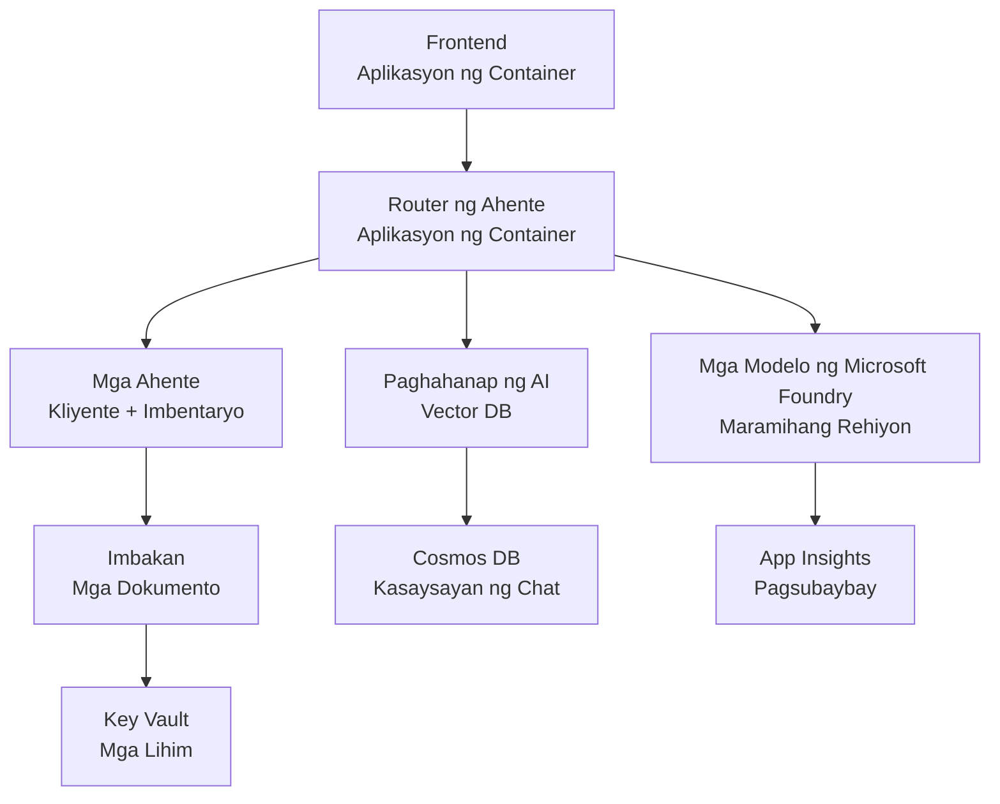

# Retail Multi-Agent Solution - Infrastructure Template

**Chapter 5: Production Deployment Package**
- **📚 Course Home**: [AZD For Beginners](../../README.md)
- **📖 Related Chapter**: [Chapter 5: Multi-Agent AI Solutions](../../README.md#-chapter-5-multi-agent-ai-solutions-advanced)
- **📝 Scenario Guide**: [Complete Architecture](../retail-scenario.md)
- **🎯 Quick Deploy**: [One-Click Deployment](#-quick-deployment)

> **⚠️ INFRASTRUCTURE TEMPLATE ONLY**  
> Ang ARM template na ito ay nagde-deploy ng **Azure resources** para sa isang multi-agent system.  
>  
> **Ano ang nade-deploy (15-25 minuto):**
> - ✅ Microsoft Foundry Models (gpt-4.1, gpt-4.1-mini, embeddings sa 3 rehiyon)
> - ✅ AI Search service (walang laman, handa para sa paglikha ng index)
> - ✅ Container Apps (placeholder images, handa para sa iyong code)
> - ✅ Storage, Cosmos DB, Key Vault, Application Insights
>  
> **Ano ang HINDI kasama (kailangang i-develop):**
> - ❌ Agent implementation code (Customer Agent, Inventory Agent)
> - ❌ Routing logic at API endpoints
> - ❌ Frontend chat UI
> - ❌ Search index schemas at data pipelines
> - ❌ **Tinatayang effort sa pag-develop: 80-120 oras**
>  
> **Gamitin ang template na ito kung:**
> - ✅ Nais mong mag-provision ng Azure infrastructure para sa isang multi-agent na proyekto
> - ✅ Plano mong i-develop ang agent implementation nang hiwalay
> - ✅ Kailangan mo ng production-ready infrastructure baseline
>  
> **Huwag gamitin kung:**
> - ❌ Inaasahan mong magkakaroon ng gumaganang multi-agent demo agad
> - ❌ Naghahanap ka ng kumpletong application code examples

## Overview

Nasa direktoryong ito ang isang komprehensibong Azure Resource Manager (ARM) template para i-deploy ang **infrastructure foundation** ng isang multi-agent customer support system. Ina-provision ng template ang lahat ng kinakailangang Azure services, tama ang pagkaka-configure at pagkakakonekta, handa para sa iyong application development.

**Pagkatapos ng deployment, magkakaroon ka ng:** Production-ready Azure infrastructure  
**Para kumpleto ang sistema, kailangan mo ng:** Agent code, frontend UI, at data configuration (tingnan ang [Architecture Guide](../retail-scenario.md))

## 🎯 What Gets Deployed

### Core Infrastructure (Status After Deployment)

✅ **Microsoft Foundry Models Services** (Handa para sa API calls)
  - Primary region: gpt-4.1 deployment (20K TPM capacity)
  - Secondary region: gpt-4.1-mini deployment (10K TPM capacity)
  - Tertiary region: Text embeddings model (30K TPM capacity)
  - Evaluation region: gpt-4.1 grader model (15K TPM capacity)
  - **Status:** Ganap na gumagana - maaaring gumawa ng API calls kaagad

✅ **Azure AI Search** (Walang laman - handa para sa configuration)
  - Nakabukas ang vector search capabilities
  - Standard tier na may 1 partition, 1 replica
  - **Status:** Serbisyo ay tumatakbo, ngunit kailangan ng paglikha ng index
  - **Kailangang aksyon:** Lumikha ng search index gamit ang iyong schema

✅ **Azure Storage Account** (Walang laman - handa para sa uploads)
  - Blob containers: `documents`, `uploads`
  - Secure configuration (HTTPS-only, walang public access)
  - **Status:** Handa nang tumanggap ng mga file
  - **Kailangang aksyon:** I-upload ang iyong product data at mga dokumento

⚠️ **Container Apps Environment** (Placeholder images na-deploy)
  - Agent router app (nginx default image)
  - Frontend app (nginx default image)
  - Auto-scaling na-configure (0-10 instances)
  - **Status:** Nagtatakbo ang placeholder containers
  - **Kailangang aksyon:** I-build at i-deploy ang iyong agent applications

✅ **Azure Cosmos DB** (Walang laman - handa para sa data)
  - Database at container na naka-pre-configure
  - Optimized para sa low-latency operations
  - TTL enabled para sa automatic cleanup
  - **Status:** Handa nang mag-imbak ng chat history

✅ **Azure Key Vault** (Opsyonal - handa para sa secrets)
  - Soft delete enabled
  - RBAC na-configure para sa managed identities
  - **Status:** Handa nang mag-imbak ng API keys at connection strings

✅ **Application Insights** (Opsyonal - monitoring active)
  - Nakakonekta sa Log Analytics workspace
  - Custom metrics at alerts na-configure
  - **Status:** Handa nang tumanggap ng telemetry mula sa iyong mga app

✅ **Document Intelligence** (Handa para sa API calls)
  - S0 tier para sa production workloads
  - **Status:** Handa nang i-proseso ang mga ina-upload na dokumento

✅ **Bing Search API** (Handa para sa API calls)
  - S1 tier para sa real-time searches
  - **Status:** Handa para sa web search queries

### Deployment Modes

| Mode | OpenAI Capacity | Container Instances | Search Tier | Storage Redundancy | Best For |
|------|-----------------|---------------------|-------------|-------------------|----------|
| **Minimal** | 10K-20K TPM | 0-2 replicas | Basic | LRS (Local) | Dev/test, learning, proof-of-concept |
| **Standard** | 30K-60K TPM | 2-5 replicas | Standard | ZRS (Zone) | Production, moderate traffic (<10K users) |
| **Premium** | 80K-150K TPM | 5-10 replicas, zone-redundant | Premium | GRS (Geo) | Enterprise, high traffic (>10K users), 99.99% SLA |

**Cost Impact:**
- **Minimal → Standard:** ~4x pagtaas ng gastos ($100-370/mo → $420-1,450/mo)
- **Standard → Premium:** ~3x pagtaas ng gastos ($420-1,450/mo → $1,150-3,500/mo)
- **Pumili base sa:** Inaasahang load, SLA requirements, limitasyon ng budget

**Capacity Planning:**
- **TPM (Tokens Per Minute):** Kabuuan sa lahat ng model deployments
- **Container Instances:** Saklaw ng auto-scaling (min-max replicas)
- **Search Tier:** Nakakaapekto sa query performance at limitasyon ng index size

## 📋 Prerequisites

### Required Tools
1. **Azure CLI** (version 2.50.0 o mas mataas)
   ```bash
   az --version  # Suriin ang bersyon
   az login      # Patunayan ang pagkakakilanlan
   ```

2. **Active Azure subscription** na may Owner o Contributor access
   ```bash
   az account show  # Kumpirmahin ang subscription
   ```

### Required Azure Quotas

Bago mag-deploy, tiyaking sapat ang quotas sa iyong target na mga rehiyon:

```bash
# Suriin kung available ang Microsoft Foundry Models sa iyong rehiyon
az cognitiveservices account list-skus \
  --kind OpenAI \
  --location eastus2

# Suriin ang quota ng OpenAI (halimbawa para sa gpt-4.1)
az cognitiveservices usage list \
  --location eastus2 \
  --query "[?name.value=='OpenAI.Standard.gpt-4.1']"

# Suriin ang quota ng Container Apps
az provider show \
  --namespace Microsoft.App \
  --query "resourceTypes[?resourceType=='managedEnvironments'].locations"
```

**Minimum Required Quotas:**
- **Microsoft Foundry Models:** 3-4 model deployments across regions
  - gpt-4.1: 20K TPM (Tokens Per Minute)
  - gpt-4.1-mini: 10K TPM
  - text-embedding-ada-002: 30K TPM
  - **Tandaan:** Maaaring may waitlist ang gpt-4.1 sa ilang rehiyon - tingnan ang [model availability](https://learn.microsoft.com/azure/ai-services/openai/concepts/models)
- **Container Apps:** Managed environment + 2-10 container instances
- **AI Search:** Standard tier (Basic insufficient for vector search)
- **Cosmos DB:** Standard provisioned throughput

**Kung kulang ang quota:**
1. Pumunta sa Azure Portal → Quotas → Humiling ng pagtaas
2. O gamitin ang Azure CLI:
   ```bash
   az support tickets create \
     --ticket-name "OpenAI-Quota-Increase" \
     --severity "minimal" \
     --description "Request quota increase for Microsoft Foundry Models gpt-4.1 in eastus2"
   ```
3. Isaalang-alang ang mga alternatibong rehiyon na may availability

## 🚀 Quick Deployment

### Option 1: Using Azure CLI

```bash
# I-clone o i-download ang mga file ng template
git clone <repository-url>
cd examples/retail-multiagent-arm-template

# Gawing executable ang deployment script
chmod +x deploy.sh

# I-deploy gamit ang mga default na setting
./deploy.sh -g myResourceGroup

# I-deploy para sa produksyon na may mga premium na tampok
./deploy.sh -g myProdRG -e prod -m premium -l eastus2
```

### Option 2: Using Azure Portal

[](https://portal.azure.com/#create/Microsoft.Template/uri/https%3A%2F%2Fraw.githubusercontent.com%2Fmicrosoft%2Fazd-for-beginners%2Fmain%2Fexamples%2Fretail-multiagent-arm-template%2Fazuredeploy.json)

### Option 3: Using Azure CLI directly

```bash
# Lumikha ng grupo ng mga resource
az group create --name myResourceGroup --location eastus2

# I-deploy ang template
az deployment group create \
  --resource-group myResourceGroup \
  --template-file azuredeploy.json \
  --parameters azuredeploy.parameters.json
```

## ⏱️ Deployment Timeline

### What to Expect

| Phase | Duration | What Happens |
|-------|----------|--------------||
| **Template Validation** | 30-60 seconds | Azure validates ARM template syntax and parameters |
| **Resource Group Setup** | 10-20 seconds | Gumagawa ng resource group (kung kailangan) |
| **OpenAI Provisioning** | 5-8 minutes | Lumilikha ng 3-4 OpenAI accounts at nagde-deploy ng mga modelo |
| **Container Apps** | 3-5 minutes | Lumilikha ng environment at nagde-deploy ng placeholder containers |
| **Search & Storage** | 2-4 minutes | Ina-provision ang AI Search service at storage accounts |
| **Cosmos DB** | 2-3 minutes | Lumilikha ng database at nagko-configure ng mga container |
| **Monitoring Setup** | 2-3 minutes | Nagse-set up ng Application Insights at Log Analytics |
| **RBAC Configuration** | 1-2 minutes | Nagko-configure ng managed identities at permissions |
| **Total Deployment** | **15-25 minutes** | Kumpletong infrastructure na handa |

**Pagkatapos ng Deployment:**
- ✅ **Infrastructure Ready:** Lahat ng Azure services ay na-provision at tumatakbo
- ⏱️ **Application Development:** 80-120 oras (iyong responsibilidad)
- ⏱️ **Index Configuration:** 15-30 minuto (kailangan ang iyong schema)
- ⏱️ **Data Upload:** Nag-iiba depende sa laki ng dataset
- ⏱️ **Testing & Validation:** 2-4 oras

---

## ✅ Verify Deployment Success

### Step 1: Check Resource Provisioning (2 minutes)

```bash
# Suriin kung matagumpay na na-deploy ang lahat ng mga resource
az resource list \
  --resource-group myResourceGroup \
  --query "[?provisioningState!='Succeeded'].{Name:name, Status:provisioningState, Type:type}" \
  --output table
```

**Inaasahan:** Walang laman na table (lahat ng resources ay nagpapakita ng "Succeeded" status)

### Step 2: Verify Microsoft Foundry Models Deployments (3 minutes)

```bash
# Ilista ang lahat ng mga account ng OpenAI
az cognitiveservices account list \
  --resource-group myResourceGroup \
  --query "[?kind=='OpenAI'].{Name:name, Location:location, Status:properties.provisioningState}" \
  --output table

# Suriin ang mga deployment ng modelo para sa pangunahing rehiyon
OPENAI_NAME=$(az cognitiveservices account list \
  --resource-group myResourceGroup \
  --query "[?kind=='OpenAI'] | [0].name" -o tsv)

az cognitiveservices account deployment list \
  --name $OPENAI_NAME \
  --resource-group myResourceGroup \
  --output table
```

**Inaasahan:** 
- 3-4 OpenAI accounts (primary, secondary, tertiary, evaluation regions)
- 1-2 model deployments per account (gpt-4.1, gpt-4.1-mini, text-embedding-ada-002)

### Step 3: Test Infrastructure Endpoints (5 minutes)

```bash
# Kunin ang mga URL ng Container App
az containerapp list \
  --resource-group myResourceGroup \
  --query "[].{Name:name, URL:properties.configuration.ingress.fqdn, Status:properties.runningStatus}" \
  --output table

# Subukan ang endpoint ng router (tutugon ang placeholder na imahe)
ROUTER_URL=$(az containerapp show \
  --name retail-router \
  --resource-group myResourceGroup \
  --query "properties.configuration.ingress.fqdn" -o tsv)

echo "Testing: https://$ROUTER_URL"
curl -I https://$ROUTER_URL || echo "Container running (placeholder image - expected)"
```

**Inaasahan:** 
- Ipinapakita ng Container Apps ang "Running" status
- Ang placeholder nginx ay tumutugon ng HTTP 200 o 404 (walang application code pa)

### Step 4: Verify Microsoft Foundry Models API Access (3 minutes)

```bash
# Kunin ang OpenAI endpoint at susi
OPENAI_ENDPOINT=$(az cognitiveservices account show \
  --name $OPENAI_NAME \
  --resource-group myResourceGroup \
  --query "properties.endpoint" -o tsv)

OPENAI_KEY=$(az cognitiveservices account keys list \
  --name $OPENAI_NAME \
  --resource-group myResourceGroup \
  --query "key1" -o tsv)

# Subukan ang pag-deploy ng gpt-4.1
curl "${OPENAI_ENDPOINT}openai/deployments/gpt-4.1/chat/completions?api-version=2024-08-01-preview" \
  -H "Content-Type: application/json" \
  -H "api-key: $OPENAI_KEY" \
  -d '{
    "messages": [{"role": "user", "content": "Say hello"}],
    "max_tokens": 10
  }'
```

**Inaasahan:** JSON response na may chat completion (nagkukumpirma na gumagana ang OpenAI)

### Ano ang Gumagana vs. Ano ang Hindi

**✅ Gumagana Pagkatapos ng Deployment:**
- Microsoft Foundry Models na-deploy at tumatanggap ng API calls
- AI Search service tumatakbo (walang laman, walang indexes)
- Container Apps tumatakbo (placeholder nginx images)
- Storage accounts naa-access at handa para sa uploads
- Cosmos DB handa para sa data operations
- Application Insights nagko-collect ng infrastructure telemetry
- Key Vault handa para sa secret storage

**❌ Hindi Pa Gumagana (Kailangang I-develop):**
- Agent endpoints (walang application code na na-deploy)
- Chat functionality (kailangan ang frontend + backend implementation)
- Search queries (walang search index na ginawa pa)
- Document processing pipeline (walang data na na-upload)
- Custom telemetry (kailangan ang application instrumentation)

**Susunod na Hakbang:** Tingnan ang [Post-Deployment Configuration](#-post-deployment-next-steps) para i-develop at i-deploy ang iyong application

---

## ⚙️ Configuration Options

### Template Parameters

| Parameter | Type | Default | Description |
|-----------|------|---------|-------------|
| `projectName` | string | "retail" | Prefix para sa lahat ng resource names |
| `location` | string | Resource group location | Primary deployment region |
| `secondaryLocation` | string | "westus2" | Secondary region para sa multi-region deployment |
| `tertiaryLocation` | string | "francecentral" | Region para sa embeddings model |
| `environmentName` | string | "dev" | Pagpapangalan ng environment (dev/staging/prod) |
| `deploymentMode` | string | "standard" | Deployment configuration (minimal/standard/premium) |
| `enableMultiRegion` | bool | true | I-enable ang multi-region deployment |
| `enableMonitoring` | bool | true | I-enable ang Application Insights at logging |
| `enableSecurity` | bool | true | I-enable ang Key Vault at enhanced security |

### Customizing Parameters

I-edit ang `azuredeploy.parameters.json`:

```json
{
  "$schema": "https://schema.management.azure.com/schemas/2019-04-01/deploymentParameters.json#",
  "contentVersion": "1.0.0.0",
  "parameters": {
    "projectName": {
      "value": "mycompany"
    },
    "environmentName": {
      "value": "prod"
    },
    "deploymentMode": {
      "value": "premium"
    },
    "location": {
      "value": "eastus2"
    }
  }
}
```

## 🏗️ Architecture Overview


## 📖 Deployment Script Usage

Ang `deploy.sh` script ay nagbibigay ng interactive deployment experience:

```bash
# Ipakita ang tulong
./deploy.sh --help

# Pangunahing pag-deploy
./deploy.sh -g myResourceGroup

# Mas advanced na pag-deploy na may pasadyang mga setting
./deploy.sh \
  -g myProductionRG \
  -p companyname \
  -e prod \
  -m premium \
  -l eastus2

# Pag-deploy para sa development na walang maramihang rehiyon
./deploy.sh \
  -g myDevRG \
  -e dev \
  -m minimal \
  --no-multi-region \
  --no-security
```

### Script Features

- ✅ **Prerequisites validation** (Azure CLI, login status, template files)
- ✅ **Resource group management** (gumagawa kung wala pa)
- ✅ **Template validation** bago ang deployment
- ✅ **Progress monitoring** na may colored output
- ✅ **Deployment outputs** na ipinapakita
- ✅ **Post-deployment guidance**

## 📊 Monitoring Deployment

### Check Deployment Status

```bash
# Ilista ang mga deployment
az deployment group list --resource-group myResourceGroup --output table

# Kunin ang mga detalye ng deployment
az deployment group show \
  --resource-group myResourceGroup \
  --name retail-deployment-YYYYMMDD-HHMMSS

# Subaybayan ang progreso ng deployment
az deployment group create \
  --resource-group myResourceGroup \
  --template-file azuredeploy.json \
  --parameters azuredeploy.parameters.json \
  --verbose
```

### Deployment Outputs

Pagkatapos ng matagumpay na deployment, ang mga sumusunod na outputs ay magagamit:

- **Frontend URL**: Public endpoint para sa web interface
- **Router URL**: API endpoint para sa agent router
- **OpenAI Endpoints**: Primary at secondary OpenAI service endpoints
- **Search Service**: Azure AI Search service endpoint
- **Storage Account**: Pangalan ng storage account para sa mga dokumento
- **Key Vault**: Pangalan ng Key Vault (kung enabled)
- **Application Insights**: Pangalan ng monitoring service (kung enabled)

## 🔧 Post-Deployment: Next Steps
> **📝 Mahalaga:** Na-deploy na ang imprastruktura, ngunit kailangan mong i-develop at i-deploy ang application code.

### Yugto 1: Bumuo ng Mga Application ng Ahente (Iyong Responsibilidad)

Ang ARM template ay lumilikha ng **mga walang laman na Container Apps** na may pansamantalang mga imahe ng nginx. Kailangan mong:

**Kinakailangang Pag-develop:**
1. **Implementasyon ng Ahente** (30-40 oras)
   - Ahente para sa customer service na may integrasyon ng gpt-4.1
   - Ahente ng imbentaryo na may integrasyon ng gpt-4.1-mini
   - Lohika ng pag-ruta ng ahente

2. **Pag-develop ng Frontend** (20-30 oras)
   - UI ng chat interface (React/Vue/Angular)
   - Pag-andar ng pag-upload ng file
   - Pag-render at pag-format ng mga sagot

3. **Mga Backend na Serbisyo** (12-16 oras)
   - FastAPI o Express router
   - middleware para sa autentikasyon
   - Integrasyon ng telemetry

**Tingnan:** [Gabay sa Arkitektura](../retail-scenario.md) para sa detalyadong mga pattern ng implementasyon at mga halimbawa ng code

### Yugto 2: I-configure ang AI Search Index (15-30 minuto)

Lumikha ng search index na tumutugma sa iyong data model:

```bash
# Kunin ang mga detalye ng serbisyo sa paghahanap
SEARCH_NAME=$(az search service list \
  --resource-group myResourceGroup \
  --query "[0].name" -o tsv)

SEARCH_KEY=$(az search admin-key show \
  --service-name $SEARCH_NAME \
  --resource-group myResourceGroup \
  --query "primaryKey" -o tsv)

# Gumawa ng index gamit ang iyong schema (halimbawa)
curl -X POST "https://${SEARCH_NAME}.search.windows.net/indexes?api-version=2023-11-01" \
  -H "Content-Type: application/json" \
  -H "api-key: ${SEARCH_KEY}" \
  -d '{
    "name": "products",
    "fields": [
      {"name": "id", "type": "Edm.String", "key": true},
      {"name": "title", "type": "Edm.String", "searchable": true},
      {"name": "content", "type": "Edm.String", "searchable": true},
      {"name": "category", "type": "Edm.String", "filterable": true},
      {"name": "content_vector", "type": "Collection(Edm.Single)", 
       "searchable": true, "dimensions": 1536, "vectorSearchProfile": "default"}
    ],
    "vectorSearch": {
      "algorithms": [{"name": "default", "kind": "hnsw"}],
      "profiles": [{"name": "default", "algorithm": "default"}]
    }
  }'
```

**Mga Mapagkukunan:**
- [Disenyo ng Schema ng AI Search Index](https://learn.microsoft.com/azure/search/search-what-is-an-index)
- [Konfigurasyon ng Vector Search](https://learn.microsoft.com/azure/search/vector-search-how-to-create-index)

### Yugto 3: I-upload ang Iyong Data (Nag-iiba ang oras)

Kapag mayroon ka nang data ng produkto at mga dokumento:

```bash
# Kunin ang mga detalye ng storage account
STORAGE_NAME=$(az storage account list \
  --resource-group myResourceGroup \
  --query "[0].name" -o tsv)

STORAGE_KEY=$(az storage account keys list \
  --account-name $STORAGE_NAME \
  --resource-group myResourceGroup \
  --query "[0].value" -o tsv)

# I-upload ang iyong mga dokumento
az storage blob upload-batch \
  --destination documents \
  --source /path/to/your/product/docs \
  --account-name $STORAGE_NAME \
  --account-key $STORAGE_KEY

# Halimbawa: Mag-upload ng isang file
az storage blob upload \
  --container-name documents \
  --name "product-manual.pdf" \
  --file /path/to/product-manual.pdf \
  --account-name $STORAGE_NAME \
  --account-key $STORAGE_KEY
```

### Yugto 4: Bumuo at I-deploy ang Iyong Mga Application (8-12 oras)

Kapag na-develop mo na ang iyong code ng ahente:

```bash
# 1. Gumawa ng Azure Container Registry (kung kailangan)
az acr create \
  --name myregistry \
  --resource-group myResourceGroup \
  --sku Basic

# 2. I-build at i-push ang imahe ng agent router
docker build -t myregistry.azurecr.io/agent-router:v1 /path/to/your/router/code
az acr login --name myregistry
docker push myregistry.azurecr.io/agent-router:v1

# 3. I-build at i-push ang imahe ng frontend
docker build -t myregistry.azurecr.io/frontend:v1 /path/to/your/frontend/code
docker push myregistry.azurecr.io/frontend:v1

# 4. I-update ang Container Apps gamit ang iyong mga imahe
az containerapp update \
  --name retail-router \
  --resource-group myResourceGroup \
  --image myregistry.azurecr.io/agent-router:v1

az containerapp update \
  --name retail-frontend \
  --resource-group myResourceGroup \
  --image myregistry.azurecr.io/frontend:v1

# 5. I-configure ang mga environment variable
az containerapp update \
  --name retail-router \
  --resource-group myResourceGroup \
  --set-env-vars \
    OPENAI_ENDPOINT=secretref:openai-endpoint \
    OPENAI_KEY=secretref:openai-key \
    SEARCH_ENDPOINT=secretref:search-endpoint \
    SEARCH_KEY=secretref:search-key
```

### Yugto 5: Subukan ang Iyong Application (2-4 oras)

```bash
# Kunin ang URL ng iyong aplikasyon
ROUTER_URL=$(az containerapp show \
  --name retail-router \
  --resource-group myResourceGroup \
  --query "properties.configuration.ingress.fqdn" -o tsv)

# Subukan ang endpoint ng agent (kapag na-deploy na ang iyong code)
curl -X POST "https://${ROUTER_URL}/chat" \
  -H "Content-Type: application/json" \
  -d '{
    "message": "Hello, I need help with my order",
    "agent": "customer"
  }'

# Suriin ang mga log ng aplikasyon
az containerapp logs show \
  --name retail-router \
  --resource-group myResourceGroup \
  --follow
```

### Mga Mapagkukunan para sa Implementasyon

**Arkitektura at Disenyo:**
- 📖 [Kumpletong Gabay sa Arkitektura](../retail-scenario.md) - Detalyadong mga pattern ng implementasyon
- 📖 [Mga Pattern ng Disenyo para sa Multi-Agent](https://learn.microsoft.com/azure/architecture/ai-ml/guide/multi-agent-systems)

**Mga Halimbawa ng Code:**
- 🔗 [Microsoft Foundry Models Chat Sample](https://github.com/Azure-Samples/azure-search-openai-demo) - pattern na RAG
- 🔗 [Semantic Kernel](https://github.com/microsoft/semantic-kernel) - Framework ng ahente (C#)
- 🔗 [LangChain Azure](https://github.com/langchain-ai/langchain) - Orkestrasyon ng ahente (Python)
- 🔗 [AutoGen](https://github.com/microsoft/autogen) - Mga multi-agent na pag-uusap

**Tantiyang Kabuuang Pagsisikap:**
- Pag-deploy ng imprastruktura: 15-25 minuto (✅ Kumpleto)
- Pag-develop ng application: 80-120 oras (🔨 Iyong gawain)
- Pagsusuri at optimisasyon: 15-25 oras (🔨 Iyong gawain)

## 🛠️ Pag-troubleshoot

### Mga Karaniwang Isyu

#### 1. Lumabis ang Quota ng Microsoft Foundry Models

```bash
# Suriin ang kasalukuyang paggamit ng kuota
az cognitiveservices usage list --location eastus2

# Humiling ng pagtaas ng kuota
az support tickets create \
  --ticket-name "OpenAI-Quota-Increase" \
  --severity "minimal" \
  --description "Request quota increase for Microsoft Foundry Models in region X"
```

#### 2. Nabigo ang Deployment ng Container Apps

```bash
# Suriin ang mga log ng app ng container
az containerapp logs show \
  --name retail-router \
  --resource-group myResourceGroup \
  --follow

# Muling simulan ang app ng container
az containerapp revision restart \
  --name retail-router \
  --resource-group myResourceGroup
```

#### 3. Inisyalisasyon ng Search Service

```bash
# Suriin ang katayuan ng serbisyo ng paghahanap
az search service show \
  --name <search-service-name> \
  --resource-group myResourceGroup

# Subukan ang koneksyon ng serbisyo ng paghahanap
curl -X GET "https://<search-service-name>.search.windows.net/indexes?api-version=2023-11-01" \
  -H "api-key: <search-admin-key>"
```

### Pag-validate ng Deployment

```bash
# Tiyakin na nalikha ang lahat ng resources
az resource list \
  --resource-group myResourceGroup \
  --output table

# Suriin ang kalusugan ng resource
az resource list \
  --resource-group myResourceGroup \
  --query "[?provisioningState!='Succeeded'].{Name:name, Status:provisioningState, Type:type}" \
  --output table
```

## 🔐 Mga Pagsasaalang-alang sa Seguridad

### Pamamahala ng Mga Susi
- Lahat ng mga lihim ay naka-imbak sa Azure Key Vault (kapag pinagana)
- Gumagamit ang mga container app ng managed identity para sa autentikasyon
- May secure defaults ang mga storage account (HTTPS lamang, walang public blob access)

### Seguridad ng Network
- Gumagamit ang container apps ng internal networking kapag posible
- Ang search service ay naka-configure na may opsyon na private endpoints
- Ang Cosmos DB ay naka-configure na may pinakamababang kinakailangang permiso

### Konfigurasyon ng RBAC
```bash
# Magtalaga ng mga kinakailangang role para sa managed identity
az role assignment create \
  --assignee <container-app-managed-identity> \
  --role "Cognitive Services OpenAI User" \
  --scope <openai-resource-id>
```

## 💰 Pag-optimize ng Gastos

### Tantiyang Gastos (Buwanang, USD)

| Mode | OpenAI | Container Apps | Search | Storage | Kabuuang Tantya |
|------|--------|----------------|--------|---------|-----------------|
| Minimal | $50-200 | $20-50 | $25-100 | $5-20 | $100-370 |
| Standard | $200-800 | $100-300 | $100-300 | $20-50 | $420-1450 |
| Premium | $500-2000 | $300-800 | $300-600 | $50-100 | $1150-3500 |

### Pagmo-monitor ng Gastos

```bash
# Itakda ang mga alerto sa badyet
az consumption budget create \
  --account-name <subscription-id> \
  --budget-name "retail-budget" \
  --amount 500 \
  --time-grain Monthly \
  --start-date 2024-01-01 \
  --end-date 2024-12-31
```

## 🔄 Mga Update at Pagpapanatili

### Mga Update sa Template
- Gamitin ang version control para sa mga ARM template files
- Subukan muna ang mga pagbabago sa development environment
- Gumamit ng incremental deployment mode para sa mga update

### Mga Update sa Resource
```bash
# I-update gamit ang mga bagong parameter
az deployment group create \
  --resource-group myResourceGroup \
  --template-file azuredeploy.json \
  --parameters azuredeploy.parameters.json \
  --mode Incremental
```

### Backup at Pag-recover
- Awtomatikong backup ng Cosmos DB ay pinagana
- Soft delete para sa Key Vault ay pinagana
- Pinapanatili ang mga revisyon ng container app para sa rollback

## 📞 Suporta

- **Mga Isyu sa Template**: [GitHub Issues](https://github.com/microsoft/azd-for-beginners/issues)
- **Suporta ng Azure**: [Azure Support Portal](https://portal.azure.com/#blade/Microsoft_Azure_Support/HelpAndSupportBlade)
- **Komunidad**: [Azure AI Discord](https://discord.gg/microsoft-azure)

---

**⚡ Handa ka na bang i-deploy ang iyong multi-agent na solusyon?**

Magsimula sa: `./deploy.sh -g myResourceGroup`

---

<!-- CO-OP TRANSLATOR DISCLAIMER START -->
**Paunawa**:
Ang dokumentong ito ay isinalin gamit ang serbisyong AI na tagasalin na [Co-op Translator](https://github.com/Azure/co-op-translator). Bagaman nagsusumikap kaming maging tumpak, pakatandaan na ang mga awtomatikong pagsasalin ay maaaring maglaman ng mga pagkakamali o hindi pagkakatumpak. Ang orihinal na dokumento sa orihinal nitong wika ang dapat ituring na awtoritatibong sanggunian. Para sa mahahalagang impormasyon, inirerekomenda ang propesyonal na pagsasaling ginawa ng tao. Hindi kami mananagot sa anumang hindi pagkakaintindihan o maling interpretasyon na nagmumula sa paggamit ng pagsasaling ito.
<!-- CO-OP TRANSLATOR DISCLAIMER END -->