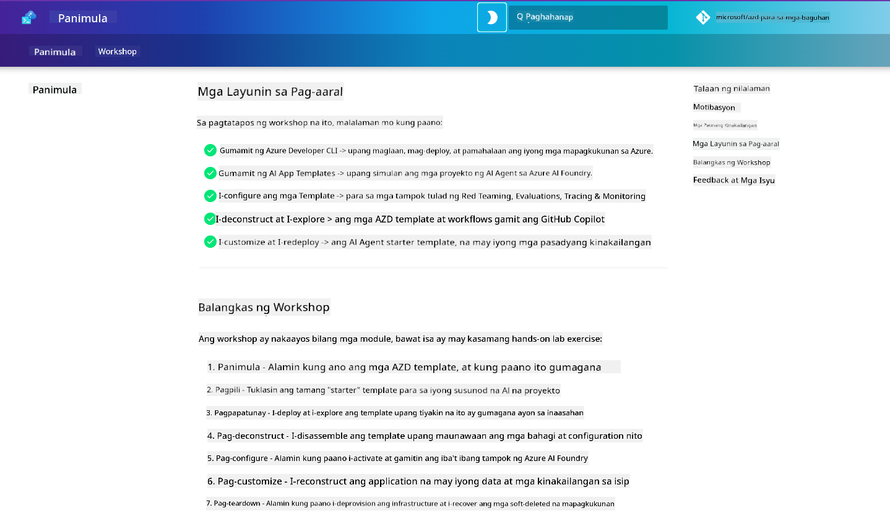

<!--
CO_OP_TRANSLATOR_METADATA:
{
  "original_hash": "9cc966416ab431c38b2ab863884b196c",
  "translation_date": "2025-09-24T23:29:53+00:00",
  "source_file": "workshop/README.md",
  "language_code": "tl"
}
-->
# AZD para sa AI Developers Workshop

Maligayang pagdating sa hands-on workshop para matutunan ang Azure Developer CLI (AZD) na nakatuon sa pag-deploy ng AI applications. Ang workshop na ito ay magbibigay sa iyo ng praktikal na kaalaman sa paggamit ng AZD templates sa tatlong hakbang:

1. **Pagdiskubre** - hanapin ang tamang template para sa iyo.
1. **Pag-deploy** - i-deploy at tiyakin na gumagana ito.
1. **Pag-customize** - baguhin at i-iterate upang maging angkop sa iyong pangangailangan!

Sa kabuuan ng workshop na ito, ipakikilala rin sa iyo ang mga pangunahing developer tools at workflows upang mapadali ang iyong end-to-end development journey.

<br/>

## Gabay na Batay sa Browser

Ang mga aralin sa workshop ay nasa Markdown. Maaari mo itong i-navigate nang direkta sa GitHub - o mag-launch ng browser-based preview tulad ng ipinapakita sa screenshot sa ibaba.



Upang magamit ang opsyong ito - i-fork ang repository sa iyong profile, at i-launch ang GitHub Codespaces. Kapag aktibo na ang VS Code terminal, i-type ang command na ito:

```bash title="" linenums="0"
mkdocs serve > /dev/null 2>&1 &
```

Sa loob ng ilang segundo, makakakita ka ng pop-up dialog. Piliin ang opsyon na `Open in browser`. Ang web-based guide ay magbubukas na sa isang bagong browser tab. Ilan sa mga benepisyo ng preview na ito:

1. **Built-in search** - mabilis na mahanap ang mga keyword o aralin.
1. **Copy icon** - i-hover ang mouse sa codeblocks upang makita ang opsyon.
1. **Theme toggle** - magpalit sa pagitan ng dark at light themes.
1. **Humingi ng tulong** - i-click ang Discord icon sa footer upang sumali!

<br/>

## Overview ng Workshop

**Tagal:** 3-4 oras  
**Antas:** Baguhan hanggang Intermediate  
**Mga Kinakailangan:** Pamilyar sa Azure, AI concepts, VS Code & command-line tools.

Ito ay isang hands-on workshop kung saan matututo ka sa pamamagitan ng paggawa. Kapag natapos mo na ang mga exercises, inirerekomenda naming suriin ang AZD For Beginners curriculum upang ipagpatuloy ang iyong pag-aaral sa Security at Productivity best practices.

| Oras | Module  | Layunin |
|:---|:---|:---|
| 15 minuto | [Introduction](docs/instructions/0-Introduction.md) | Itakda ang layunin, unawain ang mga goals |
| 30 minuto | [Select AI Template](docs/instructions/1-Select-AI-Template.md) | Tuklasin ang mga opsyon at pumili ng starter | 
| 30 minuto | [Validate AI Template](docs/instructions/2-Validate-AI-Template.md) | I-deploy ang default solution sa Azure |
| 30 minuto | [Deconstruct AI Template](docs/instructions/3-Deconstruct-AI-Template.md) | Tuklasin ang istruktura at configuration |
| 30 minuto | [Configure AI Template](docs/instructions/4-Configure-AI-Template.md) | I-activate at subukan ang mga available na features |
| 30 minuto | [Customize AI Template](docs/instructions/5-Customize-AI-Template.md) | I-adapt ang template ayon sa iyong pangangailangan |
| 30 minuto | [Teardown Infrastructure](docs/instructions/6-Teardown-Infrastructure.md) | Linisin at i-release ang mga resources |
| 15 minuto | [Wrap-Up & Next Steps](docs/instructions/7-Wrap-up.md) | Mga learning resources, Workshop challenge |

<br/>

## Ano ang Matututunan Mo

Isipin ang AZD Template bilang isang learning sandbox upang tuklasin ang iba't ibang kakayahan at tools para sa end-to-end development sa Azure AI Foundry. Sa pagtatapos ng workshop na ito, magkakaroon ka ng intuitive na pag-unawa sa iba't ibang tools at concepts sa kontekstong ito.

| Konsepto  | Layunin |
|:---|:---|
| **Azure Developer CLI** | Unawain ang mga tool commands at workflows |
| **AZD Templates**| Unawain ang istruktura ng proyekto at config |
| **Azure AI Agent**| Mag-provision at mag-deploy ng Azure AI Foundry project |
| **Azure AI Search**| Paganahin ang context engineering gamit ang agents |
| **Observability**| Tuklasin ang tracing, monitoring, at evaluations |
| **Red Teaming**| Tuklasin ang adversarial testing at mitigations |

<br/>

## Estruktura ng Workshop

Ang workshop ay nakaayos upang dalhin ka sa isang paglalakbay mula sa template discovery, hanggang sa deployment, deconstruction, at customization - gamit ang opisyal na [Getting Started with AI Agents](https://github.com/Azure-Samples/get-started-with-ai-agents) starter template bilang batayan.

### [Module 1: Select AI Template](docs/instructions/1-Select-AI-Template.md) (30 minuto)

- Ano ang AI Templates?
- Saan makakahanap ng AI Templates?
- Paano magsisimula sa pagbuo ng AI Agents?
- **Lab**: Quickstart gamit ang GitHub Codespaces

### [Module 2: Validate AI Template](docs/instructions/2-Validate-AI-Template.md) (30 minuto)

- Ano ang AI Template Architecture?
- Ano ang AZD Development Workflow?
- Paano makakakuha ng tulong sa AZD Development?
- **Lab**: I-deploy at i-validate ang AI Agents template

### [Module 3: Deconstruct AI Template](docs/instructions/3-Deconstruct-AI-Template.md) (30 minuto)

- Tuklasin ang iyong environment sa `.azure/` 
- Tuklasin ang iyong resource setup sa `infra/` 
- Tuklasin ang iyong AZD configuration sa `azure.yaml`s
- **Lab**: Baguhin ang Environment Variables at i-redeploy

### [Module 4: Configure AI Template](docs/instructions/4-Configure-AI-Template.md) (30 minuto)
- Tuklasin: Retrieval Augmented Generation
- Tuklasin: Agent Evaluation & Red Teaming
- Tuklasin: Tracing & Monitoring
- **Lab**: Tuklasin ang AI Agent + Observability 

### [Module 5: Customize AI Template](docs/instructions/5-Customize-AI-Template.md) (30 minuto)
- Tukuyin: PRD gamit ang Scenario Requirements
- I-configure: Environment Variables para sa AZD
- I-implement: Lifecycle Hooks para sa karagdagang tasks
- **Lab**: I-customize ang template para sa aking scenario

### [Module 6: Teardown Infrastructure](docs/instructions/6-Teardown-Infrastructure.md) (30 minuto)
- Recap: Ano ang AZD Templates?
- Recap: Bakit gamitin ang Azure Developer CLI?
- Susunod na Hakbang: Subukan ang ibang template!
- **Lab**: I-deprovision ang infrastructure at linisin

<br/>

## Workshop Challenge

Gusto mo bang hamunin ang iyong sarili na gumawa ng higit pa? Narito ang ilang mga mungkahi sa proyekto - o ibahagi ang iyong mga ideya sa amin!!

| Proyekto | Deskripsyon |
|:---|:---|
|1. **Deconstruct A Complex AI Template** | Gamitin ang workflow at tools na aming itinuro at tingnan kung kaya mong i-deploy, i-validate, at i-customize ang ibang AI solution template. _Ano ang natutunan mo?_|
|2. **Customize With Your Scenario**  | Subukang magsulat ng PRD (Product Requirements Document) para sa ibang scenario. Pagkatapos, gamitin ang GitHub Copilot sa iyong template repo sa Agent Model - at hilingin dito na gumawa ng customization workflow para sa iyo. _Ano ang natutunan mo? Paano mo mapapabuti ang mga mungkahi?_|
| | |

## May feedback?

1. Mag-post ng issue sa repo na ito - i-tag ito bilang `Workshop` para sa kaginhawaan.
1. Sumali sa Azure AI Foundry Discord - makipag-ugnayan sa iyong mga kapwa developer!

| | | 
|:---|:---|
| **📚 Course Home**| [AZD For Beginners](../README.md)|
| **📖 Documentation** | [Get started with AI templates](https://learn.microsoft.com/en-us/azure/ai-foundry/how-to/develop/ai-template-get-started)|
| **🛠️AI Templates** | [Azure AI Foundry Templates](https://ai.azure.com/templates) |
|**🚀 Next Steps** | [Take The Challenge](../../../workshop) |
| | |

<br/>

---

**Nakaraan:** [AI Troubleshooting Guide](../docs/troubleshooting/ai-troubleshooting.md) | **Susunod:** Simulan sa [Lab 1: AZD Basics](../../../workshop/lab-1-azd-basics)

**Handa ka na bang magsimula sa pagbuo ng AI applications gamit ang AZD?**

[Simulan ang Lab 1: AZD Foundations →](./lab-1-azd-basics/README.md)

---

