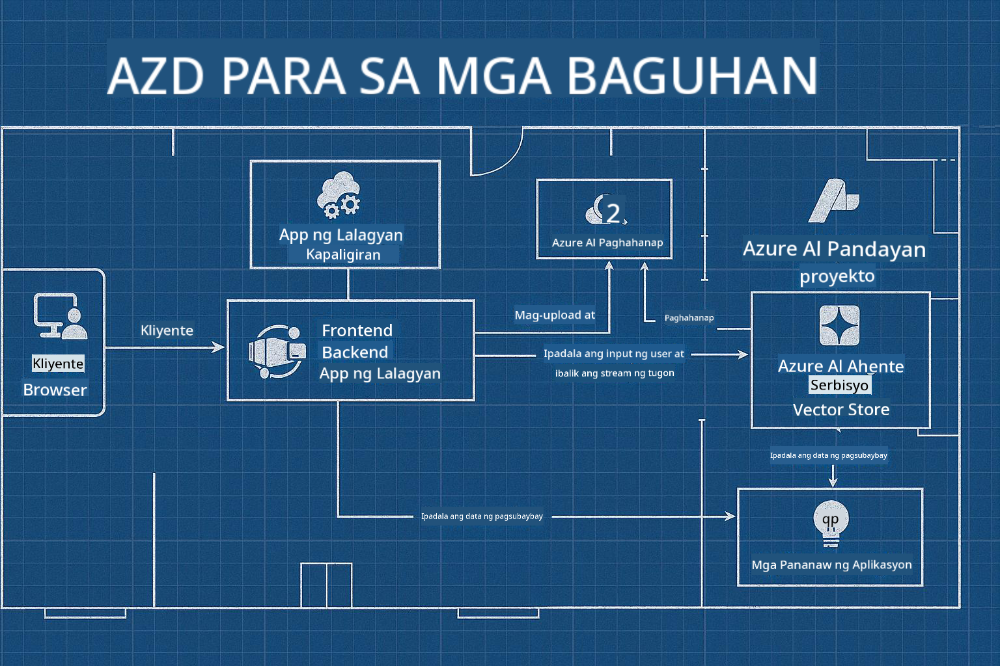

<!--
CO_OP_TRANSLATOR_METADATA:
{
  "original_hash": "245d24997bbcf2bae93bb2a503845d37",
  "translation_date": "2025-09-23T12:01:41+00:00",
  "source_file": "workshop/README.md",
  "language_code": "tl"
}
-->
# AZD para sa AI Developers Workshop

## AZD Templates

Ang paggawa ng enterprise-grade na solusyon para sa AI Application na angkop sa iyong partikular na sitwasyon ay parang pagtatayo ng sarili mong bahay. Maaari mo itong idisenyo, itayo isa-isa, at akuin ang responsibilidad na matiyak na sumusunod ito sa lahat ng pamantayan ng pamamahala at pag-unlad.

**O ....**

Maaari kang makipagtulungan sa isang arkitekto na maaaring magbigay sa iyo ng _blueprint_ para sa isang panimulang bahay, at pagkatapos ay makipagtulungan sa iyo upang _i-customize_ ito ayon sa iyong pangangailangan. Sa ganitong paraan, maaari kang mag-focus sa kung ano ang nagpapasikat sa **iyong bahay**, habang ang mga pangunahing wiring, plumbing, at iba pang mga pangangailangan ay inaasikaso ng mga eksperto.

**Ito ang diskarte sa likod ng [AI App Templates](https://ai.azure.com/templates)** - isang serye ng mga blueprint para sa paggawa ng iba't ibang uri ng "bahay" ng AI application depende sa iyong pangunahing pangangailangan at mga pangangailangan.

## Pag-customize ng Template

Ang mga template ay idinisenyo upang gumana sa [Azure AI Foundry](https://ai.azure.com). Isipin ang platform na ito bilang iyong "kontratista sa pagtatayo" na may access sa lahat ng mga resources, tools, at expertise na kailangan mo upang matapos ang trabaho!

Ang kailangan mo lang gawin ay pumili ng [iyong panimulang template](https://learn.microsoft.com/en-us/azure/ai-foundry/how-to/develop/ai-template-get-started). Halimbawa, magpo-focus tayo sa _Get Started with AI Agents_ template upang makabuo ng "Agentic AI Home" na may mga tampok tulad ng AI Search, Red Teaming, Evaluations, Tracing, Monitoring, at marami pa!



Ang kailangan mo lang ay mag-book ng oras sa arkitekto upang gabayan ka sa proseso ng pag-customize. [GitHub Copilot for Azure](https://learn.microsoft.com/en-us/azure/developer/github-copilot-azure/get-started) ang maaaring maging gabay mo. Mag-"chat" lang dito upang:

- Matutunan ang mga tampok ng Azure sa iyong template
- Mag-deploy ng mga Azure resources
- Makakuha ng impormasyon tungkol sa iyong deployment
- Mag-diagnose at mag-troubleshoot ng mga problema!

Sa workshop na ito, matutunan natin kung paano _i-deconstruct_ ang umiiral na template (upang malaman kung ano ang ibinibigay nito), pagkatapos ay _i-customize_ ito (upang matugunan ang ating mga pangangailangan) - hakbang-hakbang.

Ang AI Templates ay **ginagawang posible** - sa pamamagitan ng pagtatapos ng workshop, matutunan mong **gawing iyo ito**

----

**Workshop Navigation**
- **📚 Course Home**: [AZD Para sa Mga Baguhan](../README.md)
- **📖 Mga Kaugnay na Kabanata**: Sinasaklaw ang [Kabanata 1](../README.md#-chapter-1-foundation--quick-start), [Kabanata 2](../README.md#-chapter-2-ai-first-development-recommended-for-ai-developers), at [Kabanata 5](../README.md#-chapter-5-multi-agent-ai-solutions-advanced)
- **🛠️ Hands-On Lab**: [AI Workshop Lab](../docs/ai-foundry/ai-workshop-lab.md)
- **🚀 Mga Susunod na Hakbang**: [Workshop Lab Modules](../../../workshop)

Maligayang pagdating sa hands-on workshop para matutunan ang Azure Developer CLI (AZD) na nakatuon sa AI application deployment. Ang workshop na ito ay idinisenyo upang dalhin ka mula sa mga pangunahing kaalaman ng AZD hanggang sa pag-deploy ng production-ready na AI solutions.

## Pangkalahatang-ideya ng Workshop

**Tagal:** 2-3 oras  
**Antas:** Baguhan hanggang Intermediate  
**Mga Kinakailangan:** Pangunahing kaalaman sa Azure, mga command line tools, at mga konsepto ng AI

### Ano ang Iyong Matututunan

- **Mga Pangunahing Kaalaman ng AZD**: Pag-unawa sa Infrastructure as Code gamit ang AZD
- 🤖 **AI Service Integration**: Pag-deploy ng Azure OpenAI, AI Search, at iba pang AI services
- **Container Deployment**: Paggamit ng Azure Container Apps para sa AI applications
- **Mga Pinakamahusay na Kasanayan sa Seguridad**: Pagpapatupad ng Managed Identity at secure configurations
- **Monitoring & Observability**: Pag-set up ng Application Insights para sa AI workloads
- **Mga Pattern ng Produksyon**: Mga estratehiya sa enterprise-ready deployment

## Estruktura ng Workshop

### Module 1: AZD Foundations (30 minuto)
- Pag-install at pag-configure ng AZD
- Pag-unawa sa AZD project structure
- Ang iyong unang AZD deployment
- **Lab**: Mag-deploy ng simpleng web application

### Module 2: Azure OpenAI Integration (45 minuto)
- Pag-set up ng Azure OpenAI resources
- Mga estratehiya sa model deployment
- Pag-configure ng API access at authentication
- **Lab**: Mag-deploy ng chat application gamit ang GPT-4

### Module 3: RAG Applications (45 minuto)
- Azure AI Search integration
- Pagproseso ng dokumento gamit ang Azure Document Intelligence
- Vector embeddings at semantic search
- **Lab**: Bumuo ng document Q&A system

### Module 4: Production Deployment (30 minuto)
- Configuration ng Container Apps
- Scaling at performance optimization
- Monitoring at logging
- **Lab**: Mag-deploy sa production na may observability

### Module 5: Advanced Patterns (15 minuto)
- Multi-environment deployments
- CI/CD integration
- Mga estratehiya sa cost optimization
- **Wrap-up**: Production readiness checklist

## Mga Kinakailangan

### Mga Kinakailangang Tools

Mangyaring i-install ang mga tools na ito bago ang workshop:

```bash
# Azure Developer CLI
curl -fsSL https://aka.ms/install-azd.sh | bash

# Azure CLI
curl -sL https://aka.ms/InstallAzureCLIDeb | sudo bash

# Git
sudo apt-get install git

# Docker
curl -fsSL https://get.docker.com -o get-docker.sh
sudo sh get-docker.sh

# Python 3.10+
sudo apt-get install python3.10 python3.10-venv python3-pip
```

### Azure Account Setup

1. **Azure Subscription**: [Mag-sign up nang libre](https://azure.microsoft.com/free/)
2. **Azure OpenAI Access**: [Mag-request ng access](https://aka.ms/oai/access)
3. **Mga Kinakailangang Pahintulot**:
   - Contributor role sa subscription o resource group
   - User Access Administrator (para sa RBAC assignments)

### I-verify ang Mga Kinakailangan

Patakbuhin ang script na ito upang i-verify ang iyong setup:

```bash
#!/bin/bash
echo "Verifying workshop prerequisites..."

# Check AZD installation
if command -v azd &> /dev/null; then
    echo "✅ Azure Developer CLI: $(azd --version)"
else
    echo "❌ Azure Developer CLI not found"
fi

# Check Azure CLI
if command -v az &> /dev/null; then
    echo "✅ Azure CLI: $(az --version | head -n1)"
else
    echo "❌ Azure CLI not found"
fi

# Check Docker
if command -v docker &> /dev/null; then
    echo "✅ Docker: $(docker --version)"
else
    echo "❌ Docker not found"
fi

# Check Python
if command -v python3 &> /dev/null; then
    echo "✅ Python: $(python3 --version)"
else
    echo "❌ Python 3 not found"
fi

# Check Azure login
if az account show &> /dev/null; then
    echo "✅ Azure: Logged in as $(az account show --query user.name -o tsv)"
else
    echo "❌ Azure: Not logged in (run 'az login')"
fi

echo "Setup verification complete!"
```

## Mga Materyales ng Workshop

### Mga Lab Exercises

Ang bawat module ay may kasamang hands-on labs na may starter code at step-by-step na mga tagubilin:

- **[lab-1-azd-basics/](../../../workshop/lab-1-azd-basics)** - Ang iyong unang AZD deployment
- **[lab-2-openai-chat/](../../../workshop/lab-2-openai-chat)** - Chat application gamit ang Azure OpenAI
- **[lab-3-rag-search/](../../../workshop/lab-3-rag-search)** - RAG application gamit ang AI Search
- **[lab-4-production/](../../../workshop/lab-4-production)** - Mga pattern ng production deployment
- **[lab-5-advanced/](../../../workshop/lab-5-advanced)** - Mga advanced na deployment scenarios

### Mga Reference Materials

- **[AI Foundry Integration Guide](../docs/ai-foundry/azure-ai-foundry-integration.md)** - Komprehensibong integration patterns
- **[AI Model Deployment Guide](../docs/ai-foundry/ai-model-deployment.md)** - Mga pinakamahusay na kasanayan sa model deployment
- **[Production AI Practices](../docs/ai-foundry/production-ai-practices.md)** - Mga pattern ng enterprise deployment
- **[AI Troubleshooting Guide](../docs/troubleshooting/ai-troubleshooting.md)** - Mga karaniwang isyu at solusyon

### Mga Sample Templates

Mga quick-start template para sa karaniwang AI scenarios:

```
workshop/templates/
├── minimal-chat/          # Basic OpenAI chat app
├── rag-application/       # RAG with AI Search
├── multi-model/          # Multiple AI services
└── production-ready/     # Enterprise template
```

## Pagsisimula

### Opsyon 1: GitHub Codespaces (Inirerekomenda)

Ang pinakamabilis na paraan upang simulan ang workshop:

[](https://github.com/codespaces/new?hide_repo_select=true&ref=main&repo=YOUR_REPO_ID)

### Opsyon 2: Lokal na Pag-develop

1. **I-clone ang workshop repository:**
```bash
git clone https://github.com/YOUR_ORG/AZD-for-beginners.git
cd AZD-for-beginners/workshop
```

2. **Mag-login sa Azure:**
```bash
az login
azd auth login
```

3. **Simulan sa Lab 1:**
```bash
cd lab-1-azd-basics
cat README.md  # Follow the instructions
```

### Opsyon 3: Instructor-Led Workshop

Kung dumadalo ka sa isang instructor-led session:

- 🎥 **Workshop Recording**: [Available on demand](https://aka.ms/azd-ai-workshop)
- 💬 **Discord Community**: [Sumali para sa live support](https://aka.ms/foundry/discord)
- **Workshop Feedback**: [Ibahagi ang iyong karanasan](https://aka.ms/azd-workshop-feedback)

## Timeline ng Workshop

### Self-Paced Learning (3 oras)

```
⏰ 00:00 - 00:30  Module 1: AZD Foundations
⏰ 00:30 - 01:15  Module 2: Azure OpenAI Integration
⏰ 01:15 - 02:00  Module 3: RAG Applications
⏰ 02:00 - 02:30  Module 4: Production Deployment
⏰ 02:30 - 02:45  Module 5: Advanced Patterns
⏰ 02:45 - 03:00  Q&A and Next Steps
```

### Instructor-Led Session (2.5 oras)

```
⏰ 00:00 - 00:15  Welcome & Prerequisites Check
⏰ 00:15 - 00:40  Module 1: Live Demo + Lab
⏰ 00:40 - 01:20  Module 2: OpenAI Integration
⏰ 01:20 - 01:30  Break
⏰ 01:30 - 02:10  Module 3: RAG Applications
⏰ 02:10 - 02:30  Module 4: Production Patterns
⏰ 02:30 - 02:45  Module 5: Advanced Topics
⏰ 02:45 - 03:00  Q&A and Resources
```

## Mga Pamantayan ng Tagumpay

Sa pagtatapos ng workshop na ito, magagawa mo:

✅ **Mag-deploy ng AI applications** gamit ang AZD templates  
✅ **I-configure ang Azure OpenAI** services nang may tamang seguridad  
✅ **Bumuo ng RAG applications** gamit ang Azure AI Search integration  
✅ **Magpatupad ng production patterns** para sa enterprise AI workloads  
✅ **Mag-monitor at mag-troubleshoot** ng AI application deployments  
✅ **Mag-apply ng cost optimization** strategies para sa AI workloads  

## Komunidad at Suporta

### Sa Panahon ng Workshop

- 🙋 **Mga Tanong**: Gamitin ang workshop chat o magtaas ng kamay
- 🐛 **Mga Isyu**: Tingnan ang [troubleshooting guide](../docs/troubleshooting/ai-troubleshooting.md)
- **Mga Tips**: Ibahagi ang mga natuklasan sa ibang mga kalahok

### Pagkatapos ng Workshop

- 💬 **Discord**: [Azure AI Foundry Community](https://aka.ms/foundry/discord)
- **GitHub Issues**: [I-report ang mga isyu sa template](https://github.com/YOUR_ORG/AZD-for-beginners/issues)
- 📧 **Feedback**: [Workshop evaluation form](https://aka.ms/azd-workshop-feedback)

## Mga Susunod na Hakbang

### Magpatuloy sa Pag-aaral

1. **Mga Advanced na Scenario**: Tuklasin ang [multi-region deployments](../docs/ai-foundry/production-ai-practices.md#multi-region-deployment)
2. **CI/CD Integration**: Mag-set up ng [GitHub Actions workflows](../docs/deployment/github-actions.md)
3. **Custom Templates**: Gumawa ng sarili mong [AZD templates](../docs/getting-started/custom-templates.md)

### I-apply sa Iyong Mga Proyekto

1. **Assessment**: Gamitin ang aming [readiness checklist](./production-readiness-checklist.md)
2. **Templates**: Simulan sa aming [AI-specific templates](../../../workshop/templates)
3. **Suporta**: Sumali sa [Azure AI Foundry Discord](https://aka.ms/foundry/discord)

### Ibahagi ang Iyong Tagumpay

- ⭐ **I-star ang repository** kung nakatulong sa iyo ang workshop na ito
- 🐦 **Ibahagi sa social media** gamit ang #AzureDeveloperCLI #AzureAI
- 📝 **Sumulat ng blog post** tungkol sa iyong AI deployment journey

---

## Feedback sa Workshop

Ang iyong feedback ay tumutulong sa amin na mapabuti ang karanasan sa workshop:

| Aspeto | Rating (1-5) | Mga Komento |
|--------|--------------|----------|
| Kalidad ng Nilalaman | ⭐⭐⭐⭐⭐ | |
| Hands-on Labs | ⭐⭐⭐⭐⭐ | |
| Dokumentasyon | ⭐⭐⭐⭐⭐ | |
| Antas ng Kahirapan | ⭐⭐⭐⭐⭐ | |
| Kabuuang Karanasan | ⭐⭐⭐⭐⭐ | |

**Mag-submit ng feedback**: [Workshop Evaluation Form](https://aka.ms/azd-workshop-feedback)

---

**Nakaraan:** [AI Troubleshooting Guide](../docs/troubleshooting/ai-troubleshooting.md) | **Susunod:** Simulan sa [Lab 1: AZD Basics](../../../workshop/lab-1-azd-basics)

**Handa ka na bang magsimulang bumuo ng AI applications gamit ang AZD?**

[Simulan ang Lab 1: AZD Foundations →](./lab-1-azd-basics/README.md)

---

