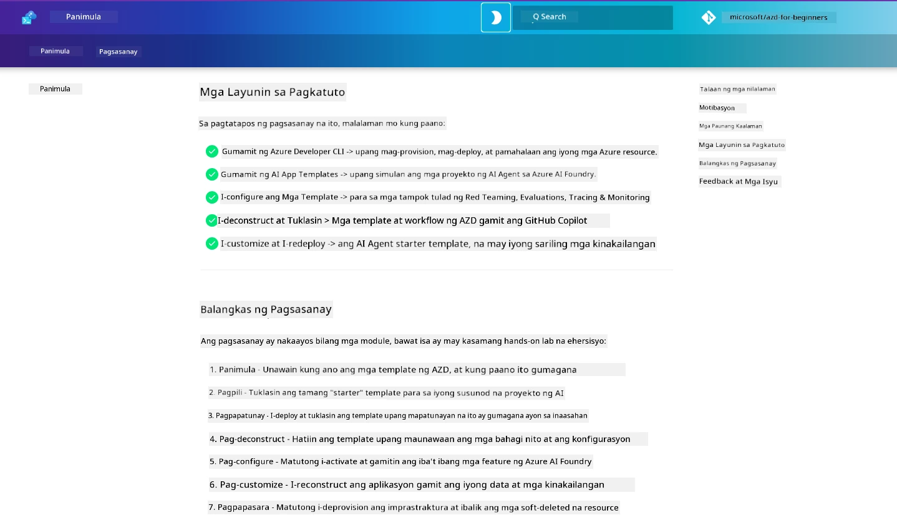

<div align="center">
  <div style="background: linear-gradient(135deg, #0078d4, #106ebe); border-radius: 10px; padding: 20px; margin: 20px 0; box-shadow: 0 4px 15px rgba(0, 120, 212, 0.3); border: 2px solid #005a9e;">
    <h2 style="color: white; margin: 0; font-size: 24px; text-shadow: 1px 1px 2px rgba(0,0,0,0.3);">
      🎯 AZD para sa Mga AI Developer Workshop
    </h2>
    <p style="color: white; margin: 10px 0 0 0; font-size: 16px; text-shadow: 1px 1px 2px rgba(0,0,0,0.3);">
      <strong>Isang praktikal na workshop para sa pagbuo ng mga aplikasyon ng AI gamit ang Azure Developer CLI.</strong><br>
      Kumpletuhin ang 7 modyul para maging bihasa sa mga AZD template at mga workflow ng AI deployment.
    </p>
    <div style="margin-top: 15px;">
      <span style="background: rgba(255,255,255,0.2); padding: 5px 10px; border-radius: 15px; color: white; font-size: 14px;">
        📅 Huling Na-update: Marso 2026
      </span>
    </div>
  </div>
</div>

# AZD para sa Mga AI Developer Workshop

Maligayang pagdating sa praktikal na workshop para matutunan ang Azure Developer CLI (AZD) na nakatuon sa pag-deploy ng mga aplikasyon ng AI. Tutulungan ka ng workshop na ito na magkaroon ng praktikal na pag-unawa sa mga AZD template sa 3 hakbang:

1. **Pagtuklas** - hanapin ang template na angkop para sa iyo.
1. **Pag-deploy** - i-deploy at i-validate na gumagana ito
1. **Pagpapasadya** - i-modify at i-ulit upang maging sa iyo!

Sa kabuuan ng workshop na ito, ipakikilala rin sa iyo ang mga pangunahing tool at workflow ng developer, upang matulungan kang gawing mas maayos ang iyong end-to-end development journey.

<br/>

## Gabay sa Browser

Ang mga aralin sa workshop ay nasa Markdown. Maaari mo itong i-navigate nang direkta sa GitHub - o maglunsad ng browser-based na preview tulad ng ipinapakita sa screenshot sa ibaba.



Upang gamitin ang opsyon na ito - i-fork ang repository sa iyong profile, at ilunsad ang GitHub Codespaces. Kapag aktibo na ang VS Code terminal, i-type ang utos na ito:

This browser preview works in GitHub Codespaces, dev containers, or a local clone with Python and MkDocs installed.

```bash title="" linenums="0"
mkdocs serve > /dev/null 2>&1 &
```

Sa loob ng ilang segundo, makakakita ka ng pop-up dialog. Piliin ang opsyon na `Open in browser`. Bubukas ang web-based na gabay sa isang bagong tab ng browser. Ilan sa mga benepisyo ng preview na ito:

1. **Built-in na paghahanap** - hanapin ang mga keyword o aralin nang mabilis.
1. **Icon ng Kopya** - i-hover ang cursor sa mga codeblock upang makita ang opsyon na ito
1. **Toggle ng Tema** - magpalit sa pagitan ng madilim at maliwanag na mga tema
1. **Kumuha ng tulong** - i-click ang Discord icon sa footer upang sumali!

<br/>

## Pangkalahatang-ideya ng Workshop

**Tagal:** 3-4 oras  
**Antas:** Baguhan hanggang Katamtaman  
**Mga Kinakailangan:** Pamilyaridad sa Azure, mga konsepto ng AI, VS Code & mga command-line tool.

Ito ay isang praktikal na workshop kung saan natututo ka sa pamamagitan ng paggawa. Kapag natapos mo na ang mga ehersisyo, inirerekomenda naming repasuhin ang kurikulum na AZD Para sa Mga Nagsisimula upang ipagpatuloy ang iyong paglalakbay sa pag-aaral patungo sa mga pinakamahusay na kasanayan sa Seguridad at Produktibidad.

| Oras| Modyul  | Layunin |
|:---|:---|:---|
| 15 minuto | [Panimula](docs/instructions/0-Introduction.md) | Ilatag ang konteksto at unawain ang mga layunin |
| 30 minuto | [Pumili ng AI Template](docs/instructions/1-Select-AI-Template.md) | Suriin ang mga opsyon at pumili ng panimulang template | 
| 30 minuto | [I-validate ang AI Template](docs/instructions/2-Validate-AI-Template.md) | I-deploy ang default na solusyon sa Azure |
| 30 minuto | [Pag-analisa ng AI Template](docs/instructions/3-Deconstruct-AI-Template.md) | Suriin ang istruktura at pagsasaayos |
| 30 minuto | [I-configure ang AI Template](docs/instructions/4-Configure-AI-Template.md) | I-aktiba at subukan ang mga magagamit na tampok |
| 30 minuto | [I-customize ang AI Template](docs/instructions/5-Customize-AI-Template.md) | Iangkop ang template sa iyong mga pangangailangan |
| 30 minuto | [Pagbuwag ng Imprastruktura](docs/instructions/6-Teardown-Infrastructure.md) | Linisin at pakawalan ang mga resource |
| 15 minuto | [Pagwawakas at Susunod na Hakbang](docs/instructions/7-Wrap-up.md) | Mga mapagkukunan sa pag-aaral, hamon sa Workshop |

<br/>

## Ano ang Matututunan Mo

Isipin ang AZD Template bilang isang learning sandbox upang tuklasin ang iba't ibang kakayahan at tool para sa end-to-end development sa Microsoft Foundry. Sa pagtatapos ng workshop na ito, dapat ay mayroon kang intuitibong pag-unawa sa iba't ibang tool at konsepto sa kontekstong ito.

| Konsepto  | Layunin |
|:---|:---|
| **Azure Developer CLI** | Unawain ang mga command ng tool at mga workflow|
| **AZD Templates**| Unawain ang estruktura ng proyekto at pagsasaayos|
| **Azure AI Agent**| Mag-provision at mag-deploy ng Microsoft Foundry project  |
| **Azure AI Search**| Paganahin ang context engineering gamit ang mga agent |
| **Observability**| Suriin ang tracing, monitoring at evaluations |
| **Red Teaming**| Suriin ang adversarial testing at mga mitigations |

<br/>

## Estruktura ng Workshop

Istrakturado ang workshop upang dalhin ka mula sa pagtuklas ng template, hanggang sa pag-deploy, pag-analisa, at pagpapasadya - gamit ang opisyal na [Getting Started with AI Agents](https://github.com/Azure-Samples/get-started-with-ai-agents) starter template bilang batayan.

### [Modyul 1: Piliin ang AI Template](docs/instructions/1-Select-AI-Template.md) (30 minuto)

- Ano ang mga AI Template?
- Saan ako makakahanap ng mga AI Template?
- Paano ako makakapagsimula sa pagbuo ng mga AI Agent?
- **Lab**: Quickstart sa Codespaces o isang dev container

### [Modyul 2: I-validate ang AI Template](docs/instructions/2-Validate-AI-Template.md) (30 minuto)

- Ano ang Arkitektura ng AI Template?
- Ano ang AZD Development Workflow?
- Paano ako makakakuha ng tulong sa AZD Development?
- **Lab**: I-deploy at I-validate ang AI Agents template

### [Modyul 3: Pag-analisa ng AI Template](docs/instructions/3-Deconstruct-AI-Template.md) (30 minuto)

- Suriin ang iyong environment sa `.azure/` 
- Suriin ang pagkakaayos ng iyong resource sa `infra/` 
- Suriin ang iyong AZD configuration sa `azure.yaml`s
- **Lab**: Baguhin ang Environment Variables & I-redeploy

### [Modyul 4: I-configure ang AI Template](docs/instructions/4-Configure-AI-Template.md) (30 minuto)
- Suriin: Retrieval Augmented Generation
- Suriin: Agent Evaluation & Red Teaming
- Suriin: Tracing & Monitoring
- **Lab**: Suriin ang AI Agent + Observability 

### [Modyul 5: I-customize ang AI Template](docs/instructions/5-Customize-AI-Template.md) (30 minuto)
- Tukuyin: PRD na may Scenario Requirements
- I-configure: Environment Variables para sa AZD
- Ipatupad: Lifecycle Hooks para sa karagdagang mga gawain
- **Lab**: I-customize ang template para sa aking scenario

### [Modyul 6: Pagbuwag ng Imprastruktura](docs/instructions/6-Teardown-Infrastructure.md) (30 minuto)
- Recap: Ano ang mga AZD Templates?
- Recap: Bakit gamitin ang Azure Developer CLI?
- Susunod na Hakbang: Subukan ang ibang template!
- **Lab**: I-deprovision ang imprastruktura & paglilinis

<br/>

## Hamon sa Workshop

Gusto mo bang hamunin ang sarili para sa higit pa? Narito ang ilang mungkahing proyekto - o ibahagi ang iyong mga ideya sa amin!!

| Proyekto | Deskripsyon |
|:---|:---|
|1. **Pag-analisa ng Isang Komplikadong AI Template** | Gamitin ang workflow at mga tool na inilahad namin at tingnan kung kaya mong i-deploy, i-validate, at i-customize ang ibang AI solution template. _Ano ang natutunan mo?_|
|2. **I-customize Ayon sa Iyong Scenario**  | Subukang sumulat ng PRD (Product Requirements Document) para sa ibang scenario. Pagkatapos gamitin ang GitHub Copilot sa iyong template repo sa Agent Model - at hilingin dito na bumuo ng isang customization workflow para sa iyo. _Ano ang natutunan mo? Paano mo mapapabuti ang mga mungkahing ito?_|
| | |

## May feedback?

1. Mag-post ng isyu sa repo na ito - i-tag ito ng `Workshop` para sa kaginhawaan.
1. Sumali sa Microsoft Foundry Discord - kumonekta sa iyong mga kasamahan!


| | | 
|:---|:---|
| **📚 Tahanan ng Kurso**| [AZD Para sa Mga Nagsisimula](../README.md)|
| **📖 Dokumentasyon** | [Magsimula gamit ang AI templates](https://learn.microsoft.com/en-us/azure/ai-foundry/how-to/develop/ai-template-get-started)|
| **🛠️ Mga Template ng AI** | [Mga Template ng Microsoft Foundry](https://ai.azure.com/templates) |
|**🚀 Susunod na Hakbang** | [Simulan ang Workshop](#pangkalahatang-ideya-ng-workshop) |
| | |

<br/>

---

**Navigasyon:** [Pangunahing Kurso](../README.md) | [Panimula](docs/instructions/0-Introduction.md) | [Modyul 1: Piliin ang Template](docs/instructions/1-Select-AI-Template.md)

**Handa ka na bang magsimulang bumuo ng mga aplikasyon ng AI gamit ang AZD?**

[Simulan ang Workshop: Panimula →](docs/instructions/0-Introduction.md)

---

<!-- CO-OP TRANSLATOR DISCLAIMER START -->
**Paunawa**:
Ang dokumentong ito ay isinalin gamit ang AI translation service [Co-op Translator](https://github.com/Azure/co-op-translator). Bagaman pinagsisikapan naming maging tumpak, pakitandaan na ang mga awtomatikong pagsasalin ay maaaring maglaman ng mga pagkakamali o hindi pagkakatumpak. Ituring na awtoritatibong sanggunian ang orihinal na dokumento sa orihinal nitong wika. Para sa mahahalagang impormasyon, inirerekomenda ang propesyonal na pagsasalin ng tao. Hindi kami mananagot para sa anumang hindi pagkakaunawaan o maling interpretasyon na nagmumula sa paggamit ng pagsasaling ito.
<!-- CO-OP TRANSLATOR DISCLAIMER END -->