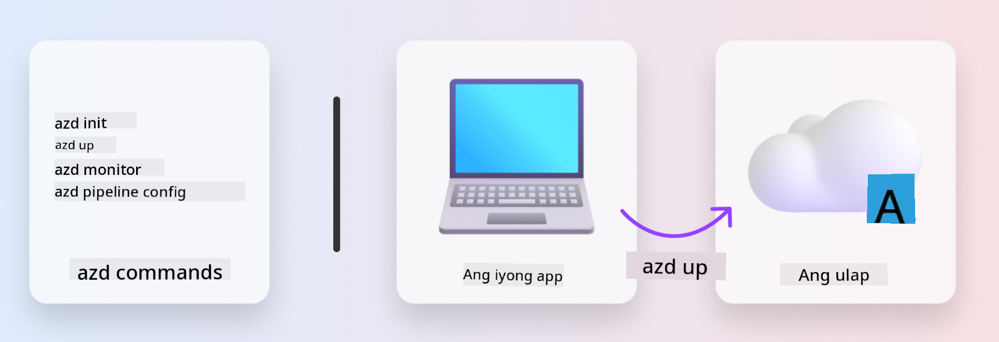
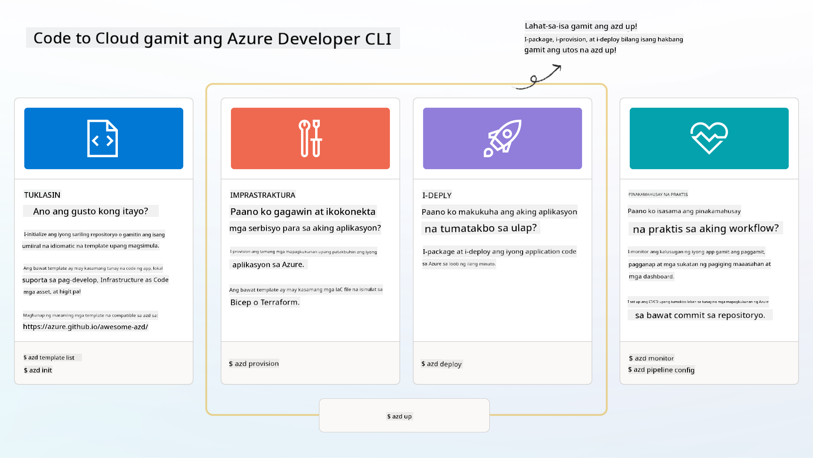

<!--
CO_OP_TRANSLATOR_METADATA:
{
  "original_hash": "06d6207eff634aefcaa41739490a5324",
  "translation_date": "2025-09-24T23:34:24+00:00",
  "source_file": "workshop/docs/instructions/1-Select-AI-Template.md",
  "language_code": "tl"
}
-->
# 1. Pumili ng Template

!!! tip "SA DULO NG MODULONG ITO, MAGAGAWA MO NA"

    - [ ] Ilarawan kung ano ang AZD templates
    - [ ] Tuklasin at gamitin ang AZD templates para sa AI
    - [ ] Magsimula gamit ang AI Agents template
    - [ ] **Lab 1:** AZD Quickstart gamit ang GitHub Codespaces

---

## 1. Isang Paghahambing sa Pagtatayo

Ang paggawa ng modernong enterprise-ready AI application _mula sa simula_ ay maaaring nakakatakot. Para itong pagtatayo ng bagong bahay mo nang mag-isa, brick by brick. Oo, posible ito! Pero hindi ito ang pinaka-epektibong paraan para makamit ang nais na resulta!

Sa halip, kadalasan ay nagsisimula tayo sa isang umiiral na _blueprint ng disenyo_, at nakikipagtulungan sa isang arkitekto upang i-customize ito ayon sa ating personal na pangangailangan. At ganito rin ang tamang diskarte sa paggawa ng mga intelligent applications. Una, hanapin ang tamang disenyo ng arkitektura na akma sa iyong problema. Pagkatapos, makipagtulungan sa isang solution architect upang i-customize at i-develop ang solusyon para sa iyong partikular na sitwasyon.

Pero saan natin mahahanap ang mga blueprint ng disenyo? At paano tayo makakahanap ng arkitekto na handang turuan tayo kung paano i-customize at i-deploy ang mga blueprint na ito nang mag-isa? Sa workshop na ito, sasagutin natin ang mga tanong na iyon sa pamamagitan ng pagpapakilala sa tatlong teknolohiya:

1. [Azure Developer CLI](https://aka.ms/azd) - isang open-source tool na nagpapabilis sa landas ng developer mula sa lokal na development (build) patungo sa cloud deployment (ship).
1. [Azure AI Foundry Templates](https://ai.azure.com/templates) - mga standardized open-source repositories na naglalaman ng sample code, infrastructure, at configuration files para sa pag-deploy ng AI solution architecture.
1. [GitHub Copilot Agent Mode](https://code.visualstudio.com/docs/copilot/chat/chat-agent-mode) - isang coding agent na nakabase sa kaalaman ng Azure, na maaaring gumabay sa atin sa pag-navigate sa codebase at paggawa ng mga pagbabago gamit ang natural na wika.

Sa tulong ng mga tool na ito, maaari na nating _matuklasan_ ang tamang template, _i-deploy_ ito upang masigurong gumagana, at _i-customize_ ito upang umangkop sa ating partikular na mga sitwasyon. Tara na at alamin kung paano gumagana ang mga ito.

---

## 2. Azure Developer CLI

Ang [Azure Developer CLI](https://learn.microsoft.com/en-us/azure/developer/azure-developer-cli/) (o `azd`) ay isang open-source commandline tool na maaaring magpabilis sa iyong code-to-cloud journey gamit ang hanay ng mga developer-friendly na command na gumagana nang pare-pareho sa iyong IDE (development) at CI/CD (devops) environments.

Sa `azd`, ang iyong deployment journey ay maaaring maging kasing simple ng:

- `azd init` - Ini-initialize ang bagong AI project mula sa umiiral na AZD template.
- `azd up` - Nagpo-provision ng infrastructure at dine-deploy ang application sa isang hakbang.
- `azd monitor` - Nagbibigay ng real-time monitoring at diagnostics para sa iyong na-deploy na application.
- `azd pipeline config` - Nagse-set up ng CI/CD pipelines para sa awtomatikong pag-deploy sa Azure.

**🎯 | EHERSISYO**: <br/> Tuklasin ang `azd` commandline tool sa iyong GitHub Codespaces environment ngayon. Simulan sa pag-type ng command na ito upang makita kung ano ang magagawa ng tool:

```bash title="" linenums="0"
azd help
```



---

## 3. Ang AZD Template

Para magawa ito ng `azd`, kailangan nitong malaman ang infrastructure na ipo-provision, ang configuration settings na ipapatupad, at ang application na ide-deploy. Dito pumapasok ang [AZD templates](https://learn.microsoft.com/en-us/azure/developer/azure-developer-cli/azd-templates?tabs=csharp).

Ang AZD templates ay mga open-source repositories na pinagsasama ang sample code sa infrastructure at configuration files na kinakailangan para sa pag-deploy ng solution architecture. Sa paggamit ng _Infrastructure-as-Code_ (IaC) na diskarte, pinapayagan nitong ang mga resource definitions at configuration settings ng template ay ma-version-control (katulad ng app source code) - na lumilikha ng reusable at consistent workflows sa mga gumagamit ng proyekto.

Kapag gumagawa o gumagamit ng AZD template para sa _iyong_ sitwasyon, isaalang-alang ang mga tanong na ito:

1. Ano ang iyong ginagawa? → Mayroon bang template na may starter code para sa sitwasyong iyon?
1. Paano naka-arkitektura ang iyong solusyon? → Mayroon bang template na may kinakailangang resources?
1. Paano dine-deploy ang iyong solusyon? → Isipin ang `azd deploy` na may pre/post-processing hooks!
1. Paano mo ito higit pang ma-o-optimize? → Isipin ang built-in monitoring at automation pipelines!

**🎯 | EHERSISYO**: <br/> 
Bisitahin ang [Awesome AZD](https://azure.github.io/awesome-azd/) gallery at gamitin ang mga filter upang tuklasin ang mahigit 250+ templates na kasalukuyang available. Tingnan kung makakahanap ka ng template na akma sa _iyong_ mga pangangailangan.



---

## 4. AI App Templates

---

