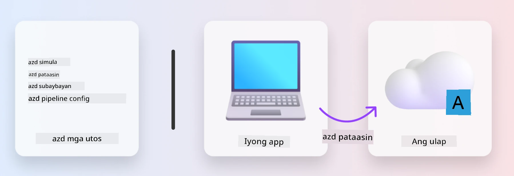
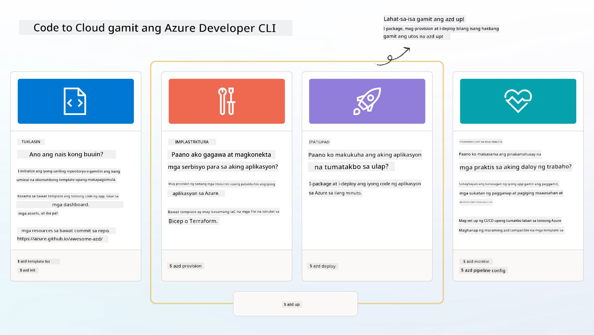

# 1. Select a Template

!!! tip "SA PAGTATAPOS NG MODULONG ITO, MAGAGAWA MO"

    - [ ] Ilarawan kung ano ang mga template ng AZD
    - [ ] Tuklasin at gamitin ang mga template ng AZD para sa AI
    - [ ] Magsimula sa template na AI Agents
    - [ ] **Lab 1:** AZD Quickstart gamit ang GitHub Codespaces

---

## 1. A Builder Analogy

Ang pagbuo ng isang makabagong, enterprise-ready na AI application _mula sa simula_ ay maaaring nakakakaba. Para itong pagbuo ng bagong bahay nang mag-isa, ladrilyo kada ladrilyo. Oo, posible ito! Ngunit hindi ito ang pinakamabisang paraan para makamit ang ninanais na resulta!

Sa halip, kadalasan nagsisimula tayo sa isang umiiral na _design blueprint_, at nakikipagtulungan sa isang arkitekto upang i-customize ito ayon sa ating personal na pangangailangan. At iyan din ang tamang lapit kapag nagtatayo ng mga intelligent na aplikasyon. Una, hanapin ang magandang disenyo ng arkitektura na akma sa iyong problemang hinaharap. Pagkatapos, makipagtulungan sa solution architect para i-customize at idebelop ang solusyon para sa iyong partikular na senaryo.

Ngunit saan natin mahahanap ang mga design blueprint na ito? At paano tayo makakahanap ng arkitektong handang magturo sa atin kung paano i-customize at i-deploy ang mga blueprint na ito nang mag-isa? Sa workshop na ito, sasagutin namin ang mga tanong na iyon sa pamamagitan ng pagpapakilala sa iyo sa tatlong teknolohiya:

1. [Azure Developer CLI](https://aka.ms/azd) - isang open-source na tool na nagpapabilis sa landas ng developer mula sa lokal na development (build) hanggang cloud deployment (ship).
1. [Microsoft Foundry Templates](https://ai.azure.com/templates) - standardized open-source repositories na naglalaman ng sample code, infrastructure at configuration files para sa pag-deploy ng isang AI solution architecture.
1. [GitHub Copilot Agent Mode](https://code.visualstudio.com/docs/copilot/chat/chat-agent-mode) - isang coding agent na naka-ground sa Azure knowledge, na makakatulong sa atin sa pag-navigate ng codebase at paggawa ng mga pagbabago gamit ang natural na wika.

Sa mga tool na ito, maaari na tayong _magtuklas_ ng tamang template, _i-deploy_ ito upang i-validate na gumagana, at _i-customize_ ito para umangkop sa ating partikular na mga senaryo. Halina't tuklasin at alamin kung paano ito gumagana.


---

## 2. Azure Developer CLI

Ang [Azure Developer CLI](https://learn.microsoft.com/en-us/azure/developer/azure-developer-cli/) (o `azd`) ay isang open-source na commandline tool na maaaring pabilisin ang iyong code-to-cloud na paglalakbay sa pamamagitan ng hanay ng mga developer-friendly na utos na gumagana nang pare-pareho sa iyong IDE (development) at CI/CD (devops) na mga kapaligiran.

Sa `azd`, ang iyong deployment na paglalakbay ay maaaring maging kasing simple ng:

- `azd init` - Nag-i-initialize ng bagong AI project mula sa umiiral na AZD template.
- `azd up` - Nagpo-provision ng imprastruktura at nag-de-deploy ng iyong application sa isang hakbang.
- `azd monitor` - Kumuha ng real-time na monitoring at diagnostics para sa iyong na-deploy na application.
- `azd pipeline config` - I-set up ang CI/CD pipelines para i-automate ang deployment sa Azure.

**🎯 | EXERCISE**: <br/> Tuklasin ang `azd` commandline tool sa iyong GitHub Codespaces na kapaligiran ngayon. Magsimula sa pag-type ng utos na ito upang makita kung ano ang kaya ng tool:

```bash title="" linenums="0"
azd help
```



---

## 3. The AZD Template

Para magawa ito ng `azd`, kailangan nitong malaman ang imprastruktura na ipo-provision, ang mga configuration settings na ipapatupad, at ang application na ide-deploy. Dito pumapasok ang [AZD templates](https://learn.microsoft.com/en-us/azure/developer/azure-developer-cli/azd-templates?tabs=csharp).

Ang mga AZD template ay mga open-source repositories na pinagsasama ang sample code sa mga imprastruktura at configuration files na kinakailangan para sa pag-deploy ng solution architecture.
Sa paggamit ng isang _Infrastructure-as-Code_ (IaC) na lapit, pinahihintulutan nila ang template resource definitions at configuration settings na ma-version-control (tulad ng app source code) - na lumilikha ng reusable at consistent na mga workflow para sa mga gumagamit ng proyektong iyon.

Kapag lumilikha o muling gumagamit ng isang AZD template para sa _iyong_ senaryo, isaalang-alang ang mga tanong na ito:

1. Ano ang binubuo mo? → Mayroon bang template na may starter code para sa senaryong iyon?
1. Paano naka-arkitektura ang iyong solusyon? → Mayroon bang template na may mga kinakailangang resources?
1. Paano dine-deploy ang iyong solusyon? → Isipin ang `azd deploy` na may pre/post-processing hooks!
1. Paano mo pa ito mai-o-optimize? → Isipin ang built-in na monitoring at automation pipelines!

**🎯 | EXERCISE**: <br/> 
Bisitahin ang [Awesome AZD](https://azure.github.io/awesome-azd/) gallery at gamitin ang mga filter upang tuklasin ang 250+ na mga template na kasalukuyang magagamit. Tingnan kung makakakita ka ng isang tumutugma sa _iyong_ mga kinakailangan sa senaryo.



---

## 4. AI App Templates

Para sa mga AI-powered na aplikasyon, nagbibigay ang Microsoft ng mga espesyal na template na tampok ang **Microsoft Foundry** at **Foundry Agents**. Pinapabilis ng mga template na ito ang iyong landas sa pagbuo ng mga intelligent, production-ready na aplikasyon.

### Microsoft Foundry & Foundry Agents Templates

Pumili ng template sa ibaba para i-deploy. Ang bawat template ay makikita sa [Awesome AZD](https://azure.github.io/awesome-azd/) at maaaring i-initialize gamit ang isang utos.

| Template | Paglalarawan | Deploy Command |
|----------|-------------|----------------|
| **[AI Chat with RAG](https://azure.github.io/awesome-azd/?tags=ai&tags=rag)** | Chat application na may Retrieval Augmented Generation gamit ang Microsoft Foundry | `azd init -t azure-samples/azure-search-openai-demo` |
| **[Foundry Agent Service Starter](https://azure.github.io/awesome-azd/?tags=ai&tags=agents)** | Gumawa ng mga AI agent gamit ang Foundry Agents para sa autonomous na pag-execute ng mga gawain | `azd init -t azure-samples/foundry-agent-service-starter` |
| **[Multi-Agent Orchestration](https://azure.github.io/awesome-azd/?tags=ai&tags=agents)** | I-coordinate ang maramihang Foundry Agents para sa mga kumplikadong workflow | `azd init -t azure-samples/multi-agent-orchestration` |
| **[AI Document Intelligence](https://azure.github.io/awesome-azd/?tags=ai&tags=document)** | Mag-extract at magsuri ng mga dokumento gamit ang mga modelo ng Microsoft Foundry | `azd init -t azure-samples/ai-document-processing` |
| **[Conversational AI Bot](https://azure.github.io/awesome-azd/?tags=ai&tags=bot)** | Bumuo ng mga intelligent na chatbot na may integration ng Microsoft Foundry | `azd init -t azure-samples/ai-chat-protocol` |
| **[AI Image Generation](https://azure.github.io/awesome-azd/?tags=ai&tags=dalle)** | Mag-generate ng mga imahe gamit ang DALL-E sa pamamagitan ng Microsoft Foundry | `azd init -t azure-samples/ai-image-generation` |
| **[Semantic Kernel Agent](https://azure.github.io/awesome-azd/?tags=ai&tags=semantic-kernel)** | Mga AI agent na gumagamit ng Semantic Kernel kasama ang Foundry Agents | `azd init -t azure-samples/semantic-kernel-agent` |
| **[AutoGen Multi-Agent](https://azure.github.io/awesome-azd/?tags=ai&tags=autogen)** | Mga multi-agent na sistema gamit ang AutoGen framework | `azd init -t azure-samples/autogen-multi-agent` |

### Mabilis na Pagsisimula

1. **Mag-browse ng mga template**: Bisitahin ang [https://azure.github.io/awesome-azd/](https://azure.github.io/awesome-azd/) at i-filter ayon sa `AI`, `Agents`, o `Microsoft Foundry`
2. **Pumili ng iyong template**: Piliin ang tumutugma sa iyong use case
3. **I-initialize**: Patakbuhin ang `azd init` na utos para sa napili mong template
4. **I-deploy**: Patakbuhin ang `azd up` para mag-provision at mag-deploy

**🎯 | EXERCISE**: <br/>
Pumili ng isa sa mga template sa itaas batay sa iyong senaryo:

- **Nagtatayo ng chatbot?** → Magsimula sa **AI Chat with RAG** o **Conversational AI Bot**
- **Kailangan ng autonomous agents?** → Subukan ang **Foundry Agent Service Starter** o **Multi-Agent Orchestration**
- **Nagpo-proseso ng mga dokumento?** → Gamitin ang **AI Document Intelligence**
- **Nais ng AI coding assistance?** → Tuklasin ang **Semantic Kernel Agent** o **AutoGen Multi-Agent**

```bash title="Example: Deploy the AI Chat with RAG template" linenums="0"
azd init -t azure-samples/azure-search-openai-demo
azd up
```

!!! info "Tuklasin pa ang Iba pang mga Template"
    Ang [Awesome AZD Gallery](https://azure.github.io/awesome-azd/) ay naglalaman ng 250+ na mga template. Gamitin ang mga filter upang hanapin ang mga template na tumutugma sa iyong mga partikular na kinakailangan para sa wika, framework, at mga serbisyo ng Azure.

---

<!-- CO-OP TRANSLATOR DISCLAIMER START -->
Paunawa:
Ang dokumentong ito ay isinalin gamit ang AI na serbisyo sa pagsasalin [Co-op Translator](https://github.com/Azure/co-op-translator). Bagaman sinisikap naming maging tumpak, pakitandaan na ang awtomatikong pagsasalin ay maaaring maglaman ng mga pagkakamali o hindi pagkakatumpak. Ang orihinal na dokumento sa orihinal nitong wika ang dapat ituring bilang pinagmumulan ng awtoridad. Para sa mga kritikal na impormasyon, inirerekomenda ang propesyonal na pagsasalin ng tao. Hindi kami mananagot sa anumang hindi pagkakaunawaan o maling interpretasyon na magmumula sa paggamit ng pagsasaling ito.
<!-- CO-OP TRANSLATOR DISCLAIMER END -->