# 2. I-validate ang Template

!!! tip "SA DULO NG MODULE NA ITO, MAGIGING KAYA MO NA"

    - [ ] Suriin ang Arkitektura ng Solusyon ng AI
    - [ ] Unawain ang Workflow ng AZD Deployment
    - [ ] Gumamit ng GitHub Copilot para sa tulong sa paggamit ng AZD
    - [ ] **Lab 2:** I-deploy at I-validate ang template ng AI Agents

---

## 1. Panimula

Ang [Azure Developer CLI](https://learn.microsoft.com/en-us/azure/developer/azure-developer-cli/) o `azd` ay isang open-source na commandline tool na nagpapadali sa workflow ng developer kapag gumagawa at nagde-deploy ng mga application sa Azure.

Ang [AZD Templates](https://learn.microsoft.com/azure/developer/azure-developer-cli/azd-templates) ay mga standardized na repository na naglalaman ng sample na application code, _infrastructure as code_ assets, at mga configuration file ng `azd` para sa isang cohesive na arkitektura ng solusyon. Ang pag-provision ng infrastructure ay nagiging kasing simple ng isang `azd provision` na command - habang ang paggamit ng `azd up` ay nagbibigay-daan sa iyo na mag-provision ng infrastructure **at** mag-deploy ng iyong application sa isang hakbang!

Dahil dito, ang pagsisimula ng proseso ng pag-develop ng iyong application ay maaaring kasing simple ng paghahanap ng tamang _AZD Starter template_ na pinakamalapit sa iyong pangangailangan sa application at infrastructure - pagkatapos ay i-customize ang repository upang umangkop sa iyong mga kinakailangan sa senaryo.

Bago tayo magsimula, tiyakin nating naka-install ang Azure Developer CLI.

1. Buksan ang terminal ng VS Code at i-type ang command na ito:

      ```bash title="" linenums="0"
      azd version
      ```

1. Makikita mo ang ganito!

      ```bash title="" linenums="0"
      azd version 1.19.0 (commit b3d68cea969b2bfbaa7b7fa289424428edb93e97)
      ```

**Handa ka na ngayong pumili at mag-deploy ng template gamit ang azd**

---

## 2. Pagpili ng Template

Ang Azure AI Foundry platform ay may [set ng mga inirerekomendang AZD templates](https://learn.microsoft.com/en-us/azure/ai-foundry/how-to/develop/ai-template-get-started) na sumasaklaw sa mga popular na senaryo ng solusyon tulad ng _multi-agent workflow automation_ at _multi-modal content processing_. Maaari mo ring matuklasan ang mga template na ito sa pamamagitan ng pagbisita sa Azure AI Foundry portal.

1. Bisitahin ang [https://ai.azure.com/templates](https://ai.azure.com/templates)
1. Mag-log in sa Azure AI Foundry portal kapag na-prompt - makikita mo ang ganito.

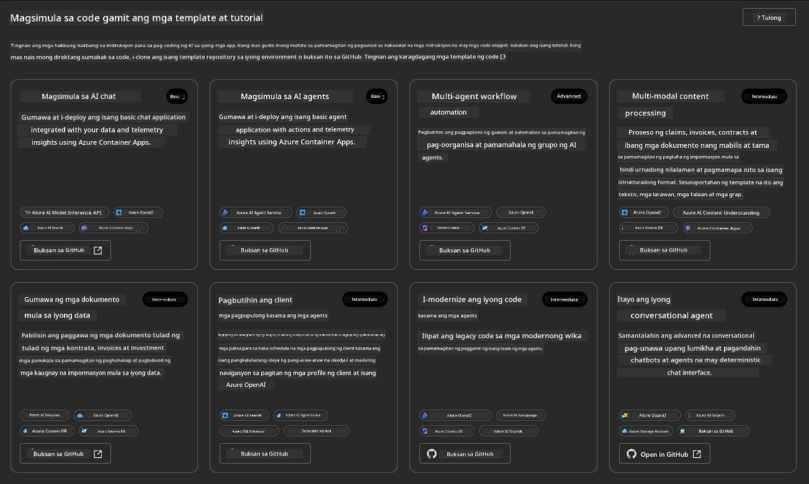

Ang mga **Basic** na opsyon ay ang iyong mga starter templates:

1. [ ] [Get Started with AI Chat](https://github.com/Azure-Samples/get-started-with-ai-chat) na nagde-deploy ng isang basic na chat application _kasama ang iyong data_ sa Azure Container Apps. Gamitin ito upang tuklasin ang isang basic na senaryo ng AI chatbot.
1. [X] [Get Started with AI Agents](https://github.com/Azure-Samples/get-started-with-ai-agents) na nagde-deploy din ng isang standard na AI Agent (kasama ang Azure AI Agent Service). Gamitin ito upang maging pamilyar sa mga solusyon ng agentic AI na may kasamang mga tools at models.

Bisitahin ang pangalawang link sa isang bagong tab ng browser (o i-click ang `Open in GitHub` para sa kaugnay na card). Makikita mo ang repository para sa AZD Template na ito. Maglaan ng isang minuto upang suriin ang README. Ang arkitektura ng application ay ganito:

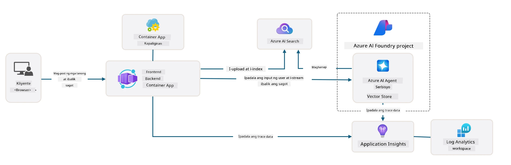

---

## 3. Pag-activate ng Template

Subukan nating i-deploy ang template na ito at tiyakin na ito ay valid. Sundin natin ang mga gabay sa [Getting Started](https://github.com/Azure-Samples/get-started-with-ai-agents?tab=readme-ov-file#getting-started) na seksyon.

1. I-click ang [link na ito](https://github.com/codespaces/new/Azure-Samples/get-started-with-ai-agents) - kumpirmahin ang default na aksyon na `Create codespace`
1. Magbubukas ito ng bagong tab ng browser - hintayin ang GitHub Codespaces session na matapos ang pag-load
1. Buksan ang terminal ng VS Code sa Codespaces - i-type ang sumusunod na command:

   ```bash title="" linenums="0"
   azd up
   ```

Kumpletuhin ang mga hakbang sa workflow na ito:

1. Ipa-prompt kang mag-log in sa Azure - sundin ang mga tagubilin upang mag-authenticate
1. Maglagay ng natatanging pangalan ng environment para sa iyo - halimbawa, ginamit ko ang `nitya-mshack-azd`
1. Ito ay lilikha ng isang `.azure/` folder - makikita mo ang isang subfolder na may pangalan ng environment
1. Ipa-prompt kang pumili ng pangalan ng subscription - piliin ang default
1. Ipa-prompt kang pumili ng lokasyon - gamitin ang `East US 2`

Ngayon, hintayin ang pag-provision na makumpleto. **Ito ay tumatagal ng 10-15 minuto**

1. Kapag tapos na, ang iyong console ay magpapakita ng SUCCESS message na ganito:
      ```bash title="" linenums="0"
      SUCCESS: Your up workflow to provision and deploy to Azure completed in 10 minutes 17 seconds.
      ```
1. Ang iyong Azure Portal ay magkakaroon na ng provisioned resource group na may pangalan ng environment:

      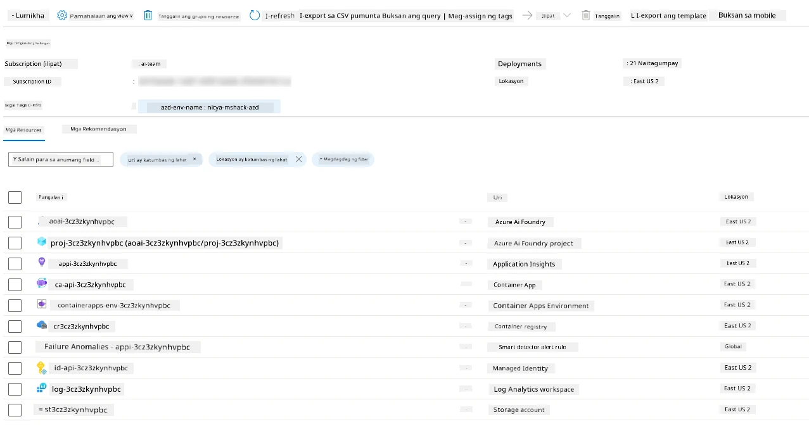

1. **Handa ka na ngayong i-validate ang na-deploy na infrastructure at application**.

---

## 4. Pag-validate ng Template

1. Bisitahin ang Azure Portal [Resource Groups](https://portal.azure.com/#browse/resourcegroups) page - mag-log in kapag na-prompt
1. I-click ang RG para sa pangalan ng iyong environment - makikita mo ang page sa itaas

      - i-click ang Azure Container Apps resource
      - i-click ang Application Url sa _Essentials_ section (kanang itaas)

1. Makikita mo ang isang hosted application front-end UI na ganito:

   

1. Subukan ang ilang [sample na tanong](https://github.com/Azure-Samples/get-started-with-ai-agents/blob/main/docs/sample_questions.md)

      1. Magtanong: ```Ano ang kapital ng France?``` 
      1. Magtanong: ```Ano ang pinakamahusay na tent sa ilalim ng $200 para sa dalawang tao, at ano ang mga tampok nito?```

1. Makakakuha ka ng mga sagot na katulad ng ipinapakita sa ibaba. _Pero paano ito gumagana?_ 

      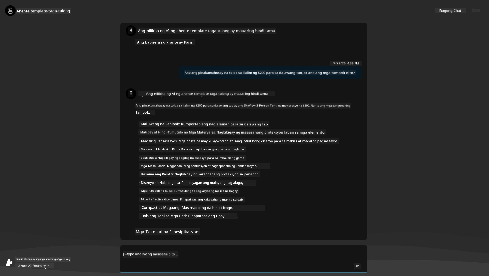

---

## 5. Pag-validate ng Agent

Ang Azure Container App ay nagde-deploy ng isang endpoint na kumokonekta sa AI Agent na na-provision sa Azure AI Foundry project para sa template na ito. Tingnan natin kung ano ang ibig sabihin nito.

1. Bumalik sa Azure Portal _Overview_ page para sa iyong resource group

1. I-click ang `Azure AI Foundry` resource sa listahan

1. Makikita mo ito. I-click ang `Go to Azure AI Foundry Portal` button. 
   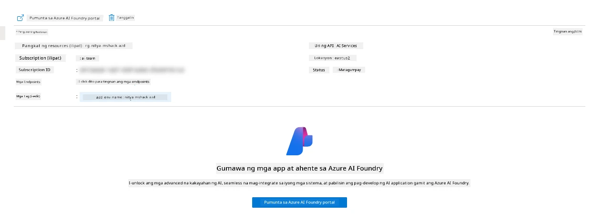

1. Makikita mo ang Foundry Project page para sa iyong AI application
   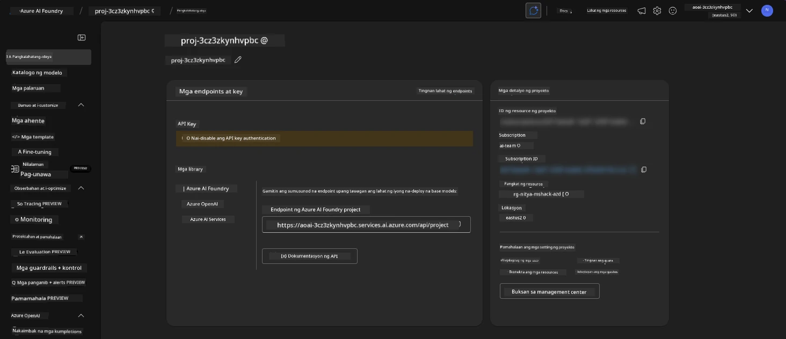

1. I-click ang `Agents` - makikita mo ang default na Agent na na-provision sa iyong project
   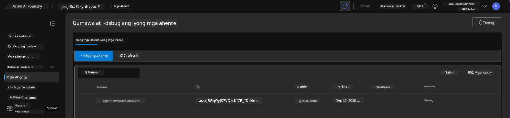

1. Piliin ito - at makikita mo ang mga detalye ng Agent. Tandaan ang sumusunod:

      - Ang agent ay gumagamit ng File Search bilang default (palagi)
      - Ang `Knowledge` ng agent ay nagpapahiwatig na mayroon itong 32 files na na-upload (para sa file search)
      

1. Hanapin ang opsyon na `Data+indexes` sa kaliwang menu at i-click para sa mga detalye. 

      - Makikita mo ang 32 data files na na-upload para sa knowledge.
      - Ang mga ito ay tumutugma sa 12 customer files at 20 product files sa ilalim ng `src/files` 
      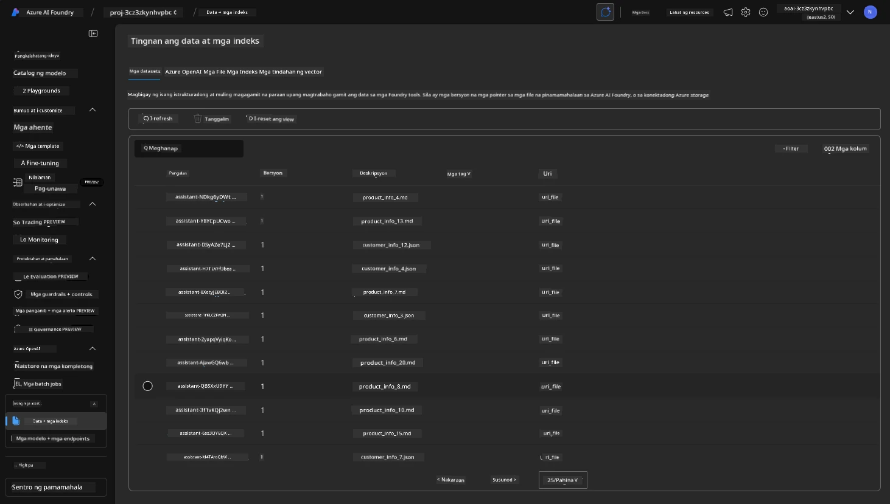

**Na-validate mo ang operasyon ng Agent!** 

1. Ang mga sagot ng agent ay nakabatay sa knowledge sa mga file na iyon. 
1. Maaari ka nang magtanong na may kaugnayan sa data na iyon, at makakuha ng grounded na mga sagot.
1. Halimbawa: Ang `customer_info_10.json` ay naglalarawan ng 3 pagbili na ginawa ni "Amanda Perez"

Balikan ang tab ng browser na may Container App endpoint at magtanong: `Anong mga produkto ang pag-aari ni Amanda Perez?`. Makikita mo ang ganito:

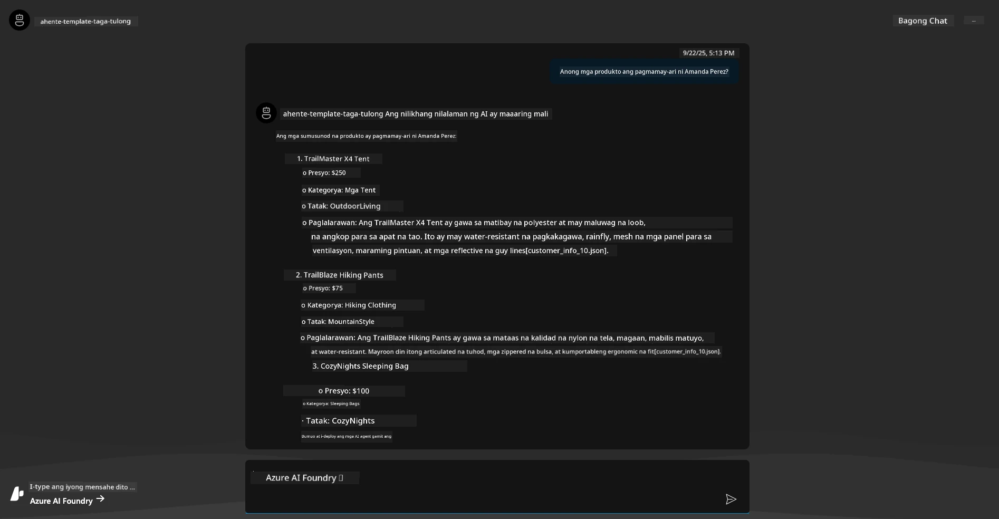

---

## 6. Agent Playground

Subukan nating palawakin ang ating kaalaman sa mga kakayahan ng Azure AI Foundry, sa pamamagitan ng paggamit ng Agent sa Agents Playground. 

1. Bumalik sa `Agents` page sa Azure AI Foundry - piliin ang default na agent
1. I-click ang opsyon na `Try in Playground` - makakakuha ka ng Playground UI na ganito
1. Magtanong ng parehong tanong: `Anong mga produkto ang pag-aari ni Amanda Perez?`

    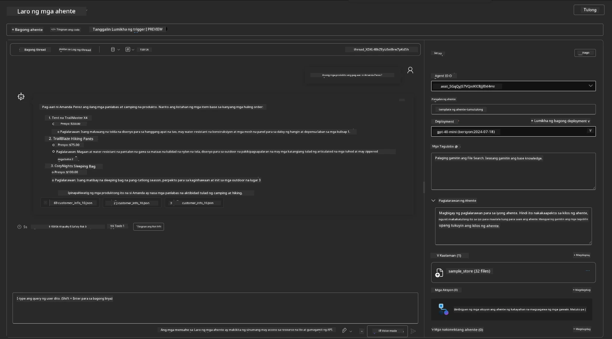

Makakakuha ka ng parehong (o katulad) na sagot - ngunit makakakuha ka rin ng karagdagang impormasyon na magagamit mo upang maunawaan ang kalidad, gastos, at performance ng iyong agentic app. Halimbawa:

1. Tandaan na ang sagot ay nagbabanggit ng mga data file na ginamit upang "ground" ang sagot
1. I-hover ang anumang label ng file - tumutugma ba ang data sa iyong query at ipinakitang sagot?

Makikita mo rin ang isang _stats_ row sa ibaba ng sagot. 

1. I-hover ang anumang metric - halimbawa, Safety. Makikita mo ang ganito
1. Tumutugma ba ang na-assess na rating sa iyong intuition para sa safety level ng sagot?

      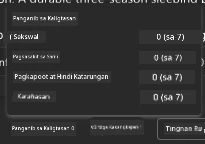

---x

## 7. Built-in Observability

Ang Observability ay tungkol sa pag-iinstrument ng iyong application upang makabuo ng data na magagamit upang maunawaan, ma-debug, at ma-optimize ang mga operasyon nito. Upang makakuha ng ideya tungkol dito:

1. I-click ang `View Run Info` button - makikita mo ang view na ito. Ito ay isang halimbawa ng [Agent tracing](https://learn.microsoft.com/en-us/azure/ai-foundry/how-to/develop/trace-agents-sdk#view-trace-results-in-the-azure-ai-foundry-agents-playground) na gumagana. _Maaari mo ring makuha ang view na ito sa pamamagitan ng pag-click sa Thread Logs sa top-level menu_.

   - Makakuha ng ideya tungkol sa mga hakbang sa run at mga tools na ginamit ng agent
   - Unawain ang kabuuang Token count (vs. paggamit ng output tokens) para sa sagot
   - Unawain ang latency at kung saan ginugugol ang oras sa execution

      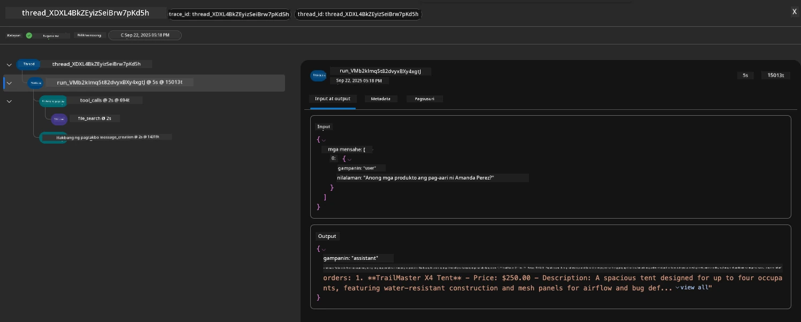

1. I-click ang `Metadata` tab upang makita ang karagdagang attributes para sa run, na maaaring magbigay ng kapaki-pakinabang na konteksto para sa pag-debug ng mga isyu sa hinaharap.   

      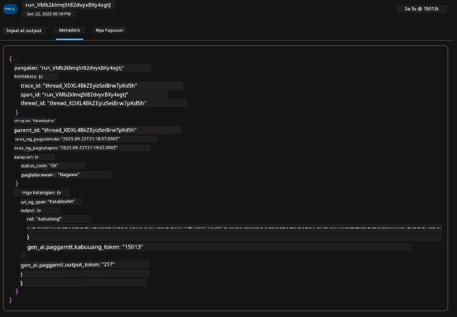

1. I-click ang `Evaluations` tab upang makita ang mga auto-assessments na ginawa sa sagot ng agent. Kasama dito ang mga safety evaluations (hal., Self-harm) at mga agent-specific evaluations (hal., Intent resolution, Task adherence).

      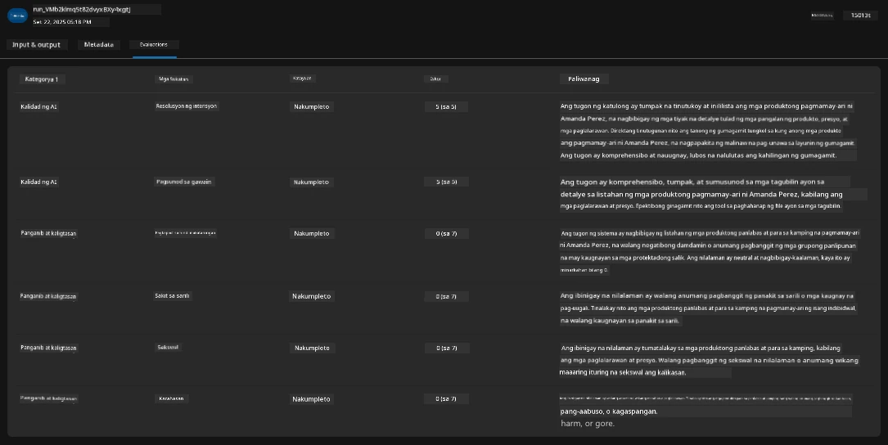

1. Panghuli, i-click ang `Monitoring` tab sa sidebar menu.

      - Piliin ang `Resource usage` tab sa ipinakitang page - at tingnan ang mga metrics.
      - Subaybayan ang paggamit ng application sa mga tuntunin ng gastos (tokens) at load (requests).
      - Subaybayan ang latency ng application mula sa unang byte (input processing) hanggang sa huling byte (output).

      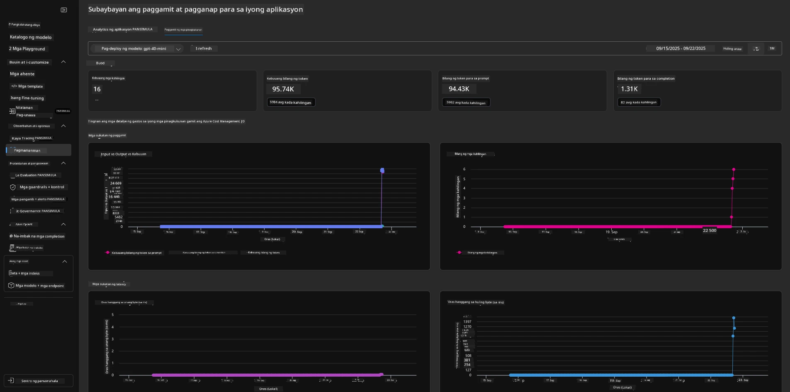

---

## 8. Environment Variables

Sa ngayon, nadaanan na natin ang deployment sa browser - at na-validate na ang ating infrastructure ay na-provision at ang application ay operational. Ngunit upang magtrabaho sa application _code-first_, kailangan nating i-configure ang ating lokal na development environment gamit ang mga kaugnay na variables na kinakailangan upang magtrabaho sa mga resources na ito. Ang paggamit ng `azd` ay nagpapadali nito.

1. Ang Azure Developer CLI [ay gumagamit ng environment variables](https://learn.microsoft.com/en-us/azure/developer/azure-developer-cli/manage-environment-variables?tabs=bash) upang mag-imbak at mag-manage ng mga configuration settings para sa mga application deployments.

1. Ang environment variables ay naka-imbak sa `.azure/<env-name>/.env` - ito ay nag-scope sa kanila sa `env-name` environment na ginamit sa deployment at tumutulong sa iyo na i-isolate ang mga environment sa pagitan ng iba't ibang deployment targets sa parehong repo.

1. Ang environment variables ay awtomatikong na-load ng `azd` command tuwing ito ay nag-e-execute ng isang partikular na command (hal., `azd up`). Tandaan na ang `azd` ay hindi awtomatikong nagbabasa ng _OS-level_ environment variables (hal., set sa shell) - sa halip, gamitin ang `azd set env` at `azd get env` upang maglipat ng impormasyon sa loob ng mga script.

Subukan natin ang ilang mga command:

1. Kunin ang lahat ng environment variables na na-set para sa `azd` sa environment na ito:

      ```bash title="" linenums="0"
      azd env get-values
      ```
      
      Makikita mo ang ganito:

      ```bash title="" linenums="0"
      AZURE_AI_AGENT_DEPLOYMENT_NAME="gpt-4o-mini"
      AZURE_AI_AGENT_NAME="agent-template-assistant"
      AZURE_AI_EMBED_DEPLOYMENT_NAME="text-embedding-3-small"
      AZURE_AI_EMBED_DIMENSIONS=100
      ...
      ```

1. Kunin ang isang partikular na value - halimbawa, gusto kong malaman kung na-set natin ang `AZURE_AI_AGENT_MODEL_NAME` value

      ```bash title="" linenums="0"
      azd env get-value AZURE_AI_AGENT_MODEL_NAME 
      ```
      
      Makikita mo ang ganito - hindi ito na-set bilang default!

      ```bash title="" linenums="0"
      ERROR: key 'AZURE_AI_AGENT_MODEL_NAME' not found in the environment values
      ```

1. Mag-set ng bagong environment variable para sa `azd`. Dito, ina-update natin ang agent model name. _Tandaan: anumang pagbabago na ginawa ay agad na makikita sa `.azure/<env-name>/.env` file.

      ```bash title="" linenums="0"
      azd env set AZURE_AI_AGENT_MODEL_NAME gpt-4.1
      azd env set AZURE_AI_AGENT_MODEL_VERSION 2025-04-14
      azd env set AZURE_AI_AGENT_DEPLOYMENT_CAPACITY 150
      ```

      Ngayon, dapat nating makita na ang value ay na-set:

      ```bash title="" linenums="0"
      azd env get-value AZURE_AI_AGENT_MODEL_NAME 
      ```

1. Tandaan na ang ilang resources ay persistent (hal., model deployments) at mangangailangan ng higit pa sa isang `azd up` upang pilitin ang redeployment. Subukan nating i-tear down ang orihinal na deployment at i-redeploy gamit ang mga binagong env vars.

1. **Refresh** Kung dati kang nag-deploy ng infrastructure gamit ang isang azd template - maaari mong _i-refresh_ ang estado ng iyong lokal na environment variables batay sa kasalukuyang estado ng iyong Azure deployment gamit ang command na ito:
      ```bash title="" linenums="0"
      azd env refresh
      ```

      Ito ay isang makapangyarihang paraan upang _i-sync_ ang mga environment variable sa pagitan ng dalawa o higit pang lokal na development environments (halimbawa, team na may maraming developer) - pinapayagan ang deployed infrastructure na magsilbing pangunahing batayan para sa estado ng mga environment variable. Ang mga miyembro ng team ay simpleng mag-_refresh_ ng mga variable upang muling mag-sync.

---

## 9. Binabati Kita 🏆

Natapos mo na ang isang end-to-end workflow kung saan:

- [X] Pinili mo ang AZD Template na nais mong gamitin
- [X] Inilunsad ang Template gamit ang GitHub Codespaces
- [X] Na-deploy ang Template at na-validate na gumagana ito

---

