# 2. I-validate ang isang Template

!!! tip "SA PAGWAWAKAS NG MODULONG ITO AY MAGAGAWA MO"

    - [ ] Analyze the AI Solution Architecture
    - [ ] Understand the AZD Deployment Workflow
    - [ ] Use GitHub Copilot to get help on AZD usage
    - [ ] **Lab 2:** Deploy & Validate the AI Agents template

---


## 1. Panimula

The [Azure Developer CLI](https://learn.microsoft.com/en-us/azure/developer/azure-developer-cli/) or `azd` ay isang open-source commandline tool na nagpapasimple sa developer workflow kapag bumubuo at nag-de-deploy ng mga application sa Azure. 

[AZD Templates](https://learn.microsoft.com/azure/developer/azure-developer-cli/azd-templates) ay mga standardized na repositoryo na naglalaman ng sample application code, _infrastructure-as-code_ assets, at `azd` configuration files para sa isang magkakaugnay na solution architecture. Ang pag-provision ng infrastructure ay nagiging kasing simple ng isang `azd provision` na utos - habang ang paggamit ng `azd up` ay nagpapahintulot sa iyo na mag-provision ng infrastructure **at** i-deploy ang iyong application nang sabay!

Bilang resulta, ang pagpapasimula ng iyong proseso ng pag-develop ng application ay maaaring kasing dali ng paghahanap ng tamang _AZD Starter template_ na pinakamalapit sa iyong pangangailangan sa application at infrastructure - at pagkatapos ay i-customize ang repository upang umangkop sa mga kinakailangan ng iyong senaryo.

Bago tayo magsimula, tiyakin natin na naka-install ang Azure Developer CLI.

1. Buksan ang terminal ng VS Code at i-type ang utos na ito:

      ```bash title="" linenums="0"
      azd version
      ```

1. Dapat kang makakita ng ganito!

      ```bash title="" linenums="0"
      azd version 1.19.0 (commit b3d68cea969b2bfbaa7b7fa289424428edb93e97)
      ```

**Handa ka na ngayong pumili at mag-deploy ng template gamit ang azd**

---

## 2. Pagpili ng Template

Ang Microsoft Foundry platform ay may kasamang [set of recommended AZD templates](https://learn.microsoft.com/en-us/azure/ai-foundry/how-to/develop/ai-template-get-started) na sumasaklaw sa mga popular na solution scenarios tulad ng _multi-agent workflow atomation_ at _multi-modal content processing_. Maaari mo ring matuklasan ang mga template na ito sa pagbisita sa Microsoft Foundry portal.

1. Visit [https://ai.azure.com/templates](https://ai.azure.com/templates)
1. Log into the Microsoft Foundry portal when prompted - makakakita ka ng ganito.

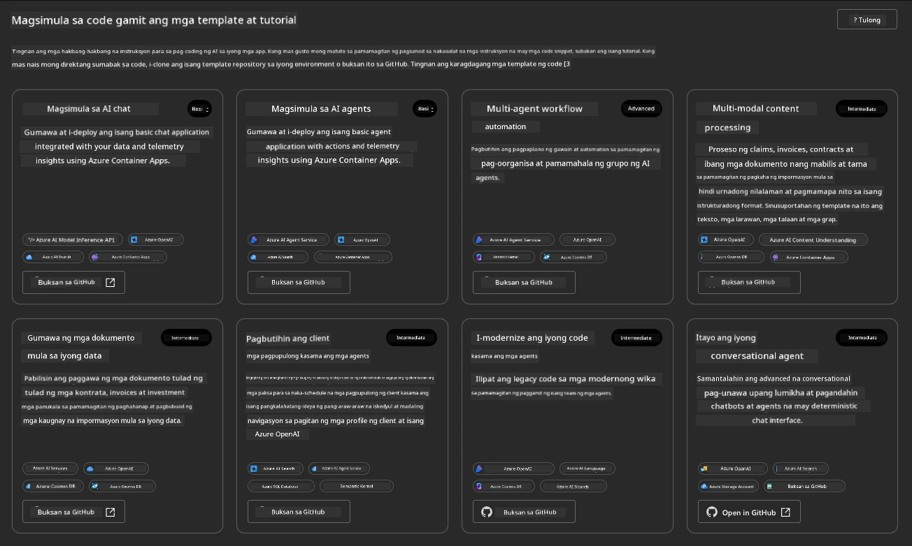


Ang **Basic** na mga opsyon ay ang iyong starter templates:

1. [ ] [Get Started with AI Chat](https://github.com/Azure-Samples/get-started-with-ai-chat) that deploys a basic chat application _with your data_ to Azure Container Apps. Use this to explore a basic AI chatbot scenario.
1. [X] [Get Started with AI Agents](https://github.com/Azure-Samples/get-started-with-ai-agents) that also deploys a standard AI Agent (with the Foundry Agents). Use this to get familiar with agentic AI solutions involving tools and models.

Buksan ang pangalawang link sa isang bagong tab ng browser (o i-click ang `Open in GitHub` para sa kaugnay na card). Makikita mo ang repositoryo para sa AZD Template na ito. Maglaan ng sandali upang tuklasin ang README. Ganito ang hitsura ng architecture ng application:

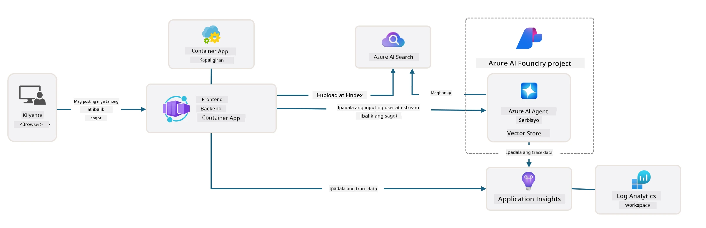

---

## 3. Pag-activate ng Template

Subukan natin i-deploy ang template na ito at tiyakin na ito ay valid. Susundin natin ang mga gabay sa seksyong [Getting Started](https://github.com/Azure-Samples/get-started-with-ai-agents?tab=readme-ov-file#getting-started).

1. I-click ang [this link](https://github.com/codespaces/new/Azure-Samples/get-started-with-ai-agents) - kumpirmahin ang default na aksyon na `Create codespace`
1. Magbubukas ito ng bagong tab sa browser - maghintay hanggang matapos mag-load ang GitHub Codespaces session
1. Buksan ang VS Code terminal sa Codespaces - i-type ang sumusunod na utos:

   ```bash title="" linenums="0"
   azd up
   ```

Kumpletuhin ang mga hakbang ng workflow na ito:

1. Hihilingin sa iyo na mag-log in sa Azure - sundin ang mga instruksyon para mag-authenticate
1. Mag-enter ng natatanging pangalan ng environment para sa iyo - hal., ginamit ko ang `nitya-mshack-azd`
1. Ito ay lilikha ng isang `.azure/` folder - makikita mo ang isang subfolder na may pangalan ng env
1. Hihilingin sa iyo na pumili ng subscription name - piliin ang default
1. Hihilingin sa iyo ang lokasyon - gamitin ang `East US 2`

Ngayon, maghihintay ka para sa pagkumpleto ng provisioning. **Ito ay tumatagal ng 10-15 minuto**

1. Kapag tapos na, magpapakita ang iyong console ng isang SUCCESS message na ganito:
      ```bash title="" linenums="0"
      SUCCESS: Your up workflow to provision and deploy to Azure completed in 10 minutes 17 seconds.
      ```
1. Ang iyong Azure Portal ngayon ay magkakaroon ng isang provisioned resource group na may pangalang iyon:

      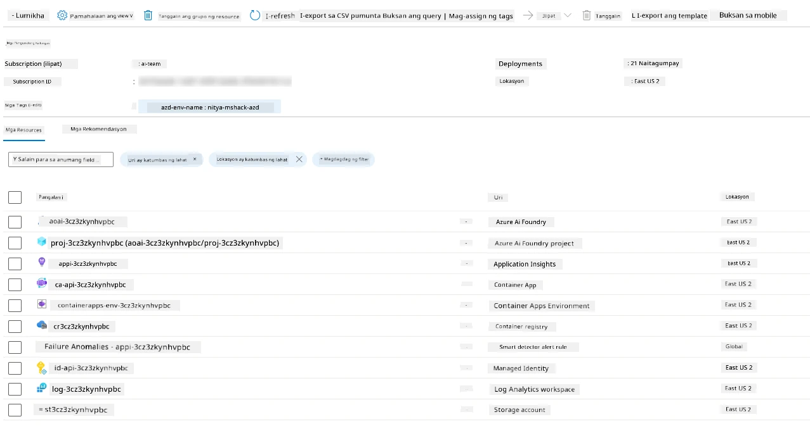

1. **Handa ka na ngayong i-validate ang na-deploy na infrastructure at application**.

---

## 4. Pag-validate ng Template

1. Bisitahin ang Azure Portal [Resource Groups](https://portal.azure.com/#browse/resourcegroups) page - mag-log in kapag hinihingi
1. I-click ang RG para sa iyong environment name - makikita mo ang pahina sa itaas

      - i-click ang Azure Container Apps resource
      - i-click ang Application Url sa seksyong _Essentials_ (itaas na kanan)

1. Makakakita ka ng naka-host na front-end UI ng application na ganito:

   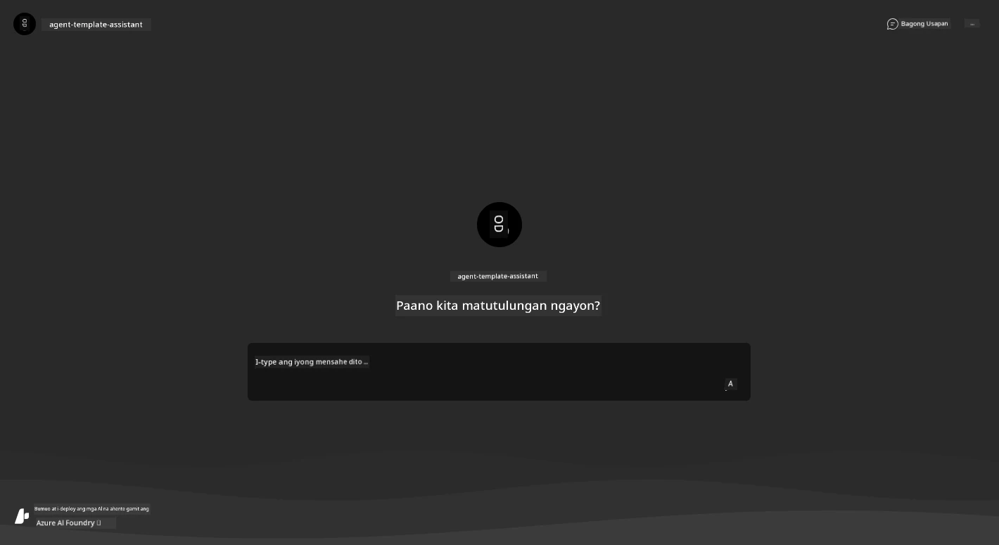

1. Subukang magtanong ng ilang [sample questions](https://github.com/Azure-Samples/get-started-with-ai-agents/blob/main/docs/sample_questions.md)

      1. Ask: ```What is the capital of France?``` 
      1. Ask: ```What's the best tent under $200 for two people, and what features does it include?```

1. Dapat kang makakuha ng mga sagot na katulad ng ipinapakita sa ibaba. _Pero paano ito gumagana?_ 

      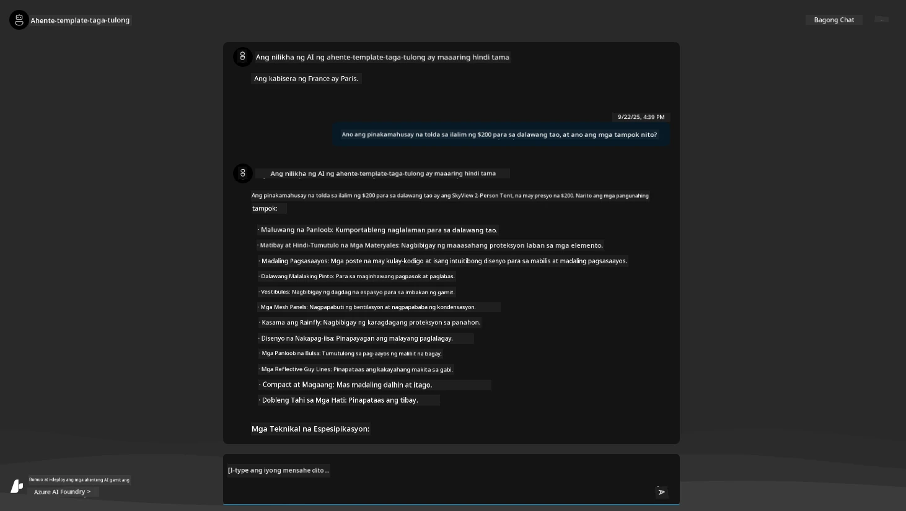

---

## 5.  Pag-validate ng Agent

Ang Azure Container App ay nag-de-deploy ng isang endpoint na kumokonekta sa AI Agent na na-provision sa Microsoft Foundry project para sa template na ito. Tingnan natin kung ano ang ibig sabihin nito.

1. Bumalik sa Azure Portal _Overview_ page para sa iyong resource group

1. I-click ang `Microsoft Foundry` resource sa listahang iyon

1. Makikita mo ito. I-click ang `Go to Microsoft Foundry Portal` button. 
   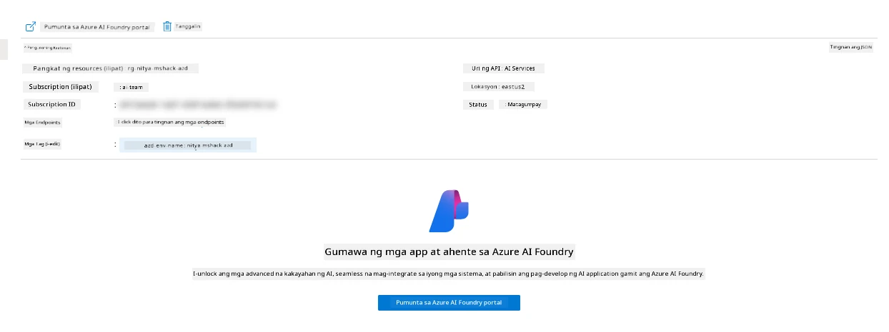

1. Makikita mo ang Foundry Project page para sa iyong AI application
   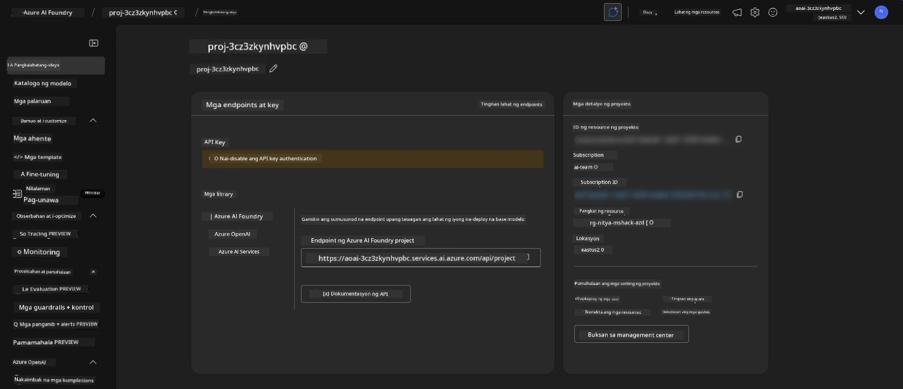

1. I-click ang `Agents` - makikita mo ang default Agent na na-provision sa iyong proyekto
   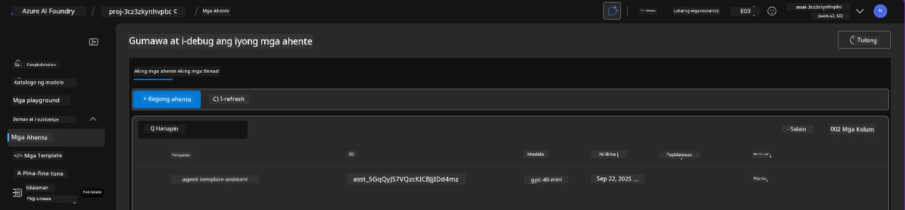

1. Piliin ito - at makikita mo ang detalye ng Agent. Pansinin ang mga sumusunod:

      - Ang agent ay gumagamit ng File Search bilang default (palaging)
      - Ipinapakita ng agent `Knowledge` na mayroon itong 32 files na na-upload (para sa file search)
      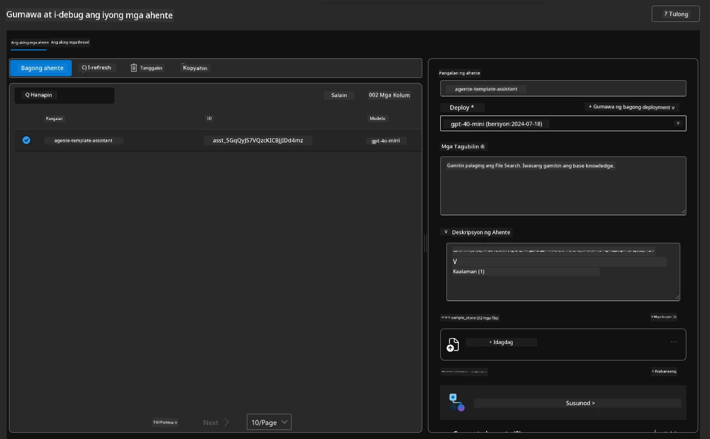

1. Hanapin ang option na `Data+indexes` sa kaliwang menu at i-click para sa mga detalye. 

      - Makikita mo ang 32 data files na na-upload para sa knowledge.
      - Ito ay tumutugma sa 12 customer files at 20 product files sa ilalim ng `src/files` 
      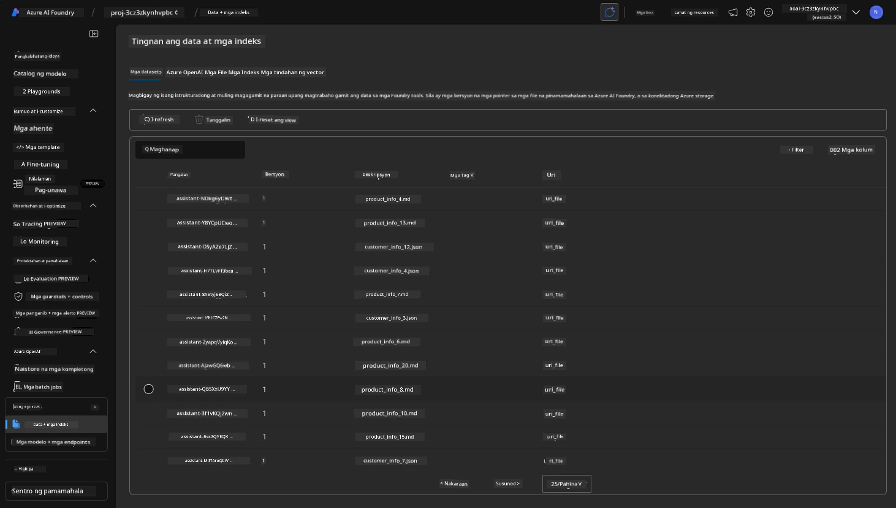

**Na-validate mo ang operasyon ng Agent!** 

1. Ang mga sagot ng agent ay nakabatay sa knowledge sa mga files na iyon. 
1. Maaari ka nang magtanong tungkol sa data na iyon, at makakuha ng naka-ground na mga sagot.
1. Halimbawa: `customer_info_10.json` ay naglalarawan ng 3 purchases na ginawa ni "Amanda Perez"

Bumalik sa browser tab na may Container App endpoint at itanong: `What products does Amanda Perez own?`. Dapat kang makakita ng ganito:

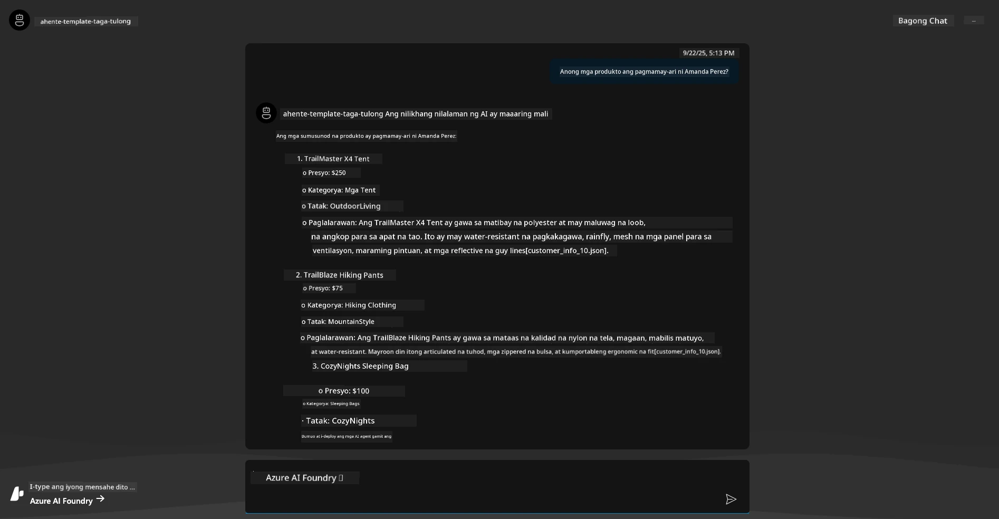

---

## 6. Playground ng Agent

Buo tayo ng kaunting intuwisyon para sa mga kakayahan ng Microsoft Foundry, sa pamamagitan ng pagpapagana ng Agent sa Agents Playground. 

1. Bumalik sa `Agents` page sa Microsoft Foundry - piliin ang default agent
1. I-click ang `Try in Playground` option - makakakuha ka ng Playground UI na ganito
1. Itanong ang parehong tanong: `What products does Amanda Perez own?`

    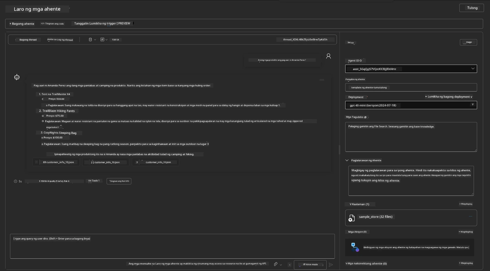

Makukuha mo ang parehong (o katulad na) sagot - ngunit nakakakuha ka rin ng karagdagang impormasyon na maaari mong gamitin upang maunawaan ang kalidad, gastos, at performance ng iyong agentic app. Halimbawa:

1. Pansinin na ang sagot ay nagtutukoy ng mga data files na ginamit para “i-ground” ang sagot
1. I-hover ang alinman sa mga label ng file na ito - tumutugma ba ang data sa iyong query at ipinakitang sagot?

Makikita mo rin ang isang _stats_ na hilera sa ilalim ng sagot. 

1. I-hover ang alinmang metric - hal., Safety. Makakakita ka ng ganito
1. Tumutugma ba ang na-assess na rating sa iyong intuwisyon para sa antas ng kaligtasan ng sagot?

      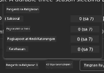

---

## 7. Nakapaloob na Observability

Ang observability ay tungkol sa pag-iinstrument ng iyong application upang makabuo ng data na maaaring gamitin upang maunawaan, i-debug, at i-optimize ang operasyon nito. Upang magkaroon ng ideya tungkol dito:

1. I-click ang `View Run Info` button - makikita mo ang view na ito. Ito ay isang halimbawa ng [Agent tracing](https://learn.microsoft.com/en-us/azure/ai-foundry/how-to/develop/trace-agents-sdk#view-trace-results-in-the-azure-ai-foundry-agents-playground) sa aksyon. _Makukuha mo rin ang view na ito sa pamamagitan ng pag-click ng Thread Logs sa top-level menu_.

   - Makakuha ng pakiramdam para sa mga run steps at mga tool na ginamit ng agent
   - Unawain ang kabuuang Token count (kumpara sa output tokens usage) para sa sagot
   - Unawain ang latency at kung saan ginugugol ang oras sa pagpapatupad

      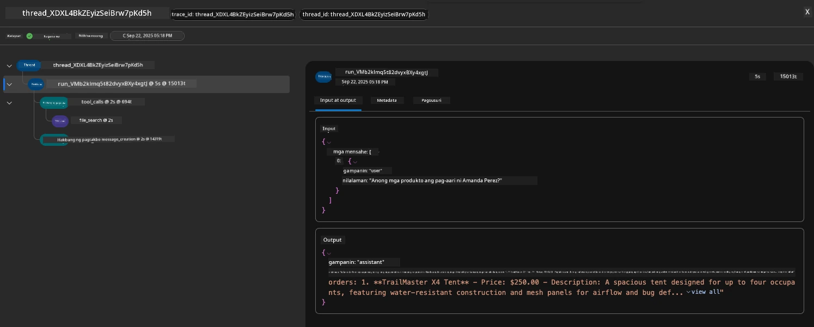

1. I-click ang `Metadata` tab upang makita ang karagdagang attributes para sa run, na maaaring magbigay ng kapaki-pakinabang na konteksto para sa pag-debug ng mga isyu sa hinaharap.   

      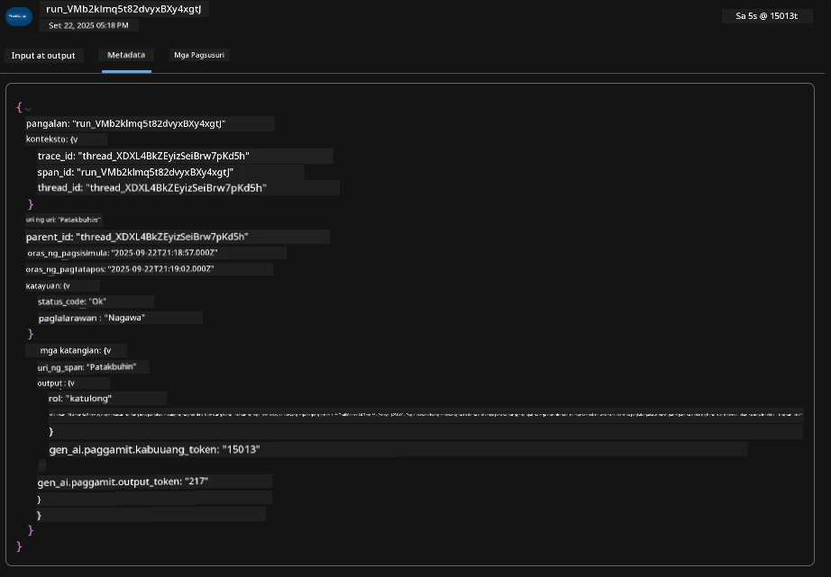


1. I-click ang `Evaluations` tab upang makita ang auto-assessments na ginawa sa agent response. Kasama rito ang mga safety evaluations (hal., Self-harm) at mga agent-specific evaluations (hal., Intent resolution, Task adherence).

      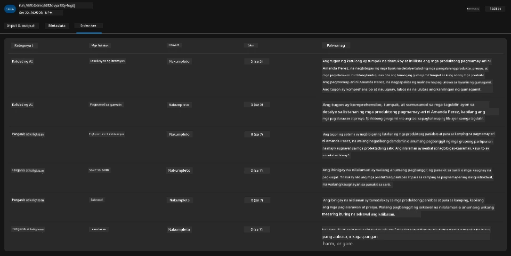

1. Huli ngunit hindi pinakamababa, i-click ang `Monitoring` tab sa sidebar menu.

      - Piliin ang `Resource usage` tab sa ipinakitang pahina - at tingnan ang mga metrics.
      - Subaybayan ang paggamit ng application sa tuntunin ng gastos (tokens) at load (requests).
      - Subaybayan ang latency ng application mula sa first byte (input processing) hanggang last byte (output).

      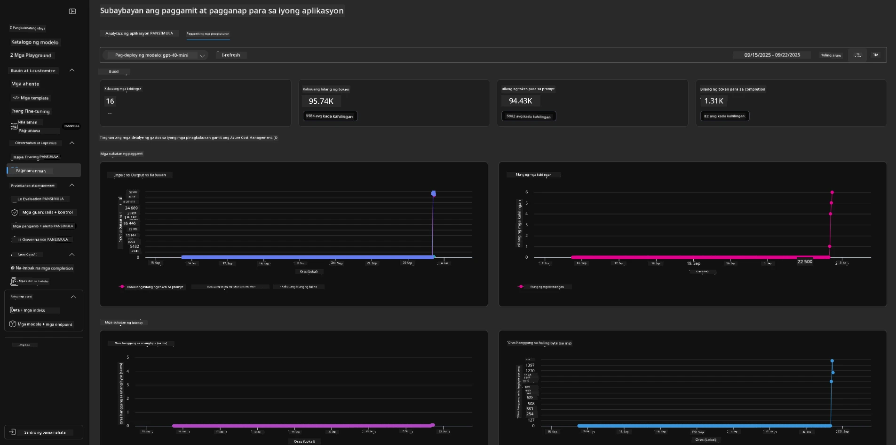

---

## 8. Mga Environment Variable

Hanggang ngayon, napaglakbay na natin ang deployment sa browser - at na-validate na naka-provision ang ating infrastructure at gumagana ang application. Ngunit upang magtrabaho sa application _code-first_, kailangan nating i-configure ang ating lokal na development environment ng mga kaukulang variables na kailangan upang makipagtrabaho sa mga resources na ito. Pinapadali ito ng `azd`.

1. Ang Azure Developer CLI [uses environment variables](https://learn.microsoft.com/en-us/azure/developer/azure-developer-cli/manage-environment-variables?tabs=bash) upang i-store at i-manage ang configuration settings para sa application deployments.

1. Ang mga environment variables ay naka-store sa `.azure/<env-name>/.env` - ito ay nagsa-scope sa kanila sa `env-name` environment na ginamit sa deployment at tumutulong sa iyo na i-isolate ang mga environment sa pagitan ng iba't ibang deployment targets sa parehong repo.

1. Ang mga environment variables ay awtomatikong niloload ng `azd` command sa tuwing mag-e-execute ito ng isang partikular na utos (hal., `azd up`). Tandaan na ang `azd` ay hindi awtomatikong nagbabasa ng _OS-level_ environment variables (hal., na-set sa shell) - sa halip gamitin ang `azd set env` at `azd get env` upang mag-transfer ng impormasyon sa loob ng mga script.


Subukan natin ang ilang mga utos:

1. Kunin ang lahat ng environment variables na na-set para sa `azd` sa environment na ito:

      ```bash title="" linenums="0"
      azd env get-values
      ```
      
      Makakakita ka ng ganito:

      ```bash title="" linenums="0"
      AZURE_AI_AGENT_DEPLOYMENT_NAME="gpt-4.1-mini"
      AZURE_AI_AGENT_NAME="agent-template-assistant"
      AZURE_AI_EMBED_DEPLOYMENT_NAME="text-embedding-3-small"
      AZURE_AI_EMBED_DIMENSIONS=100
      ...
      ```

1. Kunin ang isang partikular na value - hal., gusto kong malaman kung na-set ba namin ang `AZURE_AI_AGENT_MODEL_NAME` value

      ```bash title="" linenums="0"
      azd env get-value AZURE_AI_AGENT_MODEL_NAME 
      ```
      
      Makakakita ka ng ganito - hindi ito na-set bilang default!

      ```bash title="" linenums="0"
      ERROR: key 'AZURE_AI_AGENT_MODEL_NAME' not found in the environment values
      ```

1. Mag-set ng bagong environment variable para sa `azd`. Dito, ina-update natin ang agent model name. _Tandaan: anumang mga pagbabago ay agad na makikita sa `.azure/<env-name>/.env` file._

      ```bash title="" linenums="0"
      azd env set AZURE_AI_AGENT_MODEL_NAME gpt-4.1
      azd env set AZURE_AI_AGENT_MODEL_VERSION 2025-04-14
      azd env set AZURE_AI_AGENT_DEPLOYMENT_CAPACITY 150
      ```

      Ngayon, makikita natin na ang value ay na-set:

      ```bash title="" linenums="0"
      azd env get-value AZURE_AI_AGENT_MODEL_NAME 
      ```

1. Tandaan na ang ilang resources ay persistent (hal., model deployments) at mangangailangan ng higit pa sa isang `azd up` upang pilitin ang redeployment. Subukan nating i-tear down ang orihinal na deployment at i-redeploy na may binagong env vars.

1. **Refresh** Kung dati kang nag-deploy ng infrastructure gamit ang isang azd template - maaari mong i_refresh_ ang estado ng iyong lokal na environment variables batay sa kasalukuyang estado ng iyong Azure deployment gamit ang utos na ito:

      ```bash title="" linenums="0"
      azd env refresh
      ```

      Ito ay isang makapangyarihang paraan upang _i-sync_ ang mga environment variable sa pagitan ng dalawa o higit pang lokal na development environment (hal., koponan na may maraming developer) - na nagpapahintulot sa naka-deploy na imprastruktura na magsilbing tunay na batayan para sa estado ng mga environment variable. Ang mga miyembro ng koponan ay simpleng _i-refresh_ ang mga variable upang muling maging magkasinabagay.

---

## 9. Binabati Kita 🏆

Katatapos mo lang kumpletuhin ang isang end-to-end na workflow kung saan ikaw:

- [X] Pinili ang AZD Template na nais mong gamitin
- [X] Inilunsad ang Template gamit ang GitHub Codespaces 
- [X] Na-deploy ang Template at napatunayan na ito ay gumagana

---

<!-- CO-OP TRANSLATOR DISCLAIMER START -->
**Disclaimer**:
Ang dokumentong ito ay isinalin gamit ang serbisyong pagsasaling AI na [Co-op Translator](https://github.com/Azure/co-op-translator). Bagaman sinisikap naming maging tumpak, pakitandaan na ang mga awtomatikong pagsasalin ay maaaring maglaman ng mga pagkakamali o hindi pagkakatumpak. Ang orihinal na dokumento sa orihinal nitong wika ang dapat ituring na opisyal na sanggunian. Para sa mahahalagang impormasyon, inirerekomenda ang propesyonal na pagsasaling-tao. Hindi kami mananagot sa anumang mga hindi pagkakaunawaan o maling interpretasyon na nagmula sa paggamit ng pagsasaling ito.
<!-- CO-OP TRANSLATOR DISCLAIMER END -->