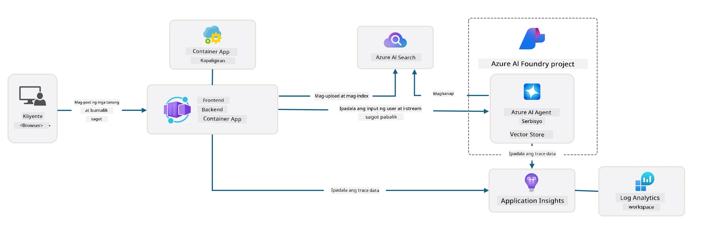

<!--
CO_OP_TRANSLATOR_METADATA:
{
  "original_hash": "4e403f041411361140d6beb88ab2a181",
  "translation_date": "2025-09-24T23:36:35+00:00",
  "source_file": "workshop/docs/instructions/3-Deconstruct-AI-Template.md",
  "language_code": "tl"
}
-->
# 3. Pag-deconstruct ng Template

!!! tip "SA DULO NG MODULE NA ITO, MAGAGAWA MO NA ANG"

    - [ ] Item
    - [ ] Item
    - [ ] Item
    - [ ] **Lab 3:** 

---

Sa pamamagitan ng mga AZD template at Azure Developer CLI (`azd`), mabilis nating masisimulan ang ating AI development journey gamit ang mga standardized na repositoryo na nagbibigay ng sample code, imprastruktura, at mga configuration file - sa anyo ng isang handa nang i-deploy na _starter_ na proyekto.

**Ngunit ngayon, kailangan nating maunawaan ang istruktura ng proyekto at codebase - at magawang i-customize ang AZD template - kahit walang karanasan o kaalaman sa AZD!**

---

## 1. I-activate ang GitHub Copilot

### 1.1 I-install ang GitHub Copilot Chat

Panahon na para tuklasin ang [GitHub Copilot gamit ang Agent Mode](https://code.visualstudio.com/docs/copilot/chat/chat-agent-mode). Ngayon, maaari nating gamitin ang natural na wika upang ilarawan ang ating gawain sa mataas na antas, at makakuha ng tulong sa pagsasagawa nito. Para sa lab na ito, gagamitin natin ang [Copilot Free plan](https://github.com/github-copilot/signup) na may buwanang limitasyon para sa mga completion at chat interaction.

Maaaring i-install ang extension mula sa marketplace, ngunit dapat na itong magamit sa iyong Codespaces environment. _I-click ang `Open Chat` mula sa drop-down ng Copilot icon - at mag-type ng prompt tulad ng `What can you do?`_ - maaaring hilingin sa iyo na mag-log in. **Handa na ang GitHub Copilot Chat**.

### 1.2. I-install ang MCP Servers

Para maging epektibo ang Agent mode, kailangan nito ng access sa tamang mga tool upang makatulong sa pagkuha ng kaalaman o pagsasagawa ng mga aksyon. Dito makakatulong ang MCP servers. Iko-configure natin ang mga sumusunod na server:

1. [Azure MCP Server](../../../../../workshop/docs/instructions)
1. [Microsoft Docs MCP Server](../../../../../workshop/docs/instructions)

Para i-activate ang mga ito:

1. Gumawa ng file na tinatawag na `.vscode/mcp.json` kung wala pa ito
1. Kopyahin ang sumusunod sa file na iyon - at simulan ang mga server!
   ```json title=".vscode/mcp.json"
   {
      "servers": {
         "Azure MCP Server": {
            "command": "npx",
            "args": [
            "-y",
            "@azure/mcp@latest",
            "server",
            "start"
            ]
         },
         "microsoft.docs.mcp": {
            "type": "http",
            "url": "https://learn.microsoft.com/api/mcp"
         }
      }
   }
   ```

??? warning "Maaaring makakuha ka ng error na `npx` ay hindi naka-install (i-click para sa solusyon)"

      Para ayusin ito, buksan ang `.devcontainer/devcontainer.json` file at idagdag ang linyang ito sa seksyon ng features. Pagkatapos, i-rebuild ang container. Dapat na ngayon ay naka-install ang `npx`.

      ```title="" linenums="0"
         "features": {
            "ghcr.io/devcontainers/features/node:1": {},
            ...
         },
      ```

---

### 1.3. Subukan ang GitHub Copilot Chat

**Una, gamitin ang `az login` upang mag-authenticate sa Azure mula sa VS Code command line.**

Dapat na ngayon ay magawa mong i-query ang status ng iyong Azure subscription, at magtanong tungkol sa mga na-deploy na resources o configuration. Subukan ang mga prompt na ito:

1. `List my Azure resource groups`
1. `#foundry list my current deployments`

Maaari ka ring magtanong tungkol sa dokumentasyon ng Azure at makakuha ng mga sagot na nakabatay sa Microsoft Docs MCP server. Subukan ang mga prompt na ito:

1. `#microsoft_docs_search What is Azure Developer CLI?`
1. `#microsoft_docs_search Show me a Python tutorial to chat with deployed model`

O maaari kang humiling ng mga code snippet upang makumpleto ang isang gawain. Subukan ang prompt na ito:

1. `Give me a Python code example that uses AAD for an interactive chat client`

Sa `Ask` mode, magbibigay ito ng code na maaari mong kopyahin at subukan. Sa `Agent` mode, maaaring mas lumampas pa ito at gumawa ng mga kaugnay na resources para sa iyo - kabilang ang mga setup script at dokumentasyon - upang matulungan kang maisagawa ang gawain.

**Handa ka na ngayong magsimulang tuklasin ang template repository**

---

## 2. Deconstruct Architecture

??? prompt "ASK: Ipaliwanag ang application architecture sa docs/images/architecture.png sa 1 talata"

      Ang application na ito ay isang AI-powered chat application na itinayo sa Azure na nagpapakita ng modernong agent-based architecture. Ang solusyon ay nakasentro sa isang Azure Container App na nagho-host ng pangunahing application code, na nagpoproseso ng input ng user at bumubuo ng matatalinong sagot sa pamamagitan ng isang AI agent. 
      
      Ang architecture ay gumagamit ng Azure AI Foundry Project bilang pundasyon para sa AI capabilities, na kumokonekta sa Azure AI Services na nagbibigay ng mga underlying language models (tulad ng GPT-4o-mini) at agent functionality. Ang mga interaksyon ng user ay dumadaloy sa isang React-based frontend patungo sa isang FastAPI backend na nakikipag-ugnayan sa AI agent service para sa pagbuo ng mga contextual na sagot. 
      
      Ang sistema ay may kakayahan sa knowledge retrieval sa pamamagitan ng file search o Azure AI Search service, na nagpapahintulot sa agent na ma-access at ma-cite ang impormasyon mula sa mga na-upload na dokumento. Para sa operational excellence, ang architecture ay may kasamang komprehensibong monitoring sa pamamagitan ng Application Insights at Log Analytics Workspace para sa tracing, logging, at performance optimization. 
      
      Ang Azure Storage ay nagbibigay ng blob storage para sa application data at file uploads, habang ang Managed Identity ay nagsisiguro ng secure na access sa pagitan ng mga Azure resources nang hindi nag-iimbak ng mga kredensyal. Ang buong solusyon ay idinisenyo para sa scalability at maintainability, na may containerized application na awtomatikong nag-scale base sa demand habang nagbibigay ng built-in na seguridad, monitoring, at CI/CD capabilities sa pamamagitan ng ecosystem ng Azure's managed services.



---

## 3. Istruktura ng Repository

!!! prompt "ASK: Ipaliwanag ang istruktura ng template folder. Simulan sa isang visual hierarchical diagram."

??? info "ANSWER: Visual Hierarchical Diagram"

      ```bash title="" 
      get-started-with-ai-agents/
      ├── 📋 Configuration & Setup
      │   ├── azure.yaml                    # Azure Developer CLI configuration
      │   ├── docker-compose.yaml           # Local development containers
      │   ├── pyproject.toml                # Python project configuration
      │   ├── requirements-dev.txt          # Development dependencies
      │   └── .devcontainer/                # VS Code dev container setup
      │
      ├── 🏗️ Infrastructure (infra/)
      │   ├── main.bicep                    # Main infrastructure template
      │   ├── api.bicep                     # API-specific resources
      │   ├── main.parameters.json          # Infrastructure parameters
      │   └── core/                         # Modular infrastructure components
      │       ├── ai/                       # AI service configurations
      │       ├── host/                     # Hosting infrastructure
      │       ├── monitor/                  # Monitoring and logging
      │       ├── search/                   # Azure AI Search setup
      │       ├── security/                 # Security and identity
      │       └── storage/                  # Storage account configs
      │
      ├── 💻 Application Source (src/)
      │   ├── api/                          # Backend API
      │   │   ├── main.py                   # FastAPI application entry
      │   │   ├── routes.py                 # API route definitions
      │   │   ├── search_index_manager.py   # Search functionality
      │   │   ├── data/                     # API data handling
      │   │   ├── static/                   # Static web assets
      │   │   └── templates/                # HTML templates
      │   ├── frontend/                     # React/TypeScript frontend
      │   │   ├── package.json              # Node.js dependencies
      │   │   ├── vite.config.ts            # Vite build configuration
      │   │   └── src/                      # Frontend source code
      │   ├── data/                         # Sample data files
      │   │   └── embeddings.csv            # Pre-computed embeddings
      │   ├── files/                        # Knowledge base files
      │   │   ├── customer_info_*.json      # Customer data samples
      │   │   └── product_info_*.md         # Product documentation
      │   ├── Dockerfile                    # Container configuration
      │   └── requirements.txt              # Python dependencies
      │
      ├── 🔧 Automation & Scripts (scripts/)
      │   ├── postdeploy.sh/.ps1           # Post-deployment setup
      │   ├── setup_credential.sh/.ps1     # Credential configuration
      │   ├── validate_env_vars.sh/.ps1    # Environment validation
      │   └── resolve_model_quota.sh/.ps1  # Model quota management
      │
      ├── 🧪 Testing & Evaluation
      │   ├── tests/                        # Unit and integration tests
      │   │   └── test_search_index_manager.py
      │   ├── evals/                        # Agent evaluation framework
      │   │   ├── evaluate.py               # Evaluation runner
      │   │   ├── eval-queries.json         # Test queries
      │   │   └── eval-action-data-path.json
      │   ├── sandbox/                      # Development playground
      │   │   ├── 1-quickstart.py           # Getting started examples
      │   │   └── aad-interactive-chat.py   # Authentication examples
      │   └── airedteaming/                 # AI safety evaluation
      │       └── ai_redteaming.py          # Red team testing
      │
      ├── 📚 Documentation (docs/)
      │   ├── deployment.md                 # Deployment guide
      │   ├── local_development.md          # Local setup instructions
      │   ├── troubleshooting.md            # Common issues & fixes
      │   ├── azure_account_setup.md        # Azure prerequisites
      │   └── images/                       # Documentation assets
      │
      └── 📄 Project Metadata
         ├── README.md                     # Project overview
         ├── CODE_OF_CONDUCT.md           # Community guidelines
         ├── CONTRIBUTING.md              # Contribution guide
         ├── LICENSE                      # License terms
         └── next-steps.md                # Post-deployment guidance
      ```

### 3.1. Core App Architecture

Ang template na ito ay sumusunod sa **full-stack web application** pattern na may:

- **Backend**: Python FastAPI na may Azure AI integration
- **Frontend**: TypeScript/React na may Vite build system
- **Infrastructure**: Azure Bicep templates para sa cloud resources
- **Containerization**: Docker para sa consistent na deployment

### 3.2 Infra As Code (bicep)

Ang infrastructure layer ay gumagamit ng **Azure Bicep** templates na modular ang pagkakaayos:

   - **`main.bicep`**: Nag-o-orchestrate ng lahat ng Azure resources
   - **`core/` modules**: Mga reusable na component para sa iba't ibang serbisyo
      - AI services (Azure OpenAI, AI Search)
      - Container hosting (Azure Container Apps)
      - Monitoring (Application Insights, Log Analytics)
      - Security (Key Vault, Managed Identity)

### 3.3 Application Source (`src/`)

**Backend API (`src/api/`)**:

- REST API na nakabase sa FastAPI
- Azure AI Agent service integration
- Search index management para sa knowledge retrieval
- Kakayahan sa file upload at processing

**Frontend (`src/frontend/`)**:

- Modernong React/TypeScript SPA
- Vite para sa mabilis na development at optimized builds
- Chat interface para sa agent interactions

**Knowledge Base (`src/files/`)**:

- Sample na customer at product data
- Nagpapakita ng file-based knowledge retrieval
- JSON at Markdown format na mga halimbawa

### 3.4 DevOps & Automation

**Scripts (`scripts/`)**:

- Cross-platform na PowerShell at Bash scripts
- Environment validation at setup
- Post-deployment configuration
- Model quota management

**Azure Developer CLI Integration**:

- `azure.yaml` configuration para sa `azd` workflows
- Automated provisioning at deployment
- Environment variable management

### 3.5 Testing & Quality Assurance

**Evaluation Framework (`evals/`)**:

- Pagsusuri ng performance ng agent
- Pagsusuri ng kalidad ng query-response
- Automated assessment pipeline

**AI Safety (`airedteaming/`)**:

- Red team testing para sa AI safety
- Security vulnerability scanning
- Responsible AI practices

---

## 4. Congratulations 🏆

Matagumpay mong nagamit ang GitHub Copilot Chat na may MCP servers, upang tuklasin ang repository.

- [X] Na-activate ang GitHub Copilot para sa Azure
- [X] Naunawaan ang Application Architecture
- [X] Natuklasan ang istruktura ng AZD template

Ito ay nagbibigay sa iyo ng ideya tungkol sa _infrastructure as code_ assets para sa template na ito. Sa susunod, titingnan natin ang configuration file para sa AZD.

---

