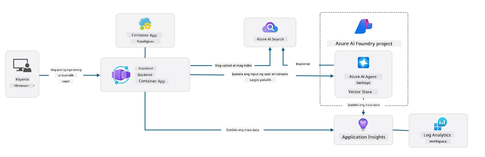

# 3. I-deconstruct ang Template

!!! tip "SA PAGWAKAS NG MÓDULONG ITO, MAAARI MONG"

    - [ ] I-activate ang GitHub Copilot kasama ang MCP servers para sa tulong sa Azure
    - [ ] Maunawaan ang AZD template folder structure at mga komponent
    - [ ] Suriin ang mga pattern ng organisasyon para sa infrastructure-as-code (Bicep)
    - [ ] **Lab 3:** Gamitin ang GitHub Copilot para tuklasin at unawain ang arkitektura ng repositoryo 

---


Sa mga AZD template at ang Azure Developer CLI (`azd`) mabilis nating masisimulan ang ating AI development journey gamit ang standardized na mga repository na nagbibigay ng sample code, imprastruktura at mga configuration file - sa anyo ng handa nang i-deploy na _starter_ project.

**Ngunit ngayon, kailangan nating unawain ang istruktura ng proyekto at codebase - at magawang i-customize ang AZD template - kahit walang naunang karanasan o pag-unawa sa AZD!**

---

## 1. I-activate ang GitHub Copilot

### 1.1 Install GitHub Copilot Chat

Panahon na para tuklasin ang [GitHub Copilot with Agent Mode](https://code.visualstudio.com/docs/copilot/chat/chat-agent-mode). Ngayon, maaari nating gamitin ang natural na wika para ilarawan ang ating gawain sa mataas na antas, at makakuha ng tulong sa pagpapatupad. Para sa lab na ito, gagamitin natin ang [Copilot Free plan](https://github.com/github-copilot/signup) na may buwanang limit para sa completions at chat interactions.

Ang extension ay maaaring i-install mula sa marketplace, at madalas na naka-available na sa Codespaces o dev container environments. _I-click ang `Open Chat` mula sa Copilot icon drop-down - at mag-type ng prompt tulad ng `What can you do?`_ - maaaring hilingin sa iyo na mag-log in. **Handa na ang GitHub Copilot Chat**.

### 1.2. Install MCP Servers

Para maging epektibo ang Agent mode, kailangan nito ng access sa mga tamang tool upang matulungan itong kunin ang kaalaman o magsagawa ng aksyon. Dito makakatulong ang MCP servers. Iko-configure natin ang mga sumusunod na servers:

1. [Azure MCP Server](../../../../../workshop/docs/instructions)
1. [Microsoft Docs MCP Server](../../../../../workshop/docs/instructions)

Para i-activate ang mga ito:

1. Gumawa ng file na pinangalanang `.vscode/mcp.json` kung wala pa
1. Kopyahin ang sumusunod sa file na iyon - at simulan ang mga servers!
   ```json title=".vscode/mcp.json"
   {
      "servers": {
         "Azure MCP Server": {
            "command": "npx",
            "args": [
            "-y",
            "@azure/mcp@latest",
            "server",
            "start"
            ]
         },
         "microsoft.docs.mcp": {
            "type": "http",
            "url": "https://learn.microsoft.com/api/mcp"
         }
      }
   }
   ```

??? warning "Maaaring makakuha ka ng error na `npx` ay hindi naka-install (i-click para palawakin ang ayos)"

      Para ayusin ito, buksan ang file na `.devcontainer/devcontainer.json` at idagdag ang linyang ito sa seksyon ng features. Pagkatapos ay i-rebuild ang container. Dapat ay naka-install na ang `npx`.

      ```title="" linenums="0"
         "features": {
            "ghcr.io/devcontainers/features/node:1": {},
            ...
         },
      ```

---

### 1.3. Subukan ang GitHub Copilot Chat

**Gamitin muna ang `azd auth login` para mag-authenticate sa Azure mula sa VS Code command line. Gamitin din ang `az login` kung balak mong magpatakbo ng mga Azure CLI commands nang direkta.**

Dapat mo nang ma-query ang status ng iyong Azure subscription, at magtanong tungkol sa mga na-deploy na resources o configuration. Subukan ang mga prompts na ito:

1. `List my Azure resource groups`
1. `#foundry list my current deployments`

Maaari ka ring magtanong tungkol sa dokumentasyon ng Azure at makatanggap ng mga sagot na naka-ugat sa Microsoft Docs MCP server. Subukan ang mga prompts na ito:

1. `#microsoft_docs_search What is Azure Developer CLI?`
1. `#microsoft_docs_search Show me a Python tutorial to chat with deployed model`

O maaari kang humingi ng mga code snippet para kumpletuhin ang isang gawain. Subukan ang prompt na ito.

1. `Give me a Python code example that uses AAD for an interactive chat client`

Sa `Ask` mode, magbibigay ito ng code na maaari mong i-copy-paste at subukan. Sa `Agent` mode, maaari nitong gawin ang isang hakbang pa at lumikha ng mga kaugnay na resources para sa iyo - kabilang ang setup scripts at dokumentasyon - upang tulungan kang isakatuparan ang gawain.

**Kasalukuyan kang handa upang simulan ang pag-explore ng template repository**

---

## 2. I-deconstruct ang Arkitektura

??? prompt "HILING: Ipaliwanag ang application architecture sa docs/images/architecture.png sa 1 talata"

      Ang application na ito ay isang AI-powered chat application na itinayo sa Azure na nagpapakita ng makabagong agent-based na arkitektura. Nakapaloob sa solusyon ang isang Azure Container App na nagho-host ng pangunahing application code, na nagpo-proseso ng input ng user at bumubuo ng mga intelligent na sagot sa pamamagitan ng isang AI agent. 
      
      Ang arkitektura ay gumagamit ng Microsoft Foundry Project bilang pundasyon para sa AI capabilities, na kumokonekta sa Azure AI Services na nagpo-provide ng mga underlying language models (tulad ng gpt-4.1-mini) at functionality ng agent. Ang interaksyon ng user ay dumadaloy mula sa isang React-based frontend papunta sa isang FastAPI backend na nakikipag-ugnayan sa AI agent service para bumuo ng mga kontekstwal na tugon. 
      
      Naglalaman ang sistema ng kakayahan para sa pag-retrieve ng kaalaman sa pamamagitan ng file search o Azure AI Search service, na nagpapahintulot sa agent na ma-access at mag-sipi ng impormasyon mula sa mga in-upload na dokumento. Para sa operational excellence, kabilang sa arkitektura ang komprehensibong monitoring gamit ang Application Insights at Log Analytics Workspace para sa tracing, logging, at performance optimization. 
      
      Nagbibigay ang Azure Storage ng blob storage para sa application data at mga file upload, habang tinitiyak ng Managed Identity ang secure na access sa pagitan ng mga Azure resources nang hindi nag-iimbak ng mga kredensyal. Dinisenyo ang buong solusyon para sa scalability at maintainability, kung saan awtomatikong nagsuscale ang containerized application base sa demand habang nagbibigay ng built-in na seguridad, monitoring, at CI/CD capabilities sa pamamagitan ng managed services ecosystem ng Azure.



---

## 3. Repository Structure

!!! prompt "HILING: Ipaliwanag ang template folder structure. Magsimula sa isang biswal na hierarchical na diagram."

??? info "SAGOT: Biswal na Hierarchical na Diagram"

      ```bash title="" 
      get-started-with-ai-agents/
      ├── 📋 Configuration & Setup
      │   ├── azure.yaml                    # Azure Developer CLI configuration
      │   ├── docker-compose.yaml           # Local development containers
      │   ├── pyproject.toml                # Python project configuration
      │   ├── requirements-dev.txt          # Development dependencies
      │   └── .devcontainer/                # VS Code dev container setup
      │
      ├── 🏗️ Infrastructure (infra/)
      │   ├── main.bicep                    # Main infrastructure template
      │   ├── api.bicep                     # API-specific resources
      │   ├── main.parameters.json          # Infrastructure parameters
      │   └── core/                         # Modular infrastructure components
      │       ├── ai/                       # AI service configurations
      │       ├── host/                     # Hosting infrastructure
      │       ├── monitor/                  # Monitoring and logging
      │       ├── search/                   # Azure AI Search setup
      │       ├── security/                 # Security and identity
      │       └── storage/                  # Storage account configs
      │
      ├── 💻 Application Source (src/)
      │   ├── api/                          # Backend API
      │   │   ├── main.py                   # FastAPI application entry
      │   │   ├── routes.py                 # API route definitions
      │   │   ├── search_index_manager.py   # Search functionality
      │   │   ├── data/                     # API data handling
      │   │   ├── static/                   # Static web assets
      │   │   └── templates/                # HTML templates
      │   ├── frontend/                     # React/TypeScript frontend
      │   │   ├── package.json              # Node.js dependencies
      │   │   ├── vite.config.ts            # Vite build configuration
      │   │   └── src/                      # Frontend source code
      │   ├── data/                         # Sample data files
      │   │   └── embeddings.csv            # Pre-computed embeddings
      │   ├── files/                        # Knowledge base files
      │   │   ├── customer_info_*.json      # Customer data samples
      │   │   └── product_info_*.md         # Product documentation
      │   ├── Dockerfile                    # Container configuration
      │   └── requirements.txt              # Python dependencies
      │
      ├── 🔧 Automation & Scripts (scripts/)
      │   ├── postdeploy.sh/.ps1           # Post-deployment setup
      │   ├── setup_credential.sh/.ps1     # Credential configuration
      │   ├── validate_env_vars.sh/.ps1    # Environment validation
      │   └── resolve_model_quota.sh/.ps1  # Model quota management
      │
      ├── 🧪 Testing & Evaluation
      │   ├── tests/                        # Unit and integration tests
      │   │   └── test_search_index_manager.py
      │   ├── evals/                        # Agent evaluation framework
      │   │   ├── evaluate.py               # Evaluation runner
      │   │   ├── eval-queries.json         # Test queries
      │   │   └── eval-action-data-path.json
      │   ├── sandbox/                      # Development playground
      │   │   ├── 1-quickstart.py           # Getting started examples
      │   │   └── aad-interactive-chat.py   # Authentication examples
      │   └── airedteaming/                 # AI safety evaluation
      │       └── ai_redteaming.py          # Red team testing
      │
      ├── 📚 Documentation (docs/)
      │   ├── deployment.md                 # Deployment guide
      │   ├── local_development.md          # Local setup instructions
      │   ├── troubleshooting.md            # Common issues & fixes
      │   ├── azure_account_setup.md        # Azure prerequisites
      │   └── images/                       # Documentation assets
      │
      └── 📄 Project Metadata
         ├── README.md                     # Project overview
         ├── CODE_OF_CONDUCT.md           # Community guidelines
         ├── CONTRIBUTING.md              # Contribution guide
         ├── LICENSE                      # License terms
         └── next-steps.md                # Post-deployment guidance
      ```

### 3.1. Pangunahing Arkitektura ng App

Sinusunod ng template na ito ang isang **full-stack web application** pattern na may:

- **Backend**: Python FastAPI na may Azure AI integration
- **Frontend**: TypeScript/React na may Vite build system
- **Infrastructure**: Azure Bicep templates para sa cloud resources
- **Containerization**: Docker para sa consistent na deployment

### 3.2 Infra As Code (bicep)

Gumagamit ang infrastructure layer ng **Azure Bicep** templates na naka-organisa nang modular:

   - **`main.bicep`**: Nagsasaayos ng lahat ng Azure resources
   - **`core/` modules**: Reusable na mga komponent para sa iba't ibang serbisyo
      - AI services (Microsoft Foundry Models, AI Search)
      - Container hosting (Azure Container Apps)
      - Monitoring (Application Insights, Log Analytics)
      - Security (Key Vault, Managed Identity)

### 3.3 Application Source (`src/`)

**Backend API (`src/api/`)**:

- FastAPI-based REST API
- Foundry Agents integration
- Pamamahala ng search index para sa knowledge retrieval
- Kakayahan sa pag-upload at pag-proseso ng mga file

**Frontend (`src/frontend/`)**:

- Modernong React/TypeScript SPA
- Vite para sa mabilis na development at optimized builds
- Chat interface para sa pakikipag-ugnayan sa agent

**Knowledge Base (`src/files/`)**:

- Sample na customer at product data
- Nagpapakita ng file-based na knowledge retrieval
- Mga halimbawa sa JSON at Markdown na format


### 3.4 DevOps & Automation

**Scripts (`scripts/`)**:

- Cross-platform PowerShell at Bash scripts
- Environment validation at setup
- Post-deployment configuration
- Pamamahala ng model quota

**Azure Developer CLI Integration**:

- `azure.yaml` configuration para sa `azd` workflows
- Awtomatikong provisioning at deployment
- Pamamahala ng environment variables

### 3.5 Testing & Quality Assurance

**Evaluation Framework (`evals/`)**:

- Pagsusuri ng performance ng agent
- Pagsubok ng kalidad ng query-response
- Awtomatikong assessment pipeline

**AI Safety (`airedteaming/`)**:

- Red team testing para sa AI safety
- Pag-scan ng security vulnerabilities
- Mga responsableng kasanayan sa AI

---

## 4. Congratulations 🏆

Matagumpay mong ginamit ang GitHub Copilot Chat kasama ang MCP servers, upang tuklasin ang repository.

- [X] Na-activate ang GitHub Copilot para sa Azure
- [X] Naunawaan ang Arkitektura ng Application
- [X] Nasuri ang AZD template structure

Binibigyan ka nito ng ideya tungkol sa mga _infrastructure as code_ asset para sa template na ito. Susunod, titingnan natin ang configuration file para sa AZD.

---

<!-- CO-OP TRANSLATOR DISCLAIMER START -->
**Disclaimer**:
Ang dokumentong ito ay isinalin gamit ang serbisyo ng AI na pagsasalin [Co-op Translator](https://github.com/Azure/co-op-translator). Bagaman nagsisikap kami para sa katumpakan, mangyaring tandaan na ang awtomatikong pagsasalin ay maaaring maglaman ng mga pagkakamali o kamalian. Ang orihinal na dokumento sa katutubong wika nito ang dapat ituring na awtoritatibong pinagkukunan. Para sa kritikal na impormasyon, inirerekomenda ang propesyonal na pagsasalin ng tao. Hindi kami mananagot sa anumang hindi pagkakaunawaan o maling interpretasyon na nagmumula sa paggamit ng pagsasaling ito.
<!-- CO-OP TRANSLATOR DISCLAIMER END -->