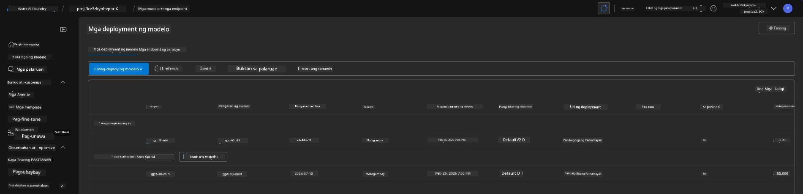
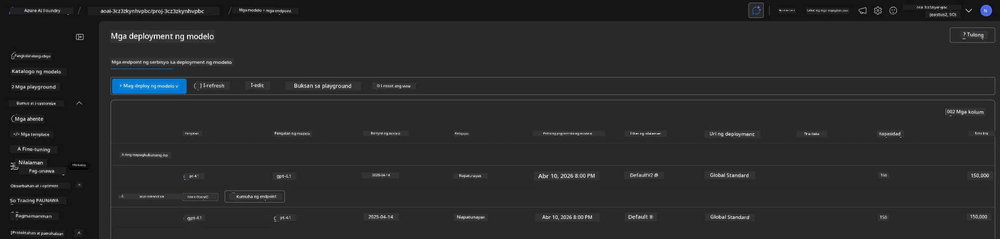

# 6. Pag-aalis ng Imprastraktura

!!! tip "SA DULO NG MODULONG ITO, MAGAGAWA MO NA"

    - [ ] Item
    - [ ] Item
    - [ ] Item

---

## Mga Bonus na Ehersisyo

Bago natin alisin ang proyekto, maglaan ng ilang minuto para sa malayang paggalugad.

!!! danger "NITYA-TODO: Magbigay ng ilang mga mungkahi na subukan"

---

## Pag-aalis ng Imprastraktura

1. Ang pag-aalis ng imprastraktura ay kasing dali ng:
      
      ```bash title="" linenums="0"
      azd down --purge
      ```
1. Ang `--purge` flag ay tinitiyak na pati ang mga soft-deleted na Cognitive Service resources ay aalisin, kaya maibabalik ang quota na hawak ng mga ito. Kapag natapos, makikita mo ang ganito:
      
      ```bash title="" linenums="0"
      ? Total resources to delete: 11, are you sure you want to continue? Yes
      Deleting your resources can take some time.
      (✓) Done: Deleted resource group rg-nitya-mshack-azd
      (✓) Done: Purging Cognitive Account: aoai-3cz3zkynhvpbc

      SUCCESS: Your application was removed from Azure in 11 minutes 4 seconds.
      ```

1. (Opsyonal) Kung muli mong patakbuhin ang `azd up`, mapapansin mong ang gpt-4.1 model ay ide-deploy dahil ang environment variable ay binago (at na-save) sa lokal na `.azure` folder.

      Narito ang mga deployment ng model **bago**:

      

      At narito ito **pagkatapos**:
      

---

