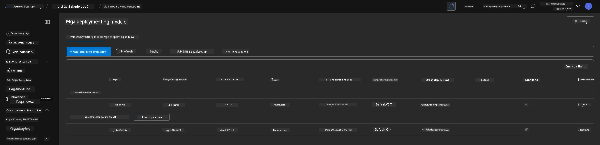
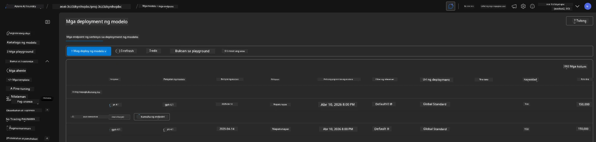

# 6. Pagbuwag ng Imprastruktura

!!! tip "PAGKATAPOS NG MODULE NA ITO MAGAGAWA MO"

    - [ ] Maunawaan ang kahalagahan ng paglilinis ng mga resource at pamamahala ng gastos
    - [ ] Gamitin `azd down` para ligtas na i-deprovision ang imprastruktura
    - [ ] I-recover ang mga soft-deleted na cognitive services kung kinakailangan
    - [ ] **Lab 6:** Linisin ang mga Azure resource at tiyaking natanggal

---

## Mga Bonus na Ehersisyo

Bago natin buwagin ang proyekto, maglaan ng ilang minuto para sa malayang pag-eeksplora.

!!! info "Subukan ang mga Prompt na ito para sa Eksplorasyon"

    **Mag-eksperimento gamit ang GitHub Copilot:**
    
    1. Magtanong: `What other AZD templates could I try for multi-agent scenarios?`
    2. Magtanong: `How can I customize the agent instructions for a healthcare use case?`
    3. Magtanong: `What environment variables control cost optimization?`
    
    **Suriin ang Azure Portal:**
    
    1. Suriin ang mga metric ng Application Insights para sa iyong deployment
    2. Suriin ang pagsusuri ng gastos para sa mga na-provision na resource
    3. I-explore muli ang agent playground ng Microsoft Foundry portal

---

## I-deprovision ang Imprastruktura

1. Ang pagbuwag ng imprastruktura ay kasing dali ng:
      
      ```bash title="" linenums="0"
      azd down --purge
      ```
1. Ang flag na `--purge` tinitiyak na pinupurga rin nito ang mga soft-deleted na Cognitive Service resources, kaya nire-release ang quota na hinahawakan ng mga resource na ito. Kapag kumpleto makikita mo ang ganito:
      
      ```bash title="" linenums="0"
      ? Total resources to delete: 11, are you sure you want to continue? Yes
      Deleting your resources can take some time.
      (✓) Done: Deleted resource group rg-nitya-mshack-azd
      (✓) Done: Purging Cognitive Account: aoai-3cz3zkynhvpbc

      SUCCESS: Your application was removed from Azure in 11 minutes 4 seconds.
      ```

1. (Opsyonal) Kung tatakboin mo muli ang `azd up`, mapapansin mong nade-deploy ang modelong gpt-4.1 dahil binago ang environment variable (at na-save) sa lokal na `.azure` folder. 

      Narito ang mga deployment ng modelo **bago**:

      

      At narito ito **pagkatapos**:
      

---

<!-- CO-OP TRANSLATOR DISCLAIMER START -->
**Paunawa**:
Isinalin ang dokumentong ito gamit ang AI na serbisyo sa pagsasalin [Co-op Translator](https://github.com/Azure/co-op-translator). Bagaman nagsusumikap kaming maging tumpak, pakitandaan na ang mga awtomatikong pagsasalin ay maaaring maglaman ng mga pagkakamali o hindi pagkakatumpak. Ang orihinal na dokumento sa orihinal nitong wika ang dapat ituring na opisyal at may awtoridad. Para sa mahahalagang impormasyon, inirerekomenda ang propesyonal na pagsasaling-tao. Hindi kami mananagot sa anumang hindi pagkakaunawaan o maling interpretasyon na nagmumula sa paggamit ng pagsasaling ito.
<!-- CO-OP TRANSLATOR DISCLAIMER END -->