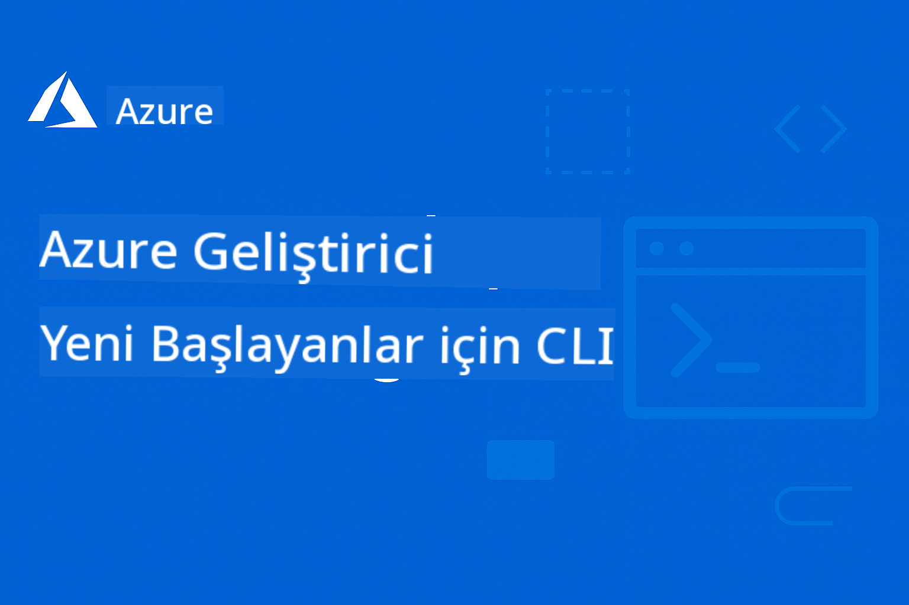

<!--
CO_OP_TRANSLATOR_METADATA:
{
  "original_hash": "c0984265b7a9357388f864c19606c80d",
  "translation_date": "2025-09-11T10:01:21+00:00",
  "source_file": "README.md",
  "language_code": "tr"
}
-->
# AZD Yeni Başlayanlar İçin

 

[](https://GitHub.com/microsoft/azd-for-beginners/watchers/?WT.mc_id=academic-105485-koreyst)  
[](https://GitHub.com/microsoft/azd-for-beginners/network/?WT.mc_id=academic-105485-koreyst)  
[](https://GitHub.com/microsoft/azd-for-beginners/stargazers/?WT.mc_id=academic-105485-koreyst)  

[](https://discord.gg/microsoft-azure)  
[](https://discord.gg/kzRShWzttr)  

Bu kaynakları kullanmaya başlamak için aşağıdaki adımları izleyin:  
1. **Depoyu Çatallayın**: [](https://GitHub.com/microsoft/azd-for-beginners/fork) bağlantısına tıklayın.  
2. **Depoyu Klonlayın**: `git clone https://github.com/microsoft/azd-for-beginners.git`  
3. [**Azure Discord Topluluklarına Katılın ve uzmanlarla, diğer geliştiricilerle tanışın**](https://discord.com/invite/ByRwuEEgH4)  

### 🌐 Çok Dilli Destek

#### GitHub Action ile Desteklenir (Otomatik ve Her Zaman Güncel)

[Fransızca](../fr/README.md) | [İspanyolca](../es/README.md) | [Almanca](../de/README.md) | [Rusça](../ru/README.md) | [Arapça](../ar/README.md) | [Farsça](../fa/README.md) | [Urduca](../ur/README.md) | [Çince (Basitleştirilmiş)](../zh/README.md) | [Çince (Geleneksel, Makao)](../mo/README.md) | [Çince (Geleneksel, Hong Kong)](../hk/README.md) | [Çince (Geleneksel, Tayvan)](../tw/README.md) | [Japonca](../ja/README.md) | [Korece](../ko/README.md) | [Hintçe](../hi/README.md) | [Bengalce](../bn/README.md) | [Marathi](../mr/README.md) | [Nepalce](../ne/README.md) | [Pencapça (Gurmukhi)](../pa/README.md) | [Portekizce (Portekiz)](../pt/README.md) | [Portekizce (Brezilya)](../br/README.md) | [İtalyanca](../it/README.md) | [Lehçe](../pl/README.md) | [Türkçe](./README.md) | [Yunanca](../el/README.md) | [Tayca](../th/README.md) | [İsveççe](../sv/README.md) | [Danca](../da/README.md) | [Norveççe](../no/README.md) | [Fince](../fi/README.md) | [Felemenkçe](../nl/README.md) | [İbranice](../he/README.md) | [Vietnamca](../vi/README.md) | [Endonezce](../id/README.md) | [Malayca](../ms/README.md) | [Tagalog (Filipince)](../tl/README.md) | [Swahili](../sw/README.md) | [Macarca](../hu/README.md) | [Çekçe](../cs/README.md) | [Slovakça](../sk/README.md) | [Romence](../ro/README.md) | [Bulgarca](../bg/README.md) | [Sırpça (Kiril)](../sr/README.md) | [Hırvatça](../hr/README.md) | [Slovence](../sl/README.md) | [Ukraynaca](../uk/README.md) | [Burma Dili (Myanmar)](../my/README.md)  

**Ek dil desteği talep etmek isterseniz, desteklenen diller [burada](https://github.com/Azure/co-op-translator/blob/main/getting_started/supported-languages.md) listelenmiştir.**

## Giriş

Azure Developer CLI (azd) için kapsamlı rehbere hoş geldiniz. Bu depo, öğrencilerden profesyonel geliştiricilere kadar her seviyedeki geliştiricinin Azure Developer CLI'yi öğrenmesi ve bulut dağıtımlarını verimli bir şekilde gerçekleştirmesi için tasarlanmıştır. Bu yapılandırılmış öğrenme kaynağı, Azure bulut dağıtımları, yaygın sorunların giderilmesi ve başarılı AZD şablon dağıtımları için en iyi uygulamaların uygulanması konusunda pratik deneyim sağlar.

## Öğrenme Hedefleri

Bu depoda çalışarak:  
- Azure Developer CLI'nin temel bilgilerini ve ana kavramlarını öğrenin  
- Kod olarak Altyapı kullanarak Azure kaynaklarını dağıtmayı ve sağlamayı öğrenin  
- Yaygın AZD dağıtım sorunlarını giderme becerileri geliştirin  
- Dağıtım öncesi doğrulama ve kapasite planlamayı anlayın  
- Güvenlik en iyi uygulamalarını ve maliyet optimizasyon stratejilerini uygulayın  
- Azure'a üretim için hazır uygulamalar dağıtma konusunda güven kazanın  

## Öğrenme Çıktıları

Bu kursu tamamladıktan sonra:  
- Azure Developer CLI'yi başarıyla kurabilir, yapılandırabilir ve kullanabilirsiniz  
- AZD şablonlarını kullanarak uygulamalar oluşturabilir ve dağıtabilirsiniz  
- Kimlik doğrulama, altyapı ve dağıtım sorunlarını giderebilirsiniz  
- Kapasite planlama ve SKU seçimi dahil olmak üzere dağıtım öncesi kontrolleri gerçekleştirebilirsiniz  
- İzleme, güvenlik ve maliyet yönetimi en iyi uygulamalarını uygulayabilirsiniz  
- AZD iş akışlarını CI/CD boru hatlarına entegre edebilirsiniz  

## İçindekiler

- [Azure Developer CLI Nedir?](../..)  
- [Hızlı Başlangıç](../..)  
- [Dokümantasyon](../..)  
- [Örnekler ve Şablonlar](../..)  
- [Kaynaklar](../..)  
- [Katkıda Bulunma](../..)  

## Azure Developer CLI Nedir?

Azure Developer CLI (azd), uygulamaları Azure'a oluşturma ve dağıtma sürecini hızlandıran geliştirici odaklı bir komut satırı arayüzüdür. Şunları sağlar:  

- **Şablon tabanlı dağıtımlar** - Yaygın uygulama desenleri için önceden oluşturulmuş şablonlar kullanın  
- **Kod olarak Altyapı** - Azure kaynaklarını Bicep veya Terraform ile yönetin  
- **Entegre iş akışları** - Uygulamaları sorunsuz bir şekilde sağlayın, dağıtın ve izleyin  
- **Geliştirici dostu** - Geliştirici verimliliği ve deneyimi için optimize edilmiştir  

## Hızlı Başlangıç

### Ön Koşullar  
- Azure aboneliği  
- Azure CLI yüklü  
- Git (şablonları klonlamak için)  

### Kurulum  
```bash
# Windows (PowerShell)
powershell -ex AllSigned -c "Invoke-RestMethod 'https://aka.ms/install-azd.ps1' | Invoke-Expression"

# macOS/Linux
curl -fsSL https://aka.ms/install-azd.sh | bash
```  

### İlk Dağıtımınız  
```bash
# Initialize a new project
azd init --template todo-nodejs-mongo

# Provision Azure resources and deploy
azd up
```  

## Dokümantasyon

### Başlangıç  
- [**AZD Temelleri**](docs/getting-started/azd-basics.md) - Temel kavramlar ve terminoloji  
- [**Kurulum ve Ayar**](docs/getting-started/installation.md) - Platforma özel kurulum rehberleri  
- [**Yapılandırma**](docs/getting-started/configuration.md) - Ortam ayarları ve kimlik doğrulama  
- [**İlk Projeniz**](docs/getting-started/first-project.md) - Adım adım öğretici  

### Dağıtım ve Sağlama  
- [**Dağıtım Rehberi**](docs/deployment/deployment-guide.md) - Tam dağıtım iş akışları  
- [**Kaynak Sağlama**](docs/deployment/provisioning.md) - Azure kaynak yönetimi  

### Dağıtım Öncesi Kontroller  
- [**Kapasite Planlama**](docs/pre-deployment/capacity-planning.md) - Azure kaynak kapasite doğrulaması  
- [**SKU Seçimi**](docs/pre-deployment/sku-selection.md) - Doğru Azure SKU'larını seçme  
- [**Ön Kontroller**](docs/pre-deployment/preflight-checks.md) - Otomatik doğrulama betikleri  

### Sorun Giderme  
- [**Yaygın Sorunlar**](docs/troubleshooting/common-issues.md) - Sık karşılaşılan problemler ve çözümleri  
- [**Hata Ayıklama Rehberi**](docs/troubleshooting/debugging.md) - Adım adım hata ayıklama stratejileri  

## Örnekler ve Şablonlar  
- [**Örnekler**](examples/README.md) - Azure Developer CLI'yi pratik yaparak öğrenmenize yardımcı olacak gerçek dünya senaryoları, şablonlar ve uygulama mimarileri içeren örnekler.  

### Uygulamalı Laboratuvar/Atölye  
- [**AZD Yeni Başlayanlar İçin**](workshop/README.md) - Bu atölye, Azure AI hizmetlerini AZD kullanarak dağıtmak için en iyi uygulamaları sağlayan AI Agents AZD şablonuyla çalışmaya odaklanacaktır.  

## Kaynaklar

### Hızlı Referanslar  
- [**Komut Hile Sayfası**](resources/cheat-sheet.md) - Temel azd komutları  
- [**Sözlük**](resources/glossary.md) - Azure ve azd terminolojisi  
- [**SSS**](resources/faq.md) - Sıkça sorulan sorular  
- [**Çalışma Rehberi**](resources/study-guide.md) - Kapsamlı öğrenme hedefleri ve pratik alıştırmalar  

### Harici Kaynaklar  
- [Azure Developer CLI Dokümantasyonu](https://learn.microsoft.com/en-us/azure/developer/azure-developer-cli/)  
- [Azure Mimari Merkezi](https://learn.microsoft.com/en-us/azure/architecture/)  
- [Azure Fiyat Hesaplayıcı](https://azure.microsoft.com/pricing/calculator/)  
- [Azure Durumu](https://status.azure.com/)  

## Öğrenme Yolu

### Öğrenciler ve Yeni Başlayanlar İçin  
1. [AZD Temelleri](docs/getting-started/azd-basics.md) ile başlayın  
2. [Kurulum Rehberi](docs/getting-started/installation.md) rehberini takip edin  
3. [İlk Projenizi](docs/getting-started/first-project.md) tamamlayın  
4. [Basit Web Uygulaması Örneği](../../examples/simple-web-app) ile pratik yapın  

### Geliştiriciler İçin  
1. [Yapılandırma Rehberi](docs/getting-started/configuration.md) inceleyin  
2. [Dağıtım Rehberi](docs/deployment/deployment-guide.md) çalışın  
3. [Veritabanı Uygulaması Örneği](../../examples/database-app) üzerinde çalışın  
4. [Konteyner Uygulaması Örneği](../../examples/container-app) keşfedin  

### DevOps Mühendisleri İçin  
1. [Kaynak Sağlama](docs/deployment/provisioning.md) konusunda uzmanlaşın  
2. [Ön Kontroller](docs/pre-deployment/preflight-checks.md) uygulayın  
3. [Kapasite Planlama](docs/pre-deployment/capacity-planning.md) pratiği yapın  
4. İleri düzey [Mikroservisler Örneği](../../examples/microservices) çalışın  

## Katkıda Bulunma

Katkılarınızı memnuniyetle karşılıyoruz! Lütfen [Katkıda Bulunma Rehberi](CONTRIBUTING.md) dosyasını okuyarak:  
- Sorunları ve özellik isteklerini nasıl göndereceğinizi  
- Kod katkı yönergelerini  
- Dokümantasyon iyileştirmelerini  
- Topluluk standartlarını öğrenin  

## Destek

- **Sorunlar**: [Hataları bildirin ve özellik istekleri gönderin](https://github.com/microsoft/azd-for-beginners/issues)  
- **Tartışmalar**: [Microsoft Azure Discord Topluluğu Soru-Cevap ve tartışmalar](https://discord.gg/microsoft-azure)  
- **E-posta**: Özel sorular için  
- **Microsoft Learn**: [Resmi Azure Developer CLI dokümantasyonu](https://learn.microsoft.com/en-us/azure/developer/azure-developer-cli/)  

## Lisans

Bu proje MIT Lisansı altında lisanslanmıştır - detaylar için [LICENSE](../../LICENSE) dosyasına bakın.  

## 🎒 Diğer Kurslar

Ekibimiz başka kurslar da sunuyor! Göz atın:  

- [**YENİ** Model Context Protocol (MCP) Yeni Başlayanlar İçin](https://github.com/microsoft/mcp-for-beginners?WT.mc_id=academic-105485-koreyst)  
- [AI Agents Yeni Başlayanlar İçin](https://github.com/microsoft/ai-agents-for-beginners?WT.mc_id=academic-105485-koreyst)  
- [.NET Kullanarak Yeni Başlayanlar İçin Üretken AI](https://github.com/microsoft/Generative-AI-for-beginners-dotnet?WT.mc_id=academic-105485-koreyst)  
- [Yeni Başlayanlar İçin Üretken AI](https://github.com/microsoft/generative-ai-for-beginners?WT.mc_id=academic-105485-koreyst)  
- [Java Kullanarak Yeni Başlayanlar İçin Üretken AI](https://github.com/microsoft/generative-ai-for-beginners-java?WT.mc_id=academic-105485-koreyst)  
- [Yeni Başlayanlar İçin ML](https://aka.ms/ml-beginners?WT.mc_id=academic-105485-koreyst)  
- [Yeni Başlayanlar İçin Veri Bilimi](https://aka.ms/datascience-beginners?WT.mc_id=academic-105485-koreyst)  
- [Yeni Başlayanlar İçin AI](https://aka.ms/ai-beginners?WT.mc_id=academic-105485-koreyst)  
- [Yeni Başlayanlar İçin Siber Güvenlik](https://github.com/microsoft/Security-101??WT.mc_id=academic-96948-sayoung)  
- [Yeni Başlayanlar İçin Web Geliştirme](https://aka.ms/webdev-beginners?WT.mc_id=academic-105485-koreyst)  
- [IoT için Yeni Başlayanlar](https://aka.ms/iot-beginners?WT.mc_id=academic-105485-koreyst)
- [Yeni Başlayanlar için XR Geliştirme](https://github.com/microsoft/xr-development-for-beginners?WT.mc_id=academic-105485-koreyst)
- [AI Eşli Programlama için GitHub Copilot'u Ustalaştırma](https://aka.ms/GitHubCopilotAI?WT.mc_id=academic-105485-koreyst)
- [C#/.NET Geliştiricileri için GitHub Copilot'u Ustalaştırma](https://github.com/microsoft/mastering-github-copilot-for-dotnet-csharp-developers?WT.mc_id=academic-105485-koreyst)
- [Kendi Copilot Maceranızı Seçin](https://github.com/microsoft/CopilotAdventures?WT.mc_id=academic-105485-koreyst)

---

**Gezinme**
- **Sonraki Ders**: [AZD Temelleri](docs/getting-started/azd-basics.md)

---

**Feragatname**:  
Bu belge, AI çeviri hizmeti [Co-op Translator](https://github.com/Azure/co-op-translator) kullanılarak çevrilmiştir. Doğruluk için çaba göstersek de, otomatik çevirilerin hata veya yanlışlıklar içerebileceğini lütfen unutmayın. Belgenin orijinal dili, yetkili kaynak olarak kabul edilmelidir. Kritik bilgiler için profesyonel insan çevirisi önerilir. Bu çevirinin kullanımından kaynaklanan yanlış anlamalar veya yanlış yorumlamalar için sorumluluk kabul etmiyoruz.