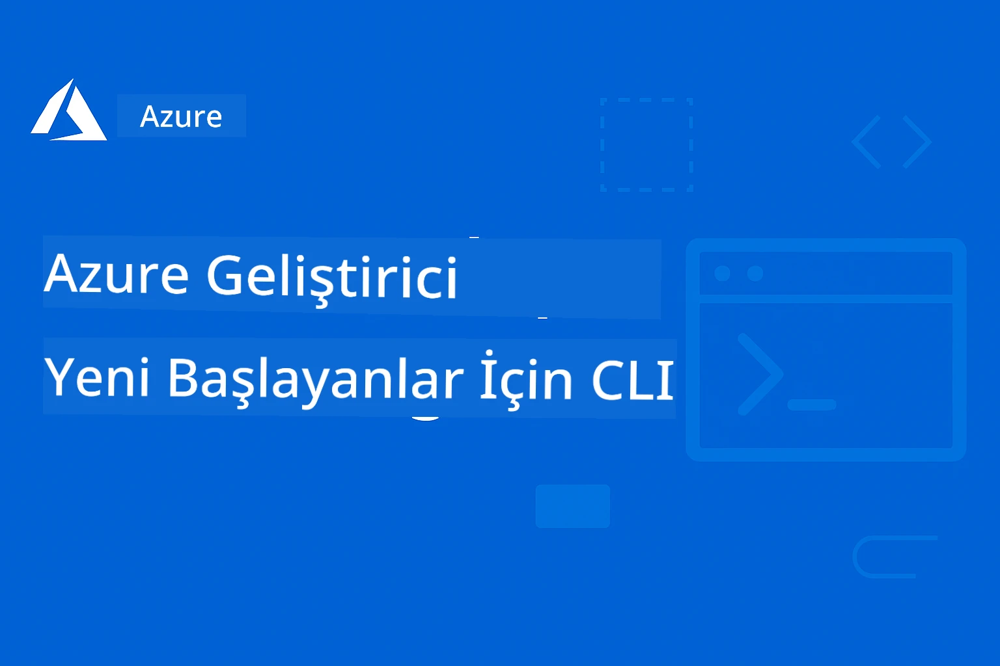

# Başlangıç ​​Seviyesindekiler İçin AZD: Yapılandırılmış Bir Öğrenme Yolculuğu

 

[](https://GitHub.com/microsoft/azd-for-beginners/watchers/)
[](https://GitHub.com/microsoft/azd-for-beginners/network/)
[](https://GitHub.com/microsoft/azd-for-beginners/stargazers/)

[](https://discord.gg/microsoft-azure)
[](https://discord.gg/nTYy5BXMWG)

## Bu Kursa Başlarken

AZD öğrenme yolculuğunuza başlamak için şu adımları izleyin:

1. **Depoyu Forklayın**: Tıklayın [](https://GitHub.com/microsoft/azd-for-beginners/fork)
2. **Depoyu Klonlayın**: `git clone https://github.com/microsoft/azd-for-beginners.git`
3. **Topluluğa Katılın**: Uzman desteği için [Azure Discord Toplulukları](https://discord.com/invite/ByRwuEEgH4)
4. **Öğrenme Yolunuzu Seçin**: Deneyim seviyenize uygun aşağıdaki bölümlerden birini seçin

### Çoklu Dil Desteği

#### Otomatik Çeviriler (Her Zaman Güncel)

<!-- CO-OP TRANSLATOR LANGUAGES TABLE START -->
[Arabic](../ar/README.md) | [Bengali](../bn/README.md) | [Bulgarian](../bg/README.md) | [Burmese (Myanmar)](../my/README.md) | [Chinese (Simplified)](../zh-CN/README.md) | [Chinese (Traditional, Hong Kong)](../zh-HK/README.md) | [Chinese (Traditional, Macau)](../zh-MO/README.md) | [Chinese (Traditional, Taiwan)](../zh-TW/README.md) | [Croatian](../hr/README.md) | [Czech](../cs/README.md) | [Danish](../da/README.md) | [Dutch](../nl/README.md) | [Estonian](../et/README.md) | [Finnish](../fi/README.md) | [French](../fr/README.md) | [German](../de/README.md) | [Greek](../el/README.md) | [Hebrew](../he/README.md) | [Hindi](../hi/README.md) | [Hungarian](../hu/README.md) | [Indonesian](../id/README.md) | [Italian](../it/README.md) | [Japanese](../ja/README.md) | [Kannada](../kn/README.md) | [Korean](../ko/README.md) | [Lithuanian](../lt/README.md) | [Malay](../ms/README.md) | [Malayalam](../ml/README.md) | [Marathi](../mr/README.md) | [Nepali](../ne/README.md) | [Nigerian Pidgin](../pcm/README.md) | [Norwegian](../no/README.md) | [Persian (Farsi)](../fa/README.md) | [Polish](../pl/README.md) | [Portuguese (Brazil)](../pt-BR/README.md) | [Portuguese (Portugal)](../pt-PT/README.md) | [Punjabi (Gurmukhi)](../pa/README.md) | [Romanian](../ro/README.md) | [Russian](../ru/README.md) | [Serbian (Cyrillic)](../sr/README.md) | [Slovak](../sk/README.md) | [Slovenian](../sl/README.md) | [Spanish](../es/README.md) | [Swahili](../sw/README.md) | [Swedish](../sv/README.md) | [Tagalog (Filipino)](../tl/README.md) | [Tamil](../ta/README.md) | [Telugu](../te/README.md) | [Thai](../th/README.md) | [Turkish](./README.md) | [Ukrainian](../uk/README.md) | [Urdu](../ur/README.md) | [Vietnamese](../vi/README.md)

> **Yerel Olarak Klonlamayı Tercih Ediyor musunuz?**

> Bu depo 50'den fazla dil çevirisi içerir, bu da indirme boyutunu önemli ölçüde artırır. Çeviriler olmadan klonlamak için, seyrek checkout kullanın:
> ```bash
> git clone --filter=blob:none --sparse https://github.com/microsoft/AZD-for-beginners.git
> cd AZD-for-beginners
> git sparse-checkout set --no-cone '/*' '!translations' '!translated_images'
> ```
> Bu size kursu tamamlamak için gereken her şeyi çok daha hızlı bir indirme ile sağlar.
<!-- CO-OP TRANSLATOR LANGUAGES TABLE END -->

## Kurs Genel Bakışı

Azure Developer CLI (azd) konusunda ilerlemeli öğrenme için tasarlanmış yapılandırılmış bölümlerle ustalaşın. **Microsoft Foundry entegrasyonu ile AI uygulama dağıtımına özel odaklanma.**

### Bu Kurs Modern Geliştiriciler İçin Neden Önemlidir

Microsoft Foundry Discord topluluk içgörülerine dayanarak, **geliştiricilerin %45'i AI iş yükleri için AZD kullanmak istiyor** ancak aşağıdaki konularda zorluklarla karşılaşıyorlar:
- Karmaşık çok servisli AI mimarileri
- Üretim AI dağıtımında en iyi uygulamalar
- Azure AI servis entegrasyonu ve yapılandırması
- AI iş yüklerinde maliyet optimizasyonu
- AI'a özgü dağıtım sorunlarının giderilmesi

### Öğrenme Hedefleri

Bu yapılandırılmış kursu tamamlayarak şunları yapabileceksiniz:
- **AZD Temellerini Öğrenmek**: Temel kavramlar, kurulum ve yapılandırma
- **AI Uygulamaları Dağıtmak**: AZD’yi Microsoft Foundry servisleri ile kullanmak
- **Altyapıyı Kod Olarak Uygulamak**: Azure kaynaklarını Bicep şablonlarıyla yönetmek
- **Dağıtımları Sorun Giderme**: Yaygın sorunları çözmek ve hata ayıklamak
- **Üretim İçin Optimize Etmek**: Güvenlik, ölçekleme, izleme ve maliyet yönetimi
- **Çoklu Agent Çözümleri Oluşturmak**: Karmaşık AI mimarileri dağıtmak

## 📚 Öğrenme Bölümleri

*Deneyim seviyesi ve hedeflere göre öğrenme yolunuzu seçin*

### 🚀 Bölüm 1: Temel ve Hızlı Başlangıç
**Ön Koşullar**: Azure aboneliği, temel komut satırı bilgisi  
**Süre**: 30-45 dakika  
**Zorluk Seviyesi**: ⭐

#### Öğrenecekleriniz
- Azure Developer CLI temellerini anlamak
- Platformunuzda AZD kurmak
- İlk başarılı dağıtımınız

#### Öğrenme Kaynakları
- **🎯 Başlangıç Noktası**: [Azure Developer CLI Nedir?](../..)
- **📖 Teori**: [AZD Temelleri](docs/getting-started/azd-basics.md) - Temel kavramlar ve terimler
- **⚙️ Kurulum**: [Kurulum ve Ayarlar](docs/getting-started/installation.md) - Platforma özel rehberler
- **🛠️ Uygulamalı**: [İlk Projeniz](docs/getting-started/first-project.md) - Adım adım rehber
- **📋 Hızlı Referans**: [Komut Cheat Sheet](resources/cheat-sheet.md)

#### Pratik Egzersizler
```bash
# Hızlı kurulum kontrolü
azd version

# İlk uygulamanızı dağıtın
azd init --template todo-nodejs-mongo
azd up
```

**💡 Bölüm Sonucu**: AZD ile basit bir web uygulamasını Azure'a başarıyla dağıtmak

**✅ Başarı Doğrulama:**
```bash
# 1. Bölümü tamamladıktan sonra şunları yapabilmelisiniz:
azd version              # Yüklü olan sürümü gösterir
azd init --template todo-nodejs-mongo  # Projeyi başlatır
azd up                  # Azure'a dağıtır
azd show                # Çalışan uygulamanın URL'sini gösterir
# Uygulama tarayıcıda açılır ve çalışır
azd down --force --purge  # Kaynakları temizler
```

**📊 Zaman Yatırımı:** 30-45 dakika  
**📈 Öğrenme Seviyesi Sonrası:** Temel uygulamaları bağımsız olarak dağıtabilir

**✅ Başarı Doğrulama:**
```bash
# Bölüm 1'i tamamladıktan sonra şunları yapabilmelisiniz:
azd version              # Yüklü sürümü gösterir
azd init --template todo-nodejs-mongo  # Projeyi başlatır
azd up                  # Azure'a dağıtır
azd show                # Çalışan uygulama URL'sini gösterir
# Uygulama tarayıcıda açılır ve çalışır
azd down --force --purge  # Kaynakları temizler
```

**📊 Zaman Yatırımı:** 30-45 dakika  
**📈 Öğrenme Seviyesi Sonrası:** Temel uygulamaları bağımsız olarak dağıtabilir

---

### 🤖 Bölüm 2: AI-Öncelikli Geliştirme (AI Geliştiricileri İçin Önerilir)
**Ön Koşullar**: Bölüm 1 tamamlandı  
**Süre**: 1-2 saat  
**Zorluk Seviyesi**: ⭐⭐

#### Öğrenecekleriniz
- Microsoft Foundry entegrasyonu ile AZD kullanımı
- AI destekli uygulamaların dağıtımı
- AI servis yapılandırmalarını anlamak

#### Öğrenme Kaynakları
- **🎯 Başlangıç Noktası**: [Microsoft Foundry Entegrasyonu](docs/microsoft-foundry/microsoft-foundry-integration.md)
- **📖 Kalıplar**: [AI Model Dağıtımı](docs/microsoft-foundry/ai-model-deployment.md) - AI modellerini dağıt ve yönet
- **🛠️ Atölye**: [AI Atölye Laboratuvarı](docs/microsoft-foundry/ai-workshop-lab.md) - AI çözümlerinizi AZD’ye uygun hale getirin
- **🎥 Etkileşimli Rehber**: [Atölye Materyalleri](workshop/README.md) - Tarayıcı tabanlı öğrenme MkDocs * DevContainer Ortamı ile
- **📋 Şablonlar**: [Microsoft Foundry Şablonları](../..)
- **📝 Örnekler**: [AZD Dağıtım Örnekleri](examples/README.md)

#### Pratik Egzersizler
```bash
# İlk AI uygulamanızı dağıtın
azd init --template azure-search-openai-demo
azd up

# Ek AI şablonlarını deneyin
azd init --template openai-chat-app-quickstart
azd init --template agent-openai-python-prompty
```

**💡 Bölüm Sonucu**: RAG yeteneklerine sahip AI destekli bir sohbet uygulamasını dağıtıp yapılandırmak

**✅ Başarı Doğrulama:**
```bash
# 2. Bölümden sonra şunları yapabilmelisiniz:
azd init --template azure-search-openai-demo
azd up
# AI sohbet arayüzünü test edin
# Sorular sorun ve kaynaklarla AI destekli cevaplar alın
# Arama entegrasyonunun çalıştığını doğrulayın
azd monitor  # Application Insights'ın telemetri gösterdiğini kontrol edin
azd down --force --purge
```

**📊 Zaman Yatırımı:** 1-2 saat  
**📈 Öğrenme Seviyesi Sonrası:** Üretim hazır AI uygulamalarını dağıtıp yapılandırabilir  
**💰 Maliyet Bilinci:** Aylık 80-150$ geliştirme, 300-3500$ üretim maliyetlerini anlayabilir

#### 💰 AI Dağıtımları İçin Maliyet Hususları

**Geliştirme Ortamı (Tahmini 80-150$/ay):**
- Azure OpenAI (Kullandıkça öde): 0-50$/ay (token kullanımına bağlı)
- AI Search (Temel katman): 75$/ay
- Container Apps (Tüketim): 0-20$/ay
- Depolama (Standart): 1-5$/ay

**Üretim Ortamı (Tahmini 300-3,500+$/ay):**
- Azure OpenAI (Tutarlı performans için PTU): 3,000+$/ay YA DA yüksek hacimli Kullandıkça öde
- AI Search (Standart katman): 250$/ay
- Container Apps (Tahsisli): 50-100$/ay
- Application Insights: 5-50$/ay
- Depolama (Premium): 10-50$/ay

**💡 Maliyeti Optimize Etme İpuçları:**
- Öğrenmek için **Ücretsiz Katman** Azure OpenAI kullanın (aylık 50.000 token dahil)
- Aktif geliştirme yapmadığınızda kaynakları boşaltmak için `azd down` kullanın
- Önce tüketim bazlı faturalandırma ile başlayın, üretim için yalnızca PTU’ya geçin
- Dağıtımdan önce maliyet tahmini için `azd provision --preview` kullanın
- Otomatik ölçeklendirmeyi etkinleştirin: sadece gerçek kullanımı ödeyin

**Maliyet İzleme:**
```bash
# Tahmini aylık maliyetleri kontrol edin
azd provision --preview

# Gerçek maliyetleri Azure Portal'da izleyin
az consumption budget list --resource-group <your-rg>
```

---

### ⚙️ Bölüm 3: Yapılandırma ve Kimlik Doğrulama
**Ön Koşullar**: Bölüm 1 tamamlandı  
**Süre**: 45-60 dakika  
**Zorluk Seviyesi**: ⭐⭐

#### Öğrenecekleriniz
- Ortam yapılandırması ve yönetimi
- Kimlik doğrulama ve güvenlik en iyi uygulamaları
- Kaynak isimlendirme ve organizasyonu

#### Öğrenme Kaynakları
- **📖 Yapılandırma**: [Yapılandırma Rehberi](docs/getting-started/configuration.md) - Ortam kurulumu
- **🔐 Güvenlik**: [Kimlik Doğrulama kalıpları ve yönetilen kimlik](docs/getting-started/authsecurity.md) - Kimlik doğrulama kalıpları
- **📝 Örnekler**: [Veritabanı Uygulaması Örneği](examples/database-app/README.md) - AZD Veritabanı Örnekleri

#### Pratik Egzersizler
- Birden fazla ortamı (geliştirme, hazırlık, üretim) yapılandırma
- Yönetilen kimlik kimlik doğrulamasını kurma
- Ortama özgü yapılandırmaları uygulama

**💡 Bölüm Sonucu**: Uygun kimlik doğrulama ve güvenlik ile birden fazla ortamı yönetmek

---

### 🏗️ Bölüm 4: Kod Olarak Altyapı & Dağıtım
**Ön Koşullar**: Bölümler 1-3 tamamlandı  
**Süre**: 1-1.5 saat  
**Zorluk Seviyesi**: ⭐⭐⭐

#### Öğrenecekleriniz
- İleri dağıtım kalıpları
- Bicep ile Kod olarak altyapı
- Kaynak sağlama stratejileri

#### Öğrenme Kaynakları
- **📖 Dağıtım**: [Dağıtım Rehberi](docs/deployment/deployment-guide.md) - Tam iş akışları
- **🏗️ Sağlama**: [Kaynak Sağlama](docs/deployment/provisioning.md) - Azure kaynak yönetimi
- **📝 Örnekler**: [Container Uygulaması Örneği](../../examples/container-app) - Konteyner tabanlı dağıtımlar

#### Pratik Egzersizler
- Özel Bicep şablonları oluşturma
- Çok servisli uygulamaları dağıtma
- Mavi-yeşil dağıtım stratejileri uygulama

**💡 Bölüm Sonucu**: Özel altyapı şablonları kullanarak karmaşık çok servisli uygulamaları dağıtmak

---

### 🎯 Bölüm 5: Çoklu Agent AI Çözümleri (İleri Düzey)
**Ön Koşullar**: Bölümler 1-2 tamamlandı  
**Süre**: 2-3 saat  
**Zorluk Seviyesi**: ⭐⭐⭐⭐
#### Öğrenecekleriniz
- Çoklu ajan mimarisi desenleri
- Ajan düzenleme ve koordinasyonu
- Üretime hazır AI dağıtımları

#### Öğrenme Kaynakları
- **🤖 Öne Çıkan Proje**: [Perakende Çoklu Ajan Çözümü](examples/retail-scenario.md) - Tam uygulama
- **🛠️ ARM Şablonları**: [ARM Şablon Paketi](../../examples/retail-multiagent-arm-template) - Tek tıklamayla dağıtım
- **📖 Mimari**: [Çoklu ajan koordinasyon desenleri](/docs/pre-deployment/coordination-patterns.md) - Desenler

#### Pratik Egzersizler
```bash
# Tam perakende çok ajanlı çözümünü dağıtın
cd examples/retail-multiagent-arm-template
./deploy.sh

# Ajan yapılandırmalarını keşfedin
az deployment group show --resource-group <rg-name> --name <deployment-name>
```

**💡 Bölüm Sonucu**: Müşteri ve Envanter ajanlarıyla üretime hazır çoklu ajan AI çözümü dağıtın ve yönetin

---

### 🔍 Bölüm 6: Dağıtımdan Önce Doğrulama & Planlama
**Önkoşullar**: Bölüm 4 tamamlandı  
**Süre**: 1 saat  
**Zorluk**: ⭐⭐

#### Öğrenecekleriniz
- Kapasite planlaması ve kaynak doğrulaması
- SKU seçim stratejileri
- Ön kontrol ve otomasyon

#### Öğrenme Kaynakları
- **📊 Planlama**: [Kapasite Planlaması](docs/pre-deployment/capacity-planning.md) - Kaynak doğrulaması
- **💰 Seçim**: [SKU Seçimi](docs/pre-deployment/sku-selection.md) - Maliyet etkin seçimler
- **✅ Doğrulama**: [Ön kontrolller](docs/pre-deployment/preflight-checks.md) - Otomatik komut dosyaları

#### Pratik Egzersizler
- Kapasite doğrulama komut dosyalarını çalıştırın
- Maliyet için SKU seçimlerini optimize edin
- Otomatik ön dağıtım kontrollerini uygulayın

**💡 Bölüm Sonucu**: Dağıtımları yürütmeden önce doğrulayın ve optimize edin

---

### 🚨 Bölüm 7: Sorun Giderme & Hata Ayıklama
**Önkoşullar**: Herhangi bir dağıtım bölümü tamamlandı  
**Süre**: 1-1.5 saat  
**Zorluk**: ⭐⭐

#### Öğrenecekleriniz
- Sistematik hata ayıklama yaklaşımları
- Yaygın sorunlar ve çözümleri
- AI’ya özgü sorun giderme

#### Öğrenme Kaynakları
- **🔧 Yaygın Sorunlar**: [Yaygın Sorunlar](docs/troubleshooting/common-issues.md) - SSS ve çözümler
- **🕵️ Hata Ayıklama**: [Hata Ayıklama Rehberi](docs/troubleshooting/debugging.md) - Adım adım stratejiler
- **🤖 AI Sorunları**: [AI’ya Özgü Sorun Giderme](docs/troubleshooting/ai-troubleshooting.md) - AI servis problemleri

#### Pratik Egzersizler
- Dağıtım hatalarını teşhis edin
- Kimlik doğrulama sorunlarını çözün
- AI servis bağlantısını hata ayıklayın

**💡 Bölüm Sonucu**: Yaygın dağıtım sorunlarını bağımsız olarak teşhis edip çözün

---

### 🏢 Bölüm 8: Üretim & Kurumsal Desenler
**Önkoşullar**: Bölümler 1-4 tamamlandı  
**Süre**: 2-3 saat  
**Zorluk**: ⭐⭐⭐⭐

#### Öğrenecekleriniz
- Üretim dağıtım stratejileri
- Kurumsal güvenlik desenleri
- İzleme ve maliyet optimizasyonu

#### Öğrenme Kaynakları
- **🏭 Üretim**: [Üretim AI En İyi Uygulamaları](docs/microsoft-foundry/production-ai-practices.md) - Kurumsal desenler
- **📝 Örnekler**: [Mikroservis Örneği](../../examples/microservices) - Karmaşık mimariler
- **📊 İzleme**: [Application Insights entegrasyonu](docs/pre-deployment/application-insights.md) - İzleme

#### Pratik Egzersizler
- Kurumsal güvenlik desenlerini uygulayın
- Kapsamlı izleme kurun
- Doğru yönetişim ile üretime dağıtım yapın

**💡 Bölüm Sonucu**: Tam üretim yetenekleriyle kurumsal uygulamalar dağıtın

---

## 🎓 Atölye Genel Bakış: Uygulamalı Öğrenme Deneyimi

> **⚠️ ATÖLYE DURUMU: Geliştirme Aşamasında**  
> Atölye materyalleri şu anda geliştiriliyor ve iyileştiriliyor. Temel modüller çalışır durumda, ancak bazı ileri bölümler tamamlanmamış. Tüm içeriği tamamlamak için aktif şekilde çalışıyoruz. [İlerlemeni takip et →](workshop/README.md)

### Etkileşimli Atölye Materyalleri
**Tarayıcı tabanlı araçlar ve rehberli egzersizlerle kapsamlı uygulamalı öğrenme**

Atölye materyallerimiz, yukarıdaki bölüm tabanlı öğretim programına tamamlayıcı, yapılandırılmış ve etkileşimli bir öğrenme deneyimi sunar. Atölye, hem kendi hızınızda öğrenme hem de eğitmen destekli oturumlar için tasarlanmıştır.

#### 🛠️ Atölye Özellikleri
- **Tarayıcı Tabanlı Arayüz**: Arama, kopyalama ve tema özellikleri ile MkDocs destekli tam atölye ortamı
- **GitHub Codespaces Entegrasyonu**: Tek tıklamayla geliştirme ortamı kurulumu
- **Yapılandırılmış Öğrenme Yolu**: 7 adımlı rehberli egzersizler (toplam 3,5 saat)
- **Keşif → Dağıtım → Özelleştirme**: Aşamalı metodoloji
- **Etkileşimli DevContainer Ortamı**: Önceden yapılandırılmış araçlar ve bağımlılıklar

#### 📚 Atölye Yapısı
Atölye, **Keşif → Dağıtım → Özelleştirme** metodolojisini izler:

1. **Keşif Aşaması** (45 dakika)
   - Microsoft Foundry şablonları ve servislerini keşfedin
   - Çoklu ajan mimarisi desenlerini anlayın
   - Dağıtım gereksinimlerini ve önkoşulları inceleyin

2. **Dağıtım Aşaması** (2 saat)
   - AZD ile AI uygulamalarını uygulamalı dağıtım
   - Azure AI servisleri ve uç noktalarını yapılandırma
   - Güvenlik ve kimlik doğrulama desenlerini uygulama

3. **Özelleştirme Aşaması** (45 dakika)
   - Spesifik kullanım senaryoları için uygulamalar üzerinde değişiklik yapma
   - Üretim dağıtımı için optimizasyon
   - İzleme ve maliyet yönetimini uygulama

#### 🚀 Atölyeye Başlarken
```bash
# Seçenek 1: GitHub Codespaces (Önerilen)
# Depoda "Code" → "main üzerinde codespace oluştur" seçeneğine tıklayın

# Seçenek 2: Yerel Geliştirme
git clone https://github.com/microsoft/azd-for-beginners.git
cd azd-for-beginners/workshop
# workshop/README.md dosyasındaki kurulum talimatlarını izleyin
```

#### 🎯 Atölye Öğrenme Sonuçları
Atölyeyi tamamlayan katılımcılar:
- **Üretim AI Uygulamaları Dağıtır**: Microsoft Foundry servisleri ile AZD kullanarak
- **Çoklu Ajan Mimarilerini Ustalaştırır**: Koordine AI ajan çözümleri uygular
- **Güvenlik En İyi Uygulamalarını Uygular**: Kimlik doğrulama ve erişim kontrolünü yapılandırır
- **Ölçek İçin Optimize Eder**: Maliyet etkin ve performanslı dağıtımlar tasarlar
- **Dağıtımları Sorunsuz Giderir**: Yaygın sorunları bağımsız çözer

#### 📖 Atölye Kaynakları
- **🎥 Etkileşimli Rehber**: [Atölye Materyalleri](workshop/README.md) - Tarayıcı tabanlı öğrenme ortamı
- **📋 Adım Adım Talimatlar**: [Rehberli Egzersizler](../../workshop/docs/instructions) - Detaylı anlatımlar
- **🛠️ AI Atölye Laboratuvarı**: [AI Atölye Laboratuvarı](docs/microsoft-foundry/ai-workshop-lab.md) - AI odaklı egzersizler
- **💡 Hızlı Başlangıç**: [Atölye Kurulum Kılavuzu](workshop/README.md#quick-start) - Ortam yapılandırması

**Mükemmel İçin**: Kurumsal eğitimler, üniversite dersleri, kendi hızında öğrenme ve geliştirici kampları.

---

## 📖 Azure Developer CLI Nedir?

Azure Developer CLI (azd), uygulamaların Azure'a hızlıca oluşturulması ve dağıtılması sürecini hızlandıran geliştirici odaklı bir komut satırı aracıdır. Sağladıkları:

- **Şablon tabanlı dağıtımlar** - Yaygın uygulama desenleri için önceden hazırlanmış şablonlar kullanın
- **Kod olarak Altyapı** - Azure kaynaklarını Bicep veya Terraform ile yönetin  
- **Entegre iş akışları** - Uygulamaların sorunsuzca sağlanması, dağıtılması ve izlenmesi
- **Geliştirici dostu** - Geliştirici üretkenliği ve deneyimi için optimize edildi

### **AZD + Microsoft Foundry: AI Dağıtımları İçin Mükemmel**

**Neden AI Çözümleri İçin AZD?** AZD, AI geliştiricilerinin karşılaştığı en önemli zorlukları ele alır:

- **AI Hazır Şablonlar** - Azure OpenAI, Cognitive Services ve ML iş yükleri için ön yapılandırılmış şablonlar
- **Güvenli AI Dağıtımları** - AI servisleri, API anahtarları ve model uç noktaları için yerleşik güvenlik desenleri  
- **Üretim AI Desenleri** - Ölçeklenebilir, maliyet etkin AI uygulama dağıtımı için en iyi uygulamalar
- **Uçtan Uca AI İş Akışları** - Model geliştirmeden üretime dağıtıma kadar uygun izleme ile
- **Maliyet Optimizasyonu** - AI iş yükleri için akıllı kaynak tahsisi ve ölçeklendirme stratejileri
- **Microsoft Foundry Entegrasyonu** - Microsoft Foundry model kataloğu ve uç noktalarına sorunsuz bağlantı

---

## 🎯 Şablonlar & Örnekler Kütüphanesi

### Öne Çıkan: Microsoft Foundry Şablonları
**AI uygulamaları dağıtıyorsanız buradan başlayın!**

> **Not:** Bu şablonlar çeşitli AI desenlerini gösterir. Bazıları harici Azure Örnekleridir, bazıları yerel uygulamalardır.

| Şablon | Bölüm | Zorluk | Servisler | Tür |
|--------|--------|--------|-----------|-----|
| [**AI sohbet ile başlayın**](https://github.com/Azure-Samples/get-started-with-ai-chat) | Bölüm 2 | ⭐⭐ | AzureOpenAI + Azure AI Model Inference API + Azure AI Search + Azure Container Apps + Application Insights | Harici |
| [**AI ajanları ile başlayın**](https://github.com/Azure-Samples/get-started-with-ai-agents) | Bölüm 2 | ⭐⭐ | Azure AI Agent Service + AzureOpenAI + Azure AI Search + Azure Container Apps + Application Insights | Harici |
| [**Azure Search + OpenAI Demo**](https://github.com/Azure-Samples/azure-search-openai-demo) | Bölüm 2 | ⭐⭐ | AzureOpenAI + Azure AI Search + App Service + Storage | Harici |
| [**OpenAI Chat App Hızlı Başlangıç**](https://github.com/Azure-Samples/openai-chat-app-quickstart) | Bölüm 2 | ⭐ | AzureOpenAI + Container Apps + Application Insights | Harici |
| [**Agent OpenAI Python Prompty**](https://github.com/Azure-Samples/agent-openai-python-prompty) | Bölüm 5 | ⭐⭐⭐ | AzureOpenAI + Azure Functions + Prompty | Harici |
| [**Contoso Chat RAG**](https://github.com/Azure-Samples/contoso-chat) | Bölüm 8 | ⭐⭐⭐⭐ | AzureOpenAI + AI Search + Cosmos DB + Container Apps | Harici |
| [**Perakende Çoklu Ajan Çözümü**](examples/retail-scenario.md) | Bölüm 5 | ⭐⭐⭐⭐ | AzureOpenAI + AI Search + Storage + Container Apps + Cosmos DB | **Yerel** |

### Öne Çıkan: Tam Öğrenme Senaryoları
**Üretime hazır uygulama şablonları öğrenme bölümleriyle eşleştirilmiş**

| Şablon | Öğrenme Bölümü | Zorluk | Temel Öğrenme |
|--------|----------------|--------|---------------|
| [**openai-chat-app-quickstart**](https://github.com/Azure-Samples/openai-chat-app-quickstart) | Bölüm 2 | ⭐ | Temel AI dağıtım desenleri |
| [**azure-search-openai-demo**](https://github.com/Azure-Samples/azure-search-openai-demo) | Bölüm 2 | ⭐⭐ | Azure AI Search ile RAG uygulaması |
| [**ai-document-processing**](https://github.com/Azure-Samples/ai-document-processing) | Bölüm 4 | ⭐⭐ | Belge Zekası entegrasyonu |
| [**agent-openai-python-prompty**](https://github.com/Azure-Samples/agent-openai-python-prompty) | Bölüm 5 | ⭐⭐⭐ | Ajan çerçevesi ve fonksiyon çağırma |
| [**contoso-chat**](https://github.com/Azure-Samples/contoso-chat) | Bölüm 8 | ⭐⭐⭐ | Kurumsal AI düzenleme |
| [**retail-multi-agent-solution**](examples/retail-scenario.md) | Bölüm 5 | ⭐⭐⭐⭐ | Müşteri ve Envanter ajanlarıyla çoklu ajan mimarisi |

### Örnek Türüne Göre Öğrenme

> **📌 Yerel vs. Harici Örnekler:**  
> **Yerel Örnekler** (bu depo içinde) = Hemen kullanıma hazır  
> **Harici Örnekler** (Azure Örnekleri) = Bağlantılı depolardan klonlanabilir

#### Yerel Örnekler (Kullanıma Hazır)
- [**Perakende Çoklu Ajan Çözümü**](examples/retail-scenario.md) - ARM şablonları ile tam üretime hazır uygulama
  - Çoklu ajan mimarisi (Müşteri + Envanter ajanları)
  - Kapsamlı izleme ve değerlendirme
  - ARM şablonu ile tek tıklama dağıtımı

#### Yerel Örnekler - Konteyner Uygulamaları (Bölümler 2-5)
**Bu depoda kapsamlı konteyner dağıtım örnekleri:**
- [**Konteyner Uygulama Örnekleri**](examples/container-app/README.md) - Konteynerleştirilmiş dağıtımlar için tam rehber
  - [Basit Flask API](../../examples/container-app/simple-flask-api) - Sıfıra ölçeklenen temel REST API
  - [Mikroservis Mimarisi](../../examples/container-app/microservices) - Üretime hazır çok servisli dağıtım
  - Hızlı Başlangıç, Üretim ve Gelişmiş dağıtım desenleri
  - İzleme, güvenlik ve maliyet optimizasyonu rehberliği

#### Harici Örnekler - Basit Uygulamalar (Bölümler 1-2)
**Başlamak için bu Azure Örnekleri depolarını klonlayın:**
- [Basit Web Uygulaması - Node.js + MongoDB](https://github.com/Azure-Samples/todo-nodejs-mongo) - Temel dağıtım desenleri
- [Statik Web Sitesi - React SPA](https://github.com/Azure-Samples/todo-csharp-sql-swa-func) - Statik içerik dağıtımı
- [Konteyner Uygulama - Python Flask](https://github.com/Azure-Samples/container-apps-store-api-microservice) - REST API dağıtımı

#### Harici Örnekler - Veritabanı Entegrasyonu (Bölümler 3-4)  
- [Veritabanı Uygulaması - C# + SQL](https://github.com/Azure-Samples/todo-csharp-sql) - Veritabanı bağlantı desenleri
- [Functions + Cosmos DB](https://github.com/Azure-Samples/todo-python-mongo-swa-func) - Sunucusuz veri iş akışı

#### Harici Örnekler - İleri Düzey Desenler (Bölümler 4-8)
- [Java Mikroservisler](https://github.com/Azure-Samples/java-microservices-aca-lab) - Çoklu servis mimarileri
- [Konteyner Uygulamaları İşleri](https://github.com/Azure-Samples/container-apps-jobs) - Arka plan işlemleri  
- [Kurumsal ML Boru Hattı](https://github.com/Azure-Samples/mlops-v2) - Üretime hazır ML desenleri

### Harici Şablon Koleksiyonları
- [**Resmi AZD Şablon Galerisi**](https://azure.github.io/awesome-azd/) - Resmi ve topluluk şablonlarının küratörlüğünü yapan koleksiyon
- [**Azure Geliştirici CLI Şablonları**](https://learn.microsoft.com/en-us/azure/developer/azure-developer-cli/azd-templates) - Microsoft Learn şablon dokümantasyonu
- [**Örnekler Dizini**](examples/README.md) - Ayrıntılı açıklamalarla yerel öğrenme örnekleri

---

## 📚 Öğrenme Kaynakları & Referanslar

### Hızlı Referanslar
- [**Komut Hile Sayfası**](resources/cheat-sheet.md) - Bölümlere göre düzenlenmiş temel azd komutları
- [**Terimler Sözlüğü**](resources/glossary.md) - Azure ve azd terimleri  
- [**SSS**](resources/faq.md) - Öğrenme bölümlerine göre düzenlenmiş sık sorulan sorular
- [**Çalışma Rehberi**](resources/study-guide.md) - Kapsamlı uygulama egzersizleri

### Uygulamalı Atölyeler
- [**AI Atölye Laboratuvarı**](docs/microsoft-foundry/ai-workshop-lab.md) - AI çözümlerinizi AZD ile dağıtılabilir hale getirin (2-3 saat)
- [**Etkileşimli Atölye Kılavuzu**](workshop/README.md) - MkDocs ve DevContainer Ortamı ile tarayıcı tabanlı atölye
- [**Yapılandırılmış Öğrenme Yolu**](../../workshop/docs/instructions) - 7 adımlı rehberli egzersizler (Keşif → Dağıtım → Özelleştirme)
- [**Yeni Başlayanlar için AZD Atölyesi**](workshop/README.md) - GitHub Codespaces entegrasyonlu tam uygulamalı atölye materyalleri

### Harici Öğrenme Kaynakları
- [Azure Geliştirici CLI Dokümantasyonu](https://learn.microsoft.com/en-us/azure/developer/azure-developer-cli/)
- [Azure Mimari Merkezi](https://learn.microsoft.com/en-us/azure/architecture/)
- [Azure Fiyatlandırma Hesaplayıcısı](https://azure.microsoft.com/pricing/calculator/)
- [Azure Durumu](https://status.azure.com/)

---

## 🔧 Hızlı Sorun Giderme Rehberi

**Yeni başlayanların sık karşılaştığı problemler ve hızlı çözümleri:**

### ❌ "azd: komut bulunamadı"

```bash
# Önce AZD'yi yükleyin
# Windows (PowerShell):
winget install microsoft.azd

# macOS:
brew tap azure/azd && brew install azd

# Linux:
curl -fsSL https://aka.ms/install-azd.sh | bash

# Kurulumu doğrulayın
azd version
```

### ❌ "Abonelik bulunamadı" veya "Abonelik ayarlanmadı"

```bash
# Mevcut abonelikleri listele
az account list --output table

# Varsayılan aboneliği ayarla
az account set --subscription "<subscription-id-or-name>"

# AZD ortamı için ayarla
azd env set AZURE_SUBSCRIPTION_ID "<subscription-id>"

# Doğrula
az account show
```

### ❌ "Yetersiz Kota" veya "Kota aşıldı"

```bash
# Farklı bir Azure bölgesi deneyin
azd env set AZURE_LOCATION "westus2"
azd up

# Ya da geliştirmede daha küçük SKU'lar kullanın
# infra/main.parameters.json dosyasını düzenleyin:
{
  "sku": "B1"  // Instead of "P1V2"
}
```

### ❌ "azd up" işlemi yarıda başarısız oluyor

```bash
# Seçenek 1: Temizle ve tekrar dene
azd down --force --purge
azd up

# Seçenek 2: Sadece altyapıyı düzelt
azd provision

# Seçenek 3: Ayrıntılı günlükleri kontrol et
azd show
azd logs
```

### ❌ "Kimlik doğrulama başarısız" veya "Token süresi doldu"

```bash
# Yeniden kimlik doğrulama
az logout
az login

azd auth logout
azd auth login

# Kimlik doğrulamayı doğrula
az account show
```

### ❌ "Kaynak zaten mevcut" veya adlandırma çakışmaları

```bash
# AZD benzersiz isimler oluşturur, ancak çakışma olursa:
azd down --force --purge

# O zaman yeni bir ortam ile tekrar deneyin
azd env new dev-v2
azd up
```

### ❌ Şablon dağıtımı çok uzun sürüyor

**Normal bekleme süreleri:**
- Basit web uygulaması: 5-10 dakika
- Veritabanı içeren uygulama: 10-15 dakika
- AI uygulamaları: 15-25 dakika (OpenAI sağlanması yavaş)

```bash
# İlerlemi kontrol et
azd show

# 30 dakikadan fazla takılı kalındıysa, Azure Portal'ı kontrol et:
azd monitor
# Başarısız dağıtımları ara
```

### ❌ "İzin reddedildi" veya "Yasaklandı"

```bash
# Azure rolünüzü kontrol edin
az role assignment list --assignee $(az account show --query user.name -o tsv)

# En az "Katkıda Bulunan" rolüne ihtiyacınız var
# Azure yöneticinizden şunu istemeniz gerekir:
# - Katkıda Bulunan (kaynaklar için)
# - Kullanıcı Erişim Yöneticisi (rol atamaları için)
```

### ❌ Dağıtılmış uygulama URL’si bulunamıyor

```bash
# Tüm servis uç noktalarını göster
azd show

# Veya Azure Portalı aç
azd monitor

# Belirli servisi kontrol et
azd env get-values
# *_URL değişkenlerini ara
```

### 📚 Tam Sorun Giderme Kaynakları

- **Yaygın Sorunlar Rehberi:** [Detaylı Çözümler](docs/troubleshooting/common-issues.md)
- **AI'ya Özel Sorunlar:** [AI Sorun Giderme](docs/troubleshooting/ai-troubleshooting.md)
- **Hata Ayıklama Kılavuzu:** [Adım Adım Hata Ayıklama](docs/troubleshooting/debugging.md)
- **Yardım Alın:** [Azure Discord](https://discord.gg/microsoft-azure) #azure-developer-cli

---

## 🔧 Hızlı Sorun Giderme Rehberi

**Yeni başlayanların sık karşılaştığı problemler ve hızlı çözümleri:**

<details>
<summary><strong>❌ "azd: komut bulunamadı"</strong></summary>

```bash
# Önce AZD'yi yükleyin
# Windows (PowerShell):
winget install microsoft.azd

# macOS:
brew tap azure/azd && brew install azd

# Linux:
curl -fsSL https://aka.ms/install-azd.sh | bash

# Kurulumu doğrulayın
azd version
```
</details>

<details>
<summary><strong>❌ "Abonelik bulunamadı" veya "Abonelik ayarlanmadı"</strong></summary>

```bash
# Mevcut abonelikleri listele
az account list --output table

# Varsayılan aboneliği ayarla
az account set --subscription "<subscription-id-or-name>"

# AZD ortamı için ayarla
azd env set AZURE_SUBSCRIPTION_ID "<subscription-id>"

# Doğrula
az account show
```
</details>

<details>
<summary><strong>❌ "Yetersiz Kota" veya "Kota aşıldı"</strong></summary>

```bash
# Farklı bir Azure bölgesi deneyin
azd env set AZURE_LOCATION "westus2"
azd up

# Veya geliştirmede daha küçük SKU'lar kullanın
# infra/main.parameters.json dosyasını düzenleyin:
{
  "sku": "B1"  // Instead of "P1V2"
}
```
</details>

<details>
<summary><strong>❌ "azd up" işlemi yarıda başarısız oluyor</strong></summary>

```bash
# Seçenek 1: Temizle ve tekrar dene
azd down --force --purge
azd up

# Seçenek 2: Sadece altyapıyı düzelt
azd provision

# Seçenek 3: Ayrıntılı günlükleri kontrol et
azd show
azd logs
```
</details>

<details>
<summary><strong>❌ "Kimlik doğrulama başarısız" veya "Token süresi doldu"</strong></summary>

```bash
# Yeniden kimlik doğrulama
az logout
az login

azd auth logout
azd auth login

# Kimlik doğrulamasını doğrula
az account show
```
</details>

<details>
<summary><strong>❌ "Kaynak zaten mevcut" veya adlandırma çakışmaları</strong></summary>

```bash
# AZD benzersiz isimler oluşturur, ancak çakışma olursa:
azd down --force --purge

# O zaman yeni bir ortamla tekrar dene
azd env new dev-v2
azd up
```
</details>

<details>
<summary><strong>❌ Şablon dağıtımı çok uzun sürüyor</strong></summary>

**Normal bekleme süreleri:**
- Basit web uygulaması: 5-10 dakika
- Veritabanı içeren uygulama: 10-15 dakika
- AI uygulamaları: 15-25 dakika (OpenAI sağlanması yavaş)

```bash
# İlerlemi kontrol et
azd show

# 30 dakikadan fazla takılı kalındıysa, Azure Portal'ı kontrol et:
azd monitor
# Başarısız dağıtımlara bak
```
</details>

<details>
<summary><strong>❌ "İzin reddedildi" veya "Yasaklandı"</strong></summary>

```bash
# Azure rolünüzü kontrol edin
az role assignment list --assignee $(az account show --query user.name -o tsv)

# En az "Katkıda Bulunan" rolüne ihtiyacınız var
# Azure yöneticinizden şunu talep edin:
# - Katkıda Bulunan (kaynaklar için)
# - Kullanıcı Erişim Yöneticisi (rol atamaları için)
```
</details>

<details>
<summary><strong>❌ Dağıtılmış uygulama URL’si bulunamıyor</strong></summary>

```bash
# Tüm servis uç noktalarını göster
azd show

# Ya da Azure Portal'ı aç
azd monitor

# Belirli servisi kontrol et
azd env get-values
# *_URL değişkenlerini ara
```
</details>

### 📚 Tam Sorun Giderme Kaynakları

- **Yaygın Sorunlar Rehberi:** [Detaylı Çözümler](docs/troubleshooting/common-issues.md)
- **AI'ya Özel Sorunlar:** [AI Sorun Giderme](docs/troubleshooting/ai-troubleshooting.md)
- **Hata Ayıklama Kılavuzu:** [Adım Adım Hata Ayıklama](docs/troubleshooting/debugging.md)
- **Yardım Alın:** [Azure Discord](https://discord.gg/microsoft-azure) #azure-developer-cli

---

## 🎓 Kurs Tamamlama & Sertifika

### İlerleme Takibi
Öğrenme ilerlemenizi her bölüm üzerinden takip edin:

- [ ] **Bölüm 1**: Temeller & Hızlı Başlangıç ✅
- [ ] **Bölüm 2**: AI-Öncelikli Geliştirme ✅  
- [ ] **Bölüm 3**: Yapılandırma & Kimlik Doğrulama ✅
- [ ] **Bölüm 4**: Kod Olarak Altyapı & Dağıtım ✅
- [ ] **Bölüm 5**: Çoklu Ajan AI Çözümleri ✅
- [ ] **Bölüm 6**: Ön Dağıtım Doğrulama & Planlama ✅
- [ ] **Bölüm 7**: Sorun Giderme & Hata Ayıklama ✅
- [ ] **Bölüm 8**: Üretim & Kurumsal Modeller ✅

### Öğrenme Doğrulaması
Her bölümü tamamladıktan sonra bilginizi doğrulayın:
1. **Uygulamalı Egzersiz**: Bölümün uygulamalı dağıtımını tamamlayın
2. **Bilgi Kontrolü**: Bölümünüzün SSS kısmını gözden geçirin
3. **Topluluk Tartışması**: Azure Discord’da deneyimlerinizi paylaşın
4. **Sonraki Bölüm**: Bir sonraki zorluk seviyesine geçin

### Kurs Tamamlama Avantajları
Tüm bölümleri tamamladığınızda:
- **Üretim Deneyimi**: Azure’a gerçek AI uygulamaları dağıttınız
- **Profesyonel Yetenekler**: Kurumsal hazır dağıtım becerileri  
- **Topluluk Tanınması**: Azure geliştirici topluluğunun aktif üyesi
- **Kariyer İlerlemesi**: Aranan AZD ve AI dağıtım uzmanlığı

---

## 🤝 Topluluk & Destek

### Yardım & Destek Alın
- **Teknik Sorunlar**: [Hata bildirin ve özellik isteyin](https://github.com/microsoft/azd-for-beginners/issues)
- **Öğrenme Soruları**: [Microsoft Azure Discord Topluluğu](https://discord.gg/microsoft-azure) ve [](https://discord.gg/nTYy5BXMWG)
- **AI'ya Özel Yardım**: Katılın [](https://discord.gg/nTYy5BXMWG)
- **Dokümantasyon**: [Resmi Azure Geliştirici CLI dokümantasyonu](https://learn.microsoft.com/en-us/azure/developer/azure-developer-cli/)

### Microsoft Foundry Discord’dan Topluluk Görüşleri

**#Azure Kanalından Güncel Anket Sonuçları:**
- Geliştiricilerin **%45’i** AI iş yükleri için AZD kullanmak istiyor
- **Başlıca zorluklar**: Çoklu servis dağıtımları, kimlik bilgisi yönetimi, üretim hazır olmama  
- **En çok talep edilenler**: AI’ya özel şablonlar, sorun giderme rehberleri, en iyi uygulamalar

**Topluluğumuza katılarak:**
- AZD + AI deneyimlerinizi paylaşabilir ve yardım alabilirsiniz
- Yeni AI şablonlarının erken önizlemelerine erişebilirsiniz
- AI dağıtımında en iyi uygulamalara katkıda bulunabilirsiniz
- Gelecekteki AI + AZD özellik geliştirmelerini etkileyebilirsiniz

### Kursa Katkıda Bulunma
Katkılarınızı bekliyoruz! Ayrıntılar için [Katkı Rehberimizi](CONTRIBUTING.md) okuyun:
- **İçerik İyileştirmeleri**: Mevcut bölümleri ve örnekleri geliştirin
- **Yeni Örnekler**: Gerçek dünya senaryoları ve şablonlar ekleyin  
- **Çeviri**: Çok dilli desteğin sürdürülmesine yardım edin
- **Hata Bildirimi**: Doğruluk ve açıklığı artırın
- **Topluluk Standartları**: Kapsayıcı topluluk kurallarımıza uyun

---

## 📄 Kurs Bilgileri

### Lisans
Bu proje MIT Lisansı altında lisanslanmıştır - ayrıntılar için [LICENSE](../../LICENSE) dosyasına bakın.

### İlgili Microsoft Öğrenme Kaynakları

Ekibimiz diğer kapsamlı öğrenme kursları üretmektedir:

<!-- CO-OP TRANSLATOR OTHER COURSES START -->
### LangChain
[](https://aka.ms/langchain4j-for-beginners)
[](https://aka.ms/langchainjs-for-beginners?WT.mc_id=m365-94501-dwahlin)
[](https://github.com/microsoft/langchain-for-beginners?WT.mc_id=m365-94501-dwahlin)
---

### Azure / Edge / MCP / Ajanlar
[](https://github.com/microsoft/AZD-for-beginners?WT.mc_id=academic-105485-koreyst)
[](https://github.com/microsoft/edgeai-for-beginners?WT.mc_id=academic-105485-koreyst)
[](https://github.com/microsoft/mcp-for-beginners?WT.mc_id=academic-105485-koreyst)
[](https://github.com/microsoft/ai-agents-for-beginners?WT.mc_id=academic-105485-koreyst)

---
 
### Üretken AI Serisi
[](https://github.com/microsoft/generative-ai-for-beginners?WT.mc_id=academic-105485-koreyst)
[-9333EA?style=for-the-badge&labelColor=E5E7EB&color=9333EA)](https://github.com/microsoft/Generative-AI-for-beginners-dotnet?WT.mc_id=academic-105485-koreyst)
[-C084FC?style=for-the-badge&labelColor=E5E7EB&color=C084FC)](https://github.com/microsoft/generative-ai-for-beginners-java?WT.mc_id=academic-105485-koreyst)
[-E879F9?style=for-the-badge&labelColor=E5E7EB&color=E879F9)](https://github.com/microsoft/generative-ai-with-javascript?WT.mc_id=academic-105485-koreyst)

---
 
### Temel Öğrenim
[](https://aka.ms/ml-beginners?WT.mc_id=academic-105485-koreyst)
[](https://aka.ms/datascience-beginners?WT.mc_id=academic-105485-koreyst)
[](https://aka.ms/ai-beginners?WT.mc_id=academic-105485-koreyst)
[](https://github.com/microsoft/Security-101?WT.mc_id=academic-96948-sayoung)
[](https://aka.ms/webdev-beginners?WT.mc_id=academic-105485-koreyst)
[](https://aka.ms/iot-beginners?WT.mc_id=academic-105485-koreyst)
[](https://github.com/microsoft/xr-development-for-beginners?WT.mc_id=academic-105485-koreyst)

---
 
### Copilot Serisi
[](https://aka.ms/GitHubCopilotAI?WT.mc_id=academic-105485-koreyst)
[](https://github.com/microsoft/mastering-github-copilot-for-dotnet-csharp-developers?WT.mc_id=academic-105485-koreyst)
[](https://github.com/microsoft/CopilotAdventures?WT.mc_id=academic-105485-koreyst)
<!-- CO-OP TRANSLATOR OTHER COURSES END -->

---

## 🗺️ Kurs Navigasyonu

**🚀 Öğrenmeye Hazır mısınız?**

**Yeni Başlayanlar**: [Bölüm 1: Temel ve Hızlı Başlangıç](../..) ile başlayın  
**AI Geliştiricileri**: [Bölüm 2: AI-Öncelikli Geliştirme](../..) bölümüne atlayın  
**Deneyimli Geliştiriciler**: [Bölüm 3: Yapılandırma ve Kimlik Doğrulama](../..) bölümüyle başlayın

**Sonraki Adımlar**: [Bölüm 1 - AZD Temellerine Başlayın](docs/getting-started/azd-basics.md) →

---

<!-- CO-OP TRANSLATOR DISCLAIMER START -->
**Feragatname**:  
Bu belge, AI çeviri servisi [Co-op Translator](https://github.com/Azure/co-op-translator) kullanılarak çevrilmiştir. Doğruluk için çaba gösterilse de, otomatik çevirilerin hatalar veya yanlışlıklar içerebileceğini lütfen unutmayın. Orijinal belge, kendi dilinde yetkili kaynak olarak kabul edilmelidir. Önemli bilgiler için profesyonel insan çevirisi önerilir. Bu çevirinin kullanımından kaynaklanan yanlış anlamalar veya yanlış yorumlamalar için sorumluluk kabul etmiyoruz.
<!-- CO-OP TRANSLATOR DISCLAIMER END -->