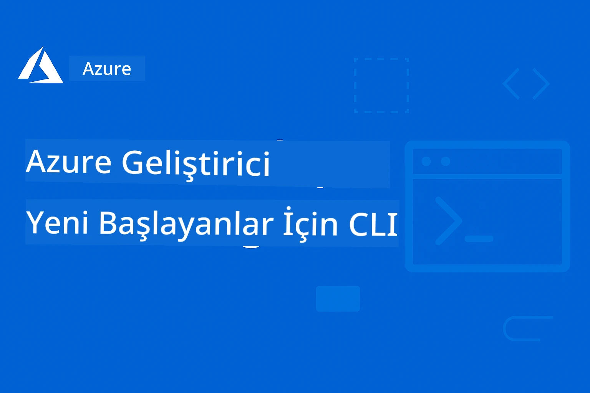

# AZD Yeni Başlayanlar İçin: Yapılandırılmış Bir Öğrenme Yolculuğu

 

[](https://GitHub.com/microsoft/azd-for-beginners/watchers/)
[](https://GitHub.com/microsoft/azd-for-beginners/network/)
[](https://GitHub.com/microsoft/azd-for-beginners/stargazers/)

[](https://discord.com/invite/nkVh3dp)
[](https://discord.gg/nTYy5BXMWG)

---

### Otomatik Çeviriler (Her Zaman Güncel)

<!-- CO-OP TRANSLATOR LANGUAGES TABLE START -->
[Arapça](../ar/README.md) | [Bengalce](../bn/README.md) | [Bulgarca](../bg/README.md) | [Burmaca (Myanmar)](../my/README.md) | [Çince (Basitleştirilmiş)](../zh-CN/README.md) | [Çince (Geleneksel, Hong Kong)](../zh-HK/README.md) | [Çince (Geleneksel, Makao)](../zh-MO/README.md) | [Çince (Geleneksel, Tayvan)](../zh-TW/README.md) | [Hırvatça](../hr/README.md) | [Çekçe](../cs/README.md) | [Danca](../da/README.md) | [Flemenkçe](../nl/README.md) | [Estonca](../et/README.md) | [Fince](../fi/README.md) | [Fransızca](../fr/README.md) | [Almanca](../de/README.md) | [Yunanca](../el/README.md) | [İbranice](../he/README.md) | [Hintçe](../hi/README.md) | [Macarca](../hu/README.md) | [Endonezce](../id/README.md) | [İtalyanca](../it/README.md) | [Japonca](../ja/README.md) | [Kannada](../kn/README.md) | [Khmer](../km/README.md) | [Korece](../ko/README.md) | [Litvanca](../lt/README.md) | [Malayca](../ms/README.md) | [Malayalam](../ml/README.md) | [Marathi](../mr/README.md) | [Nepalce](../ne/README.md) | [Nijerya Pidgin](../pcm/README.md) | [Norveççe](../no/README.md) | [Farsça (Persçe)](../fa/README.md) | [Lehçe](../pl/README.md) | [Portekizce (Brezilya)](../pt-BR/README.md) | [Portekizce (Portekiz)](../pt-PT/README.md) | [Pencapça (Gurmukhi)](../pa/README.md) | [Rumence](../ro/README.md) | [Rusça](../ru/README.md) | [Sırpça (Kiril)](../sr/README.md) | [Slovakça](../sk/README.md) | [Slovence](../sl/README.md) | [İspanyolca](../es/README.md) | [Svahili](../sw/README.md) | [İsveççe](../sv/README.md) | [Tagalog (Filipince)](../tl/README.md) | [Tamilce](../ta/README.md) | [Telugu](../te/README.md) | [Tayca](../th/README.md) | [Türkçe](./README.md) | [Ukraynaca](../uk/README.md) | [Urduca](../ur/README.md) | [Vietnamca](../vi/README.md)

> **Yerel Olarak Klonlamayı mı Tercih Ediyorsunuz?**
>
> Bu depo 50+'den fazla dil çevirisi içerir ve indirme boyutunu önemli ölçüde artırır. Çeviriler olmadan klonlamak için sparse checkout kullanın:
>
> **Bash / macOS / Linux:**
> ```bash
> git clone --filter=blob:none --sparse https://github.com/microsoft/AZD-for-beginners.git
> cd AZD-for-beginners
> git sparse-checkout set --no-cone '/*' '!translations' '!translated_images'
> ```
>
> **CMD (Windows):**
> ```cmd
> git clone --filter=blob:none --sparse https://github.com/microsoft/AZD-for-beginners.git
> cd AZD-for-beginners
> git sparse-checkout set --no-cone "/*" "!translations" "!translated_images"
> ```
>
> Bu, kursu tamamlamak için ihtiyacınız olan her şeyi çok daha hızlı bir indirme ile sağlar.
<!-- CO-OP TRANSLATOR LANGUAGES TABLE END -->

## 🆕 Bugün azd'de Yeni Olanlar

Azure Developer CLI artık geleneksel web uygulamaları ve API'lerin ötesine geçti. Bugün azd, AI destekli uygulamalar ve akıllı ajanlar da dahil olmak üzere Azure'a herhangi bir uygulamayı dağıtmak için tek araçtır.

Bu sizin için ne anlama geliyor:

- **AI ajanları artık birinci sınıf azd iş yükleridir.** Zaten bildiğiniz `azd init` → `azd up` iş akışı ile AI ajan projelerini başlatabilir, dağıtabilir ve yönetebilirsiniz.
- **Microsoft Foundry entegrasyonu**, model dağıtımı, ajan barındırma ve AI hizmet yapılandırmasını doğrudan azd şablon ekosistemine getirir.
- **Temel iş akışı değişmedi.** İster bir todo uygulaması, ister bir mikro hizmet, ister çok ajanlı bir AI çözümü dağıtıyor olun, komutlar aynıdır.

Eğer daha önce azd kullandıysanız, AI desteği ayrı bir araç veya gelişmiş bir yol değil — doğal bir genişlemedir. Yeni başlıyorsanız, her şey için işe yarayan tek bir iş akışını öğrenirsiniz.

---

## 🚀 Azure Developer CLI (azd) Nedir?

**Azure Developer CLI (azd)**, uygulamaları Azure'a dağıtmayı basitleştiren geliştirici dostu bir komut satırı aracıdır. Birçok Azure kaynağını manuel olarak oluşturup bağlamak yerine, tek bir komutla tüm uygulamaları dağıtabilirsiniz.

### `azd up` Sihri

```bash
# Bu tek komut her şeyi yapar:
# ✅ Tüm Azure kaynaklarını oluşturur
# ✅ Ağ ve güvenliği yapılandırır
# ✅ Uygulama kodunuzu derler
# ✅ Azure'a dağıtır
# ✅ Çalışan bir URL verir
azd up
```

**Hepsi bu!** Azure Portal'da tıklama yok, öğrenmeniz gereken karmaşık ARM şablonları yok, manuel yapılandırma yok - sadece çalışan uygulamalar Azure üzerinde.

---

## ❓ Azure Developer CLI ile Azure CLI: Fark Nedir?

Yeni başlayanların en çok sorduğu soru bu. İşte basit cevap:

| Özellik | **Azure CLI (`az`)** | **Azure Developer CLI (`azd`)** |
|---------|---------------------|--------------------------------|
| **Amaç** | Bireysel Azure kaynaklarını yönetmek | Tam uygulamaları dağıtmak |
| **Zihniyet** | Altyapı odaklı | Uygulama odaklı |
| **Örnek** | `az webapp create --name myapp...` | `azd up` |
| **Öğrenme Eğrisi** | Azure servislerini bilmeniz gerekir | Sadece uygulamanızı bilin |
| **En Uygun** | DevOps, Altyapı | Geliştiriciler, Prototipleme |

### Basit Bir Benzetme

- **Azure CLI**, bir evi inşa etmek için tüm aletlere sahip olmak gibidir - çekiciler, testere, çiviler. Her şeyi inşa edebilirsiniz, ama inşaat bilmeniz gerekir.
- **Azure Developer CLI**, bir yüklenici kiralamak gibidir - ne istediğinizi tarif edersiniz ve inşa etmeyi onlar halleder.

### Hangi Durumda Hangisini Kullanmalı?

| Senaryo | Kullanılacak |
|----------|----------|
| "Web uygulamamı hızlıca dağıtmak istiyorum" | `azd up` |
| "Sadece bir depolama hesabı oluşturmam gerekiyor" | `az storage account create` |
| "Tam teşekküllü bir AI uygulaması inşa ediyorum" | `azd init --template azure-search-openai-demo` |
| "Belirli bir Azure kaynağını hata ayıklamam gerekiyor" | `az resource show` |
| "Dakikalar içinde üretime hazır dağıtım istiyorum" | `azd up --environment production` |

### Birlikte Çalışırlar!

AZD, altyapıda Azure CLI'yi kullanır. İkisini de birlikte kullanabilirsiniz:
```bash
# Uygulamanızı AZD ile dağıtın
azd up

# Ardından belirli kaynakları Azure CLI ile ince ayar yapın
az webapp config set --name myapp --always-on true
```

---

## 🌟 Awesome AZD'de Şablonları Bulun

En baştan başlamayın! **Awesome AZD**, tek tıkla dağıtıma hazır topluluk şablonlarının koleksiyonudur:

| Kaynak | Açıklama |
|----------|-------------|
| 🔗 [**Awesome AZD Galerisi**](https://azure.github.io/awesome-azd/) | 200+'den fazla şablonu tek tıklamayla gözden geçirin ve dağıtın |
| 🔗 [**Bir Şablon Gönderin**](https://github.com/Azure/awesome-azd/issues) | Kendi şablonunuzu topluluğa katkı olarak ekleyin |
| 🔗 [**GitHub Deposu**](https://github.com/Azure/awesome-azd) | Kaynağı keşfedin ve yıldızlayın |

### Awesome AZD'den Popüler AI Şablonları

```bash
# Microsoft Foundry Modelleri + AI Arama ile RAG Sohbeti
azd init --template azure-search-openai-demo

# Hızlı AI Sohbet Uygulaması
azd init --template openai-chat-app-quickstart

# Foundry Ajanları ile AI Ajanları
azd init --template get-started-with-ai-agents
```

---

## 🎯 3 Adımda Başlarken

Başlamadan önce, dağıtmak istediğiniz şablon için makinenizin hazır olduğundan emin olun:

**Windows:**
```powershell
.\validate-setup.ps1
```

**macOS / Linux:**
```bash
bash ./validate-setup.sh
```

Eğer gerekli kontrollerden herhangi biri başarısız olursa, önce onu düzeltin ve ardından hızlı başlangıca devam edin.

### Adım 1: AZD'yi Yükleyin (2 dakika)

**Windows:**
```powershell
winget install microsoft.azd
```

**macOS:**
```bash
brew tap azure/azd && brew install azd
```

**Linux:**
```bash
curl -fsSL https://aka.ms/install-azd.sh | bash
```

### Adım 2: AZD için Kimlik Doğrulama

```bash
# Bu derste doğrudan Azure CLI komutlarını kullanmayı planlıyorsanız isteğe bağlıdır
az login

# AZD iş akışları için gereklidir
azd auth login
```

Hangi yönteme ihtiyacınız olduğundan emin değilseniz, tam kurulum akışını [Kurulum & Ayarlar](docs/chapter-01-foundation/installation.md#authentication-setup) bölümünde takip edin.

### Adım 3: İlk Uygulamanızı Dağıtın

```bash
# Bir şablondan başlat
azd init --template todo-nodejs-mongo

# Azure'a dağıt (her şeyi oluşturur!)
azd up
```

**🎉 Hepsi bu!** Uygulamanız şimdi Azure'da yayında.

### Temizlik (Unutmayın!)

```bash
# Remove all resources when done experimenting
azd down --force --purge
```

---

## 📚 Bu Kursu Nasıl Kullanın

Bu kurs **ilerlemeli öğrenme** için tasarlanmıştır - rahat olduğunuz yerden başlayın ve kademeli olarak ilerleyin:

| Deneyiminiz | Buradan Başlayın |
|-----------------|------------|
| **Azure'a tamamen yeniyseniz** | [Bölüm 1: Temel Bilgiler](#-chapter-1-foundation--quick-start) |
| **Azure biliyorsunuz, AZD'ye yeniyseniz** | [Bölüm 1: Temel Bilgiler](#-chapter-1-foundation--quick-start) |
| **AI uygulamaları dağıtmak istiyorsanız** | [Bölüm 2: Yapay Zeka Odaklı Geliştirme](#-chapter-2-ai-first-development-recommended-for-ai-developers) |
| **Ellerinizi kirletmek istiyorsanız** | [🎓 Etkileşimli Atölye](workshop/README.md) - 3-4 saatlik rehberli laboratuvar |
| **Üretim desenlerine ihtiyacınız varsa** | [Bölüm 8: Üretim & Kurumsal](#-chapter-8-production--enterprise-patterns) |

### Hızlı Kurulum

1. **Bu Depoyu Forklayın**: [](https://GitHub.com/microsoft/azd-for-beginners/fork)
2. **Klonlayın**: `git clone https://github.com/YOUR-USERNAME/azd-for-beginners.git`
3. **Yardım Alın**: [Azure Discord Topluluğu](https://discord.com/invite/ByRwuEEgH4)

> **Yerel Olarak Klonlamayı mı Tercih Ediyorsunuz?**

> Bu depo 50+'den fazla dil çevirisi içerir ve indirme boyutunu önemli ölçüde artırır. Çeviriler olmadan klonlamak için sparse checkout kullanın:
> ```bash
> git clone --filter=blob:none --sparse https://github.com/microsoft/AZD-for-beginners.git
> cd AZD-for-beginners
> git sparse-checkout set --no-cone '/*' '!translations' '!translated_images'
> ```
> Bu, kursu tamamlamak için ihtiyacınız olan her şeyi çok daha hızlı bir indirme ile sağlar.


## Kurs Genel Bakışı

Azure Developer CLI (azd)'yi ilerlemeli öğrenme için tasarlanmış yapılandırılmış bölümler aracılığıyla öğrenin. **Microsoft Foundry entegrasyonu ile yapay zeka uygulamalarının dağıtılmasına özel vurgu.**

### Bu Kurs Neden Modern Geliştiriciler İçin Önemli

Microsoft Foundry Discord topluluğu içgörülerine dayanarak, **geliştiricilerin %45'i AI iş yükleri için AZD kullanmak istiyor** ancak şu zorluklarla karşılaşıyor:
- Karmaşık çok servisli AI mimarileri
- Üretim AI dağıtım en iyi uygulamaları  
- Azure AI hizmet entegrasyonu ve yapılandırması
- AI iş yükleri için maliyet optimizasyonu
- AI'ye özgü dağıtım sorunlarını giderme

### Öğrenme Hedefleri

Bu yapılandırılmış kursu tamamlayarak şunları yapabileceksiniz:
- **AZD Temellerinde Ustalaşın**: Temel kavramlar, kurulum ve yapılandırma
- **AI Uygulamaları Dağıtın**: AZD'yi Microsoft Foundry servisleri ile kullanın
- **Kod Olarak Altyapı Uygulayın**: Bicep şablonları ile Azure kaynaklarını yönetin
- **Dağıtımları Hata Ayıklayın**: Yaygın sorunları çözün ve problemleri debug edin
- **Üretim için Optimize Edin**: Güvenlik, ölçeklendirme, izleme ve maliyet yönetimi
- **Çok Ajanlı Çözümler Oluşturun**: Karmaşık AI mimarilerini dağıtın

## Başlamadan Önce: Hesaplar, Erişim ve Varsayımlar

Bölüm 1'e başlamadan önce aşağıdakilerin yerinde olduğundan emin olun. Bu kılavuzun ilerleyen kurulum adımları, bu temel gereksinimlerin zaten karşılandığını varsayar.
- **Bir Azure aboneliği**: İşyerinizden veya kendi hesabınızdan mevcut bir aboneliği kullanabilir veya başlamak için bir [ücretsiz deneme](https://aka.ms/azurefreetrial) oluşturabilirsiniz.
- **Azure kaynakları oluşturma izni**: Çoğu alıştırma için hedef abonelik veya kaynak grubunda en az **Contributor** erişimine sahip olmalısınız. Bazı bölümler ayrıca kaynak grupları, yönetilen kimlikler ve RBAC atamaları oluşturabileceğinizi varsayabilir.
- [**Bir GitHub hesabı**](https://github.com): Depoyu fork etmek, kendi değişikliklerinizi izlemek ve atölye için GitHub Codespaces kullanmak açısından faydalıdır.
- **Şablon çalışma zamanı önkoşulları**: Bazı şablonlar Node.js, Python, Java veya Docker gibi yerel araçlar gerektirir. Eksik araçları erken yakalamak için başlamadan önce kurulum doğrulayıcısını çalıştırın.
- **Temel terminal aşinalığı**: Uzman olmanız gerekmez, ancak `git clone`, `azd auth login` ve `azd up` gibi komutları çalıştırmak konusunda rahat olmalısınız.

> **Kurumsal bir abonelikte mi çalışıyorsunuz?**
> Azure ortamınız bir yönetici tarafından yönetiliyorsa, kullanmayı planladığınız abonelik veya kaynak grubunda kaynak dağıtabileceğinizi önceden doğrulayın. Eğer değilse, başlamadan önce bir sandbox aboneliği veya Contributor erişimi isteyin.

> **Azure’a yeni misiniz?**
> Egzersizleri baştan sona onay beklemeden tamamlayabilmek için kendi Azure denemeniz veya pay-as-you-go aboneliğinizle başlayın: https://aka.ms/azurefreetrial.

## 🗺️ Kurs Haritası: Bölüme Göre Hızlı Gezinme

Her bölümün öğrenme hedefleri, hızlı başlangıçlar ve alıştırmalar içeren özel bir README dosyası vardır:

| Bölüm | Konu | Dersler | Süre | Zorluk |
|---------|-------|---------|----------|------------|
| **[Bölüm 1: Temel](docs/chapter-01-foundation/README.md)** | Başlangıç | [AZD Temelleri](docs/chapter-01-foundation/azd-basics.md) &#124; [Kurulum ve Ayarlar](docs/chapter-01-foundation/installation.md) &#124; [İlk Proje](docs/chapter-01-foundation/first-project.md) | 30-45 dk | ⭐ |
| **[Bölüm 2: AI Geliştirme](docs/chapter-02-ai-development/README.md)** | Yapay Zeka Öncelikli Uygulamalar | [Foundry Entegrasyonu](docs/chapter-02-ai-development/microsoft-foundry-integration.md) &#124; [Yapay Zeka Ajanları](docs/chapter-02-ai-development/agents.md) &#124; [Model Dağıtımı](docs/chapter-02-ai-development/ai-model-deployment.md) &#124; [Atölye](docs/chapter-02-ai-development/ai-workshop-lab.md) | 1-2 saat | ⭐⭐ |
| **[Bölüm 3: Konfigürasyon](docs/chapter-03-configuration/README.md)** | Kimlik Doğrulama & Güvenlik | [Konfigürasyon](docs/chapter-03-configuration/configuration.md) &#124; [Kimlik Doğrulama & Güvenlik](docs/chapter-03-configuration/authsecurity.md) | 45-60 dk | ⭐⭐ |
| **[Bölüm 4: Altyapı](docs/chapter-04-infrastructure/README.md)** | IaC & Dağıtım | [Dağıtım Kılavuzu](docs/chapter-04-infrastructure/deployment-guide.md) &#124; [Provisioning](docs/chapter-04-infrastructure/provisioning.md) | 1-1.5 saat | ⭐⭐⭐ |
| **[Bölüm 5: Çok Ajan](docs/chapter-05-multi-agent/README.md)** | Yapay Zeka Ajan Çözümleri | [Perakende Senaryosu](examples/retail-scenario.md) &#124; [Koordinasyon Desenleri](docs/chapter-06-pre-deployment/coordination-patterns.md) | 2-3 saat | ⭐⭐⭐⭐ |
| **[Bölüm 6: Ön Dağıtım](docs/chapter-06-pre-deployment/README.md)** | Planlama & Doğrulama | [Preflight Kontrolleri](docs/chapter-06-pre-deployment/preflight-checks.md) &#124; [Kapasite Planlaması](docs/chapter-06-pre-deployment/capacity-planning.md) &#124; [SKU Seçimi](docs/chapter-06-pre-deployment/sku-selection.md) &#124; [App Insights](docs/chapter-06-pre-deployment/application-insights.md) | 1 saat | ⭐⭐ |
| **[Bölüm 7: Sorun Giderme](docs/chapter-07-troubleshooting/README.md)** | Hata Ayıklama & Düzeltme | [Yaygın Sorunlar](docs/chapter-07-troubleshooting/common-issues.md) &#124; [Hata Ayıklama](docs/chapter-07-troubleshooting/debugging.md) &#124; [Yapay Zeka Sorunları](docs/chapter-07-troubleshooting/ai-troubleshooting.md) | 1-1.5 saat | ⭐⭐ |
| **[Bölüm 8: Üretim](docs/chapter-08-production/README.md)** | Kurumsal Desenler | [Üretim Uygulamaları](docs/chapter-08-production/production-ai-practices.md) | 2-3 saat | ⭐⭐⭐⭐ |
| **[🎓 Atölye](workshop/README.md)** | Uygulamalı Laboratuvar | [Giriş](workshop/docs/instructions/0-Introduction.md) &#124; [Seçim](workshop/docs/instructions/1-Select-AI-Template.md) &#124; [Doğrulama](workshop/docs/instructions/2-Validate-AI-Template.md) &#124; [Parçalama](workshop/docs/instructions/3-Deconstruct-AI-Template.md) &#124; [Yapılandırma](workshop/docs/instructions/4-Configure-AI-Template.md) &#124; [Özelleştirme](workshop/docs/instructions/5-Customize-AI-Template.md) &#124; [Altyapıyı Kapatma](workshop/docs/instructions/6-Teardown-Infrastructure.md) &#124; [Kapanış](workshop/docs/instructions/7-Wrap-up.md) | 3-4 saat | ⭐⭐ |

**Toplam Kurs Süresi:** ~10-14 saat | **Beceri İlerleme:** Başlangıç → Üretime Hazır

---

## 📚 Öğrenme Bölümleri

*Deneyim seviyenize ve hedeflerinize göre öğrenme yolunuzu seçin*

### 🚀 Bölüm 1: Temel & Hızlı Başlangıç
**Önkoşullar**: Azure aboneliği, temel komut satırı bilgisi  
**Süre**: 30-45 dakika  
**Zorluk**: ⭐

#### Neler Öğreneceksiniz
- Azure Developer CLI temel kavramlarını anlama
- Platformunuza AZD kurma
- İlk başarılı dağıtımınız

#### Öğrenme Kaynakları
- **🎯 Buradan Başlayın**: [Azure Developer CLI nedir?](#what-is-azure-developer-cli)
- **📖 Teori**: [AZD Temelleri](docs/chapter-01-foundation/azd-basics.md) - Temel kavramlar ve terminoloji
- **⚙️ Kurulum**: [Kurulum ve Ayarlar](docs/chapter-01-foundation/installation.md) - Platforma özgü kılavuzlar
- **🛠️ Uygulamalı**: [İlk Projeniz](docs/chapter-01-foundation/first-project.md) - Adım adım eğitim
- **📋 Hızlı Başvuru**: [Komut Hızlı Başvuru](resources/cheat-sheet.md)

#### Pratik Alıştırmalar
```bash
# Hızlı kurulum kontrolü
azd version

# İlk uygulamanızı dağıtın
azd init --template todo-nodejs-mongo
azd up
```

**💡 Bölüm Çıktısı**: AZD kullanarak Azure'a basit bir web uygulamasını başarıyla dağıtmak

**✅ Başarı Doğrulaması:**
```bash
# Bölüm 1'i tamamladıktan sonra şunları yapabilmelisiniz:
azd version              # Yüklü sürümü gösterir
azd init --template todo-nodejs-mongo  # Projeyi başlatır
azd up                  # Azure'a dağıtır
azd show                # Çalışan uygulamanın URL'sini gösterir
# Uygulama tarayıcıda açılır ve çalışır
azd down --force --purge  # Kaynakları temizler
```

**📊 Zaman Yatırımı:** 30-45 dakika  
**📈 Sonraki Beceri Seviyesi:** Temel uygulamaları bağımsız olarak dağıtabilir
**📈 Sonraki Beceri Seviyesi:** Temel uygulamaları bağımsız olarak dağıtabilir

---

### 🤖 Bölüm 2: Yapay Zeka Öncelikli Geliştirme (Yapay Zeka Geliştiricilerine Önerilir)
**Önkoşullar**: Bölüm 1 tamamlandı  
**Süre**: 1-2 saat  
**Zorluk**: ⭐⭐

#### Neler Öğreneceksiniz
- AZD ile Microsoft Foundry entegrasyonu
- Yapay zeka destekli uygulamaların dağıtımı
- Yapay zeka servis yapılandırmalarını anlama

#### Öğrenme Kaynakları
- **🎯 Buradan Başlayın**: [Microsoft Foundry Entegrasyonu](docs/chapter-02-ai-development/microsoft-foundry-integration.md)
- **🤖 Yapay Zeka Ajanları**: [Yapay Zeka Ajanları Rehberi](docs/chapter-02-ai-development/agents.md) - AZD ile akıllı ajanlar dağıtın
- **📖 Desenler**: [AI Model Dağıtımı](docs/chapter-02-ai-development/ai-model-deployment.md) - AI modellerini dağıtma ve yönetme
- **🛠️ Atölye**: [AI Atölye Laboratuvarı](docs/chapter-02-ai-development/ai-workshop-lab.md) - AI çözümlerinizi AZD için hazır hale getirin
- **🎥 Etkileşimli Kılavuz**: [Atölye Materyalleri](workshop/README.md) - MkDocs * DevContainer Ortamı ile tarayıcı tabanlı öğrenme
- **📋 Şablonlar**: [Microsoft Foundry Şablonları](#atölye-kaynakları)
- **📝 Örnekler**: [AZD Dağıtım Örnekleri](examples/README.md)

#### Pratik Alıştırmalar
```bash
# İlk yapay zeka uygulamanızı dağıtın
azd init --template azure-search-openai-demo
azd up

# Ek yapay zeka şablonlarını deneyin
azd init --template openai-chat-app-quickstart
azd init --template agent-openai-python-prompty
```

**💡 Bölüm Çıktısı**: RAG özelliklerine sahip yapay zeka destekli bir sohbet uygulamasını dağıtmak ve yapılandırmak

**✅ Başarı Doğrulaması:**
```bash
# Bölüm 2'den sonra şunları yapabilmelisiniz:
azd init --template azure-search-openai-demo
azd up
# Yapay zeka sohbet arayüzünü test etmek
# Sorular sorun ve kaynaklarla birlikte yapay zeka destekli yanıtlar alın
# Arama entegrasyonunun çalıştığını doğrulayın
azd monitor  # Application Insights'ın telemetri gösterdiğini kontrol edin
azd down --force --purge
```

**📊 Zaman Yatırımı:** 1-2 saat  
**📈 Sonraki Beceri Seviyesi:** Üretime hazır yapay zeka uygulamaları dağıtıp yapılandırabilir  
**💰 Maliyet Bilinci:** Geliştirme maliyetlerini ayda $80-150, üretim maliyetlerini ayda $300-3500 aralığında anlayın

#### 💰 Yapay Zeka Dağıtımları için Maliyet Hususları

**Geliştirme Ortamı (Tahmini $80-150/ay):**
- Microsoft Foundry Modelleri (Pay-as-you-go): $0-50/ay (token kullanımına göre)
- AI Search (Basic seviye): $75/ay
- Container Apps (Tüketim): $0-20/ay
- Depolama (Standart): $1-5/ay

**Üretim Ortamı (Tahmini $300-3,500+/ay):**
- Microsoft Foundry Modelleri (tutarlı performans için PTU): $3,000+/ay VEYA yüksek hacimde Pay-as-you-go
- AI Search (Standard seviye): $250/ay
- Container Apps (Adanmış): $50-100/ay
- Application Insights: $5-50/ay
- Depolama (Premium): $10-50/ay

**💡 Maliyet Optimizasyonu İpuçları:**
- Öğrenme amaçlı Microsoft Foundry modellerinin **Ücretsiz Katmanını** kullanın (Azure OpenAI ayda 50.000 token dahil)
- Aktif geliştirme yapılmadığında kaynakları serbest bırakmak için `azd down` çalıştırın
- Tüketim tabanlı faturalama ile başlayın, yalnızca üretim için PTU'ya yükseltin
- Dağıtımdan önce maliyetleri tahmin etmek için `azd provision --preview` kullanın
- Otomatik ölçeklendirmeyi etkinleştirin: yalnızca gerçek kullanım için ödeme yapın

**Maliyet İzleme:**
```bash
# Tahmini aylık maliyetleri kontrol edin
azd provision --preview

# Azure Portal'da gerçek maliyetleri izleyin
az consumption budget list --resource-group <your-rg>
```

---

### ⚙️ Bölüm 3: Konfigürasyon & Kimlik Doğrulama
**Önkoşullar**: Bölüm 1 tamamlandı  
**Süre**: 45-60 dakika  
**Zorluk**: ⭐⭐

#### Neler Öğreneceksiniz
- Ortam yapılandırması ve yönetimi
- Kimlik doğrulama ve güvenlik en iyi uygulamaları
- Kaynak adlandırma ve organizasyonu

#### Öğrenme Kaynakları
- **📖 Konfigürasyon**: [Konfigürasyon Kılavuzu](docs/chapter-03-configuration/configuration.md) - Ortam kurulumu
- **🔐 Güvenlik**: [Kimlik Doğrulama desenleri ve yönetilen kimlik](docs/chapter-03-configuration/authsecurity.md) - Kimlik doğrulama desenleri
- **📝 Örnekler**: [Veritabanı Uygulaması Örneği](examples/database-app/README.md) - AZD Veritabanı Örnekleri

#### Pratik Alıştırmalar
- Birden fazla ortamı (dev, staging, prod) yapılandırın
- Yönetilen kimlik doğrulamasını kurun
- Ortama özgü yapılandırmaları uygulayın

**💡 Bölüm Çıktısı**: Birden fazla ortamı uygun kimlik doğrulama ve güvenlik ile yönetin

---

### 🏗️ Bölüm 4: Kod Olarak Altyapı & Dağıtım
**Önkoşullar**: Bölümler 1-3 tamamlandı  
**Süre**: 1-1.5 saat  
**Zorluk**: ⭐⭐⭐

#### Neler Öğreneceksiniz
- Gelişmiş dağıtım desenleri
- Bicep ile Kod Olarak Altyapı
- Kaynak sağlama stratejileri

#### Öğrenme Kaynakları
- **📖 Dağıtım**: [Dağıtım Kılavuzu](docs/chapter-04-infrastructure/deployment-guide.md) - Tam iş akışları
- **🏗️ Provisioning**: [Kaynak Sağlama](docs/chapter-04-infrastructure/provisioning.md) - Azure kaynak yönetimi
- **📝 Örnekler**: [Container App Örneği](../../examples/container-app) - Konteyner tabanlı dağıtımlar

#### Pratik Alıştırmalar
- Özel Bicep şablonları oluşturun
- Çok servisli uygulamaları dağıtın
- Blue-green dağıtım stratejilerini uygulayın

**💡 Bölüm Çıktısı**: Özel altyapı şablonları kullanarak karmaşık çok servisli uygulamaları dağıtın

---

### 🎯 Bölüm 5: Çok Ajanlı Yapay Zeka Çözümleri (Gelişmiş)
**Önkoşullar**: Bölümler 1-2 tamamlandı  
**Süre**: 2-3 saat  
**Zorluk**: ⭐⭐⭐⭐

#### Neler Öğreneceksiniz
- Çok ajanlı mimari desenleri
- Ajan orkestrasyonu ve koordinasyonu
- Üretime hazır yapay zeka dağıtımları

#### Öğrenme Kaynakları
- **🤖 Öne Çıkan Proje**: [Perakende Çok Ajan Çözümü](examples/retail-scenario.md) - Tam uygulama
- **🛠️ ARM Şablonları**: [ARM Şablon Paketi](../../examples/retail-multiagent-arm-template) - Tek tıkla dağıtım
- **📖 Mimari**: [Çok ajan koordinasyon desenleri](docs/chapter-06-pre-deployment/coordination-patterns.md) - Desenler

#### Pratik Alıştırmalar
```bash
# Eksiksiz perakende çoklu ajan çözümünü dağıtın
cd examples/retail-multiagent-arm-template
./deploy.sh

# Ajan yapılandırmalarını keşfedin
az deployment group show --resource-group <rg-name> --name <deployment-name>
```

**💡 Bölüm Çıktısı**: Müşteri ve Envanter ajanları ile üretime hazır çok ajanlı bir yapay zeka çözümünü dağıtıp yönetin

---

### 🔍 Bölüm 6: Ön Dağıtım Doğrulama & Planlama
**Önkoşullar**: Bölüm 4 tamamlandı  
**Süre**: 1 saat  
**Zorluk**: ⭐⭐
#### Neler Öğreneceksiniz
- Kapasite planlaması ve kaynak doğrulaması
- SKU seçimi stratejileri
- Ön dağıtım kontrolleri ve otomasyon

#### Öğrenme Kaynakları
- **📊 Planlama**: [Kapasite Planlaması](docs/chapter-06-pre-deployment/capacity-planning.md) - Kaynak doğrulama
- **💰 Seçim**: [SKU Seçimi](docs/chapter-06-pre-deployment/sku-selection.md) - Maliyet-etkin seçenekler
- **✅ Doğrulama**: [Ön Dağıtım Kontrolleri](docs/chapter-06-pre-deployment/preflight-checks.md) - Otomatik betikler

#### Uygulamalı Egzersizler
- Kapasite doğrulama betiklerini çalıştırın
- Maliyet için SKU seçimlerini optimize edin
- Otomatik ön dağıtım kontrollerini uygulayın

**💡 Bölüm Sonucu**: Dağıtımları yürütmeden önce doğrulayın ve optimize edin

---

### 🚨 Bölüm 7: Sorun Giderme ve Hata Ayıklama
**Önkoşullar**: Herhangi bir dağıtım bölümünün tamamlanmış olması  
**Süre**: 1-1.5 saat  
**Karmaşıklık**: ⭐⭐

#### Neler Öğreneceksiniz
- Sistematik hata ayıklama yaklaşımları
- Yaygın sorunlar ve çözümleri
- Yapay zekâya özgü sorun giderme

#### Öğrenme Kaynakları
- **🔧 Yaygın Sorunlar**: [Yaygın Sorunlar](docs/chapter-07-troubleshooting/common-issues.md) - SSS ve çözümler
- **🕵️ Hata Ayıklama**: [Hata Ayıklama Rehberi](docs/chapter-07-troubleshooting/debugging.md) - Adım adım stratejiler
- **🤖 Yapay Zekâ Sorunları**: [Yapay Zekâya Özgü Sorun Giderme](docs/chapter-07-troubleshooting/ai-troubleshooting.md) - Yapay zekâ servis problemleri

#### Uygulamalı Egzersizler
- Dağıtım hatalarını teşhis edin
- Kimlik doğrulama sorunlarını çözün
- Yapay zekâ servis bağlantısını hata ayıklayın

**💡 Bölüm Sonucu**: Yaygın dağıtım sorunlarını bağımsız olarak teşhis edip çözün

---

### 🏢 Bölüm 8: Üretim ve Kurumsal Desenler
**Önkoşullar**: Bölümler 1-4 tamamlandı  
**Süre**: 2-3 saat  
**Karmaşıklık**: ⭐⭐⭐⭐

#### Neler Öğreneceksiniz
- Üretim dağıtım stratejileri
- Kurumsal güvenlik desenleri
- İzleme ve maliyet optimizasyonu

#### Öğrenme Kaynakları
- **🏭 Üretim**: [Üretim AI En İyi Uygulamaları](docs/chapter-08-production/production-ai-practices.md) - Kurumsal desenler
- **📝 Örnekler**: [Mikroservis Örneği](../../examples/microservices) - Karmaşık mimariler
- **📊 İzleme**: [Application Insights entegrasyonu](docs/chapter-06-pre-deployment/application-insights.md) - İzleme

#### Uygulamalı Egzersizler
- Kurumsal güvenlik desenlerini uygulayın
- Kapsamlı izlemeyi kurun
- Uygun yönetişimle üretime dağıtın

**💡 Bölüm Sonucu**: Tam üretim yeteneklerine sahip kurumsal hazır uygulamaları dağıtın

---

## 🎓 Atölye Genel Bakışı: Uygulamalı Öğrenme Deneyimi

> **⚠️ ATÖLYE DURUMU: Geliştirme Aşamasında**  
> Atölye materyalleri şu anda geliştiriliyor ve iyileştiriliyor. Temel modüller çalışır durumda, ancak bazı ileri düzey bölümler eksik. Tüm içeriği tamamlamak için aktif olarak çalışıyoruz. [İlerlemeyi takip et →](workshop/README.md)

### Etkileşimli Atölye Materyalleri
**Tarayıcı tabanlı araçlar ve rehberli egzersizlerle kapsamlı uygulamalı öğrenme**

Atölye materyallerimiz bölüm tabanlı müfredata ek olarak yapılandırılmış, etkileşimli bir öğrenme deneyimi sunar. Atölye hem kendi hızınızda öğrenme hem de eğitmen liderliğinde oturumlar için tasarlanmıştır.

#### 🛠️ Atölye Özellikleri
- **Tarayıcı Tabanlı Arayüz**: Tam MkDocs destekli atölye, arama, kopyalama ve tema özellikleri
- **GitHub Codespaces Entegrasyonu**: Tek tıkla geliştirme ortamı kurulumu
- **Yapılandırılmış Öğrenme Yolu**: 8 modüllü rehberli egzersizler (toplam 3-4 saat)
- **İlerleyici Yöntem**: Giriş → Seçim → Doğrulama → Çözümleme → Yapılandırma → Özelleştirme → Kapatma → Kapanış
- **Etkileşimli DevContainer Ortamı**: Ön yapılandırılmış araçlar ve bağımlılıklar

#### 📚 Atölye Modül Yapısı
Atölye, keşiften dağıtıma uzanan **8 modüllü ilerleyici bir yöntem** izler:

| Modül | Konu | Yapacaklarınız | Süre |
|--------|-------|----------------|----------|
| **0. Giriş** | Atölye Genel Bakışı | Öğrenme hedeflerini, önkoşulları ve atölye yapısını anlayın | 15 dk |
| **1. Seçim** | Şablon Keşfi | AZD şablonlarını keşfedin ve senaryonuz için doğru AI şablonunu seçin | 20 dk |
| **2. Doğrulama** | Dağıt & Doğrula | Şablonu `azd up` ile dağıtın ve altyapının çalıştığını doğrulayın | 30 dk |
| **3. Çözümleme** | Yapıyı Anlama | GitHub Copilot'u kullanarak şablon mimarisini, Bicep dosyalarını ve kod organizasyonunu keşfedin | 30 dk |
| **4. Yapılandırma** | azure.yaml İncelemesi | `azure.yaml` yapılandırmasını, yaşam döngüsü kancalarını ve ortam değişkenlerini ustalıkla öğrenin | 30 dk |
| **5. Özelleştirme** | Size Uygun Hale Getirme | AI Aramayı, izlemeyi, değerlendirmeyi etkinleştirin ve senaryonuza göre özelleştirin | 45 dk |
| **6. Kapatma** | Temizlik | Kaynakları güvenli bir şekilde `azd down --purge` ile kaldırın | 15 dk |
| **7. Kapanış** | Sonraki Adımlar | Başarıları, temel kavramları gözden geçirin ve öğrenme yolculuğunuza devam edin | 15 dk |

**Atölye Akışı:**
```
Introduction → Selection → Validation → Deconstruction → Configuration → Customization → Teardown → Wrap-up
     ↓            ↓           ↓              ↓               ↓              ↓            ↓           ↓
  Overview    Find the     Deploy &      Explore        Master         Customize     Clean up    Review &
             right        verify        code &        azure.yaml      for your      resources   next steps
             template                   structure                     scenario
```

#### 🚀 Atölye ile Başlangıç
```bash
# Seçenek 1: GitHub Codespaces (Önerilen)
# Depoda "Code" → "Create codespace on main" öğesine tıklayın

# Seçenek 2: Yerel Geliştirme
git clone https://github.com/microsoft/azd-for-beginners.git
cd azd-for-beginners/workshop
# workshop/README.md içindeki kurulum talimatlarını izleyin
```

#### 🎯 Atölye Öğrenme Çıktıları
Atölyeyi tamamlayarak katılımcılar şunları yapabilecekler:
- **Üretim AI Uygulamaları Dağıtın**: AZD'yi Microsoft Foundry servisleriyle kullanın
- **Çok Ajanlı Mimarilerde Uzmanlaşın**: Koordine yapay zekâ ajan çözümleri uygulayın
- **Güvenlik En İyi Uygulamalarını Uygulayın**: Kimlik doğrulama ve erişim kontrolünü yapılandırın
- **Ölçek İçin Optimize Edin**: Maliyet açısından verimli, performanslı dağıtımlar tasarlayın
- **Dağıtımları Sorun Giderin**: Yaygın sorunları bağımsız olarak çözün

#### 📖 Atölye Kaynakları
- **🎥 Etkileşimli Rehber**: [Atölye Materyalleri](workshop/README.md) - Tarayıcı tabanlı öğrenme ortamı
- **📋 Modül Bazlı Talimatlar**:
  - [0. Giriş](workshop/docs/instructions/0-Introduction.md) - Atölye genel bakışı ve hedefleri
  - [1. Seçim](workshop/docs/instructions/1-Select-AI-Template.md) - AI şablonlarını bulun ve seçin
  - [2. Doğrulama](workshop/docs/instructions/2-Validate-AI-Template.md) - Şablonları dağıtın ve doğrulayın
  - [3. Çözümleme](workshop/docs/instructions/3-Deconstruct-AI-Template.md) - Şablon mimarisini keşfedin
  - [4. Yapılandırma](workshop/docs/instructions/4-Configure-AI-Template.md) - `azure.yaml` konusunda uzmanlaşın
  - [5. Özelleştirme](workshop/docs/instructions/5-Customize-AI-Template.md) - Senaryonuza göre özelleştirin
  - [6. Kapatma](workshop/docs/instructions/6-Teardown-Infrastructure.md) - Kaynakları temizleyin
  - [7. Kapanış](workshop/docs/instructions/7-Wrap-up.md) - Gözden geçirme ve sonraki adımlar
- **🛠️ AI Atölye Laboratuvarı**: [AI Workshop Lab](docs/chapter-02-ai-development/ai-workshop-lab.md) - AI odaklı egzersizler
- **💡 Hızlı Başlangıç**: [Atölye Kurulum Kılavuzu](workshop/README.md#quick-start) - Ortam yapılandırması

**Kime Uygun**: Kurumsal eğitim, üniversite dersleri, kendi hızında öğrenme ve geliştirici bootcampleri.

---

## 📖 Derinlemesine: AZD Yetenekleri

Temellerin ötesinde, AZD üretim dağıtımları için güçlü özellikler sunar:

- **Şablon tabanlı dağıtımlar** - Yaygın uygulama desenleri için önceden oluşturulmuş şablonları kullanın
- **Kod Olarak Altyapı** - Azure kaynaklarını Bicep veya Terraform kullanarak yönetin  
- **Entegre iş akışları** - Uygulamaları sorunsuz şekilde sağlama, dağıtma ve izleme
- **Geliştirici dostu** - Geliştirici üretkenliği ve deneyimi için optimize edilmiş

### **AZD + Microsoft Foundry: AI Dağıtımları için İdeal**

**Neden AZD AI Çözümleri İçin?** AZD, AI geliştiricilerinin karşılaştığı başlıca zorlukları ele alır:

- **AI Hazır Şablonlar** - Microsoft Foundry Modelleri, Cognitive Services ve ML iş yükleri için ön yapılandırılmış şablonlar
- **Güvenli AI Dağıtımları** - AI servisleri, API anahtarları ve model uç noktaları için yerleşik güvenlik desenleri  
- **Üretim AI Desenleri** - Ölçeklenebilir, maliyet-etkin AI uygulama dağıtımları için en iyi uygulamalar
- **Uçtan Uca AI İş Akışları** - Model geliştirmeden üretime dağıtıma kadar uygun izlemeyle
- **Maliyet Optimizasyonu** - AI iş yükleri için akıllı kaynak tahsisi ve ölçeklendirme stratejileri
- **Microsoft Foundry Entegrasyonu** - Microsoft Foundry model kataloğu ve uç noktalarına sorunsuz bağlantı

---

## 🎯 Şablonlar ve Örnekler Kütüphanesi

### Öne Çıkan: Microsoft Foundry Şablonları
**AI uygulamaları dağıtıyorsanız buradan başlayın!**

> **Not:** Bu şablonlar çeşitli AI desenlerini gösterir. Bazıları harici Azure Samples, bazıları yerel uygulamalardır.

| Şablon | Bölüm | Karmaşıklık | Servisler | Tür |
|----------|---------|------------|----------|------|
| [**AI sohbet ile başlayın**](https://github.com/Azure-Samples/get-started-with-ai-chat) | Bölüm 2 | ⭐⭐ | AzureOpenAI + Azure AI Model Inference API + Azure AI Search + Azure Container Apps + Application Insights | Harici |
| [**AI ajanları ile başlayın**](https://github.com/Azure-Samples/get-started-with-ai-agents) | Bölüm 2 | ⭐⭐ | Foundry Agents + AzureOpenAI + Azure AI Search + Azure Container Apps + Application Insights| Harici |
| [**Azure Search + OpenAI Demo**](https://github.com/Azure-Samples/azure-search-openai-demo) | Bölüm 2 | ⭐⭐ | AzureOpenAI + Azure AI Search + App Service + Storage | Harici |
| [**OpenAI Chat App Quickstart**](https://github.com/Azure-Samples/openai-chat-app-quickstart) | Bölüm 2 | ⭐ | AzureOpenAI + Container Apps + Application Insights | Harici |
| [**Agent OpenAI Python Prompty**](https://github.com/Azure-Samples/agent-openai-python-prompty) | Bölüm 5 | ⭐⭐⭐ | AzureOpenAI + Azure Functions + Prompty | Harici |
| [**Contoso Chat RAG**](https://github.com/Azure-Samples/contoso-chat) | Bölüm 8 | ⭐⭐⭐⭐ | AzureOpenAI + AI Search + Cosmos DB + Container Apps | Harici |
| [**Perakende Çok Ajanlı Çözüm**](examples/retail-scenario.md) | Bölüm 5 | ⭐⭐⭐⭐ | AzureOpenAI + AI Search + Storage + Container Apps + Cosmos DB | **Yerel** |

### Öne Çıkan: Tam Öğrenme Senaryoları
**Öğrenme bölümlerine eşlenmiş üretime hazır uygulama şablonları**

| Şablon | Öğrenme Bölümü | Karmaşıklık | Önemli Öğrenme |
|----------|------------------|------------|--------------|
| [**openai-chat-app-quickstart**](https://github.com/Azure-Samples/openai-chat-app-quickstart) | Bölüm 2 | ⭐ | Temel AI dağıtım desenleri |
| [**azure-search-openai-demo**](https://github.com/Azure-Samples/azure-search-openai-demo) | Bölüm 2 | ⭐⭐ | Azure AI Search ile RAG uygulaması |
| [**ai-document-processing**](https://github.com/Azure-Samples/ai-document-processing) | Bölüm 4 | ⭐⭐ | Belge Zekâsı entegrasyonu |
| [**agent-openai-python-prompty**](https://github.com/Azure-Samples/agent-openai-python-prompty) | Bölüm 5 | ⭐⭐⭐ | Ajan çerçevesi ve fonksiyon çağırma |
| [**contoso-chat**](https://github.com/Azure-Samples/contoso-chat) | Bölüm 8 | ⭐⭐⭐ | Kurumsal AI orkestrasyonu |
| [**retail-multi-agent-solution**](examples/retail-scenario.md) | Bölüm 5 | ⭐⭐⭐⭐ | Müşteri ve Envanter ajanları ile çok ajanlı mimari |

### Örnek Türüne Göre Öğrenme

> **📌 Yerel vs. Harici Örnekler:**  
> **Yerel Örnekler** (bu repoda) = Hemen kullanıma hazır  
> **Harici Örnekler** (Azure Samples) = Bağlantılı depolardan klonlayın

#### Yerel Örnekler (Kullanıma Hazır)
- [**Perakende Çok Ajanlı Çözüm**](examples/retail-scenario.md) - Eksiksiz üretime hazır uygulama, ARM şablonları ile
  - Çok ajanlı mimari (Müşteri + Envanter ajanları)
  - Kapsamlı izleme ve değerlendirme
  - ARM şablonu ile tek tık dağıtım

#### Yerel Örnekler - Container Uygulamaları (Bölümler 2-5)
**Bu depoda kapsamlı konteyner dağıtım örnekleri:**
- [**Konteyner Uygulama Örnekleri**](examples/container-app/README.md) - Konteynerleştirilmiş dağıtımlar için tam kılavuz
  - [Basit Flask API](../../examples/container-app/simple-flask-api) - Temel REST API, sıfıra ölçeklenme ile
  - [Mikroservis Mimarisi](../../examples/container-app/microservices) - Üretime hazır çok hizmetli dağıtım
  - Hızlı Başlangıç, Üretim ve Gelişmiş dağıtım desenleri
  - İzleme, güvenlik ve maliyet optimizasyonu rehberliği

#### Harici Örnekler - Basit Uygulamalar (Bölümler 1-2)
**Başlamak için bu Azure Samples depolarını klonlayın:**
- [Basit Web Uygulaması - Node.js + MongoDB](https://github.com/Azure-Samples/todo-nodejs-mongo) - Temel dağıtım desenleri
- [Statik Web Sitesi - React SPA](https://github.com/Azure-Samples/todo-csharp-sql-swa-func) - Statik içerik dağıtımı
- [Konteyner Uygulaması - Python Flask](https://github.com/Azure-Samples/container-apps-store-api-microservice) - REST API dağıtımı

#### Harici Örnekler - Veritabanı Entegrasyonu (Bölümler 3-4)
- [Veritabanı Uygulaması - C# + SQL](https://github.com/Azure-Samples/todo-csharp-sql) - Veritabanı bağlantı desenleri
- [Functions + Cosmos DB](https://github.com/Azure-Samples/todo-python-mongo-swa-func) - Sunucusuz veri iş akışı

#### Harici Örnekler - Gelişmiş Desenler (Bölümler 4-8)
- [Java Microservices](https://github.com/Azure-Samples/java-microservices-aca-lab) - Çok servisli mimariler
- [Container Apps Jobs](https://github.com/Azure-Samples/container-apps-jobs) - Arka plan işleme  
- [Enterprise ML Pipeline](https://github.com/Azure-Samples/mlops-v2) - Üretime hazır ML desenleri

### Harici Şablon Koleksiyonları
- [**Official AZD Template Gallery**](https://azure.github.io/awesome-azd/) - Resmi AZD Şablon Galerisi
- [**Azure Developer CLI Templates**](https://learn.microsoft.com/en-us/azure/developer/azure-developer-cli/azd-templates) - Azure Developer CLI Şablonları
- [**Examples Directory**](examples/README.md) - Örnekler Dizini

---

## 📚 Öğrenme Kaynakları ve Referanslar

### Hızlı Başvurular
- [**Command Cheat Sheet**](resources/cheat-sheet.md) - Komut Hile Sayfası
- [**Glossary**](resources/glossary.md) - Sözlük  
- [**FAQ**](resources/faq.md) - SSS
- [**Study Guide**](resources/study-guide.md) - Çalışma Rehberi

### Uygulamalı Atölyeler
- [**AI Workshop Lab**](docs/chapter-02-ai-development/ai-workshop-lab.md) - AI çözümlerinizi AZD ile dağıtılabilir hale getirin (2-3 saat)
- [**Interactive Workshop**](workshop/README.md) - MkDocs ve GitHub Codespaces ile 8 modüllü rehberli egzersizler
  - İzlenen akış: Tanıtım → Seçim → Doğrulama → Parçalama → Yapılandırma → Özelleştirme → Sökme → Kapanış

### Harici Öğrenme Kaynakları
- [Azure Developer CLI Documentation](https://learn.microsoft.com/en-us/azure/developer/azure-developer-cli/)
- [Azure Architecture Center](https://learn.microsoft.com/en-us/azure/architecture/)
- [Azure Pricing Calculator](https://azure.microsoft.com/pricing/calculator/)
- [Azure Status](https://status.azure.com/)

### Editörünüz için AI Ajan Becerileri
- [**skills.sh'de Microsoft Azure Becerileri**](https://skills.sh/microsoft/github-copilot-for-azure) - Azure AI, Foundry, dağıtım, teşhis, maliyet optimizasyonu ve daha fazlası için 37 açık ajan becerisi. Bunları GitHub Copilot, Cursor, Claude Code veya desteklenen herhangi bir ajanda yükleyin:
  ```bash
  npx skills add microsoft/github-copilot-for-azure
  ```

---

## 🔧 Hızlı Sorun Giderme Rehberi

**Yeni başlayanların karşılaştığı yaygın sorunlar ve hızlı çözümleri:**

<details>
<summary><strong>❌ "azd: komut bulunamadı"</strong></summary>

```bash
# Önce AZD'yi yükleyin
# Windows (PowerShell):
winget install microsoft.azd

# macOS:
brew tap azure/azd && brew install azd

# Linux:
curl -fsSL https://aka.ms/install-azd.sh | bash

# Kurulumu doğrulayın
azd version
```
</details>

<details>
<summary><strong>❌ "Abonelik bulunamadı" veya "Abonelik ayarlı değil"</strong></summary>

```bash
# Mevcut abonelikleri listele
az account list --output table

# Varsayılan aboneliği ayarla
az account set --subscription "<subscription-id-or-name>"

# AZD ortamı için ayarla
azd env set AZURE_SUBSCRIPTION_ID "<subscription-id>"

# Doğrula
az account show
```
</details>

<details>
<summary><strong>❌ "InsufficientQuota" veya "Kota aşıldı"</strong></summary>

```bash
# Farklı bir Azure bölgesi deneyin
azd env set AZURE_LOCATION "westus2"
azd up

# Veya geliştirme ortamında daha küçük SKU'lar kullanın
# infra/main.parameters.json dosyasını düzenleyin:
{
  "sku": "B1"  // Instead of "P1V2"
}
```
</details>

<details>
<summary><strong>❌ "azd up" yarıda başarısız oluyor</strong></summary>

```bash
# Seçenek 1: Temizle ve yeniden dene
azd down --force --purge
azd up

# Seçenek 2: Sadece altyapıyı düzelt
azd provision

# Seçenek 3: Ayrıntılı durumu kontrol et
azd show

# Seçenek 4: Azure Monitor'daki günlükleri kontrol et
azd monitor --logs
```
</details>

<details>
<summary><strong>❌ "Kimlik doğrulama başarısız" veya "Token süresi doldu"</strong></summary>

```bash
# AZD için yeniden kimlik doğrulama
azd auth logout
azd auth login

# İsteğe bağlı: az komutlarını çalıştırıyorsanız Azure CLI'yi de yenileyin
az logout
az login

# Kimlik doğrulamasını doğrulayın
az account show
```
</details>

<details>
<summary><strong>❌ "Kaynak zaten var" veya isim çakışmaları</strong></summary>

```bash
# AZD benzersiz isimler oluşturur, ancak çakışma olursa:
azd down --force --purge

# Sonra temiz bir ortamla yeniden dene
azd env new dev-v2
azd up
```
</details>

<details>
<summary><strong>❌ Şablon dağıtımı çok uzun sürüyor</strong></summary>

**Normal bekleme süreleri:**
- Basit web uygulaması: 5-10 dakika
- Veritabanı içeren uygulama: 10-15 dakika
- AI uygulamaları: 15-25 dakika (OpenAI sağlanması yavaş)

```bash
# İlerlemeyi kontrol et
azd show

# 30 dakikadan fazla takılı kalındıysa, Azure Portal'ı kontrol et:
azd monitor --overview
# Başarısız dağıtımlara bak
```
</details>

<details>
<summary><strong>❌ "İzin reddedildi" veya "Yasak"</strong></summary>

```bash
# Azure rolünüzü kontrol edin
az role assignment list --assignee $(az account show --query user.name -o tsv)

# En az "Contributor" rolüne ihtiyacınız var
# Azure yöneticinizden şunu vermesini isteyin:
# - Contributor (kaynaklar için)
# - User Access Administrator (rol atamaları için)
```
</details>

<details>
<summary><strong>❌ Dağıtılmış uygulama URL'si bulunamıyor</strong></summary>

```bash
# Tüm hizmet uç noktalarını göster
azd show

# Veya Azure Portal'ı aç
azd monitor

# Belirli bir hizmeti kontrol et
azd env get-values
# *_URL değişkenlerini ara
```
</details>

### 📚 Tam Sorun Giderme Kaynakları

- **Yaygın Sorunlar Rehberi:** [Detaylı Çözümler](docs/chapter-07-troubleshooting/common-issues.md)
- **Yapay Zeka Özel Sorunları:** [AI Sorun Giderme](docs/chapter-07-troubleshooting/ai-troubleshooting.md)
- **Hata Ayıklama Rehberi:** [Adım Adım Hata Ayıklama](docs/chapter-07-troubleshooting/debugging.md)
- **Yardım Alın:** [Azure Discord](https://discord.gg/microsoft-azure) #azure-developer-cli

---

## 🎓 Kurs Tamamlama ve Sertifikasyon

### İlerleme Takibi
Her bölüm boyunca öğrenme ilerlemenizi takip edin:

- [ ] **Bölüm 1**: Temel & Hızlı Başlangıç ✅
- [ ] **Bölüm 2**: AI-Öncelikli Geliştirme ✅  
- [ ] **Bölüm 3**: Yapılandırma & Kimlik Doğrulama ✅
- [ ] **Bölüm 4**: Kod Olarak Altyapı & Dağıtım ✅
- [ ] **Bölüm 5**: Çok Ajanlı AI Çözümleri ✅
- [ ] **Bölüm 6**: Dağıtımdan Önce Doğrulama & Planlama ✅
- [ ] **Bölüm 7**: Sorun Giderme & Hata Ayıklama ✅
- [ ] **Bölüm 8**: Üretim & Kurumsal Desenler ✅

### Öğrenme Doğrulama
Her bölümü tamamladıktan sonra bilginizi doğrulayın:
1. **Pratik Alıştırma**: Bölümün uygulamalı dağıtımını tamamlayın
2. **Bilgi Kontrolü**: Bölümünüzün SSS bölümünü inceleyin
3. **Topluluk Tartışması**: Deneyiminizi Azure Discord'ta paylaşın
4. **Sonraki Bölüm**: Bir sonraki zorluk seviyesine geçin

### Kurs Tamamlama Faydaları
Hepsi tamamlandığında şunlara sahip olacaksınız:
- **Üretim Deneyimi**: Gerçek AI uygulamalarını Azure'a dağıtma deneyimi
- **Profesyonel Beceriler**: Kurumsal hazır dağıtım yetenekleri  
- **Topluluk Tanınması**: Azure geliştirici topluluğunun aktif bir üyesi
- **Kariyer İlerleme**: Talep gören AZD ve AI dağıtım uzmanlığı

---

## 🤝 Topluluk ve Destek

### Yardım ve Destek Alın
- **Teknik Sorunlar**: [Hataları raporlayın ve özellik isteyin](https://github.com/microsoft/azd-for-beginners/issues)
- **Öğrenme Soruları**: [Microsoft Azure Discord Topluluğu](https://discord.gg/microsoft-azure) ve [](https://discord.gg/nTYy5BXMWG)
- **AI'ye Özel Yardım**: Katılın: [](https://discord.gg/nTYy5BXMWG)
- **Belgeler**: [Resmi Azure Developer CLI belgeleri](https://learn.microsoft.com/en-us/azure/developer/azure-developer-cli/)

### Microsoft Foundry Discord'tan Topluluk İçgörüleri

**#Azure Kanalından Son Anket Sonuçları:**
- **%45** geliştirici AZD'yi AI iş yükleri için kullanmak istiyor
- **Başlıca zorluklar**: Çok servisli dağıtımlar, kimlik bilgileri yönetimi, üretime hazır olma  
- **En çok talep edilenler**: AI-özel şablonlar, sorun giderme rehberleri, en iyi uygulamalar

**Topluluğumuza katılın ve:**
- AZD + AI deneyimlerinizi paylaşın ve yardım alın
- Yeni AI şablonlarının erken önizlemelerine erişin
- AI dağıtımı için en iyi uygulamalara katkıda bulunun
- Gelecekteki AI + AZD özellik gelişimini etkileyin

### Kursa Katkıda Bulunma
Katkılara açığız! Ayrıntılar için lütfen [Katkıda Bulunma Rehberimizi](CONTRIBUTING.md) okuyun:
- **İçerik İyileştirmeleri**: Mevcut bölümleri ve örnekleri geliştirin
- **Yeni Örnekler**: Gerçek dünya senaryoları ve şablonlar ekleyin  
- **Çeviri**: Çok dilli desteğin sürdürülmesine yardımcı olun
- **Hata Raporları**: Doğruluk ve netliği artırın
- **Topluluk Standartları**: Kapsayıcı topluluk yönergelerimize uyun

---

## 📄 Kurs Bilgileri

### Lisans
Bu proje MIT Lisansı ile lisanslanmıştır - ayrıntılar için [LICENSE](../../LICENSE) dosyasına bakın.

### İlgili Microsoft Öğrenme Kaynakları

Ekibimiz diğer kapsamlı öğrenme kursları üretiyor:

<!-- CO-OP TRANSLATOR OTHER COURSES START -->
### LangChain
[](https://aka.ms/langchain4j-for-beginners)
[](https://aka.ms/langchainjs-for-beginners?WT.mc_id=m365-94501-dwahlin)
[](https://github.com/microsoft/langchain-for-beginners?WT.mc_id=m365-94501-dwahlin)
---

### Azure / Edge / MCP / Ajanlar
[](https://github.com/microsoft/AZD-for-beginners?WT.mc_id=academic-105485-koreyst)
[](https://github.com/microsoft/edgeai-for-beginners?WT.mc_id=academic-105485-koreyst)
[](https://github.com/microsoft/mcp-for-beginners?WT.mc_id=academic-105485-koreyst)
[](https://github.com/microsoft/ai-agents-for-beginners?WT.mc_id=academic-105485-koreyst)

---
 
### Üretken AI Serisi
[](https://github.com/microsoft/generative-ai-for-beginners?WT.mc_id=academic-105485-koreyst)
[-9333EA?style=for-the-badge&labelColor=E5E7EB&color=9333EA)](https://github.com/microsoft/Generative-AI-for-beginners-dotnet?WT.mc_id=academic-105485-koreyst)
[-C084FC?style=for-the-badge&labelColor=E5E7EB&color=C084FC)](https://github.com/microsoft/generative-ai-for-beginners-java?WT.mc_id=academic-105485-koreyst)
[-E879F9?style=for-the-badge&labelColor=E5E7EB&color=E879F9)](https://github.com/microsoft/generative-ai-with-javascript?WT.mc_id=academic-105485-koreyst)

---
 
### Temel Öğrenme
[](https://aka.ms/ml-beginners?WT.mc_id=academic-105485-koreyst)
[](https://aka.ms/datascience-beginners?WT.mc_id=academic-105485-koreyst)
[](https://aka.ms/ai-beginners?WT.mc_id=academic-105485-koreyst)
[](https://github.com/microsoft/Security-101?WT.mc_id=academic-96948-sayoung)
[](https://aka.ms/webdev-beginners?WT.mc_id=academic-105485-koreyst)
[](https://aka.ms/iot-beginners?WT.mc_id=academic-105485-koreyst)
[](https://github.com/microsoft/xr-development-for-beginners?WT.mc_id=academic-105485-koreyst)

---
 
### Copilot Serisi
[](https://aka.ms/GitHubCopilotAI?WT.mc_id=academic-105485-koreyst)
[](https://github.com/microsoft/mastering-github-copilot-for-dotnet-csharp-developers?WT.mc_id=academic-105485-koreyst)
[](https://github.com/microsoft/CopilotAdventures?WT.mc_id=academic-105485-koreyst)
<!-- CO-OP TRANSLATOR OTHER COURSES END -->

---

## 🗺️ Kurs Navigasyonu

**🚀 Öğrenmeye Başlamaya Hazır mısınız?**

**Yeni Başlayanlar**: Başlamak için [Bölüm 1: Temel & Hızlı Başlangıç](#-chapter-1-foundation--quick-start)  
**AI Geliştiricileri**: Doğrudan [Bölüm 2: AI-Öncelikli Geliştirme](#-chapter-2-ai-first-development-recommended-for-ai-developers)  
**Deneyimli Geliştiriciler**: Başlamak için [Bölüm 3: Yapılandırma & Kimlik Doğrulama](#️-chapter-3-configuration--authentication)

**Sonraki Adımlar**: [Bölüm 1'e Başlayın - AZD Temelleri](docs/chapter-01-foundation/azd-basics.md) →

---

<!-- CO-OP TRANSLATOR DISCLAIMER START -->
**Feragatname**:
Bu belge yapay zeka çeviri hizmeti [Co-op Translator](https://github.com/Azure/co-op-translator) kullanılarak çevrilmiştir. Doğruluk için çaba göstermemize rağmen, otomatik çevirilerin hata veya yanlışlıklara sahip olabileceğini lütfen unutmayın. Orijinal belge, kendi dilindeki sürümü yetkili kaynak olarak kabul edilmelidir. Kritik bilgiler için profesyonel insan çevirisi önerilir. Bu çevirinin kullanımı sonucunda ortaya çıkabilecek herhangi bir yanlış anlama veya yanlış yorumdan sorumlu değiliz.
<!-- CO-OP TRANSLATOR DISCLAIMER END -->