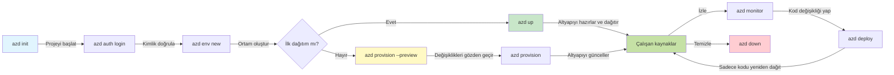

# AZD Basics - Understanding Azure Developer CLI

# AZD Basics - Core Concepts and Fundamentals

**Chapter Navigation:**
- **📚 Course Home**: [AZD Yeni Başlayanlar İçin](../../README.md)
- **📖 Current Chapter**: Bölüm 1 - Temel & Hızlı Başlangıç
- **⬅️ Previous**: [Kurs Genel Bakış](../../README.md#-chapter-1-foundation--quick-start)
- **➡️ Next**: [Kurulum & Ayarlar](installation.md)
- **🚀 Next Chapter**: [Bölüm 2: Yapay Zeka-Öncelikli Geliştirme](../chapter-02-ai-development/microsoft-foundry-integration.md)

## Giriş

Bu ders, sizi Azure Developer CLI (azd) ile tanıştırır — yerel geliştirmeden Azure dağıtımına olan yolculuğunuzu hızlandıran güçlü bir komut satırı aracıdır. Temel kavramları, çekirdek özellikleri öğrenecek ve azd'nin bulut yerel uygulama dağıtımını nasıl basitleştirdiğini anlayacaksınız.

## Öğrenme Hedefleri

Bu dersin sonunda:
- Azure Developer CLI'nin ne olduğunu ve temel amacını anlayacaksınız
- şablonlar, ortamlar ve servislerin temel kavramlarını öğreneceksiniz
- şablon tabanlı geliştirme ve Kod Olarak Altyapı dahil anahtar özellikleri keşfedeceksiniz
- azd proje yapısını ve iş akışını anlayacaksınız
- geliştirme ortamınız için azd'yi kurup yapılandırmaya hazır olacaksınız

## Öğrenme Çıktıları

Bu dersi tamamladıktan sonra şunları yapabileceksiniz:
- azd'nin modern bulut geliştirme iş akışlarındaki rolünü açıklamak
- bir azd proje yapısının bileşenlerini tanımlamak
- şablonların, ortamların ve servislerin nasıl birlikte çalıştığını tarif etmek
- azd ile Kod Olarak Altyapı'nın faydalarını anlamak
- farklı azd komutlarını ve amaçlarını tanımak

## Azure Developer CLI (azd) Nedir?

Azure Developer CLI (azd), yerel geliştirmeden Azure dağıtımına olan yolculuğunuzu hızlandırmak için tasarlanmış bir komut satırı aracıdır. Azure üzerinde bulut yerel uygulamaların oluşturulmasını, dağıtılmasını ve yönetilmesini basitleştirir.

### 🎯 Neden AZD Kullanmalı? Gerçek Dünya Karşılaştırması

Basit bir web uygulamasını veritabanıyla birlikte dağıtmayı karşılaştıralım:

#### ❌ AZD OLMADAN: Manuel Azure Dağıtımı (30+ dakika)

```bash
# Adım 1: Kaynak grubu oluştur
az group create --name myapp-rg --location eastus

# Adım 2: App Service Planı oluştur
az appservice plan create --name myapp-plan \
  --resource-group myapp-rg \
  --sku B1 --is-linux

# Adım 3: Web Uygulaması oluştur
az webapp create --name myapp-web-unique123 \
  --resource-group myapp-rg \
  --plan myapp-plan \
  --runtime "NODE:18-lts"

# Adım 4: Cosmos DB hesabı oluştur (10-15 dakika)
az cosmosdb create --name myapp-cosmos-unique123 \
  --resource-group myapp-rg \
  --kind MongoDB

# Adım 5: Veritabanı oluştur
az cosmosdb mongodb database create \
  --account-name myapp-cosmos-unique123 \
  --resource-group myapp-rg \
  --name tododb

# Adım 6: Koleksiyon oluştur
az cosmosdb mongodb collection create \
  --account-name myapp-cosmos-unique123 \
  --resource-group myapp-rg \
  --database-name tododb \
  --name todos

# Adım 7: Bağlantı dizesini al
CONN_STR=$(az cosmosdb keys list \
  --name myapp-cosmos-unique123 \
  --resource-group myapp-rg \
  --type connection-strings \
  --query "connectionStrings[0].connectionString" -o tsv)

# Adım 8: Uygulama ayarlarını yapılandır
az webapp config appsettings set \
  --name myapp-web-unique123 \
  --resource-group myapp-rg \
  --settings MONGODB_URI="$CONN_STR"

# Adım 9: Günlüğü etkinleştir
az webapp log config --name myapp-web-unique123 \
  --resource-group myapp-rg \
  --application-logging filesystem \
  --detailed-error-messages true

# Adım 10: Application Insights'ı kur
az monitor app-insights component create \
  --app myapp-insights \
  --location eastus \
  --resource-group myapp-rg

# Adım 11: App Insights'ı Web Uygulamasına bağla
INSTRUMENTATION_KEY=$(az monitor app-insights component show \
  --app myapp-insights \
  --resource-group myapp-rg \
  --query "instrumentationKey" -o tsv)

az webapp config appsettings set \
  --name myapp-web-unique123 \
  --resource-group myapp-rg \
  --settings APPINSIGHTS_INSTRUMENTATIONKEY="$INSTRUMENTATION_KEY"

# Adım 12: Uygulamayı yerel olarak derle
npm install
npm run build

# Adım 13: Dağıtım paketini oluştur
zip -r app.zip . -x "*.git*" "node_modules/*"

# Adım 14: Uygulamayı dağıt
az webapp deployment source config-zip \
  --resource-group myapp-rg \
  --name myapp-web-unique123 \
  --src app.zip

# Adım 15: Bekleyin ve işe yaraması için dua edin 🙏
# (Otomatik doğrulama yok, manuel test gereklidir)
```

**Sorunlar:**
- ❌ Hatırlanıp sırayla çalıştırılması gereken 15+ komut
- ❌ 30-45 dakika süren manuel işlem
- ❌ Hatalar yapmak kolay (yazım hataları, yanlış parametreler)
- ❌ Bağlantı dizeleri terminal geçmişinde açığa çıkabilir
- ❌ Bir şeyler ters giderse otomatik geri alma yok
- ❌ Ekip üyeleri için tekrar üretmesi zor
- ❌ Her seferinde farklı (tekrarlanamaz)

#### ✅ AZD İLE: Otomatik Dağıtım (5 komut, 10-15 dakika)

```bash
# Adım 1: Şablondan başlatın
azd init --template todo-nodejs-mongo

# Adım 2: Kimlik doğrulayın
azd auth login

# Adım 3: Ortam oluşturun
azd env new dev

# Adım 4: Değişiklikleri önizleyin (isteğe bağlı ancak önerilir)
azd provision --preview

# Adım 5: Her şeyi dağıtın
azd up

# ✨ Tamam! Her şey dağıtıldı, yapılandırıldı ve izleniyor
```

**Faydalar:**
- ✅ **5 komut** vs. 15+ manuel adım
- ✅ **10-15 dakika** toplam süre (çoğunlukla Azure beklemesi)
- ✅ **Hata sıfır** - otomatik ve test edilmiş
- ✅ **Gizli bilgiler güvenli şekilde yönetilir** - Key Vault üzerinden
- ✅ **Hata durumunda otomatik geri alma**
- ✅ **Tamamen tekrarlanabilir** - her seferinde aynı sonuç
- ✅ **Ekip hazır** - herkes aynı komutlarla dağıtabilir
- ✅ **Kod Olarak Altyapı** - sürüm kontrolünde Bicep şablonları
- ✅ **Yerleşik izleme** - Application Insights otomatik yapılandırılır

### 📊 Zaman & Hata Azaltımı

| Metric | Manual Deployment | AZD Deployment | Improvement |
|:-------|:------------------|:---------------|:------------|
| **Commands** | 15+ | 5 | 67% fewer |
| **Time** | 30-45 min | 10-15 min | 60% faster |
| **Error Rate** | ~40% | <5% | 88% reduction |
| **Consistency** | Low (manual) | 100% (automated) | Perfect |
| **Team Onboarding** | 2-4 hours | 30 minutes | 75% faster |
| **Rollback Time** | 30+ min (manual) | 2 min (automated) | 93% faster |

## Temel Kavramlar

### Şablonlar
Şablonlar azd'nin temelini oluşturur. Bunlar şunları içerir:
- **Uygulama kodu** - Kaynak kodunuz ve bağımlılıklarınız
- **Altyapı tanımları** - Bicep veya Terraform ile tanımlanmış Azure kaynakları
- **Yapılandırma dosyaları** - Ayarlar ve ortam değişkenleri
- **Dağıtım betikleri** - Otomatik dağıtım iş akışları

### Ortamlar
Ortamlar farklı dağıtım hedeflerini temsil eder:
- **Geliştirme** - Test ve geliştirme için
- **Hazırlık (Staging)** - Üretim öncesi ortam
- **Üretim** - Canlı üretim ortamı

Her ortam kendi şunlarını korur:
- Azure kaynak grubu
- Yapılandırma ayarları
- Dağıtım durumu

### Servisler
Servisler uygulamanızın yapı taşlarıdır:
- **Önyüz** - Web uygulamaları, SPA'lar
- **Arka uç** - API'ler, mikroservisler
- **Veritabanı** - Veri depolama çözümleri
- **Depolama** - Dosya ve blob depolama

## Anahtar Özellikler

### 1. Şablon Tabanlı Geliştirme
```bash
# Mevcut şablonlara göz atın
azd template list

# Bir şablondan başlatın
azd init --template <template-name>
```

### 2. Kod Olarak Altyapı
- **Bicep** - Azure'ın alan özel dili
- **Terraform** - Çoklu bulut altyapı aracı
- **ARM Templates** - Azure Resource Manager şablonları

### 3. Entegre İş Akışları
```bash
# Tam dağıtım iş akışı
azd up            # Provision + Deploy — ilk kurulum için müdahalesiz

# 🧪 YENİ: Dağıtımdan önce altyapı değişikliklerini önizleme (GÜVENLİ)
azd provision --preview    # Değişiklik yapmadan altyapı dağıtımını simüle edin

azd provision     # Altyapıyı güncellerseniz Azure kaynakları oluşturmak için bunu kullanın
azd deploy        # Uygulama kodunu dağıtın veya güncelleme sonrası yeniden dağıtın
azd down          # Kaynakları temizleyin
```

#### 🛡️ Önizleme ile Güvenli Altyapı Planlama
`azd provision --preview` komutu, güvenli dağıtımlar için oyunun kurallarını değiştirir:
- **Kuru çalıştırma analizi** - Nelerin oluşturulacağını, değiştirileceğini veya silineceğini gösterir
- **Sıfır risk** - Azure ortamınızda gerçek değişiklik yapılmaz
- **Ekip iş birliği** - Dağıtımdan önce önizleme sonuçlarını paylaşın
- **Maliyet tahmini** - Taahhütte bulunmadan önce kaynak maliyetlerini anlayın

```bash
# Örnek önizleme iş akışı
azd provision --preview           # Nelerin değişeceğini görün
# Çıktıyı gözden geçirin, ekip ile tartışın
azd provision                     # Değişiklikleri güvenle uygulayın
```

### 📊 Görsel: AZD Geliştirme İş Akışı


**İş Akışı Açıklaması:**
1. **Init** - Şablonla veya yeni proje ile başla
2. **Auth** - Azure ile kimlik doğrulama yap
3. **Environment** - İzole dağıtım ortamı oluştur
4. **Preview** - 🆕 Altyapı değişikliklerini önce her zaman önizle (güvenli uygulama)
5. **Provision** - Azure kaynaklarını oluştur/güncelle
6. **Deploy** - Uygulama kodunuzu gönder
7. **Monitor** - Uygulama performansını gözlemle
8. **Iterate** - Değişiklik yap ve kodu yeniden dağıt
9. **Cleanup** - İş bitince kaynakları kaldır

### 4. Ortam Yönetimi
```bash
# Ortamlar oluşturun ve yönetin
azd env new <environment-name>
azd env select <environment-name>
azd env list
```

## 📁 Proje Yapısı

Tipik bir azd proje yapısı:
```
my-app/
├── .azd/                    # azd configuration
│   └── config.json
├── .azure/                  # Azure deployment artifacts
├── .devcontainer/          # Development container config
├── .github/workflows/      # GitHub Actions
├── .vscode/               # VS Code settings
├── infra/                 # Infrastructure code
│   ├── main.bicep        # Main infrastructure template
│   ├── main.parameters.json
│   └── modules/          # Reusable modules
├── src/                  # Application source code
│   ├── api/             # Backend services
│   └── web/             # Frontend application
├── azure.yaml           # azd project configuration
└── README.md
```

## 🔧 Yapılandırma Dosyaları

### azure.yaml
Ana proje yapılandırma dosyası:
```yaml
name: my-awesome-app
metadata:
  template: my-template@1.0.0

services:
  web:
    project: ./src/web
    language: js
    host: appservice
  api:
    project: ./src/api
    language: js
    host: appservice

hooks:
  preprovision:
    shell: pwsh
    run: echo "Preparing to provision..."
```

### .azure/config.json
Ortam-özgü yapılandırma:
```json
{
  "version": 1,
  "defaultEnvironment": "dev",
  "environments": {
    "dev": {
      "subscriptionId": "your-subscription-id",
      "location": "eastus"
    }
  }
}
```

## 🎪 Yaygın İş Akışları ile Uygulamalı Alıştırmalar

> **💡 Öğrenme İpucu:** Bu alıştırmaları sırayla takip ederek AZD yeteneklerinizi kademeli olarak geliştirin.

### 🎯 Alıştırma 1: İlk Projenizi Başlatın

**Amaç:** Bir AZD projesi oluşturun ve yapısını keşfedin

**Adımlar:**
```bash
# Kanıtlanmış bir şablon kullanın
azd init --template todo-nodejs-mongo

# Oluşturulan dosyaları keşfedin
ls -la  # Gizli dosyalar dahil tüm dosyaları görüntüleyin

# Oluşturulan önemli dosyalar:
# - azure.yaml (ana yapılandırma)
# - infra/ (altyapı kodu)
# - src/ (uygulama kodu)
```

**✅ Başarı:** azure.yaml, infra/ ve src/ dizinlerine sahipsiniz

---

### 🎯 Alıştırma 2: Azure'a Dağıtın

**Amaç:** Baştan sona dağıtımı tamamlayın

**Adımlar:**
```bash
# 1. Kimliğinizi doğrulayın
az login && azd auth login

# 2. Ortam oluşturun
azd env new dev
azd env set AZURE_LOCATION eastus

# 3. Değişiklikleri önizleyin (TAVSİYE EDİLİR)
azd provision --preview

# 4. Her şeyi dağıtın
azd up

# 5. Dağıtımı doğrulayın
azd show    # Uygulamanızın URL'sini görüntüleyin
```

**Beklenen Süre:** 10-15 dakika  
**✅ Başarı:** Uygulama URL'si tarayıcıda açılıyor

---

### 🎯 Alıştırma 3: Birden Fazla Ortam

**Amaç:** dev ve staging'e dağıtım yapın

**Adımlar:**
```bash
# Zaten dev var, staging oluştur
azd env new staging
azd env set AZURE_LOCATION westus2
azd up

# Aralarında geçiş yap
azd env list
azd env select dev
```

**✅ Başarı:** Azure Portal'da iki ayrı kaynak grubu

---

### 🛡️ Temiz Başlangıç: `azd down --force --purge`

Tamamen sıfırlamanız gerektiğinde:

```bash
azd down --force --purge
```

**Ne yapar:**
- `--force`: Onay istemlerini kaldırır
- `--purge`: Tüm yerel durumu ve Azure kaynaklarını siler

**Ne zaman kullanılır:**
- Dağıtım yarıda başarısız olduysa
- Projeler arasında geçiş yaparken
- Temiz bir başlangıca ihtiyaç duyuluyorsa

---

## 🎪 Orijinal İş Akışı Referansı

### Yeni Bir Proje Başlatma
```bash
# Yöntem 1: Mevcut şablonu kullan
azd init --template todo-nodejs-mongo

# Yöntem 2: Sıfırdan başla
azd init

# Yöntem 3: Geçerli dizini kullan
azd init .
```

### Geliştirme Döngüsü
```bash
# Geliştirme ortamını kur
azd auth login
azd env new dev
azd env select dev

# Her şeyi dağıt
azd up

# Değişiklik yap ve yeniden dağıt
azd deploy

# İşiniz bitince temizleyin
azd down --force --purge # Azure Developer CLI'deki komut, ortamınız için bir **tam sıfırlama**dır—özellikle başarısız dağıtımları giderirken, sahipsiz kalan kaynakları temizlerken veya temiz bir yeniden dağıtım için hazırlık yaparken kullanışlıdır.
```

## `azd down --force --purge` Komutunu Anlamak
`azd down --force --purge` komutu, azd ortamınızı ve ilişkili tüm kaynakları tamamen kaldırmak için güçlü bir yoldur. Her bir bayrağın ne yaptığına dair döküm:
```
--force
```
- Onay istemlerini atlar.
- Manuel girişin mümkün olmadığı otomasyon veya betiklerde kullanışlıdır.
- CLI tutarsızlıklar tespit etse bile kesintisiz olarak kaldırmayı sağlar.

```
--purge
```
**Tüm ilişkili meta verileri** siler, şunlar dahil:
Ortam durumu
Yerel `.azure` klasörü
Önbelleğe alınmış dağıtım bilgisi
azd'nin önceki dağıtımları "hatırlamasını" engeller; bu, eşleşmeyen kaynak grupları veya eski kayıt defteri referansları gibi sorunlara yol açabilir.

### Neden her ikisini de kullanmalı?
`azd up` komutunda kalıcı durum veya kısmi dağıtımlar nedeniyle takıldığınızda, bu kombinasyon **temiz bir başlangıç** sağlar.

Bu, Azure portalında manuel kaynak silme sonrası veya şablonlar, ortamlar veya kaynak grubu adlandırma kurallarını değiştirirken özellikle yardımcı olur.

### Birden Fazla Ortamı Yönetme
```bash
# Hazırlık (staging) ortamı oluştur
azd env new staging
azd env select staging
azd up

# Dev'e geri dön
azd env select dev

# Ortamları karşılaştır
azd env list
```

## 🔐 Kimlik Doğrulama ve Kimlik Bilgileri

Kimlik doğrulamayı anlamak, başarılı azd dağıtımları için kritiktir. Azure, birden çok kimlik doğrulama yöntemi kullanır ve azd diğer Azure araçlarıyla aynı kimlik bilgisi zincirinden yararlanır.

### Azure CLI Kimlik Doğrulaması (`az login`)

azd'yi kullanmadan önce Azure ile kimlik doğrulaması yapmanız gerekir. En yaygın yöntem Azure CLI kullanmaktır:

```bash
# Etkileşimli oturum açma (tarayıcıyı açar)
az login

# Belirli bir kiracı ile oturum açma
az login --tenant <tenant-id>

# Servis kimliği ile oturum açma
az login --service-principal -u <app-id> -p <password> --tenant <tenant-id>

# Mevcut oturum durumunu kontrol etme
az account show

# Kullanılabilir abonelikleri listele
az account list --output table

# Varsayılan aboneliği ayarla
az account set --subscription <subscription-id>
```

### Kimlik Doğrulama Akışı
1. **Etkileşimli Giriş**: Kimlik doğrulama için varsayılan tarayıcınızı açar
2. **Cihaz Kodu Akışı**: Tarayıcı erişimi olmayan ortamlar için
3. **Servis Prensibi (Service Principal)**: Otomasyon ve CI/CD senaryoları için
4. **Managed Identity**: Azure barındırılan uygulamalar için

### DefaultAzureCredential Zinciri

`DefaultAzureCredential`, belirli bir sırayla otomatik olarak birden çok kimlik kaynağını denemeyi sağlayarak basitleştirilmiş bir kimlik doğrulama deneyimi sunan bir kimlik türüdür:

#### Kimlik Zinciri Sırası

#### 1. Ortam Değişkenleri
```bash
# Hizmet ilkesi için ortam değişkenlerini ayarla
export AZURE_CLIENT_ID="<app-id>"
export AZURE_CLIENT_SECRET="<password>"
export AZURE_TENANT_ID="<tenant-id>"
```

#### 2. Workload Identity (Kubernetes/GitHub Actions)
Aşağıdaki durumlarda otomatik olarak kullanılır:
- Workload Identity ile Azure Kubernetes Service (AKS)
- OIDC federasyonu ile GitHub Actions
- Diğer federasyonlu kimlik senaryoları

#### 3. Managed Identity
Şu Azure kaynakları için:
- Sanal Makineler
- App Service
- Azure Functions
- Container Instances

```bash
# Yönetilen kimliğe sahip bir Azure kaynağında çalışıp çalışmadığını kontrol et
az account show --query "user.type" --output tsv
# Döndürür: Yönetilen kimlik kullanılıyorsa "servicePrincipal"
```

#### 4. Geliştirici Araçları Entegrasyonu
- **Visual Studio**: Otomatik olarak oturum açmış hesabı kullanır
- **VS Code**: Azure Account uzantısı kimlik bilgilerini kullanır
- **Azure CLI**: `az login` kimlik bilgilerini kullanır (yerel geliştirme için en yaygın)

### AZD Kimlik Doğrulama Kurulumu

```bash
# Yöntem 1: Azure CLI kullanın (Geliştirme için önerilir)
az login
azd auth login  # Mevcut Azure CLI kimlik bilgilerini kullanır

# Yöntem 2: Doğrudan azd kimlik doğrulaması
azd auth login --use-device-code  # Başsız ortamlar için

# Yöntem 3: Kimlik doğrulama durumunu kontrol edin
azd auth login --check-status

# Yöntem 4: Oturumu kapatın ve yeniden kimlik doğrulaması yapın
azd auth logout
azd auth login
```

### Kimlik Doğrulama için En İyi Uygulamalar

#### Yerel Geliştirme İçin
```bash
# 1. Azure CLI ile oturum açın
az login

# 2. Doğru aboneliği doğrulayın
az account show
az account set --subscription "Your Subscription Name"

# 3. Mevcut kimlik bilgileriyle azd'yi kullanın
azd auth login
```

#### CI/CD Boru Hatları İçin
```yaml
# GitHub Actions example
- name: Azure Login
  uses: azure/login@v1
  with:
    creds: ${{ secrets.AZURE_CREDENTIALS }}

- name: Deploy with azd
  run: |
    azd auth login --client-id ${{ secrets.AZURE_CLIENT_ID }} \
                    --client-secret ${{ secrets.AZURE_CLIENT_SECRET }} \
                    --tenant-id ${{ secrets.AZURE_TENANT_ID }}
    azd up --no-prompt
```

#### Üretim Ortamları İçin
- Azure kaynaklarında çalışırken **Managed Identity** kullanın
- Otomasyon senaryoları için **Service Principal** kullanın
- Kimlik bilgilerini kodda veya yapılandırma dosyalarında saklamaktan kaçının
- Hassas yapılandırmalar için **Azure Key Vault** kullanın

### Yaygın Kimlik Doğrulama Sorunları ve Çözümleri

#### Sorun: "No subscription found"
```bash
# Çözüm: Varsayılan aboneliği ayarlayın
az account list --output table
az account set --subscription "<subscription-id>"
azd env set AZURE_SUBSCRIPTION_ID "<subscription-id>"
```

#### Sorun: "Insufficient permissions"
```bash
# Çözüm: Gerekli rolleri kontrol edin ve atayın
az role assignment list --assignee $(az account show --query user.name --output tsv)

# Genel olarak gereken roller:
# - Contributor (kaynak yönetimi için)
# - User Access Administrator (rol atamaları için)
```

#### Sorun: "Token expired"
```bash
# Çözüm: Yeniden kimlik doğrulama
az logout
az login
azd auth logout
azd auth login
```

### Farklı Senaryolarda Kimlik Doğrulama

#### Yerel Geliştirme
```bash
# Kişisel gelişim hesabı
az login
azd auth login
```

#### Ekip Geliştirme
```bash
# Organizasyon için belirli bir kiracı kullan
az login --tenant contoso.onmicrosoft.com
azd auth login
```

#### Çok Kiracılı (Multi-tenant) Senaryolar
```bash
# Kiracılar arasında geçiş yap
az login --tenant tenant1.onmicrosoft.com
# Kiracı 1'e dağıt
azd up

az login --tenant tenant2.onmicrosoft.com  
# Kiracı 2'ye dağıt
azd up
```

### Güvenlik Hususları

1. **Kimlik Bilgisi Saklama**: Kimlik bilgilerini asla kaynak kodunda saklamayın
2. **Kapsam Sınırlandırma**: Servis prensipleri için en az ayrıcalık prensibini kullanın
3. **Token Döndürme**: Servis prensibi gizli anahtarlarını düzenli olarak döndürün
4. **Denetim Kaydı**: Kimlik doğrulama ve dağıtım etkinliklerini izleyin
5. **Ağ Güvenliği**: Mümkünse özel uç noktalar kullanın

### Kimlik Doğrulama Sorun Giderme

```bash
# Kimlik doğrulama sorunlarını giderme
azd auth login --check-status
az account show
az account get-access-token

# Yaygın tanılama komutları
whoami                          # Mevcut kullanıcı bağlamı
az ad signed-in-user show      # Azure AD kullanıcı ayrıntıları
az group list                  # Kaynak erişimini test etme
```

## `azd down --force --purge` Komutunu Anlamak

### Keşif
```bash
azd template list              # Şablonlara göz at
azd template show <template>   # Şablon ayrıntıları
azd init --help               # Başlatma seçenekleri
```

### Proje Yönetimi
```bash
azd show                     # Proje genel bakışı
azd env show                 # Mevcut ortam
azd config list             # Yapılandırma ayarları
```

### İzleme
```bash
azd monitor                  # Azure Portal izleme özelliğini aç
azd monitor --logs           # Uygulama günlüklerini görüntüle
azd monitor --live           # Canlı metrikleri görüntüle
azd pipeline config          # CI/CD kur
```

## En İyi Uygulamalar

### 1. Anlamlı İsimler Kullanın
```bash
# İyi
azd env new production-east
azd init --template web-app-secure

# Kaçının
azd env new env1
azd init --template template1
```

### 2. Şablonlardan Yararlanın
- Mevcut şablonlarla başlayın
- İhtiyaçlarınıza göre özelleştirin
- Kuruluşunuz için yeniden kullanılabilir şablonlar oluşturun

### 3. Ortam İzolasyonu
- dev/staging/prod için ayrı ortamlar kullanın
- Yerel makineden doğrudan üretime asla dağıtmayın
- Üretim dağıtımları için CI/CD boru hatları kullanın

### 4. Yapılandırma Yönetimi
- Hassas veriler için ortam değişkenleri kullanın
- Yapılandırmayı sürüm kontrolünde tutun
- Ortam-özgü ayarları belgeleyin

## Öğrenme İlerlemesi

### Yeni Başlayan (1-2. Hafta)
1. azd'yi kurun ve kimlik doğrulama yapın
2. Basit bir şablon dağıtın
3. Proje yapısını anlayın
4. Temel komutları öğrenin (up, down, deploy)

### Orta Düzey (3-4. Hafta)
1. Şablonları özelleştirin
2. Birden fazla ortam yönetin
3. Altyapı kodunu anlayın
4. CI/CD boru hatları kurun

### İleri Düzey (5+ Hafta)
1. Özel şablonlar oluşturun
2. İleri altyapı desenleri
3. Çok bölge dağıtımları
4. Kurumsal düzey yapılandırmalar

## Sonraki Adımlar

**📖 Bölüm 1 Öğrenimine Devam Edin:**
- [Kurulum ve Yapılandırma](installation.md) - azd'yi kurup yapılandırın
- [İlk Projeniz](first-project.md) - Tam uygulamalı öğretici
- [Yapılandırma Rehberi](configuration.md) - Gelişmiş yapılandırma seçenekleri

**🎯 Sonraki Bölüme Hazır mısınız?**
- [Bölüm 2: Yapay Zeka Odaklı Geliştirme](../chapter-02-ai-development/microsoft-foundry-integration.md) - Yapay zeka uygulamaları geliştirmeye başlayın

## Ek Kaynaklar

- [Azure Developer CLI Genel Bakış](https://learn.microsoft.com/en-us/azure/developer/azure-developer-cli/)
- [Şablon Galerisi](https://azure.github.io/awesome-azd/)
- [Topluluk Örnekleri](https://github.com/Azure-Samples)

---

## 🙋 Sıkça Sorulan Sorular

### Genel Sorular

**S: AZD ile Azure CLI arasındaki fark nedir?**

C: Azure CLI (`az`) bireysel Azure kaynaklarını yönetmek içindir. AZD (`azd`) tüm uygulamaları yönetmek içindir:

```bash
# Azure CLI - Düşük seviyeli kaynak yönetimi
az webapp create --name myapp --resource-group rg
az sql server create --name myserver --resource-group rg
# ...çok daha fazla komut gerekiyor

# AZD - Uygulama düzeyi yönetimi
azd up  # Tüm uygulamayı tüm kaynaklarıyla dağıtır
```

**Bunu şöyle düşünün:**
- `az` = Bireysel Lego tuğlaları üzerinde işlem yapmak
- `azd` = Tam Lego setleriyle çalışmak

---

**S: AZD kullanmak için Bicep veya Terraform bilmem gerekiyor mu?**

C: Hayır! Şablonlarla başlayın:
```bash
# Mevcut şablonu kullanın - IaC bilgisine gerek yok
azd init --template todo-nodejs-mongo
azd up
```

Altyapıyı özelleştirmek için Bicep'i daha sonra öğrenebilirsiniz. Şablonlar öğrenmek için çalışan örnekler sağlar.

---

**S: AZD şablonlarını çalıştırmak ne kadar tutar?**

C: Maliyetler şablona göre değişir. Çoğu geliştirme şablonu aylık 50-150$ arasındadır:

```bash
# Dağıtmadan önce maliyetleri önizleyin
azd provision --preview

# Kullanılmadığında her zaman temizleyin
azd down --force --purge  # Tüm kaynakları kaldırır
```

**Profesyonel ipucu:** Kullanılabilen ücretsiz katmanları kullanın:
- App Service: F1 (Ücretsiz) katman
- Azure OpenAI: 50,000 token/ay ücretsiz
- Cosmos DB: 1000 RU/s ücretsiz katman

---

**S: AZD'yi mevcut Azure kaynaklarıyla kullanabilir miyim?**

C: Evet, ama sıfırdan başlamak daha kolaydır. AZD, tüm yaşam döngüsünü yönettiğinde en iyi şekilde çalışır. Mevcut kaynaklar için:

```bash
# Seçenek 1: Mevcut kaynakları içe aktar (ileri düzey)
azd init
# Sonra infra/ dizinini mevcut kaynaklara referans verecek şekilde değiştirin

# Seçenek 2: Sıfırdan başla (önerilen)
azd init --template matching-your-stack
azd up  # Yeni bir ortam oluşturur
```

---

**S: Projeyi ekip arkadaşlarımla nasıl paylaşırım?**

C: AZD projesini Git'e commit edin (ancak .azure folder hariç):
```bash
# Varsayılan olarak zaten .gitignore'da
.azure/        # Gizli bilgileri ve ortam verilerini içerir
*.env          # Ortam değişkenleri

# O zamanki takım üyeleri:
git clone <your-repo>
azd auth login
azd env new <their-name>-dev
azd up
```

Herkes aynı şablonlardan aynı altyapıyı alır.

---

### Sorun Giderme Soruları

**S: "azd up" yarıda başarısız oldu. Ne yapmalıyım?**

C: Hatanın ayrıntılarını kontrol edin, düzeltin ve tekrar deneyin:
```bash
# Ayrıntılı günlükleri görüntüle
azd show

# Yaygın düzeltmeler:

# 1. Kota aşıldıysa:
azd env set AZURE_LOCATION "westus2"  # Farklı bir bölge deneyin

# 2. Kaynak adı çakışması varsa:
azd down --force --purge  # Temiz bir başlangıç yapın
azd up  # Yeniden deneyin

# 3. Kimlik doğrulama süresi dolduysa:
az login
azd auth login
azd up
```

**En yaygın sorun:** Yanlış Azure aboneliği seçilmiş
```bash
az account list --output table
az account set --subscription "<correct-subscription>"
```

---

**S: Yeniden kaynak sağlamadan sadece kod değişikliklerini nasıl dağıtabilirim?**

C: `azd up` yerine `azd deploy` kullanın:
```bash
azd up          # İlk sefer: kaynak sağlama + dağıtım (yavaş)

# Kod değişiklikleri yap...

azd deploy      # Sonraki seferler: sadece dağıtım (hızlı)
```

Hız karşılaştırması:
- `azd up`: 10-15 dakika (altyapıyı sağlar)
- `azd deploy`: 2-5 dakika (sadece kod)

---

**S: Altyapı şablonlarını özelleştirebilir miyim?**

C: Evet! `infra/` içindeki Bicep dosyalarını düzenleyin:
```bash
# azd init sonrasında
cd infra/
code main.bicep  # VS Code'da düzenle

# Değişiklikleri önizle
azd provision --preview

# Değişiklikleri uygula
azd provision
```

**İpucu:** Küçük başlayın - önce SKU'ları değiştirin:
```bicep
// infra/main.bicep
sku: {
  name: 'B1'  // Change to 'P1V2' for production
}
```

---

**S: AZD'nin oluşturduğu her şeyi nasıl silerim?**

C: Tek bir komut tüm kaynakları kaldırır:
```bash
azd down --force --purge

# Bu şunları siler:
# - Tüm Azure kaynakları
# - Kaynak grubu
# - Yerel ortam durumu
# - Önbelleğe alınmış dağıtım verileri
```

**Bunu her zaman çalıştırın:**
- Bir şablonu test etmeyi bitirdiğinizde
- Farklı bir projeye geçerken
- Yeniden başlamak istediğinizde

**Maliyet tasarrufu:** Kullanılmayan kaynakları silmek = $0 ücret

---

**S: Azure Portal'da kaynakları yanlışlıkla silersem ne olur?**

C: AZD durumu senkronize olmaktan çıkabilir. Temiz başlangıç yaklaşımı:
```bash
# 1. Yerel durumu kaldır
azd down --force --purge

# 2. Baştan başla
azd up

# Alternatif: AZD'nin algılamasına ve düzeltmesine izin ver
azd provision  # Eksik kaynakları oluşturacak
```

---

### İleri Düzey Sorular

**S: AZD'yi CI/CD boru hatlarında kullanabilir miyim?**

C: Evet! GitHub Actions örneği:
```yaml
# .github/workflows/deploy.yml
name: Deploy with AZD

on:
  push:
    branches: [main]

jobs:
  deploy:
    runs-on: ubuntu-latest
    steps:
      - uses: actions/checkout@v2
      
      - name: Install azd
        run: curl -fsSL https://aka.ms/install-azd.sh | bash
      
      - name: Azure Login
        run: |
          azd auth login \
            --client-id ${{ secrets.AZURE_CLIENT_ID }} \
            --client-secret ${{ secrets.AZURE_CLIENT_SECRET }} \
            --tenant-id ${{ secrets.AZURE_TENANT_ID }}
      
      - name: Deploy
        run: azd up --no-prompt
```

---

**S: Gizli ve hassas verileri nasıl yönetirim?**

C: AZD, Azure Key Vault ile otomatik olarak entegre olur:
```bash
# Sırlar kodda değil Key Vault'ta saklanır
azd env set DATABASE_PASSWORD "$(openssl rand -base64 32)"

# AZD otomatik olarak:
# 1. Key Vault oluşturur
# 2. Sırrı saklar
# 3. Yönetilen Kimlik aracılığıyla uygulamaya erişim verir
# 4. Çalışma zamanında enjekte eder
```

**Asla commit etmeyin:**
- `.azure/` folder (ortam verilerini içerir)
- `.env` files (yerel gizli veriler)
- Connection strings

---

**S: Birden çok bölgeye dağıtım yapabilir miyim?**

C: Evet, her bölge için bir ortam oluşturun:
```bash
# Doğu ABD ortamı
azd env new prod-eastus
azd env set AZURE_LOCATION eastus
azd up

# Batı Avrupa ortamı
azd env new prod-westeurope
azd env set AZURE_LOCATION westeurope
azd up

# Her ortam bağımsızdır
azd env list
```

Gerçek çok bölgeli uygulamalar için Bicep şablonlarını, birden fazla bölgeye eşzamanlı dağıtım yapacak şekilde özelleştirin.

---

**S: Takılırsam nereden yardım alabilirim?**

1. **AZD Belgeleri:** https://learn.microsoft.com/azure/developer/azure-developer-cli/
2. **GitHub Sorunları:** https://github.com/Azure/azure-dev/issues
3. **Discord:** [Azure Discord](https://discord.gg/microsoft-azure) - #azure-developer-cli kanalı
4. **Stack Overflow:** Etiket `azure-developer-cli`
5. **Bu Kurs:** [Sorun Giderme Kılavuzu](../chapter-07-troubleshooting/common-issues.md)

**İpucu:** Sormadan önce çalıştırın:
```bash
azd show       # Mevcut durumu gösterir
azd version    # Sürümünüzü gösterir
```
Daha hızlı yardım için sorunuza bu bilgileri ekleyin.

---

## 🎓 Sonraki Adım?

Artık AZD temellerini anladınız. Yolunuzu seçin:

### 🎯 Yeni Başlayanlar için:
1. **Sonraki:** [Kurulum ve Yapılandırma](installation.md) - AZD'yi makinenize kurun
2. **Sonra:** [İlk Projeniz](first-project.md) - İlk uygulamanızı dağıtın
3. **Uygulama:** Bu derste yer alan tüm 3 alıştırmayı tamamlayın

### 🚀 Yapay Zeka Geliştiricileri için:
1. **Atla:** [Bölüm 2: Yapay Zeka Odaklı Geliştirme](../chapter-02-ai-development/microsoft-foundry-integration.md)
2. **Dağıt:** `azd init --template get-started-with-ai-chat` ile başlayın
3. **Öğren:** Dağıtırken geliştirin

### 🏗️ Deneyimli Geliştiriciler için:
1. **Gözden Geçir:** [Yapılandırma Rehberi](configuration.md) - Gelişmiş ayarlar
2. **Keşfet:** [Altyapı Kod Olarak](../chapter-04-infrastructure/provisioning.md) - Bicep derinlemesine inceleme
3. **Oluştur:** Yığınınız için özel şablonlar oluşturun

---

**Bölüm Gezinimi:**
- **📚 Kurs Anasayfası**: [AZD Yeni Başlayanlar için](../../README.md)
- **📖 Geçerli Bölüm**: Bölüm 1 - Temel & Hızlı Başlangıç  
- **⬅️ Önceki**: [Kurs Genel Bakışı](../../README.md#-chapter-1-foundation--quick-start)
- **➡️ Sonraki**: [Kurulum ve Yapılandırma](installation.md)
- **🚀 Sonraki Bölüm**: [Bölüm 2: Yapay Zeka Odaklı Geliştirme](../chapter-02-ai-development/microsoft-foundry-integration.md)

---

<!-- CO-OP TRANSLATOR DISCLAIMER START -->
Feragatname:
Bu belge, yapay zeka çeviri hizmeti [Co-op Translator](https://github.com/Azure/co-op-translator) kullanılarak çevrilmiştir. Doğruluğa özen göstersek de, otomatik çevirilerin hatalar veya yanlışlıklar içerebileceğini lütfen unutmayın. Orijinal belge, kaynak dilindeki sürümü yetkili belge olarak kabul edilmelidir. Kritik bilgiler için profesyonel insan çevirisi önerilir. Bu çevirinin kullanımından kaynaklanan herhangi bir yanlış anlama veya yanlış yorumlamadan sorumlu değiliz.
<!-- CO-OP TRANSLATOR DISCLAIMER END -->