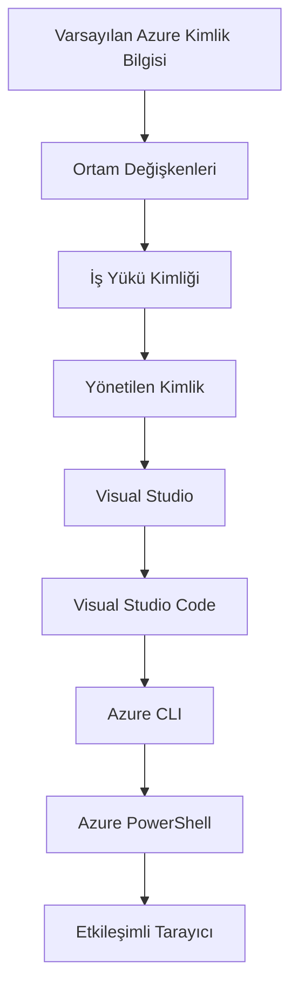

# AZD Temelleri - Azure Developer CLI'yi Anlamak

# AZD Temelleri - Temel Kavramlar ve İlkeler

**Bölüm Gezinmesi:**
- **📚 Ders Anasayfası**: [AZD Yeni Başlayanlar](../../README.md)
- **📖 Mevcut Bölüm**: Bölüm 1 - Temel & Hızlı Başlangıç
- **⬅️ Önceki**: [Ders Özeti](../../README.md#-chapter-1-foundation--quick-start)
- **➡️ Sonraki**: [Kurulum ve Ayarlar](installation.md)
- **🚀 Sonraki Bölüm**: [Bölüm 2: AI-Öncelikli Geliştirme](../chapter-02-ai-development/microsoft-foundry-integration.md)

## Giriş

Bu ders sizi Azure Developer CLI (azd) ile tanıştırır; yerel geliştirmeden Azure dağıtımına kadar yolculuğunuzu hızlandıran güçlü bir komut satırı aracıdır. Temel kavramları, ana özellikleri öğrenecek ve azd'nin bulut yerel uygulama dağıtımını nasıl basitleştirdiğini anlayacaksınız.

## Öğrenme Hedefleri

Bu dersin sonunda:
- Azure Developer CLI'nin ne olduğunu ve birincil amacını anlayacaksınız
- şablonlar, ortamlar ve servislerin temel kavramlarını öğreneceksiniz
- şablon odaklı geliştirme ve Altyapı olarak Kod dahil ana özellikleri keşfedeceksiniz
- azd proje yapısını ve iş akışını anlayacaksınız
- geliştirme ortamınız için azd'yi kurup yapılandırmaya hazır olacaksınız

## Öğrenme Çıktıları

Bu ders tamamlandıktan sonra şu yeteneklere sahip olacaksınız:
- Modern bulut geliştirme iş akışlarında azd'nin rolünü açıklayabileceksiniz
- bir azd proje yapısının bileşenlerini tanımlayabileceksiniz
- şablonlar, ortamlar ve servislerin birlikte nasıl çalıştığını açıklayabileceksiniz
- azd ile Altyapı olarak Kod’un faydalarını anlayabileceksiniz
- farklı azd komutlarını ve amaçlarını tanıyabileceksiniz

## Azure Developer CLI (azd) nedir?

Azure Developer CLI (azd), yerel geliştirmeden Azure dağıtımına yolculuğunuzu hızlandırmak için tasarlanmış bir komut satırı aracıdır. Azure üzerinde bulut yerel uygulamaları oluşturma, dağıtma ve yönetme sürecini basitleştirir.

### azd ile neleri dağıtabilirsiniz?

azd geniş bir iş yükü yelpazesini destekler—ve bu liste sürekli genişliyor. Bugün azd ile dağıtabilecekleriniz:

| İş Yükü Türü | Örnekler | Aynı İş Akışı? |
|---------------|----------|----------------|
| **Geleneksel uygulamalar** | Web uygulamaları, REST API'ler, statik siteler | ✅ `azd up` |
| **Servisler ve mikroservisler** | Container Apps, Function Apps, çok servisli arka uçlar | ✅ `azd up` |
| **Yapay zekâ destekli uygulamalar** | Microsoft Foundry Modelleri ile sohbet uygulamaları, AI Search ile RAG çözümleri | ✅ `azd up` |
| **Akıllı ajanlar** | Foundry barındırılan ajanlar, çok ajanlı orkestrasyonlar | ✅ `azd up` |

Ana fikir şudur: **azd yaşam döngüsü, ne dağıttığınıza bakılmaksızın aynı kalır**. Bir projeyi başlatır, altyapıyı sağlarsınız, kodunuzu dağıtırsınız, uygulamanızı izlersiniz ve temizlersiniz—ister basit bir web sitesi, ister sofistike bir AI ajanı olsun.

Bu süreklilik kasıtlıdır. azd, AI yeteneklerini uygulamanızın kullanabileceği başka bir servis türü olarak ele alır; temelde farklı bir şey olarak değil. Microsoft Foundry Modelleri ile desteklenen bir sohbet uç noktası, azd açısından yapılandırılıp dağıtılacak başka bir servistir.

### 🎯 Neden AZD Kullanılır? Gerçek Dünya Karşılaştırması

Basit bir web uygulamasını veritabanıyla dağıtmayı karşılaştıralım:

#### ❌ AZD OLMADAN: Manuel Azure Dağıtımı (30+ dakika)

```bash
# Adım 1: Kaynak grubu oluşturun
az group create --name myapp-rg --location eastus

# Adım 2: App Service Planı oluşturun
az appservice plan create --name myapp-plan \
  --resource-group myapp-rg \
  --sku B1 --is-linux

# Adım 3: Web uygulaması oluşturun
az webapp create --name myapp-web-unique123 \
  --resource-group myapp-rg \
  --plan myapp-plan \
  --runtime "NODE:18-lts"

# Adım 4: Cosmos DB hesabı oluşturun (10-15 dakika)
az cosmosdb create --name myapp-cosmos-unique123 \
  --resource-group myapp-rg \
  --kind MongoDB

# Adım 5: Veritabanı oluşturun
az cosmosdb mongodb database create \
  --account-name myapp-cosmos-unique123 \
  --resource-group myapp-rg \
  --name tododb

# Adım 6: Koleksiyon oluşturun
az cosmosdb mongodb collection create \
  --account-name myapp-cosmos-unique123 \
  --resource-group myapp-rg \
  --database-name tododb \
  --name todos

# Adım 7: Bağlantı dizesini alın
CONN_STR=$(az cosmosdb keys list \
  --name myapp-cosmos-unique123 \
  --resource-group myapp-rg \
  --type connection-strings \
  --query "connectionStrings[0].connectionString" -o tsv)

# Adım 8: Uygulama ayarlarını yapılandırın
az webapp config appsettings set \
  --name myapp-web-unique123 \
  --resource-group myapp-rg \
  --settings MONGODB_URI="$CONN_STR"

# Adım 9: Kayıtlamayı etkinleştirin
az webapp log config --name myapp-web-unique123 \
  --resource-group myapp-rg \
  --application-logging filesystem \
  --detailed-error-messages true

# Adım 10: Application Insights'ı kurun
az monitor app-insights component create \
  --app myapp-insights \
  --location eastus \
  --resource-group myapp-rg

# Adım 11: Application Insights'ı Web uygulamasına bağlayın
INSTRUMENTATION_KEY=$(az monitor app-insights component show \
  --app myapp-insights \
  --resource-group myapp-rg \
  --query "instrumentationKey" -o tsv)

az webapp config appsettings set \
  --name myapp-web-unique123 \
  --resource-group myapp-rg \
  --settings APPINSIGHTS_INSTRUMENTATIONKEY="$INSTRUMENTATION_KEY"

# Adım 12: Uygulamayı yerel olarak derleyin
npm install
npm run build

# Adım 13: Dağıtım paketini oluşturun
zip -r app.zip . -x "*.git*" "node_modules/*"

# Adım 14: Uygulamayı dağıtın
az webapp deployment source config-zip \
  --resource-group myapp-rg \
  --name myapp-web-unique123 \
  --src app.zip

# Adım 15: Bekleyin ve işe yaraması için dua edin 🙏
# (Otomatik doğrulama yok, manuel test gerekiyor)
```

**Sorunlar:**
- ❌ Hatırlanması ve sıralı olarak yürütülmesi gereken 15+ komut
- ❌ 30-45 dakika süren manuel çalışma
- ❌ Hata yapmaya açık (yazım hataları, yanlış parametreler)
- ❌ Bağlantı dizeleri terminal geçmişinde açığa çıkar
- ❌ Bir şey ters giderse otomatik geri alma yok
- ❌ Ekip üyeleri için tekrarlanması zor
- ❌ Her seferinde farklı (tekrarlanabilir değil)

#### ✅ AZD İLE: Otomatik Dağıtım (5 komut, 10-15 dakika)

```bash
# Adım 1: Şablondan başlatın
azd init --template todo-nodejs-mongo

# Adım 2: Kimlik doğrulaması yapın
azd auth login

# Adım 3: Ortam oluşturun
azd env new dev

# Adım 4: Değişiklikleri önizleyin (isteğe bağlı ancak önerilir)
azd provision --preview

# Adım 5: Her şeyi dağıtın
azd up

# ✨ Tamamlandı! Her şey dağıtıldı, yapılandırıldı ve izleniyor
```

**Faydalar:**
- ✅ **5 komut** vs. 15+ manuel adım
- ✅ **10-15 dakika** toplam süre (çoğunlukla Azure bekleme süresi)
- ✅ **Sıfır hata** - otomatik ve test edilmiş
- ✅ **Gizli bilgiler güvenli şekilde yönetilir** (Key Vault üzerinden)
- ✅ **Başarısızlıklarda otomatik geri alma**
- ✅ **Tam olarak tekrarlanabilir** - her seferinde aynı sonuç
- ✅ **Ekip hazır** - herkes aynı komutlarla dağıtım yapabilir
- ✅ **Altyapı olarak Kod** - sürüm kontrolünde Bicep şablonları
- ✅ **Yerleşik izleme** - Application Insights otomatik yapılandırılır

### 📊 Zaman ve Hata Azaltımı

| Metrik | Manuel Dağıtım | AZD Dağıtımı | İyileşme |
|:-------|:------------------|:---------------|:------------|
| **Komutlar** | 15+ | 5 | %67 daha az |
| **Süre** | 30-45 dk | 10-15 dk | %60 daha hızlı |
| **Hata Oranı** | ~%40 | <%5 | %88 azalma |
| **Tutarlılık** | Düşük (manuel) | %100 (otomatik) | Mükemmel |
| **Ekip Katılımı** | 2-4 saat | 30 dakika | %75 daha hızlı |
| **Geri Alma Süresi** | 30+ dk (manuel) | 2 dk (otomatik) | %93 daha hızlı |

## Temel Kavramlar

### Şablonlar
Şablonlar azd'nin temelini oluşturur. İçerirler:
- **Uygulama kodu** - Kaynak kodunuz ve bağımlılıklarınız
- **Altyapı tanımları** - Bicep veya Terraform ile tanımlanmış Azure kaynakları
- **Yapılandırma dosyaları** - Ayarlar ve ortam değişkenleri
- **Dağıtım betikleri** - Otomatik dağıtım iş akışları

### Ortamlar
Ortamlar farklı dağıtım hedeflerini temsil eder:
- **Geliştirme** - Test ve geliştirme için
- **Hazırlık** - Üretim öncesi ortam
- **Üretim** - Canlı üretim ortamı

Her ortam kendi şunlarını korur:
- Azure kaynak grubu
- Yapılandırma ayarları
- Dağıtım durumu

### Servisler
Servisler uygulamanızın yapı taşlarıdır:
- **Önyüz** - Web uygulamaları, SPA'lar
- **Arka uç** - API'ler, mikroservisler
- **Veritabanı** - Veri depolama çözümleri
- **Depolama** - Dosya ve blob depolama

## Temel Özellikler

### 1. Şablon Tabanlı Geliştirme
```bash
# Mevcut şablonlara göz at
azd template list

# Şablondan başlat
azd init --template <template-name>
```

### 2. Altyapı olarak Kod
- **Bicep** - Azure'ın alan özel dili
- **Terraform** - Çok bulutlu altyapı aracı
- **ARM Templates** - Azure Resource Manager şablonları

### 3. Entegre İş Akışları
```bash
# Tam dağıtım iş akışı
azd up            # Provision + Deploy, ilk kurulum için elle müdahale gerektirmez

# 🧪 YENİ: Dağıtım öncesi altyapı değişikliklerini önizleyin (GÜVENLİ)
azd provision --preview    # Değişiklik yapmadan altyapı dağıtımını simüle edin

azd provision     # Altyapıyı güncellerseniz Azure kaynakları oluşturmak için bunu kullanın
azd deploy        # Uygulama kodunu dağıtın veya güncelleme sonrası yeniden dağıtın
azd down          # Kaynakları temizleyin
```

#### 🛡️ Önizleme ile Güvenli Altyapı Planlama
`azd provision --preview` komutu güvenli dağıtımlar için oyunu değiştirir:
- **Kuru çalıştırma analizi** - Nelerin oluşturulacağını, değiştirileceğini veya silineceğini gösterir
- **Sıfır risk** - Azure ortamınızda gerçek değişiklik yapılmaz
- **Ekip işbirliği** - Dağıtımdan önce önizleme sonuçlarını paylaşın
- **Maliyet tahmini** - Taahhütte bulunmadan önce kaynak maliyetlerini anlayın

```bash
# Örnek önizleme iş akışı
azd provision --preview           # Nelerin değişeceğini gör
# Çıktıyı gözden geçir, ekiple tartış
azd provision                     # Değişiklikleri güvenle uygula
```

### 📊 Görsel: AZD Geliştirme İş Akışı


**İş Akışı Açıklaması:**
1. **Init** - Şablon ile başlatın veya yeni proje oluşturun
2. **Auth** - Azure ile kimlik doğrulayın
3. **Environment** - İzole bir dağıtım ortamı oluşturun
4. **Preview** - 🆕 Altyapı değişikliklerini önce her zaman önizleyin (güvenli uygulama)
5. **Provision** - Azure kaynaklarını oluştur/güncelle
6. **Deploy** - Uygulama kodunuzu iteleyin
7. **Monitor** - Uygulama performansını gözlemleyin
8. **Iterate** - Değişiklik yapın ve kodu yeniden dağıtın
9. **Cleanup** - İşiniz bittiğinde kaynakları kaldırın

### 4. Ortam Yönetimi
```bash
# Ortamlar oluşturun ve yönetin
azd env new <environment-name>
azd env select <environment-name>
azd env list
```

### 5. Uzantılar ve AI Komutları

azd, çekirdek CLI'nin ötesinde yetenekler eklemek için bir uzantı sistemi kullanır. Bu, özellikle AI iş yükleri için çok faydalıdır:

```bash
# Mevcut uzantıları listele
azd extension list

# Foundry agents uzantısını yükle
azd extension install azure.ai.agents

# Bir manifestten bir yapay zeka ajanı projesi başlat
azd ai agent init -m agent-manifest.yaml

# Yapay zeka destekli geliştirme için MCP sunucusunu başlat (Alpha)
azd mcp start
```

> Uzantılar detaylı olarak [Bölüm 2: AI-Öncelikli Geliştirme](../chapter-02-ai-development/agents.md) ve [AZD AI CLI Komutları](../chapter-08-production/production-ai-practices.md#azd-ai-cli-commands-and-extensions) referansında ele alınmıştır.

## 📁 Proje Yapısı

Tipik bir azd proje yapısı:
```
my-app/
├── .azd/                    # azd configuration
│   └── config.json
├── .azure/                  # Azure deployment artifacts
├── .devcontainer/          # Development container config
├── .github/workflows/      # GitHub Actions
├── .vscode/               # VS Code settings
├── infra/                 # Infrastructure code
│   ├── main.bicep        # Main infrastructure template
│   ├── main.parameters.json
│   └── modules/          # Reusable modules
├── src/                  # Application source code
│   ├── api/             # Backend services
│   └── web/             # Frontend application
├── azure.yaml           # azd project configuration
└── README.md
```

## 🔧 Yapılandırma Dosyaları

### azure.yaml
Ana proje yapılandırma dosyası:
```yaml
name: my-awesome-app
metadata:
  template: my-template@1.0.0

services:
  web:
    project: ./src/web
    language: js
    host: appservice
  api:
    project: ./src/api
    language: js
    host: appservice

hooks:
  preprovision:
    shell: pwsh
    run: echo "Preparing to provision..."
```

### .azure/config.json
Ortamlara özgü yapılandırma:
```json
{
  "version": 1,
  "defaultEnvironment": "dev",
  "environments": {
    "dev": {
      "subscriptionId": "your-subscription-id",
      "location": "eastus"
    }
  }
}
```

## 🎪 Yaygın İş Akışları ile Uygulamalı Alıştırmalar

> **💡 Öğrenme İpucu:** Bu alıştırmaları sırayla takip ederek AZD becerilerinizi kademeli olarak geliştirin.

### 🎯 Alıştırma 1: İlk Projenizi Başlatın

**Amaç:** Bir AZD projesi oluşturmak ve yapısını keşfetmek

**Adımlar:**
```bash
# Kanıtlanmış bir şablon kullanın
azd init --template todo-nodejs-mongo

# Oluşturulan dosyaları keşfedin
ls -la  # Gizli dosyalar dahil tüm dosyaları görüntüleyin

# Oluşturulan önemli dosyalar:
# - azure.yaml (ana yapılandırma)
# - infra/ (altyapı kodu)
# - src/ (uygulama kodu)
```

**✅ Başarı:** azure.yaml, infra/ ve src/ dizinleriniz var

---

### 🎯 Alıştırma 2: Azure'a Dağıtın

**Amaç:** Uçtan uca dağıtımı tamamlamak

**Adımlar:**
```bash
# 1. Kimlik doğrulayın
az login && azd auth login

# 2. Ortam oluşturun
azd env new dev
azd env set AZURE_LOCATION eastus

# 3. Değişiklikleri önizleyin (ÖNERİLİR)
azd provision --preview

# 4. Her şeyi dağıtın
azd up

# 5. Dağıtımı doğrulayın
azd show    # Uygulama URL'nizi görüntüleyin
```

**Beklenen Süre:** 10-15 dakika  
**✅ Başarı:** Uygulama URL'si tarayıcıda açılır

---

### 🎯 Alıştırma 3: Birden Fazla Ortam

**Amaç:** dev ve staging'e dağıtım yapmak

**Adımlar:**
```bash
# Zaten dev var, staging oluştur
azd env new staging
azd env set AZURE_LOCATION westus2
azd up

# Aralarında geçiş yap
azd env list
azd env select dev
```

**✅ Başarı:** Azure Portal'da iki ayrı kaynak grubu

---

### 🛡️ Temiz Başlangıç: `azd down --force --purge`

Tamamen sıfırlamanız gerektiğinde:

```bash
azd down --force --purge
```

**Ne yapar:**
- `--force`: Onay istemleri yok
- `--purge`: Tüm yerel durumu ve Azure kaynaklarını siler

**Kullanım durumları:**
- Dağıtım yarıda başarısız olduysa
- Projeler arasında geçiş yaparken
- Yeni bir başlangıca ihtiyaç duyduğunuzda

---

## 🎪 Orijinal İş Akışı Referansı

### Yeni Bir Proje Başlatma
```bash
# Yöntem 1: Mevcut şablonu kullan
azd init --template todo-nodejs-mongo

# Yöntem 2: Sıfırdan başla
azd init

# Yöntem 3: Mevcut dizini kullan
azd init .
```

### Geliştirme Döngüsü
```bash
# Geliştirme ortamını kur
azd auth login
azd env new dev
azd env select dev

# Her şeyi dağıt
azd up

# Değişiklik yap ve yeniden dağıt
azd deploy

# İş bitince temizle
azd down --force --purge # Azure Developer CLI'deki komut, ortamınız için bir **tam sıfırlamadır** — özellikle başarısız dağıtımları giderirken, sahipsiz kaynakları temizlerken veya yeni bir yeniden dağıtım için hazırlanırken kullanışlıdır.
```

## `azd down --force --purge`'yi Anlamak
`azd down --force --purge` komutu, azd ortamınızı ve tüm ilişkili kaynakları tamamen kaldırmak için güçlü bir yoldur. İşte her bayrağın ne yaptığına dair bir döküm:
```
--force
```
- Onay istemlerini atlar.
- Manuel girişin mümkün olmadığı otomasyon veya betikleme durumları için faydalıdır.
- CLI tutarsızlık algılasa bile, kaldırma işleminin kesintisiz devam etmesini sağlar.

```
--purge
```
**Tüm ilişkili meta verileri** siler, bunlar şunlardır:
Ortam durumu
Yerel `.azure` klasörü
Önbelleğe alınmış dağıtım bilgisi
azd'nin önceki dağıtımları "hatırlamasını" engeller; bu, eşleşmeyen kaynak grupları veya eski kayıt referansları gibi sorunlara yol açabilir.


### Neden her ikisini de kullanmalı?
`azd up` ile kalan durum veya kısmi dağıtımlar nedeniyle tıkanırsanız, bu kombinasyon **temiz bir başlangıç** sağlar.

Azure portalında manuel kaynak silme işlemlerinden sonra veya şablonları, ortamları veya kaynak grubu adlandırma kurallarını değiştirirken özellikle faydalıdır.


### Birden Fazla Ortamı Yönetmek
```bash
# Hazırlık ortamı oluştur
azd env new staging
azd env select staging
azd up

# Geliştirme ortamına geri dön
azd env select dev

# Ortamları karşılaştır
azd env list
```

## 🔐 Kimlik Doğrulama ve Kimlik Bilgileri

Kimlik doğrulamayı anlamak, başarılı azd dağıtımları için kritiktir. Azure birden fazla kimlik doğrulama yöntemi kullanır ve azd, diğer Azure araçları tarafından kullanılan aynı kimlik bilgisi zincirinden yararlanır.

### Azure CLI Kimlik Doğrulama (`az login`)

azd'yi kullanmadan önce Azure ile kimlik doğrulaması yapmanız gerekir. En yaygın yöntem Azure CLI kullanmaktır:

```bash
# Etkileşimli oturum açma (tarayıcı açar)
az login

# Belirli bir kiracı ile oturum açma
az login --tenant <tenant-id>

# Hizmet ilkesi ile oturum açma
az login --service-principal -u <app-id> -p <password> --tenant <tenant-id>

# Mevcut oturum açma durumunu kontrol et
az account show

# Kullanılabilir abonelikleri listele
az account list --output table

# Varsayılan aboneliği ayarla
az account set --subscription <subscription-id>
```

### Kimlik Doğrulama Akışı
1. **Etkileşimli Giriş**: Kimlik doğrulama için varsayılan tarayıcınızı açar
2. **Cihaz Kodu Akışı**: Tarayıcı erişimi olmayan ortamlar için
3. **Hizmet Prensibi**: Otomasyon ve CI/CD senaryoları için
4. **Yönetilen Kimlik**: Azure barındırılan uygulamalar için

### DefaultAzureCredential Zinciri

`DefaultAzureCredential`, belirli bir sırada otomatik olarak birden fazla kimlik kaynağını deneyerek basitleştirilmiş bir kimlik doğrulama deneyimi sunan bir kimlik türüdür:

#### Kimlik Bilgisi Zinciri Sırası

#### 1. Ortam Değişkenleri
```bash
# Service principal için ortam değişkenlerini ayarla
export AZURE_CLIENT_ID="<app-id>"
export AZURE_CLIENT_SECRET="<password>"
export AZURE_TENANT_ID="<tenant-id>"
```

#### 2. Workload Identity (Kubernetes/GitHub Actions)
Otomatik olarak kullanıldığı yerler:
- Azure Kubernetes Service (AKS) ile Workload Identity
- OIDC federasyonlu GitHub Actions
- Diğer federasyonlu kimlik senaryoları

#### 3. Yönetilen Kimlik
Şu gibi Azure kaynakları için:
- Sanal Makineler
- App Service
- Azure Functions
- Container Instances

```bash
# Yönetilen kimlik ile bir Azure kaynağında çalışıp çalışılmadığını kontrol et
az account show --query "user.type" --output tsv
# Döndürür: Yönetilen kimlik kullanılıyorsa "servicePrincipal"
```

#### 4. Geliştirici Araçları Entegrasyonu
- **Visual Studio**: Otomatik olarak oturum açmış hesabı kullanır
- **VS Code**: Azure Account uzantısı kimlik bilgilerini kullanır
- **Azure CLI**: `az login` kimlik bilgilerini kullanır (yerel geliştirme için en yaygın)

### AZD Kimlik Doğrulama Kurulumu

```bash
# Yöntem 1: Azure CLI kullanın (Geliştirme için önerilir)
az login
azd auth login  # Mevcut Azure CLI kimlik bilgilerini kullanır

# Yöntem 2: Doğrudan azd kimlik doğrulaması
azd auth login --use-device-code  # Başsız ortamlarda

# Yöntem 3: Kimlik doğrulama durumunu kontrol edin
azd auth login --check-status

# Yöntem 4: Oturumu kapatın ve yeniden kimlik doğrulayın
azd auth logout
azd auth login
```

### Kimlik Doğrulama için En İyi Uygulamalar

#### Yerel Geliştirme İçin
```bash
# 1. Azure CLI ile oturum açın
az login

# 2. Doğru aboneliği doğrulayın
az account show
az account set --subscription "Your Subscription Name"

# 3. azd'yi mevcut kimlik bilgileriyle kullanın
azd auth login
```

#### CI/CD Boru Hatları İçin
```yaml
# GitHub Actions example
- name: Azure Login
  uses: azure/login@v1
  with:
    creds: ${{ secrets.AZURE_CREDENTIALS }}

- name: Deploy with azd
  run: |
    azd auth login --client-id ${{ secrets.AZURE_CLIENT_ID }} \
                    --client-secret ${{ secrets.AZURE_CLIENT_SECRET }} \
                    --tenant-id ${{ secrets.AZURE_TENANT_ID }}
    azd up --no-prompt
```

#### Üretim Ortamları İçin
- Azure kaynaklarında çalışırken **Yönetilen Kimlik** kullanın
- Otomasyon senaryoları için **Hizmet Prensibi** kullanın
- Kimlik bilgilerini kodda veya yapılandırma dosyalarında saklamaktan kaçının
- Hassas yapılandırmalar için **Azure Key Vault** kullanın

### Yaygın Kimlik Doğrulama Sorunları ve Çözümleri

#### Sorun: "No subscription found"
```bash
# Çözüm: Varsayılan aboneliği ayarlayın
az account list --output table
az account set --subscription "<subscription-id>"
azd env set AZURE_SUBSCRIPTION_ID "<subscription-id>"
```

#### Sorun: "Insufficient permissions"
```bash
# Çözüm: Gerekli rolleri kontrol edin ve atayın
az role assignment list --assignee $(az account show --query user.name --output tsv)

# Yaygın gerekli roller:
# - Katkıda Bulunan (kaynak yönetimi için)
# - Kullanıcı Erişim Yöneticisi (rol atamaları için)
```

#### Sorun: "Token expired"
```bash
# Çözüm: Yeniden kimlik doğrulama
az logout
az login
azd auth logout
azd auth login
```

### Farklı Senaryolarda Kimlik Doğrulama

#### Yerel Geliştirme
```bash
# Kişisel gelişim hesabı
az login
azd auth login
```

#### Ekip Geliştirme
```bash
# Organizasyon için belirli bir kiracı kullanın
az login --tenant contoso.onmicrosoft.com
azd auth login
```

#### Çok Kiracılı Senaryolar
```bash
# Kiracılar arasında geçiş yap
az login --tenant tenant1.onmicrosoft.com
# Kiracı 1'e dağıt
azd up

az login --tenant tenant2.onmicrosoft.com  
# Kiracı 2'ye dağıt
azd up
```

### Güvenlik Hususları
1. **Kimlik Bilgileri Depolama**: Kimlik bilgilerini asla kaynak kodunda saklamayın
2. **Kapsam Sınırlaması**: Hizmet ilkeleri için en az ayrıcalık ilkesi kullanın
3. **Token Döndürme**: service principal gizli anahtarlarını düzenli olarak döndürün
4. **Denetim Kaydı**: Kimlik doğrulama ve dağıtım etkinliklerini izleyin
5. **Ağ Güvenliği**: Mümkün olduğunda özel uç noktalar kullanın

### Kimlik Doğrulama Sorun Giderme

```bash
# Kimlik doğrulama sorunlarını gider
azd auth login --check-status
az account show
az account get-access-token

# Yaygın tanılama komutları
whoami                          # Mevcut kullanıcı bağlamı
az ad signed-in-user show      # Azure AD kullanıcı ayrıntıları
az group list                  # Kaynak erişimini test et
```

## `azd down --force --purge`'yi Anlamak

### Keşif
```bash
azd template list              # Şablonlara göz at
azd template show <template>   # Şablon ayrıntıları
azd init --help               # Başlatma seçenekleri
```

### Proje Yönetimi
```bash
azd show                     # Proje genel bakışı
azd env show                 # Mevcut ortam
azd config list             # Yapılandırma ayarları
```

### İzleme
```bash
azd monitor                  # Azure Portal'daki İzleme'yi aç
azd monitor --logs           # Uygulama günlüklerini görüntüle
azd monitor --live           # Canlı metrikleri görüntüle
azd pipeline config          # CI/CD'yi kur
```

## En İyi Uygulamalar

### 1. Anlamlı İsimler Kullanın
```bash
# İyi
azd env new production-east
azd init --template web-app-secure

# Kaçının
azd env new env1
azd init --template template1
```

### 2. Şablonlardan Yararlanın
- Var olan şablonlarla başlayın
- İhtiyaçlarınıza göre özelleştirin
- Kurumunuz için yeniden kullanılabilir şablonlar oluşturun

### 3. Ortam İzolasyonu
- dev/staging/prod için ayrı ortamlar kullanın
- Yerel makineden doğrudan üretime asla dağıtım yapmayın
- Üretim dağıtımları için CI/CD boru hatları kullanın

### 4. Yapılandırma Yönetimi
- Hassas veriler için ortam değişkenleri kullanın
- Yapılandırmayı sürüm kontrolünde tutun
- Ortama özel ayarları belgeleyin

## Öğrenme Süreci

### Yeni Başlayan (1-2. Hafta)
1. azd'yi yükleyin ve kimlik doğrulaması yapın
2. Basit bir şablon dağıtın
3. Proje yapısını anlayın
4. Temel komutları öğrenin (up, down, deploy)

### Orta Düzey (3-4. Hafta)
1. Şablonları özelleştirin
2. Birden fazla ortam yönetin
3. Altyapı kodunu anlayın
4. CI/CD boru hatları kurun

### İleri Düzey (5+ Hafta)
1. Özel şablonlar oluşturun
2. Gelişmiş altyapı desenleri
3. Çok bölgeli dağıtımlar
4. Kurumsal düzey yapılandırmalar

## Sonraki Adımlar

**📖 Bölüm 1 Öğrenimine Devam:**
- [Kurulum ve Yapılandırma](installation.md) - azd'yi kurun ve yapılandırın
- [İlk Projeniz](first-project.md) - Uygulamalı eğitimi tamamlayın
- [Yapılandırma Rehberi](configuration.md) - Gelişmiş yapılandırma seçenekleri

**🎯 Bir Sonraki Bölüme Hazır mısınız?**
- [Bölüm 2: Yapay Zeka Öncelikli Geliştirme](../chapter-02-ai-development/microsoft-foundry-integration.md) - Yapay zeka uygulamaları geliştirmeye başlayın

## Ek Kaynaklar

- [Azure Developer CLI Genel Bakış](https://learn.microsoft.com/en-us/azure/developer/azure-developer-cli/)
- [Şablon Galerisi](https://azure.github.io/awesome-azd/)
- [Topluluk Örnekleri](https://github.com/Azure-Samples)

---

## 🙋 Sıkça Sorulan Sorular

### Genel Sorular

**Q: AZD ile Azure CLI arasındaki fark nedir?**

A: Azure CLI (`az`) bireysel Azure kaynaklarını yönetmek içindir. AZD (`azd`) ise tüm uygulamaları yönetmek içindir:

```bash
# Azure CLI - Düşük seviyeli kaynak yönetimi
az webapp create --name myapp --resource-group rg
az sql server create --name myserver --resource-group rg
# ...çok daha fazla komut gerekli

# AZD - Uygulama düzeyinde yönetim
azd up  # Tüm uygulamayı tüm kaynaklarıyla birlikte dağıtır
```

**Bunu şöyle düşünün:**
- `az` = Bireysel Lego tuğlaları üzerinde işlem yapmak
- `azd` = Tam Lego setleri ile çalışmak

---

**Q: AZD kullanmak için Bicep veya Terraform bilmeli miyim?**

A: Hayır! Şablonlarla başlayın:
```bash
# Mevcut şablonu kullanın - IaC bilgisi gerekmez
azd init --template todo-nodejs-mongo
azd up
```

Altyapıyı özelleştirmek için daha sonra Bicep öğrenebilirsiniz. Şablonlar, öğrenmek için çalışan örnekler sağlar.

---

**Q: AZD şablonlarını çalıştırmanın maliyeti nedir?**

A: Maliyetler şablona göre değişir. Çoğu geliştirme şablonu ayda $50-150 arasındadır:

```bash
# Dağıtmadan önce maliyetleri önizleyin
azd provision --preview

# Kullanılmadığında her zaman temizleyin
azd down --force --purge  # Tüm kaynakları kaldırır
```

**İpucu:** Mevcutsa ücretsiz katmanları kullanın:
- App Service: F1 (Ücretsiz) katman
- Microsoft Foundry Modelleri: Azure OpenAI aylık 50,000 token ücretsiz
- Cosmos DB: 1000 RU/s ücretsiz katman

---

**Q: Mevcut Azure kaynakları ile AZD kullanabilir miyim?**

A: Evet, ancak sıfırdan başlamak daha kolaydır. AZD, tam yaşam döngüsünü yönettiğinde en iyi şekilde çalışır. Mevcut kaynaklar için:

```bash
# Seçenek 1: Mevcut kaynakları içe aktar (ileri düzey)
azd init
# Sonra infra/ dizinini mevcut kaynaklara referans verecek şekilde değiştirin

# Seçenek 2: Sıfırdan başla (önerilen)
azd init --template matching-your-stack
azd up  # Yeni bir ortam oluşturur
```

---

**Q: Projeyi ekip arkadaşlarımla nasıl paylaşırım?**

A: AZD projesini Git'e gönderin (ancak .azure klasörünü ASLA göndermeyin):

```bash
# Zaten varsayılan olarak .gitignore'da
.azure/        # Gizli bilgileri ve ortam verilerini içerir
*.env          # Ortam değişkenleri

# Takım üyeleri ise:
git clone <your-repo>
azd auth login
azd env new <their-name>-dev
azd up
```

Herkes aynı şablonlardan aynı altyapıyı alır.

---

### Sorun Giderme Soruları

**Q: "azd up" yarıda başarısız oldu. Ne yapmalıyım?**

A: Hatanın ayrıntılarına bakın, düzeltin, sonra yeniden deneyin:

```bash
# Ayrıntılı günlükleri görüntüle
azd show

# Yaygın düzeltmeler:

# 1. Kota aşıldıysa:
azd env set AZURE_LOCATION "westus2"  # Farklı bir bölge deneyin

# 2. Kaynak adı çakışması varsa:
azd down --force --purge  # Temiz bir başlangıç yapın
azd up  # Tekrar deneyin

# 3. Kimlik doğrulama süresi dolduysa:
az login
azd auth login
azd up
```

**En yaygın sorun:** Yanlış Azure aboneliği seçilmiş
```bash
az account list --output table
az account set --subscription "<correct-subscription>"
```

---

**Q: Tekrar sağlama yapmadan sadece kod değişikliklerini nasıl dağıtırım?**

A: `azd up` yerine `azd deploy` kullanın:

```bash
azd up          # İlk sefer: kaynak sağlama + dağıtım (yavaş)

# Kod değişiklikleri yap...

azd deploy      # Sonraki seferler: sadece dağıtım (hızlı)
```

Hız karşılaştırması:
- `azd up`: 10-15 dakika (altyapıyı kurar)
- `azd deploy`: 2-5 dakika (sadece kod)

---

**Q: Altyapı şablonlarını özelleştirebilir miyim?**

A: Evet! `infra/` içindeki Bicep dosyalarını düzenleyin:

```bash
# azd init'den sonra
cd infra/
code main.bicep  # VS Code'da düzenle

# Değişiklikleri önizle
azd provision --preview

# Değişiklikleri uygula
azd provision
```

**İpucu:** Küçük başlayın - önce SKU'ları değiştirin:
```bicep
// infra/main.bicep
sku: {
  name: 'B1'  // Change to 'P1V2' for production
}
```

---

**Q: AZD'nin oluşturduğu her şeyi nasıl silerim?**

A: Tek bir komut tüm kaynakları kaldırır:

```bash
azd down --force --purge

# Bu şunları siler:
# - Tüm Azure kaynakları
# - Kaynak grubu
# - Yerel ortam durumu
# - Önbelleğe alınmış dağıtım verileri
```

**Bunu her zaman çalıştırın:**
- Bir şablonun testini bitirdiğinizde
- Farklı bir projeye geçerken
- Sıfırdan başlamak istediğinizde

**Maliyet tasarrufu:** Kullanılmayan kaynakları silmek = $0 ücret

---

**Q: Azure Portal'da kaynakları yanlışlıkla silersem ne olur?**

A: AZD durumu senkronizasyon dışı kalabilir. Temiz başlangıç yaklaşımı:

```bash
# 1. Yerel durumu kaldır
azd down --force --purge

# 2. Sıfırdan başla
azd up

# Alternatif: AZD'nin tespit etmesine ve düzeltmesine izin ver
azd provision  # Eksik kaynakları oluşturacak
```

---

### İleri Düzey Sorular

**Q: AZD'yi CI/CD boru hatlarında kullanabilir miyim?**

A: Evet! GitHub Actions örneği:

```yaml
# .github/workflows/deploy.yml
name: Deploy with AZD

on:
  push:
    branches: [main]

jobs:
  deploy:
    runs-on: ubuntu-latest
    steps:
      - uses: actions/checkout@v2
      
      - name: Install azd
        run: curl -fsSL https://aka.ms/install-azd.sh | bash
      
      - name: Azure Login
        run: |
          azd auth login \
            --client-id ${{ secrets.AZURE_CLIENT_ID }} \
            --client-secret ${{ secrets.AZURE_CLIENT_SECRET }} \
            --tenant-id ${{ secrets.AZURE_TENANT_ID }}
      
      - name: Deploy
        run: azd up --no-prompt
```

---

**Q: Gizli ve hassas verileri nasıl yönetirim?**

A: AZD otomatik olarak Azure Key Vault ile entegre olur:

```bash
# Sırlar kodda değil Key Vault'ta saklanır
azd env set DATABASE_PASSWORD "$(openssl rand -base64 32)"

# AZD otomatik olarak:
# 1. Key Vault oluşturur
# 2. Sırrı saklar
# 3. Yönetilen Kimlik aracılığıyla uygulamaya erişim verir
# 4. Çalışma zamanında enjekte eder
```

**Asla commit etmeyin:**
- `.azure/` klasörü (ortam verilerini içerir)
- `.env` dosyaları (yerel gizli veriler)
- Bağlantı dizeleri

---

**Q: Birden fazla bölgeye dağıtım yapabilir miyim?**

A: Evet, her bölge için ortam oluşturun:

```bash
# Doğu ABD ortamı
azd env new prod-eastus
azd env set AZURE_LOCATION eastus
azd up

# Batı Avrupa ortamı
azd env new prod-westeurope
azd env set AZURE_LOCATION westeurope
azd up

# Her ortam bağımsızdır
azd env list
```

Gerçek çok bölgeli uygulamalar için, aynı anda birden fazla bölgeye dağıtım yapmak üzere Bicep şablonlarını özelleştirin.

---

**Q: Takılırsam nereden yardım alabilirim?**

1. **AZD Belgelendirmesi:** https://learn.microsoft.com/azure/developer/azure-developer-cli/
2. **GitHub Issues:** https://github.com/Azure/azure-dev/issues
3. **Discord:** [Azure Discord](https://discord.gg/microsoft-azure) - #azure-developer-cli kanalı
4. **Stack Overflow:** `azure-developer-cli` etiketini kullanın
5. **Bu Kurs:** [Sorun Giderme Rehberi](../chapter-07-troubleshooting/common-issues.md)

**İpucu:** Sormadan önce şunu çalıştırın:
```bash
azd show       # Mevcut durumu gösterir
azd version    # Sürümünüzü gösterir
```

Daha hızlı yardım için sorununuza bu bilgileri ekleyin.

---

## 🎓 Sırada Ne Var?

Artık AZD temellerini anlıyorsunuz. Yolunuzu seçin:

### 🎯 Yeni Başlayanlar için:
1. **Sonraki:** [Kurulum ve Yapılandırma](installation.md) - Makinenize AZD'yi kurun
2. **Sonra:** [İlk Projeniz](first-project.md) - İlk uygulamanızı dağıtın
3. **Uygulama:** Bu derste yer alan 3 egzersizi tamamlayın

### 🚀 Yapay Zeka Geliştiricileri için:
1. **Doğrudan:** [Bölüm 2: Yapay Zeka Öncelikli Geliştirme](../chapter-02-ai-development/microsoft-foundry-integration.md)
2. **Dağıt:** `azd init --template get-started-with-ai-chat` ile başlayın
3. **Öğren:** Dağıtırken geliştirin

### 🏗️ Deneyimli Geliştiriciler için:
1. **Gözden Geçirin:** [Yapılandırma Rehberi](configuration.md) - Gelişmiş ayarlar
2. **Keşfedin:** [Altyapı olarak Kod](../chapter-04-infrastructure/provisioning.md) - Bicep derinlemesine
3. **Oluşturun:** Yığınınız için özel şablonlar oluşturun

---

**Bölüm Gezinimi:**
- **📚 Kurs Ana Sayfası**: [AZD Yeni Başlayanlar](../../README.md)
- **📖 Mevcut Bölüm**: Bölüm 1 - Temel & Hızlı Başlangıç  
- **⬅️ Önceki**: [Kurs Genel Bakış](../../README.md#-chapter-1-foundation--quick-start)
- **➡️ Sonraki**: [Kurulum ve Yapılandırma](installation.md)
- **🚀 Sonraki Bölüm**: [Bölüm 2: Yapay Zeka Öncelikli Geliştirme](../chapter-02-ai-development/microsoft-foundry-integration.md)

---

<!-- CO-OP TRANSLATOR DISCLAIMER START -->
**Feragatname**:
Bu belge, yapay zeka çeviri hizmeti [Co-op Translator](https://github.com/Azure/co-op-translator) kullanılarak çevrilmiştir. Doğruluk için çaba göstersek de, otomatik çevirilerin hata veya yanlışlıklar içerebileceğini lütfen unutmayın. Orijinal belge, kendi ana dilindeki haliyle yetkili kaynak olarak kabul edilmelidir. Kritik bilgiler için profesyonel insan çevirisi önerilir. Bu çevirinin kullanılması sonucu ortaya çıkan herhangi bir yanlış anlama veya yanlış yorumdan sorumlu değiliz.
<!-- CO-OP TRANSLATOR DISCLAIMER END -->