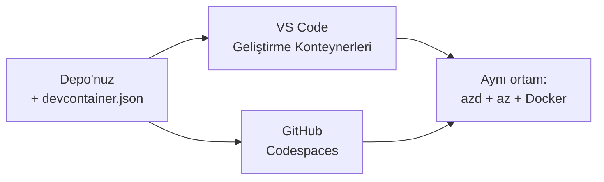

# azd için Dev Containers ve GitHub Codespaces

**Chapter Navigation:**
- **📚 Course Home**: [AZD Yeni Başlayanlar](../../README.md)
- **📖 Current Chapter**: Bölüm 1 - Temel ve Hızlı Başlangıç
- **⬅️ Previous**: [Kendi Uygulamanı Getir](bring-your-own-app.md)
- **🚀 Next Chapter**: [Bölüm 2: AI-Öncelikli Geliştirme](../chapter-02-ai-development/README.md)

> Haziran 2026'da `azd 1.25.6` ile doğrulanmıştır.

## Giriş

Her makineye azd, uygun dil çalışma zamanı, Docker ve Azure CLI kurmak zahmetlidir—ve "benim makinemde çalışıyor" diyen bir öğreticinin başkasında çalışmamasının en önemli nedenidir. Bir **dev container**, tüm araç zincirinizi bir dosyada tanımlayarak bunu çözer. Projeyi VS Code veya GitHub Codespaces'ta açan herkes tam olarak aynı ortama, azd önceden kurulu şekilde erişir. Bu ders bir tane nasıl ekleyeceğinizi gösterir.

## Öğrenme Hedefleri

By the end of this lesson, you will:
- Bir dev container'ın ne olduğunu ve azd için neden faydalı olduğunu anlayın
- Bir projeye minimal bir `.devcontainer/devcontainer.json` ekleyin
- azd, Azure CLI ve Docker'ı Dev Container *özellikleri* aracılığıyla dahil edin
- Projeyi GitHub Codespaces veya VS Code'ta açın

## Öğrenme Çıktıları

After completing this lesson, you will be able to:
- azd projesi için bir `devcontainer.json` oluşturun
- azd ve Azure araçlarını manuel kurulum yapmadan ekleyin
- `azd up` komutunu bir konteynerin veya Codespace'in içinden çalıştırın

---

## Dev Container Nedir?

Bir dev container, depo içindeki bir `.devcontainer/devcontainer.json` dosyasıyla tanımlanan Docker tabanlı bir geliştirme ortamıdır. Projeyi açtığınızda:

- **VS Code** (Dev Containers uzantısıyla) konteyneri oluşturur ve ona bağlanır.
- **GitHub Codespaces** aynı konteyneri bulutta oluşturur ve size tarayıcı tabanlı bir düzenleyici sağlar.

Her iki durumda da, her katkıda bulunan aynı araçlara sahip olur—"azd'i kurdun mu?" türünde sorun giderme olmaz.



---

## Adım 1: devcontainer Dosyasını Oluşturun

Projenizin köküne `.devcontainer/devcontainer.json` dosyasını oluşturun:

```json
{
  "name": "azd-project",
  "image": "mcr.microsoft.com/devcontainers/base:bookworm",
  "features": {
    "ghcr.io/devcontainers/features/azure-cli:1": {},
    "ghcr.io/azure/azure-dev/azd:latest": {},
    "ghcr.io/devcontainers/features/docker-in-docker:2": {},
    "ghcr.io/devcontainers/features/node:1": {}
  },
  "customizations": {
    "vscode": {
      "extensions": [
        "ms-azuretools.azure-dev",
        "ms-azuretools.vscode-bicep"
      ]
    }
  },
  "forwardPorts": [3000],
  "postCreateCommand": "azd version"
}
```

What each part does:

| Key | Purpose |
|-----|---------|
| `image` | Konteyner için temel işletim sistemi |
| `features` | Önceden hazırlanmış yükleyiciler—burada: Azure CLI, **azd**, Docker ve Node.js |
| `customizations.vscode.extensions` | azd ve Bicep VS Code uzantılarını otomatik kurar |
| `forwardPorts` | Uygulamanızın portunu tarayıcınıza açar |
| `postCreateCommand` | Konteyner oluşturulduktan sonra bir kez çalışır (burada, bir sağlık kontrolü) |

> `ghcr.io/azure/azure-dev/azd:latest` özelliği, azd'i bir konteynerde edinmenin resmi yoludur. Tekrarlanabilirlik gerekiyorsa belirli bir sürümü sabitleyin (örneğin `azd:1.25.6`).

---

## Adım 2: Özelliği Uygulamanızın Diline Uydurun

`node` özelliğini uygulamanızın kullandığı başka bir özellikle değiştirin:

```jsonc
// Python project
"ghcr.io/devcontainers/features/python:1": {},

// .NET project
"ghcr.io/devcontainers/features/dotnet:2": {},

// Java project
"ghcr.io/devcontainers/features/java:1": {},

// Go project
"ghcr.io/devcontainers/features/go:1": {}
```

Konteyner barındırıcısı `containerapp`, `aks` veya herhangi bir konteyner görüntüsü oluşturan bir şeyse `docker-in-docker`'ı koruyun—azd görüntüleri oluşturup itmek için Docker'a ihtiyaç duyar.

---

## Adım 3: Açın

**VS Code'ta:**
1. **Dev Containers** uzantısını yükleyin.
2. Proje klasörünü açın.
3. İstendiğinde **Reopen in Container**'a tıklayın (veya *Dev Containers: Reopen in Container* komutunu çalıştırın).

**GitHub Codespaces'ta:**
1. Depoyu GitHub'a gönderin.
2. **Code → Codespaces → Create codespace on main** seçeneğine tıklayın.
3. Konteynerin oluşturulmasını bekleyin—azd terminalde hazır olacaktır.

---

## Adım 4: Konteynerin İçinden Dağıtın

Konteynerde azd önceden kurulu olduğundan, normal iş akışı olduğu gibi çalışır:

```bash
azd auth login --use-device-code   # cihaz kodu Codespaces içinde kullanışlıdır
azd up
```

> **Neden `--use-device-code`?** Uzak bir konteynerde veya Codespace'te yönlendirme yapacak yerel bir tarayıcı yoktur, bu yüzden device-code ile giriş güvenilir yoldur. Oturum açmayı tamamlamak için bir tarayıcı sekmesine bir kod yapıştıracaksınız.

---

## Yaygın Tuzaklar

| Sorun | Çözüm |
|---------|-----|
| `azd up` bir görüntü oluşturamıyor | `docker-in-docker` özelliğini ekleyin |
| Codespaces'ta tarayıcı girişi takılıyor | `azd auth login --use-device-code` kullanın |
| Ekip üyeleri arasında araçlar farklılık gösteriyor | Özellik sürümlerini sabitleyin (ör. `azd:1.25.6`) |
| Uygulamaya tarayıcıdan ulaşılamıyor | Portu `forwardPorts`'a ekleyin |

---

## Özet

- Bir dev container, azd araç zincirinizi herkes için tekrarlanabilir kılar.
- azd, Azure CLI ve Docker'ı Dev Container *özellikleri* aracılığıyla ekleyin.
- Dil özelliğini uygulamanıza göre eşleştirin ve konteyner barındırıcılarda `docker-in-docker`'ı koruyun.
- Codespaces içinde çalışırken device-code ile giriş yapın.

---

## 🔗 Gezinme

| Direction | Resource |
|-----------|----------|
| **Previous** | [Kendi Uygulamanı Getir](bring-your-own-app.md) |
| **Chapter Home** | [Bölüm 1: Temel ve Hızlı Başlangıç](README.md) |
| **Next Chapter** | [Bölüm 2: AI-Öncelikli Geliştirme](../chapter-02-ai-development/README.md) |

## 📖 İlgili Kaynaklar

- [Kurulum ve Yapılandırma](installation.md)
- [Komut Hızlı Başvuru](../../resources/cheat-sheet.md)
- [Resmi Dev Containers spesifikasyonu](https://containers.dev/)
- [azd Dev Container özelliği](https://github.com/Azure/azure-dev/tree/main/ext/devcontainer)

---

<!-- CO-OP TRANSLATOR DISCLAIMER START -->
**Feragatname**:
Bu belge, AI çeviri hizmeti [Co-op Translator](https://github.com/Azure/co-op-translator) kullanılarak çevrilmiştir. Doğruluk için çaba sarf etsek de, otomatik çevirilerin hata veya yanlışlık içerebileceğini lütfen unutmayınız. Orijinal belge, kendi dilinde yetkili kaynak olarak kabul edilmelidir. Kritik bilgiler için profesyonel insan çevirisi önerilir. Bu çevirinin kullanımı sonucu ortaya çıkabilecek yanlış anlamalardan veya yanlış yorumlamalardan sorumlu değiliz.
<!-- CO-OP TRANSLATOR DISCLAIMER END -->