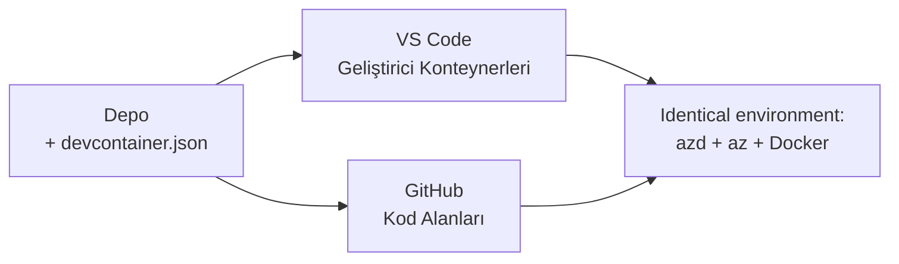

# azd için Geliştirici Konteynerleri ve GitHub Codespaces

**Bölüm Navigasyonu:**
- **📚 Kurs Ana Sayfası**: [Yeni Başlayanlar için AZD](../../README.md)
- **📖 Geçerli Bölüm**: Bölüm 1 - Temel ve Hızlı Başlangıç
- **⬅️ Önceki**: [Kendi Uygulamanı Getir](bring-your-own-app.md)
- **🚀 Sonraki Bölüm**: [Bölüm 2: Yapay Zeka Öncelikli Geliştirme](../chapter-02-ai-development/README.md)

> Temmuz 2026'da `azd 1.27.1` ile doğrulanmıştır.

## Giriş

Her makinede azd, doğru dil çalışma zamanı, Docker ve Azure CLI yüklemek zahmetlidir—ve "makinemde çalışıyor" diyen bir öğreticinin başkası için neden başarısız olduğunun bir numaralı sebebidir. Bir **geliştirici konteyneri**, tüm araç zincirinizi bir dosyada tanımlayarak bunu çözer. Projeyi VS Code veya GitHub Codespaces'te açan herkes, azd zaten kurulmuş tam olarak aynı ortamı elde eder. Bu derste nasıl ekleyeceğiniz gösterilmektedir.

## Öğrenme Hedefleri

Bu dersin sonunda şunları yapabileceksiniz:
- Geliştirici konteynerin ne olduğunu ve azd ile neden yardımcı olduğunu anlamak
- Bir projeye minimum bir `.devcontainer/devcontainer.json` eklemek
- Dev Container *özellikleri*yle azd, Azure CLI ve Docker'ı dahil etmek
- Projeyi GitHub Codespaces veya VS Code'da açmak

## Öğrenme Çıktıları

Bu dersi tamamladıktan sonra şunları yapabilirsiniz:
- Bir azd projesi için `devcontainer.json` yazmak
- Manuel yükleme yapmadan azd ve Azure araçlarını eklemek
- Bir konteyner veya Codespace içinden `azd up` çalıştırmak

---

## Geliştirici Konteyneri Nedir?

Geliştirici konteyneri, .devcontainer/devcontainer.json dosyasıyla tanımlanan Docker tabanlı bir geliştirme ortamıdır. Projeyi açtığınızda:

- **VS Code** (Dev Containers eklentisiyle) konteyneri oluşturur ve ona bağlanır.
- **GitHub Codespaces** aynı konteyneri bulutta oluşturur ve size tarayıcı tabanlı bir editör sunar.

Her iki durumda da, her katkıda bulunan kişi aynı araçları elde eder — "azd yükledin mi?" sorun giderme sorunu olmaz.



---

## 1. Adım: devcontainer Dosyasını Oluştur

Projenizin kökünde `.devcontainer/devcontainer.json` dosyasını oluşturun:

```json
{
  "name": "azd-project",
  "image": "mcr.microsoft.com/devcontainers/base:bookworm",
  "features": {
    "ghcr.io/devcontainers/features/azure-cli:1": {},
    "ghcr.io/azure/azure-dev/azd:latest": {},
    "ghcr.io/devcontainers/features/docker-in-docker:2": {},
    "ghcr.io/devcontainers/features/node:1": {}
  },
  "customizations": {
    "vscode": {
      "extensions": [
        "ms-azuretools.azure-dev",
        "ms-azuretools.vscode-bicep"
      ]
    }
  },
  "forwardPorts": [3000],
  "postCreateCommand": "azd version"
}
```

Her parça ne işe yarar:

| Anahtar | Amaç |
|-----|---------|
| `image` | Konteyner için temel işletim sistemi |
| `features` | Önceden hazırlanmış kurulumlar—burada: Azure CLI, **azd**, Docker ve Node.js |
| `customizations.vscode.extensions` | azd ve Bicep VS Code uzantılarını otomatik yükler |
| `forwardPorts` | Uygulamanızın portunu tarayıcınıza açar |
| `postCreateCommand` | Konteyner oluşturulduktan sonra bir kez çalışır (burada, bir bütünlük kontrolü) |

> `ghcr.io/azure/azure-dev/azd:latest` özelliği, konteynerde azd almak için resmi yoldur. Yeniden üretilebilirlik için belirli bir sürümü (örneğin `azd:1.27.1`) sabitleyin.

---

## 2. Adım: Özelliği Uygulamanızın Diline Uydurun

`node` özelliğini uygulamanızın kullandığı dil ile değiştirin:

```jsonc
// Python project
"ghcr.io/devcontainers/features/python:1": {},

// .NET project
"ghcr.io/devcontainers/features/dotnet:2": {},

// Java project
"ghcr.io/devcontainers/features/java:1": {},

// Go project
"ghcr.io/devcontainers/features/go:1": {}
```

`host` `containerapp`, `aks` ya da herhangi bir konteyner imajı oluşturan bir şey ise `docker-in-docker` özelliğini koruyun—azd, imajları oluşturmak ve göndermek için Docker'a ihtiyaç duyar.

---

## 3. Adım: Açın

**VS Code'da:**
1. **Dev Containers** eklentisini kurun.
2. Proje klasörünü açın.
3. İstendiğinde **Konteyner İçinde Yeniden Aç**a tıklayın (veya *Dev Containers: Reopen in Container* komutunu çalıştırın).

**GitHub Codespaces'te:**
1. Depoyu GitHub'a gönderin.
2. **Code → Codespaces → main üzerinde codespace oluştur** tıklayın.
3. Konteynerin oluşturulmasını bekleyin—azd terminalde hazır.

---

## 4. Adım: Konteyner İçinden Dağıtım Yapın

Konteyner azd önceden kurulmuş olduğundan, normal iş akışı çalışır:

```bash
azd auth login --use-device-code   # cihaz kodu Codespaces içinde kullanışlıdır
azd up
```

> **Neden `--use-device-code`?** Uzaktan bir konteyner veya Codespace'te yerel tarayıcı yoktur, bu yüzden cihaz koduyla giriş güvenilir yoldur. Oturumu tamamlamak için kodu bir tarayıcı sekmesine yapıştıracaksınız.

---

## Yaygın Tuzaklar

| Tuzak | Çözüm |
|---------|-----|
| `azd up` imaj oluşturamıyor | `docker-in-docker` özelliğini ekleyin |
| Browser girişi Codespaces'te takılıyor | `azd auth login --use-device-code` kullanın |
| Araçlar ekip üyeleri arasında farklılık gösteriyor | Özellik sürümlerini sabitleyin (örn. `azd:1.27.1`) |
| Uygulama tarayıcıda erişilebilir değil | Portu `forwardPorts`a ekleyin |

---

## Özet

- Bir geliştirici konteyneri azd araç zincirinizi herkes için tekrarlanabilir hale getirir.
- Dev Container *özellikleri* ile azd, Azure CLI ve Docker'ı ekleyin.
- Dil özelliğini uygulamanıza uyarlayın ve konteyner barındırıcılar için `docker-in-docker`ı koruyun.
- Codespaces içinde çalışırken cihaz kodu ile giriş yapın.

---

## 🔗 Navigasyon

| Yön | Kaynak |
|-----------|----------|
| **Önceki** | [Kendi Uygulamanı Getir](bring-your-own-app.md) |
| **Bölüm Anasayfası** | [Bölüm 1: Temel ve Hızlı Başlangıç](README.md) |
| **Sonraki Bölüm** | [Bölüm 2: Yapay Zeka Öncelikli Geliştirme](../chapter-02-ai-development/README.md) |

## 📖 İlgili Kaynaklar

- [Kurulum & Ayarlar](installation.md)
- [Komut Hızlı Başvuru](../../resources/cheat-sheet.md)
- [Resmi Geliştirici Konteynerleri spesifikasyonu](https://containers.dev/)
- [azd Geliştirici Konteyneri özelliği](https://github.com/Azure/azure-dev/tree/main/ext/devcontainer)

---

<!-- CO-OP TRANSLATOR DISCLAIMER START -->
**Feragatname**:
Bu belge, AI çeviri hizmeti [Co-op Translator](https://github.com/Azure/co-op-translator) kullanılarak çevrilmiştir. Doğruluk için çaba sarf etsek de, otomatik çevirilerin hata veya yanlışlık içerebileceğini lütfen unutmayınız. Orijinal belge, kendi dilinde yetkili kaynak olarak kabul edilmelidir. Kritik bilgiler için profesyonel insan çevirisi önerilir. Bu çevirinin kullanımı sonucu ortaya çıkabilecek yanlış anlamalardan veya yanlış yorumlamalardan sorumlu değiliz.
<!-- CO-OP TRANSLATOR DISCLAIMER END -->