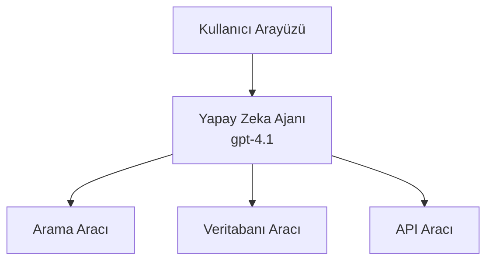
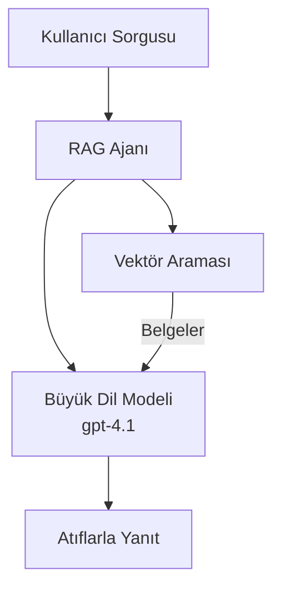
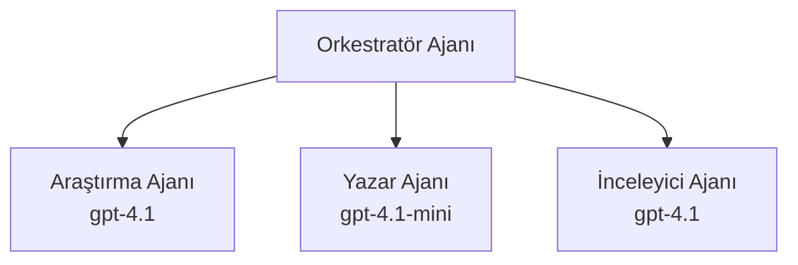

# AI Agents with Azure Developer CLI

**Bölüm Gezinimi:**
- **📚 Ders Anasayfası**: [AZD For Beginners](../../README.md)
- **📖 Mevcut Bölüm**: Bölüm 2 - AI-First Development
- **⬅️ Önceki**: [Microsoft Foundry Integration](microsoft-foundry-integration.md)
- **➡️ Sonraki**: [AI Model Deployment](ai-model-deployment.md)
- **🚀 İleri Düzey**: [Multi-Agent Solutions](../../examples/retail-scenario.md)

---

## Giriş

AI ajanlar, çevrelerini algılayabilen, kararlar alabilen ve belirli hedeflere ulaşmak için eylemler gerçekleştirebilen otonom programlardır. İsteklere yanıt veren basit sohbet botlarının aksine, ajanlar:

- **Araç kullanır** - API'leri çağırır, veritabanlarında arama yapar, kod yürütür
- **Planlama ve muhakeme yapar** - Karmaşık görevleri adımlara böler
- **Bağlamdan öğrenir** - Bellek tutar ve davranışı uyarlayabilir
- **İşbirliği yapar** - Diğer ajanlarla (çok ajanlı sistemler) çalışabilir

Bu rehber, Azure Developer CLI (azd) kullanarak AI ajanlarını Azure'a nasıl dağıtacağınızı gösterir.

> **Doğrulama notu (2026-03-25):** Bu rehber `azd` `1.23.12` ve `azure.ai.agents` `0.1.18-preview` ile gözden geçirilmiştir. `azd ai` deneyimi hâlâ önizleme odaklıdır, bu yüzden yüklü uzantı bayraklarınız farklıysa uzantı yardımını kontrol edin.

## Öğrenme Hedefleri

Bu rehberi tamamlayarak:
- AI ajanlarının ne olduğunu ve sohbet botlarından nasıl farklılaştığını anlayacaksınız
- AZD kullanarak önceden hazırlanmış AI ajan şablonlarını dağıtacaksınız
- Özel ajanlar için Foundry Ajanlarını yapılandıracaksınız
- Temel ajan kalıplarını (araç kullanımı, RAG, çok ajanlı) uygulayacaksınız
- Dağıtılan ajanları izlemeyi ve hata ayıklamayı öğreneceksiniz

## Öğrenme Çıktıları

Tamamlandığında şunları yapabileceksiniz:
- Tek bir komutla AI ajan uygulamalarını Azure'a dağıtmak
- Ajan araçlarını ve yeteneklerini yapılandırmak
- Ajanlarla retrieval-augmented generation (RAG) uygulamak
- Karmaşık iş akışları için çok ajanlı mimariler tasarlamak
- Yaygın ajan dağıtım sorunlarını gidermek

---

## 🤖 Bir Ajanı Sohbet Botundan Farklı Kılan Nedir?

| Özellik | Sohbet Botu | Yapay Zeka Ajanı |
|---------|-------------|------------------|
| **Davranış** | İsteklere yanıt verir | Otonom eylemler gerçekleştirir |
| **Araçlar** | Yok | API çağırabilir, arama yapabilir, kod çalıştırabilir |
| **Bellek** | Yalnızca oturum bazlı | Oturumlar arasında kalıcı bellek |
| **Planlama** | Tek yanıt | Çok adımlı muhakeme |
| **İşbirliği** | Tek bir varlık | Diğer ajanlarla çalışabilir |

### Basit Benzetme

- **Sohbet Botu** = Bilgi masasında soruları yanıtlayan yardımsever bir kişi
- **Yapay Zeka Ajanı** = Sizin için arama yapan, randevu ayarlayan ve görevleri tamamlayabilen kişisel asistan

---

## 🚀 Hızlı Başlangıç: İlk Ajanınızı Dağıtın

### Seçenek 1: Foundry Agents Şablonu (Önerilen)

```bash
# Yapay zeka ajanları şablonunu başlat
azd init --template get-started-with-ai-agents

# Azure'a dağıt
azd up
```

**Dağıtılanlar:**
- ✅ Foundry Agents
- ✅ Microsoft Foundry Models (gpt-4.1)
- ✅ Azure AI Search (RAG için)
- ✅ Azure Container Apps (web arayüzü)
- ✅ Application Insights (izleme)

**Süre:** ~15-20 dakika
**Maliyet:** ~$100-150/ay (geliştirme)

### Seçenek 2: Prompty ile OpenAI Ajanı

```bash
# Prompty tabanlı ajan şablonunu başlatın
azd init --template agent-openai-python-prompty

# Azure'a dağıtın
azd up
```

**Dağıtılanlar:**
- ✅ Azure Functions (serverless ajan yürütme)
- ✅ Microsoft Foundry Models
- ✅ Prompty yapılandırma dosyaları
- ✅ Örnek ajan uygulaması

**Süre:** ~10-15 dakika
**Maliyet:** ~$50-100/ay (geliştirme)

### Seçenek 3: RAG Sohbet Ajanı

```bash
# RAG sohbet şablonunu başlat
azd init --template azure-search-openai-demo

# Azure'a dağıt
azd up
```

**Dağıtılanlar:**
- ✅ Microsoft Foundry Models
- ✅ Örnek verilerle Azure AI Search
- ✅ Doküman işleme hattı
- ✅ Atıflı sohbet arayüzü

**Süre:** ~15-25 dakika
**Maliyet:** ~$80-150/ay (geliştirme)

### Seçenek 4: AZD AI Agent Init (Manifest- veya Şablon Tabanlı Önizleme)

Bir ajan manifest dosyanız varsa, `azd ai` komutunu kullanarak doğrudan bir Foundry Agent Service proje taslağı oluşturabilirsiniz. Son önizleme sürümleri ayrıca şablon tabanlı başlatma desteği ekledi, bu nedenle tam istem akışı yüklü uzantı sürümünüze bağlı olarak biraz farklı olabilir.

```bash
# AI ajanları uzantısını yükle
azd extension install azure.ai.agents

# İsteğe bağlı: yüklü önizleme sürümünü doğrula
azd extension show azure.ai.agents

# Bir ajan manifestinden başlat
azd ai agent init -m agent-manifest.yaml

# Azure'a dağıt
azd up
```

**`azd ai agent init` ile `azd init --template` ne zaman kullanılır:**

| Yaklaşım | En İyi Kullanım | Nasıl Çalışır |
|----------|-----------------|---------------|
| `azd init --template` | Çalışan bir örnek uygulamadan başlarken | Kod + altyapı içeren tam bir şablon deposunu klonlar |
| `azd ai agent init -m` | Kendi ajan manifestinizden oluştururken | Ajan tanımınızdan proje yapısını taslaklandırır |

> **İpucu:** Öğrenirken (yukarıdaki Seçenek 1-3) `azd init --template` kullanın. Kendi manifestlerinizle üretim ajanları oluştururken `azd ai agent init` kullanın. Tam referans için [AZD AI CLI Commands](../chapter-08-production/production-ai-practices.md#azd-ai-cli-commands-and-extensions) bakınız.

---

## 🏗️ Ajan Mimari Kalıpları

### Kalıp 1: Araçlara Sahip Tek Ajan

En basit ajan kalıbı - birden fazla araç kullanabilen tek bir ajan.


**En iyi kullanım:**
- Müşteri destek botları
- Araştırma asistanları
- Veri analiz ajanları

**AZD Şablonu:** `azure-search-openai-demo`

### Kalıp 2: RAG Ajanı (Retrieval-Augmented Generation)

Yanıt üretmeden önce ilgili belgeleri getiren bir ajan.


**En iyi kullanım:**
- Kurumsal bilgi tabanları
- Doküman SSS sistemleri
- Uyumluluk ve hukuki araştırma

**AZD Şablonu:** `azure-search-openai-demo`

### Kalıp 3: Çok Ajanlı Sistem

Birden fazla uzmanlaşmış ajanın karmaşık görevlerde birlikte çalışması.


**En iyi kullanım:**
- Karmaşık içerik üretimi
- Çok adımlı iş akışları
- Farklı uzmanlık gerektiren görevler

**Daha Fazla Bilgi:** [Multi-Agent Coordination Patterns](../chapter-06-pre-deployment/coordination-patterns.md)

---

## ⚙️ Ajan Araçlarını Yapılandırma

Ajanlar, araçları kullanabildiklerinde güçlü hale gelir. İşte yaygın araçların nasıl yapılandırılacağı:

### Foundry Agents'ta Araç Yapılandırması

```python
# agent_config.py
from azure.ai.projects import AIProjectClient
from azure.ai.projects.models import FunctionTool, CodeInterpreterTool

# Özel araçları tanımla
search_tool = FunctionTool(
    name="search_knowledge_base",
    description="Search the company knowledge base for relevant documents",
    parameters={
        "type": "object",
        "properties": {
            "query": {
                "type": "string",
                "description": "The search query"
            }
        },
        "required": ["query"]
    }
)

# Araçlarla ajan oluştur
agent = project_client.agents.create_agent(
    model="gpt-4.1",
    name="Support Agent",
    instructions="You are a helpful support agent. Use the search tool to find relevant information.",
    tools=[search_tool, CodeInterpreterTool()]
)
```

### Ortam Yapılandırması

```bash
# Ajan'a özgü ortam değişkenlerini ayarlayın
azd env set AZURE_OPENAI_MODEL "gpt-4.1"
azd env set AGENT_INSTRUCTIONS "You are a helpful assistant..."
azd env set ENABLE_CODE_INTERPRETER "true"
azd env set ENABLE_FILE_SEARCH "true"

# Güncellenmiş yapılandırmayla dağıtın
azd deploy
```

---

## 📊 Ajanları İzleme

### Application Insights Entegrasyonu

Tüm AZD ajan şablonları izleme için Application Insights içerir:

```bash
# İzleme panosunu aç
azd monitor --overview

# Canlı günlükleri görüntüle
azd monitor --logs

# Canlı metrikleri görüntüle
azd monitor --live
```

### İzlenecek Temel Metrikler

| Metrik | Açıklama | Hedef |
|--------|----------|-------|
| Yanıt Gecikmesi | Yanıt üretme süresi | < 5 saniye |
| Token Kullanımı | İstek başına token sayısı | Maliyet için izleyin |
| Araç Çağrısı Başarı Oranı | Başarılı araç yürütme %si | > %95 |
| Hata Oranı | Başarısız ajan istekleri | < %1 |
| Kullanıcı Memnuniyeti | Geri bildirim puanları | > 4.0/5.0 |

### Ajanlar için Özel Kayıtlama

```python
import os
from azure.monitor.opentelemetry import configure_azure_monitor
from opentelemetry import trace

# Azure Monitor'u OpenTelemetry ile yapılandırın
configure_azure_monitor(
    connection_string=os.environ["APPLICATIONINSIGHTS_CONNECTION_STRING"]
)

tracer = trace.get_tracer(__name__)

def log_agent_interaction(user_query, agent_response, tools_used, latency_ms):
    with tracer.start_as_current_span("agent_interaction") as span:
        span.set_attributes({
            "user_query": user_query,
            "response_length": len(agent_response),
            "tools_used": tools_used,
            "latency_ms": latency_ms
        })
```

> **Not:** Gerekli paketleri kurun: `pip install azure-monitor-opentelemetry opentelemetry`

---

## 💰 Maliyet Dikkate Alınması

### Kalıba Göre Tahmini Aylık Maliyetler

| Kalıp | Geliştirme Ortamı | Üretim |
|-------|-------------------|--------|
| Tek Ajan | $50-100 | $200-500 |
| RAG Ajan | $80-150 | $300-800 |
| Çok Ajanlı (2-3 ajan) | $150-300 | $500-1,500 |
| Kurumsal Çok Ajanlı | $300-500 | $1,500-5,000+ |

### Maliyet Optimizasyon İpuçları

1. **Basit görevler için gpt-4.1-mini kullanın**
   ```bash
   azd env set AZURE_OPENAI_MODEL "gpt-4.1-mini"
   ```

2. **Tekrarlanan sorgular için önbellekleme uygulayın**
   ```python
   from functools import lru_cache
   
   @lru_cache(maxsize=1000)
   def get_cached_response(query_hash):
       return agent.run(query_hash)
   ```

3. **Çalışma başına token sınırları belirleyin**
   ```python
   # max_completion_tokens'i ajanı çalıştırırken ayarlayın, oluşturma sırasında değil
   run = project_client.agents.create_run(
       thread_id=thread.id,
       agent_id=agent.id,
       max_completion_tokens=1000  # Yanıt uzunluğunu sınırlayın
   )
   ```

4. **Kullanılmadığında sıfıra ölçeklendirin**
   ```bash
   # Container Apps otomatik olarak sıfıra ölçeklenir
   azd env set MIN_REPLICAS "0"
   ```

---

## 🔧 Ajanlarda Sorun Giderme

### Yaygın Sorunlar ve Çözümleri

<details>
<summary><strong>❌ Ajan araç çağrılarına yanıt vermiyor</strong></summary>

```bash
# Araçların düzgün kaydedildiğini kontrol et
azd show

# OpenAI dağıtımını doğrula
az cognitiveservices account deployment list \
  --name $AZURE_OPENAI_NAME \
  --resource-group $RG_NAME

# Ajan günlüklerini kontrol et
azd monitor --logs
```

**Yaygın nedenler:**
- Araç fonksiyon imza uyuşmazlığı
- Gerekli izinlerin eksik olması
- API uç noktasına erişilemiyor
</details>

<details>
<summary><strong>❌ Ajan yanıtlarında yüksek gecikme</strong></summary>

```bash
# Darboğazlar için Application Insights'ı kontrol edin
azd monitor --live

# Daha hızlı bir model kullanmayı düşünün
azd env set AZURE_OPENAI_MODEL "gpt-4.1-mini"
azd deploy
```

**Optimizasyon ipuçları:**
- Akışlı yanıtlar kullanın
- Yanıt önbellekleme uygulayın
- Bağlam penceresi boyutunu azaltın
</details>

<details>
<summary><strong>❌ Ajan yanlış veya hayali bilgi döndürüyor</strong></summary>

```python
# Daha iyi sistem istemleriyle geliştirin
instructions = """
You are a helpful assistant. IMPORTANT:
- Only answer based on provided context
- If you don't know, say "I don't know"
- Always cite your sources
- Never make up information
"""

# Temellendirme için veri getirme ekle
agent = project_client.agents.create_agent(
    model="gpt-4.1",
    instructions=instructions,
    tools=[FileSearchTool()]  # Yanıtları belgelerde temellendir
)
```
</details>

<details>
<summary><strong>❌ Token limiti aşıldı hataları</strong></summary>

```python
# Bağlam pencere yönetimini uygulayın
def truncate_context(messages, max_tokens=8000, model="gpt-4.1"):
    """Keep only recent messages within token limit."""
    import tiktoken
    encoding = tiktoken.encoding_for_model(model)
    total_tokens = 0
    truncated = []
    
    for msg in reversed(messages):
        msg_tokens = len(encoding.encode(msg.content))
        if total_tokens + msg_tokens > max_tokens:
            break
        truncated.insert(0, msg)
        total_tokens += msg_tokens
    
    return truncated
```
</details>

---

## 🎓 Uygulamalı Alıştırmalar

### Alıştırma 1: Temel Bir Ajan Dağıtın (20 dakika)

**Hedef:** AZD kullanarak ilk AI ajanınızı dağıtın

```bash
# Adım 1: Şablonu başlatın
azd init --template get-started-with-ai-agents

# Adım 2: Azure'a giriş yapın
azd auth login
# Kiracılar arasında çalışıyorsanız, --tenant-id <tenant-id> ekleyin

# Adım 3: Dağıtın
azd up

# Adım 4: Ajanı test edin
# Dağıtımdan sonra beklenen çıktı:
#   Dağıtım Tamamlandı!
#   Uç nokta: https://<app-name>.<region>.azurecontainerapps.io
# Çıktıda gösterilen URL'yi açın ve bir soru sormayı deneyin

# Adım 5: İzlemeyi görüntüleyin
azd monitor --overview

# Adım 6: Temizleyin
azd down --force --purge
```

**Başarı Kriterleri:**
- [ ] Ajan sorulara yanıt veriyor
- [ ] `azd monitor` ile izleme panosuna erişilebiliyor
- [ ] Kaynaklar başarıyla temizlendi

### Alıştırma 2: Özel Bir Araç Ekleyin (30 dakika)

**Hedef:** Bir ajana özel bir araç ekleyin

1. Ajan şablonunu dağıtın:
   ```bash
   azd init --template get-started-with-ai-agents
   azd up
   ```
2. Ajan kodunuza yeni bir araç fonksiyonu oluşturun:
   ```python
   def get_weather(location: str) -> str:
       """Get current weather for a location."""
       # Hava durumu servisine API çağrısı
       return f"Weather in {location}: Sunny, 72°F"
   ```
3. Aracı ajana kaydedin:
   ```python
   from azure.ai.projects.models import FunctionTool

   weather_tool = FunctionTool(
       name="get_weather",
       description="Get current weather for a location",
       parameters={
           "type": "object",
           "properties": {
               "location": {"type": "string", "description": "City name"}
           },
           "required": ["location"]
       }
   )

   agent = project_client.agents.create_agent(
       model="gpt-4.1",
       name="Weather Agent",
       tools=[weather_tool]
   )
   ```
4. Yeniden dağıtın ve test edin:
   ```bash
   azd deploy
   # Sor: "Seattle'da hava durumu nedir?"
   # Beklenen: Ajan get_weather("Seattle") fonksiyonunu çağırır ve hava bilgisini döndürür
   ```

**Başarı Kriterleri:**
- [ ] Ajan hava durumu ile ilgili sorguları tanıyor
- [ ] Araç doğru şekilde çağrılıyor
- [ ] Yanıtta hava durumu bilgisi yer alıyor

### Alıştırma 3: Bir RAG Ajanı Oluşturun (45 dakika)

**Hedef:** Belgelerinizden sorulara cevap veren bir ajan oluşturun

```bash
# Adım 1: RAG şablonunu dağıtın
azd init --template azure-search-openai-demo
azd up

# Adım 2: Belgelerinizi yükleyin
# PDF/TXT dosyalarını data/ dizinine koyun, ardından şunu çalıştırın:
python scripts/prepdocs.py

# Adım 3: Alanına özgü sorularla test edin
# azd up çıktısından web uygulama URL'sini açın
# Yüklediğiniz belgeler hakkında sorular sorun
# Yanıtlar [doc.pdf] gibi atıf referansları içermelidir
```

**Başarı Kriterleri:**
- [ ] Ajan yüklenen belgelerden yanıt veriyor
- [ ] Yanıtlar atıf içeriyor
- [ ] Kapsam dışı sorularda hayal gücüne dayalı yanlış bilgi yok

---

## 📚 Sonraki Adımlar

Artık AI ajanlarını anladığınıza göre, bu ileri konuları keşfedin:

| Konu | Açıklama | Bağlantı |
|------|----------|----------|
| **Multi-Agent Systems** | Birden çok işbirlikçi ajan ile sistemler oluşturma | [Retail Multi-Agent Example](../../examples/retail-scenario.md) |
| **Coordination Patterns** | Orkestrasyon ve iletişim kalıplarını öğrenin | [Coordination Patterns](../chapter-06-pre-deployment/coordination-patterns.md) |
| **Production Deployment** | Kurumsal kullanıma uygun ajan dağıtımı | [Production AI Practices](../chapter-08-production/production-ai-practices.md) |
| **Agent Evaluation** | Ajan performansını test ve değerlendirme | [AI Troubleshooting](../chapter-07-troubleshooting/ai-troubleshooting.md) |
| **AI Workshop Lab** | Uygulamalı: AI çözümünüzü AZD'ye hazır hale getirin | [AI Workshop Lab](ai-workshop-lab.md) |

---

## 📖 Ek Kaynaklar

### Resmi Dokümantasyon
- [Azure AI Agent Service](https://learn.microsoft.com/azure/ai-services/agents/)
- [Azure AI Foundry Agent Service Quickstart](https://learn.microsoft.com/azure/ai-services/agents/quickstart)
- [Semantic Kernel Agent Framework](https://learn.microsoft.com/semantic-kernel/)

### Ajanlar için AZD Şablonları
- [Get Started with AI Agents](https://github.com/Azure-Samples/get-started-with-ai-agents)
- [Agent OpenAI Python Prompty](https://github.com/Azure-Samples/agent-openai-python-prompty)
- [Azure Search OpenAI Demo](https://github.com/Azure-Samples/azure-search-openai-demo)

### Topluluk Kaynakları
- [Awesome AZD - Agent Templates](https://azure.github.io/awesome-azd/?tags=ai-agents)
- [Azure AI Discord](https://discord.gg/microsoft-azure)
- [Microsoft Foundry Discord](https://discord.gg/nTYy5BXMWG)

### Editörünüz için Ajan Becerileri
- [**Microsoft Azure Agent Skills**](https://skills.sh/microsoft/github-copilot-for-azure) - GitHub Copilot, Cursor veya desteklenen herhangi bir ajan için Azure geliştirme amaçlı yeniden kullanılabilir AI ajan becerileri yükleyin. İçerir: [Azure AI](https://skills.sh/microsoft/github-copilot-for-azure/azure-ai), [Microsoft Foundry](https://skills.sh/microsoft/github-copilot-for-azure/microsoft-foundry), [deployment](https://skills.sh/microsoft/github-copilot-for-azure/azure-deploy) ve [diagnostics](https://skills.sh/microsoft/github-copilot-for-azure/azure-diagnostics):
  ```bash
  npx skills add microsoft/github-copilot-for-azure
  ```

---

**Gezinim**
- **Önceki Ders**: [Microsoft Foundry Integration](microsoft-foundry-integration.md)
- **Sonraki Ders**: [AI Model Deployment](ai-model-deployment.md)

---

<!-- CO-OP TRANSLATOR DISCLAIMER START -->
**Feragatname**:
Bu belge, yapay zeka çeviri hizmeti [Co-op Translator](https://github.com/Azure/co-op-translator) kullanılarak çevrilmiştir. Doğruluk için çaba göstersek de, otomatik çevirilerin hatalar veya yanlışlıklar içerebileceğini unutmayın. Orijinal belge, kendi dilindeki haliyle yetkili kaynak olarak kabul edilmelidir. Kritik bilgiler için profesyonel insan çevirisi önerilir. Bu çevirinin kullanımından kaynaklanan herhangi bir yanlış anlaşılma veya yanlış yorumdan sorumlu değiliz.
<!-- CO-OP TRANSLATOR DISCLAIMER END -->