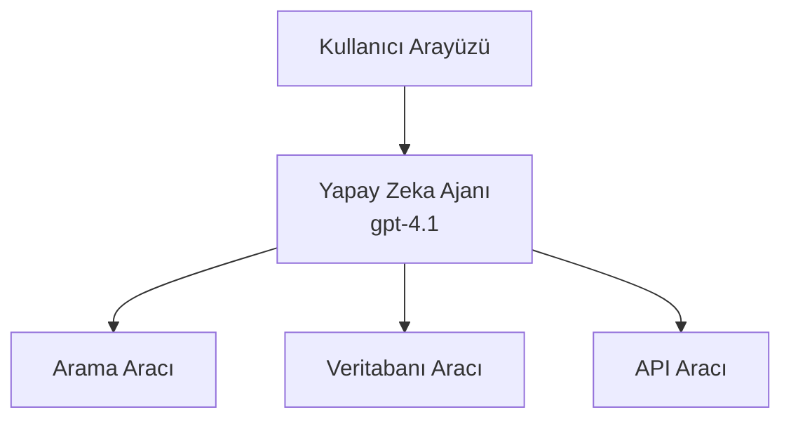
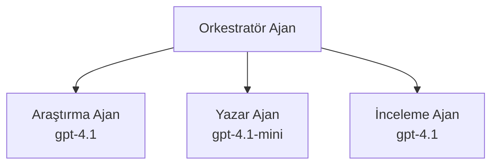

# Yapay Zeka Ajanları ile Azure Developer CLI

**Bölüm Gezintisi:**
- **📚 Kurs Ana Sayfası**: [AZD For Beginners](../../README.md)
- **📖 Mevcut Bölüm**: Bölüm 2 - Yapay Zeka Öncelikli Geliştirme
- **⬅️ Önceki**: [Microsoft Foundry Entegrasyonu](microsoft-foundry-integration.md)
- **➡️ Sonraki**: [AI Model Dağıtımı](ai-model-deployment.md)
- **🚀 İleri Düzey**: [Çoklu Ajan Çözümleri](../../examples/retail-scenario.md)

---

## Giriş

AI ajanları, çevrelerini algılayabilen, karar verebilen ve belirli hedeflere ulaşmak için eylemler gerçekleştirebilen otonom programlardır. İsteklere yanıt veren basit sohbet botlarından farklı olarak, ajanlar:

- **Araçlar kullanır** - API çağırma, veri tabanlarında arama, kod yürütme
- **Planlama ve muhakeme yapar** - Karmaşık görevleri adımlara ayırır
- **Bağlamdan öğrenir** - Bellek tutar ve davranışı uyarlar
- **İşbirliği yapar** - Diğer ajanlarla (çoklu ajan sistemleri) çalışabilir

Bu kılavuz, Azure Developer CLI (azd) kullanarak AI ajanlarını Azure'a nasıl dağıtacağınızı gösterir.

## Öğrenme Hedefleri

Bu kılavuzu tamamlayarak:
- AI ajanlarının ne olduğunu ve sohbet botlarından nasıl farklılaştığını anlayacaksınız
- AZD kullanarak önceden oluşturulmuş AI ajan şablonlarını dağıtmayı öğreneceksiniz
- Özel ajanlar için Foundry Ajanlarını yapılandırmayı öğreneceksiniz
- Temel ajan desenlerini (araç kullanımı, RAG, çoklu ajan) uygulayacaksınız
- Dağıtılmış ajanları izleme ve hata ayıklama yapabileceksiniz

## Öğrenme Sonuçları

Tamamlandığında, şunları yapabileceksiniz:
- Tek komutla AI ajan uygulamalarını Azure'a dağıtmak
- Ajan araçlarını ve yeteneklerini yapılandırmak
- Ajanlarla retrieval-augmented generation (RAG) uygulamak
- Karmaşık iş akışları için çoklu ajan mimarileri tasarlamak
- Yaygın ajan dağıtım sorunlarını gidermek

---

## 🤖 Bir Ajanı Bir Sohbet Botundan Farklı Kılan Nedir?

| Özellik | Sohbet Botu | AI Ajanı |
|---------|---------|----------|
| **Davranış** | İsteklere yanıt verir | Otonom eylemler gerçekleştirir |
| **Araçlar** | Yok | API çağırabilir, arama yapabilir, kod yürütür |
| **Bellek** | Yalnızca oturum tabanlı | Oturumlar arası kalıcı bellek |
| **Planlama** | Tek yanıt | Çok adımlı akıl yürütme |
| **İşbirliği** | Tek varlık | Diğer ajanlarla çalışabilir |

### Basit Bir Benzetme

- **Sohbet Botu** = Bilgi masasında soruları cevaplayan yardımsever bir kişi
- **AI Ajanı** = Telefon aramaları yapabilen, randevular ayarlayabilen ve görevleri tamamlayabilen bir kişisel asistan

---

## 🚀 Hızlı Başlangıç: İlk Ajanınızı Dağıtın

### Seçenek 1: Foundry Ajanları Şablonu (Önerilen)

```bash
# AI ajanları şablonunu başlatın
azd init --template get-started-with-ai-agents

# Azure'a dağıtın
azd up
```

**Dağıtılanlar:**
- ✅ Foundry Ajanları
- ✅ Microsoft Foundry Modelleri (gpt-4.1)
- ✅ Azure AI Search (RAG için)
- ✅ Azure Container Apps (web arayüzü)
- ✅ Application Insights (izleme)

**Süre:** ~15-20 dakika
**Maliyet:** ~$100-150/ay (geliştirme)

### Seçenek 2: Prompty ile OpenAI Ajanı

```bash
# Prompty tabanlı ajan şablonunu başlat
azd init --template agent-openai-python-prompty

# Azure'a dağıt
azd up
```

**Dağıtılanlar:**
- ✅ Azure Functions (sunucusuz ajan yürütme)
- ✅ Microsoft Foundry Modelleri
- ✅ Prompty yapılandırma dosyaları
- ✅ Örnek ajan uygulaması

**Süre:** ~10-15 dakika
**Maliyet:** ~$50-100/ay (geliştirme)

### Seçenek 3: RAG Sohbet Ajanı

```bash
# RAG sohbet şablonunu başlatın
azd init --template azure-search-openai-demo

# Azure'a dağıtın
azd up
```

**Dağıtılanlar:**
- ✅ Microsoft Foundry Modelleri
- ✅ Örnek veri ile Azure AI Search
- ✅ Belge işleme hattı
- ✅ Kaynakça gösterimli sohbet arayüzü

**Süre:** ~15-25 dakika
**Maliyet:** ~$80-150/ay (geliştirme)

### Seçenek 4: AZD AI Agent Init (Manifest Tabanlı)

Eğer bir ajan manifest dosyanız varsa, bir Foundry Agent Service projesi iskeleti oluşturmak için `azd ai` komutunu doğrudan kullanabilirsiniz:

```bash
# AI ajanları eklentisini yükleyin
azd extension install azure.ai.agents

# Bir ajan manifest dosyasından başlatın
azd ai agent init -m agent-manifest.yaml

# Azure'a dağıtın
azd up
```

**`azd ai agent init` ile `azd init --template` ne zaman kullanılmalı:**

| Yaklaşım | En Uygun | Nasıl Çalışır |
|----------|----------|------|
| `azd init --template` | Çalışan bir örnek uygulamadan başlamak | Kod + altyapı içeren tam şablon deposunu klonlar |
| `azd ai agent init -m` | Kendi ajan manifestonuzdan oluşturma | Ajan tanımınızdan proje yapısını oluşturur |

> **İpucu:** Öğrenirken `azd init --template` kullanın (Yukarıdaki Seçenekler 1-3). Üretim ajanları için kendi manifestolarınızla `azd ai agent init` kullanın. Tam referans için [AZD AI CLI Komutları](../chapter-08-production/production-ai-practices.md#azd-ai-cli-commands-and-extensions) bölümüne bakın.

---

## 🏗️ Ajan Mimari Desenleri

### Desen 1: Araçlara Sahip Tek Ajan

En basit ajan deseni - birden çok aracı kullanabilen tek bir ajan.


**En iyi kullanım alanları:**
- Müşteri destek botları
- Araştırma asistanları
- Veri analiz ajanları

**AZD Şablonu:** `azure-search-openai-demo`

### Desen 2: RAG Ajanı (Retrieval-Augmented Generation)

Yanıt üretmeden önce ilgili belgeleri getiren bir ajan.

```mermaid
graph TD
    Query[Kullanıcı Sorgusu] --> RAG[RAG Ajanı]
    RAG --> Vector[Vektör Arama]
    RAG --> LLM[Büyük Dil Modeli (LLM)<br/>gpt-4.1]
    Vector -- Belgeler --> LLM
    LLM --> Response[Atıflı Yanıt]
```
**En iyi kullanım alanları:**
- Kurumsal bilgi tabanları
- Belge Soru-Cevap sistemleri
- Uyumluluk ve hukuki araştırmalar

**AZD Şablonu:** `azure-search-openai-demo`

### Desen 3: Çoklu Ajan Sistemi

Karmaşık görevlerde birlikte çalışan birden çok uzmanlaşmış ajan.


**En iyi kullanım alanları:**
- Karmaşık içerik üretimi
- Çok adımlı iş akışları
- Farklı uzmanlık gerektiren görevler

**Daha Fazla Bilgi:** [Çoklu Ajan Koordinasyon Desenleri](../chapter-06-pre-deployment/coordination-patterns.md)

---

## ⚙️ Ajan Araçlarını Yapılandırma

Ajanlar, araçları kullanabildiklerinde güçlü hale gelir. İşte yaygın araçların nasıl yapılandırılacağı:

### Foundry Ajanlarında Araç Yapılandırması

```python
# agent_config.py
from azure.ai.projects import AIProjectClient
from azure.ai.projects.models import FunctionTool, CodeInterpreterTool

# Özel araçları tanımla
search_tool = FunctionTool(
    name="search_knowledge_base",
    description="Search the company knowledge base for relevant documents",
    parameters={
        "type": "object",
        "properties": {
            "query": {
                "type": "string",
                "description": "The search query"
            }
        },
        "required": ["query"]
    }
)

# Araçlarla ajan oluştur
agent = project_client.agents.create_agent(
    model="gpt-4.1",
    name="Support Agent",
    instructions="You are a helpful support agent. Use the search tool to find relevant information.",
    tools=[search_tool, CodeInterpreterTool()]
)
```

### Ortam Yapılandırması

```bash
# Ajan'a özgü ortam değişkenlerini ayarla
azd env set AZURE_OPENAI_MODEL "gpt-4.1"
azd env set AGENT_INSTRUCTIONS "You are a helpful assistant..."
azd env set ENABLE_CODE_INTERPRETER "true"
azd env set ENABLE_FILE_SEARCH "true"

# Güncellenmiş yapılandırmayla dağıt
azd deploy
```

---

## 📊 Ajanları İzleme

### Application Insights Entegrasyonu

Tüm AZD ajan şablonları izleme için Application Insights içerir:

```bash
# İzleme panosunu aç
azd monitor --overview

# Canlı günlükleri görüntüle
azd monitor --logs

# Canlı metrikleri görüntüle
azd monitor --live
```

### İzlenecek Temel Metrikler

| Metrik | Açıklama | Hedef |
|--------|-------------|--------|
| Yanıt Gecikmesi | Yanıt üretme süresi | < 5 saniye |
| Token Kullanımı | İstek başına token | Maliyet için izleyin |
| Araç Çağrısı Başarı Oranı | Başarılı araç yürütmelerinin %'si | > %95 |
| Hata Oranı | Başarısız ajan istekleri | < %1 |
| Kullanıcı Memnuniyeti | Geri bildirim puanları | > 4.0/5.0 |

### Ajanlar için Özel Kayıtlama

```python
import os
from azure.monitor.opentelemetry import configure_azure_monitor
from opentelemetry import trace

# OpenTelemetry ile Azure Monitor'u yapılandırın
configure_azure_monitor(
    connection_string=os.environ["APPLICATIONINSIGHTS_CONNECTION_STRING"]
)

tracer = trace.get_tracer(__name__)

def log_agent_interaction(user_query, agent_response, tools_used, latency_ms):
    with tracer.start_as_current_span("agent_interaction") as span:
        span.set_attributes({
            "user_query": user_query,
            "response_length": len(agent_response),
            "tools_used": tools_used,
            "latency_ms": latency_ms
        })
```

> **Not:** Gerekli paketleri yükleyin: `pip install azure-monitor-opentelemetry opentelemetry`

---

## 💰 Maliyet Hususları

### Desene Göre Tahmini Aylık Maliyetler

| Desen | Geliştirme Ortamı | Üretim |
|---------|-----------------|------------|
| Single Agent | $50-100 | $200-500 |
| RAG Agent | $80-150 | $300-800 |
| Multi-Agent (2-3 agents) | $150-300 | $500-1,500 |
| Enterprise Multi-Agent | $300-500 | $1,500-5,000+ |

### Maliyet Optimizasyonu İpuçları

1. **Basit görevler için gpt-4.1-mini kullanın**
   ```bash
   azd env set AZURE_OPENAI_MODEL "gpt-4.1-mini"
   ```

2. **Tekrarlanan sorgular için önbellekleme uygulayın**
   ```python
   from functools import lru_cache
   
   @lru_cache(maxsize=1000)
   def get_cached_response(query_hash):
       return agent.run(query_hash)
   ```

3. **Her çalıştırma için token sınırları belirleyin**
   ```python
   # Agent çalıştırılırken max_completion_tokens'i ayarlayın, oluşturma sırasında değil
   run = project_client.agents.create_run(
       thread_id=thread.id,
       agent_id=agent.id,
       max_completion_tokens=1000  # Yanıt uzunluğunu sınırlandırın
   )
   ```

4. **Kullanılmadığında sıfıra ölçeklendirin**
   ```bash
   # Container Apps otomatik olarak sıfıra ölçeklenir
   azd env set MIN_REPLICAS "0"
   ```

---

## 🔧 Ajan Sorun Giderme

### Yaygın Sorunlar ve Çözümleri

<details>
<summary><strong>❌ Ajan araç çağrılarına yanıt vermiyor</strong></summary>

```bash
# Araçların doğru şekilde kayıtlı olup olmadığını kontrol edin
azd show

# OpenAI dağıtımını doğrulayın
az cognitiveservices account deployment list \
  --name $AZURE_OPENAI_NAME \
  --resource-group $RG_NAME

# Ajan günlüklerini kontrol edin
azd monitor --logs
```

**Yaygın nedenler:**
- Araç fonksiyon imza uyumsuzluğu
- Gerekli izinlerin eksik olması
- API uç noktası erişilebilir değil
</details>

<details>
<summary><strong>❌ Ajan yanıtlarında yüksek gecikme</strong></summary>

```bash
# Application Insights'ta darboğazları kontrol edin
azd monitor --live

# Daha hızlı bir model kullanmayı düşünün
azd env set AZURE_OPENAI_MODEL "gpt-4.1-mini"
azd deploy
```

**Optimizasyon ipuçları:**
- Akış yanıtlarını kullanın
- Yanıt önbellekleme uygulayın
- Bağlam penceresi boyutunu azaltın
</details>

<details>
<summary><strong>❌ Ajan yanlış veya uydurma bilgi döndürüyor</strong></summary>

```python
# Daha iyi sistem istemleriyle iyileştirin
instructions = """
You are a helpful assistant. IMPORTANT:
- Only answer based on provided context
- If you don't know, say "I don't know"
- Always cite your sources
- Never make up information
"""

# Temellendirme için veri getirme ekleyin
agent = project_client.agents.create_agent(
    model="gpt-4.1",
    instructions=instructions,
    tools=[FileSearchTool()]  # Yanıtları belgelere dayandırın
)
```
</details>

<details>
<summary><strong>❌ Token limiti aşıldı hataları</strong></summary>

```python
# Bağlam pencere yönetimini uygulayın.
def truncate_context(messages, max_tokens=8000, model="gpt-4.1"):
    """Keep only recent messages within token limit."""
    import tiktoken
    encoding = tiktoken.encoding_for_model(model)
    total_tokens = 0
    truncated = []
    
    for msg in reversed(messages):
        msg_tokens = len(encoding.encode(msg.content))
        if total_tokens + msg_tokens > max_tokens:
            break
        truncated.insert(0, msg)
        total_tokens += msg_tokens
    
    return truncated
```
</details>

---

## 🎓 Uygulamalı Alıştırmalar

### Alıştırma 1: Temel Bir Ajan Dağıtma (20 dakika)

**Hedef:** AZD kullanarak ilk AI ajanınızı dağıtmak

```bash
# Adım 1: Şablonu başlatın
azd init --template get-started-with-ai-agents

# Adım 2: Azure'a giriş yapın
azd auth login

# Adım 3: Dağıtın
azd up

# Adım 4: Ajanı test edin
# Dağıtımdan sonra beklenen çıktı:
#   Dağıtım tamamlandı!
#   Uç nokta: https://<app-name>.<region>.azurecontainerapps.io
# Çıktıda gösterilen URL'yi açın ve bir soru sormayı deneyin

# Adım 5: İzlemeyi görüntüleyin
azd monitor --overview

# Adım 6: Temizleyin
azd down --force --purge
```

**Başarı Kriterleri:**
- [ ] Ajan sorulara yanıt veriyor
- [ ] `azd monitor` ile izleme panosuna erişebiliyor
- [ ] Kaynaklar başarıyla temizlendi

### Alıştırma 2: Özel Bir Araç Ekleme (30 dakika)

**Hedef:** Bir ajanı özel bir araçla genişletmek

1. Ajan şablonunu dağıtın:
   ```bash
   azd init --template get-started-with-ai-agents
   azd up
   ```
2. Ajan kodunuzda yeni bir araç fonksiyonu oluşturun:
   ```python
   def get_weather(location: str) -> str:
       """Get current weather for a location."""
       # Hava durumu servisine API çağrısı
       return f"Weather in {location}: Sunny, 72°F"
   ```
3. Aracı ajanla kaydedin:
   ```python
   from azure.ai.projects.models import FunctionTool

   weather_tool = FunctionTool(
       name="get_weather",
       description="Get current weather for a location",
       parameters={
           "type": "object",
           "properties": {
               "location": {"type": "string", "description": "City name"}
           },
           "required": ["location"]
       }
   )

   agent = project_client.agents.create_agent(
       model="gpt-4.1",
       name="Weather Agent",
       tools=[weather_tool]
   )
   ```
4. Yeniden dağıtın ve test edin:
   ```bash
   azd deploy
   # Sor: "Seattle'da hava nasıl?"
   # Beklenen: Ajan get_weather("Seattle")'i çağırır ve hava bilgisini döndürür
   ```

**Başarı Kriterleri:**
- [ ] Ajan hava durumu ile ilgili sorguları tanıyor
- [ ] Araç doğru şekilde çağrılıyor
- [ ] Yanıt hava durumu bilgisi içeriyor

### Alıştırma 3: Bir RAG Ajanı Oluşturma (45 dakika)

**Hedef:** Belgelerinizden soruları yanıtlayan bir ajan oluşturmak

```bash
# Adım 1: RAG şablonunu dağıtın
azd init --template azure-search-openai-demo
azd up

# Adım 2: Belgelerinizi yükleyin
# PDF/TXT dosyalarını data/ dizinine koyun, sonra çalıştırın:
python scripts/prepdocs.py

# Adım 3: Alanınıza özgü sorularla test edin
# azd up çıktısından web uygulamasının URL'sini açın
# Yüklediğiniz belgelerle ilgili sorular sorun
# Yanıtlar [doc.pdf] gibi kaynak atıfları içermelidir
```

**Başarı Kriterleri:**
- [ ] Ajan yüklenen belgelerden yanıt veriyor
- [ ] Yanıtlar kaynakça içeriyor
- [ ] Kapsam dışı sorularda uydurma yok

---

## 📚 Sonraki Adımlar

Artık AI ajanlarını anladığınıza göre, bu gelişmiş konuları keşfedin:

| Konu | Açıklama | Bağlantı |
|-------|-------------|------|
| **Çoklu Ajan Sistemleri** | Birden çok işbirliği yapan ajanla sistemler oluşturun | [Perakende Çoklu Ajan Örneği](../../examples/retail-scenario.md) |
| **Koordinasyon Desenleri** | Orkestrasyon ve iletişim desenlerini öğrenin | [Koordinasyon Desenleri](../chapter-06-pre-deployment/coordination-patterns.md) |
| **Üretim Dağıtımı** | Kurumsal kullanıma uygun ajan dağıtımı | [Production AI Practices](../chapter-08-production/production-ai-practices.md) |
| **Ajan Değerlendirmesi** | Ajan performansını test etme ve değerlendirme | [AI Troubleshooting](../chapter-07-troubleshooting/ai-troubleshooting.md) |
| **AI Atölye Laboratuvarı** | Uygulamalı: AI çözümünüzü AZD'ye hazır hale getirin | [AI Workshop Lab](ai-workshop-lab.md) |

---

## 📖 Ek Kaynaklar

### Resmi Dokümantasyon
- [Azure AI Agent Service](https://learn.microsoft.com/azure/ai-services/agents/)
- [Azure AI Foundry Agent Service Quickstart](https://learn.microsoft.com/azure/ai-services/agents/quickstart)
- [Semantic Kernel Agent Framework](https://learn.microsoft.com/semantic-kernel/)

### Ajanlar için AZD Şablonları
- [Get Started with AI Agents](https://github.com/Azure-Samples/get-started-with-ai-agents)
- [Agent OpenAI Python Prompty](https://github.com/Azure-Samples/agent-openai-python-prompty)
- [Azure Search OpenAI Demo](https://github.com/Azure-Samples/azure-search-openai-demo)

### Topluluk Kaynakları
- [Awesome AZD - Agent Templates](https://azure.github.io/awesome-azd/?tags=ai-agents)
- [Azure AI Discord](https://discord.gg/microsoft-azure)
- [Microsoft Foundry Discord](https://discord.gg/nTYy5BXMWG)

### Editörünüz için Ajan Becerileri
- [**Microsoft Azure Ajan Becerileri**](https://skills.sh/microsoft/github-copilot-for-azure) - GitHub Copilot, Cursor veya desteklenen herhangi bir ajan için Azure geliştirme amaçlı yeniden kullanılabilir AI ajan becerilerini yükleyin. İçerir beceriler: [Azure AI](https://skills.sh/microsoft/github-copilot-for-azure/azure-ai), [Microsoft Foundry](https://skills.sh/microsoft/github-copilot-for-azure/microsoft-foundry), [dağıtım](https://skills.sh/microsoft/github-copilot-for-azure/azure-deploy) ve [tanılama](https://skills.sh/microsoft/github-copilot-for-azure/azure-diagnostics):
  ```bash
  npx skills add microsoft/github-copilot-for-azure
  ```

---

**Gezinme**
- **Önceki Ders**: [Microsoft Foundry Entegrasyonu](microsoft-foundry-integration.md)
- **Sonraki Ders**: [AI Model Dağıtımı](ai-model-deployment.md)

---

<!-- CO-OP TRANSLATOR DISCLAIMER START -->
**Feragatname**:
Bu belge, AI çeviri hizmeti [Co-op Translator](https://github.com/Azure/co-op-translator) kullanılarak çevrilmiştir. Doğruluğa önem vermemize rağmen, otomatik çevirilerin hatalar veya yanlışlıklar içerebileceğini lütfen unutmayın. Orijinal belge, kendi dilindeki metin, yetkili kaynak olarak kabul edilmelidir. Kritik bilgiler için profesyonel insan çevirisi önerilir. Bu çevirinin kullanımı sonucunda ortaya çıkabilecek herhangi bir yanlış anlamadan veya yanlış yorumlamadan sorumlu değiliz.
<!-- CO-OP TRANSLATOR DISCLAIMER END -->