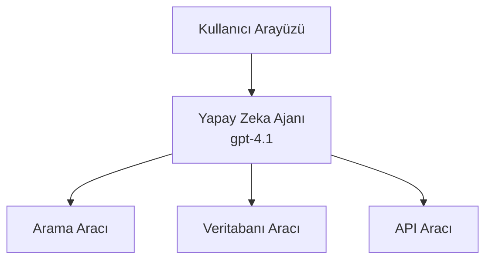
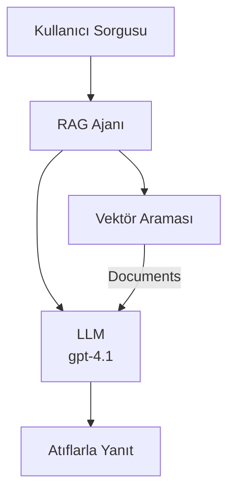
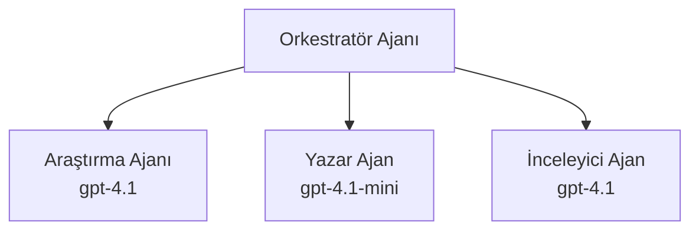

# Azure Developer CLI ile AI Ajanları

**Bölüm Navigasyonu:**
- **📚 Kurs Ana Sayfası**: [AZD Yeni Başlayanlar İçin](../../README.md)
- **📖 Mevcut Bölüm**: Bölüm 2 - AI-Öncelikli Geliştirme
- **⬅️ Önceki**: [Microsoft Foundry Entegrasyonu](microsoft-foundry-integration.md)
- **➡️ Sonraki**: [AI Model Dağıtımı](ai-model-deployment.md)
- **🚀 İleri Düzey**: [Çoklu Ajan Çözümleri](../../examples/retail-scenario.md)

---

## Giriş

AI ajanları, çevrelerini algılayabilen, karar verebilen ve belirli hedeflere ulaşmak için eylemler gerçekleştirebilen otonom programlardır. Basit istemlere yanıt veren sohbet botlarının aksine, ajanlar:

- **Araçlar kullanabilir** - API çağrıları yapar, veritabanlarında arama yapar, kod çalıştırır
- **Plan yapar ve muhakeme eder** - Karmaşık görevleri adımlara böler
- **Bağlamdan öğrenir** - Belleği korur ve davranışını uyarlayabilir
- **İş birliği yapar** - Diğer ajanlarla (çoklu ajan sistemleri) çalışabilir

Bu rehber, Azure Developer CLI (azd) kullanarak Azure’a AI ajanları nasıl dağıtacağınızı gösterir.

> **Doğrulama notu (2026-07-13):** Bu rehber `azd` `1.27.1` ve `azure.ai.agents` `1.0.0-beta.5` sürümlerine göre incelenmiştir. `azd ai` deneyimi hâlâ önizleme aşamasındadır, yüklü uzantı bayraklarınız farklıysa uzantı yardımını kontrol edin.

## Öğrenme Hedefleri

Bu rehberi tamamlayarak:
- AI ajanlarının ne olduğunu ve sohbet botlarından nasıl farklılaştığını anlayacaksınız
- AZD kullanarak önceden hazırlanmış AI ajan şablonlarını dağıtabileceksiniz
- Özelleştirilmiş ajanlar için Foundry Ajanlarını yapılandıracaksınız
- Temel ajan kalıplarını uygulayacaksınız (araç kullanımı, RAG, çoklu ajan)
- Dağıtılan ajanları izleyecek ve hata ayıklayacaksınız

## Öğrenme Çıktıları

Tamamlandığında, şunları yapabileceksiniz:
- Tek komutla AI ajan uygulamalarını Azure’a dağıtmak
- Ajan araçlarını ve yeteneklerini yapılandırmak
- Ajanlarla birlikte geri alma destekli üretim (RAG) uygulamak
- Karmaşık iş akışları için çoklu ajan mimarileri tasarlamak
- Yaygın ajan dağıtımı sorunlarını gidermek

---

## 🤖 Bir Ajanı Sohbet Botundan Farklı Kılan Nedir?

| Özellik | Sohbet Botu | AI Ajanı |
|---------|------------|----------|
| **Davranış** | İstemlere yanıt verir | Otonom eylemler gerçekleştirir |
| **Araçlar** | Yok | API çağrabilir, arama yapabilir, kod çalıştırabilir |
| **Bellek** | Yalnızca oturum bazlı | Oturumlar arasında kalıcı bellek |
| **Planlama** | Tek yanıt | Çok adımlı muhakeme |
| **İş birliği** | Tek bir varlık | Diğer ajanlarla çalışabilir |

### Basit Benzetme

- **Sohbet Botu** = Bir bilgi masasında yardımcı soruları cevaplayan kişi
- **AI Ajanı** = Arama yapabilen, randevu ayarlayabilen ve görevleri tamamlayabilen kişisel asistan

---

## 🚀 Hızlı Başlangıç: İlk Ajanınızı Dağıtın

### Seçenek 1: Foundry Ajan Şablonu (Önerilir)

```bash
# AI ajanları şablonunu başlat
azd init --template get-started-with-ai-agents

# Azure'a dağıt
azd up
```

**Dağıtılanlar:**
- ✅ Foundry Ajanları
- ✅ Microsoft Foundry Modelleri (gpt-4.1)
- ✅ Azure AI Search (RAG için)
- ✅ Azure Container Apps (web arayüzü)
- ✅ Application Insights (izleme)

**Süre:** ~15-20 dakika
**Maliyet:** ~100-150$/ay (geliştirme)

### Seçenek 2: Prompty ile OpenAI Ajanı

```bash
# Prompty tabanlı ajan şablonunu başlat
azd init --template agent-openai-python-prompty

# Azure'a dağıt
azd up
```

**Dağıtılanlar:**
- ✅ Azure Functions (sunucusuz ajan çalıştırma)
- ✅ Microsoft Foundry Modelleri
- ✅ Prompty yapılandırma dosyaları
- ✅ Örnek ajan uygulaması

**Süre:** ~10-15 dakika
**Maliyet:** ~50-100$/ay (geliştirme)

### Seçenek 3: RAG Sohbet Ajanı

```bash
# RAG sohbet şablonunu başlat
azd init --template azure-search-openai-demo

# Azure'a dağıt
azd up
```

**Dağıtılanlar:**
- ✅ Microsoft Foundry Modelleri
- ✅ Örnek verilerle Azure AI Search
- ✅ Belge işleme hattı
- ✅ Kaynakları içeren sohbet arayüzü

**Süre:** ~15-25 dakika
**Maliyet:** ~80-150$/ay (geliştirme)

### Seçenek 4: AZD AI Ajan Başlatma (Manifest veya Şablon Tabanlı Önizleme)

Bir ajan manifest dosyanız varsa, `azd ai` komutu ile doğrudan Foundry Ajan Servisi projesi iskeleti oluşturabilirsiniz. Son önizleme sürümleri ayrıca şablon tabanlı başlatmayı desteklemiştir, bu yüzden yüklü uzantı sürümünüze göre istem akışı biraz farklı olabilir.

```bash
# AI ajanları uzantısını yükleyin
azd extension install azure.ai.agents

# İsteğe bağlı: yüklenen önizleme sürümünü doğrulayın
azd extension show azure.ai.agents

# Bir ajan manifestosundan başlatın
azd ai agent init -m agent-manifest.yaml

# Azure'a dağıtın
azd up

# Dağıtılan ajanı test edin (gecikme + ilk bayta kadar geçen zamanı gösterir)
azd ai agent invoke
```

**`azd ai agent init` ile `azd init --template` arasındaki fark:**

| Yaklaşım | En İyi Kullanım | Nasıl Çalışır |
|---------|----------------|--------------|
| `azd init --template` | Çalışan örnek uygulamadan başlamak | Kod ve altyapı içeren tam şablon deposunu klonlar |
| `azd ai agent init -m` | Kendi ajan manifestinizle başlamak | Ajan tanımınızdan proje yapısını oluşturur |

> **İpucu:** Öğrenirken (Yukarıdaki Seçenek 1-3) `azd init --template` kullanın. Kendi manifestlerinizle üretim ajanları oluştururken `azd ai agent init` kullanın.

`azd up` sonrası aynı uzantı ajan yaşam döngüsünün geri kalanını yönetir: test için `azd ai agent invoke`, kaliteyi ölçmek ve iyileştirmek için `azd ai agent eval generate` ve `azd ai agent optimize`, temizlik için `azd ai agent delete`. Tam referans için [AZD AI CLI Komutlarına](../chapter-08-production/production-ai-practices.md#azd-ai-cli-commands-and-extensions) bakın.

---

## 🏗️ Ajan Mimari Kalıpları

### Kalıp 1: Araçlara Sahip Tek Ajan

En basit ajan kalıbı - birden fazla araç kullanabilen tek bir ajan.



**En uygun kullanım:**
- Müşteri destek botları
- Araştırma asistanları
- Veri analiz ajanları

**AZD Şablonu:** `azure-search-openai-demo`

### Kalıp 2: RAG Ajanı (Geri Alma Destekli Üretim)

Yanıt üretmeden önce ilgili belgeleri alan ajan.



**En uygun kullanım:**
- Kurumsal bilgi tabanları
- Belge Soru-Cevap sistemleri
- Uyumluluk ve yasal araştırma

**AZD Şablonu:** `azure-search-openai-demo`

### Kalıp 3: Çoklu Ajan Sistemi

Karmaşık görevlerde birlikte çalışan birden fazla uzmanlaşmış ajan.



**En uygun kullanım:**
- Karmaşık içerik üretimi
- Çok adımlı iş akışları
- Farklı uzmanlık gerektiren görevler

**Daha Fazla Bilgi:** [Çoklu Ajan Koordinasyon Kalıpları](../chapter-06-pre-deployment/coordination-patterns.md)

---

## ⚙️ Ajan Araçlarını Yapılandırma

Ajanlar, araçları kullanabildiklerinde güçlüdür. İşte yaygın araçları yapılandırma:

### Foundry Ajanlarında Araç Yapılandırması

```python
# agent_config.py
from azure.ai.projects import AIProjectClient
from azure.ai.projects.models import FunctionTool, CodeInterpreterTool

# Özel araçları tanımla
search_tool = FunctionTool(
    name="search_knowledge_base",
    description="Search the company knowledge base for relevant documents",
    parameters={
        "type": "object",
        "properties": {
            "query": {
                "type": "string",
                "description": "The search query"
            }
        },
        "required": ["query"]
    }
)

# Araçlarla ajanın oluşturulması
agent = project_client.agents.create_agent(
    model="gpt-4.1",
    name="Support Agent",
    instructions="You are a helpful support agent. Use the search tool to find relevant information.",
    tools=[search_tool, CodeInterpreterTool()]
)
```

### Ortam Yapılandırması

```bash
# Ajan özellikli ortam değişkenlerini ayarla
azd env set AZURE_OPENAI_MODEL "gpt-4.1"
azd env set AGENT_INSTRUCTIONS "You are a helpful assistant..."
azd env set ENABLE_CODE_INTERPRETER "true"
azd env set ENABLE_FILE_SEARCH "true"

# Güncellenmiş yapılandırma ile dağıtımı yap
azd deploy
```

---

## 📊 Ajanları İzleme

### Application Insights Entegrasyonu

Tüm AZD ajan şablonları izleme için Application Insights içerir:

```bash
# Açık izleme paneli
azd monitor --overview

# Canlı günlükleri görüntüle
azd monitor --logs

# Canlı metrikleri görüntüle
azd monitor --live
```

### İzlenecek Ana Metrikler

| Metrik | Açıklama | Hedef |
|--------|-----------|-------|
| Yanıt Gecikmesi | Yanıt üretme süresi | < 5 saniye |
| Token Kullanımı | İstek başına token sayısı | Maliyete dikkat et |
| Araç Çağrısı Başarı Oranı | Başarılı araç yürütme yüzdesi | > %95 |
| Hata Oranı | Başarısız ajan isteği | < %1 |
| Kullanıcı Memnuniyeti | Geri bildirim puanları | > 4,0/5,0 |

### Ajanlar için Özel Günlük Kaydı

```python
import os
from azure.monitor.opentelemetry import configure_azure_monitor
from opentelemetry import trace

# Azure Monitor'u OpenTelemetry ile yapılandırın
configure_azure_monitor(
    connection_string=os.environ["APPLICATIONINSIGHTS_CONNECTION_STRING"]
)

tracer = trace.get_tracer(__name__)

def log_agent_interaction(user_query, agent_response, tools_used, latency_ms):
    with tracer.start_as_current_span("agent_interaction") as span:
        span.set_attributes({
            "user_query": user_query,
            "response_length": len(agent_response),
            "tools_used": tools_used,
            "latency_ms": latency_ms
        })
```

> **Not:** Gerekli paketleri yükleyin: `pip install azure-monitor-opentelemetry opentelemetry`

---

## 💰 Maliyet Dikkatleri

### Kalıplara Göre Tahmini Aylık Maliyetler

| Kalıp | Geliştirme Ortamı | Üretim |
|--------|------------------|--------|
| Tek Ajan | 50-100$ | 200-500$ |
| RAG Ajanı | 80-150$ | 300-800$ |
| Çoklu Ajan (2-3 ajan) | 150-300$ | 500-1,500$ |
| Kurumsal Çoklu Ajan | 300-500$ | 1,500-5,000$+ |

### Maliyet Optimizasyon İpuçları

1. **Basit görevler için gpt-4.1-mini’yi kullanın**
   ```bash
   azd env set AZURE_OPENAI_MODEL "gpt-4.1-mini"
   ```

2. **Tekrarlanan sorgular için önbellekleme uygulayın**
   ```python
   from functools import lru_cache
   
   @lru_cache(maxsize=1000)
   def get_cached_response(query_hash):
       return agent.run(query_hash)
   ```

3. **Her çalışma için token limitleri belirleyin**
   ```python
   # Ajanı çalıştırırken max_completion_tokens ayarla, oluşturma sırasında değil
   run = project_client.agents.create_run(
       thread_id=thread.id,
       agent_id=agent.id,
       max_completion_tokens=1000  # Yanıt uzunluğunu sınırla
   )
   ```

4. **Kullanılmadığında sıfıra ölçeklendirin**
   ```bash
   # Container Apps otomatik olarak sıfıra ölçeklenir
   azd env set MIN_REPLICAS "0"
   ```

---

## 🔧 Ajan Sorun Giderme

### Yaygın Sorunlar ve Çözümleri

<details>
<summary><strong>❌ Ajan araç çağrılarına yanıt vermiyor</strong></summary>

```bash
# Araçların düzgün kayıtlı olup olmadığını kontrol edin
azd show

# OpenAI dağıtımını doğrulayın
az cognitiveservices account deployment list \
  --name $AZURE_OPENAI_NAME \
  --resource-group $RG_NAME

# Ajan kayıtlarını kontrol edin
azd monitor --logs
```

**Yaygın nedenler:**
- Araç fonksiyon imza uyumsuzluğu
- Eksik gerekli izinler
- API uç noktası erişilebilir değil
</details>

<details>
<summary><strong>❌ Ajan yanıtlarında yüksek gecikme</strong></summary>

```bash
# Darboğazlar için Application Insights'ı kontrol edin
azd monitor --live

# Daha hızlı bir model kullanmayı düşünün
azd env set AZURE_OPENAI_MODEL "gpt-4.1-mini"
azd deploy
```

**Optimizasyon ipuçları:**
- Akışlı yanıtları kullanın
- Yanıt önbellekleme uygulayın
- Bağlam pencere boyutunu azaltın
</details>

<details>
<summary><strong>❌ Ajan yanlış veya hayali bilgi döndürüyor</strong></summary>

```python
# Daha iyi sistem istemleriyle geliştirin
instructions = """
You are a helpful assistant. IMPORTANT:
- Only answer based on provided context
- If you don't know, say "I don't know"
- Always cite your sources
- Never make up information
"""

# Temellendirme için alım ekleyin
agent = project_client.agents.create_agent(
    model="gpt-4.1",
    instructions=instructions,
    tools=[FileSearchTool()]  # Yanıtları belgelerde temellendirin
)
```
</details>

<details>
<summary><strong>❌ Token limit aşımı hataları</strong></summary>

```python
# Bağlam penceresi yönetimini uygulayın
def truncate_context(messages, max_tokens=8000, model="gpt-4.1"):
    """Keep only recent messages within token limit."""
    import tiktoken
    encoding = tiktoken.encoding_for_model(model)
    total_tokens = 0
    truncated = []
    
    for msg in reversed(messages):
        msg_tokens = len(encoding.encode(msg.content))
        if total_tokens + msg_tokens > max_tokens:
            break
        truncated.insert(0, msg)
        total_tokens += msg_tokens
    
    return truncated
```
</details>

---

## 🎓 Uygulamalı Egzersizler

### Egzersiz 1: Temel Bir Ajan Dağıtımı (20 dakika)

**Hedef:** İlk AI ajanınızı AZD ile dağıtın

```bash
# Adım 1: Şablonu başlat
azd init --template get-started-with-ai-agents

# Adım 2: Azure'a giriş yap
azd auth login
# Birden çok tenant üzerinde çalışıyorsanız, --tenant-id <tenant-id> ekleyin

# Adım 3: Dağıtımı yap
azd up

# Adım 4: Ajanı test et
# Dağıtım sonrası beklenen çıktı:
#   Dağıtım Tamamlandı!
#   Uç Noktası: https://<app-name>.<region>.azurecontainerapps.io
# Çıktıda gösterilen URL'yi açın ve bir soru sormayı deneyin

# Adım 5: İzlemeyi görüntüle
azd monitor --overview

# Adım 6: Temizlik yap
azd down --force --purge
```

**Başarı Kriterleri:**
- [ ] Ajan soruları yanıtlar
- [ ] `azd monitor` üzerinden izleme pano erişimi sağlar
- [ ] Kaynaklar başarıyla temizlenir

### Egzersiz 2: Özel Bir Araç Ekleyin (30 dakika)

**Hedef:** Bir aracı ajanınıza ekleyin

1. Ajan şablonunu dağıtın:
   ```bash
   azd init --template get-started-with-ai-agents
   azd up
   ```
2. Ajan kodunuzda yeni bir araç fonksiyonu oluşturun:
   ```python
   def get_weather(location: str) -> str:
       """Get current weather for a location."""
       # Hava durumu servisine API çağrısı
       return f"Weather in {location}: Sunny, 72°F"
   ```
3. Aracı ajan ile kaydedin:
   ```python
   from azure.ai.projects.models import FunctionTool

   weather_tool = FunctionTool(
       name="get_weather",
       description="Get current weather for a location",
       parameters={
           "type": "object",
           "properties": {
               "location": {"type": "string", "description": "City name"}
           },
           "required": ["location"]
       }
   )

   agent = project_client.agents.create_agent(
       model="gpt-4.1",
       name="Weather Agent",
       tools=[weather_tool]
   )
   ```
4. Yeniden dağıtın ve test edin:
   ```bash
   azd deploy
   # Sor: "Seattle'da hava durumu nasıl?"
   # Beklenen: Ajan get_weather("Seattle") fonksiyonunu çağırır ve hava durumu bilgisini döner
   ```

**Başarı Kriterleri:**
- [ ] Ajan hava durumu ile ilgili sorguları tanır
- [ ] Araç doğru şekilde çağrılır
- [ ] Yanıt hava durumu bilgisi içerir

### Egzersiz 3: Bir RAG Ajanı Oluşturun (45 dakika)

**Hedef:** Belgelerinizden soruları yanıtlayan bir ajan oluşturun

```bash
# Adım 1: RAG şablonunu dağıtın
azd init --template azure-search-openai-demo
azd up

# Adım 2: Belgelerinizi yükleyin
# PDF/TXT dosyalarını data/ dizinine yerleştirin, ardından çalıştırın:
python scripts/prepdocs.py

# Adım 3: Alanınıza özgü sorularla test edin
# azd up çıktısından web uygulaması URL'sini açın
# Yüklediğiniz belgelerle ilgili sorular sorun
# Yanıtlar [doc.pdf] gibi alıntı referansları içermelidir
```

**Başarı Kriterleri:**
- [ ] Ajan yüklenen belgelerden yanıt verir
- [ ] Yanıtlar kaynakları içerir
- [ ] Kapsam dışı sorularda halüsinasyon yok

---

## 📚 Sonraki Adımlar

AI ajanları öğrendiniz, şimdi şu ileri konuları keşfedin:

| Konu | Açıklama | Bağlantı |
|-------|--------------|----------|
| **Çoklu Ajan Sistemleri** | Birden fazla iş birliği yapan ajanla sistemler oluşturun | [Perakende Çoklu Ajan Örneği](../../examples/retail-scenario.md) |
| **Koordinasyon Kalıpları** | Orkestrasyon ve iletişim kalıplarını öğrenin | [Koordinasyon Kalıpları](../chapter-06-pre-deployment/coordination-patterns.md) |
| **Üretim Dağıtımı** | Kurumsal hazır ajan dağıtımı | [Üretim AI Uygulamaları](../chapter-08-production/production-ai-practices.md) |
| **Ajan Değerlendirmesi** | Ajan performansını test ve değerlendirin | [AI Sorun Giderme](../chapter-07-troubleshooting/ai-troubleshooting.md) |
| **AI Atölye Laboratuvarı** | Pratik: AI çözümünüzü AZD’ye hazır hale getirin | [AI Atölye Laboratuvarı](ai-workshop-lab.md) |

---

## 📖 Ek Kaynaklar

### Resmi Dokümantasyon
- [Microsoft Foundry Agent Servisi](https://learn.microsoft.com/azure/ai-services/agents/)
- [Microsoft Foundry Agent Servisi Hızlı Başlangıç](https://learn.microsoft.com/azure/ai-services/agents/quickstart)
- [Semantic Kernel Ajan Framework](https://learn.microsoft.com/semantic-kernel/)

### Ajanlar için AZD Şablonları
- [AI Ajanlarına Başlayın](https://github.com/Azure-Samples/get-started-with-ai-agents)
- [Agent OpenAI Python Prompty](https://github.com/Azure-Samples/agent-openai-python-prompty)
- [Azure Search OpenAI Demo](https://github.com/Azure-Samples/azure-search-openai-demo)

### Topluluk Kaynakları
- [Muhteşem AZD - Ajan Şablonları](https://azure.github.io/awesome-azd/?tags=ai-agents)
- [Azure AI Discord](https://discord.gg/microsoft-azure)
- [Microsoft Foundry Discord](https://discord.gg/nTYy5BXMWG)

### Editörünüz için Ajan Becerileri
- [**Microsoft Azure Ajan Becerileri**](https://skills.sh/microsoft/github-copilot-for-azure) - GitHub Copilot, Cursor veya desteklenen herhangi bir ajanda Azure geliştirme için yeniden kullanılabilir AI ajan becerileri kurun. Şunları içerir: [Azure AI](https://skills.sh/microsoft/github-copilot-for-azure/azure-ai), [Microsoft Foundry](https://skills.sh/microsoft/github-copilot-for-azure/microsoft-foundry), [dağıtım](https://skills.sh/microsoft/github-copilot-for-azure/azure-deploy) ve [tanılamalar](https://skills.sh/microsoft/github-copilot-for-azure/azure-diagnostics):
  ```bash
  npx skills add microsoft/github-copilot-for-azure
  ```

---

**Navigasyon**
- **Önceki Ders**: [Microsoft Foundry Entegrasyonu](microsoft-foundry-integration.md)
- **Sonraki Ders**: [AI Model Dağıtımı](ai-model-deployment.md)

---

<!-- CO-OP TRANSLATOR DISCLAIMER START -->
**Feragatname**:
Bu belge, AI çeviri hizmeti [Co-op Translator](https://github.com/Azure/co-op-translator) kullanılarak çevrilmiştir. Doğruluk için çaba sarf etsek de, otomatik çevirilerin hata veya yanlışlık içerebileceğini lütfen unutmayınız. Orijinal belge, kendi dilinde yetkili kaynak olarak kabul edilmelidir. Kritik bilgiler için profesyonel insan çevirisi önerilir. Bu çevirinin kullanımı sonucu ortaya çıkabilecek yanlış anlamalardan veya yanlış yorumlamalardan sorumlu değiliz.
<!-- CO-OP TRANSLATOR DISCLAIMER END -->