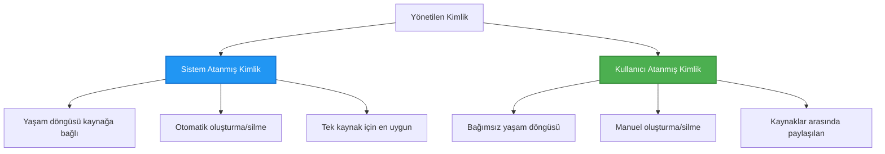

# Authentication Patterns and Managed Identity

⏱️ **Estimated Time**: 45-60 minutes | 💰 **Cost Impact**: Free (no additional charges) | ⭐ **Complexity**: Intermediate

**📚 Learning Path:**
- ← Previous: [Configuration Management](configuration.md) - Yönetim ortam değişkenleri ve sırlar
- 🎯 **You Are Here**: Kimlik Doğrulama & Güvenlik (Yönetilen Kimlik, Key Vault, güvenli desenler)
- → Next: [First Project](first-project.md) - İlk AZD uygulamanızı oluşturun
- 🏠 [Course Home](../../README.md)

---

## What You'll Learn

Bu dersi tamamlayarak şunları öğreneceksiniz:
- Azure kimlik doğrulama desenlerini anlayın (anahtarlar, bağlantı dizeleri, yönetilen kimlik)
- Parolasız kimlik doğrulama için **Yönetilen Kimlik** uygulayın
- **Azure Key Vault** entegrasyonu ile sırları güvenceye alın
- AZD dağıtımları için **rol tabanlı erişim denetimi (RBAC)** yapılandırın
- Container Apps ve Azure hizmetlerinde güvenlik en iyi uygulamalarını uygulayın
- Anahtar tabanlı kimlik doğrulamadan kimlik tabanlı kimlik doğrulamaya geçiş yapın

## Why Managed Identity Matters

### The Problem: Traditional Authentication

**Before Managed Identity:**
```javascript
// ❌ GÜVENLİK RİSKİ: Koda gömülü gizli bilgiler
const connectionString = "Server=mydb.database.windows.net;User=admin;Password=P@ssw0rd123";
const storageKey = "xK7mN9pQ2wR5tY8uI0oP3aS6dF1gH4jK...";
const cosmosKey = "C2x7B9n4M1p8Q5w3E6r0T2y5U8i1O4p7...";
```

**Problems:**
- 🔴 **Kodda, yapılandırma dosyalarında, ortam değişkenlerinde açığa çıkan sırlar**
- 🔴 **Kimlik bilgisi döndürümleri** kod değişiklikleri ve yeniden dağıtım gerektirir
- 🔴 **Denetim kabusu** - kim, neye, ne zaman erişti?
- 🔴 **Yayılma** - sırlar birden çok sistemde dağınık
- 🔴 **Uyumluluk riskleri** - güvenlik denetimlerinde başarısız olur

### The Solution: Managed Identity

**After Managed Identity:**
```javascript
// ✅ GÜVENLİ: Kod içinde gizli bilgi yok
const credential = new DefaultAzureCredential();
const client = new BlobServiceClient(
  "https://mystorageaccount.blob.core.windows.net",
  credential  // Azure kimlik doğrulamayı otomatik olarak yönetir
);
```

**Benefits:**
- ✅ **Kodda veya yapılandırmada sıfır sır**
- ✅ **Otomatik döndürme** - Azure bunu yönetir
- ✅ **Tam denetim izi** Microsoft Entra ID günlüklerinde
- ✅ **Merkezi güvenlik** - Azure Portal'da yönetin
- ✅ **Uyumluluğa hazır** - güvenlik standartlarını karşılar

**Analogy**: Geleneksel kimlik doğrulama, farklı kapılar için birden çok fiziksel anahtar taşımaya benzer. Yönetilen Kimlik, kim olduğunuza göre otomatik olarak erişim veren bir güvenlik kartına benzer — kaybolacak, kopyalanacak veya döndürülecek anahtar yok.

---

## Architecture Overview

### Authentication Flow with Managed Identity


### Types of Managed Identities



| Feature | System-Assigned | User-Assigned |
|---------|----------------|---------------|
| **Lifecycle** | Kaynağa bağlı | Bağımsız |
| **Creation** | Kaynakla birlikte otomatik | Elle oluşturma |
| **Deletion** | Kaynakla birlikte silinir | Kaynak silindikten sonra kalıcı |
| **Sharing** | Sadece bir kaynak | Birden fazla kaynaktan paylaşılabilir |
| **Use Case** | Basit senaryolar | Karmaşık çok-kaynaklı senaryolar |
| **AZD Default** | ✅ Önerilir | İsteğe bağlı |

---

## Prerequisites

### Required Tools

Önceki derslerden bunları zaten kurmuş olmalısınız:

```bash
# Azure Developer CLI'yi doğrulayın
azd version
# ✅ Beklenen: azd sürüm 1.0.0 veya daha yüksek

# Azure CLI'yi doğrulayın
az --version
# ✅ Beklenen: azure-cli 2.50.0 veya daha yüksek
```

### Azure Requirements

- Aktif bir Azure aboneliği
- İzinler:
  - Yönetilen kimlikler oluşturmak
  - RBAC rolleri atamak
  - Key Vault kaynakları oluşturmak
  - Container Apps dağıtmak

### Knowledge Prerequisites

Aşağıları tamamlamış olmalısınız:
- [Installation Guide](installation.md) - AZD kurulumu
- [AZD Basics](azd-basics.md) - Temel kavramlar
- [Configuration Management](configuration.md) - Ortam değişkenleri

---

## Lesson 1: Understanding Authentication Patterns

### Pattern 1: Connection Strings (Legacy - Avoid)

**How it works:**
```bash
# Bağlantı dizesi kimlik bilgileri içeriyor
STORAGE_CONNECTION_STRING="DefaultEndpointsProtocol=https;AccountName=myaccount;AccountKey=xK7mN9pQ2wR5..."
COSMOS_CONNECTION_STRING="AccountEndpoint=https://myaccount.documents.azure.com:443/;AccountKey=C2x7..."
SQL_CONNECTION_STRING="Server=myserver.database.windows.net;User=admin;Password=P@ssw0rd..."
```

**Problems:**
- ❌ Ortam değişkenlerinde görünen sırlar
- ❌ Dağıtım sistemlerinde kayıt altına alınmış olabilir
- ❌ Döndürmesi zor
- ❌ Erişim denetim izi yok

**When to use:** Sadece yerel geliştirme için, üretimde asla.

---

### Pattern 2: Key Vault References (Better)

**How it works:**
```bicep
// Store secret in Key Vault
resource keyVault 'Microsoft.KeyVault/vaults@2023-02-01' = {
  name: 'mykv'
  properties: {
    enableRbacAuthorization: true
  }
}

// Reference in Container App
env: [
  {
    name: 'STORAGE_KEY'
    secretRef: 'storage-key'  // References Key Vault
  }
]
```

**Benefits:**
- ✅ Sırlar güvenli şekilde Key Vault'ta depolanır
- ✅ Merkezi sır yönetimi
- ✅ Kod değişikliği olmadan döndürme

**Limitations:**
- ⚠️ Hâlâ anahtar/parola kullanımı var
- ⚠️ Key Vault erişimini yönetmeniz gerekiyor

**When to use:** Bağlantı dizelerinden yönetilen kimliğe geçiş adımı.

---

### Pattern 3: Managed Identity (Best Practice)

**How it works:**
```bicep
// Enable managed identity
resource containerApp 'Microsoft.App/containerApps@2023-05-01' = {
  name: 'myapp'
  identity: {
    type: 'SystemAssigned'  // Automatically creates identity
  }
}

// Grant permissions
resource roleAssignment 'Microsoft.Authorization/roleAssignments@2022-04-01' = {
  scope: storageAccount
  properties: {
    roleDefinitionId: storageBlobDataContributorRole
    principalId: containerApp.identity.principalId
  }
}
```

**Application code:**
```javascript
// Gizli bilgiye ihtiyaç yok!
const { DefaultAzureCredential } = require('@azure/identity');
const { BlobServiceClient } = require('@azure/storage-blob');

const credential = new DefaultAzureCredential();
const blobServiceClient = new BlobServiceClient(
  'https://mystorageaccount.blob.core.windows.net',
  credential
);
```

**Benefits:**
- ✅ Kod/yapılandırmada sıfır sır
- ✅ Otomatik kimlik bilgisi döndürme
- ✅ Tam denetim izi
- ✅ RBAC tabanlı izinler
- ✅ Uyumluluğa hazır

**When to use:** Üretim uygulamaları için her zaman.

---

### Pattern 4: Service Principals (CI/CD & Automation)

Yönetilen kimlik, Azure içinde çalışan kaynaklar için altın standarttır. Peki ya Azure dışında çalışanlar — bir build ajanındaki CI/CD boru hattı veya etkileşimli oturum kullanamayan dizüstü bilgisayarınızda çalışan bir betik? İşte burada bir **service principal** devreye girer: otomatik bir işlemin oturum açabileceği kendi kimlik bilgilerine sahip insan olmayan bir kimlik.

**How it works:**

Bir resource group ile sınırlı (en az ayrıcalık) bir service principal oluşturun:

```bash
az ad sp create-for-rbac \
  --name "myapp-cicd" \
  --role contributor \
  --scopes /subscriptions/<sub-id>/resourceGroups/<rg-name>
```

Bu bir client ID, client secret ve tenant ID yazdırır. azd bunlarla etkileşimsiz oturum açabilir:

```bash
azd auth login \
  --client-id "<appId>" \
  --client-secret "<password>" \
  --tenant-id "<tenant>"
```

**Uzun ömürlü client secret yerine federated credentials (OIDC) tercih edin.** Uzun ömürlü bir client secret yerine bir federated credential yapılandırarak boru hattının kısa ömürlü bir token takas etmesini sağlayın — sızabilecek veya döndürülecek gizli bir değer yok:

```bash
azd auth login \
  --client-id "<appId>" \
  --federated-credential-provider "github" \
  --tenant-id "<tenant>"
```

> `azd pipeline config` bunu sizin için otomatik olarak ayarlar. [Bölüm 8](../chapter-08-production/production-ai-practices.md) içindeki CI/CD uygulamalarına bakın.

**Benefits:**
- ✅ Azure dışında da çalışır (build ajanları, yerel sunucular, diğer bulutlar)
- ✅ Tek bir resource group ile sınırlandırılabilir
- ✅ Federated (OIDC) çeşidi saklanan bir sır kullanmaz

**Trade-offs:**
- ⚠️ Sır tabanlı varyant dikkatli saklama ve döndürme gerektirir
- ⚠️ Sızan bir sır, SP'nin yapabileceği her şeyi verir — kapsamları dar tutun

**When to use:** Yönetilen kimlik kullanamayan CI/CD boru hatları ve otomasyon. Her zaman client secret yerine **federated/OIDC** varyantını tercih edin ve iş yükü Azure içinde çalışıyorsa yönetilen kimliği tercih edin.

**Storing credentials safely:**
- Asla sırları commit etmeyin — boru hattınızın gizli deposunu kullanın (GitHub Actions secrets, Azure DevOps variable groups / Key Vault).
- SP'yi ihtiyaç duyduğu en küçük rol ve resource group ile sınırlandırın.
- Bir son kullanma tarihi belirleyin ve döndürün ya da OIDC ile sırrı tamamen ortadan kaldırın.

---

## Lesson 2: Implementing Managed Identity with AZD

### Step-by-Step Implementation

Gelin Azure Storage ve Key Vault'a erişmek için yönetilen kimlik kullanan güvenli bir Container App oluşturalım.

### Project Structure

```
secure-app/
├── azure.yaml                 # AZD configuration
├── infra/
│   ├── main.bicep            # Main infrastructure
│   ├── core/
│   │   ├── identity.bicep    # Managed identity setup
│   │   ├── keyvault.bicep    # Key Vault configuration
│   │   └── storage.bicep     # Storage with RBAC
│   └── app/
│       └── container-app.bicep
└── src/
    ├── app.js                # Application code
    ├── package.json
    └── Dockerfile
```

### 1. Configure AZD (azure.yaml)

```yaml
name: secure-app
metadata:
  template: secure-app@1.0.0

services:
  api:
    project: ./src
    language: js
    host: containerapp

# Enable managed identity (AZD handles this automatically)
```

### 2. Infrastructure: Enable Managed Identity

**File: `infra/main.bicep`**

```bicep
targetScope = 'subscription'

param environmentName string
param location string = 'eastus'

var tags = { 'azd-env-name': environmentName }

// Resource group
resource rg 'Microsoft.Resources/resourceGroups@2021-04-01' = {
  name: 'rg-${environmentName}'
  location: location
  tags: tags
}

// Storage Account
module storage './core/storage.bicep' = {
  name: 'storage'
  scope: rg
  params: {
    name: 'st${uniqueString(rg.id)}'
    location: location
    tags: tags
  }
}

// Key Vault
module keyVault './core/keyvault.bicep' = {
  name: 'keyvault'
  scope: rg
  params: {
    name: 'kv-${uniqueString(rg.id)}'
    location: location
    tags: tags
  }
}

// Container App with Managed Identity
module containerApp './app/container-app.bicep' = {
  name: 'container-app'
  scope: rg
  params: {
    name: 'ca-${environmentName}'
    location: location
    tags: tags
    storageAccountName: storage.outputs.name
    keyVaultName: keyVault.outputs.name
  }
}

// Grant Container App access to Storage
module storageRoleAssignment './core/role-assignment.bicep' = {
  name: 'storage-role'
  scope: rg
  params: {
    principalId: containerApp.outputs.identityPrincipalId
    roleDefinitionId: 'ba92f5b4-2d11-453d-a403-e96b0029c9fe'  // Storage Blob Data Contributor
    targetResourceId: storage.outputs.id
  }
}

// Grant Container App access to Key Vault
module kvRoleAssignment './core/role-assignment.bicep' = {
  name: 'kv-role'
  scope: rg
  params: {
    principalId: containerApp.outputs.identityPrincipalId
    roleDefinitionId: '4633458b-17de-408a-b874-0445c86b69e6'  // Key Vault Secrets User
    targetResourceId: keyVault.outputs.id
  }
}

// Outputs
output AZURE_STORAGE_ACCOUNT_NAME string = storage.outputs.name
output AZURE_KEY_VAULT_NAME string = keyVault.outputs.name
output APP_URL string = containerApp.outputs.url
```

### 3. Container App with System-Assigned Identity

**File: `infra/app/container-app.bicep`**

```bicep
param name string
param location string
param tags object = {}
param storageAccountName string
param keyVaultName string

resource containerApp 'Microsoft.App/containerApps@2023-05-01' = {
  name: name
  location: location
  tags: tags
  identity: {
    type: 'SystemAssigned'  // 🔑 Enable managed identity
  }
  properties: {
    configuration: {
      ingress: {
        external: true
        targetPort: 3000
      }
    }
    template: {
      containers: [
        {
          name: 'api'
          image: 'myregistry.azurecr.io/api:latest'
          resources: {
            cpu: json('0.5')
            memory: '1Gi'
          }
          env: [
            {
              name: 'AZURE_STORAGE_ACCOUNT_NAME'
              value: storageAccountName
            }
            {
              name: 'AZURE_KEY_VAULT_NAME'
              value: keyVaultName
            }
            // 🔑 No secrets - managed identity handles authentication!
          ]
        }
      ]
    }
  }
}

// Output the identity for RBAC assignments
output identityPrincipalId string = containerApp.identity.principalId
output id string = containerApp.id
output url string = 'https://${containerApp.properties.configuration.ingress.fqdn}'
```

### 4. RBAC Role Assignment Module

**File: `infra/core/role-assignment.bicep`**

```bicep
param principalId string
param roleDefinitionId string  // Azure built-in role ID
param targetResourceId string

resource roleAssignment 'Microsoft.Authorization/roleAssignments@2022-04-01' = {
  name: guid(principalId, roleDefinitionId, targetResourceId)
  scope: resourceId('Microsoft.Resources/resourceGroups', resourceGroup().name)
  properties: {
    roleDefinitionId: subscriptionResourceId('Microsoft.Authorization/roleDefinitions', roleDefinitionId)
    principalId: principalId
    principalType: 'ServicePrincipal'
  }
}

output id string = roleAssignment.id
```

### 5. Application Code with Managed Identity

**File: `src/app.js`**

```javascript
const express = require('express');
const { DefaultAzureCredential } = require('@azure/identity');
const { BlobServiceClient } = require('@azure/storage-blob');
const { SecretClient } = require('@azure/keyvault-secrets');

const app = express();
const PORT = process.env.PORT || 3000;

// 🔑 Kimlik bilgilerini başlat (yönetilen kimlikle otomatik olarak çalışır)
const credential = new DefaultAzureCredential();

// Azure Depolama kurulumu
const storageAccountName = process.env.AZURE_STORAGE_ACCOUNT_NAME;
const blobServiceClient = new BlobServiceClient(
  `https://${storageAccountName}.blob.core.windows.net`,
  credential  // Anahtar gerekmez!
);

// Key Vault kurulumu
const keyVaultName = process.env.AZURE_KEY_VAULT_NAME;
const secretClient = new SecretClient(
  `https://${keyVaultName}.vault.azure.net`,
  credential  // Anahtar gerekmez!
);

// Sağlık denetimi
app.get('/health', (req, res) => {
  res.json({ status: 'healthy', authentication: 'managed-identity' });
});

// Dosyayı blob depolamaya yükle
app.post('/upload', async (req, res) => {
  try {
    const containerClient = blobServiceClient.getContainerClient('uploads');
    await containerClient.createIfNotExists();
    
    const blobName = `file-${Date.now()}.txt`;
    const blockBlobClient = containerClient.getBlockBlobClient(blobName);
    
    await blockBlobClient.upload('Hello from managed identity!', 30);
    
    res.json({
      success: true,
      blobName: blobName,
      message: 'File uploaded using managed identity!'
    });
  } catch (error) {
    console.error('Upload error:', error);
    res.status(500).json({ error: error.message });
  }
});

// Key Vault'tan gizli değeri al
app.get('/secret/:name', async (req, res) => {
  try {
    const secretName = req.params.name;
    const secret = await secretClient.getSecret(secretName);
    
    res.json({
      name: secretName,
      value: secret.value,
      message: 'Secret retrieved using managed identity!'
    });
  } catch (error) {
    console.error('Secret error:', error);
    res.status(500).json({ error: error.message });
  }
});

// Blob konteynerlerini listele (okuma erişimini gösterir)
app.get('/containers', async (req, res) => {
  try {
    const containers = [];
    for await (const container of blobServiceClient.listContainers()) {
      containers.push(container.name);
    }
    
    res.json({
      containers: containers,
      count: containers.length,
      message: 'Containers listed using managed identity!'
    });
  } catch (error) {
    console.error('List error:', error);
    res.status(500).json({ error: error.message });
  }
});

app.listen(PORT, () => {
  console.log(`Secure API listening on port ${PORT}`);
  console.log('Authentication: Managed Identity (passwordless)');
});
```

**File: `src/package.json`**

```json
{
  "name": "secure-app",
  "version": "1.0.0",
  "dependencies": {
    "express": "^4.18.2",
    "@azure/identity": "^4.0.0",
    "@azure/storage-blob": "^12.17.0",
    "@azure/keyvault-secrets": "^4.7.0"
  },
  "scripts": {
    "start": "node app.js"
  }
}
```

### 6. Deploy and Test

```bash
# AZD ortamını başlat
azd init

# Altyapıyı ve uygulamayı dağıt
azd up

# Uygulamanın URL'sini al
APP_URL=$(azd env get-values | grep APP_URL | cut -d '=' -f2 | tr -d '"')

# Sağlık kontrolünü test et
curl $APP_URL/health
```

**✅ Expected output:**
```json
{
  "status": "healthy",
  "authentication": "managed-identity"
}
```

**Test blob upload:**
```bash
curl -X POST $APP_URL/upload
```

**✅ Expected output:**
```json
{
  "success": true,
  "blobName": "file-1700404800000.txt",
  "message": "File uploaded using managed identity!"
}
```

**Test container listing:**
```bash
curl $APP_URL/containers
```

**✅ Expected output:**
```json
{
  "containers": ["uploads"],
  "count": 1,
  "message": "Containers listed using managed identity!"
}
```

---

## Common Azure RBAC Roles

### Built-in Role IDs for Managed Identity

| Service | Role Name | Role ID | Permissions |
|---------|-----------|---------|-------------|
| **Storage** | Storage Blob Data Reader | `2a2b9908-6b94-4a3d-8e5a-a7d8f8cc8a12` | Blob'ları ve konteynerleri okuma |
| **Storage** | Storage Blob Data Contributor | `ba92f5b4-2d11-453d-a403-e96b0029c9fe` | Blob'ları okuma, yazma, silme |
| **Storage** | Storage Queue Data Contributor | `974c5e8b-45b9-4653-ba55-5f855dd0fb88` | Kuyruk mesajlarını okuma, yazma, silme |
| **Key Vault** | Key Vault Secrets User | `4633458b-17de-408a-b874-0445c86b69e6` | Sırları okuma |
| **Key Vault** | Key Vault Secrets Officer | `b86a8fe4-44ce-4948-aee5-eccb2c155cd7` | Sırları okuma, yazma, silme |
| **Cosmos DB** | Cosmos DB Built-in Data Reader | `00000000-0000-0000-0000-000000000001` | Cosmos DB verilerini okuma |
| **Cosmos DB** | Cosmos DB Built-in Data Contributor | `00000000-0000-0000-0000-000000000002` | Cosmos DB verilerini okuma, yazma |
| **SQL Database** | SQL DB Contributor | `9b7fa17d-e63e-47b0-bb0a-15c516ac86ec` | SQL veritabanlarını yönetme |
| **Service Bus** | Azure Service Bus Data Owner | `090c5cfd-751d-490a-894a-3ce6f1109419` | Mesaj gönderme, alma, yönetme |

### How to Find Role IDs

```bash
# Tüm yerleşik rolleri listele
az role definition list --query "[].{Name:roleName, ID:name}" --output table

# Belirli bir rolü ara
az role definition list --query "[?contains(roleName, 'Storage Blob')].{Name:roleName, ID:name}" --output table

# Rolün ayrıntılarını al
az role definition list --name "Storage Blob Data Contributor"
```

---

## Practical Exercises

### Exercise 1: Enable Managed Identity for Existing App ⭐⭐ (Medium)

**Goal**: Varolan bir Container App dağıtımına yönetilen kimlik ekleyin

**Scenario**: Bağlantı dizeleri kullanan bir Container App'iniz var. Bunu yönetilen kimliğe dönüştürün.

**Starting Point**: Bu yapılandırmaya sahip Container App:

```bicep
// ❌ Current: Using connection string
env: [
  {
    name: 'STORAGE_CONNECTION_STRING'
    secretRef: 'storage-connection'
  }
]
```

**Steps**:

1. **Enable managed identity in Bicep:**

```bicep
resource containerApp 'Microsoft.App/containerApps@2023-05-01' = {
  name: 'myapp'
  identity: {
    type: 'SystemAssigned'  // Add this
  }
  // ... rest of configuration
}
```

2. **Grant Storage access:**

```bicep
// Get storage account reference
resource storageAccount 'Microsoft.Storage/storageAccounts@2023-01-01' existing = {
  name: storageAccountName
}

// Assign role
resource roleAssignment 'Microsoft.Authorization/roleAssignments@2022-04-01' = {
  name: guid(containerApp.id, 'ba92f5b4-2d11-453d-a403-e96b0029c9fe', storageAccount.id)
  scope: storageAccount
  properties: {
    roleDefinitionId: subscriptionResourceId('Microsoft.Authorization/roleDefinitions', 'ba92f5b4-2d11-453d-a403-e96b0029c9fe')
    principalId: containerApp.identity.principalId
    principalType: 'ServicePrincipal'
  }
}
```

3. **Update application code:**

**Before (connection string):**
```javascript
const { BlobServiceClient } = require('@azure/storage-blob');

const blobServiceClient = BlobServiceClient.fromConnectionString(
  process.env.STORAGE_CONNECTION_STRING
);
```

**After (managed identity):**
```javascript
const { DefaultAzureCredential } = require('@azure/identity');
const { BlobServiceClient } = require('@azure/storage-blob');

const credential = new DefaultAzureCredential();
const blobServiceClient = new BlobServiceClient(
  `https://${process.env.STORAGE_ACCOUNT_NAME}.blob.core.windows.net`,
  credential
);
```

4. **Update environment variables:**

```bicep
env: [
  {
    name: 'STORAGE_ACCOUNT_NAME'
    value: storageAccountName  // Just the name, no secrets!
  }
  // Remove STORAGE_CONNECTION_STRING
]
```

5. **Deploy and test:**

```bash
# Yeniden dağıt
azd up

# Hâlâ çalıştığını test et
curl https://myapp.azurecontainerapps.io/upload
```

**✅ Success Criteria:**
- ✅ Uygulama hatasız dağıtılır
- ✅ Depolama işlemleri çalışır (yükleme, listeleme, indirme)
- ✅ Ortam değişkenlerinde bağlantı dizeleri yok
- ✅ Azure Portal'da "Identity" panelinde kimlik görünür

**Verification:**

```bash
# Yönetilen kimliğin etkinleştirildiğini kontrol edin
az containerapp show \
  --name myapp \
  --resource-group rg-myapp \
  --query "identity.type"
# ✅ Beklenen: "SystemAssigned"

# Rol atamasını kontrol edin
az role assignment list \
  --assignee $(az containerapp show --name myapp --resource-group rg-myapp --query "identity.principalId" -o tsv) \
  --scope /subscriptions/{sub-id}/resourceGroups/rg-myapp/providers/Microsoft.Storage/storageAccounts/mystorageaccount
# ✅ Beklenen: "Storage Blob Data Contributor" rolünü gösterir
```

**Time**: 20-30 minutes

---

### Exercise 2: Multi-Service Access with User-Assigned Identity ⭐⭐⭐ (Advanced)

**Goal**: Birden fazla Container App arasında paylaşılan user-assigned identity oluşturun

**Scenario**: Aynı Storage hesabına ve Key Vault'a erişmesi gereken 3 mikro servisiniz var.

**Steps**:

1. **Create user-assigned identity:**

**File: `infra/core/identity.bicep`**

```bicep
param name string
param location string
param tags object = {}

resource userAssignedIdentity 'Microsoft.ManagedIdentity/userAssignedIdentities@2023-01-31' = {
  name: name
  location: location
  tags: tags
}

output id string = userAssignedIdentity.id
output principalId string = userAssignedIdentity.properties.principalId
output clientId string = userAssignedIdentity.properties.clientId
```

2. **Assign roles to user-assigned identity:**

```bicep
// In main.bicep
module userIdentity './core/identity.bicep' = {
  name: 'user-identity'
  scope: rg
  params: {
    name: 'id-${environmentName}'
    location: location
    tags: tags
  }
}

// Grant Storage access
resource storageRoleAssignment 'Microsoft.Authorization/roleAssignments@2022-04-01' = {
  name: guid(userIdentity.outputs.principalId, 'storage-contributor')
  scope: storageAccount
  properties: {
    roleDefinitionId: subscriptionResourceId('Microsoft.Authorization/roleDefinitions', 'ba92f5b4-2d11-453d-a403-e96b0029c9fe')
    principalId: userIdentity.outputs.principalId
    principalType: 'ServicePrincipal'
  }
}

// Grant Key Vault access
resource kvRoleAssignment 'Microsoft.Authorization/roleAssignments@2022-04-01' = {
  name: guid(userIdentity.outputs.principalId, 'kv-secrets-user')
  scope: keyVault
  properties: {
    roleDefinitionId: subscriptionResourceId('Microsoft.Authorization/roleDefinitions', '4633458b-17de-408a-b874-0445c86b69e6')
    principalId: userIdentity.outputs.principalId
    principalType: 'ServicePrincipal'
  }
}
```

3. **Assign identity to multiple Container Apps:**

```bicep
resource apiGateway 'Microsoft.App/containerApps@2023-05-01' = {
  name: 'api-gateway'
  identity: {
    type: 'UserAssigned'
    userAssignedIdentities: {
      '${userIdentity.outputs.id}': {}
    }
  }
  // ... rest of config
}

resource productService 'Microsoft.App/containerApps@2023-05-01' = {
  name: 'product-service'
  identity: {
    type: 'UserAssigned'
    userAssignedIdentities: {
      '${userIdentity.outputs.id}': {}
    }
  }
  // ... rest of config
}

resource orderService 'Microsoft.App/containerApps@2023-05-01' = {
  name: 'order-service'
  identity: {
    type: 'UserAssigned'
    userAssignedIdentities: {
      '${userIdentity.outputs.id}': {}
    }
  }
  // ... rest of config
}
```

4. **Application code (all services use same pattern):**

```javascript
const { DefaultAzureCredential, ManagedIdentityCredential } = require('@azure/identity');

// Kullanıcı tarafından atanan kimlik için istemci kimliğini belirtin
const credential = new ManagedIdentityCredential(
  process.env.AZURE_CLIENT_ID  // Kullanıcı tarafından atanan kimlik istemci kimliği
);

// Veya DefaultAzureCredential'i kullanın (otomatik olarak algılar)
const credential = new DefaultAzureCredential();

const blobServiceClient = new BlobServiceClient(
  `https://${process.env.STORAGE_ACCOUNT_NAME}.blob.core.windows.net`,
  credential
);
```

5. **Deploy and verify:**

```bash
azd up

# Tüm hizmetlerin depolamaya erişebildiğini test et
curl https://api-gateway.azurecontainerapps.io/upload
curl https://product-service.azurecontainerapps.io/upload
curl https://order-service.azurecontainerapps.io/upload
```

**✅ Success Criteria:**
- ✅ 3 hizmet arasında paylaşılan tek bir kimlik
- ✅ Tüm hizmetler Storage ve Key Vault'a erişebilir
- ✅ Bir hizmeti silerseniz kimlik kalıcı olur
- ✅ Merkezi izin yönetimi

**Benefits of User-Assigned Identity:**
- Yönetilecek tek bir kimlik
- Hizmetler arasında tutarlı izinler
- Hizmet silme durumunda kimlik kalır
- Karmaşık mimariler için daha uygun

**Time**: 30-40 minutes

---

### Exercise 3: Implement Key Vault Secret Rotation ⭐⭐⭐ (Advanced)

**Goal**: Üçüncü taraf API anahtarlarını Key Vault'ta depolayın ve yönetilen kimlik ile erişin

**Scenario**: Uygulamanız OpenAI, Stripe, SendGrid gibi harici bir API'yi çağırmak için API anahtarları gerektiriyor.

**Steps**:

1. **Create Key Vault with RBAC:**

**File: `infra/core/keyvault.bicep`**

```bicep
param name string
param location string
param tags object = {}

resource keyVault 'Microsoft.KeyVault/vaults@2023-02-01' = {
  name: name
  location: location
  tags: tags
  properties: {
    enableRbacAuthorization: true  // Use RBAC instead of access policies
    sku: {
      family: 'A'
      name: 'standard'
    }
    tenantId: subscription().tenantId
    enableSoftDelete: true
    softDeleteRetentionInDays: 90
  }
}

// Allow Container App to read secrets
output id string = keyVault.id
output name string = keyVault.name
output uri string = keyVault.properties.vaultUri
```

2. **Store secrets in Key Vault:**

```bash
# Key Vault adını al
KV_NAME=$(azd env get-values | grep AZURE_KEY_VAULT_NAME | cut -d '=' -f2 | tr -d '"')

# Üçüncü taraf API anahtarlarını depola
az keyvault secret set \
  --vault-name $KV_NAME \
  --name "OpenAI-ApiKey" \
  --value "sk-proj-xxxxxxxxxxxxx"

az keyvault secret set \
  --vault-name $KV_NAME \
  --name "Stripe-ApiKey" \
  --value "sk_live_xxxxxxxxxxxxx"

az keyvault secret set \
  --vault-name $KV_NAME \
  --name "SendGrid-ApiKey" \
  --value "SG.xxxxxxxxxxxxx"
```

3. **Application code to retrieve secrets:**

**File: `src/config.js`**

```javascript
const { DefaultAzureCredential } = require('@azure/identity');
const { SecretClient } = require('@azure/keyvault-secrets');

class Config {
  constructor() {
    this.credential = new DefaultAzureCredential();
    this.secretClient = new SecretClient(
      `https://${process.env.AZURE_KEY_VAULT_NAME}.vault.azure.net`,
      this.credential
    );
    this.cache = {};
  }

  async getSecret(secretName) {
    // Önce önbelleği kontrol et
    if (this.cache[secretName]) {
      return this.cache[secretName];
    }

    try {
      const secret = await this.secretClient.getSecret(secretName);
      this.cache[secretName] = secret.value;
      console.log(`✅ Retrieved secret: ${secretName}`);
      return secret.value;
    } catch (error) {
      console.error(`❌ Failed to get secret ${secretName}:`, error.message);
      throw error;
    }
  }

  async getOpenAIKey() {
    return this.getSecret('OpenAI-ApiKey');
  }

  async getStripeKey() {
    return this.getSecret('Stripe-ApiKey');
  }

  async getSendGridKey() {
    return this.getSecret('SendGrid-ApiKey');
  }
}

module.exports = new Config();
```

4. **Use secrets in application:**

**File: `src/app.js`**

```javascript
const express = require('express');
const config = require('./config');
const { OpenAI } = require('openai');

const app = express();

// Key Vault'tan alınan anahtarla OpenAI'yi başlat
let openaiClient;

async function initializeServices() {
  const openaiKey = await config.getOpenAIKey();
  openaiClient = new OpenAI({ apiKey: openaiKey });
  console.log('✅ Services initialized with secrets from Key Vault');
}

// Başlangıçta çağırın
initializeServices().catch(console.error);

app.post('/chat', async (req, res) => {
  try {
    const completion = await openaiClient.chat.completions.create({
      model: 'gpt-4.1',
      messages: [{ role: 'user', content: 'Hello!' }]
    });
    
    res.json({
      response: completion.choices[0].message.content,
      authentication: 'Key from Key Vault via Managed Identity'
    });
  } catch (error) {
    res.status(500).json({ error: error.message });
  }
});

app.listen(3000, () => {
  console.log('Secure API with Key Vault integration running');
});
```

5. **Deploy and test:**

```bash
azd up

# API anahtarlarının çalıştığını test et
curl -X POST https://myapp.azurecontainerapps.io/chat \
  -H "Content-Type: application/json" \
  -d '{"message":"Hello AI"}'
```

**✅ Success Criteria:**
- ✅ Kodda veya ortam değişkenlerinde API anahtarları yok
- ✅ Uygulama anahtarları Key Vault'tan alıyor
- ✅ Üçüncü taraf API'ler düzgün çalışıyor
- ✅ Kod değişikliği olmadan anahtarları döndürebilme

**Bir sır (secret) döndürün:**

```bash
# Key Vault'taki gizli değeri güncelle
az keyvault secret set \
  --vault-name $KV_NAME \
  --name "OpenAI-ApiKey" \
  --value "sk-proj-NEW_KEY_HERE"

# Yeni anahtarı almak için uygulamayı yeniden başlat
az containerapp revision restart \
  --name myapp \
  --resource-group rg-myapp
```

**Süre**: 25-35 dakika

---

## Bilgi Kontrol Noktası

### 1. Kimlik Doğrulama Desenleri ✓

Anladığınızı test edin:

- [ ] **S1**: Üç ana kimlik doğrulama deseni nelerdir? 
  - **C**: Connection strings (eski), Key Vault referansları (geçiş), Yönetilen Kimlik (en iyi)

- [ ] **S2**: Yönetilen kimlik neden connection string'lerinden daha iyidir?
  - **C**: Kodda sır yok, otomatik döndürme, tam denetim kaydı, RBAC izinleri

- [ ] **S3**: Sistem atanmış yerine kullanıcı atanmış kimlik ne zaman kullanılır?
  - **C**: Birden çok kaynak arasında kimlik paylaşılırken veya kimlik yaşam döngüsü kaynaktan bağımsız olduğunda

**Uygulamalı Doğrulama:**
```bash
# Uygulamanızın hangi tür kimlik kullandığını kontrol edin
az containerapp show \
  --name myapp \
  --resource-group rg-myapp \
  --query "identity.type"

# Kimlik için tüm rol atamalarını listeleyin
az role assignment list \
  --assignee $(az containerapp show --name myapp --resource-group rg-myapp --query "identity.principalId" -o tsv)
```

---

### 2. RBAC ve İzinler ✓

Anladığınızı test edin:

- [ ] **S1**: "Storage Blob Data Contributor" rolünün rol ID'si nedir?
  - **C**: `ba92f5b4-2d11-453d-a403-e96b0029c9fe`

- [ ] **S2**: "Key Vault Secrets User" hangi izinleri sağlar?
  - **C**: Sırlara salt okunur erişim (oluşturma, güncelleme veya silme yapamaz)

- [ ] **S3**: Bir Container App'e Azure SQL erişimi nasıl verilir?
  - **C**: "SQL DB Contributor" rolünü atayarak veya SQL için Microsoft Entra ID kimlik doğrulamasını yapılandırarak

**Uygulamalı Doğrulama:**
```bash
# Belirli bir rolü bulun
az role definition list --name "Storage Blob Data Contributor"

# Kimliğinize atanan rolleri kontrol edin
PRINCIPAL_ID=$(az containerapp show --name myapp --resource-group rg-myapp --query "identity.principalId" -o tsv)
az role assignment list --assignee $PRINCIPAL_ID --output table
```

---

### 3. Key Vault Entegrasyonu ✓

Anladığınızı test edin:

- [ ] **S1**: Erişim politikaları yerine Key Vault için RBAC nasıl etkinleştirilir?
  - **C**: Bicep'te `enableRbacAuthorization: true` ayarlayarak

- [ ] **S2**: Yönetilen kimlik kimlik doğrulamasını hangi Azure SDK kütüphanesi ele alır?
  - **C**: `@azure/identity` içindeki `DefaultAzureCredential` sınıfı

- [ ] **S3**: Key Vault sırları önbellekte ne kadar süre kalır?
  - **C**: Uygulamaya bağlıdır; kendi önbellekleme stratejinizi uygulayın

**Uygulamalı Doğrulama:**
```bash
# Key Vault erişimini test et
az keyvault secret show \
  --vault-name $KV_NAME \
  --name "OpenAI-ApiKey" \
  --query "value"

# RBAC'in etkin olup olmadığını kontrol et
az keyvault show \
  --name $KV_NAME \
  --query "properties.enableRbacAuthorization"
# ✅ Beklenen: true
```

---

## Güvenlik En İyi Uygulamaları

### ✅ YAPIN:

1. **Üretimde her zaman yönetilen kimlik kullanın**
   ```bicep
   identity: {
     type: 'SystemAssigned'
   }
   ```

2. **En düşük ayrıcalıkla RBAC rolleri kullanın**
   - Mümkün olduğunda "Reader" rolleri kullanın
   - Gerekmedikçe "Owner" veya "Contributor" kullanmaktan kaçının

3. **Üçüncü taraf anahtarlarını Key Vault'ta saklayın**
   ```javascript
   const apiKey = await secretClient.getSecret('ThirdPartyApiKey');
   ```

4. **Denetim günlüklemeyi etkinleştirin**
   ```bicep
   diagnosticSettings: {
     logs: [{ category: 'AuditEvent', enabled: true }]
   }
   ```

5. **Geliştirme/test/üretim için farklı kimlikler kullanın**
   ```bash
   azd env new dev
   azd env new staging
   azd env new prod
   ```

6. **Sırları düzenli olarak döndürün**
   - Key Vault sırlarına son kullanma tarihleri koyun
   - Azure Functions ile döndürmeyi otomatikleştirin

### ❌ YAPMAYIN:

1. **Sırları asla sert kodlamayın**
   ```javascript
   // ❌ KÖTÜ
   const apiKey = "sk-proj-xxxxxxxxxxxxx";
   ```

2. **Üretimde bağlantı dizgilerini kullanmayın**
   ```javascript
   // ❌ KÖTÜ
   BlobServiceClient.fromConnectionString(process.env.STORAGE_CONNECTION_STRING)
   ```

3. **Aşırı yetki vermeyin**
   ```bicep
   // ❌ BAD - too much access
   roleDefinitionId: 'Owner'
   
   // ✅ GOOD - least privilege
   roleDefinitionId: 'Storage Blob Data Reader'
   ```

4. **Sırları loglamayın**
   ```javascript
   // ❌ KÖTÜ
   console.log('API Key:', apiKey);
   
   // ✅ İYİ
   console.log('API Key retrieved successfully');
   ```

5. **Üretim kimliklerini ortamlar arasında paylaşmayın**
   ```bicep
   // ❌ BAD - same identity for dev and prod
   // ✅ GOOD - separate identities per environment
   ```

---

## Sorun Giderme Rehberi

### Sorun: Azure Storage'a erişirken "Unauthorized"

**Belirtiler:**
```
Error: Unauthorized (403)
AuthorizationPermissionMismatch: This request is not authorized to perform this operation
```

**Teşhis:**

```bash
# Yönetilen kimliğin etkin olup olmadığını kontrol edin
az containerapp show \
  --name myapp \
  --resource-group rg-myapp \
  --query "identity.type"
# ✅ Beklenen: "SystemAssigned" veya "UserAssigned"

# Rol atamalarını kontrol edin
PRINCIPAL_ID=$(az containerapp show --name myapp --resource-group rg-myapp --query "identity.principalId" -o tsv)
az role assignment list --assignee $PRINCIPAL_ID

# Beklenen: "Storage Blob Data Contributor" veya benzer bir rol görmelisiniz
```

**Çözümler:**

1. **Doğru RBAC rolünü verin:**
```bash
STORAGE_ID=$(az storage account show --name mystorageaccount --resource-group rg-myapp --query "id" -o tsv)
az role assignment create \
  --assignee $PRINCIPAL_ID \
  --role "Storage Blob Data Contributor" \
  --scope $STORAGE_ID
```

2. **Yayılmayı bekleyin (5-10 dakika sürebilir):**
```bash
# Rol atama durumunu kontrol et
az role assignment list --assignee $PRINCIPAL_ID --scope $STORAGE_ID
```

3. **Uygulama kodunun doğru kimlik bilgilerini kullandığını doğrulayın:**
```javascript
// DefaultAzureCredential kullandığınızdan emin olun
const credential = new DefaultAzureCredential();
```

---

### Sorun: Key Vault erişimi reddedildi

**Belirtiler:**
```
Error: Forbidden (403)
The user, group or application does not have secrets get permission
```

**Teşhis:**

```bash
# Key Vault RBAC'in etkin olduğunu kontrol edin
az keyvault show \
  --name $KV_NAME \
  --query "properties.enableRbacAuthorization"
# ✅ Beklenen: doğru

# Rol atamalarını kontrol edin
az role assignment list \
  --assignee $PRINCIPAL_ID \
  --scope /subscriptions/{sub-id}/resourceGroups/rg-myapp/providers/Microsoft.KeyVault/vaults/$KV_NAME
```

**Çözümler:**

1. **Key Vault'ta RBAC'ı etkinleştirin:**
```bash
az keyvault update \
  --name $KV_NAME \
  --enable-rbac-authorization true
```

2. **Key Vault Secrets User rolünü verin:**
```bash
KV_ID=$(az keyvault show --name $KV_NAME --query "id" -o tsv)
az role assignment create \
  --assignee $PRINCIPAL_ID \
  --role "Key Vault Secrets User" \
  --scope $KV_ID
```

---

### Sorun: DefaultAzureCredential yerelde başarısız oluyor

**Belirtiler:**
```
Error: DefaultAzureCredential failed to retrieve a token
CredentialUnavailableError: No credential available
```

**Teşhis:**

```bash
# Giriş yapıp yapmadığınızı kontrol edin
az account show

# Azure CLI kimlik doğrulamasını kontrol edin
az ad signed-in-user show
```

**Çözümler:**

1. **Azure CLI ile giriş yapın:**
```bash
az login
```

2. **Azure aboneliğini ayarlayın:**
```bash
az account set --subscription "Your Subscription Name"
```

3. **Yerel geliştirme için ortam değişkenlerini kullanın:**
```bash
export AZURE_TENANT_ID="your-tenant-id"
export AZURE_CLIENT_ID="your-client-id"
export AZURE_CLIENT_SECRET="your-client-secret"
```

4. **Veya yerelde farklı bir kimlik bilgisi kullanın:**
```javascript
const { DefaultAzureCredential, AzureCliCredential } = require('@azure/identity');

// Yerel geliştirme için AzureCliCredential kullanın
const credential = process.env.NODE_ENV === 'production' 
  ? new DefaultAzureCredential()
  : new AzureCliCredential();
```

---

### Sorun: Rol ataması yayılması çok uzun sürüyor

**Belirtiler:**
- Rol başarıyla atandı
- Hâlâ 403 hataları alınıyor
- Aralıklı erişim (bazen çalışıyor, bazen çalışmıyor)

**Açıklama:**
Azure RBAC değişiklikleri küresel olarak yayılmak için 5-10 dakika alabilir.

**Çözüm:**

```bash
# Bekleyin ve yeniden deneyin
echo "Waiting for RBAC propagation..."
sleep 300  # 5 dakika bekleyin

# Erişimi test edin
curl https://myapp.azurecontainerapps.io/upload

# Hâlâ başarısız olursa, uygulamayı yeniden başlatın
az containerapp revision restart \
  --name myapp \
  --resource-group rg-myapp
```

---

## Maliyet Değerlendirmeleri

### Yönetilen Kimlik Maliyetleri

| Resource | Cost |
|----------|------|
| **Managed Identity** | 🆓 **ÜCRETSİZ** - Ücret yok |
| **RBAC Role Assignments** | 🆓 **ÜCRETSİZ** - Ücret yok |
| **Microsoft Entra ID Token Requests** | 🆓 **ÜCRETSİZ** - Dahil |
| **Key Vault Operations** | $0.03 per 10,000 operations |
| **Key Vault Storage** | $0.024 per secret per month |

**Yönetilen kimlik paradan tasarruf sağlar:**
- ✅ Hizmetler arası kimlik doğrulama için Key Vault işlemlerini ortadan kaldırarak
- ✅ Güvenlik olaylarını azaltarak (sızdırılmış kimlik bilgisi olmaz)
- ✅ Operasyonel yükü azaltarak (manuel döndürme yok)

**Örnek Maliyet Karşılaştırması (aylık):**

| Scenario | Connection Strings | Managed Identity | Savings |
|----------|-------------------|-----------------|---------|
| Small app (1M requests) | ~$50 (Key Vault + ops) | ~$0 | $50/month |
| Medium app (10M requests) | ~$200 | ~$0 | $200/month |
| Large app (100M requests) | ~$1,500 | ~$0 | $1,500/month |

---

## Daha Fazla Bilgi

### Resmi Dokümantasyon
- [Azure Managed Identity](https://learn.microsoft.com/entra/identity/managed-identities-azure-resources/overview)
- [Azure RBAC](https://learn.microsoft.com/azure/role-based-access-control/overview)
- [Azure Key Vault](https://learn.microsoft.com/azure/key-vault/general/overview)
- [DefaultAzureCredential](https://learn.microsoft.com/dotnet/api/azure.identity.defaultazurecredential)

### SDK Dokümantasyonu
- [@azure/identity (Node.js)](https://www.npmjs.com/package/@azure/identity)
- [Azure.Identity (C#)](https://www.nuget.org/packages/Azure.Identity/)
- [azure-identity (Python)](https://pypi.org/project/azure-identity/)

### Bu Kurstaki Sonraki Adımlar
- ← Önceki: [Configuration Management](configuration.md)
- → Sonraki: [First Project](first-project.md)
- 🏠 [Course Home](../../README.md)

### İlgili Örnekler
- [Microsoft Foundry Models Chat Example](../../../../examples/azure-openai-chat) - Microsoft Foundry Models için yönetilen kimlik kullanır
- [Microservices Example](../../../../examples/microservices) - Çoklu servis kimlik doğrulama desenleri

---

## Özet

**Şunları öğrendiniz:**
- ✅ Üç kimlik doğrulama deseni (connection strings, Key Vault, yönetilen kimlik)
- ✅ AZD'de yönetilen kimliği etkinleştirme ve yapılandırma
- ✅ Azure hizmetleri için RBAC rol atamaları
- ✅ Üçüncü taraf sırları için Key Vault entegrasyonu
- ✅ Kullanıcı atanmış vs sistem atanmış kimlikler
- ✅ Güvenlik en iyi uygulamaları ve sorun giderme

**Önemli Noktalar:**
1. **Üretimde her zaman yönetilen kimlik kullanın** - Sıfır sır, otomatik döndürme
2. **En düşük ayrıcalıkla RBAC rolleri kullanın** - Yalnızca gerekli izinleri verin
3. **Üçüncü taraf anahtarlarını Key Vault'ta saklayın** - Merkezi sır yönetimi
4. **Her ortam için ayrı kimlikler kullanın** - Geliştirme, test, üretim izolasyonu
5. **Denetim günlüklemesini etkinleştirin** - Kimin neye eriştiğini izleyin

**Sonraki Adımlar:**
1. Yukarıdaki pratik egzersizleri tamamlayın
2. Mevcut bir uygulamayı connection string'lerden yönetilen kimliğe taşıyın
3. Güvenlik ile ilk günden itibaren bir AZD projesi oluşturun: [First Project](first-project.md)

---

<!-- CO-OP TRANSLATOR DISCLAIMER START -->
**Feragatname**:
Bu belge, AI çeviri hizmeti [Co-op Translator](https://github.com/Azure/co-op-translator) kullanılarak çevrilmiştir. Doğruluk için çaba sarf etsek de, otomatik çevirilerin hata veya yanlışlık içerebileceğini lütfen unutmayınız. Orijinal belge, kendi dilinde yetkili kaynak olarak kabul edilmelidir. Kritik bilgiler için profesyonel insan çevirisi önerilir. Bu çevirinin kullanımı sonucu ortaya çıkabilecek yanlış anlamalardan veya yanlış yorumlamalardan sorumlu değiliz.
<!-- CO-OP TRANSLATOR DISCLAIMER END -->