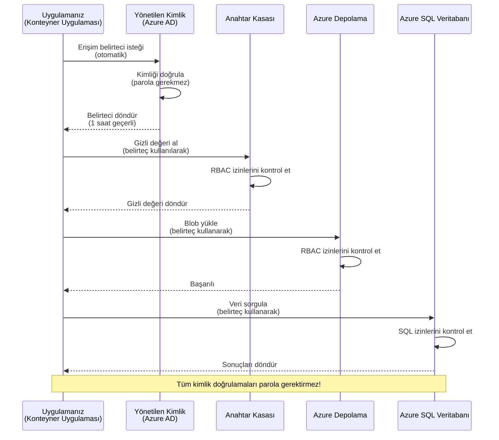
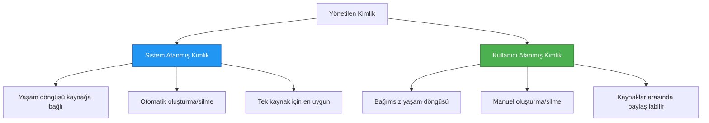

# Authentication Patterns and Managed Identity

⏱️ **Estimated Time**: 45-60 minutes | 💰 **Cost Impact**: Free (no additional charges) | ⭐ **Complexity**: Intermediate

**📚 Learning Path:**
- ← Previous: [Yapılandırma Yönetimi](configuration.md) - Ortam değişkenlerini ve gizli bilgileri yönetme
- 🎯 **You Are Here**: Kimlik Doğrulama ve Güvenlik (Managed Identity, Key Vault, güvenli desenler)
- → Next: [First Project](first-project.md) - İlk AZD uygulamanızı oluşturma
- 🏠 [Course Home](../../README.md)

---

## Bu Derste Öğrenecekleriniz

By completing this lesson, you will:
- Understand Azure authentication patterns (keys, connection strings, managed identity)
- Implement **Managed Identity** for passwordless authentication
- Secure secrets with **Azure Key Vault** integration
- Configure **role-based access control (RBAC)** for AZD deployments
- Apply security best practices in Container Apps and Azure services
- Migrate from key-based to identity-based authentication

## Managed Identity Neden Önemlidir

### Sorun: Geleneksel Kimlik Doğrulama

**Managed Identity'den Önce:**
```javascript
// ❌ GÜVENLİK RİSKİ: Koda gömülü gizli bilgiler
const connectionString = "Server=mydb.database.windows.net;User=admin;Password=P@ssw0rd123";
const storageKey = "xK7mN9pQ2wR5tY8uI0oP3aS6dF1gH4jK...";
const cosmosKey = "C2x7B9n4M1p8Q5w3E6r0T2y5U8i1O4p7...";
```

**Sorunlar:**
- 🔴 **Koda, yapılandırma dosyalarına veya ortam değişkenlerine açığa çıkmış gizli bilgiler**
- 🔴 **Kimlik bilgisi döndürme** kod değişiklikleri ve yeniden dağıtım gerektirir
- 🔴 **Denetim kabusu** - kim neye, ne zaman erişti?
- 🔴 **Yayılma** - gizli bilgiler birden fazla sistemde dağınık
- 🔴 **Uygunluk riskleri** - güvenlik denetimlerini geçememe

### Çözüm: Managed Identity

**Managed Identity'den Sonra:**
```javascript
// ✅ GÜVENLİ: Kodda gizli bilgi yok
const credential = new DefaultAzureCredential();
const client = new BlobServiceClient(
  "https://mystorageaccount.blob.core.windows.net",
  credential  // Azure kimlik doğrulamayı otomatik olarak halleder
);
```

**Faydalar:**
- ✅ **Koda veya yapılandırmaya sıfır gizli bilgi**
- ✅ **Otomatik döndürme** - Azure bunu yönetir
- ✅ **Azure AD günlüklerinde tam denetim izi**
- ✅ **Merkezileştirilmiş güvenlik** - Azure Portal'dan yönetim
- ✅ **Uygunluk hazır** - güvenlik standartlarını karşılar

**Benzetme**: Geleneksel kimlik doğrulama, farklı kapılar için birden çok fiziksel anahtar taşımaya benzer. Managed Identity ise kimliğinize göre otomatik olarak erişim veren bir güvenlik kartı gibidir—kaybolacak, kopyalanacak veya döndürülecek anahtar yoktur.

---

## Mimari Genel Bakış

### Managed Identity ile Kimlik Doğrulama Akışı


### Managed Identity Türleri


| Feature | System-Assigned | User-Assigned |
|---------|----------------|---------------|
| **Özellik** | **Sistem Atamalı** | **Kullanıcı Atamalı** |
| **Yaşam Döngüsü** | Kaynağa bağlı | Bağımsız |
| **Oluşturma** | Kaynak ile otomatik | Elle oluşturma |
| **Silinme** | Kaynakla silinir | Kaynak silindikten sonra da kalır |
| **Paylaşım** | Sadece bir kaynak | Birden çok kaynak |
| **Kullanım Durumu** | Basit senaryolar | Karmaşık çok-kaynaklı senaryolar |
| **AZD Varsayılanı** | ✅ Önerilir | Opsiyonel |

---

## Gereksinimler

### Gerekli Araçlar

Önceki derslerden bu araçların zaten yüklü olması gerekir:

```bash
# Azure Developer CLI'yi doğrulayın
azd version
# ✅ Beklenen: azd version 1.0.0 veya daha yüksek

# Azure CLI'yi doğrulayın
az --version
# ✅ Beklenen: azure-cli 2.50.0 veya daha yüksek
```

### Azure Gereksinimleri

- Aktif Azure aboneliği
- İzinler:
  - Managed identity oluşturma
  - RBAC rolleri atama
  - Key Vault kaynakları oluşturma
  - Container Apps dağıtma

### Bilgi Önkoşulları

Tamamlamış olmalısınız:
- [Kurulum Rehberi](installation.md) - AZD kurulumu
- [AZD Temelleri](azd-basics.md) - Temel kavramlar
- [Yapılandırma Yönetimi](configuration.md) - Ortam değişkenleri

---

## Ders 1: Kimlik Doğrulama Desenlerini Anlama

### Desen 1: Bağlantı Dizeleri (Eski - Kaçının)

**Nasıl çalışır:**
```bash
# Bağlantı dizesi kimlik bilgileri içerir
STORAGE_CONNECTION_STRING="DefaultEndpointsProtocol=https;AccountName=myaccount;AccountKey=xK7mN9pQ2wR5..."
COSMOS_CONNECTION_STRING="AccountEndpoint=https://myaccount.documents.azure.com:443/;AccountKey=C2x7..."
SQL_CONNECTION_STRING="Server=myserver.database.windows.net;User=admin;Password=P@ssw0rd..."
```

**Sorunlar:**
- ❌ Gizli bilgiler ortam değişkenlerinde görünür
- ❌ Dağıtım sistemlerinde günlüklenir
- ❌ Döndürmesi zordur
- ❌ Erişim denetim izi yok

**Ne zaman kullanılmalı:** Sadece yerel geliştirme için, üretimde asla.

---

### Desen 2: Key Vault Referansları (Daha İyi)

**Nasıl çalışır:**
```bicep
// Store secret in Key Vault
resource keyVault 'Microsoft.KeyVault/vaults@2023-02-01' = {
  name: 'mykv'
  properties: {
    enableRbacAuthorization: true
  }
}

// Reference in Container App
env: [
  {
    name: 'STORAGE_KEY'
    secretRef: 'storage-key'  // References Key Vault
  }
]
```

**Faydalar:**
- ✅ Gizli bilgiler güvenli şekilde Key Vault'ta saklanır
- ✅ Gizli bilgilerin merkezi yönetimi
- ✅ Kod değişikliği olmadan döndürme

**Sınırlamalar:**
- ⚠️ Hâlâ anahtar/parola kullanımı söz konusu
- ⚠️ Key Vault erişimini yönetmeniz gerekir

**Ne zaman kullanılmalı:** Bağlantı dizelerinden managed identity'ye geçiş adımı olarak.

---

### Desen 3: Managed Identity (En İyi Uygulama)

**Nasıl çalışır:**
```bicep
// Enable managed identity
resource containerApp 'Microsoft.App/containerApps@2023-05-01' = {
  name: 'myapp'
  identity: {
    type: 'SystemAssigned'  // Automatically creates identity
  }
}

// Grant permissions
resource roleAssignment 'Microsoft.Authorization/roleAssignments@2022-04-01' = {
  scope: storageAccount
  properties: {
    roleDefinitionId: storageBlobDataContributorRole
    principalId: containerApp.identity.principalId
  }
}
```

**Uygulama kodu:**
```javascript
// Gizli bilgiye gerek yok!
const { DefaultAzureCredential } = require('@azure/identity');
const { BlobServiceClient } = require('@azure/storage-blob');

const credential = new DefaultAzureCredential();
const blobServiceClient = new BlobServiceClient(
  'https://mystorageaccount.blob.core.windows.net',
  credential
);
```

**Faydalar:**
- ✅ Koda/yapılandırmaya sıfır gizli bilgi
- ✅ Otomatik kimlik bilgisi döndürme
- ✅ Tam denetim izi
- ✅ RBAC tabanlı izinler
- ✅ Uygunluk hazır

**Ne zaman kullanılmalı:** Her zaman, üretim uygulamaları için.

---

## Ders 2: AZD ile Managed Identity Uygulama

### Adım Adım Uygulama

Managed identity kullanan güvenli bir Container App oluşturalım.

### Proje Yapısı

```
secure-app/
├── azure.yaml                 # AZD configuration
├── infra/
│   ├── main.bicep            # Main infrastructure
│   ├── core/
│   │   ├── identity.bicep    # Managed identity setup
│   │   ├── keyvault.bicep    # Key Vault configuration
│   │   └── storage.bicep     # Storage with RBAC
│   └── app/
│       └── container-app.bicep
└── src/
    ├── app.js                # Application code
    ├── package.json
    └── Dockerfile
```

### 1. AZD'yi yapılandırma (azure.yaml)

```yaml
name: secure-app
metadata:
  template: secure-app@1.0.0

services:
  api:
    project: ./src
    language: js
    host: containerapp

# Enable managed identity (AZD handles this automatically)
```

### 2. Altyapı: Managed Identity'yi Etkinleştirme

**Dosya: `infra/main.bicep`**

```bicep
targetScope = 'subscription'

param environmentName string
param location string = 'eastus'

var tags = { 'azd-env-name': environmentName }

// Resource group
resource rg 'Microsoft.Resources/resourceGroups@2021-04-01' = {
  name: 'rg-${environmentName}'
  location: location
  tags: tags
}

// Storage Account
module storage './core/storage.bicep' = {
  name: 'storage'
  scope: rg
  params: {
    name: 'st${uniqueString(rg.id)}'
    location: location
    tags: tags
  }
}

// Key Vault
module keyVault './core/keyvault.bicep' = {
  name: 'keyvault'
  scope: rg
  params: {
    name: 'kv-${uniqueString(rg.id)}'
    location: location
    tags: tags
  }
}

// Container App with Managed Identity
module containerApp './app/container-app.bicep' = {
  name: 'container-app'
  scope: rg
  params: {
    name: 'ca-${environmentName}'
    location: location
    tags: tags
    storageAccountName: storage.outputs.name
    keyVaultName: keyVault.outputs.name
  }
}

// Grant Container App access to Storage
module storageRoleAssignment './core/role-assignment.bicep' = {
  name: 'storage-role'
  scope: rg
  params: {
    principalId: containerApp.outputs.identityPrincipalId
    roleDefinitionId: 'ba92f5b4-2d11-453d-a403-e96b0029c9fe'  // Storage Blob Data Contributor
    targetResourceId: storage.outputs.id
  }
}

// Grant Container App access to Key Vault
module kvRoleAssignment './core/role-assignment.bicep' = {
  name: 'kv-role'
  scope: rg
  params: {
    principalId: containerApp.outputs.identityPrincipalId
    roleDefinitionId: '4633458b-17de-408a-b874-0445c86b69e6'  // Key Vault Secrets User
    targetResourceId: keyVault.outputs.id
  }
}

// Outputs
output AZURE_STORAGE_ACCOUNT_NAME string = storage.outputs.name
output AZURE_KEY_VAULT_NAME string = keyVault.outputs.name
output APP_URL string = containerApp.outputs.url
```

### 3. Sistem Atamalı Kimlikle Container App

**Dosya: `infra/app/container-app.bicep`**

```bicep
param name string
param location string
param tags object = {}
param storageAccountName string
param keyVaultName string

resource containerApp 'Microsoft.App/containerApps@2023-05-01' = {
  name: name
  location: location
  tags: tags
  identity: {
    type: 'SystemAssigned'  // 🔑 Enable managed identity
  }
  properties: {
    configuration: {
      ingress: {
        external: true
        targetPort: 3000
      }
    }
    template: {
      containers: [
        {
          name: 'api'
          image: 'myregistry.azurecr.io/api:latest'
          resources: {
            cpu: json('0.5')
            memory: '1Gi'
          }
          env: [
            {
              name: 'AZURE_STORAGE_ACCOUNT_NAME'
              value: storageAccountName
            }
            {
              name: 'AZURE_KEY_VAULT_NAME'
              value: keyVaultName
            }
            // 🔑 No secrets - managed identity handles authentication!
          ]
        }
      ]
    }
  }
}

// Output the identity for RBAC assignments
output identityPrincipalId string = containerApp.identity.principalId
output id string = containerApp.id
output url string = 'https://${containerApp.properties.configuration.ingress.fqdn}'
```

### 4. RBAC Rol Atama Modülü

**Dosya: `infra/core/role-assignment.bicep`**

```bicep
param principalId string
param roleDefinitionId string  // Azure built-in role ID
param targetResourceId string

resource roleAssignment 'Microsoft.Authorization/roleAssignments@2022-04-01' = {
  name: guid(principalId, roleDefinitionId, targetResourceId)
  scope: resourceId('Microsoft.Resources/resourceGroups', resourceGroup().name)
  properties: {
    roleDefinitionId: subscriptionResourceId('Microsoft.Authorization/roleDefinitions', roleDefinitionId)
    principalId: principalId
    principalType: 'ServicePrincipal'
  }
}

output id string = roleAssignment.id
```

### 5. Managed Identity ile Uygulama Kodu

**Dosya: `src/app.js`**

```javascript
const express = require('express');
const { DefaultAzureCredential } = require('@azure/identity');
const { BlobServiceClient } = require('@azure/storage-blob');
const { SecretClient } = require('@azure/keyvault-secrets');

const app = express();
const PORT = process.env.PORT || 3000;

// 🔑 Kimlik bilgilerini başlat (yönetilen kimlik ile otomatik çalışır)
const credential = new DefaultAzureCredential();

// Azure Depolama kurulumu
const storageAccountName = process.env.AZURE_STORAGE_ACCOUNT_NAME;
const blobServiceClient = new BlobServiceClient(
  `https://${storageAccountName}.blob.core.windows.net`,
  credential  // Anahtar gerekmez!
);

// Key Vault kurulumu
const keyVaultName = process.env.AZURE_KEY_VAULT_NAME;
const secretClient = new SecretClient(
  `https://${keyVaultName}.vault.azure.net`,
  credential  // Anahtar gerekmez!
);

// Sağlık kontrolü
app.get('/health', (req, res) => {
  res.json({ status: 'healthy', authentication: 'managed-identity' });
});

// Dosyayı blob depolamaya yükle
app.post('/upload', async (req, res) => {
  try {
    const containerClient = blobServiceClient.getContainerClient('uploads');
    await containerClient.createIfNotExists();
    
    const blobName = `file-${Date.now()}.txt`;
    const blockBlobClient = containerClient.getBlockBlobClient(blobName);
    
    await blockBlobClient.upload('Hello from managed identity!', 30);
    
    res.json({
      success: true,
      blobName: blobName,
      message: 'File uploaded using managed identity!'
    });
  } catch (error) {
    console.error('Upload error:', error);
    res.status(500).json({ error: error.message });
  }
});

// Key Vault'tan gizli değeri al
app.get('/secret/:name', async (req, res) => {
  try {
    const secretName = req.params.name;
    const secret = await secretClient.getSecret(secretName);
    
    res.json({
      name: secretName,
      value: secret.value,
      message: 'Secret retrieved using managed identity!'
    });
  } catch (error) {
    console.error('Secret error:', error);
    res.status(500).json({ error: error.message });
  }
});

// Blob konteynerlerini listele (okuma erişimini gösterir)
app.get('/containers', async (req, res) => {
  try {
    const containers = [];
    for await (const container of blobServiceClient.listContainers()) {
      containers.push(container.name);
    }
    
    res.json({
      containers: containers,
      count: containers.length,
      message: 'Containers listed using managed identity!'
    });
  } catch (error) {
    console.error('List error:', error);
    res.status(500).json({ error: error.message });
  }
});

app.listen(PORT, () => {
  console.log(`Secure API listening on port ${PORT}`);
  console.log('Authentication: Managed Identity (passwordless)');
});
```

**Dosya: `src/package.json`**

```json
{
  "name": "secure-app",
  "version": "1.0.0",
  "dependencies": {
    "express": "^4.18.2",
    "@azure/identity": "^4.0.0",
    "@azure/storage-blob": "^12.17.0",
    "@azure/keyvault-secrets": "^4.7.0"
  },
  "scripts": {
    "start": "node app.js"
  }
}
```

### 6. Dağıtım ve Test

```bash
# AZD ortamını başlat
azd init

# Altyapıyı ve uygulamayı dağıt
azd up

# Uygulamanın URL'sini al
APP_URL=$(azd env get-values | grep APP_URL | cut -d '=' -f2 | tr -d '"')

# Sağlık kontrolünü test et
curl $APP_URL/health
```

**✅ Beklenen çıktı:**
```json
{
  "status": "healthy",
  "authentication": "managed-identity"
}
```

**Blob yükleme testi:**
```bash
curl -X POST $APP_URL/upload
```

**✅ Beklenen çıktı:**
```json
{
  "success": true,
  "blobName": "file-1700404800000.txt",
  "message": "File uploaded using managed identity!"
}
```

**Konteyner listeleme testi:**
```bash
curl $APP_URL/containers
```

**✅ Beklenen çıktı:**
```json
{
  "containers": ["uploads"],
  "count": 1,
  "message": "Containers listed using managed identity!"
}
```

---

## Yaygın Azure RBAC Rolleri

### Managed Identity için Yerleşik Rol Kimlikleri

| Service | Role Name | Role ID | Permissions |
|---------|-----------|---------|-------------|
| **Storage** | Storage Blob Data Reader | `2a2b9908-6b94-4a3d-8e5a-a7d8f8cc8a12` | Blob ve konteynerleri okuma |
| **Storage** | Storage Blob Data Contributor | `ba92f5b4-2d11-453d-a403-e96b0029c9fe` | Blob'ları okuma, yazma, silme |
| **Storage** | Storage Queue Data Contributor | `974c5e8b-45b9-4653-ba55-5f855dd0fb88` | Kuyruk mesajlarını okuma, yazma, silme |
| **Key Vault** | Key Vault Secrets User | `4633458b-17de-408a-b874-0445c86b69e6` | Sırları okuma |
| **Key Vault** | Key Vault Secrets Officer | `b86a8fe4-44ce-4948-aee5-eccb2c155cd7` | Sırları okuma, yazma, silme |
| **Cosmos DB** | Cosmos DB Built-in Data Reader | `00000000-0000-0000-0000-000000000001` | Cosmos DB verilerini okuma |
| **Cosmos DB** | Cosmos DB Built-in Data Contributor | `00000000-0000-0000-0000-000000000002` | Cosmos DB verilerini okuma, yazma |
| **SQL Database** | SQL DB Contributor | `9b7fa17d-e63e-47b0-bb0a-15c516ac86ec` | SQL veritabanlarını yönetme |
| **Service Bus** | Azure Service Bus Data Owner | `090c5cfd-751d-490a-894a-3ce6f1109419` | Mesaj gönderme, alma, yönetme |

### Rol Kimlikleri Nasıl Bulunur

```bash
# Tüm yerleşik rolleri listele
az role definition list --query "[].{Name:roleName, ID:name}" --output table

# Belirli rolü ara
az role definition list --query "[?contains(roleName, 'Storage Blob')].{Name:roleName, ID:name}" --output table

# Rol ayrıntılarını al
az role definition list --name "Storage Blob Data Contributor"
```

---

## Uygulamalı Alıştırmalar

### Alıştırma 1: Var Olan Uygulamaya Managed Identity Etkinleştirme ⭐⭐ (Orta)

**Hedef**: Var olan bir Container App dağıtımına managed identity ekleyin

**Senaryo**: Bağlantı dizeleri kullanan bir Container App'iniz var. Bunu managed identity'ye dönüştürün.

**Başlangıç Noktası**: Bu yapılandırmaya sahip Container App:

```bicep
// ❌ Current: Using connection string
env: [
  {
    name: 'STORAGE_CONNECTION_STRING'
    secretRef: 'storage-connection'
  }
]
```

**Adımlar**:

1. **Bicep'te managed identity'yi etkinleştirin:**

```bicep
resource containerApp 'Microsoft.App/containerApps@2023-05-01' = {
  name: 'myapp'
  identity: {
    type: 'SystemAssigned'  // Add this
  }
  // ... rest of configuration
}
```

2. **Storage erişimi verin:**

```bicep
// Get storage account reference
resource storageAccount 'Microsoft.Storage/storageAccounts@2023-01-01' existing = {
  name: storageAccountName
}

// Assign role
resource roleAssignment 'Microsoft.Authorization/roleAssignments@2022-04-01' = {
  name: guid(containerApp.id, 'ba92f5b4-2d11-453d-a403-e96b0029c9fe', storageAccount.id)
  scope: storageAccount
  properties: {
    roleDefinitionId: subscriptionResourceId('Microsoft.Authorization/roleDefinitions', 'ba92f5b4-2d11-453d-a403-e96b0029c9fe')
    principalId: containerApp.identity.principalId
    principalType: 'ServicePrincipal'
  }
}
```

3. **Uygulama kodunu güncelleyin:**

**Önce (bağlantı dizesi):**
```javascript
const { BlobServiceClient } = require('@azure/storage-blob');

const blobServiceClient = BlobServiceClient.fromConnectionString(
  process.env.STORAGE_CONNECTION_STRING
);
```

**Sonra (managed identity):**
```javascript
const { DefaultAzureCredential } = require('@azure/identity');
const { BlobServiceClient } = require('@azure/storage-blob');

const credential = new DefaultAzureCredential();
const blobServiceClient = new BlobServiceClient(
  `https://${process.env.STORAGE_ACCOUNT_NAME}.blob.core.windows.net`,
  credential
);
```

4. **Ortam değişkenlerini güncelleyin:**

```bicep
env: [
  {
    name: 'STORAGE_ACCOUNT_NAME'
    value: storageAccountName  // Just the name, no secrets!
  }
  // Remove STORAGE_CONNECTION_STRING
]
```

5. **Dağıtım ve test:**

```bash
# Yeniden konuşlandır
azd up

# Hâlâ çalıştığını test et
curl https://myapp.azurecontainerapps.io/upload
```

**✅ Başarı Kriterleri:**
- ✅ Uygulama hatasız dağıtılır
- ✅ Storage işlemleri çalışır (yükleme, listeleme, indirme)
- ✅ Ortam değişkenlerinde bağlantı dizeleri yok
- ✅ Identity Azure Portal'da "Identity" bölümünde görünür

**Doğrulama:**

```bash
# Yönetilen kimliğin etkin olduğundan emin olun
az containerapp show \
  --name myapp \
  --resource-group rg-myapp \
  --query "identity.type"
# ✅ Beklenen: "SystemAssigned"

# Rol atamasını kontrol edin
az role assignment list \
  --assignee $(az containerapp show --name myapp --resource-group rg-myapp --query "identity.principalId" -o tsv) \
  --scope /subscriptions/{sub-id}/resourceGroups/rg-myapp/providers/Microsoft.Storage/storageAccounts/mystorageaccount
# ✅ Beklenen: "Storage Blob Data Contributor" rolünü gösterir
```

**Süre**: 20-30 dakika

---

### Alıştırma 2: Çoklu Hizmet Erişimi için Kullanıcı Atamalı Kimlik ⭐⭐⭐ (İleri)

**Hedef**: Birden çok Container App arasında paylaşılan kullanıcı atamalı bir kimlik oluşturun

**Senaryo**: Aynı Storage hesabına ve Key Vault'a erişmesi gereken 3 mikroservisiniz var.

**Adımlar**:

1. **Kullanıcı atamalı kimlik oluşturun:**

**Dosya: `infra/core/identity.bicep`**

```bicep
param name string
param location string
param tags object = {}

resource userAssignedIdentity 'Microsoft.ManagedIdentity/userAssignedIdentities@2023-01-31' = {
  name: name
  location: location
  tags: tags
}

output id string = userAssignedIdentity.id
output principalId string = userAssignedIdentity.properties.principalId
output clientId string = userAssignedIdentity.properties.clientId
```

2. **Kullanıcı atamalı kimliğe roller atayın:**

```bicep
// In main.bicep
module userIdentity './core/identity.bicep' = {
  name: 'user-identity'
  scope: rg
  params: {
    name: 'id-${environmentName}'
    location: location
    tags: tags
  }
}

// Grant Storage access
resource storageRoleAssignment 'Microsoft.Authorization/roleAssignments@2022-04-01' = {
  name: guid(userIdentity.outputs.principalId, 'storage-contributor')
  scope: storageAccount
  properties: {
    roleDefinitionId: subscriptionResourceId('Microsoft.Authorization/roleDefinitions', 'ba92f5b4-2d11-453d-a403-e96b0029c9fe')
    principalId: userIdentity.outputs.principalId
    principalType: 'ServicePrincipal'
  }
}

// Grant Key Vault access
resource kvRoleAssignment 'Microsoft.Authorization/roleAssignments@2022-04-01' = {
  name: guid(userIdentity.outputs.principalId, 'kv-secrets-user')
  scope: keyVault
  properties: {
    roleDefinitionId: subscriptionResourceId('Microsoft.Authorization/roleDefinitions', '4633458b-17de-408a-b874-0445c86b69e6')
    principalId: userIdentity.outputs.principalId
    principalType: 'ServicePrincipal'
  }
}
```

3. **Kimliği birden çok Container App'e atayın:**

```bicep
resource apiGateway 'Microsoft.App/containerApps@2023-05-01' = {
  name: 'api-gateway'
  identity: {
    type: 'UserAssigned'
    userAssignedIdentities: {
      '${userIdentity.outputs.id}': {}
    }
  }
  // ... rest of config
}

resource productService 'Microsoft.App/containerApps@2023-05-01' = {
  name: 'product-service'
  identity: {
    type: 'UserAssigned'
    userAssignedIdentities: {
      '${userIdentity.outputs.id}': {}
    }
  }
  // ... rest of config
}

resource orderService 'Microsoft.App/containerApps@2023-05-01' = {
  name: 'order-service'
  identity: {
    type: 'UserAssigned'
    userAssignedIdentities: {
      '${userIdentity.outputs.id}': {}
    }
  }
  // ... rest of config
}
```

4. **Uygulama kodu (tüm servisler aynı deseni kullanır):**

```javascript
const { DefaultAzureCredential, ManagedIdentityCredential } = require('@azure/identity');

// Kullanıcı tarafından atanan kimlik için istemci kimliğini belirtin
const credential = new ManagedIdentityCredential(
  process.env.AZURE_CLIENT_ID  // Kullanıcı tarafından atanan kimlik istemci kimliği
);

// Veya DefaultAzureCredential kullanın (otomatik algılar)
const credential = new DefaultAzureCredential();

const blobServiceClient = new BlobServiceClient(
  `https://${process.env.STORAGE_ACCOUNT_NAME}.blob.core.windows.net`,
  credential
);
```

5. **Dağıtın ve doğrulayın:**

```bash
azd up

# Tüm hizmetlerin depolamaya erişebildiğini test et
curl https://api-gateway.azurecontainerapps.io/upload
curl https://product-service.azurecontainerapps.io/upload
curl https://order-service.azurecontainerapps.io/upload
```

**✅ Başarı Kriterleri:**
- ✅ 3 servis arasında paylaşılan tek bir kimlik
- ✅ Tüm servisler Storage ve Key Vault'a erişebiliyor
- ✅ Bir servisi silseniz bile kimlik kalıcı
- ✅ İzin yönetimi merkezi

**Kullanıcı Atamalı Kimliğin Faydaları:**
- Yönetilecek tek kimlik
- Servisler arasında tutarlı izinler
- Servis silinmesine karşı kalıcı
- Karmaşık mimariler için daha uygun

**Süre**: 30-40 dakika

---

### Alıştırma 3: Key Vault Gizli Bilgi Döndürme Uygulama ⭐⭐⭐ (İleri)

**Hedef**: Üçüncü taraf API anahtarlarını Key Vault'ta saklayın ve managed identity kullanarak bunlara erişin

**Senaryo**: Uygulamanız OpenAI, Stripe, SendGrid gibi dış bir API'yi çağırmak için API anahtarlarına ihtiyaç duyuyor.

**Adımlar**:

1. **RBAC ile Key Vault oluşturun:**

**Dosya: `infra/core/keyvault.bicep`**

```bicep
param name string
param location string
param tags object = {}

resource keyVault 'Microsoft.KeyVault/vaults@2023-02-01' = {
  name: name
  location: location
  tags: tags
  properties: {
    enableRbacAuthorization: true  // Use RBAC instead of access policies
    sku: {
      family: 'A'
      name: 'standard'
    }
    tenantId: subscription().tenantId
    enableSoftDelete: true
    softDeleteRetentionInDays: 90
  }
}

// Allow Container App to read secrets
output id string = keyVault.id
output name string = keyVault.name
output uri string = keyVault.properties.vaultUri
```

2. **Key Vault'ta gizli bilgiler depolayın:**

```bash
# Key Vault adını al
KV_NAME=$(azd env get-values | grep AZURE_KEY_VAULT_NAME | cut -d '=' -f2 | tr -d '"')

# Üçüncü taraf API anahtarlarını depola
az keyvault secret set \
  --vault-name $KV_NAME \
  --name "OpenAI-ApiKey" \
  --value "sk-proj-xxxxxxxxxxxxx"

az keyvault secret set \
  --vault-name $KV_NAME \
  --name "Stripe-ApiKey" \
  --value "sk_live_xxxxxxxxxxxxx"

az keyvault secret set \
  --vault-name $KV_NAME \
  --name "SendGrid-ApiKey" \
  --value "SG.xxxxxxxxxxxxx"
```

3. **Gizli bilgileri almak için uygulama kodu:**

**Dosya: `src/config.js`**

```javascript
const { DefaultAzureCredential } = require('@azure/identity');
const { SecretClient } = require('@azure/keyvault-secrets');

class Config {
  constructor() {
    this.credential = new DefaultAzureCredential();
    this.secretClient = new SecretClient(
      `https://${process.env.AZURE_KEY_VAULT_NAME}.vault.azure.net`,
      this.credential
    );
    this.cache = {};
  }

  async getSecret(secretName) {
    // Önce önbelleği kontrol et
    if (this.cache[secretName]) {
      return this.cache[secretName];
    }

    try {
      const secret = await this.secretClient.getSecret(secretName);
      this.cache[secretName] = secret.value;
      console.log(`✅ Retrieved secret: ${secretName}`);
      return secret.value;
    } catch (error) {
      console.error(`❌ Failed to get secret ${secretName}:`, error.message);
      throw error;
    }
  }

  async getOpenAIKey() {
    return this.getSecret('OpenAI-ApiKey');
  }

  async getStripeKey() {
    return this.getSecret('Stripe-ApiKey');
  }

  async getSendGridKey() {
    return this.getSecret('SendGrid-ApiKey');
  }
}

module.exports = new Config();
```

4. **Uygulamada gizli bilgileri kullanma:**

**Dosya: `src/app.js`**

```javascript
const express = require('express');
const config = require('./config');
const { OpenAI } = require('openai');

const app = express();

// Key Vault'tan alınan anahtarla OpenAI'yi başlat
let openaiClient;

async function initializeServices() {
  const openaiKey = await config.getOpenAIKey();
  openaiClient = new OpenAI({ apiKey: openaiKey });
  console.log('✅ Services initialized with secrets from Key Vault');
}

// Başlangıçta çağır
initializeServices().catch(console.error);

app.post('/chat', async (req, res) => {
  try {
    const completion = await openaiClient.chat.completions.create({
      model: 'gpt-4.1',
      messages: [{ role: 'user', content: 'Hello!' }]
    });
    
    res.json({
      response: completion.choices[0].message.content,
      authentication: 'Key from Key Vault via Managed Identity'
    });
  } catch (error) {
    res.status(500).json({ error: error.message });
  }
});

app.listen(3000, () => {
  console.log('Secure API with Key Vault integration running');
});
```

5. **Dağıtın ve test edin:**

```bash
azd up

# API anahtarlarının çalıştığını test et
curl -X POST https://myapp.azurecontainerapps.io/chat \
  -H "Content-Type: application/json" \
  -d '{"message":"Hello AI"}'
```

**✅ Başarı Kriterleri:**
- ✅ Kodda veya ortam değişkenlerinde API anahtarları yok
- ✅ Uygulama Key Vault'tan anahtarları alıyor
- ✅ Üçüncü taraf API'ler doğru çalışıyor
- ✅ Anahtarları kod değişikliği olmadan döndürebiliyorsunuz

**Bir gizli bilgiyi döndürme:**

```bash
# Key Vault'taki gizli değeri güncelle
az keyvault secret set \
  --vault-name $KV_NAME \
  --name "OpenAI-ApiKey" \
  --value "sk-proj-NEW_KEY_HERE"

# Yeni anahtarı almak için uygulamayı yeniden başlat
az containerapp revision restart \
  --name myapp \
  --resource-group rg-myapp
```

**Süre**: 25-35 dakika

---

## Bilgi Kontrolü

### 1. Kimlik Doğrulama Desenleri ✓

Anlayışınızı test edin:

- [ ] **Q1**: Üç ana kimlik doğrulama deseni nelerdir? 
  - **A**: Bağlantı dizeleri (eski), Key Vault referansları (geçiş), Managed Identity (en iyi)

- [ ] **Q2**: Managed identity neden bağlantı dizelerinden daha iyidir?
  - **A**: Kodda gizli bilgi yok, otomatik döndürme, tam denetim izi, RBAC izinleri

- [ ] **Q3**: Sistem atamalı yerine kullanıcı atamalı kimliği ne zaman kullanırsınız?
  - **A**: Birden çok kaynak arasında kimliği paylaşırken veya kimlik yaşam döngüsünün kaynaktan bağımsız olması gerektiğinde

**Hands-On Verification:**
```bash
# Uygulamanızın hangi tür kimlik kullandığını kontrol edin
az containerapp show \
  --name myapp \
  --resource-group rg-myapp \
  --query "identity.type"

# Kimlik için tüm rol atamalarını listeleyin
az role assignment list \
  --assignee $(az containerapp show --name myapp --resource-group rg-myapp --query "identity.principalId" -o tsv)
```

---

### 2. RBAC ve İzinler ✓

Anlayışınızı test edin:

- [ ] **Q1**: "Storage Blob Data Contributor" için rol kimliği nedir?
  - **A**: `ba92f5b4-2d11-453d-a403-e96b0029c9fe`

- [ ] **Q2**: "Key Vault Secrets User" hangi izinleri sağlar?
  - **A**: Sırlara salt okunur erişim (oluşturma, güncelleme veya silme yapamaz)

- [ ] **Q3**: Bir Container App'e Azure SQL erişimi nasıl verirsiniz?
  - **A**: "SQL DB Contributor" rolünü atayın veya SQL için Azure AD kimlik doğrulamasını yapılandırın

**Hands-On Verification:**
```bash
# Belirli bir rol bul
az role definition list --name "Storage Blob Data Contributor"

# Kimliğinize hangi rollerin atandığını kontrol edin
PRINCIPAL_ID=$(az containerapp show --name myapp --resource-group rg-myapp --query "identity.principalId" -o tsv)
az role assignment list --assignee $PRINCIPAL_ID --output table
```

---

### 3. Key Vault Entegrasyonu ✓

Test your understanding:
- [ ] **Q1**: Key Vault için erişim politikaları yerine RBAC nasıl etkinleştirilir?
  - **A**: Bicep'te `enableRbacAuthorization: true` olarak ayarlayın

- [ ] **Q2**: Yönetilen kimlik kimlik doğrulamasını hangi Azure SDK kitaplığı ele alır?
  - **A**: `@azure/identity` ile `DefaultAzureCredential` sınıfı

- [ ] **Q3**: Key Vault sırları önbellekte ne kadar süre kalır?
  - **A**: Uygulamaya bağlıdır; kendi önbellekleme stratejinizi uygulayın

**Uygulamalı Doğrulama:**
```bash
# Key Vault erişimini test et
az keyvault secret show \
  --vault-name $KV_NAME \
  --name "OpenAI-ApiKey" \
  --query "value"

# RBAC'in etkin olduğunu kontrol et
az keyvault show \
  --name $KV_NAME \
  --query "properties.enableRbacAuthorization"
# ✅ Beklenen: doğru
```

---

## Güvenlik En İyi Uygulamaları

### ✅ YAPIN:

1. **Üretimde her zaman yönetilen kimliği kullanın**
   ```bicep
   identity: {
     type: 'SystemAssigned'
   }
   ```

2. **En az ayrıcalıklı RBAC rollerini kullanın**
   - Mümkün olduğunda "Reader" rollerini kullanın
   - Gerekmedikçe "Owner" veya "Contributor" kullanmaktan kaçının

3. **Üçüncü taraf anahtarları Key Vault'ta depolayın**
   ```javascript
   const apiKey = await secretClient.getSecret('ThirdPartyApiKey');
   ```

4. **Denetim günlük kaydını etkinleştirin**
   ```bicep
   diagnosticSettings: {
     logs: [{ category: 'AuditEvent', enabled: true }]
   }
   ```

5. **Dev/staging/prod için farklı kimlikler kullanın**
   ```bash
   azd env new dev
   azd env new staging
   azd env new prod
   ```

6. **Sırları düzenli olarak döndürün**
   - Key Vault sırlarına son kullanma tarihleri ayarlayın
   - Yenilemeyi Azure Functions ile otomatikleştirin

### ❌ YAPMAYIN:

1. **Sırları asla doğrudan kod içine yazmayın**
   ```javascript
   // ❌ KÖTÜ
   const apiKey = "sk-proj-xxxxxxxxxxxxx";
   ```

2. **Üretimde bağlantı dizelerini kullanmayın**
   ```javascript
   // ❌ KÖTÜ
   BlobServiceClient.fromConnectionString(process.env.STORAGE_CONNECTION_STRING)
   ```

3. **Aşırı izinler vermeyin**
   ```bicep
   // ❌ BAD - too much access
   roleDefinitionId: 'Owner'
   
   // ✅ GOOD - least privilege
   roleDefinitionId: 'Storage Blob Data Reader'
   ```

4. **Sırları günlük kaydına yazmayın**
   ```javascript
   // ❌ KÖTÜ
   console.log('API Key:', apiKey);
   
   // ✅ İYİ
   console.log('API Key retrieved successfully');
   ```

5. **Üretim kimliklerini ortamlar arasında paylaşmayın**
   ```bicep
   // ❌ BAD - same identity for dev and prod
   // ✅ GOOD - separate identities per environment
   ```

---

## Sorun Giderme Rehberi

### Sorun: Azure Storage'a erişirken "Unauthorized"

**Belirtiler:**
```
Error: Unauthorized (403)
AuthorizationPermissionMismatch: This request is not authorized to perform this operation
```

**Teşhis:**

```bash
# Yönetilen kimliğin etkin olup olmadığını kontrol et
az containerapp show \
  --name myapp \
  --resource-group rg-myapp \
  --query "identity.type"
# ✅ Beklenen: "SystemAssigned" veya "UserAssigned"

# Rol atamalarını kontrol et
PRINCIPAL_ID=$(az containerapp show --name myapp --resource-group rg-myapp --query "identity.principalId" -o tsv)
az role assignment list --assignee $PRINCIPAL_ID

# Beklenen: "Storage Blob Data Contributor" veya benzer bir rol görülmeli
```

**Çözümler:**

1. **Doğru RBAC rolünü verin:**
```bash
STORAGE_ID=$(az storage account show --name mystorageaccount --resource-group rg-myapp --query "id" -o tsv)
az role assignment create \
  --assignee $PRINCIPAL_ID \
  --role "Storage Blob Data Contributor" \
  --scope $STORAGE_ID
```

2. **Yayınlanmasını bekleyin (5-10 dakika sürebilir):**
```bash
# Rol atama durumunu kontrol et
az role assignment list --assignee $PRINCIPAL_ID --scope $STORAGE_ID
```

3. **Uygulama kodunun doğru kimlik bilgilerini kullandığını doğrulayın:**
```javascript
// DefaultAzureCredential'i kullandığınızdan emin olun
const credential = new DefaultAzureCredential();
```

---

### Sorun: Key Vault erişimi reddedildi

**Belirtiler:**
```
Error: Forbidden (403)
The user, group or application does not have secrets get permission
```

**Teşhis:**

```bash
# Key Vault RBAC'in etkin olduğunu kontrol et
az keyvault show \
  --name $KV_NAME \
  --query "properties.enableRbacAuthorization"
# ✅ Beklenen: doğru

# Rol atamalarını kontrol et
az role assignment list \
  --assignee $PRINCIPAL_ID \
  --scope /subscriptions/{sub-id}/resourceGroups/rg-myapp/providers/Microsoft.KeyVault/vaults/$KV_NAME
```

**Çözümler:**

1. **Key Vault için RBAC'i etkinleştirin:**
```bash
az keyvault update \
  --name $KV_NAME \
  --enable-rbac-authorization true
```

2. **Key Vault Secrets User rolünü atayın:**
```bash
KV_ID=$(az keyvault show --name $KV_NAME --query "id" -o tsv)
az role assignment create \
  --assignee $PRINCIPAL_ID \
  --role "Key Vault Secrets User" \
  --scope $KV_ID
```

---

### Sorun: DefaultAzureCredential yerelde başarısız oluyor

**Belirtiler:**
```
Error: DefaultAzureCredential failed to retrieve a token
CredentialUnavailableError: No credential available
```

**Teşhis:**

```bash
# Giriş yapıp yapmadığınızı kontrol edin
az account show

# Azure CLI kimlik doğrulamasını kontrol edin
az ad signed-in-user show
```

**Çözümler:**

1. **Azure CLI'ye giriş yapın:**
```bash
az login
```

2. **Azure aboneliğini ayarlayın:**
```bash
az account set --subscription "Your Subscription Name"
```

3. **Yerel geliştirme için çevresel değişkenleri kullanın:**
```bash
export AZURE_TENANT_ID="your-tenant-id"
export AZURE_CLIENT_ID="your-client-id"
export AZURE_CLIENT_SECRET="your-client-secret"
```

4. **Veya yerelde farklı bir kimlik bilgisi kullanın:**
```javascript
const { DefaultAzureCredential, AzureCliCredential } = require('@azure/identity');

// Yerel geliştirme için AzureCliCredential kullanın
const credential = process.env.NODE_ENV === 'production' 
  ? new DefaultAzureCredential()
  : new AzureCliCredential();
```

---

### Sorun: Rol ataması yayınlanması çok uzun sürüyor

**Belirtiler:**
- Rol başarıyla atandı
- Hâlâ 403 hatası alınıyor
- Aralıklı erişim (bazen çalışıyor, bazen çalışmıyor)

**Açıklama:**
Azure RBAC değişikliklerinin küresel olarak yayılması 5-10 dakika sürebilir.

**Çözüm:**

```bash
# Bekleyin ve yeniden deneyin
echo "Waiting for RBAC propagation..."
sleep 300  # 5 dakika bekleyin

# Erişimi test edin
curl https://myapp.azurecontainerapps.io/upload

# Hala başarısızsa, uygulamayı yeniden başlatın
az containerapp revision restart \
  --name myapp \
  --resource-group rg-myapp
```

---

## Maliyet Hususları

### Yönetilen Kimlik Maliyetleri

| Resource | Cost |
|----------|------|
| **Yönetilen Kimlik** | 🆓 **FREE** - Ücret yok |
| **RBAC Role Assignments** | 🆓 **FREE** - Ücret yok |
| **Azure AD Token Requests** | 🆓 **FREE** - Dahil |
| **Key Vault Operations** | $0.03 per 10,000 operations |
| **Key Vault Storage** | $0.024 sır başına ayda |

**Yönetilen kimlik şu şekillerde para tasarrufu sağlar:**
- ✅ Servisler arası kimlik doğrulama için Key Vault işlemlerini ortadan kaldırmak
- ✅ Güvenlik olaylarını azaltmak (sızmış kimlik bilgisi yok)
- ✅ Operasyonel yükü azaltmak (manuel döndürme yok)

**Örnek Maliyet Karşılaştırması (aylık):**

| Scenario | Connection Strings | Managed Identity | Savings |
|----------|-------------------|-----------------|---------|
| Small app (1M requests) | ~$50 (Key Vault + ops) | ~$0 | $50/month |
| Medium app (10M requests) | ~$200 | ~$0 | $200/month |
| Large app (100M requests) | ~$1,500 | ~$0 | $1,500/month |

---

## Daha Fazla Bilgi

### Resmi Belgeler
- [Azure Yönetilen Kimlik](https://learn.microsoft.com/entra/identity/managed-identities-azure-resources/overview)
- [Azure RBAC](https://learn.microsoft.com/azure/role-based-access-control/overview)
- [Azure Key Vault](https://learn.microsoft.com/azure/key-vault/general/overview)
- [DefaultAzureCredential](https://learn.microsoft.com/dotnet/api/azure.identity.defaultazurecredential)

### SDK Belgeleri
- [@azure/identity (Node.js)](https://www.npmjs.com/package/@azure/identity)
- [Azure.Identity (C#)](https://www.nuget.org/packages/Azure.Identity/)
- [azure-identity (Python)](https://pypi.org/project/azure-identity/)

### Bu Kurstaki Sonraki Adımlar
- ← Önceki: [Yapılandırma Yönetimi](configuration.md)
- → Sonraki: [İlk Proje](first-project.md)
- 🏠 [Kurs Anasayfası](../../README.md)

### İlgili Örnekler
- [Microsoft Foundry Models Chat Example](../../../../examples/azure-openai-chat) - Microsoft Foundry Modelleri için yönetilen kimlik kullanır
- [Microservices Example](../../../../examples/microservices) - Çok servisli kimlik doğrulama desenleri

---

## Özet

**Öğrendikleriniz:**
- ✅ Üç kimlik doğrulama deseni (bağlantı dizeleri, Key Vault, yönetilen kimlik)
- ✅ AZD'de yönetilen kimliğin nasıl etkinleştirileceği ve yapılandırılacağı
- ✅ Azure servisleri için RBAC rol atamaları
- ✅ Üçüncü taraf sırları için Key Vault entegrasyonu
- ✅ Kullanıcı atanmış ve sistem atanmış kimlikler
- ✅ Güvenlik en iyi uygulamaları ve sorun giderme

**Ana Noktalar:**
1. **Üretimde her zaman yönetilen kimliği kullanın** - Sıfır gizli bilgi, otomatik yenileme
2. **En az ayrıcalıklı RBAC rollerini kullanın** - Sadece gerekli izinleri verin
3. **Üçüncü taraf anahtarları Key Vault'ta depolayın** - Merkezi gizli yönetimi
4. **Ortam başına ayrı kimlikler kullanın** - Dev, staging, prod izolasyonu
5. **Denetim günlük kaydını etkinleştirin** - Kim neye eriştiğini izleyin

**Sonraki Adımlar:**
1. Yukarıdaki pratik alıştırmaları tamamlayın
2. Mevcut bir uygulamayı bağlantı dizelerinden yönetilen kimliğe taşıyın
3. Güvenliği baştan itibaren dahil ederek ilk AZD projenizi oluşturun: [İlk Proje](first-project.md)

---

<!-- CO-OP TRANSLATOR DISCLAIMER START -->
**Feragatname**:
Bu belge, AI çeviri hizmeti [Co-op Translator](https://github.com/Azure/co-op-translator) kullanılarak çevrilmiştir. Doğruluk için çaba göstermemize rağmen, otomatik çevirilerin hatalar veya yanlışlıklar içerebileceğinin farkında olun. Orijinal belge, kendi dilindeki haliyle yetkili kaynak olarak kabul edilmelidir. Kritik bilgiler için profesyonel insan çevirisi önerilir. Bu çevirinin kullanımıyla ortaya çıkabilecek herhangi bir yanlış anlama veya yanlış yorumdan sorumlu değiliz.
<!-- CO-OP TRANSLATOR DISCLAIMER END -->