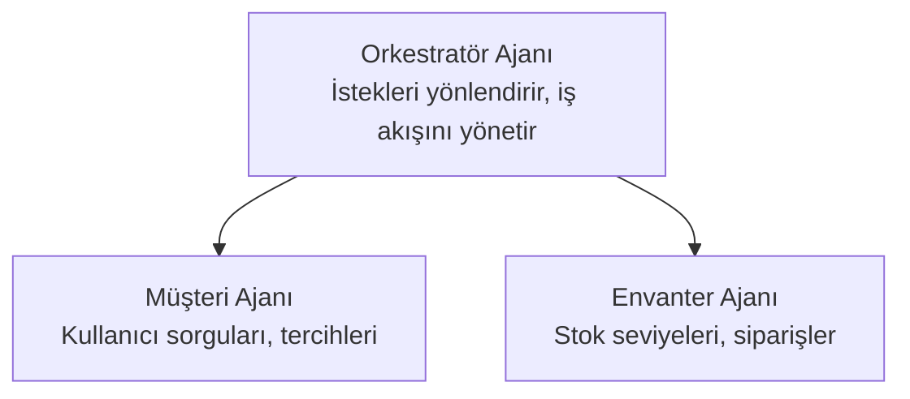

# Bölüm 5: Çok Ajanlı AI Çözümleri

**📚 Kurs**: [AZD For Beginners](../../README.md) | **⏱️ Süre**: 2-3 saat | **⭐ Karmaşıklık**: İleri düzey

---

## Genel Bakış

Bu bölüm, gelişmiş çoklu ajan mimarisi desenlerini, ajan orkestrasyonunu ve karmaşık senaryolar için üretime hazır AI dağıtımlarını kapsar.

## Öğrenme Hedefleri

Bu bölümü tamamladığınızda, şunları öğreneceksiniz:
- Çoklu ajan mimarisi desenlerini anlayın
- Koordine edilmiş AI ajan sistemlerini dağıtın
- Ajanlar arası iletişimi uygulayın
- Üretime hazır çoklu ajan çözümleri oluşturun

---

## 📚 Dersler

| # | Ders | Açıklama | Süre |
|---|--------|-------------|------|
| 1 | [Perakende Çoklu Ajan Çözümü](../../examples/retail-scenario.md) | Tam uygulama adım adım incelemesi | 90 dakika |
| 2 | [Koordinasyon Desenleri](../chapter-06-pre-deployment/coordination-patterns.md) | Ajan orkestrasyon stratejileri | 30 dakika |
| 3 | [ARM Şablon Dağıtımı](../../examples/retail-multiagent-arm-template/README.md) | Tek tıkla dağıtım | 30 dakika |

---

## 🚀 Hızlı Başlangıç

```bash
# Seçenek 1: Bir şablondan dağıtım yap
azd init --template agent-openai-python-prompty
azd up

# Seçenek 2: Bir ajan manifestinden dağıtım yap (azure.ai.agents uzantısı gerekir)
azd extension install azure.ai.agents
azd ai agent init -m agent-manifest.yaml
azd up
```

> **Hangi yaklaşım?** Use `azd init --template` to start from a working sample. Use `azd ai agent init` when you have your own agent manifest. See the [AZD AI CLI referansı](../chapter-08-production/production-ai-practices.md#azd-ai-cli-commands-and-extensions) for full details.

---

## 🤖 Çoklu Ajan Mimarisi


---

## 🎯 Öne Çıkan Çözüm: Perakende Çoklu Ajan

The [Perakende Çoklu Ajan Çözümü](../../examples/retail-scenario.md) aşağıdakileri gösterir:

- **Müşteri Ajanı**: Kullanıcı etkileşimlerini ve tercihlerini yönetir
- **Envanter Ajanı**: Stok ve sipariş işlemlerini yönetir
- **Orkestratör**: Ajanlar arasındaki koordinasyonu sağlar
- **Paylaşılan Bellek**: Ajanlar arası bağlam yönetimi

### Kullanılan Servisler

| Servis | Amaç |
|---------|---------|
| Microsoft Foundry Models | Dil anlama |
| Azure AI Search | Ürün kataloğu |
| Cosmos DB | Ajan durumu ve bellek |
| Container Apps | Ajan barındırma |
| Application Insights | İzleme |

---

## 🔗 Gezinme

| Yön | Bölüm |
|-----------|---------|
| **Önceki** | [Bölüm 4: Altyapı](../chapter-04-infrastructure/README.md) |
| **Sonraki** | [Bölüm 6: Ön Dağıtım](../chapter-06-pre-deployment/README.md) |

---

## 📖 İlgili Kaynaklar

- [AI Ajanları Kılavuzu](../chapter-02-ai-development/agents.md)
- [Üretim AI Uygulamaları](../chapter-08-production/production-ai-practices.md)
- [AI Sorun Giderme](../chapter-07-troubleshooting/ai-troubleshooting.md)

---

<!-- CO-OP TRANSLATOR DISCLAIMER START -->
**Sorumluluk Reddi**:
Bu belge, yapay zeka çeviri hizmeti [Co-op Translator](https://github.com/Azure/co-op-translator) kullanılarak çevrilmiştir. Doğruluk konusunda özen göstersek de, otomatik çevirilerin hatalar veya yanlışlıklar içerebileceğini lütfen unutmayın. Orijinal belgenin ana dilindeki sürümü yetkili kaynak olarak kabul edilmelidir. Kritik bilgiler için profesyonel insan çevirisi önerilir. Bu çevirinin kullanımı sonucunda ortaya çıkabilecek herhangi bir yanlış anlaşılma veya yanlış yorumdan sorumlu değiliz.
<!-- CO-OP TRANSLATOR DISCLAIMER END -->