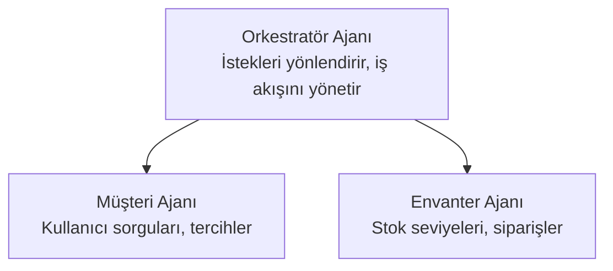

# Bölüm 5: Çok Ajanlı Yapay Zeka Çözümleri

**📚 Kurs**: [AZD For Beginners](../../README.md) | **⏱️ Süre**: 2-3 saat | **⭐ Zorluk**: İleri

---

## Genel Bakış

Bu bölüm, gelişmiş çok-ajan mimari desenlerini, ajan orkestrasyonunu ve karmaşık senaryolar için üretime hazır yapay zeka dağıtımlarını kapsar.

> `azd 1.25.6` ile Haziran 2026'da doğrulanmıştır.

## Öğrenme Hedefleri

Bu bölümü tamamlayarak:
- Çok ajanlı mimari desenleri anlayacaksınız
- Koordineli AI ajan sistemleri dağıtacaksınız
- Ajanlar arası iletişimi uygulayacaksınız
- Üretime hazır çok ajanlı çözümler inşa edeceksiniz

---

## 📚 Dersler

| # | Ders | Açıklama | Süre |
|---|--------|-------------|------|
| 1 | [Çok Ajanlı Temeller](multi-agent-basics.md) | Uygulamalı: `azd up` ile çalışan bir çok ajanlı uygulama dağıtın | 45 min |
| 2 | [Koordinasyon Desenleri](../chapter-06-pre-deployment/coordination-patterns.md) | Ajan orkestrasyon stratejileri (Bölüm 6'da devam ediyor) | 30 min |
| 3 | [ARM Şablon Dağıtımı](../../examples/retail-multiagent-arm-template/README.md) | Tek tıklamayla dağıtım örneği | 30 min |

> **Ders 1 ile başlayın.** Bu bölümde tamamen uygulamalı ve dağıtılabilir tek ders odur. Ders 2 Bölüm 6'da yer alır (ön-dağıtım planlaması ile paylaşılır) ve [Retail Multi-Agent Solution](../../examples/retail-scenario.md) bir mimari taslaktır—bir komutla çalıştırılan şablon değil, tasarım referansıdır.

---

## 🚀 Hızlı Başlangıç

```bash
# Seçenek 1: Bir şablondan dağıtım yap
azd init --template agent-openai-python-prompty
azd up

# Seçenek 2: Bir ajan manifestosundan dağıtım yap (azure.ai.agents eklentisi gerekir)
azd extension install azure.ai.agents
azd ai agent init -m agent-manifest.yaml
azd up
```

> **Hangi yaklaşım?** Çalışan bir örnekten başlamak için `azd init --template` kullanın. Kendi ajan manifestonuz olduğunda `azd ai agent init` kullanın. Tam ayrıntılar için bkz. [AZD AI CLI reference](../chapter-08-production/production-ai-practices.md#azd-ai-cli-commands-and-extensions).

---

## 🤖 Çok Ajanlı Mimari



---

## 🎯 Öne Çıkan Çözüm: Perakende Çok Ajanlı

[Perakende Çok Ajanlı Çözümü](../../examples/retail-scenario.md) şunu gösterir:

- **Customer Agent**: Kullanıcı etkileşimlerini ve tercihlerini yönetir
- **Inventory Agent**: Stok ve sipariş işlemlerini yönetir
- **Orchestrator**: Ajanlar arasında koordinasyon sağlar
- **Shared Memory**: Ajanlar arası bağlam yönetimi

### Kullanılan Hizmetler

| Service | Purpose |
|---------|---------|
| Microsoft Foundry Models | Dil anlama |
| Azure AI Search | Ürün kataloğu |
| Cosmos DB | Ajan durumu ve bellek |
| Container Apps | Ajan barındırma |
| Application Insights | İzleme |

---

## 🔗 Gezinme

| Direction | Chapter |
|-----------|---------|
| **Önceki** | [Chapter 4: Infrastructure](../chapter-04-infrastructure/README.md) |
| **Sonraki** | [Chapter 6: Pre-Deployment](../chapter-06-pre-deployment/README.md) |

---

## 📖 İlgili Kaynaklar

- [AI Agents Guide](../chapter-02-ai-development/agents.md)
- [Production AI Practices](../chapter-08-production/production-ai-practices.md)
- [AI Troubleshooting](../chapter-07-troubleshooting/ai-troubleshooting.md)

---

<!-- CO-OP TRANSLATOR DISCLAIMER START -->
**Feragatname**:
Bu belge, AI çeviri hizmeti [Co-op Translator](https://github.com/Azure/co-op-translator) kullanılarak çevrilmiştir. Doğruluk için çaba sarf etsek de, otomatik çevirilerin hata veya yanlışlık içerebileceğini lütfen unutmayınız. Orijinal belge, kendi dilinde yetkili kaynak olarak kabul edilmelidir. Kritik bilgiler için profesyonel insan çevirisi önerilir. Bu çevirinin kullanımı sonucu ortaya çıkabilecek yanlış anlamalardan veya yanlış yorumlamalardan sorumlu değiliz.
<!-- CO-OP TRANSLATOR DISCLAIMER END -->