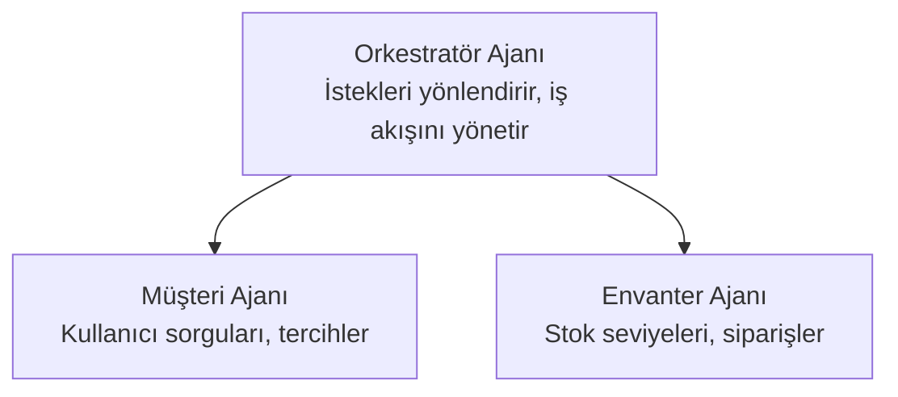

# Bölüm 5: Çok Ajanlı Yapay Zeka Çözümleri

**📚 Kurs**: [AZD Yeni Başlayanlar](../../README.md) | **⏱️ Süre**: 2-3 saat | **⭐ Zorluk**: İleri

---

## Genel Bakış

Bu bölüm gelişmiş çok-ajanlı mimari desenlerini, ajan orkestrasyonunu ve karmaşık senaryolar için üretime hazır yapay zeka dağıtımlarını kapsar.

> Mart 2026'da `azd 1.23.12` ile doğrulanmıştır.

## Öğrenme Hedefleri

Bu bölümü tamamladığınızda:
- Çok-ajanlı mimari desenlerini anlayacaksınız
- Koordine AI ajan sistemleri dağıtacaksınız
- Ajanlar arası iletişimi uygulayacaksınız
- Üretime hazır çok-ajanlı çözümler oluşturacaksınız

---

## 📚 Dersler

| # | Ders | Açıklama | Süre |
|---|--------|-------------|------|
| 1 | [Perakende Çok-Ajanlı Çözüm](../../examples/retail-scenario.md) | Tam uygulamanın adım adım anlatımı | 90 dk |
| 2 | [Koordinasyon Desenleri](../chapter-06-pre-deployment/coordination-patterns.md) | Ajan orkestrasyon stratejileri | 30 dk |
| 3 | [ARM Şablon Dağıtımı](../../examples/retail-multiagent-arm-template/README.md) | Tek tıkla dağıtım | 30 dk |

---

## 🚀 Hızlı Başlangıç

```bash
# Seçenek 1: Bir şablondan dağıtın
azd init --template agent-openai-python-prompty
azd up

# Seçenek 2: Bir ajan manifestinden dağıtın (azure.ai.agents uzantısı gerekir)
azd extension install azure.ai.agents
azd ai agent init -m agent-manifest.yaml
azd up
```

> **Hangi yaklaşım?** Çalışan bir örnekten başlamak için `azd init --template` kullanın. Kendi ajan manifestonuz olduğunda `azd ai agent init` kullanın. Tam ayrıntılar için [AZD AI CLI başvurusu](../chapter-08-production/production-ai-practices.md#azd-ai-cli-commands-and-extensions) bölümüne bakın.

---

## 🤖 Çok-Ajanlı Mimari


---

## 🎯 Öne Çıkan Çözüm: Perakende Çok-Ajanlı

[Perakende Çok-Ajanlı Çözüm](../../examples/retail-scenario.md) şu konuları gösterir:

- **Müşteri Ajanı**: Kullanıcı etkileşimlerini ve tercihlerini yönetir
- **Envanter Ajanı**: Stok ve sipariş işlemlerini yönetir
- **Orkestratör**: Ajanlar arasında koordinasyon sağlar
- **Paylaşılan Bellek**: Ajanlar arası bağlam yönetimi

### Kullanılan Hizmetler

| Hizmet | Amaç |
|---------|---------|
| Microsoft Foundry Models | Dil anlama |
| Azure AI Search | Ürün kataloğu |
| Cosmos DB | Ajan durumu ve bellek |
| Container Apps | Ajan barındırma |
| Application Insights | İzleme |

---

## 🔗 Gezinme

| Yön | Bölüm |
|-----------|---------|
| **Önceki** | [Bölüm 4: Altyapı](../chapter-04-infrastructure/README.md) |
| **Sonraki** | [Bölüm 6: Ön Dağıtım](../chapter-06-pre-deployment/README.md) |

---

## 📖 İlgili Kaynaklar

- [Yapay Zeka Ajanları Kılavuzu](../chapter-02-ai-development/agents.md)
- [Üretim AI Uygulamaları](../chapter-08-production/production-ai-practices.md)
- [Yapay Zeka Sorun Giderme](../chapter-07-troubleshooting/ai-troubleshooting.md)

---

<!-- CO-OP TRANSLATOR DISCLAIMER START -->
**Feragatname**:
Bu belge, [Co-op Translator](https://github.com/Azure/co-op-translator) adlı yapay zeka çeviri hizmeti kullanılarak çevrilmiştir. Doğruluk için çaba göstermemize rağmen, otomatik çevirilerin hata veya yanlışlıklar içerebileceğini lütfen unutmayın. Orijinal belge, kendi dilinde yetkili kaynak olarak kabul edilmelidir. Kritik bilgiler için profesyonel insan çevirisi önerilir. Bu çevirinin kullanımından kaynaklanan herhangi bir yanlış anlama veya yanlış yorumdan sorumlu değiliz.
<!-- CO-OP TRANSLATOR DISCLAIMER END -->