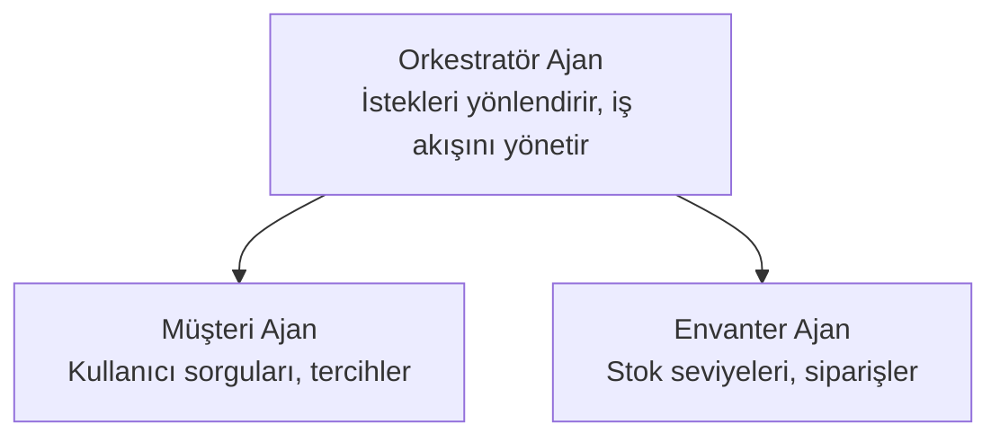

# Bölüm 5: Çoklu Ajanlı Yapay Zeka Çözümleri

**📚 Kurs**: [Yeni Başlayanlar için AZD](../../README.md) | **⏱️ Süre**: 2-3 saat | **⭐ Zorluk**: İleri Seviye

---

## Genel Bakış

Bu bölüm, karmaşık senaryolar için gelişmiş çoklu ajan mimarisi desenlerini, ajan orkestrasyonunu ve üretime hazır yapay zeka dağıtımlarını kapsar.

> Temmuz 2026'da `azd 1.27.1` ile doğrulanmıştır.

## Öğrenme Hedefleri

Bu bölümü tamamlayarak:
- Çoklu ajan mimarisi desenlerini anlayacaksınız
- Koordine edilmiş yapay zeka ajan sistemleri dağıtacaksınız
- Ajanlar arası iletişim uygulayacaksınız
- Üretime hazır çoklu ajan çözümleri oluşturacaksınız

---

## 📚 Dersler

| # | Ders | Açıklama | Süre |
|---|--------|-------------|------|
| 1 | [Çoklu Ajan Temelleri](multi-agent-basics.md) | Pratik: `azd up` ile çalışan çoklu ajan uygulaması dağıtımı | 45 dk |
| 2 | [Koordinasyon Desenleri](../chapter-06-pre-deployment/coordination-patterns.md) | Ajan orkestrasyon stratejileri (Bölüm 6'da devam eder) | 30 dk |
| 3 | [ARM Şablonu Dağıtımı](../../examples/retail-multiagent-arm-template/README.md) | Tek tıkla dağıtım örneği | 30 dk |

> **Ders 1 ile başlayın.** Bu bölümde tamamen pratik ve dağıtılabilir tek derstir. Ders 2 Bölüm 6'da yer alır (ön dağıtım planlamasıyla paylaşımlıdır) ve [Perakende Çoklu Ajan Çözümü](../../examples/retail-scenario.md) bir mimari taslaktır—bir tasarım referansı olup tek komutluk şablon değildir.

---

## 🚀 Hızlı Başlangıç

```bash
# Seçenek 1: Bir şablondan dağıtım yap
azd init --template agent-openai-python-prompty
azd up

# Seçenek 2: Bir ajan manifestosundan dağıtım yap (azure.ai.agents uzantısı gerektirir)
azd extension install azure.ai.agents
azd ai agent init -m agent-manifest.yaml
azd up
```

> **Hangi yaklaşım?** Çalışan bir örnekten başlamak için `azd init --template` kullanın. Kendi ajan manifestonuz olduğunda `azd ai agent init` komutunu kullanın. Tüm ayrıntılar için [AZD AI CLI referansı](../chapter-08-production/production-ai-practices.md#azd-ai-cli-commands-and-extensions) sayfasına bakın.

---

## 🤖 Çoklu Ajan Mimarisi



---

## 🎯 Öne Çıkan Çözüm: Perakende Çoklu Ajan

[Perakende Çoklu Ajan Çözümü](../../examples/retail-scenario.md) şunları gösterir:

- **Müşteri Ajanı**: Kullanıcı etkileşimlerini ve tercihlerimizi yönetir
- **Envanter Ajanı**: Stok ve sipariş işlemlerini yönetir
- **Orkestratör**: Ajanlar arasında koordinasyon sağlar
- **Paylaşılan Bellek**: Ajanlar arası bağlam yönetimi

### Kullanılan Hizmetler

| Hizmet | Amaç |
|---------|---------|
| Microsoft Foundry Modelleri | Dil anlama |
| Azure AI Arama | Ürün kataloğu |
| Cosmos DB | Ajan durumu ve belleği |
| Container Apps | Ajan barındırma |
| Application Insights | İzleme |

---

## 🔗 Navigasyon

| Yön | Bölüm |
|-----------|---------|
| **Önceki** | [Bölüm 4: Altyapı](../chapter-04-infrastructure/README.md) |
| **Sonraki** | [Bölüm 6: Ön Dağıtım](../chapter-06-pre-deployment/README.md) |

---

## 📖 İlgili Kaynaklar

- [Yapay Zeka Ajanları Kılavuzu](../chapter-02-ai-development/agents.md)
- [Üretim Yapay Zeka Uygulamaları](../chapter-08-production/production-ai-practices.md)
- [Yapay Zeka Sorun Giderme](../chapter-07-troubleshooting/ai-troubleshooting.md)

---

<!-- CO-OP TRANSLATOR DISCLAIMER START -->
**Feragatname**:
Bu belge, AI çeviri hizmeti [Co-op Translator](https://github.com/Azure/co-op-translator) kullanılarak çevrilmiştir. Doğruluk için çaba sarf etsek de, otomatik çevirilerin hata veya yanlışlık içerebileceğini lütfen unutmayınız. Orijinal belge, kendi dilinde yetkili kaynak olarak kabul edilmelidir. Kritik bilgiler için profesyonel insan çevirisi önerilir. Bu çevirinin kullanımı sonucu ortaya çıkabilecek yanlış anlamalardan veya yanlış yorumlamalardan sorumlu değiliz.
<!-- CO-OP TRANSLATOR DISCLAIMER END -->