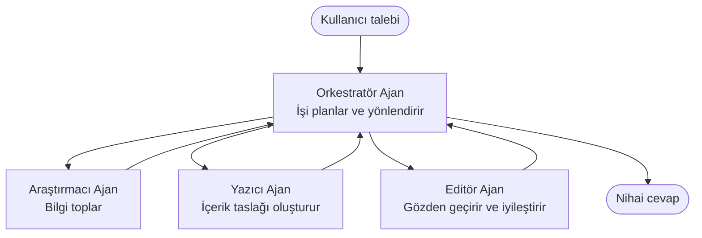

# Çoklu Ajan Temelleri - İlk Koordine Edilmiş Yapay Zeka Sistemini Dağıt

**Bölüm Navigasyonu:**
- **📚 Ders Anasayfası**: [Yeni Başlayanlar için AZD](../../README.md)
- **📖 Mevcut Bölüm**: Bölüm 5 - Çoklu Ajan Yapay Zeka Çözümleri
- **⬅️ Önceki**: [Bölüm 4: Altyapı](../chapter-04-infrastructure/README.md)
- **➡️ Sonraki**: [Koordinasyon Desenleri](../chapter-06-pre-deployment/coordination-patterns.md)

> Temmuz 2026'da `azd 1.27.1` ile doğrulanmıştır.

## Giriş

Önceki bölümlerde tek bir uygulama dağıttınız—ve Bölüm 2'de tek bir yapay zeka ajanı dağıttınız. Bu ders bir sonraki adımı atıyor: birkaç uzmanlaşmış ajanın tek başına iyi idare edemeyeceği bir problemi birlikte çözdüğü **çoklu ajan sistemi** dağıtmak.

Yeni başlayanlar için iyi haber: **yeni komutlara ihtiyacınız yok.** Bir çoklu ajan çözümü halen bir azd projesidir. `azd init`, `azd up`, test ve `azd down` yapacaksınız—tam olarak bildiğiniz iş akışı. Değişen şey uygulamanın içindeki *şekildir*.

## Öğrenme Hedefleri

Bu dersin sonunda:
- "Çoklu ajan" ne demektir ve ne zaman ekstra karmaşıklığı hak ettiğini anlayacaksınız
- Çoklu ajan sistemlerdeki yaygın rolleri tanıyacaksınız (yönlendirici + uzmanlar)
- `azd up` ile gerçek, çalışan bir çoklu ajan şablonu dağıtacaksınız
- Çoklu ajan uygulamasını destekleyen Azure kaynaklarını anlayacaksınız
- Çözümü güvenli şekilde doğrulamayı, özelleştirmeyi ve kaldırmayı bileceksiniz

## Öğrenme Sonuçları

Bu dersi tamamladıktan sonra şunları yapabilirsiniz:
- Tek bir ajan ile çoklu ajan sistem arasındaki farkı açıklamak
- Araçları olan tek bir ajanla gerçek çoklu ajan tasarım arasında seçim yapmak
- azd ile çoklu ajan şablonunu baştan sona dağıtmak ve test etmek
- Her ajanın nerede çalıştığını ve nasıl iletişim kurduklarını belirlemek
- Sürekli ücretlendirmeyi önlemek için tüm kaynakları temizlemek

---

## Çoklu Ajan Sistemi Nedir?

Tek bir yapay zeka ajanı bir model ve bir dizi komut ile (isteğe bağlı olarak) bazı araçlardan oluşur. Bu odaklanmış görevler için iyidir. Ama görev büyüdükçe—araştırma, ardından yazma, sonra düzenleme, sonra gerçek kontrolü—her şeyi tek bir komuta doldurmak ajanı yavaşlatır, daha az güvenilir yapar ve hata ayıklamayı zorlaştırır.

Bir **çoklu ajan sistemi**, işi her biri bir işi iyi yapan uzmanlara böler, bir yönlendirici ile koordine edilir:



### Hep göreceğiniz iki rol

| Rol | İş | Örnek |
|------|-----|---------|
| **Yönlendirici** | *Sonra ne olacak* karar verir ve ajanlar arasında işi yönlendirir | "Önce araştır, sonra yaz, sonra düzenle" |
| **Uzman** | Tek bir odaklanmış işi yapar ve sonuç döner | Sadece gerçekleri toplayan bir "araştırmacı" |

### Gerçekten birden fazla ajana ihtiyacınız var mı?

Basit başlayın. Çoklu ajan **ancak** aşağıdakilerden biri doğruysa tercih edilir:

- ✅ Görev, farklı talimatlardan fayda sağlayan **belirli aşamalara** sahiptir (araştırma vs. yazma vs. inceleme)
- ✅ Zaman kazandırmak için uzmanların **aynı anda** çalışmasını istersiniz
- ✅ Farklı adımların **farklı araçlar veya veri kaynakları** kullanması gerekir
- ✅ Her adımın **bağımsızca test edilebilir ve hata ayıklanabilir** olması gerekir

Göreviniz tek bir soru-cevap ya da basit bir araç çağrısı ise, **araçları olan tek ajan** (Bölüm 2) daha basit, daha ucuz ve işletmesi kolaydır.

> **Yeni başlayanlar için ipucu:** "Daha fazla ajan" daha iyi demek değildir. Her ajan gecikme, maliyet ve izlenecek yeni bir şey ekler. Sadece sorun açıkça parçalara bölündüğünde ajan ekleyin.

---

## Azure’da Çoklu Ajan Oluşturmanın İki Yolu

| Yaklaşım | Nedir | En iyi kullanım |
|----------|-----------|----------|
| **Tek ajan + araçlar** | Fonksiyon/araç çağıran tek Foundry ajanı | Basit iş akışları, başlangıç |
| **Birden fazla koordine edilmiş ajan** | Birden fazla ajan ve bir yönlendirici | Belirgin aşamalar, paralel çalışma, uzmanlaşma |

Bu ders ikinci yaklaşıma odaklanıyor ve **hazır şablon** kullanarak kendi çoklu ajan sisteminizi inşa etmeden gerçek bir örneği görmenizi sağlıyor.

---

## Uygulamalı: Çalışan Bir Çoklu Ajan Uygulaması Dağıtın

Bir makale üretmek için koordine edilmiş birden fazla ajan kullanan resmi bir Azure örneği olan **Contoso Yaratıcı Yazar**'ı dağıtacağız (araştırmacı, yazar, editör). Roller kolay anlaşıldığından harika bir ilk çoklu ajan uygulaması.

### 1. Adım: Şablonu Başlat

```bash
# Çalışma klasörü oluştur
mkdir creative-writer && cd creative-writer

# Resmi çoklu ajan şablonundan başlat
azd init --template contoso-creative-writer
```

> Her zaman [Harika AZD AI galerisi](https://azure.github.io/awesome-azd/?tags=ai) içinde daha fazla çoklu ajan şablonuna göz atabilirsiniz. Başlangıç dostu diğer seçenekler `get-started-with-ai-agents` ve `azure-ai-travel-agents` içerir.

### 2. Adım: Kimlik Doğrulaması Yapın

```bash
# azd iş akışları için gereklidir
azd auth login
```

### 3. Adım: Bir ortam oluşturun

```bash
azd env new dev
```

### 4. Adım: Önizleme yapın, sonra dağıtın

```bash
# Bir şey harcamadan önce ne oluşturulacağını görün (önerilir)
azd provision --preview

# Altyapıyı sağlayın ve tüm ajanları tek adımda dağıtın
azd up
```

`azd up` sizden abonelik ve bölge isteyecek, sonra Azure kaynaklarını sağlamak ve uygulamayı dağıtmak için devam edecek. Yapay zeka dağıtımları basit web uygulamalarından daha uzun sürebilir—daha büyük modelleri dağıtıyorsanız dağıtım zaman aşımını uzatabilirsiniz:

```bash
azd deploy --timeout 1800
```

> **Maliyet ve kapasite hakkında uyarı:** Çoklu ajan uygulamaları kota tüketen ve maliyete neden olan yapay zeka modelleri dağıtır. `azd up` model kotası nedeniyle başarısız olursa, bölge ve kota düzeltmeleri için [Yapay Zeka Sorun Giderme](../chapter-07-troubleshooting/ai-troubleshooting.md) ve Bölüm 6 [Kapasite Planlama](../chapter-06-pre-deployment/capacity-planning.md) bakınız.

---

## Dağıttığınızı Anlamak

Bu tür tipik çoklu ajan uygulaması, yukarıdaki diyagramdaki sorumluluklara doğrudan karşılık gelen bir dizi Azure kaynağı sağlar:

| Kaynak | Neden orada |
|----------|----------------|
| **Microsoft Foundry / Modeller** | Her ajanın kullandığı dil modellerine ev sahipliği yapar |
| **Azure AI Search** | Araştırmacı ajanın arama yapacağı sağlam veriler sağlar |
| **Container Apps** (veya App Service) | Yönlendirici ve ajan kodunu barındırır |
| **Cosmos DB** (bazı örneklerde) | Ajanlar arasında paylaşılan durum/hafızayı depolar |
| **Application Insights** | Ajanlar arasında istekleri izler, böylece akışı hata ayıklayabilirsiniz |

### Ajanlar nasıl iletişim kurar

Çoğu azd çoklu ajan örneğinde, **yönlendirici uygulama kodunuzda çalışır** (örneğin Semantic Kernel veya Microsoft Agent Framework gibi bir çerçeve kullanılarak). Yönlendirici uzman ajana sırayla çağrı yapar, sonuçları iletir ve nihai cevabı birleştirir. Ajanlar şu yollarla bağlam paylaşır:

- **Fonksiyon/araç çağrıları** — yönlendirici bir uzmana çağrı yapar ve sonuç alır
- **Paylaşılan hafıza** — genellikle Cosmos DB, her iki ajanın okuyabileceği durumu tutar
- **Mesajlar/olaylar** — gevşek bağlama için ajanlar kuyruk veya Service Bus ile iletişim kurar

> **Bu neden hata ayıklama için önemli:** Her adım ayrı olduğundan, Application Insights size *hangi* ajanın yavaş veya başarısız olduğunu gösterir. Bu, işi ajana bölmenin en büyük nedenlerinden biridir.

---

## Dağıtımı Doğrula

İlerlemeden önce sistemin gerçekten çalıştığını onaylayın:

```bash
# Dağıtılan uç noktaları göster
azd show

# Uygulamanın izleme kontrol panelini aç
azd monitor

# Bir şeyler yanlış görünüyorsa günlükleri takip et
azd monitor --logs
```

Sonra `azd show` ile uygulama URL'sini açın ve tüm ajanları kullanan bir istek deneyin (Creative Writer için konuyla ilgili kısa bir makale yazmasını isteyin). Application Insights **işlem araması** içinde isteğin araştırmacı, yazar ve editör adımlarına yayıldığını görmelisiniz.

**Başarı ölçütleri:**
- ✅ `azd show` erişilebilir bir uç nokta listeler
- ✅ Bir istek net olarak birden fazla aşamadan geçen sonuç üretir
- ✅ Application Insights birden fazla ajan adımı için izler gösterir

---

## Özelleştirme: Bir Ajan Ekleyin veya Ayarlayın

Her ajan sadece talimatlar ve araçlardan oluştuğundan, özelleştirmek kolaydır:

1. Şablondaki ajan tanımlarını bulun (çoğunlukla `prompts/`, `agents/` veya `*.prompty` dosyalar).
2. Bir ajanın talimatlarını ayarlayın — örneğin, editör ajana belirli bir ton veya kelime sayısını zorunlu kılmasını söyleyin.
3. Yalnızca kodu yeniden dağıtın (altyapı değişmez):

   ```bash
   azd deploy
   ```

Daha ileri gidip *kendi* manifestonuzdan ajanlar oluşturmak için ajan uzantısını ve tüm yaşam döngüsünü kullanın:

```bash
azd extension install azure.ai.agents
azd ai agent init -m agent-manifest.yaml
azd up
azd ai agent invoke      # yanıt zamanlaması ile test
```

Tam ajan yaşam döngüsü (`invoke`, `eval generate`, `optimize`, `delete`) için [Bölüm 2: Ajanlar](../chapter-02-ai-development/agents.md) ve [AZD AI CLI referansı](../chapter-08-production/production-ai-practices.md#azd-ai-cli-commands-and-extensions) bakınız.

---

## Temizleme

Çoklu ajan uygulamalar birden fazla ücretlendirme servisi çalıştırır. İşiniz bittiğinde her şeyi kaldırın:

```bash
azd down --force --purge
```

`--purge` bayrağı ayrıca yumuşak silinmiş Yapay Zeka kaynaklarını (Foundry/Azure AI Services hesapları gibi) kaldırır, böylece yeniden dağıtımı engellemez veya maliyet oluşturmaya devam etmez.

---

## Üretim Çoklu Ajan Sistemleri Hakkında Not

Bu depo içindeki [Perakende Çoklu Ajan Çözümü](../../examples/retail-scenario.md) **bir mimari şablondur**, tek komutluk bir şablon değil—bir üretim perakende sisteminin *nasıl* inşa edileceğini belgelemektedir (ve tam yapının ciddi bir çaba olduğunu açıklar). Burada çalışan bir örnek dağıttıktan sonra tasarım referansı olarak kullanın. Üretim için endişeler (dayanıklılık, maliyet, izleme, yönetişim) için [Bölüm 8: Üretim AI Uygulamaları](../chapter-08-production/production-ai-practices.md) devam edin.

---

## Özet

- Çoklu ajan sistemi, işi yönlendirici tarafından koordine edilen uzmanlara böler.
- Görev belirgin aşamalara, paralellik ya da her adım için farklı araçlara sahipse kullanın—aksi takdirde tek ajana tercih edin.
- azd iş akışı aynı kalır: `azd init` → `azd up` → test → `azd down`.
- `contoso-creative-writer` gibi gerçek bir şablon, çalışan bir çoklu ajan uygulamasını bugün görmenizi ve özelleştirmenizi sağlar.
- Ajanlar arasında Application Insights izlemesi çoklu ajan tasarımının en büyük pratik faydalarından biridir.

---

## 🔗 Navigasyon

| Yön | Ders |
|-----------|--------|
| **Önceki** | [Bölüm 4: Altyapı](../chapter-04-infrastructure/README.md) |
| **Sonraki** | [Koordinasyon Desenleri](../chapter-06-pre-deployment/coordination-patterns.md) |

## 📖 İlgili Kaynaklar

- [Yapay Zeka Ajanları Rehberi](../chapter-02-ai-development/agents.md)
- [Koordinasyon Desenleri](../chapter-06-pre-deployment/coordination-patterns.md)
- [Üretim AI Uygulamaları](../chapter-08-production/production-ai-practices.md)
- [AI Sorun Giderme](../chapter-07-troubleshooting/ai-troubleshooting.md)

---

<!-- CO-OP TRANSLATOR DISCLAIMER START -->
**Feragatname**:
Bu belge, AI çeviri hizmeti [Co-op Translator](https://github.com/Azure/co-op-translator) kullanılarak çevrilmiştir. Doğruluk için çaba sarf etsek de, otomatik çevirilerin hata veya yanlışlık içerebileceğini lütfen unutmayınız. Orijinal belge, kendi dilinde yetkili kaynak olarak kabul edilmelidir. Kritik bilgiler için profesyonel insan çevirisi önerilir. Bu çevirinin kullanımı sonucu ortaya çıkabilecek yanlış anlamalardan veya yanlış yorumlamalardan sorumlu değiliz.
<!-- CO-OP TRANSLATOR DISCLAIMER END -->