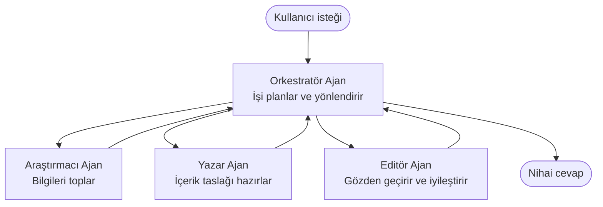

# Çoklu Ajan Temelleri - İlk Koordine Yapay Zeka Sistemini Dağıtın

**Bölüm Navigasyonu:**
- **📚 Kurs Ana Sayfa**: [AZD For Beginners](../../README.md)
- **📖 Mevcut Bölüm**: Bölüm 5 - Çok Ajanlı Yapay Zeka Çözümleri
- **⬅️ Önceki**: [Bölüm 4: Altyapı](../chapter-04-infrastructure/README.md)
- **➡️ Sonraki**: [Koordinasyon Desenleri](../chapter-06-pre-deployment/coordination-patterns.md)

> Haziran 2026'da `azd 1.25.6` ile doğrulanmıştır.

## Giriş

Önceki bölümlerde tek bir uygulama dağıttınız—ve Bölüm 2'de tek bir yapay zeka ajanı dağıtmıştınız. Bu ders bir sonraki adımı atıyor: birkaç uzmanlaşmış ajanın birlikte çalışarak tek bir ajanın iyi yapamayacağı bir problemi çözdüğü **çoklu ajan sistemi** dağıtmak.

Yeni başlayanlar için iyi haber: **yeni komutlara ihtiyacınız yok.** Çoklu ajan çözümü hâlâ bir azd projesidir. `azd init`, `azd up`, test ve `azd down` yapacaksınız—zaten bildiğiniz iş akışıyla aynı. Değişen şey uygulamanın içindeki yapının biçimidir.

## Öğrenme Hedefleri

Bu dersin sonunda:
- "çoklu ajan"ın ne anlama geldiğini ve ne zaman ekstra karmaşıklığa değdiğini anlayacaksınız
- Çoklu ajan sistemindeki yaygın rolleri tanıyacaksınız (orkestratör + uzmanlar)
- `azd up` ile gerçek, çalışan bir çoklu ajan şablonu dağıtacaksınız
- Bir çoklu ajan uygulamasını destekleyen Azure kaynaklarını anlayacaksınız
- Çözümü nasıl doğrulayacağınızı, özelleştireceğinizi ve güvenle kapatacağınızı bileceksiniz

## Öğrenme Çıktıları

Bu dersi tamamladıktan sonra şunları yapabileceksiniz:
- Tek bir ajan ile çoklu ajan sistemi arasındaki farkı açıklamak
- Araçlara sahip tek bir ajan ile gerçekten çoklu ajan tasarımı arasında seçim yapmak
- azd ile uçtan uca bir çoklu ajan şablonunu dağıtıp test etmek
- Her ajanın nerede çalıştığını ve nasıl iletişim kurduklarını belirlemek
- Süregelen ücretlerden kaçınmak için tüm kaynakları temizlemek

---

## Çoklu Ajan Sistemi Nedir?

Tek bir yapay zeka ajanı, bir dizi talimat ve (isteğe bağlı olarak) bazı araçlarla çalışan bir modeldir. Bu, odaklanmış görevler için iyi çalışır. Ancak görev büyüdükçe—araştırma, sonra yazma, sonra düzenleme, sonra gerçekleri kontrol etme—her şeyi tek bir prompt'a sıkıştırmak ajanı daha yavaş, daha az güvenilir ve hata ayıklaması zor hale getirir.

Bir **çoklu ajan sistemi**, işi her biri bir işi iyi yapan uzmanlara böler ve bunları bir orkestratör koordine eder:



### Her zaman göreceğiniz iki rol

| Rol | Görev | Örnek |
|------|-----|---------|
| **Orkestratör** | *Sırada ne olacağını* belirler ve işin ajanlar arasında yönlendirilmesini sağlar | "Önce araştırma, sonra yazma, sonra düzenleme" |
| **Uzman** | Tek odaklı bir işi yapar ve bir sonuç döner | Sadece veri toplayan bir "araştırmacı" |

### Gerçekten birden fazla ajana ihtiyacınız var mı?

Basit başlayın. Çoklu ajana **sadece** aşağıdakilerden biri doğruysa başvurun:

- ✅ Görev, farklı talimatlardan fayda sağlayan **ayrı aşamalara** sahip (araştırma vs. yazma vs. gözden geçirme)
- ✅ Zaman kazanmak için uzmanların **paralel** çalışmasını istiyorsunuz
- ✅ Farklı adımların **farklı araçlara veya veri kaynaklarına** ihtiyacı var
- ✅ Her adımın **bağımsız olarak test edilebilir ve hata ayıklanabilir** olması gerekiyor

Eğer göreviniz tek bir soru-cevap veya basit bir araç çağrısıysa, **araçlara sahip tek bir ajan** (Bölüm 2) daha basit, daha ucuz ve işletmesi daha kolaydır.

> **Yeni başlayanlar için ipucu:** "Daha fazla ajan" otomatik olarak "daha iyi" demek değildir. Her ajan gecikme, maliyet ve izlenecek yeni bir şey ekler. Ajanları yalnızca problem açıkça parçalara ayrıldığında ekleyin.

---

## Azure'da Çoklu Ajan Oluşturmanın İki Yolu

| Yaklaşım | Nedir | En uygunu |
|----------|-----------|----------|
| **Tek ajan + araçlar** | Fonksiyonlar/araçlar çağıran bir Foundry ajanı | Basit iş akışları, başlarken |
| **Birkaç koordine ajan** | Bir orkestratör ile birkaç ajan | Ayrık aşamalar, paralel iş, uzmanlaşma |

Bu ders, kendi şablonunuzu oluşturmadan önce gerçek bir çoklu ajan sistemini görebilmeniz için **hazır bir şablon** kullanarak ikinci yaklaşıma odaklanır.

---

## Uygulamalı: Çalışan Bir Çoklu Ajan Uygulaması Dağıtın

Biz **Contoso Creative Writer**'ı dağıtacağız; araştırmacı, yazar ve editör gibi birden çok ajan kullanan resmi bir Azure örneğidir ve bir makale üretmek için koordine edilir. Roller kolay anlaşılır olduğu için ilk çoklu ajan uygulamanız için harika bir seçenektir.

### Adım 1: Şablonu başlatın

```bash
# Çalışma klasörü oluştur
mkdir creative-writer && cd creative-writer

# Resmi çok ajanlı şablondan başlat
azd init --template contoso-creative-writer
```

> Başka çoklu ajan şablonlarına her zaman [Awesome AZD AI gallery](https://azure.github.io/awesome-azd/?tags=ai) üzerinden göz atabilirsiniz. Yeni başlayanlar için uygun diğer seçenekler arasında `get-started-with-ai-agents` ve `azure-ai-travel-agents` bulunur.

### Adım 2: Kimlik doğrulama

```bash
# azd iş akışları için gerekli
azd auth login
```

### Adım 3: Bir ortam oluşturun

```bash
azd env new dev
```

### Adım 4: Önizleyin, sonra dağıtın

```bash
# Harcamaya başlamadan önce nelerin oluşturulacağını görün (önerilir)
azd provision --preview

# Altyapıyı sağlayın ve tüm ajanları tek adımda dağıtın
azd up
```

`azd up` bir abonelik ve bölge için sizi yönlendirecek, ardından Azure kaynaklarını sağlayıp uygulamayı dağıtacaktır. Yapay zeka dağıtımları basit bir web uygulamasından daha uzun sürebilir—daha büyük modeller dağıtıyorsanız dağıtma zaman aşımını uzatabilirsiniz:

```bash
azd deploy --timeout 1800
```

> **Maliyet ve kapasite hakkında uyarı:** Çoklu ajan uygulamaları kota tüketen ve maliyet getiren AI modelleri dağıtır. Eğer `azd up` model kotası nedeniyle başarısız olursa, bölge ve kota düzeltmeleri için [AI Troubleshooting](../chapter-07-troubleshooting/ai-troubleshooting.md)'e ve Bölüm 6'daki [Capacity Planning](../chapter-06-pre-deployment/capacity-planning.md)'e bakın.

---

## Dağıttıklarınızı Anlamak

Böyle tipik bir çoklu ajan uygulaması, yukarıdaki diyagramdaki sorumluluklara doğrudan eşlenen bir dizi Azure kaynağı sağlar:

| Kaynak | Neden var |
|----------|----------------|
| **Microsoft Foundry / Models** | Her ajanın kullandığı dil modellerini barındırır |
| **Azure AI Search** | Araştırmacı ajana aranabilir dayanaklı veriler sağlar |
| **Container Apps** (veya App Service) | Orkestratör ve ajan kodunu barındırır |
| **Cosmos DB** (bazı örneklerde) | Ajanlar arasında paylaşılan durum/hafızayı saklar |
| **Application Insights** | İstekleri ajanlar *arasında* izlemenizi sağlar, böylece akışı hata ayıklayabilirsiniz |

### Ajanlar birbirleriyle nasıl konuşur

Çoğu azd çoklu ajan örneğinde, **orkestratör uygulama kodunuzda çalışır** (örneğin Semantic Kernel veya Microsoft Agent Framework gibi bir çerçeve kullanarak). Orkestratör her uzman ajana sırayla çağrı yapar, sonuçları aktarır ve nihai cevabı birleştirir. Ajanlar bağlamı şu yollarla paylaşır:

- **Fonksiyon/araç çağrıları** — orkestratör bir uzmana çağrı yapar ve bir sonuç alır
- **Paylaşılan bellek** — genellikle Cosmos DB olan bir veritabanı, her iki ajanın da okuyabileceği durumu tutar
- **Mesajlar/olaylar** — daha gevşek bağlılık için ajanlar bir kuyruğa veya Service Bus'a mesaj gönderir

> **Hata ayıklama için neden önemli:** her adım ayrı olduğu için, Application Insights size *hangi* ajanın yavaşladığını veya başarısız olduğunu gösterir. Bu, işi ajanlara bölmenin başlıca nedenlerinden biridir.

---

## Dağıtımı Doğrulayın

İlerlemeden önce sistemin gerçekten çalıştığını doğrulayın:

```bash
# Dağıtılan uç noktaları göster
azd show

# Uygulamanın izleme panosunu aç
azd monitor

# Bir şeyler ters görünüyorsa logları takip et
azd monitor --logs
```

Ardından `azd show` ile uygulama URL'sini açın ve tüm ajanları çalıştıran bir isteği deneyin (Creative Writer için bir konuyla ilgili kısa bir makale yazmasını isteyin). Application Insights **transaction search** içinde, isteğin araştırmacı, yazar ve editör adımlarına yayıldığını görmelisiniz.

**Başarı kriterleri:**
- ✅ `azd show` erişilebilir bir uç nokta listeliyor
- ✅ Bir istek açıkça birden fazla aşamadan geçmiş bir sonuç üretiyor
- ✅ Application Insights birden fazla ajan adımı için izler gösteriyor

---

## Özelleştirme: Bir Ajans Ekleyin veya Ayarlayın

Her ajan sadece talimatlar artı araçlardan oluştuğu için özelleştirme erişilebilir:

1. Şablondaki **ajan tanımlarını bulun** (çoğunlukla `prompts/`, `agents/` veya `*.prompty` dosya seti).
2. **Bir ajanın talimatlarını ayarlayın** — örneğin editör ajana belirli bir ton veya kelime sayısı uygulamasını söyleyin.
3. **Sadece kodu yeniden dağıtın** (altyapı değişmeden kalır):

   ```bash
   azd deploy
   ```

Kendi manifestonuzdan ajanlar oluşturmak ve tam yaşam döngüsünü yönetmek için ajan uzantısını ve onun tam yaşam döngüsünü kullanın:

```bash
azd extension install azure.ai.agents
azd ai agent init -m agent-manifest.yaml
azd up
azd ai agent invoke      # test, yanıt zamanlaması ile
```

Tam ajan yaşam döngüsü (`invoke`, `eval generate`, `optimize`, `delete`) için [Bölüm 2: Agents](../chapter-02-ai-development/agents.md) ve [AZD AI CLI referansı](../chapter-08-production/production-ai-practices.md#azd-ai-cli-commands-and-extensions)'na bakın.

---

## Temizlik

Çoklu ajan uygulamaları birden fazla ücretli hizmet çalıştırır. İşiniz bittiğinde her şeyi kapatın:

```bash
azd down --force --purge
```

`--purge` bayrağı ayrıca yumuşak-silinen AI kaynaklarını (Foundry/Azure AI Services hesapları gibi) kaldırır, böylece gelecekteki bir yeniden dağıtımı engellemez veya maliyet oluşturmaya devam etmez.

---

## Üretim Çoklu Ajan Sistemleri Hakkında Bir Not

Bu depodaki [Retail Multi-Agent Solution](../../examples/retail-scenario.md), bir **mimari kroki**dir; tek komutluk bir şablon değildir—üretim düzeyinde bir perakende sisteminin nasıl inşa edileceğini belgeleyen (ve tam bir kurulumun önemli bir çaba gerektirdiğini açıkça belirten) bir referanstır. Burada çalışan bir örneği dağıttıktan sonra tasarım referansı olarak kullanın. Üretimle ilgili endişeler (dayanıklılık, maliyet, izleme, yönetişim) için [Bölüm 8: Production AI Practices](../chapter-08-production/production-ai-practices.md)'a devam edin.

---

## Özet

- Bir çoklu ajan sistemi işi, bir orkestratör tarafından koordine edilen uzmanlara böler.
- Görev ayrı aşamalara, paralelliğe veya adım başına farklı araçlara sahip olduğunda kullanın—aksi takdirde tek ajanı tercih edin.
- azd iş akışı değişmez: `azd init` → `azd up` → test → `azd down`.
- `contoso-creative-writer` gibi gerçek bir şablon, bugün çalışan bir çoklu ajan uygulamasını görmenizi ve özelleştirmenizi sağlar.
- Ajanlar arası Application Insights izleme, çoklu ajan tasarımının en büyük pratik faydalarından biridir.

---

## 🔗 Navigasyon

| Yön | Ders |
|-----------|--------|
| **Önceki** | [Bölüm 4: Altyapı](../chapter-04-infrastructure/README.md) |
| **Sonraki** | [Koordinasyon Desenleri](../chapter-06-pre-deployment/coordination-patterns.md) |

## 📖 İlgili Kaynaklar

- [AI Agents Guide](../chapter-02-ai-development/agents.md)
- [Coordination Patterns](../chapter-06-pre-deployment/coordination-patterns.md)
- [Production AI Practices](../chapter-08-production/production-ai-practices.md)
- [AI Troubleshooting](../chapter-07-troubleshooting/ai-troubleshooting.md)

---

<!-- CO-OP TRANSLATOR DISCLAIMER START -->
**Feragatname**:
Bu belge, AI çeviri hizmeti [Co-op Translator](https://github.com/Azure/co-op-translator) kullanılarak çevrilmiştir. Doğruluk için çaba sarf etsek de, otomatik çevirilerin hata veya yanlışlık içerebileceğini lütfen unutmayınız. Orijinal belge, kendi dilinde yetkili kaynak olarak kabul edilmelidir. Kritik bilgiler için profesyonel insan çevirisi önerilir. Bu çevirinin kullanımı sonucu ortaya çıkabilecek yanlış anlamalardan veya yanlış yorumlamalardan sorumlu değiliz.
<!-- CO-OP TRANSLATOR DISCLAIMER END -->