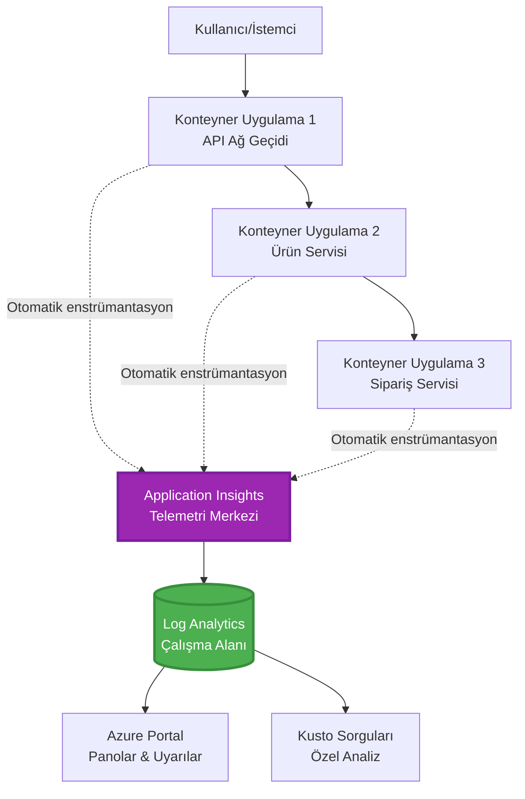
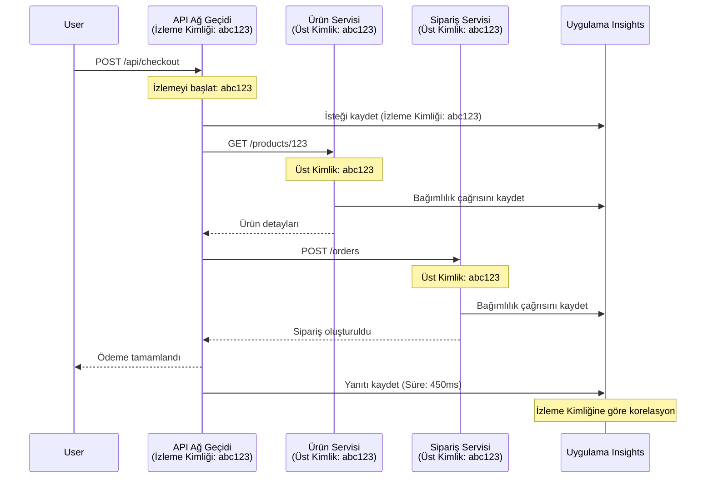

# Application Insights'in AZD ile Entegrasyonu

⏱️ **Tahmini Süre**: 40-50 dakika | 💰 **Maliyet Etkisi**: ~$5-15/ay | ⭐ **Zorluk**: Orta

**📚 Öğrenme Yolu:**
- ← Önceki: [Preflight Checks](preflight-checks.md) - Dağıtımdan önce doğrulama
- 🎯 **Buradasınız**: Application Insights Entegrasyonu (İzleme, telemetri, hata ayıklama)
- → Sonraki: [Dağıtım Kılavuzu](../chapter-04-infrastructure/deployment-guide.md) - Azure'a dağıtım
- 🏠 [Kurs Anasayfası](../../README.md)

---

## Bu Derste Neler Öğreneceksiniz

Bu dersi tamamlayarak şunları yapabileceksiniz:
- **Application Insights**'ı AZD projelerine otomatik olarak entegre etmek
- Mikro hizmetler için **dağıtık izlemeyi** yapılandırmak
- **Özel telemetri** (metrikler, olaylar, bağımlılıklar) uygulamak
- Gerçek zamanlı izleme için **Canlı Metrikler** kurmak
- AZD dağıtımlarından **uyarılar ve panolar** oluşturmak
- **Telemetri sorguları** ile üretim sorunlarını hata ayıklamak
- **Maliyetler ve örnekleme** stratejilerini optimize etmek
- **AI/LLM uygulamalarını** izlemek (token kullanımı, gecikme, maliyetler)

## Neden AZD ile Application Insights Önemli

### Zorluk: Üretimde Gözlemlenebilirlik

**Application Insights olmadan:**
```
❌ No visibility into production behavior
❌ Manual log aggregation across services
❌ Reactive debugging (wait for customer complaints)
❌ No performance metrics
❌ Cannot trace requests across services
❌ Unknown failure rates and bottlenecks
```

**Application Insights + AZD ile:**
```
✅ Automatic telemetry collection
✅ Centralized logs from all services
✅ Proactive issue detection
✅ End-to-end request tracing
✅ Performance metrics and insights
✅ Real-time dashboards
✅ AZD provisions everything automatically
```

**Benzetme**: Application Insights, uygulamanız için bir "kara kutu" uçuş kaydedici + kokpit gösterge paneline sahip olmak gibidir. Gerçek zamanlı olarak olan her şeyi görürsünüz ve herhangi bir olayı tekrar oynatabilirsiniz.

---

## Mimari Genel Bakış

### AZD Mimarisinde Application Insights


### Otomatik Olarak İzlenenler

| Telemetry Type | What It Captures | Use Case |
|----------------|------------------|----------|
| **İstekler** | HTTP istekleri, durum kodları, süre | API performans izleme |
| **Bağımlılıklar** | Harici çağrılar (DB, API'ler, depolama) | Darboğazları belirleme |
| **İstisnalar** | Yığın izleriyle yakalanmamış hatalar | Arızaların hata ayıklanması |
| **Özel Olaylar** | İş olayları (kayıt, satın alma) | Analitik ve dönüşüm hunileri |
| **Metrikler** | Performans sayaçları, özel metrikler | Kapasite planlaması |
| **İzler** | Önem düzeyine göre günlük mesajları | Hata ayıklama ve denetleme |
| **Kullanılabilirlik** | Çalışma süresi ve yanıt süresi testleri | SLA izleme |

---

## Ön Koşullar

### Gerekli Araçlar

```bash
# Azure Developer CLI'yi doğrulayın
azd version
# ✅ Beklenen: azd sürüm 1.0.0 veya daha yüksek

# Azure CLI'yi doğrulayın
az --version
# ✅ Beklenen: azure-cli 2.50.0 veya daha yüksek
```

### Azure Gereksinimleri

- Aktif bir Azure aboneliği
- Oluşturma izinleri:
  - Application Insights kaynakları
  - Log Analytics çalışma alanları
  - Container Apps
  - Kaynak grupları

### Bilgi Önkoşulları

Tamamlamış olmanız gerekir:
- [AZD Temelleri](../chapter-01-foundation/azd-basics.md) - Temel AZD kavramları
- [Konfigürasyon](../chapter-03-configuration/configuration.md) - Ortam kurulumu
- [İlk Proje](../chapter-01-foundation/first-project.md) - Temel dağıtım

---

## Ders 1: AZD ile Otomatik Application Insights

### AZD'in Application Insights'ı Nasıl Sağladığı

AZD dağıttığınızda Application Insights'ı otomatik olarak oluşturur ve yapılandırır. Nasıl çalıştığını görelim.

### Proje Yapısı

```
monitored-app/
├── azure.yaml                     # AZD configuration
├── infra/
│   ├── main.bicep                # Main infrastructure
│   ├── core/
│   │   └── monitoring.bicep      # Application Insights + Log Analytics
│   └── app/
│       └── api.bicep             # Container App with monitoring
└── src/
    ├── app.py                    # Application with telemetry
    ├── requirements.txt
    └── Dockerfile
```

---

### Adım 1: AZD'yi yapılandırma (azure.yaml)

**Dosya: `azure.yaml`**

```yaml
name: monitored-app
metadata:
  template: monitored-app@1.0.0

services:
  api:
    project: ./src
    language: python
    host: containerapp

# AZD automatically provisions monitoring!
```

**Hepsi bu!** AZD varsayılan olarak Application Insights'ı oluşturacaktır. Temel izleme için ekstra yapılandırma gerekmez.

---

### Adım 2: İzleme Altyapısı (Bicep)

**Dosya: `infra/core/monitoring.bicep`**

```bicep
param logAnalyticsName string
param applicationInsightsName string
param location string = resourceGroup().location
param tags object = {}

// Log Analytics Workspace (required for Application Insights)
resource logAnalytics 'Microsoft.OperationalInsights/workspaces@2022-10-01' = {
  name: logAnalyticsName
  location: location
  tags: tags
  properties: {
    sku: {
      name: 'PerGB2018'  // Pay-as-you-go pricing
    }
    retentionInDays: 30  // Keep logs for 30 days
    features: {
      enableLogAccessUsingOnlyResourcePermissions: true
    }
  }
}

// Application Insights
resource applicationInsights 'Microsoft.Insights/components@2020-02-02' = {
  name: applicationInsightsName
  location: location
  tags: tags
  kind: 'web'
  properties: {
    Application_Type: 'web'
    WorkspaceResourceId: logAnalytics.id
    IngestionMode: 'LogAnalytics'
    publicNetworkAccessForIngestion: 'Enabled'
    publicNetworkAccessForQuery: 'Enabled'
  }
}

// Outputs for Container Apps
output logAnalyticsWorkspaceId string = logAnalytics.id
output logAnalyticsWorkspaceName string = logAnalytics.name
output applicationInsightsConnectionString string = applicationInsights.properties.ConnectionString
output applicationInsightsInstrumentationKey string = applicationInsights.properties.InstrumentationKey
output applicationInsightsName string = applicationInsights.name
```

---

### Adım 3: Container Uygulamayı Application Insights'a Bağlama

**Dosya: `infra/app/api.bicep`**

```bicep
param name string
param location string
param tags object = {}
param containerAppsEnvironmentName string
param applicationInsightsConnectionString string

resource containerApp 'Microsoft.App/containerApps@2023-05-01' = {
  name: name
  location: location
  tags: tags
  properties: {
    configuration: {
      ingress: {
        external: true
        targetPort: 8000
      }
      secrets: [
        {
          name: 'appinsights-connection-string'
          value: applicationInsightsConnectionString
        }
      ]
    }
    template: {
      containers: [
        {
          name: 'api'
          image: 'myregistry.azurecr.io/api:latest'
          resources: {
            cpu: json('0.5')
            memory: '1Gi'
          }
          env: [
            {
              name: 'APPLICATIONINSIGHTS_CONNECTION_STRING'
              secretRef: 'appinsights-connection-string'
            }
            {
              name: 'APPLICATIONINSIGHTS_ENABLED'
              value: 'true'
            }
          ]
        }
      ]
    }
  }
}

output uri string = 'https://${containerApp.properties.configuration.ingress.fqdn}'
```

---

### Adım 4: Telemetri ile Uygulama Kodu

**Dosya: `src/app.py`**

```python
from flask import Flask, request, jsonify
from opencensus.ext.azure.log_exporter import AzureLogHandler
from opencensus.ext.azure.trace_exporter import AzureExporter
from opencensus.ext.flask.flask_middleware import FlaskMiddleware
from opencensus.trace.samplers import ProbabilitySampler
import logging
import os

app = Flask(__name__)

# Application Insights bağlantı dizesini alın
connection_string = os.environ.get('APPLICATIONINSIGHTS_CONNECTION_STRING')

if connection_string:
    # Dağıtık izlemeyi yapılandırın
    middleware = FlaskMiddleware(
        app,
        exporter=AzureExporter(connection_string=connection_string),
        sampler=ProbabilitySampler(rate=1.0)  # Geliştirme için %100 örnekleme
    )
    
    # Günlüklemeyi yapılandırın
    logger = logging.getLogger(__name__)
    logger.addHandler(AzureLogHandler(connection_string=connection_string))
    logger.setLevel(logging.INFO)
    
    print("✅ Application Insights enabled")
else:
    logger = logging.getLogger(__name__)
    logger.setLevel(logging.INFO)
    print("⚠️ Application Insights not configured")

@app.route('/health')
def health():
    logger.info('Health check endpoint called')
    return jsonify({'status': 'healthy', 'monitoring': 'enabled'})

@app.route('/api/products')
def get_products():
    logger.info('Fetching products')
    
    # Veritabanı çağrısını simüle edin (otomatik olarak bir bağımlılık olarak izlenir)
    products = [
        {'id': 1, 'name': 'Laptop', 'price': 999.99},
        {'id': 2, 'name': 'Mouse', 'price': 29.99},
        {'id': 3, 'name': 'Keyboard', 'price': 79.99}
    ]
    
    logger.info(f'Returned {len(products)} products')
    return jsonify(products)

@app.route('/api/error-test')
def error_test():
    """Test error tracking"""
    logger.error('Testing error tracking')
    try:
        raise ValueError('This is a test exception')
    except Exception as e:
        logger.exception('Exception occurred in error-test endpoint')
        return jsonify({'error': str(e)}), 500

@app.route('/api/slow')
def slow_endpoint():
    """Test performance tracking"""
    import time
    logger.info('Slow endpoint called')
    time.sleep(3)  # Yavaş işlemi simüle edin
    logger.warning('Endpoint took 3 seconds to respond')
    return jsonify({'message': 'Slow operation completed'})

if __name__ == '__main__':
    app.run(host='0.0.0.0', port=8000)
```

**Dosya: `src/requirements.txt`**

```txt
Flask==3.0.0
opencensus-ext-azure==1.1.13
opencensus-ext-flask==0.8.1
gunicorn==21.2.0
```

---

### Adım 5: Dağıt ve Doğrula

```bash
# AZD'yi başlat
azd init

# Dağıt (Application Insights'ı otomatik olarak sağlar)
azd up

# Uygulama URL'sini al
APP_URL=$(azd env get-values | grep API_URL | cut -d '=' -f2 | tr -d '"')

# Telemetri oluştur
curl $APP_URL/health
curl $APP_URL/api/products
curl $APP_URL/api/error-test
curl $APP_URL/api/slow
```

**✅ Beklenen çıktı:**
```json
{
  "status": "healthy",
  "monitoring": "enabled"
}
```

---

### Adım 6: Telemetrileri Azure Portal'da Görüntüleme

```bash
# Application Insights ayrıntılarını al
azd env get-values | grep APPLICATIONINSIGHTS

# Azure Portal'da aç
az monitor app-insights component show \
  --app $(azd env get-values | grep APPLICATIONINSIGHTS_NAME | cut -d '=' -f2 | tr -d '"') \
  --resource-group $(azd env get-values | grep AZURE_RESOURCE_GROUP | cut -d '=' -f2 | tr -d '"') \
  --query "appId" -o tsv
```

**Azure Portal'a gidin → Application Insights → Transaction Search**

Şunları görmelisiniz:
- ✅ Durum kodlarıyla HTTP istekleri
- ✅ İstek süresi (`/api/slow` için 3+ saniye)
- ✅ `/api/error-test` ile oluşan istisna detayları
- ✅ Özel günlük mesajları

---

## Ders 2: Özel Telemetri ve Olaylar

### İş Olaylarını İzleme

İş açısından kritik olaylar için özel telemetri ekleyelim.

**Dosya: `src/telemetry.py`**

```python
from opencensus.ext.azure import metrics_exporter
from opencensus.stats import aggregation as aggregation_module
from opencensus.stats import measure as measure_module
from opencensus.stats import stats as stats_module
from opencensus.stats import view as view_module
from opencensus.tags import tag_map as tag_map_module
from opencensus.ext.azure.log_exporter import AzureLogHandler
from opencensus.ext.azure.trace_exporter import AzureExporter
from opencensus.trace import tracer as tracer_module
import logging
import os

class TelemetryClient:
    """Custom telemetry client for Application Insights"""
    
    def __init__(self, connection_string=None):
        self.connection_string = connection_string or os.environ.get('APPLICATIONINSIGHTS_CONNECTION_STRING')
        
        if not self.connection_string:
            print("⚠️ Application Insights connection string not found")
            return
        
        # Günlükleyiciyi ayarla
        self.logger = logging.getLogger(__name__)
        self.logger.addHandler(AzureLogHandler(connection_string=self.connection_string))
        self.logger.setLevel(logging.INFO)
        
        # Metrik ihracatçısını ayarla
        self.stats = stats_module.stats
        self.view_manager = self.stats.view_manager
        self.stats_recorder = self.stats.stats_recorder
        
        exporter = metrics_exporter.new_metrics_exporter(
            connection_string=self.connection_string
        )
        self.view_manager.register_exporter(exporter)
        
        # İzleyiciyi ayarla
        self.tracer = tracer_module.Tracer(
            exporter=AzureExporter(connection_string=self.connection_string)
        )
        
        print("✅ Custom telemetry client initialized")
    
    def track_event(self, event_name: str, properties: dict = None):
        """Track custom business event"""
        properties = properties or {}
        self.logger.info(
            f"CustomEvent: {event_name}",
            extra={
                'custom_dimensions': {
                    'event_name': event_name,
                    **properties
                }
            }
        )
    
    def track_metric(self, metric_name: str, value: float, properties: dict = None):
        """Track custom metric"""
        properties = properties or {}
        self.logger.info(
            f"CustomMetric: {metric_name} = {value}",
            extra={
                'custom_dimensions': {
                    'metric_name': metric_name,
                    'value': value,
                    **properties
                }
            }
        )
    
    def track_dependency(self, name: str, dependency_type: str, duration: float, success: bool):
        """Track external dependency call"""
        with self.tracer.span(name=name) as span:
            span.add_attribute('dependency.type', dependency_type)
            span.add_attribute('duration', duration)
            span.add_attribute('success', success)

# Küresel telemetri istemcisi
telemetry = TelemetryClient()
```

### Uygulamayı Özel Olaylarla Güncelleme

**Dosya: `src/app.py` (geliştirilmiş)**

```python
from flask import Flask, request, jsonify
from telemetry import telemetry
import time
import random

app = Flask(__name__)

@app.route('/api/purchase', methods=['POST'])
def purchase():
    """Track purchase event with custom telemetry"""
    data = request.json
    product_id = data.get('product_id')
    quantity = data.get('quantity', 1)
    price = data.get('price', 0)
    
    # İş etkinliğini takip et
    telemetry.track_event('Purchase', {
        'product_id': product_id,
        'quantity': quantity,
        'total_amount': price * quantity,
        'user_id': request.headers.get('X-User-Id', 'anonymous')
    })
    
    # Gelir metriğini takip et
    telemetry.track_metric('Revenue', price * quantity, {
        'product_id': product_id,
        'currency': 'USD'
    })
    
    return jsonify({
        'order_id': f'ORD-{random.randint(1000, 9999)}',
        'status': 'confirmed',
        'total': price * quantity
    })

@app.route('/api/search')
def search():
    """Track search queries"""
    query = request.args.get('q', '')
    
    start_time = time.time()
    
    # Aramayı simüle et (gerçek bir veritabanı sorgusu olurdu)
    results = [{'id': 1, 'name': f'Result for {query}'}]
    
    duration = (time.time() - start_time) * 1000  # ms'ye dönüştür
    
    # Arama etkinliğini takip et
    telemetry.track_event('Search', {
        'query': query,
        'results_count': len(results),
        'duration_ms': duration
    })
    
    # Arama performans metriğini takip et
    telemetry.track_metric('SearchDuration', duration, {
        'query_length': len(query)
    })
    
    return jsonify({'results': results, 'count': len(results)})

@app.route('/api/external-call')
def external_call():
    """Track external API dependency"""
    import requests
    
    start_time = time.time()
    success = True
    
    try:
        # Harici API çağrısını simüle et
        response = requests.get('https://api.example.com/data', timeout=5)
        result = response.json()
    except Exception as e:
        success = False
        result = {'error': str(e)}
    
    duration = (time.time() - start_time) * 1000
    
    # Bağımlılığı takip et
    telemetry.track_dependency(
        name='ExternalAPI',
        dependency_type='HTTP',
        duration=duration,
        success=success
    )
    
    return jsonify(result)

if __name__ == '__main__':
    app.run(host='0.0.0.0', port=8000)
```

### Özel Telemetriyi Test Etme

```bash
# Satın alma etkinliğini izle
curl -X POST $APP_URL/api/purchase \
  -H "Content-Type: application/json" \
  -H "X-User-Id: user123" \
  -d '{"product_id": 1, "quantity": 2, "price": 29.99}'

# Arama etkinliğini izle
curl "$APP_URL/api/search?q=laptop"

# Harici bağımlılığı izle
curl $APP_URL/api/external-call
```

**Azure Portal'da Görüntüle:**

Application Insights → Logs bölümüne gidin, ardından şunu çalıştırın:

```kusto
// View purchase events
traces
| where customDimensions.event_name == "Purchase"
| project 
    timestamp,
    product_id = tostring(customDimensions.product_id),
    total_amount = todouble(customDimensions.total_amount),
    user_id = tostring(customDimensions.user_id)
| order by timestamp desc

// View revenue metrics
traces
| where customDimensions.metric_name == "Revenue"
| summarize TotalRevenue = sum(todouble(customDimensions.value)) by bin(timestamp, 1h)
| render timechart

// View search performance
traces
| where customDimensions.event_name == "Search"
| summarize 
    AvgDuration = avg(todouble(customDimensions.duration_ms)),
    SearchCount = count()
  by bin(timestamp, 5m)
| render timechart
```

---

## Ders 3: Mikro Hizmetler için Dağıtık İzleme

### Hizmetler Arası İzlemeyi Etkinleştirme

Mikro hizmetlerde Application Insights, hizmetler arasında istekleri otomatik olarak ilişkilendirir.

**Dosya: `infra/main.bicep`**

```bicep
targetScope = 'subscription'

param environmentName string
param location string = 'eastus'

var tags = { 'azd-env-name': environmentName }

resource rg 'Microsoft.Resources/resourceGroups@2021-04-01' = {
  name: 'rg-${environmentName}'
  location: location
  tags: tags
}

// Monitoring (shared by all services)
module monitoring './core/monitoring.bicep' = {
  name: 'monitoring'
  scope: rg
  params: {
    logAnalyticsName: 'log-${environmentName}'
    applicationInsightsName: 'appi-${environmentName}'
    location: location
    tags: tags
  }
}

// API Gateway
module apiGateway './app/api-gateway.bicep' = {
  name: 'api-gateway'
  scope: rg
  params: {
    name: 'ca-gateway-${environmentName}'
    location: location
    tags: union(tags, { 'azd-service-name': 'gateway' })
    applicationInsightsConnectionString: monitoring.outputs.applicationInsightsConnectionString
  }
}

// Product Service
module productService './app/product-service.bicep' = {
  name: 'product-service'
  scope: rg
  params: {
    name: 'ca-products-${environmentName}'
    location: location
    tags: union(tags, { 'azd-service-name': 'products' })
    applicationInsightsConnectionString: monitoring.outputs.applicationInsightsConnectionString
  }
}

// Order Service
module orderService './app/order-service.bicep' = {
  name: 'order-service'
  scope: rg
  params: {
    name: 'ca-orders-${environmentName}'
    location: location
    tags: union(tags, { 'azd-service-name': 'orders' })
    applicationInsightsConnectionString: monitoring.outputs.applicationInsightsConnectionString
  }
}

output APPLICATIONINSIGHTS_CONNECTION_STRING string = monitoring.outputs.applicationInsightsConnectionString
output GATEWAY_URL string = apiGateway.outputs.uri
```

### Uçtan Uca İşlemi Görüntüleme


**Uçtan uca izi sorgula:**

```kusto
// Find complete request flow
let traceId = "abc123...";  // Get from response header
dependencies
| union requests
| where operation_Id == traceId
| project 
    timestamp,
    type = itemType,
    name,
    duration,
    success,
    cloud_RoleName
| order by timestamp asc
```

---

## Ders 4: Canlı Metrikler ve Gerçek Zamanlı İzleme

### Canlı Metrikler Akışını Etkinleştirme

Canlı Metrikler, <1 saniye gecikmeyle gerçek zamanlı telemetri sağlar.

**Live Metrics'e Erişim:**

```bash
# Application Insights kaynağını al
APPI_NAME=$(azd env get-values | grep APPLICATIONINSIGHTS_NAME | cut -d '=' -f2 | tr -d '"')

# Kaynak grubunu al
RG_NAME=$(azd env get-values | grep AZURE_RESOURCE_GROUP | cut -d '=' -f2 | tr -d '"')

echo "Navigate to: Azure Portal → Resource Groups → $RG_NAME → $APPI_NAME → Live Metrics"
```

**Gerçek zamanda gördükleriniz:**
- ✅ Gelen istek oranı (istek/sn)
- ✅ Giden bağımlılık çağrıları
- ✅ İstisna sayısı
- ✅ CPU ve bellek kullanımı
- ✅ Aktif sunucu sayısı
- ✅ Örnek telemetri

### Test için Yük Oluşturma

```bash
# Canlı metrikleri görmek için yük oluşturun
for i in {1..100}; do
  curl $APP_URL/api/products &
  curl $APP_URL/api/search?q=test$i &
done

# Azure Portal'da canlı metrikleri izleyin
# İstek oranında bir sıçrama görmelisiniz
```

---

## Pratik Alıştırmalar

### Alıştırma 1: Uyarılar Kurma ⭐⭐ (Orta)

**Hedef**: Yüksek hata oranları ve yavaş yanıtlar için uyarılar oluşturmak.

**Adımlar:**

1. **Hata oranı için uyarı oluşturun:**

```bash
# Application Insights kaynak kimliğini al
APPI_ID=$(az monitor app-insights component show \
  --app $APPI_NAME \
  --resource-group $RG_NAME \
  --query "id" -o tsv)

# Başarısız istekler için metrik uyarısı oluştur
az monitor metrics alert create \
  --name "High-Error-Rate" \
  --resource-group $RG_NAME \
  --scopes $APPI_ID \
  --condition "count requests/failed > 10" \
  --window-size 5m \
  --evaluation-frequency 1m \
  --description "Alert when error rate exceeds 10 per 5 minutes"
```

2. **Yavaş yanıtlar için uyarı oluşturun:**

```bash
az monitor metrics alert create \
  --name "Slow-Responses" \
  --resource-group $RG_NAME \
  --scopes $APPI_ID \
  --condition "avg requests/duration > 3000" \
  --window-size 5m \
  --evaluation-frequency 1m \
  --description "Alert when average response time exceeds 3 seconds"
```

3. **Bicep ile uyarı oluşturun (AZD için önerilen):**

**Dosya: `infra/core/alerts.bicep`**

```bicep
param applicationInsightsId string
param actionGroupId string = ''
param location string = resourceGroup().location

// High error rate alert
resource errorRateAlert 'Microsoft.Insights/metricAlerts@2018-03-01' = {
  name: 'high-error-rate'
  location: 'global'
  properties: {
    description: 'Alert when error rate exceeds threshold'
    severity: 2
    enabled: true
    scopes: [
      applicationInsightsId
    ]
    evaluationFrequency: 'PT1M'
    windowSize: 'PT5M'
    criteria: {
      'odata.type': 'Microsoft.Azure.Monitor.SingleResourceMultipleMetricCriteria'
      allOf: [
        {
          name: 'Error rate'
          metricName: 'requests/failed'
          operator: 'GreaterThan'
          threshold: 10
          timeAggregation: 'Count'
        }
      ]
    }
    actions: actionGroupId != '' ? [
      {
        actionGroupId: actionGroupId
      }
    ] : []
  }
}

// Slow response alert
resource slowResponseAlert 'Microsoft.Insights/metricAlerts@2018-03-01' = {
  name: 'slow-responses'
  location: 'global'
  properties: {
    description: 'Alert when response time is too high'
    severity: 3
    enabled: true
    scopes: [
      applicationInsightsId
    ]
    evaluationFrequency: 'PT1M'
    windowSize: 'PT5M'
    criteria: {
      'odata.type': 'Microsoft.Azure.Monitor.SingleResourceMultipleMetricCriteria'
      allOf: [
        {
          name: 'Response duration'
          metricName: 'requests/duration'
          operator: 'GreaterThan'
          threshold: 3000
          timeAggregation: 'Average'
        }
      ]
    }
  }
}

output errorAlertId string = errorRateAlert.id
output slowResponseAlertId string = slowResponseAlert.id
```

4. **Uyarıları test edin:**

```bash
# Hatalar oluştur
for i in {1..20}; do
  curl $APP_URL/api/error-test
done

# Yavaş yanıtlar oluştur
for i in {1..10}; do
  curl $APP_URL/api/slow
done

# Uyarı durumunu kontrol et (5-10 dakika bekle)
az monitor metrics alert list \
  --resource-group $RG_NAME \
  --query "[].{Name:name, Enabled:enabled, State:properties.enabled}" \
  --output table
```

**✅ Başarı Kriterleri:**
- ✅ Uyarılar başarıyla oluşturuldu
- ✅ Eşikler aşıldığında uyarılar tetiklenir
- ✅ Azure Portal'da uyarı geçmişi görüntülenebilir
- ✅ AZD dağıtımıyla entegre

**Zaman**: 20-25 dakika

---

### Alıştırma 2: Özel Pano Oluşturma ⭐⭐ (Orta)

**Hedef**: Temel uygulama metriklerini gösteren bir pano oluşturmak.

**Adımlar:**

1. **Azure Portal üzerinden pano oluşturun:**

Şuraya gidin: Azure Portal → Dashboards → New Dashboard

2. **Önemli metrikler için kutucuklar ekleyin:**

- İstek sayısı (son 24 saat)
- Ortalama yanıt süresi
- Hata oranı
- En yavaş ilk 5 işlem
- Kullanıcıların coğrafi dağılımı

3. **Bicep ile pano oluşturun:**

**Dosya: `infra/core/dashboard.bicep`**

```bicep
param dashboardName string
param applicationInsightsId string
param location string = resourceGroup().location

resource dashboard 'Microsoft.Portal/dashboards@2020-09-01-preview' = {
  name: dashboardName
  location: location
  properties: {
    lenses: [
      {
        order: 0
        parts: [
          // Request count
          {
            position: { x: 0, y: 0, rowSpan: 4, colSpan: 6 }
            metadata: {
              type: 'Extension/Microsoft_OperationsManagementSuite_Workspace/PartType/LogsDashboardPart'
              inputs: [
                {
                  name: 'resourceId'
                  value: applicationInsightsId
                }
                {
                  name: 'query'
                  value: '''
                    requests
                    | summarize RequestCount = count() by bin(timestamp, 1h)
                    | render timechart
                  '''
                }
              ]
            }
          }
          // Error rate
          {
            position: { x: 6, y: 0, rowSpan: 4, colSpan: 6 }
            metadata: {
              type: 'Extension/Microsoft_OperationsManagementSuite_Workspace/PartType/LogsDashboardPart'
              inputs: [
                {
                  name: 'resourceId'
                  value: applicationInsightsId
                }
                {
                  name: 'query'
                  value: '''
                    requests
                    | summarize 
                        Total = count(),
                        Failed = countif(success == false)
                    | extend ErrorRate = (Failed * 100.0) / Total
                    | project ErrorRate
                  '''
                }
              ]
            }
          }
        ]
      }
    ]
  }
}

output dashboardId string = dashboard.id
```

4. **Panoyu dağıtın:**

```bash
# main.bicep'e ekle
module dashboard './core/dashboard.bicep' = {
  name: 'dashboard'
  scope: rg
  params: {
    dashboardName: 'dashboard-${environmentName}'
    applicationInsightsId: monitoring.outputs.applicationInsightsId
    location: location
  }
}

# Dağıt
azd up
```

**✅ Başarı Kriterleri:**
- ✅ Pano temel metrikleri gösteriyor
- ✅ Azure Portal ana sayfasına sabitleyebilir
- ✅ Gerçek zamanlı güncellenir
- ✅ AZD ile dağıtılabilir

**Zaman**: 25-30 dakika

---

### Alıştırma 3: AI/LLM Uygulamasını İzleme ⭐⭐⭐ (İleri)

**Hedef**: Microsoft Foundry Modelleri kullanımını izlemek (token'lar, maliyetler, gecikme).

**Adımlar:**

1. **AI izleme sarıcı (wrapper) oluşturun:**

**Dosya: `src/ai_telemetry.py`**

```python
from telemetry import telemetry
from openai import AzureOpenAI
import time

class MonitoredAzureOpenAI:
    """Microsoft Foundry Models client with automatic telemetry"""
    
    def __init__(self, api_key, endpoint, api_version="2024-02-01"):
        self.client = AzureOpenAI(
            api_key=api_key,
            api_version=api_version,
            azure_endpoint=endpoint
        )
    
    def chat_completion(self, model: str, messages: list, **kwargs):
        """Track chat completion with telemetry"""
        start_time = time.time()
        
        try:
            # Microsoft Foundry Modellerini çağır
            response = self.client.chat.completions.create(
                model=model,
                messages=messages,
                **kwargs
            )
            
            duration = (time.time() - start_time) * 1000  # ms
            
            # Kullanımı çıkar
            usage = response.usage
            prompt_tokens = usage.prompt_tokens
            completion_tokens = usage.completion_tokens
            total_tokens = usage.total_tokens
            
            # Maliyeti hesapla (gpt-4.1 fiyatlandırması)
            prompt_cost = (prompt_tokens / 1000) * 0.03  # $0.03 her 1K token için
            completion_cost = (completion_tokens / 1000) * 0.06  # $0.06 her 1K token için
            total_cost = prompt_cost + completion_cost
            
            # Özel etkinliği izle
            telemetry.track_event('OpenAI_Request', {
                'model': model,
                'prompt_tokens': prompt_tokens,
                'completion_tokens': completion_tokens,
                'total_tokens': total_tokens,
                'duration_ms': duration,
                'cost_usd': total_cost,
                'success': True
            })
            
            # Metrikleri izle
            telemetry.track_metric('OpenAI_Tokens', total_tokens, {
                'model': model,
                'type': 'total'
            })
            
            telemetry.track_metric('OpenAI_Cost', total_cost, {
                'model': model,
                'currency': 'USD'
            })
            
            telemetry.track_metric('OpenAI_Duration', duration, {
                'model': model
            })
            
            return response
            
        except Exception as e:
            duration = (time.time() - start_time) * 1000
            
            telemetry.track_event('OpenAI_Request', {
                'model': model,
                'duration_ms': duration,
                'success': False,
                'error': str(e)
            })
            
            raise
```

2. **İzlenen istemciyi kullanın:**

```python
from flask import Flask, request, jsonify
from ai_telemetry import MonitoredAzureOpenAI
import os

app = Flask(__name__)

# İzlenen OpenAI istemcisini başlatın
openai_client = MonitoredAzureOpenAI(
    api_key=os.environ['AZURE_OPENAI_API_KEY'],
    endpoint=os.environ['AZURE_OPENAI_ENDPOINT']
)

@app.route('/api/chat', methods=['POST'])
def chat():
    data = request.json
    user_message = data.get('message')
    
    # Otomatik izleme ile çağırın
    response = openai_client.chat_completion(
        model='gpt-4.1',
        messages=[
            {'role': 'user', 'content': user_message}
        ]
    )
    
    return jsonify({
        'response': response.choices[0].message.content,
        'tokens': response.usage.total_tokens
    })
```

3. **AI metriklerini sorgulayın:**

```kusto
// Total AI spend over time
traces
| where customDimensions.event_name == "OpenAI_Request"
| where customDimensions.success == "True"
| summarize TotalCost = sum(todouble(customDimensions.cost_usd)) by bin(timestamp, 1h)
| render timechart

// Token usage by model
traces
| where customDimensions.event_name == "OpenAI_Request"
| summarize 
    TotalTokens = sum(toint(customDimensions.total_tokens)),
    RequestCount = count()
  by Model = tostring(customDimensions.model)

// Average latency
traces
| where customDimensions.event_name == "OpenAI_Request"
| summarize AvgDuration = avg(todouble(customDimensions.duration_ms))
| project AvgDurationSeconds = AvgDuration / 1000

// Cost per request
traces
| where customDimensions.event_name == "OpenAI_Request"
| extend Cost = todouble(customDimensions.cost_usd)
| summarize 
    TotalCost = sum(Cost),
    RequestCount = count(),
    AvgCostPerRequest = avg(Cost)
```

**✅ Başarı Kriterleri:**
- ✅ Her OpenAI çağrısı otomatik olarak izleniyor
- ✅ Token kullanımı ve maliyetleri görünür
- ✅ Gecikme izleniyor
- ✅ Bütçe uyarıları ayarlanabilir

**Zaman**: 35-45 dakika

---

## Maliyet Optimizasyonu

### Örnekleme Stratejileri

Telemetriyi örnekleyerek maliyetleri kontrol edin:

```python
from opencensus.trace.samplers import ProbabilitySampler

# Geliştirme: %100 örnekleme
sampler = ProbabilitySampler(rate=1.0)

# Üretim: %10 örnekleme (maliyetleri %90 azaltır)
sampler = ProbabilitySampler(rate=0.1)

# Uyarlanabilir örnekleme (otomatik olarak ayarlanır)
from opencensus.trace.samplers import AdaptiveSampler
sampler = AdaptiveSampler()
```

**Bicep'te:**

```bicep
resource applicationInsights 'Microsoft.Insights/components@2020-02-02' = {
  name: applicationInsightsName
  properties: {
    SamplingPercentage: 10  // 10% sampling
  }
}
```

### Veri Saklama

```bicep
resource logAnalytics 'Microsoft.OperationalInsights/workspaces@2022-10-01' = {
  name: logAnalyticsName
  properties: {
    retentionInDays: 30  // Minimum (cheapest)
    // Options: 30, 31, 60, 90, 120, 180, 270, 365, 550, 730
  }
}
```

### Aylık Maliyet Tahminleri

| Veri Hacmi | Saklama Süresi | Aylık Maliyet |
|-------------|-----------|--------------|
| 1 GB/ay | 30 gün | ~$2-5 |
| 5 GB/ay | 30 gün | ~$10-15 |
| 10 GB/ay | 90 gün | ~$25-40 |
| 50 GB/ay | 90 gün | ~$100-150 |

**Ücretsiz katman**: ayda 5 GB dahil

---

## Bilgi Kontrol Noktası

### 1. Temel Entegrasyon ✓

Anlayışınızı test edin:

- [ ] **Q1**: AZD Application Insights'ı nasıl sağlar?
  -   - **A**: Bicep şablonları aracılığıyla otomatik olarak `infra/core/monitoring.bicep` içinde

- [ ] **Q2**: Application Insights'ı etkinleştiren çevresel değişken hangisidir?
  -   - **A**: `APPLICATIONINSIGHTS_CONNECTION_STRING`

- [ ] **Q3**: Üç ana telemetri türü nelerdir?
  -   - **A**: İstekler (HTTP çağrıları), Bağımlılıklar (harici çağrılar), İstisnalar (hatalar)

**Uygulamalı Doğrulama:**
```bash
# Application Insights'ın yapılandırılmış olup olmadığını kontrol et
azd env get-values | grep APPLICATIONINSIGHTS

# Telemetri akışını doğrula
az monitor app-insights metrics show \
  --app $APPI_NAME \
  --resource-group $RG_NAME \
  --metric "requests/count"
```

---

### 2. Özel Telemetri ✓

Anlayışınızı test edin:

- [ ] **Q1**: Özel iş olaylarını nasıl izlersiniz?
  -   - **A**: Logger'ı `custom_dimensions` ile kullanın veya `TelemetryClient.track_event()`'i kullanın

- [ ] **Q2**: Olaylar ile metrikler arasındaki fark nedir?
  -   - **A**: Olaylar ayrı gerçekleşimlerdir, metrikler sayısal ölçümlerdir

- [ ] **Q3**: Hizmetler arasında telemetriyi nasıl ilişkilendirirsiniz?
  -   - **A**: Application Insights ilişkilendirme için otomatik olarak `operation_Id` kullanır

**Uygulamalı Doğrulama:**
```kusto
// Verify custom events
traces
| where customDimensions.event_name != ""
| summarize count() by tostring(customDimensions.event_name)
```

---

### 3. Üretim İzleme ✓

Anlayışınızı test edin:

- [ ] **Q1**: Örnekleme nedir ve neden kullanılır?
  -   - **A**: Örnekleme, sadece telemetrinin bir yüzdesini yakalayarak veri hacmini (ve maliyeti) azaltır

- [ ] **Q2**: Uyarıları nasıl kurarsınız?
  -   - **A**: Application Insights metriklerine dayalı olarak Bicep veya Azure Portal'da metrik uyarıları kullanın

- [ ] **Q3**: Log Analytics ile Application Insights arasındaki fark nedir?
  -   - **A**: Application Insights verileri Log Analytics çalışma alanında depolar; App Insights uygulamaya özgü görünümler sağlar

**Uygulamalı Doğrulama:**
```bash
# Örnekleme yapılandırmasını kontrol edin
az monitor app-insights component show \
  --app $APPI_NAME \
  --resource-group $RG_NAME \
  --query "properties.SamplingPercentage"
```

---

## En İyi Uygulamalar

### ✅ YAPIN:

1. **Korelasyon ID'leri kullanın**
   ```python
   logger.info('Processing order', extra={
       'custom_dimensions': {
           'order_id': order_id,
           'user_id': user_id
       }
   })
   ```

2. **Kritik metrikler için uyarılar kurun**
   ```bicep
   // Error rate, slow responses, availability
   ```

3. **Yapılandırılmış günlükleme kullanın**
   ```python
   # ✅ İYİ: Yapısal
   logger.info('User signup', extra={'custom_dimensions': {'user_id': 123}})
   
   # ❌ KÖTÜ: Yapısal olmayan
   logger.info(f'User 123 signed up')
   ```

4. **Bağımlılıkları izleyin**
   ```python
   # Veritabanı çağrılarını, HTTP isteklerini vb. otomatik olarak izleyin.
   ```

5. **Dağıtımlar sırasında Live Metrics kullanın**

### ❌ YAPMAYIN:

1. **Hassas verileri kaydetmeyin**
   ```python
   # ❌ KÖTÜ
   logger.info(f'Login: {username}:{password}')
   
   # ✅ İYİ
   logger.info('Login attempt', extra={'custom_dimensions': {'username': username}})
   ```

2. **Üretimde %100 örnekleme kullanmayın**
   ```python
   # ❌ Pahalı
   sampler = ProbabilitySampler(rate=1.0)
   
   # ✅ Uygun maliyetli
   sampler = ProbabilitySampler(rate=0.1)
   ```

3. **Dead letter kuyruklarını görmezden gelmeyin**

4. **Veri saklama sınırlarını ayarlamayı unutmayın**

---

## Sorun Giderme

### Sorun: Telemetri görünmüyor

**Teşhis:**
```bash
# Bağlantı dizesinin ayarlandığını kontrol edin
azd env get-values | grep APPLICATIONINSIGHTS

# Azure Monitor aracılığıyla uygulama günlüklerini kontrol edin
azd monitor --logs

# Ya da Container Apps için Azure CLI'yi kullanın:
az containerapp logs show --name $APP_NAME --resource-group $RG_NAME --tail 50
```

**Çözüm:**
```bash
# Container App'te bağlantı dizesini doğrulayın
az containerapp show \
  --name $APP_NAME \
  --resource-group $RG_NAME \
  --query "properties.template.containers[0].env" \
  | grep -i applicationinsights
```

---

### Sorun: Yüksek maliyetler

**Teşhis:**
```bash
# Veri alımını kontrol et
az monitor app-insights metrics show \
  --app $APPI_NAME \
  --resource-group $RG_NAME \
  --metric "availabilityResults/count"
```

**Çözüm:**
- Örnekleme oranını düşürün
- Saklama süresini azaltın
- Ayrıntılı günlüklemeyi kaldırın

---

## Daha Fazla Bilgi

### Resmi Dokümantasyon
- [Application Insights Genel Bakış](https://learn.microsoft.com/azure/azure-monitor/app/app-insights-overview)
- [Application Insights için Python](https://learn.microsoft.com/azure/azure-monitor/app/opencensus-python)
- [Kusto Sorgu Dili](https://learn.microsoft.com/azure/data-explorer/kusto/query/)
- [AZD İzleme](https://learn.microsoft.com/azure/developer/azure-developer-cli/monitor-your-app)

### Bu Kurstaki Sonraki Adımlar
- ← Önceki: [Preflight Checks](preflight-checks.md)
- → Sonraki: [Dağıtım Kılavuzu](../chapter-04-infrastructure/deployment-guide.md)
- 🏠 [Kurs Anasayfası](../../README.md)

### İlgili Örnekler
- [Microsoft Foundry Models Örneği](../../../../examples/azure-openai-chat) - AI telemetrisi
- [Mikroservis Örneği](../../../../examples/microservices) - Dağıtık izleme

---

## Özet

**Şunları öğrendiniz:**
- ✅ AZD ile otomatik Application Insights oluşturma
- ✅ Özel telemetri (olaylar, metrikler, bağımlılıklar)
- ✅ Mikroservisler arasında dağıtık izleme
- ✅ Canlı metrikler ve gerçek zamanlı izleme
- ✅ Uyarılar ve panolar
- ✅ AI/LLM uygulama izleme
- ✅ Maliyet optimizasyonu stratejileri

**Önemli Çıkarımlar:**
1. **AZD izlemeyi otomatik olarak sağlar** - Manuel kurulum gerekmez
2. **Yapılandırılmış günlükleme kullanın** - Sorgulamayı kolaylaştırır
3. **İş olaylarını izleyin** - Sadece teknik metrikleri değil
4. **Yapay zeka maliyetlerini izleyin** - Token kullanımını ve harcamaları takip edin
5. **Uyarılar kurun** - Proaktif olun, reaktif olmayın
6. **Maliyetleri optimize edin** - Örnekleme ve saklama sınırları kullanın

**Sonraki Adımlar:**
1. Uygulamalı alıştırmaları tamamlayın
2. AZD projelerinize Application Insights ekleyin
3. Ekibiniz için özel panolar oluşturun
4. İnceleyin [Dağıtım Kılavuzu](../chapter-04-infrastructure/deployment-guide.md)

---

<!-- CO-OP TRANSLATOR DISCLAIMER START -->
**Disclaimer**:
Bu belge, AI çeviri hizmeti [Co-op Translator](https://github.com/Azure/co-op-translator) kullanılarak çevrilmiştir. Doğruluk için özen göstermemize rağmen, lütfen otomatik çevirilerin hatalar veya yanlışlıklar içerebileceğinin farkında olun. Orijinal belge, kendi dilindeki otoritatif kaynak olarak kabul edilmelidir. Kritik bilgiler için profesyonel insan çevirisi önerilir. Bu çevirinin kullanımı sonucunda ortaya çıkan herhangi bir yanlış anlama veya yanlış yorumlamadan sorumlu değiliz.
<!-- CO-OP TRANSLATOR DISCLAIMER END -->