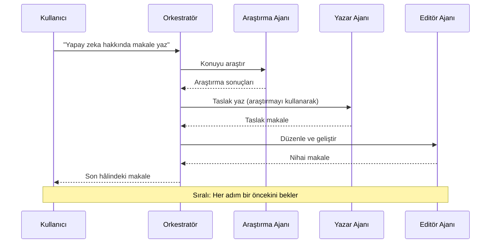
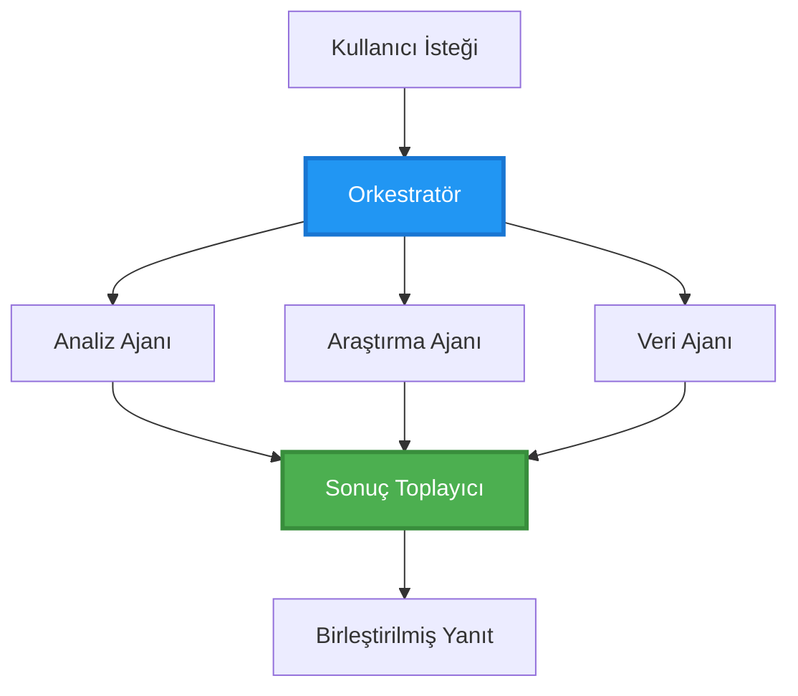
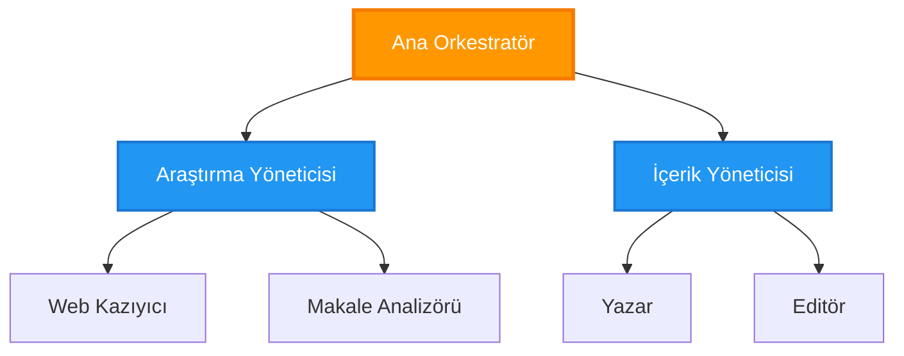
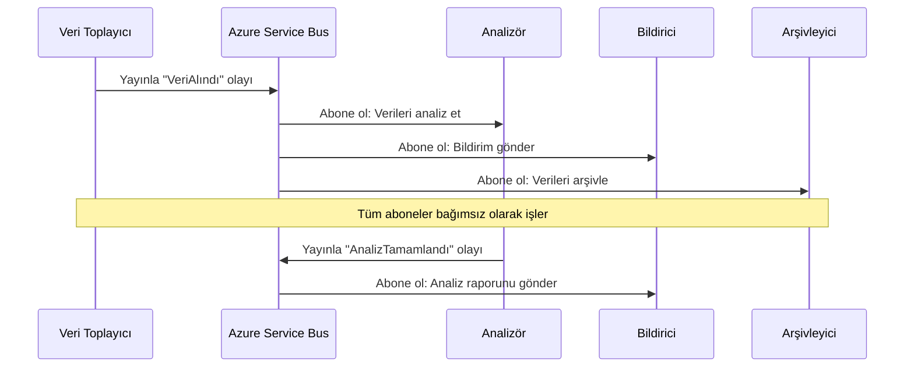
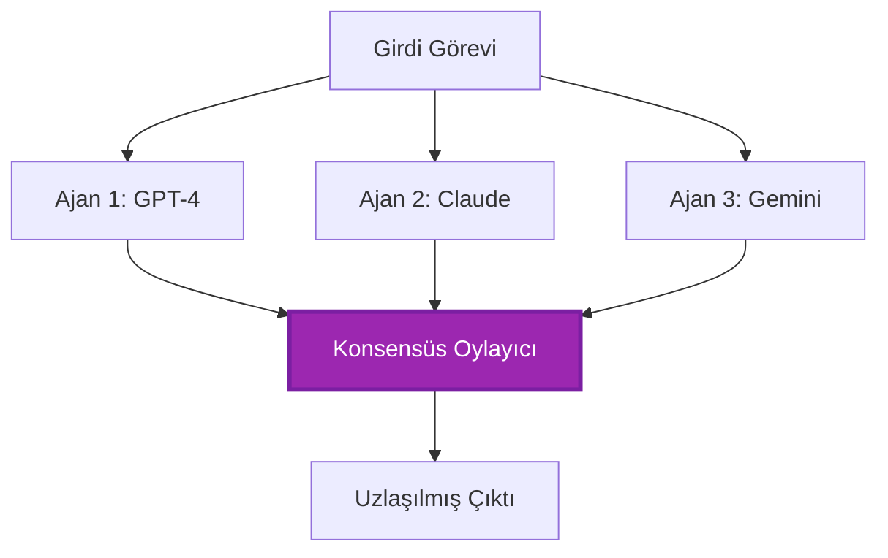
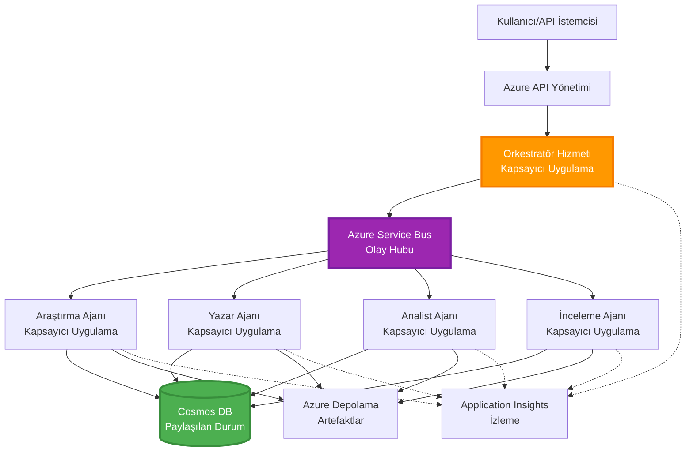

# Çoklu Ajan Koordinasyon Desenleri

⏱️ **Tahmini Süre**: 60-75 dakika | 💰 **Tahmini Maliyet**: ~$100-300/ay | ⭐ **Karmaşıklık**: İleri

**📚 Öğrenme Yolu:**
- ← Önceki: [Kapasite Planlaması](capacity-planning.md) - Kaynak boyutlandırma ve ölçeklendirme stratejileri
- 🎯 **Buradasınız**: Çoklu Ajan Koordinasyon Desenleri (Orkestrasyon, iletişim, durum yönetimi)
- → Sonraki: [SKU Seçimi](sku-selection.md) - Doğru Azure hizmetlerini seçme
- 🏠 [Kurs Ana Sayfası](../../README.md)

---

## Bu Derste Neler Öğreneceksiniz

Bu dersi tamamlayarak şunları öğreneceksiniz:
- **çoklu ajan mimarisi** desenlerini ve ne zaman kullanılacağını anlamak
- **orkestrasyon desenleri** uygulamak (merkezi, dağıtık, hiyerarşik)
- **ajan iletişimi** stratejileri tasarlamak (eşzamanlı, eşzamansız, olay odaklı)
- dağıtılmış ajanlar arasında **paylaşılan durumu** yönetmek
- AZD ile Azure üzerinde **çoklu ajan sistemleri** dağıtmak
- gerçek dünya AI senaryoları için **koordinasyon desenleri** uygulamak
- dağıtılmış ajan sistemlerini izlemek ve hata ayıklamak

## Neden Çoklu Ajan Koordinasyonu Önemlidir

### Evrim: Tek Ajan'dan Çoklu Ajan'a

**Tek Ajan (Basit):**
```
User → Agent → Response
```
- ✅ Anlaması ve uygulaması kolay
- ✅ Basit görevler için hızlı
- ❌ Tek modelin yetenekleri ile sınırlı
- ❌ Karmaşık görevleri paralel olarak çalıştıramaz
- ❌ Uzmanlaşma yok

**Çoklu Ajan Sistemi (İleri):**
```
           ┌─────────────┐
           │ Orchestrator│
           └──────┬──────┘
        ┌─────────┼─────────┐
        │         │         │
    ┌───▼──┐  ┌──▼───┐  ┌──▼────┐
    │Agent1│  │Agent2│  │Agent3 │
    │(Plan)│  │(Code)│  │(Review)│
    └──────┘  └──────┘  └───────┘
```
- ✅ Belirli görevler için uzmanlaşmış ajanlar
- ✅ Hız için paralel yürütme
- ✅ Modüler ve sürdürülebilir
- ✅ Karmaşık iş akışlarında daha iyi
- ⚠️ Koordinasyon mantığı gerektirir

**Analogy**: Tek ajan, tüm görevleri yapan bir kişi gibidir. Çoklu ajan ise her üyenin uzmanlığı olan (araştırmacı, kodlayıcı, inceleyici, yazar) bir ekip gibidir ve birlikte çalışır.

---

## Temel Koordinasyon Desenleri

### Desen 1: Sıralı Koordinasyon (Sorumluluk Zinciri)

**Ne zaman kullanılır**: Görevler belirli bir sırada tamamlanmalı, her ajan önceki çıktıya dayanır.


**Faydalar:**
- ✅ Net veri akışı
- ✅ Hata ayıklaması kolay
- ✅ Öngörülebilir yürütme sırası

**Sınırlamalar:**
- ❌ Daha yavaş (paralellik yok)
- ❌ Bir hata tüm zinciri engeller
- ❌ Karşılıklı bağımlı görevleri yönetemez

**Örnek Kullanım Senaryoları:**
- İçerik oluşturma hattı (araştırma → yazma → düzenleme → yayınlama)
- Kod üretimi (planlama → uygulama → test → dağıtım)
- Rapor oluşturma (veri toplama → analiz → görselleştirme → özet)

---

### Desen 2: Paralel Koordinasyon (Fan-Out/Fan-In)

**Ne zaman kullanılır**: Bağımsız görevler aynı anda çalıştırılabilir, sonuçlar sonunda birleştirilir.


**Faydalar:**
- ✅ Hızlı (paralel yürütme)
- ✅ Hata toleranslı (kısmi sonuçlar kabul edilebilir)
- ✅ Yatay olarak ölçeklenebilir

**Sınırlamalar:**
- ⚠️ Sonuçlar sırasız gelebilir
- ⚠️ Birleştirme mantığı gerekir
- ⚠️ Karmaşık durum yönetimi

**Örnek Kullanım Senaryoları:**
- Çok kaynaklı veri toplama (API'ler + veritabanları + web kazıma)
- Rekabet analizi (birden fazla model çözümler üretir, en iyisi seçilir)
- Çeviri hizmetleri (aynı anda birden çok dile çeviri)

---

### Desen 3: Hiyerarşik Koordinasyon (Yönetici-Çalışan)

**Ne zaman kullanılır**: Alt görevlerin olduğu karmaşık iş akışları, devretme gerektiğinde.


**Faydalar:**
- ✅ Karmaşık iş akışlarını yönetir
- ✅ Modüler ve sürdürülebilir
- ✅ Net sorumluluk sınırları

**Sınırlamalar:**
- ⚠️ Daha karmaşık mimari
- ⚠️ Daha yüksek gecikme (birden fazla koordinasyon katmanı)
- ⚠️ Karmaşık orkestrasyon gerektirir

**Örnek Kullanım Senaryoları:**
- Kurumsal belge işleme (sınıflandır → yönlendir → işle → arşivle)
- Çok aşamalı veri boru hatları (al → temizle → dönüştür → analiz et → raporla)
- Karmaşık otomasyon iş akışları (planlama → kaynak tahsisi → yürütme → izleme)

---

### Desen 4: Olay Tabanlı Koordinasyon (Yayınla-Abone Ol)

**Ne zaman kullanılır**: Ajanların olaylara tepki vermesi gerekir, gevşek bağlılık istenir.


**Faydalar:**
- ✅ Ajanlar arasında gevşek bağlılık
- ✅ Yeni ajan eklemek kolay (sadece abone ol)
- ✅ Eşzamansız işlem
- ✅ Dayanıklı (mesaj kalıcılığı)

**Sınırlamalar:**
- ⚠️ Nihai tutarlılık (eventual consistency)
- ⚠️ Karmaşık hata ayıklama
- ⚠️ Mesaj sıralama zorlukları

**Örnek Kullanım Senaryoları:**
- Gerçek zamanlı izleme sistemleri (uyarılar, panolar, günlükler)
- Çok kanallı bildirimler (e-posta, SMS, push, Slack)
- Veri işleme boru hatları (aynı verinin birden çok tüketicisi)

---

### Desen 5: Konsensüs Tabanlı Koordinasyon (Oylama/Quorum)

**Ne zaman kullanılır**: İlerlemek için birden fazla ajanın anlaşmasına ihtiyaç varsa.


**Faydalar:**
- ✅ Daha yüksek doğruluk (birden fazla görüş)
- ✅ Hata toleranslı (azınlık hataları kabul edilebilir)
- ✅ Yerleşik kalite güvence

**Sınırlamalar:**
- ❌ Maliyetli (birden fazla model çağrısı)
- ❌ Daha yavaş (tüm ajanların beklenmesi)
- ⚠️ Çatışma çözümü gerekir

**Örnek Kullanım Senaryoları:**
- İçerik moderasyonu (birden fazla model içeriği inceler)
- Kod inceleme (birden fazla linter/analyzer)
- Tıbbi teşhis (birden fazla AI modeli, uzman doğrulaması)

---

## Mimari Genel Bakış

### Azure Üzerinde Tam Çoklu Ajan Sistemi


**Ana Bileşenler:**

| Component | Purpose | Azure Service |
|-----------|---------|---------------|
| **API Gateway** | Giriş noktası, hız sınırlama, kimlik doğrulama | API Management |
| **Orchestrator** | Ajan iş akışlarını koordine eder | Container Apps |
| **Message Queue** | Eşzamansız iletişim | Service Bus / Event Hubs |
| **Agents** | Uzmanlaşmış AI işleyicileri | Container Apps / Functions |
| **State Store** | Paylaşılan durum, görev takibi | Cosmos DB |
| **Artifact Storage** | Dökümanlar, sonuçlar, günlükler | Blob Storage |
| **Monitoring** | Dağıtılmış izleme, günlükler | Application Insights |

---

## Önkoşullar

### Gerekli Araçlar

```bash
# Azure Developer CLI'yi doğrulayın
azd version
# ✅ Beklenen: azd sürüm 1.0.0 veya daha yüksek

# Azure CLI'yi doğrulayın
az --version
# ✅ Beklenen: azure-cli 2.50.0 veya daha yüksek

# Docker'ı doğrulayın (yerel test için)
docker --version
# ✅ Beklenen: Docker sürüm 20.10 veya daha yüksek
```

### Azure Gereksinimleri

- Aktif bir Azure aboneliği
- Oluşturma izinleri:
  - Container Apps
  - Service Bus namespace'leri
  - Cosmos DB hesapları
  - Storage hesapları
  - Application Insights

### Bilgi Önkoşulları

Tamamlamış olmanız gerekir:
- [Yapılandırma Yönetimi](../chapter-03-configuration/configuration.md)
- [Kimlik Doğrulama & Güvenlik](../chapter-03-configuration/authsecurity.md)
- [Mikroservis Örneği](../../../../examples/microservices)

---

## Uygulama Rehberi

### Proje Yapısı

```
multi-agent-system/
├── azure.yaml                    # AZD configuration
├── infra/
│   ├── main.bicep               # Main infrastructure
│   ├── core/
│   │   ├── servicebus.bicep     # Message queue
│   │   ├── cosmos.bicep         # State store
│   │   ├── storage.bicep        # Artifact storage
│   │   └── monitoring.bicep     # Application Insights
│   └── app/
│       ├── orchestrator.bicep   # Orchestrator service
│       └── agent.bicep          # Agent template
└── src/
    ├── orchestrator/            # Orchestration logic
    │   ├── app.py
    │   ├── workflows.py
    │   └── Dockerfile
    ├── agents/
    │   ├── research/            # Research agent
    │   ├── writer/              # Writer agent
    │   ├── analyst/             # Analyst agent
    │   └── reviewer/            # Reviewer agent
    └── shared/
        ├── state_manager.py     # Shared state logic
        └── message_handler.py   # Message handling
```

---

## Ders 1: Sıralı Koordinasyon Deseni

### Uygulama: İçerik Oluşturma Hattı

Sıralı bir boru hattı oluşturalım: Araştırma → Yazma → Düzenleme → Yayınlama

### 1. AZD Yapılandırması

**Dosya: `azure.yaml`**

```yaml
name: content-pipeline
metadata:
  template: multi-agent-sequential@1.0.0

services:
  orchestrator:
    project: ./src/orchestrator
    language: python
    host: containerapp
  
  research-agent:
    project: ./src/agents/research
    language: python
    host: containerapp
  
  writer-agent:
    project: ./src/agents/writer
    language: python
    host: containerapp
  
  editor-agent:
    project: ./src/agents/editor
    language: python
    host: containerapp
```

### 2. Altyapı: Koordinasyon için Service Bus

**Dosya: `infra/core/servicebus.bicep`**

```bicep
param name string
param location string
param tags object = {}

resource serviceBusNamespace 'Microsoft.ServiceBus/namespaces@2022-10-01-preview' = {
  name: name
  location: location
  tags: tags
  sku: {
    name: 'Standard'
    tier: 'Standard'
  }
  properties: {
    minimumTlsVersion: '1.2'
  }
}

// Queue for orchestrator → research agent
resource researchQueue 'Microsoft.ServiceBus/namespaces/queues@2022-10-01-preview' = {
  parent: serviceBusNamespace
  name: 'research-tasks'
  properties: {
    maxDeliveryCount: 3
    lockDuration: 'PT5M'
    deadLetteringOnMessageExpiration: true
  }
}

// Queue for research agent → writer agent
resource writerQueue 'Microsoft.ServiceBus/namespaces/queues@2022-10-01-preview' = {
  parent: serviceBusNamespace
  name: 'writer-tasks'
  properties: {
    maxDeliveryCount: 3
    lockDuration: 'PT5M'
  }
}

// Queue for writer agent → editor agent
resource editorQueue 'Microsoft.ServiceBus/namespaces/queues@2022-10-01-preview' = {
  parent: serviceBusNamespace
  name: 'editor-tasks'
  properties: {
    maxDeliveryCount: 3
    lockDuration: 'PT5M'
  }
}

output namespace string = serviceBusNamespace.name
output connectionString string = listKeys('${serviceBusNamespace.id}/AuthorizationRules/RootManageSharedAccessKey', serviceBusNamespace.apiVersion).primaryConnectionString
```

### 3. Paylaşılan Durum Yöneticisi

**Dosya: `src/shared/state_manager.py`**

```python
from azure.cosmos import CosmosClient, PartitionKey
from datetime import datetime
import os

class StateManager:
    """Manages shared state across agents using Cosmos DB"""
    
    def __init__(self):
        endpoint = os.environ['COSMOS_ENDPOINT']
        key = os.environ['COSMOS_KEY']
        
        self.client = CosmosClient(endpoint, key)
        self.database = self.client.get_database_client('agent-state')
        self.container = self.database.get_container_client('tasks')
    
    def create_task(self, task_id: str, task_type: str, input_data: dict):
        """Create a new task"""
        task = {
            'id': task_id,
            'type': task_type,
            'status': 'pending',
            'input': input_data,
            'created_at': datetime.utcnow().isoformat(),
            'steps': []
        }
        self.container.create_item(task)
        return task
    
    def update_task_step(self, task_id: str, step_name: str, result: dict):
        """Update task with completed step"""
        task = self.container.read_item(task_id, partition_key=task_id)
        
        task['steps'].append({
            'name': step_name,
            'completed_at': datetime.utcnow().isoformat(),
            'result': result
        })
        
        self.container.replace_item(task_id, task)
        return task
    
    def complete_task(self, task_id: str, final_result: dict):
        """Mark task as complete"""
        task = self.container.read_item(task_id, partition_key=task_id)
        task['status'] = 'completed'
        task['result'] = final_result
        task['completed_at'] = datetime.utcnow().isoformat()
        self.container.replace_item(task_id, task)
        return task
    
    def get_task(self, task_id: str):
        """Retrieve task state"""
        return self.container.read_item(task_id, partition_key=task_id)
```

### 4. Orkestratör Servisi

**Dosya: `src/orchestrator/app.py`**

```python
from flask import Flask, request, jsonify
from azure.servicebus import ServiceBusClient, ServiceBusMessage
import json
import uuid
import os
from shared.state_manager import StateManager

app = Flask(__name__)
state_manager = StateManager()

# Service Bus bağlantısı
servicebus_connection_str = os.environ['SERVICEBUS_CONNECTION_STRING']
servicebus_client = ServiceBusClient.from_connection_string(servicebus_connection_str)

@app.route('/health', methods=['GET'])
def health():
    return jsonify({'status': 'healthy', 'service': 'orchestrator'})

@app.route('/create-content', methods=['POST'])
def create_content():
    """
    Sequential workflow: Research → Write → Edit → Publish
    """
    data = request.json
    topic = data.get('topic')
    
    if not topic:
        return jsonify({'error': 'Topic required'}), 400
    
    # Durum deposunda görev oluştur
    task_id = str(uuid.uuid4())
    task = state_manager.create_task(
        task_id=task_id,
        task_type='content_creation',
        input_data={'topic': topic}
    )
    
    # Araştırma ajanına mesaj gönder (ilk adım)
    sender = servicebus_client.get_queue_sender('research-tasks')
    message = ServiceBusMessage(
        body=json.dumps({
            'task_id': task_id,
            'topic': topic,
            'next_queue': 'writer-tasks'  # Sonuçların nereye gönderileceği
        }),
        content_type='application/json'
    )
    
    with sender:
        sender.send_messages(message)
    
    return jsonify({
        'task_id': task_id,
        'status': 'started',
        'workflow': 'sequential',
        'steps': ['research', 'write', 'edit', 'publish'],
        'message': 'Content creation pipeline initiated'
    }), 202

@app.route('/task/<task_id>', methods=['GET'])
def get_task_status(task_id):
    """Check task status"""
    try:
        task = state_manager.get_task(task_id)
        return jsonify(task)
    except Exception as e:
        return jsonify({'error': str(e)}), 404

if __name__ == '__main__':
    app.run(host='0.0.0.0', port=8080)
```

### 5. Araştırma Ajanı

**Dosya: `src/agents/research/app.py`**

```python
from azure.servicebus import ServiceBusClient, ServiceBusMessage
from openai import AzureOpenAI
import json
import os
import time
from shared.state_manager import StateManager

# İstemcileri başlat
state_manager = StateManager()
servicebus_client = ServiceBusClient.from_connection_string(
    os.environ['SERVICEBUS_CONNECTION_STRING']
)

openai_client = AzureOpenAI(
    api_key=os.environ['AZURE_OPENAI_API_KEY'],
    api_version="2024-02-01",
    azure_endpoint=os.environ['AZURE_OPENAI_ENDPOINT']
)

def process_research_task(message_data):
    """Process research request and pass to writer"""
    task_id = message_data['task_id']
    topic = message_data['topic']
    next_queue = message_data['next_queue']
    
    print(f"🔬 Researching: {topic}")
    
    # Araştırma için Azure OpenAI'yi çağır
    response = openai_client.chat.completions.create(
        model="gpt-4",
        messages=[
            {"role": "system", "content": "You are a research assistant. Provide comprehensive research on the given topic."},
            {"role": "user", "content": f"Research this topic thoroughly: {topic}"}
        ],
        max_tokens=1500
    )
    
    research_results = response.choices[0].message.content
    
    # Durumu güncelle
    state_manager.update_task_step(
        task_id=task_id,
        step_name='research',
        result={'research': research_results}
    )
    
    # Sonraki ajana (yazar) gönder
    sender = servicebus_client.get_queue_sender(next_queue)
    message = ServiceBusMessage(
        body=json.dumps({
            'task_id': task_id,
            'topic': topic,
            'research': research_results,
            'next_queue': 'editor-tasks'
        }),
        content_type='application/json'
    )
    
    with sender:
        sender.send_messages(message)
    
    print(f"✅ Research complete for task {task_id}")

def main():
    """Listen to research queue"""
    receiver = servicebus_client.get_queue_receiver('research-tasks')
    
    print("🔬 Research Agent started, listening for tasks...")
    
    with receiver:
        while True:
            messages = receiver.receive_messages(max_wait_time=5)
            for message in messages:
                try:
                    message_data = json.loads(str(message))
                    process_research_task(message_data)
                    receiver.complete_message(message)
                except Exception as e:
                    print(f"❌ Error processing message: {e}")
                    receiver.abandon_message(message)

if __name__ == '__main__':
    main()
```

### 6. Yazar Ajanı

**Dosya: `src/agents/writer/app.py`**

```python
from azure.servicebus import ServiceBusClient, ServiceBusMessage
from openai import AzureOpenAI
import json
import os
from shared.state_manager import StateManager

state_manager = StateManager()
servicebus_client = ServiceBusClient.from_connection_string(
    os.environ['SERVICEBUS_CONNECTION_STRING']
)

openai_client = AzureOpenAI(
    api_key=os.environ['AZURE_OPENAI_API_KEY'],
    api_version="2024-02-01",
    azure_endpoint=os.environ['AZURE_OPENAI_ENDPOINT']
)

def process_writing_task(message_data):
    """Write article based on research"""
    task_id = message_data['task_id']
    topic = message_data['topic']
    research = message_data['research']
    next_queue = message_data['next_queue']
    
    print(f"✍️ Writing article: {topic}")
    
    # Makale yazması için Azure OpenAI'yi çağır
    response = openai_client.chat.completions.create(
        model="gpt-4",
        messages=[
            {"role": "system", "content": "You are a professional writer. Write engaging, well-structured articles."},
            {"role": "user", "content": f"Based on this research:\n\n{research}\n\nWrite a comprehensive article about: {topic}"}
        ],
        max_tokens=2000
    )
    
    article_draft = response.choices[0].message.content
    
    # Durumu güncelle
    state_manager.update_task_step(
        task_id=task_id,
        step_name='writing',
        result={'draft': article_draft}
    )
    
    # Editöre gönder
    sender = servicebus_client.get_queue_sender(next_queue)
    message = ServiceBusMessage(
        body=json.dumps({
            'task_id': task_id,
            'topic': topic,
            'draft': article_draft
        }),
        content_type='application/json'
    )
    
    with sender:
        sender.send_messages(message)
    
    print(f"✅ Article draft complete for task {task_id}")

def main():
    """Listen to writer queue"""
    receiver = servicebus_client.get_queue_receiver('writer-tasks')
    
    print("✍️ Writer Agent started, listening for tasks...")
    
    with receiver:
        while True:
            messages = receiver.receive_messages(max_wait_time=5)
            for message in messages:
                try:
                    message_data = json.loads(str(message))
                    process_writing_task(message_data)
                    receiver.complete_message(message)
                except Exception as e:
                    print(f"❌ Error: {e}")
                    receiver.abandon_message(message)

if __name__ == '__main__':
    main()
```

### 7. Editör Ajanı

**Dosya: `src/agents/editor/app.py`**

```python
from azure.servicebus import ServiceBusClient
from openai import AzureOpenAI
import json
import os
from shared.state_manager import StateManager

state_manager = StateManager()
servicebus_client = ServiceBusClient.from_connection_string(
    os.environ['SERVICEBUS_CONNECTION_STRING']
)

openai_client = AzureOpenAI(
    api_key=os.environ['AZURE_OPENAI_API_KEY'],
    api_version="2024-02-01",
    azure_endpoint=os.environ['AZURE_OPENAI_ENDPOINT']
)

def process_editing_task(message_data):
    """Edit and finalize article"""
    task_id = message_data['task_id']
    topic = message_data['topic']
    draft = message_data['draft']
    
    print(f"📝 Editing article: {topic}")
    
    # Düzenlemek için Azure OpenAI'yi çağır
    response = openai_client.chat.completions.create(
        model="gpt-4",
        messages=[
            {"role": "system", "content": "You are an expert editor. Improve grammar, clarity, and structure."},
            {"role": "user", "content": f"Edit and improve this article:\n\n{draft}"}
        ],
        max_tokens=2000
    )
    
    final_article = response.choices[0].message.content
    
    # Görevi tamamlandı olarak işaretle
    state_manager.complete_task(
        task_id=task_id,
        final_result={
            'topic': topic,
            'final_article': final_article,
            'word_count': len(final_article.split())
        }
    )
    
    print(f"✅ Article finalized for task {task_id}")

def main():
    """Listen to editor queue"""
    receiver = servicebus_client.get_queue_receiver('editor-tasks')
    
    print("📝 Editor Agent started, listening for tasks...")
    
    with receiver:
        while True:
            messages = receiver.receive_messages(max_wait_time=5)
            for message in messages:
                try:
                    message_data = json.loads(str(message))
                    process_editing_task(message_data)
                    receiver.complete_message(message)
                except Exception as e:
                    print(f"❌ Error: {e}")
                    receiver.abandon_message(message)

if __name__ == '__main__':
    main()
```

### 8. Dağıt ve Test Et

```bash
# Başlat ve dağıt
azd init
azd up

# Orkestratör URL'sini al
ORCHESTRATOR_URL=$(azd env get-values | grep ORCHESTRATOR_URL | cut -d '=' -f2 | tr -d '"')

# İçerik oluştur
curl -X POST $ORCHESTRATOR_URL/create-content \
  -H "Content-Type: application/json" \
  -d '{"topic": "The Future of AI in Healthcare"}'
```

**✅ Beklenen çıktı:**
```json
{
  "task_id": "a1b2c3d4-e5f6-7890-abcd-ef1234567890",
  "status": "started",
  "workflow": "sequential",
  "steps": ["research", "write", "edit", "publish"],
  "message": "Content creation pipeline initiated"
}
```

**Görev ilerlemesini kontrol et:**
```bash
TASK_ID="a1b2c3d4-e5f6-7890-abcd-ef1234567890"
curl $ORCHESTRATOR_URL/task/$TASK_ID
```

**✅ Beklenen çıktı (tamamlandı):**
```json
{
  "id": "a1b2c3d4-e5f6-7890-abcd-ef1234567890",
  "type": "content_creation",
  "status": "completed",
  "steps": [
    {
      "name": "research",
      "completed_at": "2025-11-19T10:30:00Z",
      "result": {"research": "..."}
    },
    {
      "name": "writing",
      "completed_at": "2025-11-19T10:32:00Z",
      "result": {"draft": "..."}
    }
  ],
  "result": {
    "topic": "The Future of AI in Healthcare",
    "final_article": "...",
    "word_count": 1500
  }
}
```

---

## Ders 2: Paralel Koordinasyon Deseni

### Uygulama: Çok Kaynaklı Araştırma Toplayıcı

Aynı anda birden çok kaynaktan bilgi toplayan paralel bir sistem oluşturalım.

### Paralel Orkestratör

**Dosya: `src/orchestrator/parallel_workflow.py`**

```python
from flask import Flask, request, jsonify
from azure.servicebus import ServiceBusClient, ServiceBusMessage
import json
import uuid
import os
from shared.state_manager import StateManager

app = Flask(__name__)
state_manager = StateManager()

servicebus_client = ServiceBusClient.from_connection_string(
    os.environ['SERVICEBUS_CONNECTION_STRING']
)

@app.route('/research-parallel', methods=['POST'])
def research_parallel():
    """
    Parallel workflow: Multiple agents work simultaneously
    """
    data = request.json
    query = data.get('query')
    
    task_id = str(uuid.uuid4())
    task = state_manager.create_task(
        task_id=task_id,
        task_type='parallel_research',
        input_data={
            'query': query,
            'agents': ['web', 'academic', 'news', 'social']
        }
    )
    
    # Çoklu gönderim: Tüm ajanlara aynı anda gönder
    agents = [
        ('web-research-queue', 'web'),
        ('academic-research-queue', 'academic'),
        ('news-research-queue', 'news'),
        ('social-research-queue', 'social')
    ]
    
    for queue_name, agent_type in agents:
        sender = servicebus_client.get_queue_sender(queue_name)
        message = ServiceBusMessage(
            body=json.dumps({
                'task_id': task_id,
                'query': query,
                'agent_type': agent_type,
                'result_queue': 'aggregation-queue'
            }),
            content_type='application/json'
        )
        
        with sender:
            sender.send_messages(message)
    
    return jsonify({
        'task_id': task_id,
        'status': 'started',
        'workflow': 'parallel',
        'agents_dispatched': 4,
        'message': 'Parallel research initiated'
    }), 202

if __name__ == '__main__':
    app.run(host='0.0.0.0', port=8080)
```

### Birleştirme Mantığı

**Dosya: `src/agents/aggregator/app.py`**

```python
from azure.servicebus import ServiceBusClient
import json
import os
from collections import defaultdict
from shared.state_manager import StateManager

state_manager = StateManager()
servicebus_client = ServiceBusClient.from_connection_string(
    os.environ['SERVICEBUS_CONNECTION_STRING']
)

# Her görev için sonuçları takip et
task_results = defaultdict(list)
expected_agents = 4  # web, akademik, haberler, sosyal

def process_result(message_data):
    """Aggregate results from parallel agents"""
    task_id = message_data['task_id']
    agent_type = message_data['agent_type']
    result = message_data['result']
    
    # Sonucu sakla
    task_results[task_id].append({
        'agent': agent_type,
        'data': result
    })
    
    print(f"📊 Received result from {agent_type} agent ({len(task_results[task_id])}/{expected_agents})")
    
    # Tüm ajanların tamamlayıp tamamlamadığını kontrol et (fan-in)
    if len(task_results[task_id]) == expected_agents:
        print(f"✅ All agents completed for task {task_id}. Aggregating...")
        
        # Sonuçları birleştir
        aggregated = {
            'query': message_data['query'],
            'sources': task_results[task_id],
            'summary': generate_summary(task_results[task_id])
        }
        
        # Tamamlandı olarak işaretle
        state_manager.complete_task(task_id, aggregated)
        
        # Temizle
        del task_results[task_id]
        
        print(f"✅ Aggregation complete for task {task_id}")

def generate_summary(results):
    """Generate summary from all sources"""
    summaries = [r['data'].get('summary', '') for r in results]
    return '\n\n'.join(summaries)

def main():
    """Listen to aggregation queue"""
    receiver = servicebus_client.get_queue_receiver('aggregation-queue')
    
    print("📊 Aggregator started, listening for results...")
    
    with receiver:
        while True:
            messages = receiver.receive_messages(max_wait_time=5)
            for message in messages:
                try:
                    message_data = json.loads(str(message))
                    process_result(message_data)
                    receiver.complete_message(message)
                except Exception as e:
                    print(f"❌ Error: {e}")
                    receiver.abandon_message(message)

if __name__ == '__main__':
    main()
```

**Paralel Desenin Faydaları:**
- ⚡ **4 kat daha hızlı** (ajanlar eşzamanlı çalışır)
- 🔄 **Hata toleranslı** (kısmi sonuçlar kabul edilebilir)
- 📈 **Ölçeklenebilir** (daha fazla ajan kolayca eklenir)

---

## Uygulamalı Egzersizler

### Egzersiz 1: Zaman Aşımı İşleme Ekle ⭐⭐ (Orta)

**Hedef**: Birleştiricinin yavaş ajanları bekleyerek sonsuza kadar beklememesi için zaman aşımı mantığı uygulayın.

**Adımlar**:

1. **Birleştiriciye zaman aşımı takibi ekle:**

```python
from datetime import datetime, timedelta

task_timeouts = {}  # task_id -> expiration_time

def process_result(message_data):
    task_id = message_data['task_id']
    
    # İlk sonuç için zaman aşımı ayarla
    if task_id not in task_timeouts:
        task_timeouts[task_id] = datetime.utcnow() + timedelta(seconds=30)
    
    task_results[task_id].append({
        'agent': message_data['agent_type'],
        'data': message_data['result']
    })
    
    # Tamamlandı mı veya zaman aşımına uğradı mı kontrol et
    if len(task_results[task_id]) == expected_agents or \
       datetime.utcnow() > task_timeouts[task_id]:
        
        print(f"📊 Aggregating with {len(task_results[task_id])}/{expected_agents} results")
        
        aggregated = {
            'query': message_data['query'],
            'sources': task_results[task_id],
            'completed_agents': len(task_results[task_id]),
            'timed_out': len(task_results[task_id]) < expected_agents
        }
        
        state_manager.complete_task(task_id, aggregated)
        
        # Temizleme
        del task_results[task_id]
        del task_timeouts[task_id]
```

2. **Yapay gecikmelerle test et:**

```python
# Bir ajan için yavaş işlemeyi simüle etmek amacıyla gecikme ekleyin
import time
time.sleep(35)  # 30 saniyelik zaman aşımını aşıyor
```

3. **Dağıt ve doğrula:**

```bash
azd deploy aggregator

# Görevi gönder
curl -X POST $ORCHESTRATOR_URL/research-parallel \
  -H "Content-Type: application/json" \
  -d '{"query": "AI safety research"}'

# 30 saniye sonra sonuçları kontrol et
curl $ORCHESTRATOR_URL/task/$TASK_ID
```

**✅ Başarı Kriterleri:**
- ✅ Ajanlar eksik olsa bile görev 30 saniye sonra tamamlanır
- ✅ Yanıt kısmi sonuçları belirten ("timed_out": true) alanı içerir
- ✅ Mevcut sonuçlar döndürülür (4 ajandan 3'ü gibi)

**Süre**: 20-25 dakika

---

### Egzersiz 2: Yeniden Deneme Mantığını Uygula ⭐⭐⭐ (İleri)

**Hedef**: Başarısız ajan görevlerini vazgeçmeden önce otomatik olarak yeniden dene.

**Adımlar**:

1. **Orkestratöre yeniden deneme takibi ekle:**

```python
from dataclasses import dataclass
from typing import Dict

@dataclass
class RetryConfig:
    max_retries: int = 3
    backoff_seconds: int = 5

retry_counts: Dict[str, int] = {}  # message_id -> yeniden_deneme_sayısı

def send_with_retry(queue_name: str, message_data: dict, retry_config: RetryConfig):
    """Send message with retry metadata"""
    message_id = message_data.get('message_id', str(uuid.uuid4()))
    message_data['message_id'] = message_id
    message_data['retry_count'] = retry_counts.get(message_id, 0)
    message_data['max_retries'] = retry_config.max_retries
    
    sender = servicebus_client.get_queue_sender(queue_name)
    message = ServiceBusMessage(
        body=json.dumps(message_data),
        content_type='application/json',
        message_id=message_id
    )
    
    with sender:
        sender.send_messages(message)
```

2. **Ajanlara yeniden deneme işleyicisi ekle:**

```python
def process_with_retry(message, receiver, process_func):
    """Process message with automatic retry on failure"""
    try:
        message_data = json.loads(str(message))
        
        # Mesajı işle
        process_func(message_data)
        
        # Başarılı - tamamlandı
        receiver.complete_message(message)
        
    except Exception as e:
        message_id = message.message_id
        retry_count = message_data.get('retry_count', 0)
        max_retries = message_data.get('max_retries', 3)
        
        if retry_count < max_retries:
            # Yeniden dene: bırak ve sayısı artırılmış olarak kuyruğa yeniden ekle
            print(f"⚠️ Retry {retry_count + 1}/{max_retries} for message {message_id}")
            
            message_data['retry_count'] = retry_count + 1
            
            # Aynı kuyruğa gecikmeli olarak geri gönder
            time.sleep(5 * (retry_count + 1))  # Üstel geri çekilme
            send_with_retry(queue_name, message_data, RetryConfig())
            
            receiver.complete_message(message)  # Orijinali kaldır
        else:
            # Maksimum yeniden deneme sayısı aşıldı - ölü mesaj kuyruğuna taşı
            print(f"❌ Max retries exceeded for message {message_id}")
            receiver.dead_letter_message(
                message,
                reason="MaxRetriesExceeded",
                error_description=str(e)
            )
```

3. **Dead letter kuyruğunu izle:**

```python
def monitor_dead_letters():
    """Check dead letter queue for failed messages"""
    receiver = servicebus_client.get_queue_receiver(
        'research-queue',
        sub_queue='deadletter'
    )
    
    with receiver:
        messages = receiver.receive_messages(max_wait_time=5)
        for message in messages:
            print(f"☠️ Dead letter: {message.message_id}")
            print(f"Reason: {message.dead_letter_reason}")
            print(f"Description: {message.dead_letter_error_description}")
```

**✅ Başarı Kriterleri:**
- ✅ Başarısız görevler otomatik olarak yeniden denenir (en fazla 3 kez)
- ✅ Yeniden denemeler arasında üssel geri çekilme (5s, 10s, 15s)
- ✅ Maks yeniden denemeden sonra mesajlar dead letter kuyruğuna gider
- ✅ Dead letter kuyruğu izlenebilir ve yeniden oynatılabilir

**Süre**: 30-40 dakika

---

### Egzersiz 3: Devre Kesici (Circuit Breaker) Uygula ⭐⭐⭐ (İleri)

**Hedef**: Başarısız ajanlara yapılan istekleri durdurarak zincirleme hataları önleyin.

**Adımlar**:

1. **Devre kesici sınıfı oluştur:**

```python
from enum import Enum
from datetime import datetime, timedelta

class CircuitState(Enum):
    CLOSED = "closed"      # Normal çalışma
    OPEN = "open"          # Arızalı, istekleri reddet
    HALF_OPEN = "half_open"  # İyileşip iyileşmediğini test et

class CircuitBreaker:
    def __init__(self, failure_threshold=5, timeout_seconds=60):
        self.failure_threshold = failure_threshold
        self.timeout_seconds = timeout_seconds
        self.failure_count = 0
        self.last_failure_time = None
        self.state = CircuitState.CLOSED
    
    def call(self, func):
        """Execute function with circuit breaker protection"""
        if self.state == CircuitState.OPEN:
            # Zaman aşımının dolup dolmadığını kontrol et
            if datetime.utcnow() - self.last_failure_time > timedelta(seconds=self.timeout_seconds):
                self.state = CircuitState.HALF_OPEN
                print("🔄 Circuit breaker: HALF_OPEN (testing)")
            else:
                raise Exception(f"Circuit breaker OPEN for agent. Try again in {self.timeout_seconds}s")
        
        try:
            result = func()
            
            # Başarılı
            if self.state == CircuitState.HALF_OPEN:
                self.state = CircuitState.CLOSED
                self.failure_count = 0
                print("✅ Circuit breaker: CLOSED (recovered)")
            
            return result
            
        except Exception as e:
            self.failure_count += 1
            self.last_failure_time = datetime.utcnow()
            
            if self.failure_count >= self.failure_threshold:
                self.state = CircuitState.OPEN
                print(f"🔴 Circuit breaker: OPEN (too many failures)")
            
            raise e
```

2. **Ajan çağrılarına uygula:**

```python
# Orkestratörde
agent_circuits = {
    'web': CircuitBreaker(failure_threshold=5, timeout_seconds=60),
    'academic': CircuitBreaker(failure_threshold=5, timeout_seconds=60),
    'news': CircuitBreaker(failure_threshold=5, timeout_seconds=60),
    'social': CircuitBreaker(failure_threshold=5, timeout_seconds=60)
}

def send_to_agent(agent_type, message_data):
    """Send with circuit breaker protection"""
    circuit = agent_circuits[agent_type]
    
    try:
        circuit.call(lambda: send_message(agent_type, message_data))
    except Exception as e:
        print(f"⚠️ Skipping {agent_type} agent: {e}")
        # Diğer ajanlarla devam et
```

3. **Devre kesiciyi test et:**

```bash
# Tekrarlanan hataları simüle et (bir ajanı durdur)
az containerapp stop --name web-research-agent --resource-group rg-agents

# Birden çok istek gönder
for i in {1..10}; do
  curl -X POST $ORCHESTRATOR_URL/research-parallel \
    -H "Content-Type: application/json" \
    -d '{"query": "test query '$i'"}'
  sleep 2
done

# Günlükleri kontrol et - 5 başarısızlıktan sonra devre açık olmalı
# Container App günlükleri için Azure CLI'yi kullan:
az containerapp logs show --name orchestrator --resource-group $RG_NAME --tail 50
```

**✅ Başarı Kriterleri:**
- ✅ 5 başarısızlıktan sonra devre açılır (istekleri reddeder)
- ✅ 60 saniye sonra devre yarı-açık olur (iyileşme testi)
- ✅ Diğer ajanlar normal şekilde çalışmaya devam eder
- ✅ Ajan iyileştiğinde devre otomatik olarak kapanır

**Süre**: 40-50 dakika

---

## İzleme ve Hata Ayıklama

### Application Insights ile Dağıtık İzleme

**Dosya: `src/shared/tracing.py`**

```python
from opencensus.ext.azure.log_exporter import AzureLogHandler
from opencensus.ext.azure.trace_exporter import AzureExporter
from opencensus.trace import config_integration
from opencensus.trace.tracer import Tracer
from opencensus.trace.samplers import AlwaysOnSampler
import logging
import os

# İzlemeyi yapılandır
config_integration.trace_integrations(['requests', 'logging'])

connection_string = os.environ.get('APPLICATIONINSIGHTS_CONNECTION_STRING')

# İzleyici oluştur
tracer = Tracer(
    exporter=AzureExporter(connection_string=connection_string),
    sampler=AlwaysOnSampler()
)

# Günlüklemeyi yapılandır
logger = logging.getLogger(__name__)
logger.addHandler(AzureLogHandler(connection_string=connection_string))
logger.setLevel(logging.INFO)

def trace_agent_call(agent_name, task_id, operation):
    """Trace agent operations"""
    with tracer.span(name=f'{agent_name}.{operation}') as span:
        span.add_attribute('agent', agent_name)
        span.add_attribute('task_id', task_id)
        span.add_attribute('operation', operation)
        
        try:
            result = operation()
            span.add_attribute('status', 'success')
            return result
        except Exception as e:
            span.add_attribute('status', 'error')
            span.add_attribute('error', str(e))
            raise
```

### Application Insights Sorguları

**Çoklu ajan iş akışlarını takip et:**

```kusto
// Trace complete workflow for a task
traces
| where customDimensions.task_id == "a1b2c3d4-..."
| project timestamp, message, customDimensions.agent, customDimensions.operation
| order by timestamp asc
```

**Ajan performans karşılaştırması:**

```kusto
// Compare agent execution times
dependencies
| where name contains "agent"
| summarize 
    avg_duration = avg(duration),
    p95_duration = percentile(duration, 95),
    count = count()
  by agent = tostring(customDimensions.agent)
| order by avg_duration desc
```

**Hata analizi:**

```kusto
// Find which agents fail most
exceptions
| where customDimensions.agent != ""
| summarize 
    failure_count = count(),
    unique_errors = dcount(outerMessage)
  by agent = tostring(customDimensions.agent)
| order by failure_count desc
```

---

## Maliyet Analizi

### Çoklu Ajan Sistemi Maliyetleri (Aylık Tahminler)

| Component | Configuration | Cost |
|-----------|--------------|------|
| **Orchestrator** | 1 Container App (1 vCPU, 2GB) | $30-50 |
| **4 Agents** | 4 Container Apps (0.5 vCPU, 1GB each) | $60-120 |
| **Service Bus** | Standard tier, 10M messages | $10-20 |
| **Cosmos DB** | Serverless, 5GB storage, 1M RUs | $25-50 |
| **Blob Storage** | 10GB storage, 100K operations | $5-10 |
| **Application Insights** | 5GB ingestion | $10-15 |
| **Azure OpenAI** | GPT-4, 10M tokens | $100-300 |
| **Toplam** | | **$240-565/month** |

### Maliyet Optimizasyon Stratejileri

1. **Mümkün olduğunda serverless kullanın:**
   ```bicep
   // Cosmos DB serverless (no minimum cost)
   properties: {
     databaseAccountOfferType: 'Standard'
     capabilities: [{ name: 'EnableServerless' }]
   }
   ```

2. **Ajanları boşta olduklarında sıfıra ölçekleyin:**
   ```bicep
   scale: {
     minReplicas: 0  // Scale to zero when no messages
     maxReplicas: 10
   }
   ```

3. **Service Bus için toplu işleme (batching) kullanın:**
   ```python
   # Mesajları toplu olarak gönderin (daha ucuz)
   sender.send_messages([message1, message2, message3])
   ```

4. **Sık kullanılan sonuçları önbelleğe alın:**
   ```python
   # Azure Cache for Redis'i kullanın
   if cache.exists(query_hash):
       return cache.get(query_hash)
   ```

---

## En İyi Uygulamalar

### ✅ YAPIN:

1. **İdempotent işlemler kullanın**
   ```python
   # Ajan aynı mesajı birden çok kez güvenle işleyebilir
   def process_task(task_id):
       if state_manager.task_exists(task_id):
           print(f"Task {task_id} already processed, skipping")
           return
       # Görev işleniyor...
   ```

2. **Kapsamlı günlükleme uygulayın**
   ```python
   logger.info(f"Agent: {agent_name}, Task: {task_id}, Action: {action}")
   ```

3. **Korelasyon kimlikleri (correlation IDs) kullanın**
   ```python
   # task_id'yi tüm iş akışı boyunca iletin
   message_data = {
       'task_id': task_id,  # Korelasyon kimliği
       'timestamp': datetime.utcnow().isoformat()
   }
   ```

4. **Mesaj TTL (time-to-live) ayarlayın**
   ```bicep
   properties: {
     defaultMessageTimeToLive: 'PT1H'  // 1 hour max
   }
   ```

5. **Dead letter kuyruklarını izleyin**
   ```python
   # Başarısız mesajların düzenli olarak izlenmesi
   monitor_dead_letters()
   ```

### ❌ YAPMAYIN:

1. **Dairesel bağımlılıklar oluşturmayın**
   ```python
   # ❌ KÖTÜ: Ajan A → Ajan B → Ajan A (sonsuz döngü)
   # ✅ İYİ: Açık bir yönlendirilmiş döngüsüz grafik (DAG) tanımlayın
   ```

2. **Ajan iş parçacıklarını engellemeyin**
   ```python
   # ❌ KÖTÜ: Eşzamanlı bekleme
   while not task_complete:
       time.sleep(1)
   
   # ✅ İYİ: Mesaj kuyruğu geri çağırmalarını kullanın
   ```

3. **Kısmi hataları görmezden gelmeyin**
   ```python
   # ❌ KÖTÜ: Bir ajan başarısız olursa tüm iş akışını başarısız kıl
   # ✅ İYİ: Hata göstergeleriyle kısmi sonuçları döndür
   ```

4. **Sonsuz yeniden denemeler kullanmayın**
   ```python
   # ❌ KÖTÜ: sonsuza kadar yeniden deneme
   # ✅ İYİ: max_retries = 3, sonra ölü mektup kuyruğuna gönder
   ```

---
## Sorun Giderme Rehberi

### Sorun: Kuyrukta takılan mesajlar

**Belirtiler:**
- Mesajlar kuyrukta birikir
- Ajanlar işlem yapmıyor
- Görev durumu "pending" olarak takılı

**Teşhis:**
```bash
# Kuyruk derinliğini kontrol et
az servicebus queue show \
  --namespace-name mybus \
  --name research-tasks \
  --query "countDetails"

# Azure CLI kullanarak ajan günlüklerini kontrol et
az containerapp logs show --name research-agent --resource-group $RG_NAME --tail 50
```

**Çözümler:**

1. **Ajan replika sayısını artırın:**
   ```bash
   az containerapp update \
     --name research-agent \
     --min-replicas 3 \
     --max-replicas 10
   ```

2. **Dead letter kuyruğunu kontrol edin:**
   ```bash
   az servicebus queue show \
     --namespace-name mybus \
     --name research-tasks \
     --query "countDetails.deadLetterMessageCount"
   ```

---

### Sorun: Görev zaman aşımı/asla tamamlanmıyor

**Belirtiler:**
- Görev durumu "in_progress" olarak kalır
- Bazı ajanlar tamamlıyor, diğerleri tamamlamıyor
- Hata mesajı yok

**Teşhis:**
```bash
# Görev durumunu kontrol et
curl $ORCHESTRATOR_URL/task/$TASK_ID

# Application Insights'ı kontrol et
# Sorguyu çalıştır: traces | where customDimensions.task_id == "..."
```

**Çözümler:**

1. **Toplayıcıda zaman aşımı uygulayın (Alıştırma 1)**

2. **Ajan hatalarını Azure Monitor kullanarak kontrol edin:**
   ```bash
   # azd monitor ile günlükleri görüntüleyin
   azd monitor --logs
   
   # Veya Azure CLI'yi kullanarak belirli konteyner uygulaması günlüklerini kontrol edin
   az containerapp logs show --name <agent-name> --resource-group $RG_NAME --follow | grep "ERROR\|FAIL"
   ```

3. **Tüm ajanların çalıştığını doğrulayın:**
   ```bash
   az containerapp list \
     --resource-group rg-agents \
     --query "[].{name:name, status:properties.runningStatus}"
   ```

---

## Daha Fazla Bilgi

### Resmi Dokümantasyon
- [Azure Service Bus](https://learn.microsoft.com/azure/service-bus-messaging/service-bus-messaging-overview)
- [Cosmos DB](https://learn.microsoft.com/azure/cosmos-db/introduction)
- [Container Apps DAPR](https://learn.microsoft.com/azure/container-apps/dapr-overview)
- [Çok Ajanlı Tasarım Desenleri](https://learn.microsoft.com/azure/architecture/guide/ai/multi-agent-systems)

### Bu Kurstaki Sonraki Adımlar
- ← Önceki: [Kapasite Planlama](capacity-planning.md)
- → Sonraki: [SKU Seçimi](sku-selection.md)
- 🏠 [Kurs Ana Sayfası](../../README.md)

### İlgili Örnekler
- [Mikroservis Örneği](../../../../examples/microservices) - Servis iletişim desenleri
- [Azure OpenAI Örneği](../../../../examples/azure-openai-chat) - Yapay zeka entegrasyonu

---

## Özet

**Öğrendikleriniz:**
- ✅ Beş koordinasyon deseni (sıralı, paralel, hiyerarşik, olaya dayalı, uzlaşı)
- ✅ Azure üzerinde çok ajanlı mimari (Service Bus, Cosmos DB, Container Apps)
- ✅ Dağıtık ajanlar arasında durum yönetimi
- ✅ Zaman aşımı yönetimi, yeniden denemeler ve devre kesiciler
- ✅ Dağıtık sistemlerin izlenmesi ve hata ayıklaması
- ✅ Maliyet optimizasyonu stratejileri

**Önemli Noktalar:**
1. **Doğru deseni seçin** - Sıralı, sıralı iş akışları için; paralel, hız için; olaya dayalı, esneklik için
2. **Durumu dikkatle yönetin** - Paylaşılan durum için Cosmos DB veya benzeri kullanın
3. **Hataları zarifçe yönetin** - Zaman aşımı, yeniden denemeler, devre kesiciler, dead letter kuyrukları
4. **Her şeyi izleyin** - Hata ayıklama için dağıtık izleme şarttır
5. **Maliyetleri optimize edin** - Sıfıra ölçekleme, sunucusuz kullanın, önbellekleme uygulayın

**Sonraki Adımlar:**
1. Pratik alıştırmaları tamamlayın
2. Kullanım durumunuz için çok ajanlı bir sistem oluşturun
3. Performans ve maliyeti optimize etmek için [SKU Seçimi](sku-selection.md) inceleyin

---

<!-- CO-OP TRANSLATOR DISCLAIMER START -->
Sorumluluk Reddi:
Bu belge, [Co-op Translator](https://github.com/Azure/co-op-translator) adlı yapay zeka çeviri hizmeti kullanılarak çevrilmiştir. Doğruluk için çaba göstersek de, otomatik çevirilerin hata veya yanlışlık içerebileceğini lütfen unutmayın. Kaynak dilindeki orijinal belge yetkili kaynak olarak kabul edilmelidir. Kritik bilgiler için profesyonel insan çevirisi önerilir. Bu çevirinin kullanılmasından doğabilecek her türlü yanlış anlama veya yanlış yorumlamadan sorumluluk kabul etmiyoruz.
<!-- CO-OP TRANSLATOR DISCLAIMER END -->