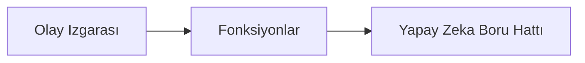

# Bölüm 8: Üretim ve Kurumsal Desenler

**📚 Kurs**: [AZD Yeni Başlayanlar İçin](../../README.md) | **⏱️ Süre**: 2-3 saat | **⭐ Zorluk**: İleri

---

## Genel Bakış

Bu bölüm, üretim AI iş yükleri için kurumsal düzeyde dağıtım desenleri, güvenlik sertleştirme, izleme ve maliyet optimizasyonunu kapsar.

> `azd 1.23.12` ile Mart 2026'da doğrulandı.

## Öğrenme Hedefleri

Bu bölümü tamamladığınızda:
- Çok bölgeli dayanıklı uygulamalar dağıtın
- Kurumsal güvenlik desenlerini uygulayın
- Kapsamlı izleme yapılandırın
- Ölçekli maliyet optimizasyonu yapın
- AZD ile CI/CD boru hatları kurun

---

## 📚 Dersler

| # | Ders | Açıklama | Süre |
|---|--------|-------------|------|
| 1 | [Üretim AI Uygulamaları](production-ai-practices.md) | Kurumsal dağıtım desenleri | 90 dk |

---

## 🚀 Üretim Kontrol Listesi

- [ ] Dayanıklılık için çok bölgeli dağıtım
- [ ] Kimlik doğrulama için yönetilen kimlik (anahtar yok)
- [ ] İzleme için Application Insights
- [ ] Maliyet bütçeleri ve uyarılar yapılandırıldı
- [ ] Güvenlik taraması etkinleştirildi
- [ ] CI/CD boru hattı entegrasyonu
- [ ] Felaket kurtarma planı

---

## 🏗️ Mimari Desenler

### Desen 1: Mikroservis AI


### Desen 2: Olay Tabanlı AI


---

## 🔐 Güvenlik En İyi Uygulamaları

```bicep
// Use managed identity
identity: {
  type: 'SystemAssigned'
}

// Private endpoints for AI services
properties: {
  publicNetworkAccess: 'Disabled'
  networkAcls: {
    defaultAction: 'Deny'
  }
}
```

---

## 💰 Maliyet Optimizasyonu

| Strateji | Tasarruf |
|----------|---------|
| Sıfıra ölçekleme (Container Apps) | 60-80% |
| Geliştirme için tüketim katmanlarını kullan | 50-70% |
| Zamanlanmış ölçekleme | 30-50% |
| Rezerve kapasite | 20-40% |

```bash
# Bütçe uyarılarını ayarla
az consumption budget create \
  --budget-name "AI-Budget" \
  --amount 500 \
  --category Cost \
  --time-grain Monthly
```

---

## 📊 İzleme Yapılandırması

```bash
# Günlükleri gerçek zamanlı izle
azd monitor --logs

# Application Insights'ı kontrol et
azd monitor --overview

# Metrikleri görüntüle
az monitor metrics list --resource <resource-id>
```

---

## 🔗 Gezinme

| Yön | Bölüm |
|-----------|---------|
| **Önceki** | [Bölüm 7: Sorun Giderme](../chapter-07-troubleshooting/README.md) |
| **Kurs Tamamlandı** | [Kurs Ana Sayfası](../../README.md) |

---

## 📖 İlgili Kaynaklar

- [AI Ajanları Rehberi](../chapter-02-ai-development/agents.md)
- [Application Insights](../chapter-06-pre-deployment/application-insights.md)
- [Çok Ajanlı Çözümler](../chapter-05-multi-agent/README.md)
- [Mikroservis Örneği](../../examples/microservices/README.md)

---

<!-- CO-OP TRANSLATOR DISCLAIMER START -->
**Feragatname**:
Bu belge AI çeviri hizmeti [Co-op Translator](https://github.com/Azure/co-op-translator) kullanılarak çevrilmiştir. Doğruluk için çaba göstersek de, otomatik çevirilerin hatalar veya yanlışlıklar içerebileceğini lütfen unutmayın. Orijinal belge, kendi ana dilindeki sürümü yetkili kaynak olarak kabul edilmelidir. Kritik bilgiler için profesyonel insan çevirisi önerilir. Bu çevirinin kullanımından kaynaklanan herhangi bir yanlış anlama veya yanlış yorumlamadan sorumlu değiliz.
<!-- CO-OP TRANSLATOR DISCLAIMER END -->