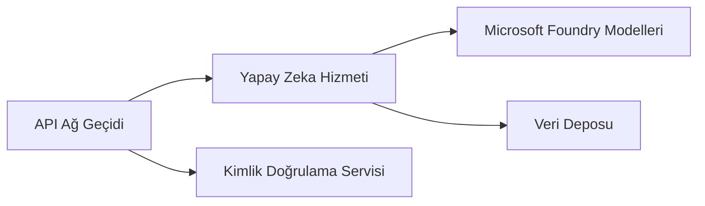
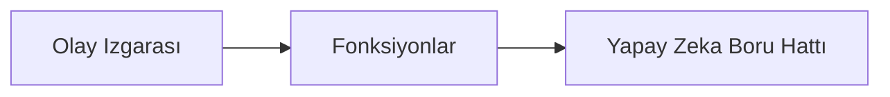

# Bölüm 8: Üretim ve Kurumsal Desenler

**📚 Kurs**: [AZD For Beginners](../../README.md) | **⏱️ Süre**: 2-3 saat | **⭐ Zorluk**: İleri

---

## Genel Bakış

Bu bölüm, kurumsal kullanıma hazır dağıtım desenleri, güvenlik sertleştirmesi, izleme ve üretim AI iş yükleri için maliyet optimizasyonunu kapsar.

> `azd 1.25.6` ile Haziran 2026'da doğrulanmıştır.

## Öğrenme Hedefleri

Bu bölümü tamamlayarak:
- Çok bölgeli dayanıklı uygulamalar dağıtacaksınız
- Kurumsal güvenlik desenlerini uygulayacaksınız
- Kapsamlı izlemeyi yapılandıracaksınız
- Ölçekte maliyetleri optimize edeceksiniz
- AZD ile CI/CD hattı kuracaksınız

---

## 📚 Dersler

| # | Ders | Açıklama | Süre |
|---|--------|-------------|------|
| 1 | [Üretim AI Uygulamaları](production-ai-practices.md) | Kurumsal dağıtım desenleri | 90 dk |

---

## 🚀 Üretim Kontrol Listesi

- [ ] Dayanıklılık için çok bölgeli dağıtım
- [ ] Kimlik doğrulama için yönetilen kimlik (anahtar yok)
- [ ] İzleme için Application Insights
- [ ] Maliyet bütçeleri ve uyarılar yapılandırıldı
- [ ] Güvenlik taraması etkin
- [ ] CI/CD hattı entegrasyonu
- [ ] Felaket kurtarma planı

---

## 🏗️ Mimari Desenler

### Desen 1: Mikroservis AI



### Desen 2: Olay Tabanlı AI



---

## 🔐 Güvenlik En İyi Uygulamaları

```bicep
// Use managed identity
identity: {
  type: 'SystemAssigned'
}

// Private endpoints for AI services
properties: {
  publicNetworkAccess: 'Disabled'
  networkAcls: {
    defaultAction: 'Deny'
  }
}
```

---

## 💰 Maliyet Optimizasyonu

| Strateji | Tasarruf |
|----------|---------|
| Sıfıra ölçekleme (Container Apps) | 60-80% |
| Geliştirme için tüketim katmanlarını kullanın | 50-70% |
| Zamanlanmış ölçeklendirme | 30-50% |
| Rezerve kapasite | 20-40% |

```bash
# Bütçe uyarıları ayarla
az consumption budget create \
  --budget-name "AI-Budget" \
  --amount 500 \
  --category Cost \
  --time-grain Monthly
```

---

## 📊 İzleme Kurulumu

```bash
# Günlükleri izle
azd monitor --logs

# Application Insights'ı kontrol et
azd monitor --overview

# Metrikleri görüntüle
az monitor metrics list --resource <resource-id>
```

---

## 🔗 Gezinme

| Yön | Bölüm |
|-----------|---------|
| **Önceki** | [Bölüm 7: Sorun Giderme](../chapter-07-troubleshooting/README.md) |
| **Kurs Tamamlandı** | [Kurs Ana Sayfası](../../README.md) |

---

## 📖 İlgili Kaynaklar

- [Yapay Zeka Ajanları Rehberi](../chapter-02-ai-development/agents.md)
- [Application Insights](../chapter-06-pre-deployment/application-insights.md)
- [Çok Ajanlı Çözümler](../chapter-05-multi-agent/README.md)
- [Mikroservis Örneği](../../examples/microservices/README.md)

---

<!-- CO-OP TRANSLATOR DISCLAIMER START -->
**Feragatname**:
Bu belge, AI çeviri hizmeti [Co-op Translator](https://github.com/Azure/co-op-translator) kullanılarak çevrilmiştir. Doğruluk için çaba sarf etsek de, otomatik çevirilerin hata veya yanlışlık içerebileceğini lütfen unutmayınız. Orijinal belge, kendi dilinde yetkili kaynak olarak kabul edilmelidir. Kritik bilgiler için profesyonel insan çevirisi önerilir. Bu çevirinin kullanımı sonucu ortaya çıkabilecek yanlış anlamalardan veya yanlış yorumlamalardan sorumlu değiliz.
<!-- CO-OP TRANSLATOR DISCLAIMER END -->