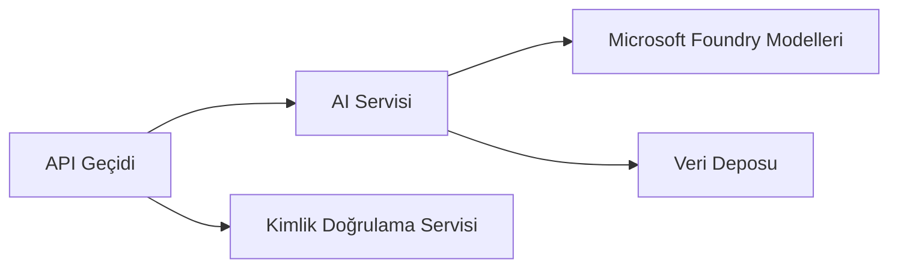

# Bölüm 8: Üretim ve Kurumsal Kalıplar

**📚 Kurs**: [Yeni Başlayanlar için AZD](../../README.md) | **⏱️ Süre**: 2-3 saat | **⭐ Zorluk**: İleri Düzey

---

## Genel Bakış

Bu bölüm, kurumsal düzeye hazır dağıtım kalıpları, güvenlik sertleştirme, izleme ve üretim AI iş yükleri için maliyet optimizasyonunu kapsar.

> Temmuz 2026'da `azd 1.27.1` ile doğrulanmıştır.

## Öğrenme Hedefleri

Bu bölümü tamamlayarak:
- Çok bölgeli dayanıklı uygulamalar dağıtacaksınız
- Kurumsal güvenlik kalıplarını uygulayacaksınız
- Kapsamlı izleme yapılandıracaksınız
- Ölçekli maliyet optimizasyonu yapacaksınız
- AZD ile CI/CD boru hatları kuracaksınız

---

## 📚 Dersler

| # | Ders | Açıklama | Süre |
|---|--------|-------------|------|
| 1 | [Üretim AI Uygulamaları](production-ai-practices.md) | Kurumsal dağıtım kalıpları | 90 dk |

---

## 🚀 Üretim Kontrol Listesi

- [ ] Dayanıklılık için çok bölgeli dağıtım
- [ ] Kimlik doğrulama için yönetilen kimlik (anahtarsız)
- [ ] İzleme için Application Insights
- [ ] Maliyet bütçeleri ve uyarılar yapılandırıldı
- [ ] Güvenlik taraması etkin
- [ ] CI/CD boru hattı entegrasyonu
- [ ] Felaket kurtarma planı

---

## 🏗️ Mimari Kalıplar

### Kalıp 1: Mikroservis AI



### Kalıp 2: Olay Tabanlı AI


---

## 🔐 Güvenlik En İyi Uygulamaları

```bicep
// Use managed identity
identity: {
  type: 'SystemAssigned'
}

// Private endpoints for AI services
properties: {
  publicNetworkAccess: 'Disabled'
  networkAcls: {
    defaultAction: 'Deny'
  }
}
```

---

## 💰 Maliyet Optimizasyonu

| Strateji | Tasarruf |
|----------|---------|
| Sıfıra ölçekleme (Container Apps) | %60-80 |
| Geliştirme için tüketim katmanlarını kullanma | %50-70 |
| Planlı ölçeklendirme | %30-50 |
| Ayrılmış kapasite | %20-40 |

```bash
# Bütçe uyarılarını ayarla
az consumption budget create \
  --budget-name "AI-Budget" \
  --amount 500 \
  --category Cost \
  --time-grain Monthly
```

---

## 📊 İzleme Kurulumu

```bash
# Akış günlükleri
azd monitor --logs

# Uygulama İçgörülerini kontrol et
azd monitor --overview

# Ölçümleri görüntüle
az monitor metrics list --resource <resource-id>
```

---

## 🔗 Gezinme

| Yön | Bölüm |
|-----------|---------|
| **Önceki** | [Bölüm 7: Sorun Giderme](../chapter-07-troubleshooting/README.md) |
| **Kurs Tamamlandı** | [Kurs Anasayfa](../../README.md) |

---

## 📖 İlgili Kaynaklar

- [AI Ajanları Kılavuzu](../chapter-02-ai-development/agents.md)
- [Application Insights](../chapter-06-pre-deployment/application-insights.md)
- [Çoklu Ajan Çözümleri](../chapter-05-multi-agent/README.md)
- [Mikroservis Örneği](../../examples/microservices/README.md)

---

<!-- CO-OP TRANSLATOR DISCLAIMER START -->
**Feragatname**:
Bu belge, AI çeviri hizmeti [Co-op Translator](https://github.com/Azure/co-op-translator) kullanılarak çevrilmiştir. Doğruluk için çaba sarf etsek de, otomatik çevirilerin hata veya yanlışlık içerebileceğini lütfen unutmayınız. Orijinal belge, kendi dilinde yetkili kaynak olarak kabul edilmelidir. Kritik bilgiler için profesyonel insan çevirisi önerilir. Bu çevirinin kullanımı sonucu ortaya çıkabilecek yanlış anlamalardan veya yanlış yorumlamalardan sorumlu değiliz.
<!-- CO-OP TRANSLATOR DISCLAIMER END -->