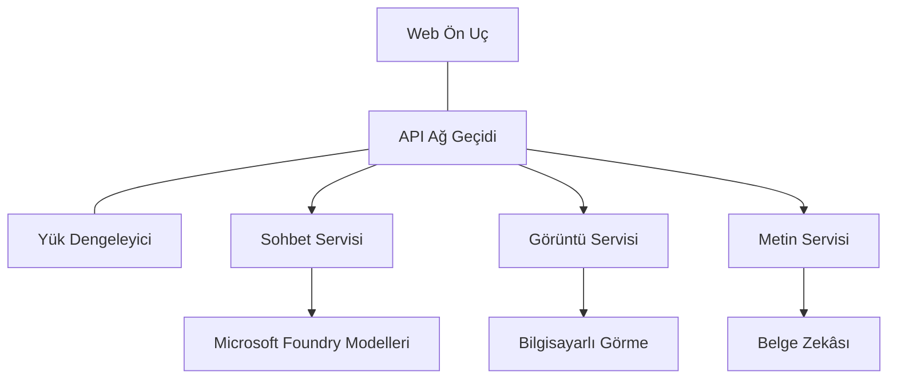

# AZD ile Üretim AI İş Yükü En İyi Uygulamaları

**Chapter Navigation:**
- **📚 Ders Ana Sayfası**: [AZD For Beginners](../../README.md)
- **📖 Mevcut Bölüm**: Bölüm 8 - Üretim ve Kurumsal Desenler
- **⬅️ Previous Chapter**: [Bölüm 7: Sorun Giderme](../chapter-07-troubleshooting/debugging.md)
- **⬅️ Also Related**: [AI Workshop Lab](ai-workshop-lab.md)
- **🎯 Ders Tamamlandı**: [AZD For Beginners](../../README.md)

## Genel Bakış

Bu rehber, Azure Developer CLI (AZD) kullanarak üretim hazır AI iş yükleri dağıtımı için kapsamlı en iyi uygulamaları sağlar. Microsoft Foundry Discord topluluğundan gelen geri bildirimler ve gerçek müşteri dağıtımlarına dayanarak, bu uygulamalar üretim AI sistemlerindeki en yaygın zorlukları ele alır.

## Ele Alınan Temel Zorluklar

Topluluk anketi sonuçlarımıza göre geliştiricilerin karşılaştığı en önemli zorluklar şunlardır:

- **45%** çok servisli AI dağıtımlarıyla zorlanıyor
- **38%** kimlik bilgileri ve gizli yönetimi ile ilgili sorunlar yaşıyor  
- **35%** üretim hazır olma ve ölçeklendirmeyi zor buluyor
- **32%** daha iyi maliyet optimizasyonu stratejilerine ihtiyaç duyuyor
- **29%** izleme ve sorun giderme iyileştirmeleri istiyor

## Üretim AI için Mimari Desenler

### Desen 1: Mikroservis AI Mimarisi

**Ne zaman kullanılır**: Birden çok yeteneğe sahip karmaşık AI uygulamaları



**AZD Uygulaması**:

```yaml
# azure.yaml
name: enterprise-ai-platform
services:
  web:
    project: ./web
    host: staticwebapp
  api-gateway:
    project: ./api-gateway
    host: containerapp
  chat-service:
    project: ./services/chat
    host: containerapp
  vision-service:
    project: ./services/vision
    host: containerapp
  text-service:
    project: ./services/text
    host: containerapp
```

### Desen 2: Olay Tabanlı AI İşleme

**Ne zaman kullanılır**: Toplu işleme, belge analizi, asenkron iş akışları

```bicep
// Event Hub for AI processing pipeline
resource eventHub 'Microsoft.EventHub/namespaces@2023-01-01-preview' = {
  name: eventHubNamespaceName
  location: location
  sku: {
    name: 'Standard'
    tier: 'Standard'
    capacity: 1
  }
}

// Service Bus for reliable message processing
resource serviceBus 'Microsoft.ServiceBus/namespaces@2022-10-01-preview' = {
  name: serviceBusNamespaceName
  location: location
  sku: {
    name: 'Premium'
    tier: 'Premium'
    capacity: 1
  }
}

// Function App for processing
resource functionApp 'Microsoft.Web/sites@2023-01-01' = {
  name: functionAppName
  location: location
  kind: 'functionapp,linux'
  properties: {
    siteConfig: {
      appSettings: [
        {
          name: 'FUNCTIONS_EXTENSION_VERSION'
          value: '~4'
        }
        {
          name: 'AZURE_OPENAI_ENDPOINT'
          value: '@Microsoft.KeyVault(VaultName=${keyVault.name};SecretName=openai-endpoint)'
        }
      ]
    }
  }
}
```

## AI Ajan Sağlığı Hakkında Düşünmek

Geleneksel bir web uygulaması bozulduğunda belirtiler tanıdıktır: bir sayfa yüklenmez, bir API hata döner veya bir dağıtım başarısız olur. AI destekli uygulamalar da bu aynı şekillerde bozulabilir—ama ayrıca belirgin hata mesajları üretmeyen daha ince hatalar da gösterebilirler.

Bu bölüm, AI iş yüklerini izlemek için bir zihinsel model oluşturmanıza yardımcı olur, böylece işler yolunda gitmediğinde nereye bakacağınızı bilirsiniz.

### Ajan Sağlığı Geleneksel Uygulama Sağlığından Nasıl Farklıdır

Geleneksel bir uygulama ya çalışır ya da çalışmaz. Bir AI ajanı çalışıyor gibi görünebilir ama kötü sonuçlar üretebilir. Ajan sağlığını iki katmanda düşünün:

| Katman | Ne İzlenmeli | Nereye Bakılmalı |
|-------|--------------|---------------|
| **Altyapı sağlığı** | Hizmet çalışıyor mu? Kaynaklar sağlandı mı? Uç noktalar erişilebilir mi? | `azd monitor`, Azure Portal kaynak sağlığı, konteyner/uygulama günlükleri |
| **Davranış sağlığı** | Ajan doğru yanıt veriyor mu? Yanıtlar zamanında mı? Model doğru şekilde çağrılıyor mu? | Application Insights izleri, model çağrısı gecikme metrikleri, yanıt kalite günlükleri |

Altyapı sağlığı tanıdık bir konudur—herhangi bir azd uygulaması için aynıdır. Davranış sağlığı ise AI iş yüklerinin getirdiği yeni katmandır.

### AI Uygulamaları Beklendiği Gibi Davranmadığında Nereye Bakılmalı

AI uygulamanız beklediğiniz sonuçları üretmiyorsa, işte kavramsal bir kontrol listesi:

1. **Temellerle başlayın.** Uygulama çalışıyor mu? Bağımlılıklarına ulaşabiliyor mu? Herhangi bir uygulamada yapacağınız gibi `azd monitor` ve kaynak sağlığını kontrol edin.
2. **Model bağlantısını kontrol edin.** Uygulamanız AI modeli başarıyla çağırıyor mu? Başarısız veya zaman aşımına uğrayan model çağrıları AI uygulaması sorunlarının en yaygın nedenidir ve uygulama günlüklerinizde görünecektir.
3. **Modelin aldığı girişe bakın.** AI yanıtları girdiye (prompt ve alınan bağlam) bağlıdır. Çıktı yanlışsa genellikle girdi yanlıştır. Uygulamanızın modele doğru veriyi gönderip göndermediğini kontrol edin.
4. **Yanıt gecikmesini inceleyin.** AI model çağrıları tipik API çağrılarından daha yavaştır. Uygulamanız yavaş hissediyorsa, model yanıt sürelerinin artıp artmadığını kontrol edin—bu, sınırlama, kapasite limitleri veya bölge düzeyinde tıkanıklık göstergesi olabilir.
5. **Maliyet sinyallerine dikkat edin.** Token kullanımında veya API çağrılarında beklenmeyen artışlar bir döngü, yanlış yapılandırılmış bir prompt veya aşırı yeniden deneme olduğuna işaret edebilir.

Gözlemlenebilirlik araçlarını hemen ustaca kullanmanız gerekmez. Ana çıkarım, AI uygulamalarının izlenecek ekstra bir davranış katmanına sahip olmasıdır ve azd'nin yerleşik izleme aracı (`azd monitor`) her iki katmanı araştırmak için bir başlangıç noktası sunar.

---

## Güvenlik En İyi Uygulamaları

### 1. Zero-Trust Güvenlik Modeli

**Uygulama Stratejisi**:
- Kimlik doğrulama olmadan hizmetten hizmete iletişim yok
- Tüm API çağrıları yönetilen kimlikleri kullanır
- Özel uç noktalar ile ağ izolasyonu
- En az ayrıcalık prensibiyle erişim kontrolleri

```bicep
// Managed Identity for each service
resource chatServiceIdentity 'Microsoft.ManagedIdentity/userAssignedIdentities@2023-01-31' = {
  name: 'chat-service-identity'
  location: location
}

// Role assignments with minimal permissions
resource openAIUserRole 'Microsoft.Authorization/roleAssignments@2022-04-01' = {
  scope: openAIAccount
  name: guid(openAIAccount.id, chatServiceIdentity.id, openAIUserRoleDefinitionId)
  properties: {
    roleDefinitionId: subscriptionResourceId('Microsoft.Authorization/roleDefinitions', '5e0bd9bd-7b93-4f28-af87-19fc36ad61bd')
    principalId: chatServiceIdentity.properties.principalId
    principalType: 'ServicePrincipal'
  }
}
```

### 2. Güvenli Gizli Yönetimi

**Key Vault Entegrasyon Deseni**:

```bicep
// Key Vault with proper access policies
resource keyVault 'Microsoft.KeyVault/vaults@2023-02-01' = {
  name: keyVaultName
  location: location
  properties: {
    tenantId: tenant().tenantId
    sku: {
      family: 'A'
      name: 'premium'  // Use premium for production
    }
    enableRbacAuthorization: true  // Use RBAC instead of access policies
    enablePurgeProtection: true    // Prevent accidental deletion
    enableSoftDelete: true
    softDeleteRetentionInDays: 90
  }
}

// Store all AI service credentials
resource openAIKeySecret 'Microsoft.KeyVault/vaults/secrets@2023-02-01' = {
  parent: keyVault
  name: 'openai-api-key'
  properties: {
    value: openAIAccount.listKeys().key1
    attributes: {
      enabled: true
    }
  }
}
```

### 3. Ağ Güvenliği

**Özel Uç Nokta Yapılandırması**:

```bicep
// Virtual Network for AI services
resource virtualNetwork 'Microsoft.Network/virtualNetworks@2023-04-01' = {
  name: vnetName
  location: location
  properties: {
    addressSpace: {
      addressPrefixes: ['10.0.0.0/16']
    }
    subnets: [
      {
        name: 'ai-services-subnet'
        properties: {
          addressPrefix: '10.0.1.0/24'
          privateEndpointNetworkPolicies: 'Disabled'
        }
      }
      {
        name: 'app-services-subnet'
        properties: {
          addressPrefix: '10.0.2.0/24'
          delegations: [
            {
              name: 'Microsoft.Web/serverFarms'
              properties: {
                serviceName: 'Microsoft.Web/serverFarms'
              }
            }
          ]
        }
      }
    ]
  }
}

// Private endpoints for all AI services
resource openAIPrivateEndpoint 'Microsoft.Network/privateEndpoints@2023-04-01' = {
  name: '${openAIAccountName}-pe'
  location: location
  properties: {
    subnet: {
      id: virtualNetwork.properties.subnets[0].id
    }
    privateLinkServiceConnections: [
      {
        name: 'openai-connection'
        properties: {
          privateLinkServiceId: openAIAccount.id
          groupIds: ['account']
        }
      }
    ]
  }
}
```

## Performans ve Ölçeklendirme

### 1. Otomatik Ölçeklendirme Stratejileri

**Container Apps Otomatik Ölçeklendirme**:

```bicep
resource containerApp 'Microsoft.App/containerApps@2023-05-01' = {
  name: containerAppName
  location: location
  properties: {
    configuration: {
      ingress: {
        external: true
        targetPort: 8000
        transport: 'http'
      }
    }
    template: {
      scale: {
        minReplicas: 2  // Always have 2 instances minimum
        maxReplicas: 50 // Scale up to 50 for high load
        rules: [
          {
            name: 'http-scaling'
            http: {
              metadata: {
                concurrentRequests: '20'  // Scale when >20 concurrent requests
              }
            }
          }
          {
            name: 'cpu-scaling'
            custom: {
              type: 'cpu'
              metadata: {
                type: 'Utilization'
                value: '70'  // Scale when CPU >70%
              }
            }
          }
        ]
      }
    }
  }
}
```

### 2. Önbellekleme Stratejileri

**AI Yanıtları için Redis Önbelleği**:

```bicep
// Redis Premium for production workloads
resource redisCache 'Microsoft.Cache/redis@2023-04-01' = {
  name: redisCacheName
  location: location
  properties: {
    sku: {
      name: 'Premium'
      family: 'P'
      capacity: 1
    }
    enableNonSslPort: false
    minimumTlsVersion: '1.2'
    redisConfiguration: {
      'maxmemory-policy': 'allkeys-lru'
    }
    // Enable clustering for high availability
    redisVersion: '6.0'
    shardCount: 2
  }
}

// Cache configuration in application
var cacheConnectionString = '${redisCache.properties.hostName}:6380,password=${redisCache.listKeys().primaryKey},ssl=True,abortConnect=False'
```

### 3. Yük Dengeleme ve Trafik Yönetimi

**WAF ile Application Gateway**:

```bicep
// Application Gateway with Web Application Firewall
resource applicationGateway 'Microsoft.Network/applicationGateways@2023-04-01' = {
  name: appGatewayName
  location: location
  properties: {
    sku: {
      name: 'WAF_v2'
      tier: 'WAF_v2'
      capacity: 2
    }
    webApplicationFirewallConfiguration: {
      enabled: true
      firewallMode: 'Prevention'
      ruleSetType: 'OWASP'
      ruleSetVersion: '3.2'
    }
    // Backend pools for AI services
    backendAddressPools: [
      {
        name: 'ai-services-pool'
        properties: {
          backendAddresses: [
            {
              fqdn: '${containerApp.properties.configuration.ingress.fqdn}'
            }
          ]
        }
      }
    ]
  }
}
```

## 💰 Maliyet Optimizasyonu

### 1. Kaynakların Doğru Boyutlandırılması

**Ortam Bazlı Yapılandırmalar**:

```bash
# Geliştirme ortamı
azd env new development
azd env set AZURE_OPENAI_SKU "S0"
azd env set AZURE_OPENAI_CAPACITY 10
azd env set AZURE_SEARCH_SKU "basic"
azd env set CONTAINER_CPU 0.5
azd env set CONTAINER_MEMORY 1.0

# Üretim ortamı
azd env new production
azd env set AZURE_OPENAI_SKU "S0"
azd env set AZURE_OPENAI_CAPACITY 100
azd env set AZURE_SEARCH_SKU "standard"
azd env set CONTAINER_CPU 2.0
azd env set CONTAINER_MEMORY 4.0
```

### 2. Maliyet İzleme ve Bütçeler

```bicep
// Cost management and budgets
resource budget 'Microsoft.Consumption/budgets@2023-05-01' = {
  name: 'ai-workload-budget'
  properties: {
    timePeriod: {
      startDate: '2024-01-01'
      endDate: '2024-12-31'
    }
    timeGrain: 'Monthly'
    amount: 2000  // $2000 monthly budget
    category: 'Cost'
    notifications: {
      warning: {
        enabled: true
        operator: 'GreaterThan'
        threshold: 80
        contactEmails: [
          'finance@company.com'
          'engineering@company.com'
        ]
        contactRoles: [
          'Owner'
          'Contributor'
        ]
      }
      critical: {
        enabled: true
        operator: 'GreaterThan'
        threshold: 95
        contactEmails: [
          'cto@company.com'
        ]
      }
    }
  }
}
```

### 3. Token Kullanım Optimizasyonu

**OpenAI Maliyet Yönetimi**:

```typescript
// Uygulama düzeyinde token optimizasyonu
class TokenOptimizer {
  private readonly maxTokens = 4000;
  private readonly reserveTokens = 500;
  
  optimizePrompt(userInput: string, context: string): string {
    const availableTokens = this.maxTokens - this.reserveTokens;
    const estimatedTokens = this.estimateTokens(userInput + context);
    
    if (estimatedTokens > availableTokens) {
      // Bağlamı kısaltın, kullanıcı girdisini değil
      context = this.truncateContext(context, availableTokens - this.estimateTokens(userInput));
    }
    
    return `${context}\n\nUser: ${userInput}`;
  }
  
  private estimateTokens(text: string): number {
    // Yaklaşık tahmin: 1 token ≈ 4 karakter
    return Math.ceil(text.length / 4);
  }
}
```

## İzleme ve Gözlemlenebilirlik

### 1. Kapsamlı Application Insights

```bicep
// Application Insights with advanced features
resource applicationInsights 'Microsoft.Insights/components@2020-02-02' = {
  name: applicationInsightsName
  location: location
  kind: 'web'
  properties: {
    Application_Type: 'web'
    WorkspaceResourceId: logAnalyticsWorkspace.id
    SamplingPercentage: 100  // Full sampling for AI apps
    DisableIpMasking: false  // Enable for security
  }
}

// Custom metrics for AI operations
resource aiMetricAlerts 'Microsoft.Insights/metricAlerts@2018-03-01' = {
  name: 'ai-high-error-rate'
  location: 'global'
  properties: {
    description: 'Alert when AI service error rate is high'
    severity: 2
    enabled: true
    scopes: [
      applicationInsights.id
    ]
    evaluationFrequency: 'PT1M'
    windowSize: 'PT5M'
    criteria: {
      'odata.type': 'Microsoft.Azure.Monitor.SingleResourceMultipleMetricCriteria'
      allOf: [
        {
          name: 'high-error-rate'
          metricName: 'requests/failed'
          operator: 'GreaterThan'
          threshold: 10
          timeAggregation: 'Count'
        }
      ]
    }
  }
}
```

### 2. AI'ya Özel İzleme

**AI Metrikleri için Özel Panolar**:

```json
// Dashboard configuration for AI workloads
{
  "dashboard": {
    "name": "AI Application Monitoring",
    "tiles": [
      {
        "name": "OpenAI Request Volume",
        "query": "requests | where name contains 'openai' | summarize count() by bin(timestamp, 5m)"
      },
      {
        "name": "AI Response Latency",
        "query": "requests | where name contains 'openai' | summarize avg(duration) by bin(timestamp, 5m)"
      },
      {
        "name": "Token Usage",
        "query": "customMetrics | where name == 'openai_tokens_used' | summarize sum(value) by bin(timestamp, 1h)"
      },
      {
        "name": "Cost per Hour",
        "query": "customMetrics | where name == 'openai_cost' | summarize sum(value) by bin(timestamp, 1h)"
      }
    ]
  }
}
```

### 3. Sağlık Kontrolleri ve Çalışır Durum İzleme

```bicep
// Application Insights availability tests
resource availabilityTest 'Microsoft.Insights/webtests@2022-06-15' = {
  name: 'ai-app-availability-test'
  location: location
  tags: {
    'hidden-link:${applicationInsights.id}': 'Resource'
  }
  properties: {
    SyntheticMonitorId: 'ai-app-availability-test'
    Name: 'AI Application Availability Test'
    Description: 'Tests AI application endpoints'
    Enabled: true
    Frequency: 300  // 5 minutes
    Timeout: 120    // 2 minutes
    Kind: 'ping'
    Locations: [
      {
        Id: 'us-east-2-azr'
      }
      {
        Id: 'us-west-2-azr'
      }
    ]
    Configuration: {
      WebTest: '''
        <WebTest Name="AI Health Check" 
                 Id="8d2de8d2-a2b0-4c2e-9a0d-8f9c9a0b8c8d" 
                 Enabled="True" 
                 CssProjectStructure="" 
                 CssIteration="" 
                 Timeout="120" 
                 WorkItemIds="" 
                 xmlns="http://microsoft.com/schemas/VisualStudio/TeamTest/2010" 
                 Description="" 
                 CredentialUserName="" 
                 CredentialPassword="" 
                 PreAuthenticate="True" 
                 Proxy="default" 
                 StopOnError="False" 
                 RecordedResultFile="" 
                 ResultsLocale="">
          <Items>
            <Request Method="GET" 
                     Guid="a5f10126-e4cd-570d-961c-cea43999a200" 
                     Version="1.1" 
                     Url="${webApp.properties.defaultHostName}/health" 
                     ThinkTime="0" 
                     Timeout="120" 
                     ParseDependentRequests="True" 
                     FollowRedirects="True" 
                     RecordResult="True" 
                     Cache="False" 
                     ResponseTimeGoal="0" 
                     Encoding="utf-8" 
                     ExpectedHttpStatusCode="200" 
                     ExpectedResponseUrl="" 
                     ReportingName="" 
                     IgnoreHttpStatusCode="False" />
          </Items>
        </WebTest>
      '''
    }
  }
}
```

## Felaket Kurtarma ve Yüksek Erişilebilirlik

### 1. Çok Bölge Dağıtımı

```yaml
# azure.yaml - Multi-region configuration
name: ai-app-multiregion
services:
  api-primary:
    project: ./api
    host: containerapp
    env:
      - AZURE_REGION=eastus
  api-secondary:
    project: ./api
    host: containerapp
    env:
      - AZURE_REGION=westus2
```

```bicep
// Traffic Manager for global load balancing
resource trafficManager 'Microsoft.Network/trafficManagerProfiles@2022-04-01' = {
  name: trafficManagerProfileName
  location: 'global'
  properties: {
    profileStatus: 'Enabled'
    trafficRoutingMethod: 'Priority'
    dnsConfig: {
      relativeName: trafficManagerProfileName
      ttl: 30
    }
    monitorConfig: {
      protocol: 'HTTPS'
      port: 443
      path: '/health'
      intervalInSeconds: 30
      toleratedNumberOfFailures: 3
      timeoutInSeconds: 10
    }
    endpoints: [
      {
        name: 'primary-endpoint'
        type: 'Microsoft.Network/trafficManagerProfiles/azureEndpoints'
        properties: {
          targetResourceId: primaryAppService.id
          endpointStatus: 'Enabled'
          priority: 1
        }
      }
      {
        name: 'secondary-endpoint'
        type: 'Microsoft.Network/trafficManagerProfiles/azureEndpoints'
        properties: {
          targetResourceId: secondaryAppService.id
          endpointStatus: 'Enabled'
          priority: 2
        }
      }
    ]
  }
}
```

### 2. Veri Yedekleme ve Kurtarma

```bicep
// Backup configuration for critical data
resource backupVault 'Microsoft.DataProtection/backupVaults@2023-05-01' = {
  name: backupVaultName
  location: location
  identity: {
    type: 'SystemAssigned'
  }
  properties: {
    storageSettings: [
      {
        datastoreType: 'VaultStore'
        type: 'LocallyRedundant'
      }
    ]
  }
}

// Backup policy for AI models and data
resource backupPolicy 'Microsoft.DataProtection/backupVaults/backupPolicies@2023-05-01' = {
  parent: backupVault
  name: 'ai-data-backup-policy'
  properties: {
    policyRules: [
      {
        backupParameters: {
          backupType: 'Full'
          objectType: 'AzureBackupParams'
        }
        trigger: {
          schedule: {
            repeatingTimeIntervals: [
              'R/2024-01-01T02:00:00+00:00/P1D'  // Daily at 2 AM
            ]
          }
          objectType: 'ScheduleBasedTriggerContext'
        }
        dataStore: {
          datastoreType: 'VaultStore'
          objectType: 'DataStoreInfoBase'
        }
        name: 'BackupDaily'
        objectType: 'AzureBackupRule'
      }
    ]
  }
}
```

## DevOps ve CI/CD Entegrasyonu

### 1. GitHub Actions İş Akışı

```yaml
# .github/workflows/deploy-ai-app.yml
name: Deploy AI Application

on:
  push:
    branches: [main]
  pull_request:
    branches: [main]

jobs:
  test:
    runs-on: ubuntu-latest
    steps:
      - uses: actions/checkout@v4
      
      - name: Setup Python
        uses: actions/setup-python@v4
        with:
          python-version: '3.11'
          
      - name: Install dependencies
        run: |
          pip install -r requirements.txt
          pip install pytest
          
      - name: Run tests
        run: pytest tests/
        
      - name: AI Safety Tests
        run: |
          python scripts/test_ai_safety.py
          python scripts/validate_prompts.py

  deploy-staging:
    needs: test
    if: github.event_name == 'pull_request'
    runs-on: ubuntu-latest
    steps:
      - uses: actions/checkout@v4
      
      - name: Setup AZD
        uses: Azure/setup-azd@v2
        
      - name: Login to Azure
        uses: azure/login@v1
        with:
          creds: ${{ secrets.AZURE_CREDENTIALS }}
          
      - name: Deploy to Staging
        run: |
          azd env select staging
          azd deploy

  deploy-production:
    needs: test
    if: github.ref == 'refs/heads/main'
    runs-on: ubuntu-latest
    steps:
      - uses: actions/checkout@v4
      
      - name: Setup AZD
        uses: Azure/setup-azd@v2
        
      - name: Login to Azure
        uses: azure/login@v1
        with:
          creds: ${{ secrets.AZURE_CREDENTIALS }}
          
      - name: Deploy to Production
        run: |
          azd env select production
          azd deploy
          
      - name: Run Production Health Checks
        run: |
          python scripts/health_check.py --env production
```

### 2. Altyapı Doğrulama

```bash
# scripts/validate_infrastructure.sh
#!/bin/bash

echo "Validating AI infrastructure deployment..."

# Gerekli tüm servislerin çalışıp çalışmadığını kontrol et
services=("openai" "search" "storage" "keyvault")
for service in "${services[@]}"; do
    echo "Checking $service..."
    if ! az resource list --resource-type "Microsoft.CognitiveServices/accounts" --query "[?contains(name, '$service')]" -o tsv; then
        echo "ERROR: $service not found"
        exit 1
    fi
done

# OpenAI model dağıtımlarını doğrula
echo "Validating OpenAI model deployments..."
models=$(az cognitiveservices account deployment list --name $AZURE_OPENAI_NAME --resource-group $AZURE_RESOURCE_GROUP --query "[].name" -o tsv)
if [[ ! $models == *"gpt-4.1-mini"* ]]; then
  echo "ERROR: Required model gpt-4.1-mini not deployed"
    exit 1
fi

# Yapay zeka hizmeti bağlantısını test et
echo "Testing AI service connectivity..."
python scripts/test_connectivity.py

echo "Infrastructure validation completed successfully!"
```

## Üretim Hazır Olma Kontrol Listesi

### Güvenlik ✅
- [ ] Tüm servisler yönetilen kimlikleri kullanıyor
- [ ] Gizli bilgiler Key Vault'ta saklanıyor
- [ ] Özel uç noktalar yapılandırıldı
- [ ] Ağ güvenliği grupları uygulandı
- [ ] En az ayrıcalıklı RBAC uygulandı
- [ ] Genel uç noktalarda WAF etkinleştirildi

### Performans ✅
- [ ] Otomatik ölçeklendirme yapılandırıldı
- [ ] Önbellekleme uygulandı
- [ ] Yük dengeleme kuruldu
- [ ] Statik içerik için CDN yapılandırıldı
- [ ] Veritabanı bağlantı havuzu yapılandırıldı
- [ ] Token kullanım optimizasyonu yapıldı

### İzleme ✅
- [ ] Application Insights yapılandırıldı
- [ ] Özel metrikler tanımlandı
- [ ] Uyarı kuralları oluşturuldu
- [ ] Pano oluşturuldu
- [ ] Sağlık kontrolleri uygulandı
- [ ] Günlük saklama politikaları

### Güvenilirlik ✅
- [ ] Çok bölge dağıtımı yapılandırıldı
- [ ] Yedekleme ve kurtarma planı hazırlandı
- [ ] Devre kesiciler uygulandı
- [ ] Yeniden deneme politikaları yapılandırıldı
- [ ] Kademeli bozulma uygulandı
- [ ] Sağlık kontrol uç noktaları uygulandı

### Maliyet Yönetimi ✅
- [ ] Bütçe uyarıları yapılandırıldı
- [ ] Kaynakların doğru boyutlandırılması yapıldı
- [ ] Geliştirme/test indirimleri uygulandı
- [ ] Rezerve edilmiş örnekler satın alındı
- [ ] Maliyet izleme panosu oluşturuldu
- [ ] Düzenli maliyet incelemeleri planlandı

### Uyumluluk ✅
- [ ] Veri bulundurma gereksinimleri karşılandı
- [ ] Denetim günlük kaydı etkinleştirildi
- [ ] Uyumluluk politikaları uygulandı
- [ ] Güvenlik temel yapılandırmaları uygulandı
- [ ] Düzenli güvenlik değerlendirmeleri yapılıyor
- [ ] Olay müdahale planı hazır

## Performans Ölçütleri

### Tipik Üretim Metrikleri

| Metrik | Hedef | İzleme |
|--------|--------|------------|
| **Yanıt Süresi** | < 2 seconds | Application Insights |
| **Kullanılabilirlik** | 99.9% | Çalışır durum izleme |
| **Hata Oranı** | < 0.1% | Uygulama günlükleri |
| **Token Kullanımı** | < $500/month | Maliyet yönetimi |
| **Eşzamanlı Kullanıcılar** | 1000+ | Yük testleri |
| **Kurtarma Süresi** | < 1 hour | Felaket kurtarma testleri |

### Yük Testi

```bash
# Yapay zeka uygulamaları için yük testi betiği
python scripts/load_test.py \
  --endpoint https://your-ai-app.azurewebsites.net \
  --concurrent-users 100 \
  --duration 300 \
  --ramp-up 60
```

## 🤝 Topluluk En İyi Uygulamaları

Microsoft Foundry Discord topluluğu geri bildirimlerine dayanarak:

### Topluluğun Öne Çıkan Önerileri:

1. **Küçük Başlayın, Kademeli Ölçekleyin**: Temel SKU'larla başlayın ve gerçek kullanım temelinde ölçeklendirin
2. **Her Şeyi İzleyin**: İlk günden itibaren kapsamlı izleme kurun
3. **Güvenliği Otomatikleştirin**: Tutarlı güvenlik için altyapıyı kod olarak kullanın
4. **İyi Test Edin**: Pipeline'ınıza AI'ya özel testleri ekleyin
5. **Maliyetleri Planlayın**: Token kullanımını izleyin ve erken bütçe uyarıları ayarlayın

### Kaçınılması Gereken Yaygın Tuzaklar:

- ❌ API anahtarlarını kod içinde sabitlemek
- ❌ Uygun izlemeyi kurmamak
- ❌ Maliyet optimizasyonunu görmezden gelmek
- ❌ Hata senaryolarını test etmemek
- ❌ Sağlık kontrolleri olmadan dağıtım yapmak

## AZD AI CLI Komutları ve Uzantıları

AZD, üretim AI iş akışlarını sadeleştiren AI'ya özel komutlar ve uzantılar içeren büyüyen bir set içerir. Bu araçlar, yerel geliştirme ile üretim dağıtımı arasındaki boşluğu AI iş yükleri için kapatır.

### AI için AZD Uzantıları

AZD, AI'ya özel yetenekler eklemek için bir uzantı sistemi kullanır. Uzantıları kurun ve yönetin:

```bash
# Tüm kullanılabilir uzantıları listele (yapay zeka dahil)
azd extension list

# Yüklü uzantı ayrıntılarını incele
azd extension show azure.ai.agents

# Foundry agents uzantısını yükle
azd extension install azure.ai.agents

# İnce ayar uzantısını yükle
azd extension install azure.ai.finetune

# Özel modeller uzantısını yükle
azd extension install azure.ai.models

# Tüm yüklü uzantıları yükselt
azd extension upgrade --all
```

**Mevcut AI uzantıları:**

| Uzantı | Amaç | Durum |
|-----------|---------|--------|
| `azure.ai.agents` | Foundry Ajan Servisi yönetimi | Önizleme |
| `azure.ai.skills` | Yeniden kullanılabilir ajan becerileri | Önizleme |
| `azure.ai.connections` | Foundry bağlantıları (veri kaynakları, araçlar) | Önizleme |
| `azure.ai.finetune` | Foundry model ince ayarı | Önizleme |
| `azure.ai.models` | Foundry özel modeller | Önizleme |
| `azure.coding-agent` | Kodlama ajanı yapılandırması | Mevcut |

> `azure.ai.agents` uzantısı hızla gelişiyor. Bu kurs `0.1.40-preview` sürümü ile doğrulandı. En son komut kümesini almak için `azd extension upgrade --all` çalıştırın ve yüklü sürümünüzü doğrulamak için `azd extension show azure.ai.agents` çalıştırın.

**Yeni `skills` ve `connections` uzantıları nedir?**

Ajan araçlarıyla birlikte iki önizleme uzantısı ortaya çıktı ve bunları bir acemi olarak bile anlamaya değer:

- **`azure.ai.skills`** — Bir **skill** tekrar kullanılabilir bir yetenektir (paketlenmiş bir araç veya davranış) ve her seferinde yeniden uygulamak yerine bir veya daha fazla ajana ekleyebilirsiniz. Bunu paylaşılan bir yapı taşı gibi düşünün: bir kez "dokümanlarda ara" veya "bir siparişi kontrol et" becerisini tanımlayın, sonra bunu ajanlar arasında yeniden kullanın. Bu, çok ajanlı sistemleri (Bölüm 5) tutarlı kılar ve kopyala-yapıştırı önler.
- **`azure.ai.connections`** — Bir **connection**, Foundry projenizden ajanlarınızın ihtiyaç duyduğu harici bir kaynağa yönetilen bir bağlantıdır — bir veri kaynağı (ör. Azure AI Search), bir araç uç noktası veya başka bir hizmet. Connections, ajanların veriye *nereden* ve *nasıl* eriştiğini merkezileştirir, böylece kimlik bilgileri ve uç noktalar kodda dağıtılmış olmak yerine tek bir yönetilen yerde saklanır.

İlk ajanlarınızı dağıtmak için bunlara ihtiyacınız yok—öğrenirken `azure.ai.agents` ile kalın. Aynı aracı ajanlar arasında çoğalttığınızı fark ettiğinizde `skills`'e, birkaç ajan aynı veri kaynağını paylaşıyorsa `connections`'a yönelin.

### `azd ai agent init` ile Ajan Projelerini Başlatma

`azd ai agent init` komutu, Microsoft Foundry Agent Service ile entegre edilmiş üretim hazır bir AI ajan projesi iskeleti oluşturur:

```bash
# Bir ajan manifestosundan yeni bir ajan projesi başlatın
azd ai agent init -m <manifest-path-or-uri>

# Belirli bir Foundry projesini başlatın ve hedefleyin
azd ai agent init -m agent-manifest.yaml --project-id <foundry-project-id>

# Özel bir kaynak dizini kullanarak başlatın
azd ai agent init -m agent-manifest.yaml --src ./agents/my-agent

# Container Apps'i ev sahibi olarak hedefleyin
azd ai agent init -m agent-manifest.yaml --host containerapp
```

**Önemli bayraklar:**

| Bayrak | Açıklama |
|------|-------------|
| `-m, --manifest` | Projenize eklemek için bir ajan manifestinin yolunu veya URI'sini belirtir |
| `-p, --project-id` | azd ortamınız için mevcut Microsoft Foundry Proje ID'si |
| `-s, --src` | Ajan tanımının indirileceği dizin (varsayılan `src/<agent-id>`) |
| `--host` | Varsayılan host'u geçersiz kılma (ör. `containerapp`) |
| `-e, --environment` | Kullanılacak azd ortamı |

**Üretim ipucu**: `--project-id` kullanarak mevcut bir Foundry projesine doğrudan bağlanın; böylece ajan kodunuz ve bulut kaynaklarınız baştan itibaren bağlı olur.

### Ajan Yaşam Döngüsünü Yönetme

`init`'in ötesinde, `azure.ai.agents` uzantısı barındırılan bir ajanın tüm yaşam döngüsü için komutlar sağlar—test etme, değerlendirme, iyileştirme ve emekliye ayırma:

```bash
# Dağıtılmış bir ajanı çağırın ve sunucu yanıt sürelerini görüntüleyin
# (toplam gecikme ve ilk bayta kadar geçen süre)
azd ai agent invoke

# Değiştirmeden önce canlı uç nokta yapılandırmasını gösterin
azd ai agent endpoint show

# Ajan için bir değerlendirme veri kümesi oluşturun
azd ai agent eval generate --dataset ./eval/dataset.jsonl

# Ajan yönergelerini değerlendirme verilerinize göre optimize edin
# (ajan projesinde bir optimization_model gerektirir)
azd ai agent optimize

# Kod tabanlı bir barındırılan ajanın dağıtılmış kaynağını indirin
# (SHA-256 doğrulamasıyla)
azd ai agent code download

# Bir barındırılan ajanı ve tüm sürümlerini silin
# (--force etkin oturumları sonlandırır)
azd ai agent delete --force
```

**Yaşam döngüsüne genel bakış:**

| Aşama | Komut | Üretimde kullanım |
|-------|---------|----------------|
| Test | `azd ai agent invoke` | Yayından önce yanıtları doğrulayın ve gecikmeyi ölçün |
| İncele | `azd ai agent endpoint show` | Uç nokta kimlik doğrulamasını/yapılandırmasını gözden geçirin; erken kırılmalara dikkat edin |
| Ölçüm | `azd ai agent eval generate` | Gerçek izlerden tekrar üretilebilir bir değerlendirme seti oluşturun |
| İyileştir | `azd ai agent optimize` | Ölçülen kaliteye göre yönergeleri ayarlayın |
| Kurtar | `azd ai agent code download` | Denetim/geri alma için tam dağıtılan kaynağı alın |
| Emekliye ayır | `azd ai agent delete --force` | Bir ajanı ve sürümlerini temiz bir şekilde kaldırın |

> Bunlar önizleme komutlarıdır ve uzantı sürümleri arasında değişebilir. Yüklü sürümünüzdeki tam alt komutları görmek için `azd ai agent --help` çalıştırın.

### `azd mcp` ile Model Bağlam Protokolü (MCP)
AZD includes built-in MCP server support (Alpha), enabling AI agents and tools to interact with your Azure resources through a standardized protocol:

```bash
# Projeniz için MCP sunucusunu başlatın
azd mcp start

# Araç yürütmesi için mevcut Copilot onay kurallarını gözden geçirin
azd copilot consent list
```

The MCP server exposes your azd project context—environments, services, and Azure resources—to AI-powered development tools. This enables:

- **AI-assisted deployment**: Let coding agents query your project state and trigger deployments
- **Resource discovery**: AI tools can discover what Azure resources your project uses
- **Environment management**: Agents can switch between dev/staging/production environments

### Infrastructure Generation with `azd infra generate`

For production AI workloads, you can generate and customize Infrastructure as Code rather than relying on automatic provisioning:

```bash
# Proje tanımınızdan Bicep/Terraform dosyaları oluşturun
azd infra generate
```

This writes IaC to disk so you can:
- Review and audit infrastructure before deploying
- Add custom security policies (network rules, private endpoints)
- Integrate with existing IaC review processes
- Version control infrastructure changes separately from application code

### Production Lifecycle Hooks

AZD hooks let you inject custom logic at every stage of the deployment lifecycle—critical for production AI workflows:

```yaml
# azure.yaml - Production hooks example
name: ai-production-app
hooks:
  preprovision:
    shell: sh
    run: scripts/validate-quotas.sh    # Check AI model quota before provisioning
  postprovision:
    shell: sh
    run: scripts/configure-networking.sh  # Set up private endpoints
  predeploy:
    shell: sh
    run: scripts/run-ai-safety-tests.sh  # Run prompt safety checks
  postdeploy:
    shell: sh
    run: scripts/smoke-test.sh           # Verify agent responses post-deploy
services:
  agent-api:
    project: ./src/agent
    host: containerapp
    hooks:
      predeploy:
        shell: sh
        run: scripts/validate-model-access.sh  # Per-service hook
```

```bash
# Geliştirme sırasında belirli bir kancayı manuel olarak çalıştır
azd hooks run predeploy
```

**Recommended production hooks for AI workloads:**

| Kanca | Kullanım Durumu |
|------|----------|
| `preprovision` | AI model kapasitesi için abonelik kotalarını doğrulayın |
| `postprovision` | Özel uç noktaları yapılandırın, model ağırlıklarını dağıtın |
| `predeploy` | AI güvenlik testlerini çalıştırın, prompt şablonlarını doğrulayın |
| `postdeploy` | Ajan yanıtlarını hızlı test edin, model bağlantısını doğrulayın |

### CI/CD Pipeline Configuration

Use `azd pipeline config` to connect your project to GitHub Actions or Azure Pipelines with secure Azure authentication:

```bash
# CI/CD boru hattını yapılandır (etkileşimli)
azd pipeline config

# Belirli bir sağlayıcıyla yapılandır
azd pipeline config --provider github
```

This command:
- Creates a service principal with least-privilege access
- Configures federated credentials (no stored secrets)
- Generates or updates your pipeline definition file
- Sets required environment variables in your CI/CD system

#### Step-by-step: your first GitHub Actions pipeline

Here's the full walkthrough from a working azd project to automated deployments on every push.

**1. Make sure your project is on GitHub**

```bash
git init
git add .
git commit -m "Initial azd project"
gh repo create my-ai-app --private --source=. --push
```

**2. Run pipeline config**

```bash
azd pipeline config --provider github
```

azd will, interactively:
- Ask which Azure subscription and environment to target
- Create an Entra **app registration + service principal** for the pipeline
- Set up **federated credentials (OIDC)**—so GitHub authenticates to Azure with short-lived tokens and **no secrets are stored**
- Push the required **variables** to your GitHub repo (`AZURE_CLIENT_ID`, `AZURE_TENANT_ID`, `AZURE_SUBSCRIPTION_ID`, `AZURE_ENV_NAME`, `AZURE_LOCATION`)

**3. Understand the generated workflow**

azd adds `.github/workflows/azure-dev.yml`. The key parts look like this:

```yaml
# .github/workflows/azure-dev.yml
on:
  push:
    branches: [ main ]
  workflow_dispatch:        # lets you run it manually too

permissions:
  id-token: write           # required for OIDC federated login
  contents: read

jobs:
  build:
    runs-on: ubuntu-latest
    env:
      AZURE_CLIENT_ID: ${{ vars.AZURE_CLIENT_ID }}
      AZURE_TENANT_ID: ${{ vars.AZURE_TENANT_ID }}
      AZURE_SUBSCRIPTION_ID: ${{ vars.AZURE_SUBSCRIPTION_ID }}
      AZURE_ENV_NAME: ${{ vars.AZURE_ENV_NAME }}
      AZURE_LOCATION: ${{ vars.AZURE_LOCATION }}
    steps:
      - uses: actions/checkout@v4
      - name: Install azd
        uses: Azure/setup-azd@v2
      - name: Log in with OIDC
        run: azd auth login --client-id "$AZURE_CLIENT_ID" --federated-credential-provider "github" --tenant-id "$AZURE_TENANT_ID"
      - name: Provision infrastructure
        run: azd provision --no-prompt
      - name: Deploy application
        run: azd deploy --no-prompt
```

**4. Verify it works**

```bash
# Pipeline'ı tetiklemek için bir değişiklik gönderin
git commit -am "Trigger pipeline" --allow-empty
git push
```

Open the **Actions** tab in your GitHub repo and watch the workflow run `azd provision` and `azd deploy` automatically.

> **Why federated credentials matter:** older pipelines stored a client secret in GitHub. OIDC federated credentials remove that secret entirely—GitHub requests a short-lived token at runtime, which is both more secure and nothing to rotate or leak. This is the default `azd pipeline config` sets up.

> **Secrets vs. variables:** non-sensitive identifiers (`AZURE_CLIENT_ID`, etc.) go in repo **variables**. If your app genuinely needs a secret at build time, add it as a GitHub **secret** and reference it with `${{ secrets.NAME }}`—but prefer Key Vault + managed identity at runtime (see [Chapter 3](../chapter-03-configuration/authsecurity.md)).

**Production workflow with pipeline config:**

```bash
# 1. Üretim ortamını kurun
azd env new production
azd env set AZURE_OPENAI_CAPACITY 100

# 2. pipeline'ı yapılandırın
azd pipeline config --provider github

# 3. pipeline, main dalına yapılan her push'ta azd deploy komutunu çalıştırır
```

#### Step-by-step: Azure DevOps Pipelines

Prefer Azure DevOps over GitHub Actions? azd supports it natively with the `azdo` provider. The flow is nearly identical—azd generates the pipeline file, creates a service connection, and wires up authentication.

**1. Make sure you have an Azure DevOps project**

You need an organization and a project at `https://dev.azure.com/<your-org>`. Generate a Personal Access Token (PAT) with **Build (Read & execute)**, **Code (Read & write)**, and **Service Connections (Read, query & manage)** scopes—azd will prompt you for it.

**2. Configure the pipeline**

```bash
azd pipeline config --provider azdo
```

azd will:
- Ask for your Azure DevOps organization and project
- Create (or reuse) a **service connection** to Azure using a service principal
- Configure **workload identity federation (OIDC)** so no client secret is stored
- Commit an `azure-dev.yml` pipeline definition to your repo

**3. Review the generated `azure-dev.yml`**

azd writes a pipeline that provisions and deploys on every push to `main`:

```yaml
# azure-dev.yml
trigger:
  - main

pool:
  vmImage: ubuntu-latest

steps:
  - task: setup-azd@1
    displayName: Install azd

  - script: azd provision --no-prompt
    displayName: Provision Infrastructure
    env:
      AZURE_SUBSCRIPTION_ID: $(AZURE_SUBSCRIPTION_ID)
      AZURE_ENV_NAME: $(AZURE_ENV_NAME)
      AZURE_LOCATION: $(AZURE_LOCATION)

  - script: azd deploy --no-prompt
    displayName: Deploy Application
    env:
      AZURE_SUBSCRIPTION_ID: $(AZURE_SUBSCRIPTION_ID)
      AZURE_ENV_NAME: $(AZURE_ENV_NAME)
      AZURE_LOCATION: $(AZURE_LOCATION)
```

**4. Where the variables come from**

azd stores the environment values (`AZURE_ENV_NAME`, `AZURE_LOCATION`, `AZURE_SUBSCRIPTION_ID`) as a **variable group** in Azure DevOps so the pipeline can read them. You can view and edit them under **Pipelines → Library**.

> **Same OIDC benefit as GitHub:** the `azdo` provider also configures workload identity federation by default, so there's no client secret stored in the service connection—Azure DevOps exchanges a short-lived token at runtime. Pass `--auth-type client-credentials` only if your organization can't use OIDC yet.

**5. Run it**

```bash
git commit -am "Add Azure DevOps pipeline" --allow-empty
git push
```

Open **Pipelines** in Azure DevOps to watch `azd provision` and `azd deploy` run.

### Adding Components with `azd add`

Incrementally add Azure services to an existing project:

```bash
# Etkileşimli olarak yeni bir servis bileşeni ekleyin
azd add
```

This is particularly useful for expanding production AI applications—for example, adding a vector search service, a new agent endpoint, or a monitoring component to an existing deployment.

## Additional Resources

- **Azure Well-Architected Framework**: [AI workload guidance](https://learn.microsoft.com/azure/well-architected/ai/)
- **Microsoft Foundry Documentation**: [Official docs](https://learn.microsoft.com/azure/ai-studio/)
- **Community Templates**: [Azure Samples](https://github.com/Azure-Samples)
- **Discord Community**: [#Azure channel](https://discord.gg/microsoft-azure)
- **Agent Skills for Azure**: [microsoft/github-copilot-for-azure on skills.sh](https://skills.sh/microsoft/github-copilot-for-azure) - 37 open agent skills for Azure AI, Foundry, deployment, cost optimization, and diagnostics. Install in your editor:
  ```bash
  npx skills add microsoft/github-copilot-for-azure
  ```

---

**Chapter Navigation:**
- **📚 Course Home**: [AZD Yeni Başlayanlar](../../README.md)
- **📖 Current Chapter**: Bölüm 8 - Üretim ve Kurumsal Desenler
- **⬅️ Previous Chapter**: [Bölüm 7: Sorun Giderme](../chapter-07-troubleshooting/debugging.md)
- **⬅️ Also Related**: [AI Workshop Lab](ai-workshop-lab.md)
- **� Kurs Tamamlandı**: [AZD Yeni Başlayanlar](../../README.md)

**Remember**: Production AI workloads require careful planning, monitoring, and continuous optimization. Start with these patterns and adapt them to your specific requirements.

---

<!-- CO-OP TRANSLATOR DISCLAIMER START -->
**Feragatname**:
Bu belge, AI çeviri hizmeti [Co-op Translator](https://github.com/Azure/co-op-translator) kullanılarak çevrilmiştir. Doğruluk için çaba sarf etsek de, otomatik çevirilerin hata veya yanlışlık içerebileceğini lütfen unutmayınız. Orijinal belge, kendi dilinde yetkili kaynak olarak kabul edilmelidir. Kritik bilgiler için profesyonel insan çevirisi önerilir. Bu çevirinin kullanımı sonucu ortaya çıkabilecek yanlış anlamalardan veya yanlış yorumlamalardan sorumlu değiliz.
<!-- CO-OP TRANSLATOR DISCLAIMER END -->