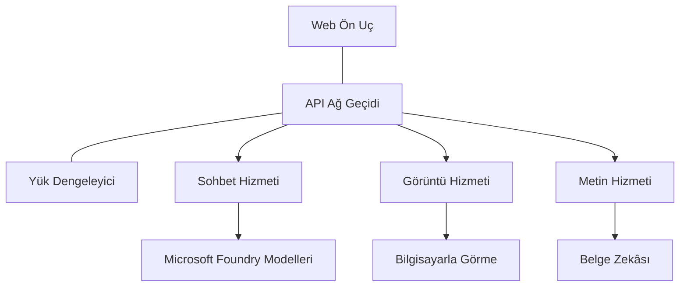

# Üretim AI İş Yükleri İçin AZD ile En İyi Uygulamalar

**Bölüm Navigasyonu:**
- **📚 Kurs Ana Sayfası**: [AZD For Beginners](../../README.md)
- **📖 Geçerli Bölüm**: Bölüm 8 - Üretim & Kurumsal Desenler
- **⬅️ Önceki Bölüm**: [Chapter 7: Troubleshooting](../chapter-07-troubleshooting/debugging.md)
- **⬅️ Ayrıca İlgili**: [AI Workshop Lab](ai-workshop-lab.md)
- **🎯 Kurs Tamamlandı**: [AZD For Beginners](../../README.md)

## Genel Bakış

Bu rehber, Azure Developer CLI (AZD) kullanarak üretime hazır AI iş yükleri dağıtımı için kapsamlı en iyi uygulamaları sağlar. Microsoft Foundry Discord topluluğundan ve gerçek müşteri dağıtımlarından gelen geri bildirimlere dayanan bu uygulamalar, üretim AI sistemlerindeki en yaygın zorlukları ele alır.

## Ele Alınan Temel Zorluklar

Topluluk anketi sonuçlarımıza göre geliştiricilerin karşılaştığı en önemli zorluklar şunlardır:

- **45%** çoklu servis AI dağıtımlarıyla mücadele ediyor
- **38%** kimlik bilgileri ve gizli yönetimi ile ilgili sorunlar yaşıyor  
- **35%** üretime hazır hale getirme ve ölçeklendirmeyi zor buluyor
- **32%** daha iyi maliyet optimizasyonu stratejilerine ihtiyaç duyuyor
- **29%** geliştirilmiş izleme ve sorun giderme gerektiriyor

## Üretim AI için Mimari Desenler

### Desen 1: Mikroservis AI Mimarisi

**Ne zaman kullanılmalı**: Birden çok yeteneğe sahip karmaşık AI uygulamaları


**AZD Uygulaması**:

```yaml
# azure.yaml
name: enterprise-ai-platform
services:
  web:
    project: ./web
    host: staticwebapp
  api-gateway:
    project: ./api-gateway
    host: containerapp
  chat-service:
    project: ./services/chat
    host: containerapp
  vision-service:
    project: ./services/vision
    host: containerapp
  text-service:
    project: ./services/text
    host: containerapp
```

### Desen 2: Olay Tabanlı AI İşleme

**Ne zaman kullanılmalı**: Toplu işleme, belge analizi, asenkron iş akışları

```bicep
// Event Hub for AI processing pipeline
resource eventHub 'Microsoft.EventHub/namespaces@2023-01-01-preview' = {
  name: eventHubNamespaceName
  location: location
  sku: {
    name: 'Standard'
    tier: 'Standard'
    capacity: 1
  }
}

// Service Bus for reliable message processing
resource serviceBus 'Microsoft.ServiceBus/namespaces@2022-10-01-preview' = {
  name: serviceBusNamespaceName
  location: location
  sku: {
    name: 'Premium'
    tier: 'Premium'
    capacity: 1
  }
}

// Function App for processing
resource functionApp 'Microsoft.Web/sites@2023-01-01' = {
  name: functionAppName
  location: location
  kind: 'functionapp,linux'
  properties: {
    siteConfig: {
      appSettings: [
        {
          name: 'FUNCTIONS_EXTENSION_VERSION'
          value: '~4'
        }
        {
          name: 'AZURE_OPENAI_ENDPOINT'
          value: '@Microsoft.KeyVault(VaultName=${keyVault.name};SecretName=openai-endpoint)'
        }
      ]
    }
  }
}
```

## AI Ajan Sağlığı Hakkında Düşünmek

Geleneksel bir web uygulaması bozulduğunda belirtiler tanıdıktır: bir sayfa yüklenmez, bir API hata döndürür veya bir dağıtım başarısız olur. AI destekli uygulamalar aynı şekillerde bozulabilir—ancak açık hata mesajları üretmeyen daha ince yollarla da kötü davranabilirler.

Bu bölüm, AI iş yüklerini izlemek için nerelere bakmanız gerektiğini bilmenizi sağlayacak zihinsel modeli oluşturmanıza yardımcı olur.

### Ajan Sağlığı Geleneksel Uygulama Sağlığından Nasıl Farklıdır

Geleneksel bir uygulama ya çalışır ya da çalışmaz. Bir AI ajanı çalışıyormuş gibi görünebilir ancak kötü sonuçlar üretebilir. Ajan sağlığını iki katmanda düşünün:

| Katman | Ne İzlenmeli | Nereye Bakılmalı |
|-------|--------------|---------------|
| **Altyapı sağlığı** | Hizmet çalışıyor mu? Kaynaklar tahsis edildi mi? Uç noktalar erişilebilir mi? | `azd monitor`, Azure Portal kaynak sağlığı, container/uygulama günlükleri |
| **Davranış sağlığı** | Ajan doğru yanıt veriyor mu? Yanıtlar zamanında mı? Model doğru şekilde çağrılıyor mu? | Application Insights izleri, model çağrısı gecikme metrikleri, yanıt kalite günlükleri |

Altyapı sağlığı tanıdıktır—herhangi bir azd uygulaması için aynıdır. Davranış sağlığı ise AI iş yüklerinin getirdiği yeni katmandır.

### AI Uygulamaları Beklendiği Gibi Davranmıyorsa Nereye Bakılmalı

AI uygulamanız beklediğiniz sonuçları üretmiyorsa, işte kavramsal bir kontrol listesi:

1. **Temellerle başlayın.** Uygulama çalışıyor mu? Bağımlılıklarına ulaşabiliyor mu? Herhangi bir uygulama için yaptığınız gibi `azd monitor` ve kaynak sağlığını kontrol edin.
2. **Model bağlantısını kontrol edin.** Uygulamanız AI modelini başarılı bir şekilde çağırıyor mu? Başarısız veya zaman aşımına uğrayan model çağrıları, AI uygulaması sorunlarının en yaygın nedenidir ve uygulama günlüklerinizde görünecektir.
3. **Modelin ne aldığına bakın.** AI yanıtları girişe (prompt ve alınan bağlam) bağlıdır. Çıktı yanlışsa, genellikle giriş yanlıştır. Uygulamanızın modele doğru verileri gönderip göndermediğini kontrol edin.
4. **Yanıt gecikmesini gözden geçirin.** AI model çağrıları tipik API çağrılarından daha yavaştır. Uygulamanız yavaş hissediyorsa, model yanıt sürelerinin artıp artmadığını kontrol edin—bu kısıtlanma, kapasite sınırları veya bölge düzeyinde yoğunluk göstergesi olabilir.
5. **Maliyet sinyallerine dikkat edin.** Token kullanımında veya API çağrılarında beklenmeyen artışlar bir döngü, yanlış yapılandırılmış bir prompt veya aşırı yeniden denemeler olduğunu gösterebilir.

Gözlemlenebilirlik araçlarını hemen ustalıkla kullanmanız gerekmez. Ana çıkarım, AI uygulamalarının izlenecek ek bir davranış katmanına sahip olduğu ve azd'nin yerleşik izleme (`azd monitor`) sizin için her iki katmanı da araştırmaya başlamanıza yardımcı olduğudur.

---

## Güvenlik En İyi Uygulamaları

### 1. Sıfır-Güven (Zero-Trust) Güvenlik Modeli

**Uygulama Stratejisi**:
- Kimlik doğrulama olmadan hizmetler arası iletişim yok
- Tüm API çağrıları yönetilen kimlikleri kullanır
- Özel uç noktalar ile ağ izolasyonu
- En az ayrıcalık erişim kontrolleri

```bicep
// Managed Identity for each service
resource chatServiceIdentity 'Microsoft.ManagedIdentity/userAssignedIdentities@2023-01-31' = {
  name: 'chat-service-identity'
  location: location
}

// Role assignments with minimal permissions
resource openAIUserRole 'Microsoft.Authorization/roleAssignments@2022-04-01' = {
  scope: openAIAccount
  name: guid(openAIAccount.id, chatServiceIdentity.id, openAIUserRoleDefinitionId)
  properties: {
    roleDefinitionId: subscriptionResourceId('Microsoft.Authorization/roleDefinitions', '5e0bd9bd-7b93-4f28-af87-19fc36ad61bd')
    principalId: chatServiceIdentity.properties.principalId
    principalType: 'ServicePrincipal'
  }
}
```

### 2. Güvenli Gizli Yönetimi

**Key Vault Entegrasyon Deseni**:

```bicep
// Key Vault with proper access policies
resource keyVault 'Microsoft.KeyVault/vaults@2023-02-01' = {
  name: keyVaultName
  location: location
  properties: {
    tenantId: tenant().tenantId
    sku: {
      family: 'A'
      name: 'premium'  // Use premium for production
    }
    enableRbacAuthorization: true  // Use RBAC instead of access policies
    enablePurgeProtection: true    // Prevent accidental deletion
    enableSoftDelete: true
    softDeleteRetentionInDays: 90
  }
}

// Store all AI service credentials
resource openAIKeySecret 'Microsoft.KeyVault/vaults/secrets@2023-02-01' = {
  parent: keyVault
  name: 'openai-api-key'
  properties: {
    value: openAIAccount.listKeys().key1
    attributes: {
      enabled: true
    }
  }
}
```

### 3. Ağ Güvenliği

**Özel Uç Nokta Yapılandırması**:

```bicep
// Virtual Network for AI services
resource virtualNetwork 'Microsoft.Network/virtualNetworks@2023-04-01' = {
  name: vnetName
  location: location
  properties: {
    addressSpace: {
      addressPrefixes: ['10.0.0.0/16']
    }
    subnets: [
      {
        name: 'ai-services-subnet'
        properties: {
          addressPrefix: '10.0.1.0/24'
          privateEndpointNetworkPolicies: 'Disabled'
        }
      }
      {
        name: 'app-services-subnet'
        properties: {
          addressPrefix: '10.0.2.0/24'
          delegations: [
            {
              name: 'Microsoft.Web/serverFarms'
              properties: {
                serviceName: 'Microsoft.Web/serverFarms'
              }
            }
          ]
        }
      }
    ]
  }
}

// Private endpoints for all AI services
resource openAIPrivateEndpoint 'Microsoft.Network/privateEndpoints@2023-04-01' = {
  name: '${openAIAccountName}-pe'
  location: location
  properties: {
    subnet: {
      id: virtualNetwork.properties.subnets[0].id
    }
    privateLinkServiceConnections: [
      {
        name: 'openai-connection'
        properties: {
          privateLinkServiceId: openAIAccount.id
          groupIds: ['account']
        }
      }
    ]
  }
}
```

## Performans ve Ölçeklendirme

### 1. Otomatik Ölçeklendirme Stratejileri

**Container Apps Otomatik Ölçeklendirme**:

```bicep
resource containerApp 'Microsoft.App/containerApps@2023-05-01' = {
  name: containerAppName
  location: location
  properties: {
    configuration: {
      ingress: {
        external: true
        targetPort: 8000
        transport: 'http'
      }
    }
    template: {
      scale: {
        minReplicas: 2  // Always have 2 instances minimum
        maxReplicas: 50 // Scale up to 50 for high load
        rules: [
          {
            name: 'http-scaling'
            http: {
              metadata: {
                concurrentRequests: '20'  // Scale when >20 concurrent requests
              }
            }
          }
          {
            name: 'cpu-scaling'
            custom: {
              type: 'cpu'
              metadata: {
                type: 'Utilization'
                value: '70'  // Scale when CPU >70%
              }
            }
          }
        ]
      }
    }
  }
}
```

### 2. Önbellekleme Stratejileri

**AI Yanıtları için Redis Önbelleği**:

```bicep
// Redis Premium for production workloads
resource redisCache 'Microsoft.Cache/redis@2023-04-01' = {
  name: redisCacheName
  location: location
  properties: {
    sku: {
      name: 'Premium'
      family: 'P'
      capacity: 1
    }
    enableNonSslPort: false
    minimumTlsVersion: '1.2'
    redisConfiguration: {
      'maxmemory-policy': 'allkeys-lru'
    }
    // Enable clustering for high availability
    redisVersion: '6.0'
    shardCount: 2
  }
}

// Cache configuration in application
var cacheConnectionString = '${redisCache.properties.hostName}:6380,password=${redisCache.listKeys().primaryKey},ssl=True,abortConnect=False'
```

### 3. Yük Dengeleme ve Trafik Yönetimi

**WAF'li Application Gateway**:

```bicep
// Application Gateway with Web Application Firewall
resource applicationGateway 'Microsoft.Network/applicationGateways@2023-04-01' = {
  name: appGatewayName
  location: location
  properties: {
    sku: {
      name: 'WAF_v2'
      tier: 'WAF_v2'
      capacity: 2
    }
    webApplicationFirewallConfiguration: {
      enabled: true
      firewallMode: 'Prevention'
      ruleSetType: 'OWASP'
      ruleSetVersion: '3.2'
    }
    // Backend pools for AI services
    backendAddressPools: [
      {
        name: 'ai-services-pool'
        properties: {
          backendAddresses: [
            {
              fqdn: '${containerApp.properties.configuration.ingress.fqdn}'
            }
          ]
        }
      }
    ]
  }
}
```

## 💰 Maliyet Optimizasyonu

### 1. Kaynakların Doğru Boyutlandırılması

**Ortam Özel Yapılandırmaları**:

```bash
# Geliştirme ortamı
azd env new development
azd env set AZURE_OPENAI_SKU "S0"
azd env set AZURE_OPENAI_CAPACITY 10
azd env set AZURE_SEARCH_SKU "basic"
azd env set CONTAINER_CPU 0.5
azd env set CONTAINER_MEMORY 1.0

# Üretim ortamı
azd env new production
azd env set AZURE_OPENAI_SKU "S0"
azd env set AZURE_OPENAI_CAPACITY 100
azd env set AZURE_SEARCH_SKU "standard"
azd env set CONTAINER_CPU 2.0
azd env set CONTAINER_MEMORY 4.0
```

### 2. Maliyet İzleme ve Bütçeler

```bicep
// Cost management and budgets
resource budget 'Microsoft.Consumption/budgets@2023-05-01' = {
  name: 'ai-workload-budget'
  properties: {
    timePeriod: {
      startDate: '2024-01-01'
      endDate: '2024-12-31'
    }
    timeGrain: 'Monthly'
    amount: 2000  // $2000 monthly budget
    category: 'Cost'
    notifications: {
      warning: {
        enabled: true
        operator: 'GreaterThan'
        threshold: 80
        contactEmails: [
          'finance@company.com'
          'engineering@company.com'
        ]
        contactRoles: [
          'Owner'
          'Contributor'
        ]
      }
      critical: {
        enabled: true
        operator: 'GreaterThan'
        threshold: 95
        contactEmails: [
          'cto@company.com'
        ]
      }
    }
  }
}
```

### 3. Token Kullanım Optimizasyonu

**OpenAI Maliyet Yönetimi**:

```typescript
// Uygulama düzeyinde token optimizasyonu
class TokenOptimizer {
  private readonly maxTokens = 4000;
  private readonly reserveTokens = 500;
  
  optimizePrompt(userInput: string, context: string): string {
    const availableTokens = this.maxTokens - this.reserveTokens;
    const estimatedTokens = this.estimateTokens(userInput + context);
    
    if (estimatedTokens > availableTokens) {
      // Bağlamı kısaltın, kullanıcı girdisini değil
      context = this.truncateContext(context, availableTokens - this.estimateTokens(userInput));
    }
    
    return `${context}\n\nUser: ${userInput}`;
  }
  
  private estimateTokens(text: string): number {
    // Kabaca tahmin: 1 token ≈ 4 karakter
    return Math.ceil(text.length / 4);
  }
}
```

## İzleme ve Gözlemlenebilirlik

### 1. Kapsamlı Application Insights

```bicep
// Application Insights with advanced features
resource applicationInsights 'Microsoft.Insights/components@2020-02-02' = {
  name: applicationInsightsName
  location: location
  kind: 'web'
  properties: {
    Application_Type: 'web'
    WorkspaceResourceId: logAnalyticsWorkspace.id
    SamplingPercentage: 100  // Full sampling for AI apps
    DisableIpMasking: false  // Enable for security
  }
}

// Custom metrics for AI operations
resource aiMetricAlerts 'Microsoft.Insights/metricAlerts@2018-03-01' = {
  name: 'ai-high-error-rate'
  location: 'global'
  properties: {
    description: 'Alert when AI service error rate is high'
    severity: 2
    enabled: true
    scopes: [
      applicationInsights.id
    ]
    evaluationFrequency: 'PT1M'
    windowSize: 'PT5M'
    criteria: {
      'odata.type': 'Microsoft.Azure.Monitor.SingleResourceMultipleMetricCriteria'
      allOf: [
        {
          name: 'high-error-rate'
          metricName: 'requests/failed'
          operator: 'GreaterThan'
          threshold: 10
          timeAggregation: 'Count'
        }
      ]
    }
  }
}
```

### 2. AI'ye Özel İzleme

**AI Metrikleri için Özel Panolar**:

```json
// Dashboard configuration for AI workloads
{
  "dashboard": {
    "name": "AI Application Monitoring",
    "tiles": [
      {
        "name": "OpenAI Request Volume",
        "query": "requests | where name contains 'openai' | summarize count() by bin(timestamp, 5m)"
      },
      {
        "name": "AI Response Latency",
        "query": "requests | where name contains 'openai' | summarize avg(duration) by bin(timestamp, 5m)"
      },
      {
        "name": "Token Usage",
        "query": "customMetrics | where name == 'openai_tokens_used' | summarize sum(value) by bin(timestamp, 1h)"
      },
      {
        "name": "Cost per Hour",
        "query": "customMetrics | where name == 'openai_cost' | summarize sum(value) by bin(timestamp, 1h)"
      }
    ]
  }
}
```

### 3. Sağlık Kontrolleri ve Çalışırlık İzleme

```bicep
// Application Insights availability tests
resource availabilityTest 'Microsoft.Insights/webtests@2022-06-15' = {
  name: 'ai-app-availability-test'
  location: location
  tags: {
    'hidden-link:${applicationInsights.id}': 'Resource'
  }
  properties: {
    SyntheticMonitorId: 'ai-app-availability-test'
    Name: 'AI Application Availability Test'
    Description: 'Tests AI application endpoints'
    Enabled: true
    Frequency: 300  // 5 minutes
    Timeout: 120    // 2 minutes
    Kind: 'ping'
    Locations: [
      {
        Id: 'us-east-2-azr'
      }
      {
        Id: 'us-west-2-azr'
      }
    ]
    Configuration: {
      WebTest: '''
        <WebTest Name="AI Health Check" 
                 Id="8d2de8d2-a2b0-4c2e-9a0d-8f9c9a0b8c8d" 
                 Enabled="True" 
                 CssProjectStructure="" 
                 CssIteration="" 
                 Timeout="120" 
                 WorkItemIds="" 
                 xmlns="http://microsoft.com/schemas/VisualStudio/TeamTest/2010" 
                 Description="" 
                 CredentialUserName="" 
                 CredentialPassword="" 
                 PreAuthenticate="True" 
                 Proxy="default" 
                 StopOnError="False" 
                 RecordedResultFile="" 
                 ResultsLocale="">
          <Items>
            <Request Method="GET" 
                     Guid="a5f10126-e4cd-570d-961c-cea43999a200" 
                     Version="1.1" 
                     Url="${webApp.properties.defaultHostName}/health" 
                     ThinkTime="0" 
                     Timeout="120" 
                     ParseDependentRequests="True" 
                     FollowRedirects="True" 
                     RecordResult="True" 
                     Cache="False" 
                     ResponseTimeGoal="0" 
                     Encoding="utf-8" 
                     ExpectedHttpStatusCode="200" 
                     ExpectedResponseUrl="" 
                     ReportingName="" 
                     IgnoreHttpStatusCode="False" />
          </Items>
        </WebTest>
      '''
    }
  }
}
```

## Felaket Kurtarma ve Yüksek Erişilebilirlik

### 1. Çok Bölgeli Dağıtım

```yaml
# azure.yaml - Multi-region configuration
name: ai-app-multiregion
services:
  api-primary:
    project: ./api
    host: containerapp
    env:
      - AZURE_REGION=eastus
  api-secondary:
    project: ./api
    host: containerapp
    env:
      - AZURE_REGION=westus2
```

```bicep
// Traffic Manager for global load balancing
resource trafficManager 'Microsoft.Network/trafficManagerProfiles@2022-04-01' = {
  name: trafficManagerProfileName
  location: 'global'
  properties: {
    profileStatus: 'Enabled'
    trafficRoutingMethod: 'Priority'
    dnsConfig: {
      relativeName: trafficManagerProfileName
      ttl: 30
    }
    monitorConfig: {
      protocol: 'HTTPS'
      port: 443
      path: '/health'
      intervalInSeconds: 30
      toleratedNumberOfFailures: 3
      timeoutInSeconds: 10
    }
    endpoints: [
      {
        name: 'primary-endpoint'
        type: 'Microsoft.Network/trafficManagerProfiles/azureEndpoints'
        properties: {
          targetResourceId: primaryAppService.id
          endpointStatus: 'Enabled'
          priority: 1
        }
      }
      {
        name: 'secondary-endpoint'
        type: 'Microsoft.Network/trafficManagerProfiles/azureEndpoints'
        properties: {
          targetResourceId: secondaryAppService.id
          endpointStatus: 'Enabled'
          priority: 2
        }
      }
    ]
  }
}
```

### 2. Veri Yedekleme ve Kurtarma

```bicep
// Backup configuration for critical data
resource backupVault 'Microsoft.DataProtection/backupVaults@2023-05-01' = {
  name: backupVaultName
  location: location
  identity: {
    type: 'SystemAssigned'
  }
  properties: {
    storageSettings: [
      {
        datastoreType: 'VaultStore'
        type: 'LocallyRedundant'
      }
    ]
  }
}

// Backup policy for AI models and data
resource backupPolicy 'Microsoft.DataProtection/backupVaults/backupPolicies@2023-05-01' = {
  parent: backupVault
  name: 'ai-data-backup-policy'
  properties: {
    policyRules: [
      {
        backupParameters: {
          backupType: 'Full'
          objectType: 'AzureBackupParams'
        }
        trigger: {
          schedule: {
            repeatingTimeIntervals: [
              'R/2024-01-01T02:00:00+00:00/P1D'  // Daily at 2 AM
            ]
          }
          objectType: 'ScheduleBasedTriggerContext'
        }
        dataStore: {
          datastoreType: 'VaultStore'
          objectType: 'DataStoreInfoBase'
        }
        name: 'BackupDaily'
        objectType: 'AzureBackupRule'
      }
    ]
  }
}
```

## DevOps ve CI/CD Entegrasyonu

### 1. GitHub Actions İş Akışı

```yaml
# .github/workflows/deploy-ai-app.yml
name: Deploy AI Application

on:
  push:
    branches: [main]
  pull_request:
    branches: [main]

jobs:
  test:
    runs-on: ubuntu-latest
    steps:
      - uses: actions/checkout@v4
      
      - name: Setup Python
        uses: actions/setup-python@v4
        with:
          python-version: '3.11'
          
      - name: Install dependencies
        run: |
          pip install -r requirements.txt
          pip install pytest
          
      - name: Run tests
        run: pytest tests/
        
      - name: AI Safety Tests
        run: |
          python scripts/test_ai_safety.py
          python scripts/validate_prompts.py

  deploy-staging:
    needs: test
    if: github.event_name == 'pull_request'
    runs-on: ubuntu-latest
    steps:
      - uses: actions/checkout@v4
      
      - name: Setup AZD
        uses: Azure/setup-azd@v1.0.0
        
      - name: Login to Azure
        uses: azure/login@v1
        with:
          creds: ${{ secrets.AZURE_CREDENTIALS }}
          
      - name: Deploy to Staging
        run: |
          azd env select staging
          azd deploy

  deploy-production:
    needs: test
    if: github.ref == 'refs/heads/main'
    runs-on: ubuntu-latest
    steps:
      - uses: actions/checkout@v4
      
      - name: Setup AZD
        uses: Azure/setup-azd@v1.0.0
        
      - name: Login to Azure
        uses: azure/login@v1
        with:
          creds: ${{ secrets.AZURE_CREDENTIALS }}
          
      - name: Deploy to Production
        run: |
          azd env select production
          azd deploy
          
      - name: Run Production Health Checks
        run: |
          python scripts/health_check.py --env production
```

### 2. Altyapı Doğrulama

```bash
# scripts/validate_infrastructure.sh
#!/bin/bash

echo "Validating AI infrastructure deployment..."

# Tüm gerekli servislerin çalışıp çalışmadığını kontrol edin
services=("openai" "search" "storage" "keyvault")
for service in "${services[@]}"; do
    echo "Checking $service..."
    if ! az resource list --resource-type "Microsoft.CognitiveServices/accounts" --query "[?contains(name, '$service')]" -o tsv; then
        echo "ERROR: $service not found"
        exit 1
    fi
done

# OpenAI model dağıtımlarını doğrulayın
echo "Validating OpenAI model deployments..."
models=$(az cognitiveservices account deployment list --name $AZURE_OPENAI_NAME --resource-group $AZURE_RESOURCE_GROUP --query "[].name" -o tsv)
if [[ ! $models == *"gpt-35-turbo"* ]]; then
    echo "ERROR: Required model gpt-35-turbo not deployed"
    exit 1
fi

# AI hizmeti bağlantısını test edin
echo "Testing AI service connectivity..."
python scripts/test_connectivity.py

echo "Infrastructure validation completed successfully!"
```

## Üretim Hazırlık Kontrol Listesi

### Güvenlik ✅
- [ ] Tüm hizmetler yönetilen kimlikleri kullanıyor
- [ ] Gizli bilgiler Key Vault'ta depolanıyor
- [ ] Özel uç noktalar yapılandırıldı
- [ ] Ağ güvenliği grupları uygulandı
- [ ] RBAC en az ayrıcalık ilkesiyle
- [ ] Genel uç noktalarda WAF etkin

### Performans ✅
- [ ] Otomatik ölçeklendirme yapılandırıldı
- [ ] Önbellekleme uygulandı
- [ ] Yük dengeleme kuruldu
- [ ] Statik içerik için CDN
- [ ] Veri tabanı bağlantı havuzu
- [ ] Token kullanım optimizasyonu

### İzleme ✅
- [ ] Application Insights yapılandırıldı
- [ ] Özel metrikler tanımlandı
- [ ] Uyarı kuralları yapılandırıldı
- [ ] Pano oluşturuldu
- [ ] Sağlık kontrolleri uygulandı
- [ ] Günlük saklama politikaları

### Güvenilirlik ✅
- [ ] Çok bölgeli dağıtım
- [ ] Yedekleme ve kurtarma planı
- [ ] Devre kesiciler uygulandı
- [ ] Yeniden deneme politikaları yapılandırıldı
- [ ] Kademeli bozulma
- [ ] Sağlık kontrol uç noktaları

### Maliyet Yönetimi ✅
- [ ] Bütçe uyarıları yapılandırıldı
- [ ] Kaynakların doğru boyutlandırılması
- [ ] Geliştirici/test indirimleri uygulandı
- [ ] Rezerve edilmiş örnekler satın alındı
- [ ] Maliyet izleme panosu
- [ ] Düzenli maliyet incelemeleri

### Uyumluluk ✅
- [ ] Veri konumu gereksinimleri karşılandı
- [ ] Denetim günlük kaydı etkinleştirildi
- [ ] Uyumluluk politikaları uygulandı
- [ ] Güvenlik temelleri uygulandı
- [ ] Düzenli güvenlik değerlendirmeleri
- [ ] Olay müdahale planı

## Performans Kıyaslamaları

### Tipik Üretim Metrikleri

| Metrik | Hedef | İzleme |
|--------|--------|------------|
| **Yanıt Süresi** | < 2 saniye | Application Insights |
| **Erişilebilirlik** | 99.9% | Çalışırlık izleme |
| **Hata Oranı** | < 0.1% | Uygulama günlükleri |
| **Token Kullanımı** | < $500/ay | Maliyet yönetimi |
| **Eşzamanlı Kullanıcılar** | 1000+ | Yük testleri |
| **Kurtarma Süresi** | < 1 saat | Felaket kurtarma testleri |

### Yük Testi

```bash
# Yapay zeka uygulamaları için yük testi betiği
python scripts/load_test.py \
  --endpoint https://your-ai-app.azurewebsites.net \
  --concurrent-users 100 \
  --duration 300 \
  --ramp-up 60
```

## 🤝 Topluluk En İyi Uygulamaları

Microsoft Foundry Discord topluluğu geri bildirimlerine dayanarak:

### Topluluğun En Önemli Önerileri:

1. **Küçük Başlayın, Kademeli Ölçekleyin**: Temel SKU'larla başlayın ve gerçek kullanım temelinde ölçeklendirin
2. **Her Şeyi İzleyin**: İlk günden itibaren kapsamlı izleme kurun
3. **Güvenliği Otomatikleştirin**: Tutarlı güvenlik için altyapıyı kod olarak kullanın
4. **Yaygın Test Yapın**: Pipeline'ınıza AI'ye özel testleri dahil edin
5. **Maliyetleri Planlayın**: Token kullanımını izleyin ve erken bütçe uyarıları oluşturun

### Kaçınılması Gereken Yaygın Tuzaklar:

- ❌ API anahtarlarını koda gömmek
- ❌ Uygun izlemeyi kurmamak
- ❌ Maliyet optimizasyonunu göz ardı etmek
- ❌ Hata senaryolarını test etmemek
- ❌ Sağlık kontrolleri olmadan dağıtım yapmak

## AZD AI CLI Komutları ve Uzantıları

AZD, üretim AI iş akışlarını kolaylaştıran AI'ye özel komut ve uzantıların büyüyen bir setini içerir. Bu araçlar yerel geliştirme ile üretim dağıtımı arasındaki boşluğu kapatır.

### AI için AZD Uzantıları

AZD, AI'ye özgü yetenekler eklemek için bir uzantı sistemi kullanır. Uzantıları şu şekilde kurup yönetin:

```bash
# Tüm kullanılabilir uzantıları listele (yapay zeka dahil)
azd extension list

# Foundry agents uzantısını yükle
azd extension install azure.ai.agents

# İnce ayar uzantısını yükle
azd extension install azure.ai.finetune

# Özel modeller uzantısını yükle
azd extension install azure.ai.models

# Tüm yüklü uzantıları yükselt
azd extension upgrade --all
```

**Mevcut AI uzantıları:**

| Uzantı | Amaç | Durum |
|-----------|---------|--------|
| `azure.ai.agents` | Foundry Agent Service yönetimi | Önizleme |
| `azure.ai.finetune` | Foundry model ince ayarı | Önizleme |
| `azure.ai.models` | Foundry özel modeller | Önizleme |
| `azure.coding-agent` | Kodlama ajanı yapılandırması | Mevcut |

### `azd ai agent init` ile Ajan Projelerini Başlatma

`azd ai agent init` komutu, Microsoft Foundry Agent Service ile entegre edilmiş üretime hazır bir AI ajan projesinin iskeletini oluşturur:

```bash
# Bir ajan manifestinden yeni bir ajan projesi başlatın
azd ai agent init -m <manifest-path-or-uri>

# Belirli bir Foundry projesini başlatın ve hedefleyin
azd ai agent init -m agent-manifest.yaml --project-id <foundry-project-id>

# Özel bir kaynak diziniyle başlatın
azd ai agent init -m agent-manifest.yaml --src ./agents/my-agent

# Container Apps'i host olarak hedefleyin
azd ai agent init -m agent-manifest.yaml --host containerapp
```

**Önemli bayraklar:**

| Bayrak | Açıklama |
|------|-------------|
| `-m, --manifest` | Projenize eklemek için bir ajan manifesti yolu veya URI'si |
| `-p, --project-id` | azd ortamınız için mevcut Microsoft Foundry Proje Kimliği |
| `-s, --src` | Ajan tanımını indirmek için dizin (varsayılan `src/<agent-id>`) |
| `--host` | Varsayılan host'u geçersiz kıl (örn. `containerapp`) |
| `-e, --environment` | Kullanılacak azd ortamı |

**Üretim ipucu**: `--project-id` kullanarak doğrudan mevcut bir Foundry projesine bağlanın; böylece ajan kodunuz ve bulut kaynaklarınız baştan itibaren bağlı kalır.

### `azd mcp` ile Model Bağlam Protokolü (MCP)

AZD, yerleşik MCP sunucusu desteği (Alpha) içerir; bu, AI ajanlarının ve araçlarının standartlaştırılmış bir protokol aracılığıyla Azure kaynaklarınızla etkileşim kurmasını sağlar:

```bash
# Projeniz için MCP sunucusunu başlatın
azd mcp start

# MCP işlemleri için araç onaylarını yönetin
azd mcp consent
```

MCP sunucusu, azd proje bağlamınızı—ortamlar, hizmetler ve Azure kaynakları—AI destekli geliştirme araçlarına açar. Bu şunları sağlar:

- **AI destekli dağıtım**: Kodlama ajanlarının proje durumunuzu sorgulayıp dağıtımları tetiklemesine izin verin
- **Kaynak keşfi**: AI araçları projenizin hangi Azure kaynaklarını kullandığını keşfedebilir
- **Ortam yönetimi**: Ajanlar dev/staging/production ortamları arasında geçiş yapabilir

### `azd infra generate` ile Altyapı Üretimi

Üretim AI iş yükleri için otomatik sağlamaya güvenmek yerine Altyapıyı Kod olarak oluşturup özelleştirebilirsiniz:

```bash
# Proje tanımınızdan Bicep/Terraform dosyaları oluşturun
azd infra generate
```

Bu, IaC'i diske yazar, böylece şunları yapabilirsiniz:
- Dağıtımdan önce altyapıyı gözden geçirmek ve denetlemek
- Özel güvenlik politikaları eklemek (ağ kuralları, özel uç noktalar)
- Mevcut IaC inceleme süreçleriyle entegre etmek
- Altyapı değişikliklerini uygulama kodundan ayrı olarak versiyon kontrolüne almak

### Üretim Yaşam Döngüsü Kancaları

AZD kancaları, dağıtım yaşam döngüsünün her aşamasına özel mantık enjekte etmenizi sağlar—üretim AI iş akışları için kritik önemdedir:

```yaml
# azure.yaml - Production hooks example
name: ai-production-app
hooks:
  preprovision:
    shell: sh
    run: scripts/validate-quotas.sh    # Check AI model quota before provisioning
  postprovision:
    shell: sh
    run: scripts/configure-networking.sh  # Set up private endpoints
  predeploy:
    shell: sh
    run: scripts/run-ai-safety-tests.sh  # Run prompt safety checks
  postdeploy:
    shell: sh
    run: scripts/smoke-test.sh           # Verify agent responses post-deploy
services:
  agent-api:
    project: ./src/agent
    host: containerapp
    hooks:
      predeploy:
        shell: sh
        run: scripts/validate-model-access.sh  # Per-service hook
```

```bash
# Geliştirme sırasında belirli bir kancayı manuel olarak çalıştırın
azd hooks run predeploy
```

**AI iş yükleri için önerilen üretim kancaları:**

| Hook | Kullanım Durumu |
|------|----------|
| `preprovision` | AI model kapasitesi için abonelik kotalarını doğrulayın |
| `postprovision` | Özel uç noktaları yapılandırın, model ağırlıklarını dağıtın |
| `predeploy` | AI güvenlik testleri çalıştırın, prompt şablonlarını doğrulayın |
| `postdeploy` | Ajan yanıtlarını duman testi ile kontrol edin, model bağlantısını doğrulayın |

### CI/CD Pipeline Yapılandırması

Projenizi güvenli Azure kimlik doğrulaması ile GitHub Actions veya Azure Pipelines'a bağlamak için `azd pipeline config` kullanın:

```bash
# CI/CD boru hattını yapılandır (etkileşimli)
azd pipeline config

# Belirli bir sağlayıcıyla yapılandır
azd pipeline config --provider github
```

Bu komut:
- En az ayrıcalıklı erişime sahip bir service principal oluşturur
- Federated credentials yapılandırır (saklanan gizli bilgiler yok)
- Pipeline tanım dosyanızı oluşturur veya günceller
- CI/CD sisteminizde gereken ortam değişkenlerini ayarlar

**Pipeline yapılandırması ile üretim iş akışı:**

```bash
# 1. Üretim ortamını kurun
azd env new production
azd env set AZURE_OPENAI_CAPACITY 100

# 2. Boru hattını yapılandırın
azd pipeline config --provider github

# 3. Boru hattı, main'e yapılan her push'ta azd deploy çalıştırır
```

### `azd add` ile Bileşen Ekleme

Mevcut bir projeye Azure hizmetlerini kademeli olarak ekleyin:

```bash
# Yeni bir servis bileşenini etkileşimli olarak ekle
azd add
```

Bu, üretim AI uygulamalarını genişletmek için özellikle kullanışlıdır—örneğin, bir vektör arama hizmeti eklemek, yeni bir ajan uç noktası eklemek veya mevcut bir dağıtıma izleme bileşeni eklemek.

## Ek Kaynaklar
- **Azure Well-Architected Framework**: [AI iş yükü yönergeleri](https://learn.microsoft.com/azure/well-architected/ai/)
- **Microsoft Foundry Documentation**: [Resmi belgeler](https://learn.microsoft.com/azure/ai-studio/)
- **Community Templates**: [Azure Örnekleri](https://github.com/Azure-Samples)
- **Discord Community**: [#Azure kanalı](https://discord.gg/microsoft-azure)
- **Agent Skills for Azure**: [microsoft/github-copilot-for-azure on skills.sh](https://skills.sh/microsoft/github-copilot-for-azure) - Azure AI, Foundry, dağıtım, maliyet optimizasyonu ve tanılama için 37 açık ajan becerisi. Düzenleyicinize kurun:
  ```bash
  npx skills add microsoft/github-copilot-for-azure
  ```

---

**Bölüm Gezintisi:**
- **📚 Kurs Ana Sayfası**: [AZD Yeni Başlayanlar İçin](../../README.md)
- **📖 Geçerli Bölüm**: Bölüm 8 - Üretim ve Kurumsal Kalıplar
- **⬅️ Önceki Bölüm**: [Bölüm 7: Sorun Giderme](../chapter-07-troubleshooting/debugging.md)
- **⬅️ Ayrıca İlgili**: [AI Workshop Lab](ai-workshop-lab.md)
- **� Kurs Tamamlandı**: [AZD Yeni Başlayanlar İçin](../../README.md)

**Unutmayın**: Üretim yapay zeka iş yükleri dikkatli planlama, izleme ve sürekli optimizasyon gerektirir. Bu kalıplarla başlayın ve bunları özel gereksinimlerinize uyarlayın.

---

<!-- CO-OP TRANSLATOR DISCLAIMER START -->
**Feragatname**:
Bu belge AI çeviri hizmeti [Co-op Translator](https://github.com/Azure/co-op-translator) kullanılarak çevrilmiştir. Doğruluk konusunda özen göstersek de, otomatik çevirilerin hatalar veya yanlışlıklar içerebileceğini lütfen unutmayın. Orijinal belge, kendi ana dilindeki versiyonu yetkili kaynak olarak kabul edilmelidir. Kritik bilgiler için profesyonel insan çevirisi önerilir. Bu çevirinin kullanımı sonucunda ortaya çıkabilecek herhangi bir yanlış anlama veya yanlış yorumlamadan sorumlu değiliz.
<!-- CO-OP TRANSLATOR DISCLAIMER END -->